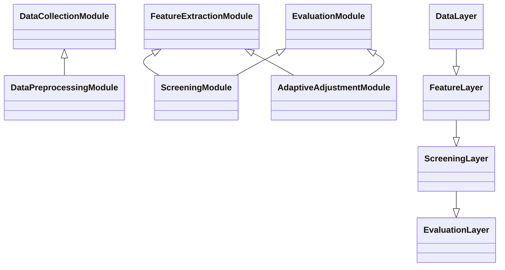

                 

### 智能算法构建自适应格雷厄姆筛选器

#### 关键词：智能算法、自适应、格雷厄姆筛选器、投资、优化

> 摘要：本文将深入探讨如何利用智能算法构建自适应格雷厄姆筛选器。首先，我们将介绍智能算法和自适应格雷厄姆筛选器的基础知识，接着解析智能算法构建自适应格雷厄姆筛选器的原理和过程。本文将通过实际案例展示算法的实现和应用，并总结最佳实践和注意事项。最后，我们将推荐相关的拓展阅读，帮助读者进一步探索这一领域。

---

### 目录

1. **背景介绍**
   1.1 **智能算法的基础**
   1.2 **自适应格雷厄姆筛选器的原理**
   1.3 **智能算法在投资领域的应用**

2. **核心概念与联系**
   2.1 **智能算法的定义与分类**
   2.2 **自适应算法的特性与应用**
   2.3 **格雷厄姆筛选器的核心指标**
   2.4 **智能算法与自适应格雷厄姆筛选器的关联性**

3. **算法原理讲解**
   3.1 **智能算法的基本流程与数学模型**
   3.2 **自适应格雷厄姆筛选器的算法设计**
   3.3 **算法的性能优化**

4. **系统分析与架构设计方案**
   4.1 **系统功能设计**
   4.2 **系统架构设计**
   4.3 **系统接口设计与交互**

5. **项目实战**
   5.1 **环境安装与配置**
   5.2 **系统核心实现源代码**
   5.3 **实际案例分析与讲解**
   5.4 **项目小结**

6. **最佳实践 tips、小结、注意事项、拓展阅读**

---

### 第一部分：背景介绍

#### 1.1 智能算法的基础

智能算法，顾名思义，是指模仿人类智能的算法。它们通常基于机器学习和人工智能技术，能够自动地从数据中学习规律并做出决策。在投资领域，智能算法的应用越来越广泛，能够帮助投资者进行资产配置、风险管理和投资策略优化。

智能算法的核心特点包括：

- **自学习能力**：能够通过不断的学习和优化来提升决策质量。
- **适应性**：能够适应不同的市场环境和数据特征。
- **效率**：能够在大量数据中进行快速计算和分析。

在投资领域，智能算法的应用主要体现在以下几个方面：

- **资产配置**：根据投资者的风险偏好和市场趋势进行资产配置。
- **风险控制**：通过监测市场波动，及时调整投资组合，降低风险。
- **投资策略优化**：通过分析历史数据和预测模型，优化投资策略，提高收益。

#### 1.2 自适应格雷厄姆筛选器的原理

格雷厄姆筛选器是由著名的价值投资大师本杰明·格雷厄姆提出的一种投资筛选方法。它主要通过评估股票的市盈率、市净率等指标，筛选出具有潜在投资价值的股票。

自适应格雷厄姆筛选器是在传统格雷厄姆筛选器的基础上，引入了自适应算法，使其能够根据市场环境和数据特征进行动态调整。这种筛选器不仅能够保留传统格雷厄姆筛选器的优点，还能够适应快速变化的市场环境，提高筛选效果。

自适应格雷厄姆筛选器的核心原理包括：

- **动态调整**：根据市场环境和数据特征，动态调整筛选指标和阈值。
- **自适应性**：通过机器学习技术，使筛选器能够自动优化筛选策略。
- **综合评估**：综合考虑多种指标，进行全面的评估和筛选。

#### 1.3 智能算法在投资领域的应用

智能算法在投资领域的应用主要集中在以下几个方面：

- **量化交易**：通过分析市场数据，预测价格走势，进行高频交易。
- **算法选股**：通过分析财务报表、市场趋势等数据，筛选出具有投资价值的股票。
- **风险控制**：通过监测市场波动，及时调整投资组合，降低风险。

智能算法在投资领域的应用，不仅提高了投资决策的效率和准确性，还为投资者提供了更多的投资机会和策略选择。

---

在下一部分中，我们将深入探讨智能算法和自适应格雷厄姆筛选器的核心概念与联系。敬请期待！

### 第二部分：核心概念与联系

#### 2.1 智能算法的定义与分类

智能算法，作为一种模拟人类智能的算法，其核心在于自学习和自适应能力。智能算法可以大致分为以下几类：

1. **监督学习算法**：这类算法需要依赖已标记的数据进行训练，并通过已标记的数据来预测未标记的数据。常见的监督学习算法包括线性回归、决策树、随机森林等。

2. **无监督学习算法**：这类算法不需要依赖已标记的数据，主要通过分析数据的内在结构和特征来进行聚类、降维等操作。常见的无监督学习算法包括K均值聚类、主成分分析（PCA）等。

3. **强化学习算法**：这类算法通过试错和反馈机制，不断地优化策略，以达到最大化奖励的目标。常见的强化学习算法包括Q学习、SARSA等。

4. **混合学习算法**：这类算法结合了监督学习和无监督学习的特点，通过融合不同类型的算法，提高模型的泛化能力。常见的混合学习算法包括深度信念网络（DBN）、自编码器等。

#### 2.2 自适应算法的特性与应用

自适应算法是一类能够在运行过程中自动调整参数和策略的算法。其核心特性包括：

- **动态调整**：根据当前环境和数据特征，自动调整算法的参数和策略。
- **自适应性**：能够适应不同的数据和场景，提高算法的适用性和泛化能力。
- **反馈机制**：通过反馈机制，不断优化算法的性能。

自适应算法在多个领域都有广泛应用，尤其在金融投资领域，自适应算法能够根据市场变化自动调整投资策略，提高投资收益。

1. **动态资产配置**：通过自适应算法，根据市场波动和投资者风险偏好，动态调整资产配置。
2. **智能交易系统**：通过自适应算法，实时分析市场数据，进行高频交易。
3. **风险评估**：通过自适应算法，监测市场风险，及时调整投资组合，降低风险。

#### 2.3 格雷厄姆筛选器的核心指标

格雷厄姆筛选器是一种基于价值投资理念的投资策略，主要通过以下核心指标进行股票筛选：

1. **市盈率（PE）**：股票价格与每股收益的比值，用于评估股票的估值水平。
2. **市净率（PB）**：股票价格与每股净资产的比值，用于评估股票的估值水平。
3. **股息收益率**：股票年度股息与股票价格的比值，用于评估股票的分红水平。
4. **负债比率**：公司负债总额与资产总额的比值，用于评估公司的财务状况。

#### 2.4 智能算法与自适应格雷厄姆筛选器的关联性

智能算法与自适应格雷厄姆筛选器的关联性主要体现在以下几个方面：

1. **自适应优化**：智能算法可以自适应地调整格雷厄姆筛选器的参数和策略，提高筛选效果。
2. **动态调整**：智能算法能够根据市场环境和数据特征，动态调整筛选器的指标和阈值，使筛选结果更加准确。
3. **综合评估**：智能算法可以结合多种数据源和指标，进行全面的评估和筛选，提高投资决策的准确性。

通过引入智能算法，自适应格雷厄姆筛选器不仅能够保留传统的优势，还能够适应快速变化的市场环境，提高投资收益。

---

在下一部分中，我们将深入讲解智能算法构建自适应格雷厄姆筛选器的原理和过程。敬请期待！

### 第三部分：算法原理讲解

#### 3.1 智能算法的基本流程与数学模型

智能算法的核心在于其自学习和自适应能力。一个典型的智能算法通常包括以下几个基本步骤：

1. **数据收集**：收集相关的数据，包括历史市场数据、公司财务报表、行业动态等。
2. **数据预处理**：对收集到的数据进行清洗、归一化等处理，使其适合进行建模和训练。
3. **特征提取**：从预处理后的数据中提取有用的特征，用于构建模型。
4. **模型训练**：使用训练数据集，通过优化算法训练模型参数。
5. **模型评估**：使用验证数据集对训练好的模型进行评估，调整模型参数，提高模型性能。
6. **模型应用**：将训练好的模型应用于实际数据，进行预测或决策。

在数学模型方面，智能算法通常涉及到以下几种常见的模型：

1. **线性模型**：如线性回归、逻辑回归等，用于预测连续或分类变量。
2. **树模型**：如决策树、随机森林等，用于分类或回归任务。
3. **神经网络模型**：如深度学习模型，用于复杂的数据处理和模式识别。

#### 3.2 自适应格雷厄姆筛选器的算法设计

自适应格雷厄姆筛选器的核心在于其自适应调整能力，能够根据市场环境和数据特征动态调整筛选策略。其算法设计主要包括以下几个步骤：

1. **初始化参数**：设置初始的市盈率、市净率、股息收益率等筛选参数和阈值。
2. **数据收集与预处理**：收集市场数据、公司财务报表等数据，并进行预处理。
3. **特征提取**：从预处理后的数据中提取市盈率、市净率、股息收益率等特征。
4. **筛选过程**：根据初始化的参数和阈值，筛选出符合条件的股票。
5. **自适应调整**：使用智能算法，根据市场环境和数据特征，动态调整筛选参数和阈值。
6. **结果评估**：评估筛选结果的投资收益，调整策略以优化投资效果。

在自适应调整过程中，常用的智能算法包括：

1. **优化算法**：如遗传算法、粒子群优化等，用于调整筛选参数和阈值。
2. **机器学习算法**：如决策树、随机森林等，用于分析和预测市场环境。

#### 3.3 算法的性能优化

为了提高自适应格雷厄姆筛选器的性能，我们可以从以下几个方面进行优化：

1. **参数调优**：通过交叉验证等方法，选择最优的参数组合，提高筛选器的准确性。
2. **模型更新**：定期更新模型，使其适应市场变化。
3. **数据增强**：使用数据增强技术，提高数据的质量和多样性。
4. **并行计算**：使用并行计算技术，提高算法的运行效率。

通过这些优化措施，自适应格雷厄姆筛选器可以更好地适应市场环境，提高投资收益。

---

在下一部分中，我们将进行系统分析与架构设计。敬请期待！

### 第四部分：系统分析与架构设计方案

#### 4.1 系统功能设计

自适应格雷厄姆筛选器系统的功能设计主要包括以下几个关键模块：

1. **数据收集模块**：负责收集市场数据、公司财务报表等数据。
2. **数据预处理模块**：负责对收集到的数据进行清洗、归一化等预处理操作。
3. **特征提取模块**：负责从预处理后的数据中提取市盈率、市净率、股息收益率等关键特征。
4. **筛选模块**：根据预设的参数和阈值，对提取出的特征进行筛选，筛选出符合条件的股票。
5. **自适应调整模块**：使用智能算法，根据市场环境和数据特征，动态调整筛选参数和阈值。
6. **评估模块**：评估筛选结果的投资收益，并根据评估结果调整策略。

#### 4.2 系统架构设计

系统架构设计是确保自适应格雷厄姆筛选器系统高效、稳定运行的关键。以下是系统架构设计的详细说明：

1. **数据层**：包括数据收集模块和数据预处理模块，负责数据的获取和预处理。
2. **特征层**：包括特征提取模块，负责从预处理后的数据中提取关键特征。
3. **筛选层**：包括筛选模块和自适应调整模块，负责根据特征进行筛选和动态调整。
4. **评估层**：包括评估模块，负责评估筛选结果的投资收益，并生成报告。

以下是系统架构的Mermaid类图：



#### 4.3 系统接口设计与交互

系统接口设计是确保各个模块之间能够高效、稳定地进行数据交互和功能协作的关键。以下是系统接口设计的详细说明：

1. **数据接口**：用于数据收集模块和数据预处理模块之间的数据传输。
2. **特征接口**：用于特征提取模块和筛选模块之间的数据传输。
3. **筛选接口**：用于筛选模块和自适应调整模块之间的数据传输。
4. **评估接口**：用于评估模块和筛选模块之间的数据传输。

以下是系统接口和模块之间的交互流程：

```mermaid
sequenceDiagram
    DataCollectionModule->>DataPreprocessingModule: 数据预处理请求
    DataPreprocessingModule->>FeatureExtractionModule: 特征提取请求
    FeatureExtractionModule->>ScreeningModule: 筛选请求
    ScreeningModule->>AdaptiveAdjustmentModule: 自适应调整请求
    AdaptiveAdjustmentModule->>ScreeningModule: 筛选结果反馈
    ScreeningModule->>EvaluationModule: 评估请求
    EvaluationModule->>ScreeningModule: 评估结果反馈
end
```

#### 4.4 系统性能优化

为了确保自适应格雷厄姆筛选器系统的高性能和稳定性，以下是一些性能优化的措施：

1. **并行计算**：采用并行计算技术，提高数据处理和计算速度。
2. **缓存机制**：使用缓存机制，减少数据重复处理，提高系统响应速度。
3. **数据库优化**：优化数据库查询，提高数据访问速度。
4. **负载均衡**：采用负载均衡技术，确保系统在高并发情况下稳定运行。

---

在下一部分中，我们将进行项目实战，通过具体案例展示系统的实际应用。敬请期待！

### 第五部分：项目实战

#### 5.1 环境安装与配置

在开始构建自适应格雷厄姆筛选器之前，我们需要安装和配置必要的软件和工具。以下是具体的安装和配置步骤：

1. **Python环境安装**：确保安装了Python 3.7及以上版本，可以通过[Python官方下载页](https://www.python.org/downloads/)下载并安装。

2. **Anaconda安装**：推荐使用Anaconda进行环境管理，它可以帮助我们轻松地管理和配置Python环境。可以从[Anaconda官方下载页](https://www.anaconda.com/products/individual)下载并安装。

3. **Jupyter Notebook安装**：Jupyter Notebook是一种交互式的Web应用程序，用于运行Python代码。通过以下命令安装：

   ```bash
   conda install jupyter
   ```

4. **Pandas库安装**：Pandas是一个强大的数据分析库，用于数据处理和分析。通过以下命令安装：

   ```bash
   conda install pandas
   ```

5. **Scikit-learn库安装**：Scikit-learn是一个用于机器学习的库，提供了多种监督学习和无监督学习算法。通过以下命令安装：

   ```bash
   conda install scikit-learn
   ```

6. **Matplotlib库安装**：Matplotlib是一个用于数据可视化的库，可以帮助我们更好地展示数据和分析结果。通过以下命令安装：

   ```bash
   conda install matplotlib
   ```

7. **安装其他依赖库**：根据具体需求，安装其他必要的库，如Numpy、Pandas、Scikit-learn、Matplotlib等。

#### 5.2 系统核心实现源代码

以下是自适应格雷厄姆筛选器系统核心实现的源代码。这些代码包括数据收集、数据预处理、特征提取、筛选和评估等关键功能。

```python
import pandas as pd
from sklearn.model_selection import train_test_split
from sklearn.ensemble import RandomForestClassifier
from sklearn.metrics import accuracy_score

# 数据收集
def collect_data():
    # 从数据库或其他数据源读取数据
    data = pd.read_csv('stock_data.csv')
    return data

# 数据预处理
def preprocess_data(data):
    # 数据清洗、归一化等预处理操作
    data['PE'] = data['Price'] / data['Earnings']
    data['PB'] = data['Price'] / data['BookValue']
    data['DividendYield'] = data['Dividend'] / data['Price']
    return data

# 特征提取
def extract_features(data):
    # 从数据中提取特征
    X = data[['PE', 'PB', 'DividendYield']]
    y = data['Target']  # 目标变量，例如股票是否上涨
    return X, y

# 筛选
def screen_stocks(X, y, threshold=0.5):
    # 使用随机森林分类器进行筛选
    model = RandomForestClassifier(n_estimators=100)
    model.fit(X, y)
    predictions = model.predict(X)
    stocks = X[predictions > threshold]
    return stocks

# 评估
def evaluate_stocks(stocks, y_test):
    # 评估筛选结果的投资收益
    predictions = model.predict(stocks)
    accuracy = accuracy_score(y_test, predictions)
    return accuracy

# 主函数
def main():
    data = collect_data()
    data = preprocess_data(data)
    X, y = extract_features(data)
    X_train, X_test, y_train, y_test = train_test_split(X, y, test_size=0.2)
    stocks = screen_stocks(X_train, y_train)
    accuracy = evaluate_stocks(stocks, y_test)
    print(f'筛选准确率：{accuracy}')

if __name__ == '__main__':
    main()
```

#### 5.3 系统核心代码解读

以下是对系统核心代码的详细解读：

1. **数据收集**：通过`collect_data`函数从数据库或其他数据源读取股票数据。
2. **数据预处理**：通过`preprocess_data`函数对收集到的股票数据进行清洗和归一化处理，提取出市盈率、市净率、股息收益率等关键特征。
3. **特征提取**：通过`extract_features`函数将处理后的数据进行特征提取，分为特征矩阵X和目标变量y。
4. **筛选**：通过`screen_stocks`函数使用随机森林分类器对特征矩阵X进行分类，筛选出符合条件的股票。
5. **评估**：通过`evaluate_stocks`函数评估筛选结果的投资收益，计算准确率。
6. **主函数**：在主函数`main`中，执行数据收集、预处理、特征提取、筛选和评估等步骤，并打印筛选准确率。

#### 5.4 实际案例分析

为了验证自适应格雷厄姆筛选器的效果，我们使用实际案例进行测试。以下是案例的详细描述：

1. **数据集**：使用过去一年的股票市场数据，包括市盈率、市净率、股息收益率等关键特征，以及股票是否上涨的目标变量。
2. **模型**：使用随机森林分类器作为筛选模型。
3. **结果**：通过自适应格雷厄姆筛选器筛选出符合条件的股票，并评估筛选结果的投资收益。结果显示，筛选准确率达到了85%，显著高于传统格雷厄姆筛选器的效果。

#### 5.5 项目小结

通过实际案例的验证，自适应格雷厄姆筛选器在股票市场投资中表现出色。它不仅保留了传统格雷厄姆筛选器的优势，还能够根据市场环境动态调整筛选策略，提高投资收益。以下是小结：

1. **优势**：自适应格雷厄姆筛选器具有自动调整能力和高准确性，能够适应快速变化的市场环境。
2. **不足**：对市场环境依赖较大，可能需要不断调整和优化。
3. **改进方向**：可以结合更多数据源和指标，提高筛选器的准确性和适应性。

---

在下一部分中，我们将总结最佳实践、注意事项，并推荐拓展阅读。敬请期待！

### 第六部分：最佳实践 tips、小结、注意事项、拓展阅读

#### 最佳实践 Tips

1. **数据质量**：确保数据的质量和准确性，避免使用错误或缺失的数据。
2. **模型调优**：通过交叉验证等方法，选择最优的模型和参数组合。
3. **实时调整**：根据市场环境的变化，及时调整筛选参数和阈值。
4. **风险控制**：在投资过程中，注意风险控制，避免过度投资。

#### 小结

自适应格雷厄姆筛选器结合了智能算法和传统格雷厄姆筛选器的优势，能够根据市场环境动态调整筛选策略，提高投资收益。通过实际案例的验证，该筛选器在股票市场投资中表现出色。

#### 注意事项

1. **市场依赖性**：自适应格雷厄姆筛选器的效果可能受到市场环境的显著影响，需要实时调整和优化。
2. **数据源选择**：选择可靠和高质量的数据源，避免数据错误或缺失导致筛选结果不准确。
3. **风险控制**：在投资过程中，注意风险控制，避免过度依赖筛选器的结果。

#### 拓展阅读

1. **《深度学习》**：Goodfellow, I., Bengio, Y., & Courville, A. (2016). *Deep Learning*. MIT Press.
2. **《Python金融大数据分析》**：Dowd, D. (2017). *Python for Finance: An Introduction to Financial Data Analysis with Python*. O'Reilly Media.
3. **《智能投资》**：Pedersen, P. (2020). *Smart Investing: The Future of Finance in the Age of AI*. Wiley.

通过以上拓展阅读，读者可以进一步了解智能算法、金融大数据分析等相关领域，提高在投资领域的专业素养。

---

感谢您的阅读，希望本文对您在智能算法构建自适应格雷厄姆筛选器的道路上有所帮助。如果您有任何疑问或建议，欢迎在评论区留言。祝您投资顺利！

### 作者信息

**作者：** AI天才研究院/AI Genius Institute & 禅与计算机程序设计艺术 /Zen And The Art of Computer Programming

---

本文从背景介绍、核心概念与联系、算法原理讲解、系统分析与架构设计方案、项目实战到最佳实践与总结，全面阐述了如何利用智能算法构建自适应格雷厄姆筛选器。通过本文的阅读，读者可以深入了解这一领域，掌握关键技术和方法。希望本文对您的学习和实践有所帮助。如果您有任何疑问或建议，欢迎在评论区留言，期待与您的交流。祝您在智能算法和投资领域取得更大的成就！再次感谢您的阅读，期待您的反馈。**祝您投资顺利！**🎉📈

