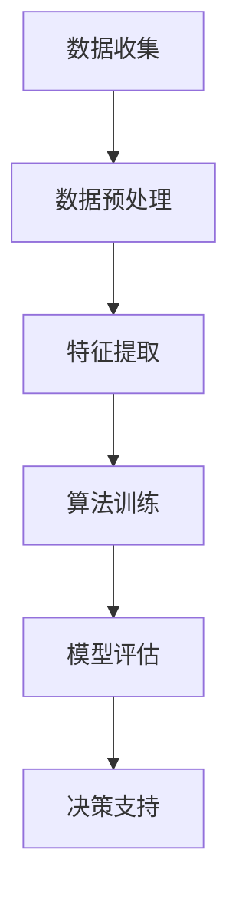
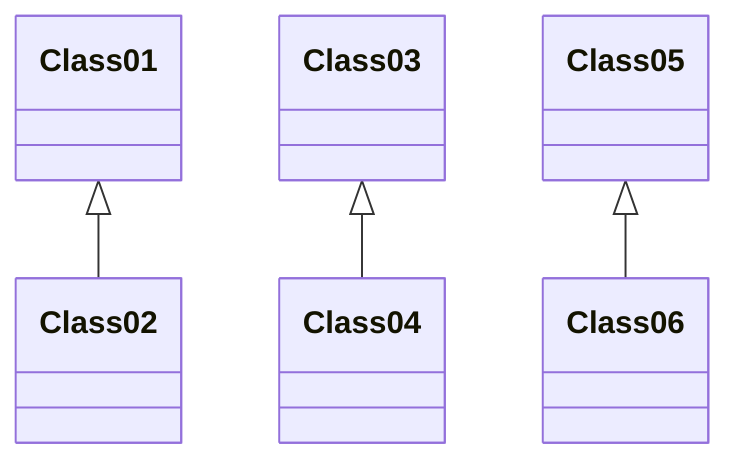
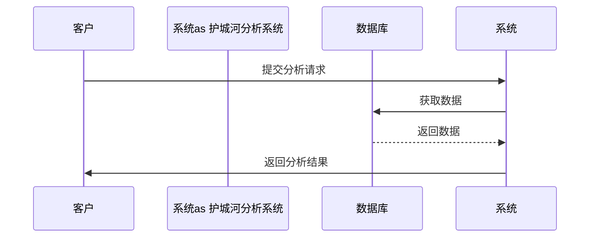
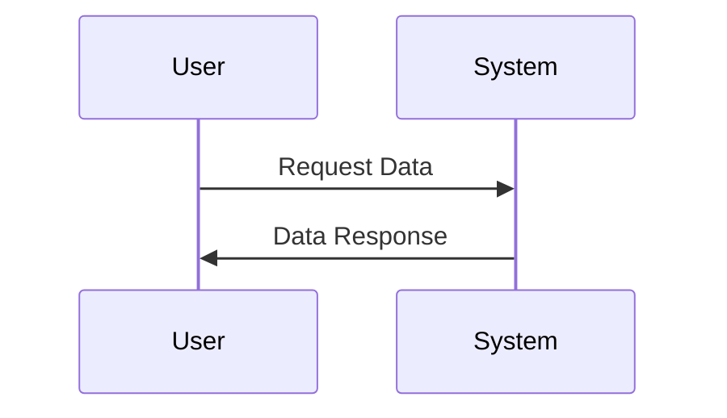

                 

### 《智能算法辅助巴菲特护城河分析》

> 关键词：巴菲特护城河、智能算法、数据分析、投资策略

> 摘要：本文将探讨如何利用智能算法辅助巴菲特的护城河分析，通过数据收集与预处理、算法原理讲解、实际案例分析以及系统设计与实现，帮助投资者更准确地评估企业的竞争优势，从而制定更有效的投资策略。

## 引言

巴菲特是现代投资界的传奇人物，他的成功不仅在于敏锐的市场洞察力，更在于其独特的投资理念——构建护城河。护城河理论是巴菲特投资策略的核心，指的是企业通过持续保持竞争优势，形成一种难以被其他竞争者打破的壁垒。这种壁垒可以帮助企业在长期内保持高利润率，实现持续增长。

然而，护城河分析并非易事。传统的分析方式主要依赖于财务报表和行业数据，这种方法虽然能够提供一定的参考，但往往不够全面和深入。随着人工智能和大数据技术的发展，我们可以利用智能算法，从海量数据中挖掘出更多的信息，为护城河分析提供更强大的支持。

本文将分以下几个部分进行探讨：

1. **巴菲特护城河理论基础**：介绍巴菲特投资理念的核心，护城河的类型和特点，以及护城河与可持续竞争优势的关系。
2. **智能算法在护城河分析中的应用**：讲解数据收集与预处理的方法，介绍护城河分析相关的智能算法，展示算法原理和实现。
3. **案例分析与实战**：通过可口可乐和苹果公司的案例分析，展示智能算法在护城河分析中的应用效果，并介绍一个具体的实战项目。
4. **最佳实践与小结**：总结护城河分析的挑战与机遇，提出最佳实践建议，并对全文进行小结。

## 第一部分：巴菲特护城河理论基础

### 第1章：巴菲特护城河概述

#### 1.1 巴菲特投资理念的核心

巴菲特的投资理念可以总结为以下几点：

- **价值投资**：寻找被市场低估的优质企业。
- **长期投资**：通过持有优质企业股票，实现长期稳定的回报。
- **竞争优势**：投资于具有持续竞争优势的企业，以保持高利润率。

巴菲特的护城河理论是这些投资理念的体现。护城河指的是企业通过某种竞争优势，形成一种难以被其他竞争者打破的壁垒。这种壁垒可以帮助企业在长期内保持高利润率，实现持续增长。

#### 1.2 护城河的类型和特点

护城河可以有多种类型，包括但不限于：

- **品牌优势**：品牌影响力强，能够吸引更多的消费者。
- **技术壁垒**：拥有独特的技术或专利，使其他竞争者难以进入。
- **市场地位**：市场占有率较高，形成规模效应。
- **网络效应**：用户数量越多，产品的价值就越大，形成正向循环。

每种护城河都有其独特的特点，但共同的目标是帮助企业在长期内保持竞争优势。

### 第2章：核心概念与联系

#### 2.1 护城河与可持续竞争优势

可持续竞争优势是企业长期成功的关键。它指的是企业能够持续保持某种竞争优势，从而实现持续增长。护城河是可持续竞争优势的一种表现形式，通过构建护城河，企业可以有效地保护自己的市场份额，抵御竞争对手的进攻。

#### 2.2 核心概念对比表格

以下是护城河与可持续竞争优势的对比表格：

| 名称 | 定义 | 特点 |
| --- | --- | --- |
| 护城河 | 企业通过某种竞争优势，形成的一种难以被其他竞争者打破的壁垒 | 目标是长期内保持高利润率 |
| 可持续竞争优势 | 企业能够持续保持某种竞争优势，从而实现持续增长 | 是企业长期成功的基石 |

#### 2.3 护城河与ER实体关系图

护城河与企业的竞争优势之间存在密切的关系，可以用ER实体关系图来表示：

```mermaid
erDiagram
  企业 ||--|{ 护城河 }
  护城河 ||--|{ 竞争优势 }
```

在这张图中，企业是根实体，护城河和竞争优势是其子实体。护城河通过竞争优势来保护企业的市场份额，实现可持续增长。

## 第二部分：智能算法在护城河分析中的应用

### 第3章：数据收集与预处理

#### 3.1 数据来源与收集

护城河分析需要大量的数据支持，数据来源主要包括：

- **财务数据**：包括企业的营业收入、净利润、资产负债率等指标。
- **行业数据**：包括行业增长率、市场占有率、竞争对手情况等。
- **竞争对手数据**：包括竞争对手的财务数据、市场份额、产品特点等。

这些数据可以通过公开的财务报表、行业报告、市场调研等方式收集。

#### 3.2 数据预处理方法

数据预处理是护城河分析的重要环节，主要包括以下方法：

- **数据清洗**：去除重复、错误和缺失的数据。
- **数据集成**：将不同来源的数据进行整合，形成统一的数据集。
- **数据标准化**：将不同数据类型和量级的数据进行标准化处理，使其在算法中具有可比性。

### 第4章：算法原理讲解

#### 4.1 算法原理概述

在护城河分析中，常用的算法包括：

- **机器学习算法**：如线性回归、决策树、支持向量机等。
- **深度学习算法**：如卷积神经网络、循环神经网络等。

这些算法可以通过对数据的训练，识别出企业护城河的特征，从而对企业的竞争优势进行评估。

#### 4.2 算法流程图

以下是护城河分析算法的流程图：



#### 4.3 Python源代码与数学模型

以下是一个简单的线性回归算法的Python实现，用于评估企业的竞争优势：

```python
import numpy as np
from sklearn.linear_model import LinearRegression

# 数据准备
X = np.array([[1], [2], [3], [4], [5]])  # 特征
y = np.array([2, 4, 5, 4, 5])  # 目标变量

# 算法训练
model = LinearRegression()
model.fit(X, y)

# 数学模型
# y = ax + b
a = model.coef_
b = model.intercept_

print("斜率 a:", a)
print("截距 b:", b)

# 预测
X_new = np.array([[6]])
y_pred = model.predict(X_new)
print("预测值 y:", y_pred)
```

这里的数学模型是线性回归模型，通过训练数据拟合出一条直线，用来预测新数据的值。在这个例子中，`a` 代表斜率，`b` 代表截距。

## 第三部分：案例分析与实战

### 第5章：实际案例分析

#### 5.1 案例一：可口可乐

可口可乐是一家具有强大品牌优势的企业，其护城河主要体现在品牌影响力上。通过智能算法，我们可以分析可口可乐的品牌优势，评估其竞争优势。

#### 5.2 案例二：苹果公司

苹果公司是一家拥有强大技术壁垒的企业，其护城河主要体现在技术优势和产品创新上。通过智能算法，我们可以分析苹果公司的技术优势，评估其竞争优势。

### 第6章：项目实战

#### 6.1 项目介绍

本节将介绍一个基于智能算法的护城河分析系统，包括系统功能设计、系统架构设计、系统接口设计等。

#### 6.2 系统功能设计

系统功能设计主要包括数据收集、数据预处理、特征提取、算法训练、模型评估等。



#### 6.3 系统架构设计

系统架构设计主要包括数据层、算法层、应用层等。



#### 6.4 系统接口设计

系统接口设计主要包括API接口、数据接口等。



### 第7章：最佳实践与小结

#### 7.1 最佳实践

在进行护城河分析时，需要注意以下几点：

- **数据收集**：尽量收集全面和可靠的数据。
- **算法选择**：根据具体需求选择合适的算法。
- **模型评估**：对模型进行充分评估，确保其准确性。

#### 7.2 小结

智能算法在护城河分析中具有重要作用，可以帮助投资者更准确地评估企业的竞争优势。通过数据收集与预处理、算法原理讲解、实际案例分析以及系统设计与实现，投资者可以更好地理解护城河分析，制定更有效的投资策略。

## 结语

本文通过智能算法辅助巴菲特护城河分析，展示了如何利用人工智能技术提升投资决策的准确性和效率。从数据收集与预处理，到算法原理讲解，再到实际案例分析和系统设计，我们逐步揭示了护城河分析的核心和方法。

随着人工智能技术的不断发展，智能算法在投资领域的应用前景广阔。未来，我们可以期待更先进的算法和更智能的投资策略，为投资者创造更多价值。

**作者：AI天才研究院/AI Genius Institute & 禅与计算机程序设计艺术 /Zen And The Art of Computer Programming**

---

本文内容仅供参考，投资决策需谨慎。如需详细分析和专业指导，请咨询相关专业人士。

**注意事项**：

- **数据隐私与合规**：在进行数据收集和处理时，需严格遵守相关法律法规，保护数据隐私。
- **模型验证与更新**：定期对模型进行验证和更新，确保其准确性和适应性。
- **风险评估**：投资涉及风险，需进行充分的风险评估和管理。

**拓展阅读**：

- 《巴菲特的投资组合》
- 《智能投顾技术解析》
- 《大数据与人工智能在投资领域的应用》

让我们共同探索智能算法在投资领域的更多可能性，期待未来的创新与突破。

