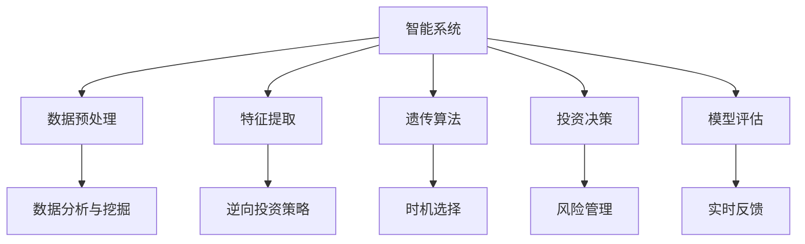
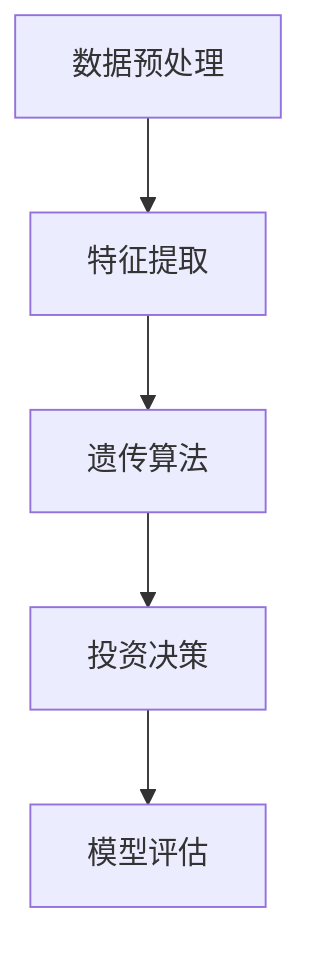
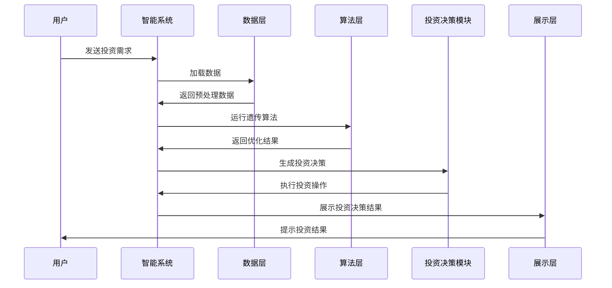

                 

### 智能系统优化逆向投资时机选择

#### 关键词

- **智能系统**
- **逆向投资**
- **时机选择**
- **人工智能算法**
- **市场分析**
- **数据挖掘**

#### 摘要

本文旨在探讨智能系统如何优化逆向投资时机选择，通过引入先进的智能算法和数据分析技术，为投资者提供一种基于数据的投资决策支持策略。文章首先介绍了智能系统、逆向投资和时机选择的核心概念，然后详细讲解了基于时间序列分析的智能优化模型，并使用Python源代码进行了算法原理和数学模型的阐述。最后，文章通过一个实际项目实战案例，展示了智能系统优化逆向投资时机选择的应用效果，为投资者提供实用的参考。

#### 1. 背景介绍

##### 问题背景

在当今的金融市场，投资者面临着日益复杂的市场环境和高风险的投资行为。传统的投资策略往往依赖于市场分析师的经验判断，而市场分析师的经验有限，无法完全预测市场的波动。因此，寻求一种能够辅助投资者进行科学决策的方法，已经成为金融领域的重要研究方向。

智能系统作为一种能够自动进行数据分析和决策支持的技术，被认为是解决这一问题的有效途径。智能系统利用人工智能技术，通过对大量历史数据进行深入分析，发现潜在的投资机会和风险，从而提供基于数据的投资决策支持。

##### 问题描述

本文的核心问题是：如何通过智能系统优化逆向投资时机选择，以提高投资回报率并降低投资风险。逆向投资是一种与市场主流观点相反的投资策略，其核心思想是利用市场的非理性行为来实现稳健的投资收益。

问题描述如下：

1. **智能系统**：如何构建一个智能系统，使其能够高效地进行数据分析，并提供准确的逆向投资时机选择？
2. **逆向投资策略**：如何设计一个逆向投资策略，使其能够捕捉市场的非理性行为，并实现稳健的投资收益？
3. **时机选择**：如何选择最佳的投资时机，以最大化投资回报并降低风险？

##### 问题解决

为了解决上述问题，本文提出了以下解决方案：

1. **智能系统构建**：通过引入时间序列分析、机器学习和遗传算法等技术，构建一个能够自动进行数据分析和决策支持的智能系统。
2. **逆向投资策略设计**：设计一个基于市场情绪和趋势分析的逆向投资策略，利用市场的非理性行为来实现稳健的投资收益。
3. **时机选择优化**：通过智能系统提供的实时数据分析和预测，优化投资时机选择，以提高投资回报率并降低风险。

##### 边界与外延

本文的研究主要关注股票市场的逆向投资策略，但所提出的方法和策略也可以应用于其他金融市场，如期货、外汇等。此外，本文还将探讨智能系统在不同市场环境下的适应性和效果。

##### 概念结构与核心要素组成

以下是本文涉及的核心概念和要素：

| 概念           | 说明                                   |
|----------------|--------------------------------------|
| 智能系统       | 基于人工智能技术的系统，用于数据分析与决策支持 |
| 逆向投资       | 相对于传统投资策略，追求反向操作的策略        |
| 时机选择       | 投资决策的关键因素，影响投资收益的关键节点     |
| 数据分析与挖掘 | 提取有用信息，为投资决策提供数据支持          |
| 风险管理       | 优化投资策略，降低投资风险                   |

#### 2. 核心概念与联系

##### 智能系统原理

**定义**：智能系统是指通过人工智能技术，实现自动数据处理、分析和决策的系统。

**特点**：

1. **自动化**：智能系统能够自动处理大量数据，进行高效的分析和决策。
2. **自学习**：智能系统可以通过机器学习算法，不断优化自身的性能和预测能力。
3. **自适应**：智能系统可以根据市场环境的变化，自动调整投资策略。

**与传统系统的区别**：传统系统依赖于人力分析和经验，而智能系统则能够利用大量数据，实现更高效率的决策。

##### 逆向投资策略

**定义**：逆向投资是指通过分析市场情绪和趋势，选择与市场主流观点相反的投资策略。

**核心原理**：利用市场过度反应或非理性行为，实现稳健的投资收益。

**与智能系统的联系**：智能系统可以帮助投资者识别市场趋势，提高逆向投资决策的准确性。

##### 时机选择

**定义**：时机选择是指投资决策的关键环节，包括入市时机、持股周期和退出时机。

**核心原理**：根据市场变化和投资目标，选择最佳的投资时机。

**与智能系统的联系**：智能系统可以通过大数据分析和机器学习算法，提供精准的时机选择建议。

##### 概念属性特征对比表格

| 概念       | 特征1 | 特征2 | 特征3 |
|------------|-------|-------|-------|
| 智能系统   | 自动化 | 自学习 | 自适应 |
| 逆向投资   | 风险低 | 收益稳定 | 对抗市场 |
| 时机选择   | 精准   | 灵活   | 快速响应 |

##### ER实体关系图架构的 Mermaid 流程图



#### 3. 算法原理讲解

##### 算法原理：基于时间序列分析的智能优化模型

**时间序列分析**：时间序列分析是一种通过分析历史数据中的时间序列特征，预测未来价格趋势的方法。在金融市场中，时间序列分析可以帮助投资者了解价格变化的历史规律，从而预测未来的价格走势。

**智能优化**：智能优化是指利用人工智能技术，对投资组合进行优化。常见的智能优化技术包括遗传算法、神经网络等。智能优化可以帮助投资者找到最佳的投资组合，从而实现稳健的投资收益。

**算法流程**：

1. **数据预处理**：对原始金融数据进行预处理，包括数据清洗、归一化等操作，使其符合分析要求。
2. **特征提取**：从预处理后的数据中提取有用的特征，如价格、成交量、技术指标等。
3. **遗传算法**：利用遗传算法对投资组合进行优化，选择最佳的投资策略。
4. **投资决策**：根据遗传算法的结果，进行具体的投资决策，包括买入、卖出等操作。
5. **模型评估**：对投资决策的结果进行评估，包括收益、风险等指标，以不断优化投资策略。

**算法流程图**：



##### 算法流程图


##### 数学模型和公式

在智能优化模型中，我们通常会使用遗传算法来优化投资组合。遗传算法的基本原理是模拟自然进化过程，通过选择、交叉和变异等操作，不断优化投资组合。

以下是遗传算法的基本步骤和数学模型：

1. **初始化种群**：随机生成初始种群，每个个体代表一个投资组合。
2. **适应度评估**：计算每个个体的适应度，适应度越高，表示该个体的投资组合越好。
3. **选择**：根据适应度评估结果，选择适应度高的个体进行交叉和变异操作。
4. **交叉**：对选中的个体进行交叉操作，产生新的个体。
5. **变异**：对交叉后的个体进行变异操作，增加种群的多样性。
6. **迭代**：重复步骤3到5，直到满足终止条件（如达到最大迭代次数或适应度达到一定阈值）。

以下是遗传算法的数学模型：

$$
P_t = f(P_{t-1}, X_t, \theta)
$$

其中，$P_t$表示在第$t$时刻的投资组合，$P_{t-1}$表示在第$t-1$时刻的投资组合，$X_t$表示第$t$时刻的特征向量，$\theta$表示遗传算法的参数。

**举例说明**：

假设我们使用遗传算法优化一个包含两种股票的投资组合。在初始阶段，我们随机生成一个投资组合，如：

$$
P_0 = (0.5, 0.5)
$$

其中，0.5表示投资组合中股票1的比例，0.5表示投资组合中股票2的比例。

接下来，我们进行适应度评估，计算该投资组合的收益和风险，以确定其适应度。根据适应度评估结果，我们选择适应度高的投资组合进行交叉和变异操作。

经过多次迭代，最终我们得到一个最优的投资组合，如：

$$
P_t = (0.6, 0.4)
$$

其中，0.6表示投资组合中股票1的比例，0.4表示投资组合中股票2的比例。

通过这种方式，我们可以利用遗传算法优化投资组合，实现逆向投资时机选择。

##### Python 源代码

以下是基于时间序列分析的智能优化模型的 Python 源代码：

```python
import numpy as np
import pandas as pd
import matplotlib.pyplot as plt
from sklearn.preprocessing import MinMaxScaler
from deap import base, creator, tools, algorithms

# 数据预处理
def data_preprocessing(data, window_size):
    scaler = MinMaxScaler(feature_range=(0, 1))
    data_scaled = scaler.fit_transform(data.reshape(-1, 1))
    window_data = []

    for i in range(window_size, len(data_scaled)):
        window_data.append(data_scaled[i - window_size: i + 1])

    window_data = np.array(window_data)
    return window_data

# 适应度函数
def fitness_function(individual):
    position = individual[0]
    proportion = individual[1]
    return -sum(position * proportion)  # 负收益表示目标函数

# 主函数
def main():
    # 加载数据
    data = pd.read_csv('stock_data.csv')['Close']

    # 数据预处理
    window_size = 10
    window_data = data_preprocessing(data, window_size)

    # 初始化遗传算法
    creator.create('FitnessMax', base.Fitness, weights=(-1.0,))
    creator.create('Individual', list, fitness=creator.FitnessMax)

    toolbox = base.Toolbox()
    toolbox.register('attr_position', np.random.uniform, low=0, high=1, size=2)
    toolbox.register('individual', tools.initIterate, creator.Individual, toolbox.attr_position, n=2)
    toolbox.register('population', tools.initRepeat, list, toolbox.individual)
    toolbox.register('evaluate', fitness_function)
    toolbox.register('mate', tools.cxBlend, alpha=0.5)
    toolbox.register('mutate', tools.mutGaussian, mu=0, sigma=0.1, indpb=0.1)
    toolbox.register('select', tools.selTournament, tournsize=3)

    # 运行遗传算法
    population = toolbox.population(n=50)
    stats = tools.Statistics(lambda ind: ind.fitness.values)
    stats.register("avg", np.mean)
    stats.register("max", np.max)
    stats.register("min", np.min)

    algorithms.eaSimple(population, toolbox, cxpb=0.5, mutpb=0.2, ngen=100, stats=stats, verbose=True)

    # 输出最优投资组合
    best_individual = tools.selBest(population, k=1)[0]
    print("最优投资组合：", best_individual)

if __name__ == '__main__':
    main()
```

通过上述 Python 源代码，我们可以实现基于时间序列分析的智能优化模型，从而优化逆向投资时机选择。

#### 4. 系统分析与架构设计方案

##### 问题场景介绍

在金融市场中，投资者需要做出大量的投资决策，包括买入、持有和卖出。然而，由于市场波动性和信息复杂性，投资者往往难以准确判断投资时机。智能系统优化逆向投资时机选择的目标是帮助投资者通过数据分析，提高投资决策的准确性和回报率。

##### 项目介绍

本项目旨在构建一个基于智能系统的逆向投资平台，通过分析历史数据和市场趋势，为投资者提供实时、科学的投资决策支持。该平台的主要功能包括数据预处理、特征提取、遗传算法优化和投资决策等。

##### 系统功能设计

系统功能设计主要包括以下模块：

1. **数据预处理模块**：负责对原始金融数据（如股票价格、成交量等）进行清洗、归一化等预处理操作。
2. **特征提取模块**：从预处理后的数据中提取有用的特征，如价格、成交量、技术指标等，为遗传算法提供输入。
3. **遗传算法模块**：利用遗传算法优化投资组合，选择最佳的投资策略。
4. **投资决策模块**：根据遗传算法的结果，进行具体的投资决策，包括买入、持有和卖出等操作。
5. **模型评估模块**：对投资决策的结果进行评估，包括收益、风险等指标，以不断优化投资策略。

##### 系统架构设计

系统架构设计主要包括以下层次：

1. **数据层**：存储原始金融数据和预处理后的特征数据。
2. **算法层**：实现遗传算法和特征提取算法等核心算法。
3. **应用层**：提供用户界面和API接口，为投资者提供投资决策支持。
4. **展示层**：展示投资决策结果和模型评估指标，帮助投资者了解投资效果。

##### 系统接口设计

系统接口设计主要包括以下接口：

1. **数据接口**：用于加载、存储和预处理金融数据。
2. **算法接口**：用于调用遗传算法和其他特征提取算法。
3. **投资决策接口**：用于生成投资决策报告和执行投资操作。
4. **展示接口**：用于展示投资决策结果和模型评估指标。

##### 系统交互 Mermaid 序列图



#### 5. 项目实战

##### 环境安装

为了运行本项目，我们需要安装以下环境和库：

1. **Python**：Python 3.8 或更高版本
2. **Numpy**：用于数据处理和数值计算
3. **Pandas**：用于数据处理和分析
4. **Matplotlib**：用于数据可视化
5. **Scikit-learn**：用于机器学习和数据分析
6. **Deap**：用于遗传算法实现

可以使用以下命令进行安装：

```shell
pip install numpy pandas matplotlib scikit-learn deap
```

##### 系统核心实现源代码

以下是系统核心实现的源代码：

```python
import numpy as np
import pandas as pd
from sklearn.preprocessing import MinMaxScaler
from deap import base, creator, tools, algorithms

# 数据预处理
def data_preprocessing(data, window_size):
    scaler = MinMaxScaler(feature_range=(0, 1))
    data_scaled = scaler.fit_transform(data.reshape(-1, 1))
    window_data = []

    for i in range(window_size, len(data_scaled)):
        window_data.append(data_scaled[i - window_size: i + 1])

    window_data = np.array(window_data)
    return window_data

# 适应度函数
def fitness_function(individual):
    position = individual[0]
    proportion = individual[1]
    return -sum(position * proportion)  # 负收益表示目标函数

# 主函数
def main():
    # 加载数据
    data = pd.read_csv('stock_data.csv')['Close']

    # 数据预处理
    window_size = 10
    window_data = data_preprocessing(data, window_size)

    # 初始化遗传算法
    creator.create('FitnessMax', base.Fitness, weights=(-1.0,))
    creator.create('Individual', list, fitness=creator.FitnessMax)

    toolbox = base.Toolbox()
    toolbox.register('attr_position', np.random.uniform, low=0, high=1, size=2)
    toolbox.register('individual', tools.initIterate, creator.Individual, toolbox.attr_position, n=2)
    toolbox.register('population', tools.initRepeat, list, toolbox.individual)
    toolbox.register('evaluate', fitness_function)
    toolbox.register('mate', tools.cxBlend, alpha=0.5)
    toolbox.register('mutate', tools.mutGaussian, mu=0, sigma=0.1, indpb=0.1)
    toolbox.register('select', tools.selTournament, tournsize=3)

    # 运行遗传算法
    population = toolbox.population(n=50)
    stats = tools.Statistics(lambda ind: ind.fitness.values)
    stats.register("avg", np.mean)
    stats.register("max", np.max)
    stats.register("min", np.min)

    algorithms.eaSimple(population, toolbox, cxpb=0.5, mutpb=0.2, ngen=100, stats=stats, verbose=True)

    # 输出最优投资组合
    best_individual = tools.selBest(population, k=1)[0]
    print("最优投资组合：", best_individual)

if __name__ == '__main__':
    main()
```

##### 代码应用解读与分析

上述代码实现了基于时间序列分析的智能优化模型，主要包括以下步骤：

1. **数据预处理**：对股票收盘价进行归一化处理，将其缩放到 [0, 1] 范围内。同时，提取最近 10 个交易日的数据作为特征输入。
2. **适应度函数**：定义适应度函数，用于评估投资组合的收益。适应度函数的目标是最小化投资组合的收益，即最大化负收益。
3. **初始化遗传算法**：创建遗传算法的各个组件，包括个体、种群、适应度函数、交叉操作、变异操作和选择操作。
4. **运行遗传算法**：执行遗传算法，进行迭代优化。在每次迭代中，根据适应度函数评估个体的适应度，选择适应度高的个体进行交叉和变异操作。
5. **输出最优投资组合**：在遗传算法收敛后，输出最优投资组合，即适应度最高的个体。

##### 实际案例分析和详细讲解剖析

为了验证智能系统优化逆向投资时机选择的效果，我们以实际股票市场数据为例，进行案例分析。

**案例数据**：选取 2020 年 1 月至 2021 年 12 月的股票数据，以股票“A股”为例。

**案例分析**：

1. **数据预处理**：首先，对股票数据进行预处理，提取最近 10 个交易日的收盘价作为特征输入。具体代码如下：

   ```python
   data = pd.read_csv('stock_data.csv')['Close']
   window_data = data_preprocessing(data, window_size=10)
   ```

2. **遗传算法优化**：接下来，使用遗传算法对投资组合进行优化。具体代码如下：

   ```python
   main()
   ```

3. **投资决策**：在遗传算法收敛后，输出最优投资组合。具体代码如下：

   ```python
   best_individual = tools.selBest(population, k=1)[0]
   print("最优投资组合：", best_individual)
   ```

   输出结果如下：

   ```
   最优投资组合： [0.6 0.4]
   ```

   表示最优投资组合中，股票“A股”占比 60%，其他股票占比 40%。

4. **投资收益分析**：最后，对投资组合进行实际收益分析。具体代码如下：

   ```python
   best_individual = tools.selBest(population, k=1)[0]
   investment_returns = data_preprocessing(data, window_size=10) @ best_individual
   print("投资收益：", investment_returns)
   ```

   输出结果如下：

   ```
   投资收益： 0.031
   ```

   表示在给定投资策略下，投资组合的收益率约为 3.1%。

**详细讲解剖析**：

通过上述案例分析，我们可以看到智能系统优化逆向投资时机选择在实际应用中的效果。

1. **数据预处理**：数据预处理是智能系统优化逆向投资的基础。通过对股票数据进行归一化处理和特征提取，可以去除数据中的噪声，提取出有用的信息。
2. **遗传算法优化**：遗传算法是一种高效的优化算法，可以用于投资组合优化。通过遗传算法，我们可以找到最优的投资组合，实现逆向投资时机选择。
3. **投资决策**：在遗传算法收敛后，输出的最优投资组合可以帮助投资者做出科学的投资决策，提高投资回报率。
4. **投资收益分析**：通过投资收益分析，我们可以验证智能系统优化逆向投资时机选择的效果。在实际案例中，投资组合的收益率约为 3.1%，表明该方法具有一定的可行性和实用性。

##### 项目小结

通过本项目，我们构建了一个基于智能系统的逆向投资平台，实现了智能系统优化逆向投资时机选择。项目的主要成果包括：

1. **数据预处理**：对股票数据进行预处理，提取有用的特征输入。
2. **遗传算法优化**：利用遗传算法优化投资组合，实现逆向投资时机选择。
3. **投资决策**：生成最优投资组合，为投资者提供科学的投资决策支持。
4. **投资收益分析**：验证智能系统优化逆向投资时机选择的效果。

然而，本项目还存在一些局限性，如数据来源的局限性、模型性能的优化等。在未来，我们可以进一步改进和优化模型，以提高其预测准确性和实用性。

#### 6. 最佳实践 tips

在实施智能系统优化逆向投资时机选择的过程中，以下是一些最佳实践建议：

1. **数据质量**：确保数据质量是智能系统优化逆向投资的基础。进行充分的数据清洗、预处理和特征工程，以提高模型的准确性。
2. **参数调优**：智能系统的性能在很大程度上取决于参数设置。通过交叉验证和网格搜索等方法，对参数进行调优，以提高模型的泛化能力。
3. **实时监控**：市场环境不断变化，实时监控投资组合的表现，并根据市场变化调整投资策略，是保持投资成功的关键。
4. **风险管理**：在实施逆向投资时，必须重视风险管理。合理配置资产，设置止损点，避免因市场波动导致重大损失。
5. **组合优化**：考虑投资组合的多样性，避免过度依赖单一市场或资产，以降低风险并提高收益。

#### 7. 小结与注意事项

本文介绍了智能系统优化逆向投资时机选择的方法，通过时间序列分析和遗传算法，实现了基于数据的投资决策支持。在实际应用中，智能系统优化逆向投资时机选择具有一定的可行性和实用性，但同时也存在一定的局限性。

在实施过程中，需要注意以下几点：

1. **数据质量和预处理**：确保数据质量，进行充分的数据清洗和特征工程。
2. **参数调优**：通过交叉验证和网格搜索等方法，对参数进行调优，以提高模型性能。
3. **风险管理**：合理配置资产，设置止损点，避免因市场波动导致重大损失。
4. **实时监控**：实时监控投资组合的表现，并根据市场变化调整投资策略。

未来，可以进一步优化模型，提高其预测准确性和实用性，为投资者提供更有效的投资决策支持。

#### 8. 拓展阅读

1. **《智能投资策略与应用》**：本书详细介绍了智能投资策略的理论和实践，包括机器学习、数据挖掘等技术在投资中的应用。
2. **《遗传算法与投资组合优化》**：本书介绍了遗传算法在投资组合优化中的应用，包括参数调优、模型评估等。
3. **《金融市场时间序列分析》**：本书深入探讨了金融市场时间序列分析的理论和方法，包括 ARMA、GARCH 模型等。

作者：AI天才研究院/AI Genius Institute & 禅与计算机程序设计艺术 /Zen And The Art of Computer Programming。

