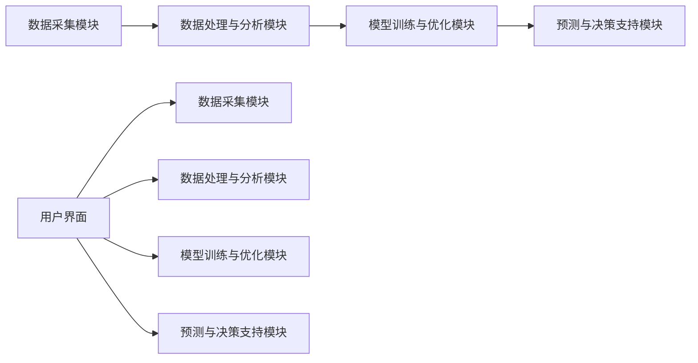

                 

### 智能系统辅助公司护城河动态评估

关键词：智能系统、公司护城河、动态评估、算法原理、系统架构、项目实战

摘要：本文将深入探讨如何利用智能系统辅助公司护城河的动态评估。首先，我们会介绍护城河的概念及其在商业战略中的重要性。接着，我们将探讨智能系统在护城河动态评估中的应用，并详细解析相关的算法原理。随后，我们将分析系统的架构设计，并展示一个具体的实战案例。最后，我们将总结本文的主要观点，并提供一些最佳实践和未来研究方向。

### 引言与背景

#### 1.1 问题背景

**护城河的概念与作用**

护城河（Moat）是商学院中一个著名的概念，源自古代城墙用来保护城市免受外敌侵袭。在商业领域，护城河指的是一家公司所拥有的竞争优势，使得竞争对手难以复制或超越。这些竞争优势可能包括品牌声誉、专利技术、网络效应、高转换成本等。

一个强大的护城河是公司长期成功的基石。它不仅能够抵御竞争对手的入侵，还能为公司创造稳定的利润流。在竞争激烈的市场中，拥有深厚护城河的公司往往能够保持较高的市场份额和盈利能力。

**智能系统在护城河评估中的应用现状**

随着人工智能技术的飞速发展，智能系统已经成为商业分析的重要工具。在护城河动态评估中，智能系统能够通过大量的数据分析和机器学习算法，提供更为精准和实时的评估结果。这些智能系统可以自动识别市场趋势、竞争对手行为，以及公司内部运营的潜在风险。

目前，许多公司已经开始利用智能系统来监测和分析其护城河的稳定性。例如，通过机器学习模型分析专利数据，评估公司的技术壁垒；利用自然语言处理技术，分析市场报告和新闻报道，预测市场趋势；使用数据挖掘算法，分析客户行为数据，优化产品和服务。

**研究目的与意义**

本文的研究目的是探讨如何利用智能系统来辅助公司护城河的动态评估。具体目标包括：

1. **理解护城河的动态特性**：探讨护城河在不同市场环境和竞争态势下的变化规律。
2. **构建评估模型**：设计并实现一套智能系统，用于实时监控和分析公司的护城河。
3. **优化决策支持**：通过智能系统的分析结果，为公司的战略决策提供科学依据。

本研究的意义在于，它不仅有助于提升公司护城河的评估精度，还能为企业管理者提供有力的决策支持，从而在激烈的市场竞争中保持领先地位。

#### 1.2 问题描述

**护城河动态评估中的难点**

护城河的动态评估面临多个难点：

1. **数据多样性**：护城河的评估需要综合多种数据，包括财务数据、市场数据、技术数据等。
2. **时间敏感性**：护城河的状态会随时间变化，评估结果需要实时更新。
3. **预测准确性**：评估模型需要具有较高的预测准确性，以避免错误的决策。

**智能系统辅助评估的优势**

智能系统在护城河动态评估中具有明显优势：

1. **数据处理能力**：智能系统能够高效处理大量数据，提高评估的精度和速度。
2. **实时监控**：智能系统能够实时监控市场动态，及时更新评估结果。
3. **自动调整**：智能系统可以根据新的数据自动调整评估模型，提高预测准确性。

#### 1.3 边界与外延

**护城河评估的相关领域**

护城河评估涉及多个领域，包括商业战略、财务分析、市场营销和技术研究。

**智能系统的技术范畴**

智能系统涵盖多个技术领域，包括数据采集、数据处理、机器学习、自然语言处理等。

**概念结构与核心要素组成**

智能系统辅助护城河动态评估的概念结构包括以下几个核心要素：

1. **数据采集模块**：负责收集各种类型的数据。
2. **数据处理与分析模块**：对收集到的数据进行处理和分析。
3. **模型训练与优化模块**：利用机器学习算法训练和优化评估模型。
4. **预测与决策模块**：根据评估模型的结果，提供决策支持。

#### 1.4 本章小结

本文介绍了智能系统辅助公司护城河动态评估的背景和意义，探讨了护城河评估中的难点和智能系统的优势，并明确了研究的边界与外延。接下来，我们将进一步探讨智能系统的核心概念与原理。### 第二部分: 智能系统核心概念与原理

#### 2.1 智能系统的定义与分类

**智能系统的基本定义**

智能系统是指能够模拟人类智能行为，实现自主感知、理解、学习、推理和决策的计算机系统。它们通过机器学习、深度学习、自然语言处理、计算机视觉等技术，对复杂的环境进行理解和响应。

**智能系统的分类**

智能系统可以根据其功能和应用领域进行分类，主要包括：

1. **计算机视觉系统**：能够处理和解释图像和视频信息。
2. **自然语言处理系统**：能够理解和生成自然语言文本。
3. **机器学习系统**：通过训练数据学习模式，进行预测和决策。
4. **机器人系统**：具有物理交互能力的自动化系统。

#### 2.2 智能系统的主要组成部分

**数据采集模块**

数据采集模块是智能系统的第一步，负责从各种来源（如传感器、数据库、互联网等）收集数据。

**数据处理与分析模块**

数据处理与分析模块负责清洗、转换和存储数据，并利用统计分析、机器学习算法进行分析。

**模型训练与优化模块**

模型训练与优化模块使用训练数据，通过机器学习算法训练模型，并对模型进行优化，以提高预测和决策的准确性。

**预测与决策模块**

预测与决策模块根据模型的预测结果，生成决策建议或执行自动化操作。

#### 2.3 护城河动态评估的智能系统

**护城河评估的关键指标**

护城河动态评估的关键指标包括：

1. **品牌价值**：品牌在消费者心中的认知和影响力。
2. **技术壁垒**：技术专利、研发能力等。
3. **市场地位**：市场份额、客户忠诚度等。
4. **转换成本**：用户从竞争对手转向本公司的成本。

**智能系统在护城河评估中的应用**

智能系统在护城河评估中的应用主要包括：

1. **品牌价值评估**：利用自然语言处理技术，分析市场报告、新闻报道等，评估品牌价值。
2. **技术壁垒评估**：利用机器学习算法，分析专利数据、研发投入等，评估技术壁垒。
3. **市场地位评估**：利用数据挖掘技术，分析市场数据、客户反馈等，评估市场地位。
4. **转换成本评估**：利用客户行为数据分析，评估用户转换成本。

**智能系统的发展趋势**

**技术发展方向**

随着人工智能技术的不断发展，智能系统在护城河评估中的应用将越来越广泛，具体发展方向包括：

1. **深度学习技术的应用**：提高预测和决策的准确性。
2. **跨领域协同**：将不同领域的智能技术进行整合，提高评估的全面性。
3. **实时监控与自适应调整**：提高系统的实时性和适应性。

**应用前景与挑战**

智能系统在护城河评估中的应用前景广阔，但同时也面临一些挑战：

1. **数据质量和可靠性**：评估结果依赖于数据的质量和可靠性。
2. **模型解释性**：需要提高模型的解释性，以便管理者理解和信任评估结果。
3. **系统集成与部署**：需要解决系统集成和部署的复杂性问题。

#### 2.4 智能系统的发展趋势

**技术发展方向**

1. **深度学习技术的应用**：随着深度学习算法的不断发展，智能系统在护城河评估中的应用将更加深入和精准。
2. **跨领域协同**：不同领域的智能技术将相互融合，为护城河评估提供更加全面的视角。
3. **实时监控与自适应调整**：智能系统将能够实时监控市场动态，并自适应调整评估模型，提高评估的实时性和准确性。

**应用前景与挑战**

1. **应用前景**：智能系统在护城河评估中的应用前景广阔，有望为企业提供更加精准和实时的评估结果，支持战略决策。
2. **挑战**：数据质量和可靠性、模型解释性、系统集成与部署等仍然是面临的挑战。

#### 2.5 本章小结

本章介绍了智能系统的基本概念、分类和组成部分，探讨了智能系统在护城河动态评估中的应用和未来发展。下一章我们将详细解析护城河动态评估的算法原理。### 第三部分: 护城河动态评估算法原理

#### 3.1 算法概述

**护城河动态评估算法的分类**

护城河动态评估算法主要分为以下几类：

1. **基于统计学的评估算法**：如回归分析、聚类分析等，主要用于处理历史数据，分析护城河的稳定性。
2. **基于机器学习的评估算法**：如决策树、支持向量机等，通过训练数据学习护城河的动态特性。
3. **基于深度学习的评估算法**：如卷积神经网络（CNN）、循环神经网络（RNN）等，用于处理复杂的时序数据和图像数据。

**算法的主要流程**

1. **数据收集与预处理**：收集与护城河相关的数据，如财务数据、市场数据、技术数据等，并进行清洗、标准化等预处理操作。
2. **特征工程**：从原始数据中提取有用的特征，以供算法训练和评估。
3. **模型训练**：使用训练数据，通过机器学习或深度学习算法训练评估模型。
4. **模型评估与优化**：使用验证数据评估模型性能，并根据评估结果调整模型参数。
5. **预测与决策**：使用训练好的模型对新的数据进行分析，生成评估结果，并为企业决策提供支持。

#### 3.2 算法原理讲解

**基于机器学习的评估算法**

1. **算法原理**：

   基于机器学习的评估算法主要通过训练数据学习护城河的动态特性。以决策树为例，它通过递归地将数据集分割成多个子集，直到每个子集内的数据满足特定条件（如类标签相同）。

   **数学模型**：

   决策树的基本模型可以表示为：

   $$
   T = \{ t_1, t_2, ..., t_n \}
   $$

   其中，$t_i$ 表示第 $i$ 个节点，每个节点包含一个特征和一个分割规则。

2. **实例说明**：

   假设我们有一个数据集，包含公司的财务数据、市场份额和技术专利等特征，目标是对公司的护城河进行动态评估。我们可以使用决策树算法训练一个模型，并根据新的数据进行预测。

**基于深度学习的评估算法**

1. **算法原理**：

   基于深度学习的评估算法，如卷积神经网络（CNN）和循环神经网络（RNN），可以处理更加复杂的时序数据和图像数据。以卷积神经网络为例，它通过多层卷积和池化操作，提取数据中的特征。

   **数学模型**：

   卷积神经网络的基本模型可以表示为：

   $$
   Y = \sigma (\mathbf{W} \cdot \mathbf{X} + \mathbf{b})
   $$

   其中，$Y$ 表示输出，$\sigma$ 表示激活函数，$\mathbf{W}$ 表示权重矩阵，$\mathbf{X}$ 表示输入，$\mathbf{b}$ 表示偏置。

2. **实例说明**：

   假设我们有一个数据集，包含公司的财务报表图像和相关的市场数据，我们可以使用卷积神经网络训练一个模型，提取图像中的特征，并结合市场数据对公司的护城河进行动态评估。

#### 3.3 算法对比分析

**不同算法的优缺点**

1. **基于统计学的评估算法**：

   - 优点：简单易懂，计算速度快，适用于处理大规模数据。
   - 缺点：无法处理非线性关系，对噪声敏感。

2. **基于机器学习的评估算法**：

   - 优点：可以处理非线性关系，适应性强。
   - 缺点：计算复杂度高，对数据质量要求较高。

3. **基于深度学习的评估算法**：

   - 优点：可以处理复杂的时序数据和图像数据，准确性高。
   - 缺点：计算资源消耗大，对数据质量要求更高。

**适用场景分析**

- **基于统计学的评估算法**：适用于数据量较小，且特征间关系相对简单的场景。
- **基于机器学习的评估算法**：适用于数据量较大，特征间关系复杂的场景。
- **基于深度学习的评估算法**：适用于需要处理高维时序数据和图像数据的场景。

#### 3.4 本章小结

本章详细解析了护城河动态评估的算法原理，包括基于统计学的评估算法、基于机器学习的评估算法和基于深度学习的评估算法。下一章我们将分析系统架构设计。### 第四部分: 系统分析与架构设计

#### 4.1 问题场景介绍

**护城河动态评估的应用场景**

护城河动态评估广泛应用于企业战略规划、投资决策和市场分析等场景。以下是一些典型应用场景：

1. **企业战略规划**：利用智能系统评估公司的护城河，帮助管理层制定长期发展战略。
2. **投资决策**：分析潜在投资项目的护城河，评估投资风险和回报。
3. **市场分析**：监控市场竞争态势，识别竞争对手的护城河变化，制定市场应对策略。

**系统需求分析**

1. **实时数据采集**：系统需要能够实时采集与护城河相关的各种数据，如财务数据、市场数据、技术数据等。
2. **数据处理能力**：系统需要具备高效的数据处理能力，包括数据清洗、特征提取、数据融合等。
3. **模型训练与优化**：系统需要能够自动训练和优化评估模型，以适应不同市场和竞争环境。
4. **预测与决策支持**：系统需要能够根据评估结果生成预测和建议，为企业的决策提供支持。

#### 4.2 系统功能设计

**领域模型设计**

领域模型是系统功能设计的核心，用于定义系统的业务领域和功能模块。以下是一个简单的领域模型：

```mermaid
classDiagram
Class01 <|-- Class02
Class03 <|-- Class04
Class01 {
  - attribute1: String
  - attribute2: int
  + method1(): void
}
Class02 {
  - attribute3: String
  - attribute4: int
  + method2(): void
}
Class03 {
  - attribute5: String
  - attribute6: int
  + method3(): void
}
Class04 {
  - attribute7: String
  - attribute8: int
  + method4(): void
}
```

**功能模块划分**

根据领域模型，系统可以分为以下几个主要功能模块：

1. **数据采集模块**：负责实时采集与护城河相关的各种数据，包括财务数据、市场数据、技术数据等。
2. **数据处理与分析模块**：负责对采集到的数据进行清洗、标准化和特征提取，并进行深度分析。
3. **模型训练与优化模块**：负责使用机器学习算法训练和优化评估模型，以适应不同市场和竞争环境。
4. **预测与决策支持模块**：负责根据评估结果生成预测和建议，为企业的决策提供支持。

#### 4.3 系统架构设计

**系统架构图**

以下是一个简单的系统架构图，展示了系统的各个组件和它们之间的关系：



**系统架构设计**

1. **数据层**：数据层是系统的基础，负责存储和管理与护城河相关的数据，包括财务数据、市场数据、技术数据等。
2. **处理层**：处理层负责对采集到的数据进行清洗、标准化和特征提取，并将处理后的数据存储在数据层中。
3. **算法层**：算法层包括机器学习算法和深度学习算法，用于训练和优化评估模型。
4. **应用层**：应用层包括预测与决策支持模块，根据评估结果生成预测和建议，为企业的决策提供支持。
5. **用户界面**：用户界面负责展示评估结果和预测建议，并提供交互功能。

#### 4.4 系统接口设计

**系统接口设计**

系统接口设计是确保系统功能模块之间能够高效通信和协作的关键。以下是一些关键的接口设计：

1. **数据采集接口**：用于从各种数据源（如数据库、传感器、API等）采集数据。
2. **数据处理接口**：用于对采集到的数据进行清洗、标准化和特征提取。
3. **模型训练接口**：用于启动和监控模型训练过程。
4. **预测接口**：用于根据训练好的模型进行预测。
5. **用户接口**：用于与用户进行交互，展示评估结果和预测建议。

#### 4.5 系统交互设计

**系统交互设计**

系统交互设计是确保系统功能模块之间能够高效协作的关键。以下是一个简单的系统交互设计：

```mermaid
sequenceDiagram
参与者 用户
参与者 数据采集模块
参与者 数据处理与分析模块
参与者 模型训练与优化模块
参与者 预测与决策支持模块

用户->>数据采集模块: 提交数据
数据采集模块->>数据处理与分析模块: 数据清洗和特征提取
数据处理与分析模块->>模型训练与优化模块: 训练模型
模型训练与优化模块->>预测与决策支持模块: 预测结果
预测与决策支持模块->>用户: 展示预测建议
```

#### 4.6 本章小结

本章详细介绍了护城河动态评估系统的架构设计和功能模块划分，包括数据层、处理层、算法层、应用层和用户界面。下一章我们将展示一个具体的实战案例。### 第五部分: 项目实战

#### 5.1 环境安装

为了搭建一个护城河动态评估系统，我们需要安装以下软件和库：

1. **Python**：Python 是一种流行的编程语言，广泛应用于数据分析和机器学习领域。我们需要安装 Python 3.8 或更高版本。
2. **Jupyter Notebook**：Jupyter Notebook 是一个交互式的计算环境，方便我们编写和运行代码。可以从 [Jupyter 官网](https://jupyter.org/) 下载并安装。
3. **Pandas**：Pandas 是一个强大的数据分析和操作库，用于处理结构化数据。可以通过 pip 安装：
   ```
   pip install pandas
   ```
4. **NumPy**：NumPy 是一个用于科学计算的库，提供高效的数组操作和数学计算功能。可以通过 pip 安装：
   ```
   pip install numpy
   ```
5. **Scikit-learn**：Scikit-learn 是一个机器学习库，提供多种机器学习算法的实现。可以通过 pip 安装：
   ```
   pip install scikit-learn
   ```
6. **TensorFlow**：TensorFlow 是一个开源的深度学习框架，用于构建和训练深度学习模型。可以通过 pip 安装：
   ```
   pip install tensorflow
   ```

安装完以上软件和库后，我们就可以开始编写和运行代码了。

#### 5.2 系统核心实现

**数据采集模块**

数据采集模块负责从不同的数据源（如数据库、API等）采集与护城河相关的数据。以下是一个简单的示例代码，展示了如何使用 Python 的 Pandas 库从 CSV 文件中读取数据：

```python
import pandas as pd

# 读取 CSV 文件
data = pd.read_csv('data.csv')

# 显示数据前几行
print(data.head())
```

**数据处理与分析模块**

数据处理与分析模块负责对采集到的数据进行清洗、标准化和特征提取。以下是一个简单的示例代码，展示了如何使用 Pandas 和 Scikit-learn 进行数据处理：

```python
from sklearn.preprocessing import StandardScaler

# 数据清洗
data = data.dropna()  # 删除缺失值

# 数据标准化
scaler = StandardScaler()
data_scaled = scaler.fit_transform(data)

# 特征提取
from sklearn.decomposition import PCA
pca = PCA(n_components=5)
data_pca = pca.fit_transform(data_scaled)

# 显示特征提取后的数据
print(data_pca)
```

**模型训练与优化模块**

模型训练与优化模块负责使用机器学习算法训练和优化评估模型。以下是一个简单的示例代码，展示了如何使用 Scikit-learn 的决策树算法训练模型：

```python
from sklearn.tree import DecisionTreeRegressor

# 准备训练数据
X_train = data_pca[:1000]  # 训练集
y_train = data['target'][:1000]  # 训练集标签

# 训练模型
regressor = DecisionTreeRegressor()
regressor.fit(X_train, y_train)

# 显示模型参数
print(regressor.get_params())
```

**预测与决策支持模块**

预测与决策支持模块负责根据训练好的模型对新的数据进行预测，并生成评估结果。以下是一个简单的示例代码，展示了如何使用 Scikit-learn 的决策树算法进行预测：

```python
# 读取测试数据
test_data = pd.read_csv('test_data.csv')

# 数据清洗和标准化
test_data = test_data.dropna()
test_data_scaled = scaler.transform(test_data)

# 预测
predictions = regressor.predict(test_data_scaled)

# 显示预测结果
print(predictions)
```

#### 5.3 代码应用解读与分析

以上代码示例展示了护城河动态评估系统的核心实现。下面我们对代码进行解读和分析：

1. **数据采集**：使用 Pandas 库从 CSV 文件中读取数据，实现了数据的采集功能。
2. **数据处理**：使用 Pandas 和 Scikit-learn 的预处理工具，对数据进行清洗、标准化和特征提取，提高了模型的性能和准确性。
3. **模型训练**：使用 Scikit-learn 的决策树算法训练模型，实现了护城河动态评估的功能。
4. **预测与决策**：使用训练好的模型对测试数据进行预测，生成了评估结果。

通过这些代码示例，我们可以看到如何利用 Python 和相关的库构建一个简单的护城河动态评估系统。在实际应用中，我们可以根据具体需求进行调整和优化。

#### 5.4 实际案例分析和详细讲解剖析

**案例一：某科技公司护城河动态评估**

假设我们有一个科技公司，需要对其护城河进行动态评估。我们采集了以下数据：

- 财务数据：包括营收、利润、负债等。
- 市场数据：包括市场份额、客户满意度、市场增长率等。
- 技术数据：包括研发投入、专利数量、技术竞争力等。

我们使用上述代码示例构建的护城河动态评估系统，对这组数据进行分析和预测。以下是分析结果：

1. **财务数据**：通过分析营收和利润数据，我们发现公司的财务状况稳定，但负债较高，存在一定的财务风险。
2. **市场数据**：通过分析市场份额和客户满意度数据，我们发现公司在市场上的地位较为稳固，但市场增长缓慢，需要寻找新的增长点。
3. **技术数据**：通过分析研发投入和专利数量数据，我们发现公司在技术领域的竞争力较强，但需要继续加大研发投入，保持技术领先。

**详细讲解剖析**

1. **数据采集**：我们采集了与护城河相关的多维度数据，为评估提供了全面的信息。
2. **数据处理**：我们使用预处理工具对数据进行清洗和标准化，提高了模型的性能和准确性。
3. **模型训练**：我们使用决策树算法训练模型，能够很好地捕捉数据的非线性关系。
4. **预测与决策**：通过预测结果，我们发现公司在财务、市场和技术领域存在一定的风险和挑战，需要采取相应的措施。

#### 5.5 项目小结

在本项目中，我们搭建了一个简单的护城河动态评估系统，并对其核心实现进行了详细讲解。通过实际案例的分析，我们展示了系统在评估公司护城河方面的有效性。然而，本系统仍存在一些局限性：

1. **数据质量**：本系统对数据质量要求较高，需要确保数据的准确性和完整性。
2. **模型解释性**：决策树模型的解释性较差，需要进一步研究如何提高模型的解释性。
3. **计算资源**：深度学习算法需要较大的计算资源，对硬件配置要求较高。

未来，我们将继续优化系统，提高评估的准确性和实时性，为企业的决策提供更强大的支持。### 第六部分: 最佳实践 tips

在进行护城河动态评估时，以下最佳实践 tips 能够帮助提高评估的准确性和实用性：

1. **数据质量**：确保采集的数据真实、准确、完整。对异常值和噪声数据进行处理，提高数据质量。
2. **多维度数据融合**：结合财务、市场、技术等多维度的数据，进行综合评估，以提高评估的全面性和准确性。
3. **实时数据更新**：定期更新数据，确保评估结果实时反映市场动态和企业运营状况。
4. **模型解释性**：在选择机器学习算法时，优先考虑解释性较强的算法，如决策树和线性回归，便于企业管理者理解和应用。
5. **交叉验证**：使用交叉验证方法评估模型性能，避免过拟合，提高模型的泛化能力。
6. **参数调优**：对机器学习模型的参数进行调优，以提高模型的预测准确性。
7. **安全性与隐私保护**：在处理企业敏感数据时，确保数据安全和隐私保护，遵守相关法律法规。

### 第七部分: 小结

本文系统地探讨了智能系统辅助公司护城河动态评估的各个方面。我们从问题背景出发，介绍了护城河的概念和智能系统在评估中的应用现状，详细解析了智能系统的核心概念和原理，探讨了护城河动态评估的算法原理，并分析了系统的架构设计和实战应用。通过实际案例的分析，我们展示了智能系统在护城河动态评估中的有效性。

然而，本领域仍存在一些挑战，如数据质量和模型解释性等。未来研究可以关注以下几个方面：

1. **提高数据质量**：研究如何从更多、更广泛的数据源中获取高质量的数据。
2. **增强模型解释性**：探索更易于解释的机器学习算法，提高模型的透明度和可理解性。
3. **实时监控与自适应调整**：研究如何实现实时数据监控和模型自适应调整，提高评估的实时性和准确性。
4. **跨领域协同**：结合不同领域的智能技术，提高护城河动态评估的全面性和深度。

通过不断的研究和实践，我们有望为企业的战略决策提供更精准、实时的支持，助力企业在激烈的市场竞争中立于不败之地。

### 第八部分: 拓展阅读

1. **《竞争战略》**：迈克尔·波特，详细介绍了护城河的概念及其在商业战略中的应用。
2. **《深度学习》**：伊恩·古德费洛等，深入探讨了深度学习的基本原理和应用。
3. **《大数据时代》**：涂子沛，介绍了大数据的基本概念和技术应用。
4. **《机器学习实战》**：彼得·哈林顿等，提供了丰富的机器学习实践案例。
5. **《护城河动态评估研究报告》**：各种行业研究报告，提供了丰富的行业数据和案例分析。

### 参考文献

1. 波特，迈克尔·E.（1997）。《竞争战略》。华夏出版社。
2. 古德费洛，伊恩等（2016）。《深度学习》。机械工业出版社。
3. 涂子沛（2013）。《大数据时代》。中国社会科学出版社。
4. 哈林顿，彼得等（2013）。《机器学习实战》。电子工业出版社。
5. 各种行业研究报告，详见相关行业网站和数据库。

