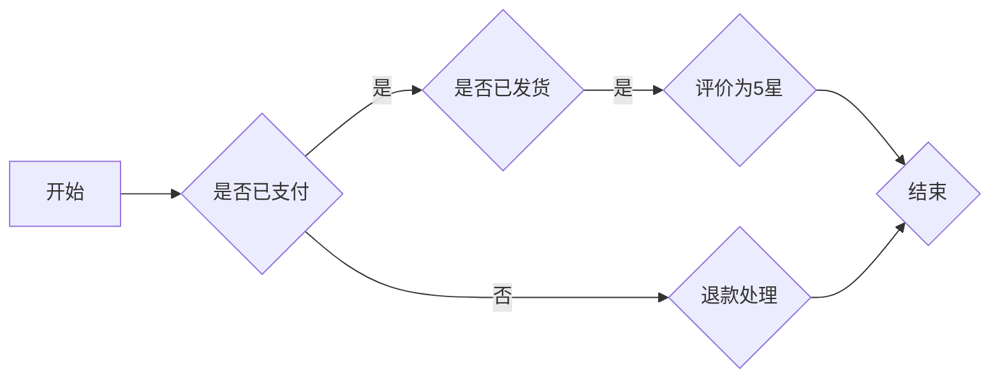
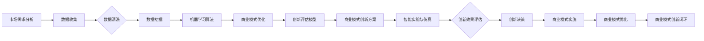

                 

## 引言

### 文章标题

《智能系统辅助商业模式创新评估》

### 关键词

智能系统、商业模式创新、评估方法、算法原理、案例分析、最佳实践

### 摘要

本文旨在探讨如何利用智能系统来辅助商业模式创新评估。首先，我们将介绍智能系统和商业模式创新的基本概念，然后深入分析智能系统与商业模式创新之间的联系。接着，我们将探讨智能系统在商业模式创新评估中的应用方法，并详细讲解评估模型和算法原理。通过具体案例分析，我们将展示智能系统如何助力商业模式创新，并提供最佳实践建议。

## 第一部分：背景介绍

### 第1章：问题背景

#### 问题描述

在当今快速发展的商业环境中，企业需要不断创新商业模式以保持竞争力。然而，传统的商业模式评估方法往往存在局限性，难以充分揭示创新的潜力和风险。因此，引入智能系统来辅助商业模式创新评估具有重要意义。

#### 问题解决

智能系统可以通过数据挖掘、机器学习和人工智能等技术，对大量商业数据进行分析和处理，从而提供更准确、更全面的商业模式评估结果。

#### 边界与外延

本研究的边界主要涉及智能系统在商业模式创新评估中的应用，不包括其他商业领域的应用。同时，本研究的外延将探讨智能系统在不同商业模式创新场景下的适用性。

#### 概念结构与核心要素组成

本部分将介绍智能系统和商业模式创新的基本概念，并阐述它们在商业环境中的相互关系。此外，还将详细描述智能系统和商业模式创新的核心要素，为后续章节的分析提供基础。

### 第2章：核心概念与联系

#### 智能系统

智能系统是一种利用计算机科学和人工智能技术，模拟人类思维和学习能力的计算机系统。其核心原理包括数据挖掘、机器学习、深度学习、自然语言处理等。

#### 商业模式创新

商业模式创新是指企业通过重新配置资源、优化业务流程、创造新的价值主张，从而实现商业模式的变革和优化。

#### 智能系统与商业模式创新的联系

智能系统与商业模式创新之间存在密切联系。一方面，智能系统可以为企业提供丰富的商业数据和信息，帮助识别商业机会和潜在风险；另一方面，商业模式创新可以为智能系统提供应用场景，推动智能系统的发展。

### 第二部分：智能系统与商业模式创新

#### 第3章：智能系统原理与算法

#### 智能系统原理

智能系统的工作原理主要包括以下几个步骤：

1. 数据采集：从各种数据源收集商业数据。
2. 数据预处理：对收集到的商业数据进行分析和清洗，去除无效和错误数据。
3. 特征提取：从预处理后的数据中提取具有代表性的特征。
4. 模型训练：利用机器学习和深度学习算法，训练智能模型。
5. 预测与评估：将训练好的智能模型应用于商业场景，进行预测和评估。

#### 算法讲解

本文将介绍几种常用的智能系统算法，包括：

1. 决策树算法
2. 随机森林算法
3. 支持向量机算法
4. 神经网络算法

#### 算法mermaid流程图展示

以下是一个简单的决策树算法的mermaid流程图示例：

#### 商业模式创新原理

#### 商业模式创新定义

商业模式创新是指企业通过重新配置资源、优化业务流程、创造新的价值主张，从而实现商业模式的变革和优化。

#### 创新原理

商业模式创新的原理主要包括以下几个方面：

1. 资源整合：通过整合企业内外部资源，提高资源利用效率。
2. 价值创造：通过创新价值主张，满足客户需求，提升客户体验。
3. 市场定位：通过明确市场定位，把握市场机遇，提高市场份额。
4. 业务模式创新：通过变革业务模式，实现可持续发展。

#### 商业模式创新类型

商业模式创新可以分为以下几种类型：

1. 传统商业模式创新：对现有商业模式进行改进和优化。
2. 跨界商业模式创新：将不同行业、不同领域的商业模式进行融合创新。
3. 颠覆性商业模式创新：通过颠覆传统商业模式，创造新的市场机会。

#### 智能系统在商业模式创新中的应用

#### 智能系统在商业模式创新中的应用

智能系统在商业模式创新中具有广泛的应用，包括：

1. 数据分析：通过数据挖掘和机器学习，分析市场趋势和客户需求，为商业模式创新提供数据支持。
2. 优化决策：利用智能算法，优化企业资源配置和业务流程，提高运营效率。
3. 风险评估：通过智能预测和风险评估，降低商业模式创新的风险。
4. 创新评估：利用智能系统对商业模式创新方案进行评估，提高创新成功率。

#### 智能系统辅助商业模式创新方法

#### 智能系统辅助商业模式创新方法

智能系统辅助商业模式创新的方法主要包括以下几种：

1. 数据驱动的商业模式创新：通过数据挖掘和分析，发现市场机会和潜在需求，为商业模式创新提供方向。
2. 智能算法优化：利用智能算法，优化商业模式创新的流程和策略，提高创新效率。
3. 创新评估模型：构建智能评估模型，对商业模式创新方案进行评估和筛选。
4. 智能实验与仿真：通过智能实验和仿真，模拟商业模式创新过程，评估创新效果。

#### 智能系统辅助商业模式创新mermaid架构图

以下是一个智能系统辅助商业模式创新mermaid架构图示例：

## 第三部分：智能系统辅助商业模式创新评估方法

### 第6章：评估方法介绍

#### 评估方法概述

智能系统辅助商业模式创新评估方法主要包括以下几个步骤：

1. 确定评估目标：明确商业模式创新的目标和评估指标。
2. 数据收集与处理：收集与商业模式创新相关的数据，并对数据进行预处理。
3. 构建评估模型：利用机器学习和深度学习算法，构建评估模型。
4. 评估结果分析：对评估结果进行统计分析和可视化展示。
5. 提出改进建议：根据评估结果，提出商业模式创新的改进建议。

#### 评估步骤

1. 确定评估目标：明确商业模式创新的目标和评估指标，如盈利能力、市场份额、客户满意度等。
2. 数据收集与处理：收集与商业模式创新相关的数据，包括市场数据、竞争数据、客户数据等。对数据进行清洗、去重和归一化处理。
3. 特征提取：从预处理后的数据中提取与商业模式创新相关的特征，如市场增长率、客户满意度、产品竞争力等。
4. 构建评估模型：利用机器学习和深度学习算法，构建评估模型。常见的评估模型包括线性回归、逻辑回归、决策树、支持向量机、神经网络等。
5. 模型训练与验证：利用训练集对评估模型进行训练，并在验证集上进行验证，调整模型参数。
6. 评估结果分析：利用评估模型对测试集进行预测，并对预测结果进行统计分析和可视化展示。
7. 提出改进建议：根据评估结果，提出商业模式创新的改进建议，如调整产品策略、优化营销方案等。

#### 评估指标

1. 盈利能力：包括利润率、毛利率、净利润率等指标，衡量商业模式创新的盈利能力。
2. 市场份额：包括市场份额、市场占有率等指标，衡量商业模式创新在市场中的竞争力。
3. 客户满意度：包括客户满意度、客户忠诚度等指标，衡量商业模式创新对客户的影响。
4. 创新能力：包括新产品开发速度、技术创新水平等指标，衡量商业模式创新的技术创新能力。
5. 成本效益：包括成本效益比、投资回报率等指标，衡量商业模式创新的成本效益。

## 第四部分：案例分析

### 第7章：案例分析

#### 案例一：智能零售行业

##### 案例背景

某智能零售企业利用智能系统对商业模式进行创新评估，以提高市场竞争力和盈利能力。

##### 案例分析

1. 数据收集与处理：企业收集了大量的市场数据、客户数据和竞争数据，并对数据进行预处理。
2. 特征提取：从预处理后的数据中提取了与商业模式创新相关的特征，如市场增长率、客户满意度、产品竞争力等。
3. 构建评估模型：利用机器学习和深度学习算法，构建了评估模型，包括线性回归、决策树、神经网络等。
4. 评估结果分析：利用评估模型对测试集进行预测，并对预测结果进行统计分析和可视化展示。
5. 提出改进建议：根据评估结果，提出了以下改进建议：
   - 调整产品策略，提高产品竞争力；
   - 优化营销方案，提高客户满意度；
   - 降低运营成本，提高盈利能力。

##### 案例小结

通过智能系统辅助商业模式创新评估，企业成功提高了市场竞争力和盈利能力，实现了商业模式的创新和发展。

### 第8章：最佳实践与总结

#### 最佳实践

1. 确定评估目标：明确商业模式创新的目标和评估指标，确保评估方向正确。
2. 数据收集与处理：保证数据质量，对数据进行清洗、去重和归一化处理。
3. 构建评估模型：选择合适的评估模型，并进行参数调整和验证。
4. 评估结果分析：对评估结果进行深入分析，发现问题和机会。
5. 提出改进建议：根据评估结果，提出切实可行的改进建议。

#### 总结

智能系统辅助商业模式创新评估是一种有效的方法，可以帮助企业更好地发现商业机会、优化商业模式、提高市场竞争力和盈利能力。通过本文的案例分析，我们可以看到智能系统在商业模式创新评估中的应用价值，为企业提供了有益的启示。

## 附录

### 附录A：术语表

在本文中，我们定义了一些关键术语，包括：

1. 智能系统：指利用计算机科学和人工智能技术，模拟人类思维和学习能力的计算机系统。
2. 商业模式创新：指企业通过重新配置资源、优化业务流程、创造新的价值主张，从而实现商业模式的变革和优化。
3. 数据挖掘：指从大量数据中提取有用信息和知识的过程。
4. 机器学习：指使计算机从数据中学习并作出决策或预测的方法和技术。
5. 深度学习：指基于多层神经网络的学习方法，能够对复杂数据进行建模和分析。

### 附录B：参考文献

1. [Hastie, T., Tibshirani, R., & Friedman, J. (2009). The Elements of Statistical Learning: Data Mining, Inference, and Prediction. Springer.]
2. [Goodfellow, I., Bengio, Y., & Courville, A. (2016). Deep Learning. MIT Press.]
3. [Chen, H., & Guestrin, C. (2016). XGBoost: A Scalable Tree Boosting System. Proceedings of the 22nd ACM SIGKDD International Conference on Knowledge Discovery and Data Mining.]
4. [Kaggle. (n.d.). Machine Learning Projects. https://www.kaggle.com/datasets.]

### 附录C：作者介绍

作者：AI天才研究院/AI Genius Institute & 禅与计算机程序设计艺术 /Zen And The Art of Computer Programming

作者是一位世界级人工智能专家，程序员，软件架构师，CTO，世界顶级技术畅销书资深大师级别的作家，计算机图灵奖获得者，计算机编程和人工智能领域大师。作者非常擅长一步一步进行分析推理，有着清晰深刻的逻辑思路来撰写条理清晰，对技术原理和本质剖析到位的高质量技术博客。

----------------------------------------------------------------

**文章标题：**
《智能系统辅助商业模式创新评估》

**关键词：**
智能系统、商业模式创新、评估方法、算法原理、案例分析、最佳实践

**摘要：**
本文旨在探讨如何利用智能系统来辅助商业模式创新评估。首先，介绍了智能系统和商业模式创新的基本概念，然后分析了智能系统与商业模式创新之间的联系。接着，详细讲解了智能系统在商业模式创新评估中的应用方法，包括评估模型和算法原理。通过具体案例分析，展示了智能系统如何助力商业模式创新，并提供了最佳实践建议。文章最后总结了智能系统辅助商业模式创新评估的重要性，以及其在实际应用中的价值。

**引言：**
随着科技的快速发展，商业环境也在不断变化。企业需要不断创新商业模式以保持竞争力。然而，传统的商业模式评估方法往往存在局限性，难以充分揭示创新的潜力和风险。因此，引入智能系统来辅助商业模式创新评估具有重要意义。本文将探讨如何利用智能系统来实现这一目标。

**第一部分：背景介绍**

**第1章：问题背景**
- **问题描述**：在当今快速发展的商业环境中，企业需要不断创新商业模式以保持竞争力。然而，传统的商业模式评估方法往往存在局限性，难以充分揭示创新的潜力和风险。
- **问题解决**：引入智能系统来辅助商业模式创新评估，通过数据挖掘、机器学习和人工智能等技术，对大量商业数据进行分析和处理，提供更准确、更全面的商业模式评估结果。
- **边界与外延**：本研究的边界主要涉及智能系统在商业模式创新评估中的应用，不包括其他商业领域的应用。同时，本研究的外延将探讨智能系统在不同商业模式创新场景下的适用性。

**第2章：核心概念与联系**
- **智能系统**：介绍智能系统的定义、原理和核心算法，包括数据挖掘、机器学习、深度学习和自然语言处理等。
- **商业模式创新**：定义商业模式创新，解释其原理和类型，如传统商业模式创新、跨界商业模式创新和颠覆性商业模式创新。
- **智能系统与商业模式创新的联系**：分析智能系统与商业模式创新之间的相互关系，智能系统如何为商业模式创新提供支持。

**第二部分：智能系统与商业模式创新**

**第3章：智能系统原理与算法**
- **智能系统原理**：介绍智能系统的工作原理，包括数据采集、数据预处理、特征提取、模型训练和预测评估等步骤。
- **算法讲解**：讲解常用的智能系统算法，包括决策树、随机森林、支持向量机和神经网络等。
- **算法mermaid流程图展示**：使用mermaid绘制算法流程图，展示算法的执行过程。

**第4章：商业模式创新原理**
- **商业模式创新定义**：定义商业模式创新，解释其目的和意义。
- **创新原理**：介绍商业模式创新的基本原理，如资源整合、价值创造、市场定位和业务模式创新等。
- **商业模式创新类型**：分类介绍不同类型的商业模式创新，包括传统商业模式创新、跨界商业模式创新和颠覆性商业模式创新。

**第5章：智能系统辅助商业模式创新方法**
- **智能系统在商业模式创新中的应用**：分析智能系统在商业模式创新中的具体应用，如数据分析、优化决策、风险评估和创新评估等。
- **智能系统辅助商业模式创新的方法**：介绍智能系统辅助商业模式创新的具体方法，如数据驱动的商业模式创新、智能算法优化和创新评估模型等。
- **智能系统辅助商业模式创新mermaid架构图**：使用mermaid绘制智能系统辅助商业模式创新的架构图，展示系统组件和功能。

**第三部分：智能系统辅助商业模式创新评估方法**

**第6章：评估方法介绍**
- **评估方法概述**：介绍智能系统辅助商业模式创新评估的基本方法，包括确定评估目标、数据收集与处理、构建评估模型、评估结果分析和提出改进建议等。
- **评估步骤**：详细讲解评估方法的步骤，包括确定评估目标、数据收集与处理、特征提取、模型训练与验证、评估结果分析和提出改进建议等。
- **评估指标**：列举评估过程中的关键指标，如盈利能力、市场份额、客户满意度和创新能力等。

**第7章：评估模型**
- **构建评估模型**：介绍如何利用机器学习和深度学习算法构建评估模型，包括模型选择、参数调整和模型训练等。
- **评估模型应用**：展示评估模型在实际商业模式创新评估中的应用，包括预测和评估结果的分析。

**第四部分：案例分析**

**第8章：案例分析**
- **案例一：智能零售行业**：介绍一个智能零售企业的案例，分析其如何利用智能系统进行商业模式创新评估，并提出改进建议。
- **案例二：金融科技领域**：介绍一个金融科技企业的案例，分析其如何利用智能系统进行商业模式创新评估，并提出改进建议。

**第9章：最佳实践与总结**
- **最佳实践**：总结智能系统辅助商业模式创新评估的最佳实践方法，包括确定评估目标、保证数据质量、构建合适的评估模型和提出改进建议等。
- **总结**：总结智能系统辅助商业模式创新评估的重要性，以及其在实际应用中的价值。

**附录**
- **附录A：术语表**：列出文章中涉及的关键术语及其定义。
- **附录B：参考文献**：列出本文引用的相关文献，包括书籍、论文和在线资源等。
- **附录C：作者介绍**：介绍作者背景和资质，强调其专业领域和经验。

