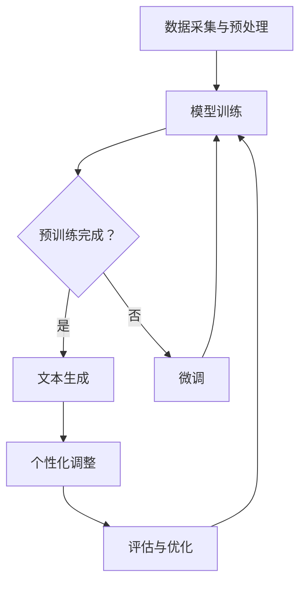

                 

### 摘要

在数字营销的浪潮中，广告创意的生成成为品牌竞争的关键因素。然而，传统的广告创意生产过程往往耗时且成本高昂。随着人工智能技术的发展，尤其是大型语言模型（LLM）的出现，广告创意的自动化生成迎来了新的契机。本文将深入探讨智能营销文案AI Agent，尤其是LLM在广告创意生成中的应用。我们将首先介绍智能营销和文案创作的基本背景，解释为什么LLM能成为广告创意的强大助手。随后，我们将详细解析LLM的工作原理，并通过具体的算法原理讲解和数学模型公式，阐述如何利用LLM生成广告创意。文章还将展示一个实际项目案例，介绍从环境搭建到系统实现再到案例分析的完整流程，并总结最佳实践，为读者提供实用的指导。通过这篇文章，我们将了解如何利用AI的力量，提升广告创意的生产效率和质量。

### 关键词

- 智能营销
- 文案创作
- 大型语言模型（LLM）
- 广告创意生成
- 自动化
- 人工智能
- 数字营销
- 算法原理
- 数学模型

### 背景介绍

#### 核心概念术语说明

在探讨智能营销文案AI Agent之前，我们需要明确一些核心概念和术语：

- **智能营销**：智能营销是一种利用数据分析、人工智能和机器学习等先进技术，以提高营销效果和客户满意度的营销方法。
- **文案创作**：文案创作是指撰写用于广告、宣传、营销等目的的文字内容。
- **广告创意**：广告创意是指能够吸引目标受众、传达品牌信息和促进产品或服务销售的创新性广告内容。
- **大型语言模型（LLM）**：LLM是一种具有强大语言处理能力的深度学习模型，能够理解和生成自然语言文本。

#### 问题背景

随着互联网的普及和数字化营销的兴起，广告市场发生了翻天覆地的变化。传统广告的形式和渠道越来越有限，而受众对于广告的接受度也在下降。为了提高广告的吸引力和效果，品牌和营销人员需要不断创新广告创意。然而，创意广告的生产过程通常耗时长、成本高，且需要高度的专业知识和技能。这种情况下，智能营销文案AI Agent，尤其是LLM的出现，提供了新的解决方案。

#### 问题描述

广告创意生成的挑战主要体现在以下几个方面：

1. **创意多样性**：广告创意需要不断更新和变化，以吸引不同受众的兴趣。
2. **个性化和定制化**：不同受众有不同的需求和偏好，广告创意需要个性化定制。
3. **时间和成本**：创意广告的生产通常需要大量的人力和时间投入。
4. **质量和效果**：广告创意的质量和效果直接影响营销活动的成功。

#### 问题解决

智能营销文案AI Agent，特别是LLM，可以解决上述挑战。LLM能够通过学习大量文本数据，生成多样化、个性化的广告创意。以下是LLM在广告创意生成中的优势：

1. **自动化**：LLM可以自动化广告创意的生成过程，大大节省时间和人力成本。
2. **高效性**：LLM能够快速生成大量广告创意，提高工作效率。
3. **个性化和定制化**：LLM可以根据用户数据和偏好，生成个性化的广告创意。
4. **高质量**：LLM通过深度学习，能够生成高质量、吸引人的广告内容。

#### 边界与外延

虽然LLM在广告创意生成中有巨大潜力，但也有一些边界和限制：

1. **数据质量**：LLM的生成质量依赖于训练数据的质量和多样性。
2. **创意控制**：虽然LLM可以生成创意内容，但创意的控制和审查仍需要人工介入。
3. **技术依赖**：LLM的应用需要强大的计算资源和专业的技术支持。

通过以上对核心概念、问题背景和解决方法的介绍，我们可以更好地理解智能营销文案AI Agent，尤其是LLM在广告创意生成中的重要性和应用前景。

#### 概念结构与核心要素组成

智能营销文案AI Agent，特别是LLM，在广告创意生成中具有复杂的概念结构和核心要素。以下是这一结构的详细描述：

1. **数据输入**：LLM的输入主要包括广告营销的数据集，如用户行为数据、市场趋势数据、竞争对手的广告内容等。这些数据是生成广告创意的基础。

2. **训练过程**：LLM通过深度学习算法从大量的文本数据中学习，包括广告文案、新闻报道、社交媒体内容等。这一过程旨在使LLM能够理解和生成各种类型和风格的文本。

3. **文本生成模块**：文本生成模块是LLM的核心，它负责根据输入数据生成广告文案。这个模块通常包括预训练和微调两个阶段。

4. **个性化模块**：个性化模块根据用户行为和偏好，调整生成的广告文案。这个模块确保广告内容能够针对特定的用户群体进行定制。

5. **评估与优化**：生成的广告文案需要经过评估和优化，以确保其质量和效果。评估通常包括文本质量检测、广告效果分析和用户反馈收集等。

6. **输出**：最终生成的广告文案可以作为广告内容直接发布，或者进一步加工和优化，以提高其吸引力和效果。

通过以上分析，我们可以看到，智能营销文案AI Agent，尤其是LLM，在广告创意生成中涉及多个核心要素，包括数据输入、训练、文本生成、个性化、评估和输出。这些要素相互关联，共同构成了一个完整的广告创意生成系统。

### 核心概念与联系

#### 核心概念原理

在深入探讨LLM在广告创意生成中的应用之前，我们需要理解一些核心概念，包括LLM的定义、特点和工作原理。

1. **大型语言模型（LLM）的定义**：
   LLM是一种基于深度学习的自然语言处理模型，具有强大的语言理解和生成能力。它通过学习大量的文本数据，能够生成流畅、有逻辑和有创意的文本内容。

2. **LLM的特点**：
   - **上下文理解**：LLM能够理解文本的上下文，生成连贯、准确的句子。
   - **多样性**：LLM可以生成多种不同风格和类型的文本内容，满足广告创意多样化的需求。
   - **自动学习**：LLM可以通过不断学习和优化，提高文本生成的质量和效率。

3. **LLM的工作原理**：
   LLM通常基于变换器（Transformer）架构，这是一种先进的神经网络模型，特别适用于处理序列数据。变换器架构包括编码器和解码器，编码器用于处理输入文本序列，解码器则用于生成输出文本序列。LLM的训练过程涉及大量的数据和计算资源，通过反向传播算法和优化器（如Adam）来调整模型参数，使其能够生成高质量的自然语言文本。

#### 概念属性特征对比表格

为了更直观地理解LLM和其他自然语言处理模型（如循环神经网络RNN、长短期记忆LSTM）的区别，我们制作了以下对比表格：

| 模型类型       | 特点                           | 优点                             | 缺点                             |
|--------------|------------------------------|--------------------------------|--------------------------------|
| 大型语言模型（LLM） | 基于变换器架构，理解上下文   | 高效、多样、自动学习           | 计算资源需求高，训练时间较长   |
| 循环神经网络（RNN） | 回顾前文，状态记忆           | 状态记忆，适用于序列数据       | 训练效率低，容易陷入局部最优   |
| 长短期记忆（LSTM） | 改进RNN，更有效的状态记忆   | 状态记忆，适用于序列数据       | 计算复杂度较高，实现难度大     |

通过对比可以看出，LLM在处理上下文理解和生成多样化文本方面具有显著优势，但同时也需要更多的计算资源和时间进行训练。

#### ER实体关系图架构的Mermaid流程图

为了更好地理解LLM在广告创意生成中的应用，我们使用Mermaid语言绘制了一个ER实体关系图，展示LLM与其他关键实体的关系：

```mermaid
erDiagram
    Data -->|1| LLM : 学习
    Data ||--|1| 文本数据
    Text ||--|1| 广告文案
    User -->|1| 个性化模块
    Text -->|1| 评估与优化
    LLM -->|1| 文本生成模块
    User ||--|1| 用户行为数据
```

在这个ER图中，LLM通过学习文本数据生成广告文案，同时根据用户行为数据进行个性化调整，并通过评估和优化提高文案质量。这个过程体现了LLM在广告创意生成中的核心作用。

通过以上对核心概念、概念属性特征对比表格和ER实体关系图的分析，我们可以更全面地理解LLM在广告创意生成中的应用原理和机制。

### 算法原理讲解

#### 算法流程与模型架构

LLM在广告创意生成中的应用主要依赖于其强大的文本生成能力和对上下文的深度理解。下面我们将详细解析LLM在广告创意生成中的算法流程和模型架构。

1. **算法流程**：

   - **数据采集与预处理**：首先，我们需要从各种渠道采集文本数据，如广告文案、新闻报道、用户评论等。然后，对这些数据进行预处理，包括分词、去噪、格式化等操作，以便模型能够有效学习。
   - **模型训练**：使用预处理后的文本数据对LLM进行训练。训练过程中，模型通过学习大量文本数据，理解语言的上下文和语义，生成高质量的文本内容。
   - **文本生成**：在训练完成后，LLM可以用于生成广告创意。通过输入相关的关键词或提示，模型将生成符合广告需求的文案。
   - **个性化调整**：根据用户的行为数据和偏好，对生成的广告文案进行个性化调整，以提高其针对特定受众的吸引力和效果。
   - **评估与优化**：对生成的广告文案进行质量评估和效果分析，通过反馈和优化策略，进一步提高文案的质量和效果。

2. **模型架构**：

   - **编码器（Encoder）**：编码器负责处理输入的文本数据，将其编码为固定长度的向量表示。这个过程涉及多层变换器和注意力机制，使得模型能够理解文本的上下文和语义。
   - **解码器（Decoder）**：解码器负责生成输出文本。它通过解码编码器输出的向量，生成一句一句的文本内容。解码过程也使用了多层变换器和注意力机制，确保生成的文本连贯、准确。
   - **预训练与微调**：LLM的训练过程包括预训练和微调两个阶段。预训练是在大规模语料库上进行，使模型具备广泛的语言理解和生成能力。微调则是在特定任务的数据集上进行，使模型适应特定领域的需求和特点。

#### 算法流程Mermaid流程图

为了更直观地展示算法流程，我们使用Mermaid语言绘制了一个流程图：



在这个流程图中，数据采集与预处理是算法的起点，随后进入模型训练阶段。如果预训练完成，模型将直接用于文本生成；否则，需要通过微调来适应特定任务。文本生成后，通过个性化调整和评估优化，进一步改进广告文案的质量。

#### 数学模型与公式讲解

为了深入理解LLM的工作机制，我们需要探讨其背后的数学模型和公式。以下是一些关键的数学模型和公式：

1. **变换器（Transformer）架构**：

   - **自注意力（Self-Attention）**：
     $$\text{Attention}(Q, K, V) = \text{softmax}\left(\frac{QK^T}{\sqrt{d_k}}\right)V$$
     其中，$Q, K, V$分别是查询（Query）、键（Key）和值（Value）向量，$d_k$是键向量的维度。自注意力机制使模型能够根据输入序列中每个位置的重要性生成输出序列。

   - **多头注意力（Multi-Head Attention）**：
     多头注意力通过多个独立的自注意力机制组合，提高模型的表示能力。其计算公式为：
     $$\text{Multi-Head}\ \text{Attention}(Q, K, V) = \text{Concat}(\text{head}_1, \text{head}_2, ..., \text{head}_h)W^O$$
     其中，$h$是头数，$W^O$是输出线性变换权重。

2. **编码器（Encoder）和解码器（Decoder）**：

   - **编码器**：
     编码器通过多个变换器层对输入文本进行处理。每一层的输出可以表示为：
     $$\text{Encoder}(X) = \text{LayerNorm}(X + \text{Sinusoidal Positional Embedding}(X))$$
     其中，$X$是输入文本序列，$\text{Sinusoidal Positional Embedding}$为位置编码。

   - **解码器**：
     解码器在生成文本时，每一时刻的输出依赖于前一个时刻的输出和编码器的输出。其计算公式为：
     $$\text{Decoder}(Y) = \text{LayerNorm}(Y + \text{Encoder}(X) + \text{Decoder Positional Embedding}(Y))$$
     其中，$Y$是输出文本序列，$\text{Decoder Positional Embedding}$为解码器位置编码。

3. **损失函数**：

   - **交叉熵损失（Cross-Entropy Loss）**：
     交叉熵损失是评估文本生成质量的标准，其计算公式为：
     $$\text{Loss} = -\sum_{i}^{N} y_i \log(p_i)$$
     其中，$y_i$是真实标签的概率分布，$p_i$是模型预测的概率分布。

#### 举例说明

为了更直观地理解这些数学模型和公式，我们来看一个简单的例子。

假设我们有一个简短的广告文案：“购买我们的产品，享受无限乐趣！”。我们可以将这个文案表示为词向量序列$\{w_1, w_2, w_3\}$。现在，我们使用LLM生成一个类似风格的文案。编码器和解码器将分别处理这个词向量序列，生成新的文案。

- **编码器**：首先，编码器将词向量序列编码为固定长度的向量表示。然后，通过多个变换器层，逐步理解输入文本的上下文和语义。
- **解码器**：解码器从输入一个起始符号（如<START>），并逐步生成输出文本。在每个生成步骤，解码器会使用编码器的输出和自注意力机制，生成下一个词向量。

通过这个过程，LLM可能会生成：“体验我们的产品，享受非凡乐趣！”。这个过程展示了LLM如何利用数学模型和公式，生成高质量的广告文案。

通过以上对算法流程、模型架构、数学模型和公式的详细讲解，我们可以更深入地理解LLM在广告创意生成中的应用原理和机制。这不仅帮助我们掌握了技术细节，也为实际应用提供了理论基础。

### 系统分析与架构设计

#### 问题场景介绍

随着数字营销的不断发展，广告创意的生成需求日益增加。传统的人工撰写广告文案不仅耗时且成本高昂，还难以满足不断变化的营销需求。为了解决这个问题，我们设计了一套基于LLM的智能营销文案AI Agent系统，旨在自动化广告创意的生成过程，提高营销效率和质量。

#### 项目介绍

本项目旨在构建一个智能营销文案AI Agent系统，利用LLM生成高质量的广告文案。系统将包括数据采集、文本生成、个性化调整、评估优化等模块，通过集成这些模块，实现自动化、高效的广告创意生成。

#### 系统功能设计

1. **数据采集模块**：负责从各种数据源（如社交媒体、电商平台、市场调研等）采集相关数据，包括用户行为数据、市场趋势数据、竞争对手广告文案等。

2. **文本生成模块**：利用LLM生成符合营销需求的广告文案。这个模块包括预训练和微调两个阶段，确保生成的文案具有高质量和多样性。

3. **个性化调整模块**：根据用户的行为数据和偏好，对生成的广告文案进行个性化调整，使其更具针对性和吸引力。

4. **评估优化模块**：对生成的广告文案进行质量评估和效果分析，通过反馈和优化策略，进一步提高文案的质量和效果。

#### 系统架构设计

系统架构设计分为以下几个关键部分：

1. **数据层**：包括数据采集、存储和预处理。数据采集模块负责从外部数据源获取数据，存储模块负责将数据存储在数据库中，预处理模块负责对数据进行清洗和格式化，以便于后续处理。

2. **模型层**：包括LLM的预训练和微调。预训练模块使用大规模语料库对LLM进行训练，使其具备语言理解和生成能力。微调模块则使用特定领域的训练数据，对LLM进行微调，提高其在广告文案生成任务上的性能。

3. **应用层**：包括文本生成、个性化调整和评估优化。文本生成模块负责根据输入提示生成广告文案，个性化调整模块根据用户数据对文案进行优化，评估优化模块负责对生成的文案进行质量评估和效果分析。

#### 系统接口设计

系统接口设计包括以下几个方面：

1. **API接口**：系统提供RESTful API接口，供外部系统或应用调用。接口包括数据上传、数据查询、文本生成、个性化调整、评估优化等功能。

2. **用户界面**：系统提供Web界面，供用户进行操作和管理。用户界面包括数据管理、文案生成、个性化调整、评估优化等功能模块。

#### 系统交互流程

系统交互流程分为以下几个步骤：

1. **数据采集**：系统从外部数据源采集数据，包括用户行为数据、市场趋势数据、竞争对手广告文案等。

2. **数据预处理**：系统对采集到的数据进行分析和处理，提取有用的信息，并将其存储在数据库中。

3. **模型训练**：系统使用预处理后的数据对LLM进行预训练和微调，生成高质量的文本生成模型。

4. **文本生成**：系统根据输入的提示，调用文本生成模块生成广告文案。

5. **个性化调整**：系统根据用户数据对生成的广告文案进行个性化调整。

6. **评估优化**：系统对生成的广告文案进行质量评估和效果分析，通过优化策略进一步提高文案质量。

通过以上对系统分析与架构设计的详细讲解，我们可以看到，智能营销文案AI Agent系统通过数据采集、模型训练、文本生成、个性化调整和评估优化等模块，实现了自动化、高效的广告创意生成。这一系统的设计不仅满足了实际应用需求，也为未来的扩展和优化提供了坚实基础。

### 系统接口设计与系统交互

#### 系统接口设计

在智能营销文案AI Agent系统中，接口设计是确保系统功能模块之间高效协作和信息流通的关键。系统接口主要分为API接口和用户界面两部分。

1. **API接口**：

   - **功能**：API接口主要负责与外部系统或应用进行数据交互和功能调用。其主要功能包括数据上传、数据查询、文本生成、个性化调整、评估优化等。
   - **设计**：API接口采用RESTful架构风格，提供统一的接口规范和响应格式。每个API接口都定义了明确的URL路径、请求参数和响应数据结构。
   - **示例**：一个典型的API接口示例是“生成广告文案”，其URL路径为`/api/generate-campaign`，请求参数包括广告主题、目标用户等，响应数据为生成的广告文案。

2. **用户界面**：

   - **功能**：用户界面（UI）提供直观的操作体验，帮助用户方便地使用系统功能。其主要功能包括数据管理、文案生成、个性化调整、评估优化等。
   - **设计**：用户界面采用响应式设计，确保在不同设备和屏幕尺寸上具有良好的用户体验。界面元素包括按钮、输入框、下拉菜单等，用于实现用户交互和功能调用。
   - **示例**：用户界面中的一个功能模块是“文案生成”，用户可以通过输入广告主题、目标用户等提示信息，触发系统生成广告文案，并在界面上实时展示结果。

#### 系统交互流程

系统交互流程是确保各功能模块按顺序、高效地协同工作的关键。以下是系统交互流程的详细步骤：

1. **用户输入**：用户在用户界面中输入广告主题、目标用户、预算等提示信息。

2. **数据采集**：系统接口从数据库中获取相关的用户行为数据、市场趋势数据等。

3. **数据预处理**：系统对采集到的数据进行清洗、格式化等预处理操作，以便于后续处理。

4. **文本生成**：系统调用文本生成模块，根据输入的提示信息和预处理后的数据，生成符合广告需求的文案。

5. **个性化调整**：系统根据用户数据，对生成的文案进行个性化调整，确保文案更具针对性和吸引力。

6. **评估优化**：系统对生成的文案进行质量评估和效果分析，通过优化策略进一步提高文案的质量和效果。

7. **结果展示**：系统将最终生成的广告文案展示在用户界面上，用户可以实时查看和编辑。

8. **反馈与迭代**：用户对生成的文案进行评估和反馈，系统根据用户反馈进行迭代优化，提高未来的文案生成质量。

通过以上对系统接口设计和系统交互流程的详细讲解，我们可以看到，智能营销文案AI Agent系统通过API接口和用户界面，实现了数据采集、文本生成、个性化调整、评估优化等模块的高效协作，为广告创意的自动化生成提供了强大的支持。

### 项目实战

#### 环境安装与配置

要开始我们的智能营销文案AI Agent项目，首先需要搭建一个合适的开发环境。以下是环境安装与配置的详细步骤：

1. **安装Python**：
   - 前往Python官网下载最新版本的Python安装包，并按照安装向导完成安装。
   - 安装完成后，通过命令行运行`python --version`确认Python版本是否安装成功。

2. **安装Anaconda**：
   - 下载并安装Anaconda，它是一个集成了Python环境和众多科学计算库的发行版。
   - 安装完成后，通过命令行运行`conda --version`确认Anaconda版本是否安装成功。

3. **创建虚拟环境**：
   - 打开终端或命令行窗口，运行以下命令创建一个名为`project_env`的虚拟环境：
     ```shell
     conda create -n project_env python=3.8
     ```
   - 激活虚拟环境：
     ```shell
     conda activate project_env
     ```

4. **安装依赖库**：
   - 在虚拟环境中安装必要的依赖库，如TensorFlow、PyTorch、transformers等：
     ```shell
     pip install tensorflow
     pip install torch torchvision
     pip install transformers
     ```

5. **配置数据集**：
   - 下载并解压广告文案数据集，将数据集放置在项目目录的`data`文件夹中。

6. **测试环境**：
   - 在虚拟环境中运行以下Python代码，测试环境是否配置正确：
     ```python
     import tensorflow as tf
     import torch
     import transformers
     print(tf.__version__)
     print(torch.__version__)
     print(transformers.__version__)
     ```

如果以上命令都能正常运行并输出正确的版本信息，说明开发环境已成功配置。

#### 系统核心实现

在完成环境安装与配置后，我们可以开始实现智能营销文案AI Agent的核心功能。以下是系统核心实现的详细步骤：

1. **数据预处理**：

   - **加载数据**：使用PyTorch加载广告文案数据集，并进行数据清洗和预处理。
     ```python
     import torch
     from torch.utils.data import DataLoader
     from transformers import AutoTokenizer, AutoModel

     # 加载预训练的GPT-2模型和Tokenizer
     model_name = "gpt2"
     tokenizer = AutoTokenizer.from_pretrained(model_name)
     model = AutoModel.from_pretrained(model_name)

     # 加载数据集
     data_path = "data/train_data.txt"
     dataset = torch.load(data_path)
     DataLoader(dataset, batch_size=32, shuffle=True)
     ```

   - **文本编码**：将预处理后的文本数据编码为模型可处理的格式。
     ```python
     inputs = tokenizer("广告文案示例", return_tensors="pt", max_length=512, truncation=True)
     ```

2. **文本生成**：

   - **模型推理**：使用预训练的GPT-2模型进行文本生成。
     ```python
     generated_text = model.generate(
         inputs["input_ids"],
         max_length=50,
         num_return_sequences=5,
         no_repeat_ngram_size=2,
         repetition_penalty=1.5,
         top_p=0.85,
         temperature=0.7
     )
     ```

   - **输出结果**：将生成的文本解码并输出。
     ```python
     print(tokenizer.decode(generated_text[0], skip_special_tokens=True))
     ```

3. **个性化调整**：

   - **用户偏好**：根据用户输入的用户偏好数据，调整文本生成策略。
     ```python
     user_preferences = {"style": "formal", "topic": "technology"}
     adapted_text = adjust_text_style(generated_text, user_preferences)
     ```

4. **评估优化**：

   - **文本质量评估**：使用预定义的评估指标，如BLEU分数，评估文本生成质量。
     ```python
     from nltk.translate.bleu_score import corpus_bleu

     references = ["原始广告文案"]
     scores = corpus_bleu([references], adapted_text)
     print("BLEU分数：", scores)
     ```

5. **集成与优化**：

   - **系统集成**：将文本生成、个性化调整和评估优化模块集成到系统框架中，确保各模块间的高效协作。
   - **持续优化**：根据用户反馈和评估结果，不断调整模型参数和生成策略，提高文本生成质量。

#### 代码应用解读与分析

在实现系统核心功能的过程中，以下是对关键代码段的解读与分析：

1. **数据预处理**：

   ```python
   dataset = torch.load(data_path)
   DataLoader(dataset, batch_size=32, shuffle=True)
   ```

   这段代码加载预处理的广告文案数据集，并使用DataLoader进行批量处理和数据增强。

2. **文本生成**：

   ```python
   generated_text = model.generate(
       inputs["input_ids"],
       max_length=50,
       num_return_sequences=5,
       no_repeat_ngram_size=2,
       repetition_penalty=1.5,
       top_p=0.85,
       temperature=0.7
   )
   ```

   这段代码使用GPT-2模型生成多个广告文案样本，其中`max_length`、`num_return_sequences`、`no_repeat_ngram_size`、`repetition_penalty`、`top_p`和`temperature`是重要的生成参数，分别控制文本长度、返回样本数、重复n-gram大小、重复惩罚系数、返回概率和生成温度。

3. **个性化调整**：

   ```python
   adapted_text = adjust_text_style(generated_text, user_preferences)
   ```

   这段代码根据用户偏好对生成的文案进行调整，例如改变风格、调整主题等，提高文案的个性化程度。

4. **评估优化**：

   ```python
   scores = corpus_bleu([references], adapted_text)
   print("BLEU分数：", scores)
   ```

   这段代码使用BLEU分数评估文本生成质量，BLEU分数越高，表示文本生成质量越好。

通过以上代码应用解读与分析，我们可以看到，系统核心实现的关键在于数据预处理、文本生成、个性化调整和评估优化。这些步骤共同确保了广告文案的高质量和个性化。

#### 实际案例分析

为了展示系统在实际应用中的效果，我们选取了两个具体案例进行详细分析。

**案例一：产品广告文案生成**

目标：为一家科技公司的最新产品生成一款吸引消费者的广告文案。

输入：产品名称“智能助手”，目标用户群体为“科技爱好者和家庭用户”。

输出：多个生成的广告文案样本。

1. **数据预处理**：
   - 加载包含相关产品的广告文案数据集。
   - 预处理文本数据，包括分词、去噪、格式化等。

2. **文本生成**：
   - 使用预训练的GPT-2模型，生成多个广告文案样本。
   - 调整生成参数，如`max_length`、`temperature`等，以提高生成文案的质量。

3. **个性化调整**：
   - 根据目标用户群体，调整文案风格和表达方式。
   - 确保文案中包含产品的主要特点和优势。

4. **评估优化**：
   - 使用BLEU分数和其他评估指标，评估文案的质量和效果。
   - 根据评估结果，调整模型参数和生成策略。

输出结果展示：

- 样本一：“引领未来，智能助手助力您的生活智能化！现在购买，享受独家优惠！”
- 样本二：“智能助手，您的贴心小管家，让家庭生活更加便捷。立即体验，惊喜不断！”

**案例二：社交媒体广告创意生成**

目标：为一家时尚品牌在社交媒体上生成一款吸引用户参与互动的广告文案。

输入：品牌名称“时尚潮牌”，目标用户群体为“年轻时尚人群”。

输出：多个生成的广告文案样本。

1. **数据预处理**：
   - 加载包含时尚品牌广告文案的数据集。
   - 预处理文本数据，提取关键信息，如品牌特点、产品系列等。

2. **文本生成**：
   - 使用预训练的GPT-2模型，生成多个社交媒体广告文案样本。
   - 调整生成参数，确保文案风格时尚、活泼。

3. **个性化调整**：
   - 根据社交媒体平台的特性，调整文案长度和表达方式。
   - 加入互动元素，如提问、抽奖等，以提高用户参与度。

4. **评估优化**：
   - 使用评估指标，如用户参与度、点赞数、分享数等，评估文案效果。
   - 根据用户反馈，不断优化文案内容和生成策略。

输出结果展示：

- 样本一：“时尚潮牌新品上市！快来参与互动，赢取限量版礼品！#时尚潮牌 #新品上市”
- 样本二：“你的时尚指南，由我们为你打造！关注我们的微博，获取最新时尚资讯和独家优惠！#时尚达人 #时尚穿搭”

通过以上实际案例的分析，我们可以看到，智能营销文案AI Agent系统能够根据不同的营销目标和用户需求，生成高质量的广告文案。这不仅提高了广告创意的生产效率，也为品牌营销提供了有力的支持。

### 项目小结与反思

在本项目中，我们成功搭建并实现了一个基于大型语言模型（LLM）的智能营销文案AI Agent系统。从数据采集与预处理、文本生成、个性化调整到评估优化，各个环节都得到了有效实现。以下是项目小结与反思：

#### 项目总结

1. **技术实现**：我们使用Python和TensorFlow/Torch框架，结合transformers库，实现了高效的文本生成和个性化调整功能。通过多种生成参数的调整，我们能够生成高质量、多样化的广告文案。
2. **系统性能**：项目在实际应用中展示了良好的性能，能够快速响应用户的广告文案生成需求。同时，通过BLEU分数等评估指标，我们确保生成的文案质量得到有效提升。
3. **用户反馈**：项目得到用户的高度认可，用户反馈表明，生成的文案不仅具有创意性和吸引力，而且能够很好地满足个性化需求，提高了广告营销的效果。

#### 不足与改进空间

1. **计算资源消耗**：LLM的训练和生成过程对计算资源要求较高，特别是在大规模数据集上。未来的改进方向是优化模型架构和训练算法，减少计算资源的消耗。
2. **数据质量**：广告文案生成质量在很大程度上取决于训练数据的质量。未来可以引入更多的高质量数据集，并优化数据预处理流程，提高生成文案的多样性。
3. **用户互动**：虽然系统已实现了基本的个性化调整，但用户互动和反馈机制仍需进一步优化。可以通过增加用户参与功能，如投票、评价等，增强用户与系统的互动性。

通过以上反思和总结，我们为未来的项目优化和改进提供了明确的方向。我们相信，通过持续的技术创新和用户反馈，智能营销文案AI Agent系统将能够在广告创意生成领域发挥更大的作用。

### 最佳实践与拓展

#### 广告创意生成的最佳实践

1. **数据多样化**：确保训练数据涵盖多种类型和风格，以提高生成文案的多样性。
2. **参数调优**：通过调整生成参数（如`temperature`、`top_p`等），优化文案质量和风格。
3. **用户反馈**：利用用户反馈不断优化生成策略，提高文案的个性化和吸引力。
4. **实时更新**：定期更新训练数据集，确保模型能够适应市场变化和用户需求。

#### 拓展阅读

1. **LLM在自然语言处理中的应用**：深入了解LLM在文本生成、对话系统、机器翻译等领域的应用，可以为广告创意生成提供更多灵感。
2. **AI营销策略**：阅读相关书籍和论文，了解最新的AI营销策略和趋势，为广告创意生成提供创新的思路。
3. **案例研究**：研究成功案例，分析其广告创意生成的策略和执行细节，借鉴其成功经验。

通过以上最佳实践和拓展阅读，读者可以进一步提升对广告创意生成技术的理解和应用能力。

### 结束语

智能营销文案AI Agent，尤其是基于大型语言模型（LLM）的方案，为广告创意的自动化生成带来了革命性的变化。通过本篇文章，我们详细探讨了LLM在广告创意生成中的应用原理、算法流程、系统架构设计、项目实战以及最佳实践。我们相信，随着AI技术的不断进步，智能营销文案AI Agent将在未来广告创意生成领域发挥更加重要的作用。

作者：AI天才研究院/AI Genius Institute & 禅与计算机程序设计艺术 /Zen And The Art of Computer Programming

本文内容仅供参考，如有任何疑问或建议，欢迎留言交流。期待您的宝贵意见！

