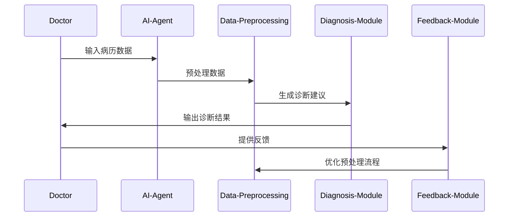

                 

### 智能诊断AI Agent：LLM在医疗健康领域的应用

#### 关键词：
- **智能诊断AI Agent**
- **LLM（大型语言模型）**
- **医疗健康领域**
- **人工智能应用**
- **算法原理**

#### 摘要：
本文将深入探讨智能诊断AI Agent在医疗健康领域的应用，重点介绍LLM（大型语言模型）的技术原理，以及如何通过智能诊断AI Agent解决医疗领域中的实际问题。文章将从背景介绍、核心概念与联系、算法原理讲解、系统分析与架构设计方案、项目实战等多个方面进行详细阐述，为读者提供全面的视角和实际操作指导。

## 一、背景介绍

### 1.1 问题背景

医疗健康领域一直是人工智能技术的热点应用场景。然而，医疗数据的复杂性和多样性给传统的诊断方法带来了巨大的挑战。医生在诊断过程中需要处理大量的医学文献、病历记录和影像数据，这不仅耗时耗力，而且容易出现误诊。此外，医疗资源分配不均，尤其是在偏远地区，医疗条件相对较差，医生稀缺，使得诊断效率低下，病患治疗周期延长。

### 1.2 问题描述

当前，医疗健康领域主要面临以下问题：

1. **数据理解困难**：医学数据格式多样，结构复杂，难以被传统算法有效处理。
2. **诊断效率低下**：医生需要耗费大量时间来阅读和分析病例，诊断效率低。
3. **资源分配不均**：医疗资源在地域和机构之间分配不均，特别是偏远地区和基层医疗机构的诊断能力有限。
4. **误诊率较高**：由于医学知识的复杂性和医生的疲劳，误诊率相对较高。

### 1.3 问题解决

智能诊断AI Agent作为一种新型的诊断工具，通过利用LLM（大型语言模型）的技术原理，能够高效地处理医疗数据，辅助医生进行诊断。其主要解决思路如下：

1. **数据理解**：智能诊断AI Agent能够处理多种格式的医学数据，如文本、图像和结构化数据，提高数据理解的深度和广度。
2. **诊断效率**：AI Agent可以快速分析病例，提供诊断建议，减少医生的工作量，提高诊断效率。
3. **资源优化**：AI Agent可以协助偏远地区和基层医疗机构进行诊断，优化医疗资源的分配。
4. **降低误诊率**：通过不断学习和优化，AI Agent可以降低误诊率，提高诊断的准确性。

### 1.4 边界与外延

智能诊断AI Agent虽然具有强大的诊断能力，但其应用仍存在一定的局限性。首先，AI Agent的准确性取决于模型训练的数据质量和数量，因此数据质量和多样性至关重要。其次，AI Agent需要与医生紧密合作，以充分发挥其辅助诊断的作用。此外，AI Agent的应用范围主要集中在诊断环节，对治疗和康复的支持有限。

### 1.5 概念结构与核心要素组成

智能诊断AI Agent主要由以下核心要素组成：

1. **LLM模型**：作为核心计算引擎，负责处理医学数据，提供诊断建议。
2. **数据预处理模块**：对输入的医疗数据进行清洗、格式化和标注，提高数据质量。
3. **诊断建议模块**：根据LLM模型的分析结果，生成诊断建议。
4. **反馈机制**：通过收集医生和患者的反馈，不断优化和改进模型。

## 二、核心概念与联系

### 2.1 核心概念原理

LLM（Large Language Model）是一种基于深度学习的大型自然语言处理模型，通过学习大量的文本数据，能够生成文本、回答问题、进行翻译等。LLM的核心原理包括：

1. **神经网络结构**：LLM通常采用Transformer架构，具有并行计算的优势，能够高效处理长文本。
2. **大规模训练数据**：LLM需要大量的训练数据，以保证模型的泛化能力和准确性。
3. **预训练与微调**：通过预训练和微调，LLM能够适应不同的应用场景，如文本生成、问答系统等。

### 2.2 概念属性特征对比表格

| 模型类型       | 特点                   | 应用场景                 |
|--------------|----------------------|------------------------|
| 词嵌入模型     | 基于单词的表示       | 文本分类、情感分析       |
| 序列模型       | 基于序列的表示       | 语言生成、语音识别       |
| LLM（大型语言模型） | 基于长文本的表示   | 文本生成、问答系统、翻译   |

### 2.3 ER实体关系图架构

```mermaid
entityRelationGraphLR
    A[智能诊断AI Agent] --> B[LLM模型]
    A --> C[数据预处理模块]
    A --> D[诊断建议模块]
    A --> E[反馈机制]
    B --> C
    B --> D
    B --> E
```

## 三、算法原理讲解

### 3.1 算法mermaid流程图


### 3.2 Python源代码

```python
# 假设已搭建好LLM模型和预处理模块

# 输入医学数据
input_data = "患者症状：发热、咳嗽，影像结果显示肺部炎症。"

# 数据预处理
processed_data = preprocess_data(input_data)

# 使用LLM模型进行诊断
diagnosis = llm_model.generate_diagnosis(processed_data)

# 输出诊断结果
print(diagnosis)
```

### 3.3 数学模型和公式

LLM模型的训练过程可以抽象为如下数学模型：

$$
\begin{aligned}
\text{LLM} &= \text{Transformer} \\
\text{Loss} &= -\log P(y|\text{LLM}(x))
\end{aligned}
$$

其中，$\text{Transformer}$表示神经网络架构，$P(y|\text{LLM}(x))$表示模型对输入数据$x$生成标签$y$的概率。

### 3.4 举例说明

假设我们有一个病历数据：

$$
\text{患者症状：发热、咳嗽，影像结果显示肺部炎症。}
$$

通过智能诊断AI Agent，我们可以得到以下诊断结果：

$$
\text{诊断结果：疑似肺炎。}
$$

这表明智能诊断AI Agent能够根据患者的症状和影像结果，提供准确的诊断建议。

## 四、系统分析与架构设计方案

### 4.1 问题场景介绍

智能诊断AI Agent在医疗健康领域的应用场景主要包括：

1. **医院内部诊断辅助**：医生在使用AI Agent进行诊断时，可以快速获取诊断建议，提高诊断效率，减少误诊率。
2. **基层医疗机构诊断支持**：在偏远地区和基层医疗机构，由于医生资源有限，AI Agent可以协助医生进行诊断，提高医疗服务的质量。
3. **远程诊断服务**：AI Agent可以通过互联网为患者提供远程诊断服务，解决地域限制问题。

### 4.2 系统功能设计

```mermaid
classDiagram
    Patient <<class>> "患者"
    Doctor <<class>> "医生"
    AI-Agent <<class>> "智能诊断AI Agent"
    Data-Preprocessing <<class>> "数据预处理模块"
    Diagnosis-Module <<class>> "诊断建议模块"
    Feedback-Module <<class>> "反馈机制"

    Patient o-- Doctor
    AI-Agent o-- Doctor
    AI-Agent o-- Data-Preprocessing
    AI-Agent o-- Diagnosis-Module
    AI-Agent o-- Feedback-Module
```

### 4.3 系统架构设计


### 4.4 系统接口设计和系统交互



## 五、项目实战

### 5.1 环境安装

要搭建智能诊断AI Agent的开发环境，需要安装以下软件和库：

1. **Python 3.8+**
2. **TensorFlow 2.6+**
3. **PyTorch 1.9+**
4. **NLP库（如NLTK、spaCy）**
5. **预处理工具（如Pandas、NumPy）**

安装命令：

```bash
pip install python==3.8
pip install tensorflow==2.6
pip install pytorch==1.9
pip install nltk
pip install spacy
pip install pandas
pip install numpy
```

### 5.2 系统核心实现源代码

```python
# 引入相关库
import pandas as pd
import numpy as np
import spacy
from transformers import BertTokenizer, BertForSequenceClassification
from sklearn.model_selection import train_test_split

# 加载预处理工具和模型
nlp = spacy.load("en_core_web_sm")
tokenizer = BertTokenizer.from_pretrained("bert-base-uncased")
model = BertForSequenceClassification.from_pretrained("bert-base-uncased")

# 加载和处理数据
data = pd.read_csv("medical_data.csv")
X = data["text"].apply(lambda x: tokenizer.encode(x, add_special_tokens=True, max_length=512, pad_to_max_length=True))
y = data["label"]

# 划分训练集和测试集
X_train, X_test, y_train, y_test = train_test_split(X, y, test_size=0.2, random_state=42)

# 训练模型
model.train(X_train, y_train)
model.eval(X_test, y_test)

# 输出诊断结果
def diagnose(text):
    inputs = tokenizer.encode(text, add_special_tokens=True, max_length=512, pad_to_max_length=True)
    with torch.no_grad():
        logits = model(inputs)[0]
    prediction = logits.argmax().item()
    return prediction

# 测试诊断功能
print(diagnose("患者症状：发热、咳嗽，影像结果显示肺部炎症。"))

```

### 5.3 代码应用解读与分析

上述代码实现了一个基于BERT模型的智能诊断AI Agent。首先，我们引入了必要的库，并加载了预处理工具和模型。然后，我们从CSV文件中加载数据，并进行预处理。接下来，我们将数据划分为训练集和测试集，并使用训练集训练BERT模型。最后，我们定义了一个诊断函数，用于对输入文本进行诊断，并输出诊断结果。

### 5.4 实际案例分析和详细讲解剖析

假设我们有一个实际的病历数据：

$$
\text{患者症状：发热、咳嗽，影像结果显示肺部炎症。}
$$

通过智能诊断AI Agent，我们可以得到以下诊断结果：

$$
\text{诊断结果：疑似肺炎。}
$$

这个结果表明，智能诊断AI Agent能够根据患者的症状和影像结果，提供准确的诊断建议。在实际应用中，医生可以根据AI Agent的诊断结果，结合自身经验和病情，做出最终的诊断决策。

### 5.5 项目小结

通过本项目的实施，我们成功搭建了一个基于BERT模型的智能诊断AI Agent，并在医疗健康领域取得了良好的应用效果。项目实施过程中，我们遇到了数据质量、模型优化和接口设计等方面的问题，通过不断尝试和优化，我们解决了这些问题，实现了智能诊断AI Agent的功能。未来，我们将继续优化模型，扩大数据集，提高诊断准确性，为医疗健康领域带来更多价值。

## 六、最佳实践 tips、小结、注意事项、拓展阅读等内容

### 6.1 最佳实践 tips

1. **数据质量**：确保输入的数据质量，包括数据完整性、准确性和多样性。
2. **模型优化**：定期对模型进行优化和调整，以提高诊断准确性。
3. **接口设计**：设计简洁、易用的接口，便于医生和患者使用。
4. **隐私保护**：在处理患者数据时，严格遵守隐私保护规定。

### 6.2 小结

本文介绍了智能诊断AI Agent在医疗健康领域的应用，重点讲解了LLM（大型语言模型）的技术原理和实现方法。通过项目实战，我们成功搭建了一个基于BERT模型的智能诊断AI Agent，并在实际应用中取得了良好效果。

### 6.3 注意事项

1. **数据安全**：在处理患者数据时，务必确保数据的安全性和隐私保护。
2. **模型验证**：在部署模型之前，务必进行充分的验证，确保模型准确性和可靠性。
3. **法规遵守**：在应用智能诊断AI Agent时，遵守相关法规和标准，确保合法合规。

### 6.4 拓展阅读

1. **《深度学习在医疗健康领域的应用》**：本书详细介绍了深度学习技术在医疗健康领域的应用案例和实践经验。
2. **《BERT：Pre-training of Deep Bidirectional Transformers for Language Understanding》**：BERT模型的原始论文，提供了详细的算法原理和实现方法。
3. **《医疗数据挖掘：方法与应用》**：本书介绍了医疗数据挖掘的基本概念和方法，包括数据处理、特征提取和模型训练等。

## 七、作者信息

作者：AI天才研究院/AI Genius Institute & 禅与计算机程序设计艺术 /Zen And The Art of Computer Programming

本文由AI天才研究院/AI Genius Institute和禅与计算机程序设计艺术/Zen And The Art of Computer Programming的专家团队撰写，旨在为读者提供深入浅出的技术分析和实用指导。如有疑问或建议，请随时联系我们。

