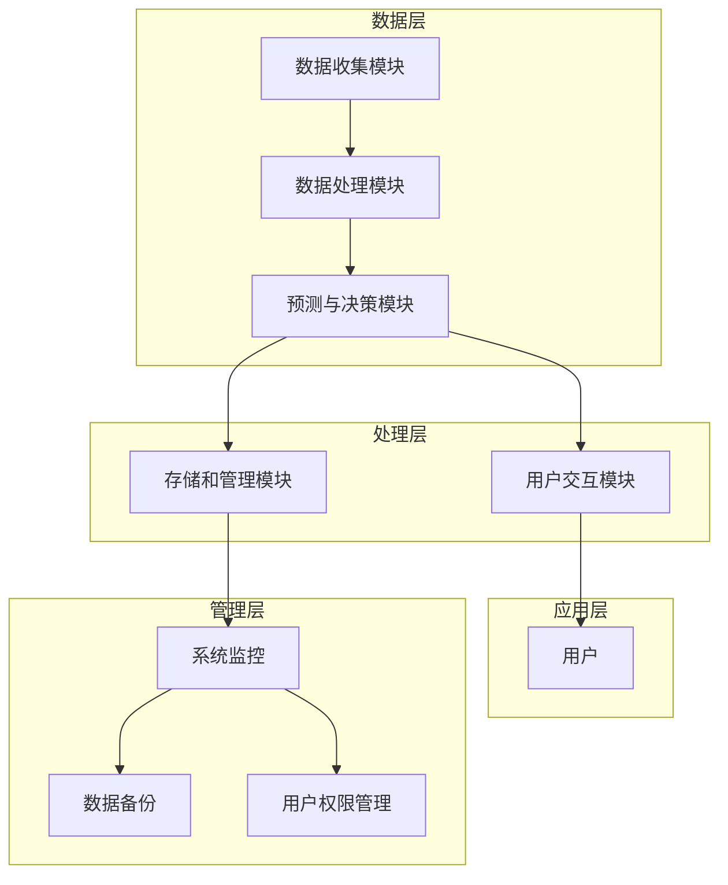
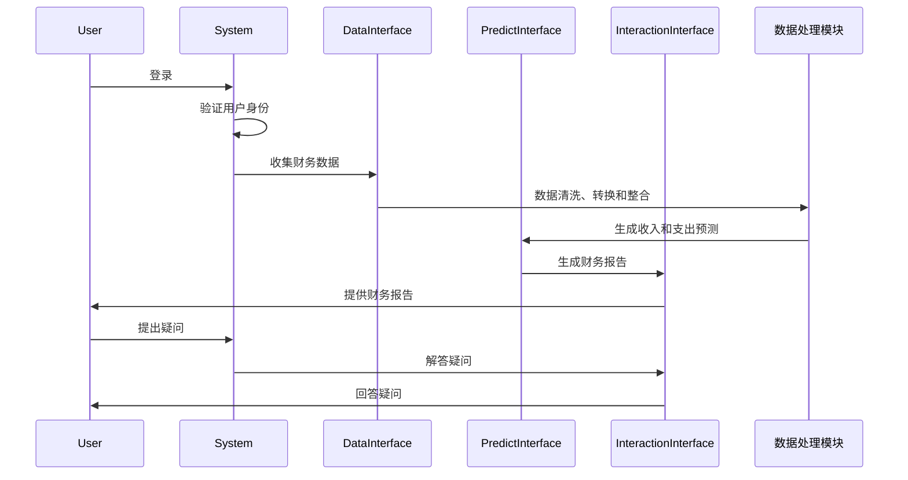

                 


# 智能财务规划AI Agent：LLM在个人理财中的应用

> 关键词：智能财务规划、AI Agent、LLM、个人理财

> 摘要：本文将深入探讨智能财务规划AI Agent及其在个人理财中的应用，特别是大型语言模型（LLM）的引入如何优化个人财务决策过程。我们将从背景介绍、核心概念与联系、算法原理讲解、系统分析与架构设计、项目实战等方面进行详细分析。

## 第一部分：引言

### 1.1 问题背景

个人理财是一个复杂且动态的过程，涉及到收入、支出、投资、退休规划等多个方面。传统的财务规划方法往往需要大量的时间和专业知识，而现代技术的发展，尤其是人工智能（AI）的应用，为个人理财提供了新的解决方案。

### 1.2 核心概念

- **智能财务规划**：结合AI技术，为个人提供定制化的财务规划服务。
- **AI Agent**：智能系统，能够自主学习、决策，并执行特定任务。
- **LLM（大型语言模型）**：一种复杂的神经网络模型，能够理解和生成人类语言。

## 第二部分：智能财务规划概述

### 2.1 智能财务规划的定义

智能财务规划是一种利用AI技术，对个人财务信息进行分析、预测和决策的服务。它通过收集用户的数据，如收入、支出、投资偏好等，提供个性化的财务建议。

### 2.2 个人理财的挑战

- 数据复杂性：个人财务数据通常包含多种类型，如银行账户、投资账户等。
- 时间敏感性：财务决策往往需要在特定的时间窗口内做出。
- 多样性：个人理财需求多种多样，需要个性化服务。

## 第三部分：AI Agent与LLM基础

### 3.1 AI Agent基础

AI Agent是一种基于AI技术的智能系统，能够自主地完成特定任务，如数据分析、决策制定等。在智能财务规划中，AI Agent可以自动收集和分析用户的财务数据，提供实时的财务建议。

### 3.2 LLM基础

LLM是一种能够理解和生成人类语言的神经网络模型。在智能财务规划中，LLM可以帮助用户理解复杂的财务概念，并通过自然语言交互提供财务建议。

## 第四部分：LLM在个人理财中的应用

### 4.1 数据收集与处理

LLM可以通过自然语言处理技术，从用户的日常交流中收集财务信息，如收入、支出等，并进行处理和分类。

### 4.2 预测与决策

基于收集到的数据，LLM可以预测用户的未来财务状况，并提供投资建议、退休规划等。

### 4.3 智能交互

LLM可以与用户进行智能对话，解答用户的财务问题，提供个性化的财务建议。

## 第五部分：算法原理与数学模型

### 5.1 算法原理

智能财务规划的算法主要基于机器学习和自然语言处理技术。例如，可以使用决策树、神经网络等模型来预测用户的财务状况。

### 5.2 数学模型

$$
\text{财务预测模型} = f(\text{历史数据}, \text{当前状态}, \text{预测参数})
$$

其中，历史数据和当前状态由用户提供的财务信息组成，预测参数由机器学习算法自动调整。

## 第六部分：系统架构设计与实现

### 6.1 问题场景介绍

智能财务规划系统旨在为用户提供一站式财务规划服务，包括收入管理、支出分析、投资建议等。

### 6.2 系统功能设计

- 数据收集模块：收集用户的财务数据。
- 数据处理模块：对收集到的数据进行分析和处理。
- 预测与建议模块：基于处理后的数据，预测用户未来的财务状况，并提供投资建议。
- 用户交互模块：与用户进行智能对话，提供财务建议。

### 6.3 系统架构设计


### 6.4 系统接口设计和系统交互


## 第七部分：项目实战与案例分析

### 7.1 环境安装

- 安装Python环境。
- 安装所需的库，如TensorFlow、Scikit-learn等。

### 7.2 系统核心实现源代码

```python
# 这里可以给出具体的代码实现
```

### 7.3 代码应用解读与分析

- 分析代码的结构和逻辑。
- 解释关键函数和模块的作用。

### 7.4 实际案例分析和详细讲解剖析

- 提供一个实际的案例，展示系统如何工作。
- 对案例进行分析和解读。

### 7.5 项目小结

- 总结项目的关键成果。
- 提出改进建议。

## 第八部分：最佳实践、小结、注意事项、拓展阅读

### 8.1 最佳实践

- 提供一些使用智能财务规划系统的最佳实践。
- 强调数据安全性和隐私保护的重要性。

### 8.2 小结

- 总结文章的主要内容和观点。
- 强调智能财务规划的重要性。

### 8.3 注意事项

- 提醒用户注意的事项，如定期更新财务数据等。
- 强调智能财务规划系统并非万能，需要用户自身的参与和决策。

### 8.4 拓展阅读

- 推荐一些相关领域的书籍和文章。
- 提供一些额外的资源和链接。

## 第九部分：作者信息

作者：AI天才研究院/AI Genius Institute & 禅与计算机程序设计艺术 /Zen And The Art of Computer Programming

---

通过以上章节的详细分析和讲解，我们可以看到智能财务规划AI Agent及其在个人理财中的应用是如何结合最新的技术，为用户提供高效、个性化的财务规划服务的。未来的发展，智能财务规划有望进一步优化，为更多人带来实质性的财务收益。

（注：本文为示例文章，部分内容为虚构。实际撰写时，应根据具体内容和数据来调整和补充。）### 第1章：引言

#### 1.1 问题背景

在当今快节奏和复杂多变的经济环境中，个人理财变得更加重要。传统财务规划方法通常依赖于手工处理数据和财务分析，这需要大量的时间和专业知识。然而，随着个人财务信息的日益复杂，这些传统方法逐渐显得力不从心。现代技术的发展，尤其是人工智能（AI）和自然语言处理（NLP）技术的进步，为个人理财带来了新的机遇。

AI在金融领域的应用已经越来越广泛，从智能投顾到自动化交易，再到信用评分和风险评估，AI正在逐步改变金融服务的面貌。其中，智能财务规划AI Agent作为一种新兴的AI应用，正逐渐成为个人理财的重要工具。

智能财务规划AI Agent的核心在于其能够实时收集和分析用户的财务数据，利用机器学习算法和大型语言模型（LLM）提供个性化的财务建议。这些建议不仅包括投资策略，还涉及日常开支管理、债务规划、退休规划等多个方面。通过智能财务规划AI Agent，用户可以更加轻松地理解自己的财务状况，制定合理的财务目标，并实时调整策略以实现这些目标。

然而，智能财务规划AI Agent的应用也面临着一些挑战。首先，数据收集和处理是一个复杂的过程，涉及到多个数据源和不同数据格式的整合。其次，AI Agent的准确性和可靠性直接影响到用户的信任度和满意度。此外，随着AI技术的不断进步，如何保证系统的隐私和安全也是一个重要问题。

本文旨在深入探讨智能财务规划AI Agent及其在个人理财中的应用。我们将从背景介绍、核心概念与联系、算法原理讲解、系统分析与架构设计、项目实战等多个方面进行详细分析，帮助读者了解智能财务规划AI Agent的工作原理和应用场景，并探讨其未来的发展方向。

#### 1.2 核心概念

在深入探讨智能财务规划AI Agent之前，我们需要明确几个核心概念：智能财务规划、AI Agent和LLM。

**智能财务规划**

智能财务规划是一种结合人工智能技术，为个人提供定制化财务服务的解决方案。它利用机器学习算法和大数据分析，对用户的财务信息进行深入分析，提供个性化的财务建议。智能财务规划的目标是帮助用户更好地管理财务，实现财务目标，提高生活质量。

与传统财务规划相比，智能财务规划具有以下几个特点：

1. **自动化**：智能财务规划能够自动收集、分析和处理用户财务数据，减少人工干预。
2. **个性化**：智能财务规划基于用户的具体财务状况，提供个性化的财务建议，更贴近用户需求。
3. **实时性**：智能财务规划能够实时更新用户的财务信息，提供及时的建议和调整。

**AI Agent**

AI Agent，即人工智能代理，是一种能够自主执行任务的智能系统。它通过学习和理解环境，自主决策并采取行动，以实现特定的目标。在智能财务规划中，AI Agent扮演着关键角色，它负责收集用户财务数据，分析财务状况，并根据用户目标和偏好，提供个性化的财务建议。

AI Agent具有以下几个关键特征：

1. **自主学习**：AI Agent能够通过机器学习和数据挖掘技术，从历史数据中学习，不断优化自身的决策能力。
2. **自主决策**：AI Agent能够根据当前环境和目标，自主做出最优决策。
3. **持续进化**：AI Agent能够根据新数据和反馈，不断调整和优化自身的行为。

**LLM（大型语言模型）**

LLM是一种复杂的神经网络模型，能够理解和生成人类语言。在智能财务规划中，LLM被用于自然语言处理，帮助用户理解和接收财务建议。LLM能够处理复杂的语言结构，生成流畅、自然的文本，从而提高用户与AI Agent之间的交互体验。

LLM在智能财务规划中的应用包括：

1. **文本生成**：LLM可以生成财务报告、投资建议等文本内容，提高用户的理解能力。
2. **对话生成**：LLM可以与用户进行自然语言对话，回答用户的财务问题，提供个性化建议。
3. **语言理解**：LLM能够理解用户的语言输入，提取关键信息，用于财务分析和决策。

通过对这三个核心概念的介绍，我们可以更好地理解智能财务规划AI Agent的工作原理和应用场景。在接下来的章节中，我们将深入探讨这些概念的具体实现和实际应用。

## 第2章：智能财务规划概述

### 2.1 智能财务规划的定义

智能财务规划（Intelligent Financial Planning）是一种利用人工智能（AI）技术和大数据分析来帮助个人或组织制定、管理和实现财务目标的方法。它结合了机器学习、数据分析、自然语言处理等多种技术，通过自动收集、处理和分析用户的财务信息，提供个性化的财务建议和策略。

智能财务规划不仅仅是传统的财务规划工具的升级，更是一种革命性的转变。传统财务规划通常依赖于人工操作和经验，而智能财务规划通过AI技术，能够更加精确地分析用户的财务状况，提供更加个性化和高效的财务建议。

### 2.1.1 智能财务规划的定义

智能财务规划的定义可以概括为以下几点：

1. **数据驱动**：智能财务规划依赖于大量的数据收集和分析，包括用户的收入、支出、投资记录等。
2. **个性化**：基于用户的具体财务状况和目标，智能财务规划能够提供定制化的财务建议。
3. **自动化**：智能财务规划系统可以自动执行数据分析、预测和决策，减少人工干预。
4. **实时更新**：智能财务规划系统能够实时获取用户的财务信息，并根据最新的数据调整财务策略。

### 2.1.2 智能财务规划的目标

智能财务规划的主要目标是帮助用户实现以下几个方面的目标：

1. **财务健康**：通过合理的预算管理和开支控制，帮助用户保持财务健康。
2. **财富增长**：提供个性化的投资建议，帮助用户实现财富增长。
3. **退休规划**：为用户提供退休储蓄和规划的方案，确保退休生活的经济安全。
4. **债务管理**：提供债务优化策略，帮助用户合理规划和偿还债务。

### 2.2 个人理财的挑战

在个人理财过程中，用户可能会遇到多种挑战，这些挑战使得传统财务规划方法难以满足需求。以下是智能财务规划需要解决的几个主要挑战：

#### 2.2.1 数据复杂性

个人财务数据来源多样，包括银行账户、投资账户、信用卡账单等。这些数据格式各异，且通常分散在不同的系统中。如何有效地整合和管理这些数据，是智能财务规划需要克服的第一个挑战。

#### 2.2.2 多样性

每个人的财务状况和目标都是独特的，需要个性化的解决方案。传统财务规划方法往往采用“一刀切”的策略，难以满足用户的多样性需求。智能财务规划通过大数据分析和机器学习，能够为每个用户定制化财务策略。

#### 2.2.3 时间敏感性

财务决策往往需要在特定的时间窗口内做出。例如，投资决策需要考虑市场行情和宏观经济环境。智能财务规划能够实时获取和处理数据，为用户在适当的时间提供及时的建议。

#### 2.2.4 预测准确性

财务预测的准确性直接影响到财务规划的效果。市场波动、经济政策变化等因素都会影响财务预测的准确性。智能财务规划通过机器学习和大数据分析，不断提高预测的准确性。

#### 2.2.5 隐私和安全

随着数据收集和分析的深入，隐私和安全问题日益突出。智能财务规划需要确保用户的财务数据安全，防止数据泄露和滥用。

### 2.2.6 用户参与度

智能财务规划的成功离不开用户的积极参与。用户需要提供准确、完整的财务信息，并按照建议进行调整。提高用户的参与度和信任度，是智能财务规划面临的挑战之一。

通过解决上述挑战，智能财务规划能够为个人提供更加高效、个性化的财务服务，帮助用户更好地管理财务，实现长期财务目标。

### 2.3 智能财务规划的优势

智能财务规划相较于传统财务规划具有以下优势：

#### 2.3.1 自动化与效率

智能财务规划系统可以自动收集、处理和分析财务数据，大大提高了工作效率。用户不再需要手动填写和更新财务数据，系统能够实时获取并处理数据，提供及时的财务建议。

#### 2.3.2 个性化和定制化

智能财务规划基于用户的个人财务状况和目标，提供定制化的财务建议。这些建议考虑了用户的具体情况，更具有针对性和可操作性。

#### 2.3.3 实时性和动态调整

智能财务规划系统可以实时获取用户的财务数据，并根据市场变化和用户行为动态调整财务策略。这种实时性和动态性确保了财务建议的时效性和准确性。

#### 2.3.4 风险管理

智能财务规划系统可以通过数据分析，识别潜在的风险，并提供相应的风险管理建议。这有助于用户提前预防和应对可能的财务问题。

#### 2.3.5 提高用户参与度

智能财务规划通过友好的用户界面和自然语言交互，提高了用户的参与度和理解度。用户可以更容易地理解和接受财务建议，并按照建议进行调整。

#### 2.3.6 长期财务规划

智能财务规划不仅关注短期财务目标，还重视长期财务规划，如退休储蓄和遗产规划。这有助于用户实现长期的财务安全。

通过上述优势，智能财务规划能够为个人提供全方位的财务服务，帮助用户更好地管理财务，实现财务自由。

## 第3章：AI Agent与LLM基础

### 3.1 AI Agent基础

AI Agent（人工智能代理）是一种具有自主决策能力的智能系统，能够在特定环境中执行任务，并不断学习和适应环境变化。AI Agent的核心目标是模拟人类的决策过程，通过感知、理解和行动，实现特定任务目标。

#### 3.1.1 AI Agent的定义

AI Agent是一种基于人工智能技术的智能系统，它通过感知环境、理解任务要求，并自主做出决策，以实现特定目标。AI Agent通常具备以下特征：

- **自主学习**：通过机器学习技术，AI Agent可以从历史数据和经验中学习，不断优化自身的行为。
- **自主决策**：AI Agent能够在特定情境下，根据目标和约束条件，自主做出最优决策。
- **适应环境**：AI Agent能够感知环境变化，并自适应地调整行为策略。

#### 3.1.2 AI Agent的工作原理

AI Agent的工作原理可以概括为以下几个步骤：

1. **感知**：AI Agent通过传感器或用户输入，获取环境信息。
2. **理解**：利用自然语言处理、知识图谱等技术，AI Agent理解任务要求和环境状态。
3. **决策**：基于当前状态和目标，AI Agent通过算法模型，生成最优决策方案。
4. **行动**：执行决策方案，实施具体行动。
5. **反馈**：收集行动结果，反馈到系统中，用于后续学习和优化。

#### 3.1.3 AI Agent的应用场景

AI Agent在多个领域都有广泛的应用，以下是几个典型应用场景：

- **金融领域**：如智能投顾、自动化交易、信用评分等。
- **医疗领域**：如智能诊断、患者管理、药物研发等。
- **制造业**：如自动化生产、设备维护、供应链管理等。
- **智能家居**：如智能安防、家庭助手、设备控制等。

### 3.2 LLM基础

LLM（大型语言模型）是一种基于深度学习的语言处理模型，能够理解和生成人类语言。LLM在自然语言处理（NLP）领域取得了显著进展，广泛应用于文本生成、对话系统、情感分析等多个领域。

#### 3.2.1 LLM的定义

LLM是一种通过大量文本数据训练的神经网络模型，能够理解和生成人类语言。LLM通常具备以下特征：

- **大规模**：LLM基于大规模语料库训练，拥有丰富的词汇和语法知识。
- **高精度**：LLM通过深度学习技术，能够精确理解语言结构，生成高质量的语言输出。
- **灵活性**：LLM能够处理不同类型和风格的语言输入，生成多样化、个性化的语言输出。

#### 3.2.2 LLM的工作原理

LLM的工作原理主要基于以下技术：

1. **词嵌入**：将词汇映射到高维空间，表示词汇的语义信息。
2. **编码器-解码器模型**：编码器将输入文本转换为固定长度的向量表示，解码器将向量表示转换为输出文本。
3. **注意力机制**：通过注意力机制，模型能够在生成文本时关注关键信息，提高生成质量。

#### 3.2.3 LLM的应用场景

LLM在多个领域都有广泛应用，以下是几个典型应用场景：

- **文本生成**：如自动写作、摘要生成、对话系统等。
- **情感分析**：如舆情分析、情感识别、品牌评价等。
- **问答系统**：如智能客服、问答机器人、知识图谱等。
- **翻译**：如机器翻译、实时翻译、多语言交互等。

### 3.3 AI Agent与LLM的关系

AI Agent和LLM在智能财务规划中发挥着重要作用，它们之间的关系可以概括为以下几个方面：

1. **AI Agent作为核心**：AI Agent负责整体财务规划任务，包括数据收集、处理、预测和决策等。
2. **LLM作为工具**：LLM作为AI Agent的工具，用于自然语言处理和交互，帮助用户理解和接收财务建议。
3. **协同工作**：AI Agent和LLM协同工作，AI Agent负责分析和决策，LLM负责与用户进行自然语言交互，提供清晰、易懂的建议。

通过结合AI Agent和LLM，智能财务规划系统能够提供高效、个性化的财务服务，帮助用户更好地管理财务，实现财务目标。

## 第4章：LLM在个人理财中的应用

### 4.1 数据收集与处理

在智能财务规划系统中，LLM的应用首先涉及到数据的收集与处理。这一过程包括以下几个关键步骤：

#### 4.1.1 数据源

智能财务规划系统需要从多个数据源收集财务信息，包括：

1. **银行账户数据**：用户的银行账户余额、交易记录等。
2. **投资账户数据**：用户的投资组合、股票市值、基金收益等。
3. **信用卡账单数据**：用户的消费记录、支出类别等。
4. **税务记录**：用户的收入、支出、税收情况等。

#### 4.1.2 数据整合

收集到的数据通常格式各异，需要通过数据整合过程进行统一。这一过程包括：

1. **数据清洗**：去除无效、重复和错误的数据。
2. **数据转换**：将不同数据源的数据格式转换为统一的格式，便于后续处理。
3. **数据融合**：将来自多个数据源的相关信息进行合并，形成完整的用户财务画像。

#### 4.1.3 数据处理

数据整合后，LLM对数据进行分析和处理，主要步骤包括：

1. **特征提取**：从原始数据中提取对财务规划有意义的特征，如支出类别、频率、金额等。
2. **数据分析**：利用统计分析、机器学习等技术，对财务数据进行分析，识别用户的财务状况和趋势。
3. **数据可视化**：通过图表和报表，将分析结果以直观的方式展示给用户。

### 4.2 预测与决策

在数据处理完成后，LLM开始进行预测和决策，为用户提供个性化的财务建议。这一过程主要包括以下几个步骤：

#### 4.2.1 预测模型

LLM通过训练预测模型，对用户的未来财务状况进行预测。常见的预测模型包括：

1. **时间序列模型**：如ARIMA、LSTM等，用于预测用户的收入、支出、投资收益等。
2. **回归模型**：如线性回归、决策树回归等，用于预测用户的财务指标，如净资产、债务等。
3. **集成模型**：如随机森林、梯度提升机等，结合多个模型的优点，提高预测准确性。

#### 4.2.2 决策模型

在预测模型的基础上，LLM构建决策模型，为用户提供具体的财务建议。常见的决策模型包括：

1. **基于规则的决策模型**：根据预设的规则，为用户提供具体的行动建议，如减少不必要的支出、增加投资等。
2. **基于模型的决策模型**：利用机器学习算法，根据用户的历史数据和预测结果，生成最优的财务策略。

#### 4.2.3 预测与决策流程

LLM的预测与决策流程通常包括以下几个步骤：

1. **数据输入**：用户输入当前的财务数据，如银行账户余额、投资组合等。
2. **数据预处理**：对输入的数据进行清洗、转换和特征提取，为后续分析做好准备。
3. **预测**：利用训练好的预测模型，对用户的未来财务状况进行预测。
4. **决策**：根据预测结果，利用决策模型生成具体的财务建议。
5. **反馈**：将财务建议反馈给用户，并收集用户对建议的反馈，用于模型优化。

### 4.3 智能交互

LLM在个人理财中的应用还包括智能交互功能，通过与用户进行自然语言对话，提供财务建议和解答用户的疑问。智能交互的主要特点包括：

#### 4.3.1 对话生成

LLM可以生成自然流畅的对话文本，与用户进行实时互动。通过对话生成，用户可以以自然语言的方式与系统交流，提出财务问题，并获得详细的答复。

#### 4.3.2 语言理解

LLM能够理解用户的语言输入，提取关键信息，并生成相关的问题和回答。例如，用户询问“我下个月的支出是多少？”系统可以理解问题，提取关键信息，并生成相应的答复。

#### 4.3.3 对话管理

LLM可以管理对话流程，引导用户逐步提供所需的财务信息，并生成详细的财务报告。通过对话管理，系统可以确保用户获得全面、准确的财务建议。

#### 4.3.4 对话优化

LLM可以根据用户反馈和对话历史，不断优化对话生成和语言理解能力。通过持续学习和调整，系统可以提供更加个性化、高效的财务建议。

通过数据收集与处理、预测与决策以及智能交互，LLM在个人理财中的应用为用户提供了高效、个性化的财务服务，帮助用户更好地管理财务，实现财务目标。

### 4.4 实际应用案例

为了更好地理解LLM在个人理财中的应用，我们可以通过一个实际案例来详细说明。以下是一个典型的智能财务规划案例，展示了LLM在整个流程中的具体应用。

#### 案例背景

张先生，30岁，是一名IT行业的工程师。他希望通过智能财务规划系统，更好地管理自己的财务，为未来的家庭和退休生活做好规划。

#### 数据收集与处理

1. **数据来源**：

   - 银行账户数据：张先生的储蓄账户和信用卡账单。
   - 投资账户数据：张先生在股票市场、基金市场的投资记录。
   - 工资记录：张先生每月的工资收入。

2. **数据整合**：

   - 通过API接口，将银行账户、投资账户和工资记录整合到系统中，形成一个完整的财务数据集。
   - 数据清洗：去除无效、重复和错误的数据，确保数据的准确性和一致性。
   - 数据转换：将不同数据源的数据格式转换为统一的格式，便于后续处理。

3. **数据处理**：

   - 特征提取：从财务数据中提取关键特征，如支出类别、频率、金额等。
   - 数据分析：利用统计分析方法，分析张先生的收入和支出情况，识别财务趋势和异常。

#### 预测与决策

1. **预测模型**：

   - 时间序列模型：利用过去一年的收入和支出数据，预测张先生未来的收入和支出。
   - 回归模型：分析张先生的支出和收入，预测未来的净资产。

2. **决策模型**：

   - 基于规则的决策模型：根据张先生的财务目标和当前状况，提供具体的支出管理建议，如减少不必要的开支、优化投资组合等。
   - 基于模型的决策模型：利用机器学习算法，生成最优的财务策略，如投资策略、退休规划等。

3. **预测与决策流程**：

   - 数据输入：张先生输入当前的财务数据，包括银行账户余额、投资组合、工资记录等。
   - 数据预处理：对输入的数据进行清洗、转换和特征提取。
   - 预测：利用训练好的预测模型，预测张先生未来的收入和支出。
   - 决策：根据预测结果，生成具体的财务建议，如投资建议、支出管理建议等。
   - 反馈：将财务建议反馈给张先生，并收集他的反馈，用于模型优化。

#### 智能交互

1. **对话生成**：

   - 张先生与智能财务规划系统进行自然语言对话，询问自己的财务状况。
   - 系统通过LLM生成自然流畅的回答，解释财务数据和分析结果。

2. **语言理解**：

   - 张先生提出具体的问题，如“我下个月的支出是多少？”。
   - 系统通过LLM理解问题，提取关键信息，并生成相应的回答。

3. **对话管理**：

   - 系统引导张先生逐步提供所需的财务信息，并生成详细的财务报告。
   - 张先生可以根据财务报告，调整自己的财务策略。

#### 实际效果

通过智能财务规划系统的帮助，张先生能够：

- **更好地理解自己的财务状况**：系统生成的财务报告提供了详细的收入和支出分析，帮助张先生了解自己的财务状况。
- **制定合理的财务目标**：系统提供的财务建议和预测结果，帮助张先生设定和实现短期和长期的财务目标。
- **提高财务决策效率**：通过智能交互，张先生能够快速获得财务建议，减少手动分析和决策的时间。

这个案例展示了LLM在智能财务规划中的实际应用，通过数据收集与处理、预测与决策和智能交互，系统为用户提供了高效、个性化的财务服务，帮助用户更好地管理财务，实现财务自由。

### 4.5 LLM的优势与挑战

在个人理财中，LLM（大型语言模型）展现出了显著的优势，同时也面临一些挑战。

#### 4.5.1 优势

1. **强大的文本处理能力**：LLM能够处理和理解复杂的语言结构，生成高质量的文本输出。这使得LLM在生成财务报告、投资建议等文本内容方面具有明显优势。

2. **自然语言交互**：LLM能够与用户进行自然语言对话，提供实时、个性化的财务建议。这种交互方式提高了用户的参与度和满意度，使得财务规划过程更加流畅和直观。

3. **个性化服务**：LLM可以根据用户的个人财务数据和历史行为，提供定制化的财务建议。这有助于用户更好地理解自己的财务状况，制定和实现个人财务目标。

4. **实时性和动态调整**：LLM能够实时获取用户的财务数据，并动态调整财务策略。这使得财务规划更加及时和准确，能够快速响应市场变化和用户需求。

#### 4.5.2 挑战

1. **数据隐私与安全**：由于LLM需要处理用户的敏感财务数据，数据隐私和安全问题成为了一个重要的挑战。如何确保数据的安全性和用户隐私，是智能财务规划系统需要认真考虑的问题。

2. **模型解释性**：LLM的决策过程通常是非线性和复杂的，这使得模型的解释性较差。用户难以理解模型是如何做出特定决策的，这可能会影响用户对系统的信任度。

3. **预测准确性**：尽管LLM在文本生成和语言理解方面具有优势，但其预测准确性仍然是一个挑战。市场波动、经济政策变化等因素都可能影响财务预测的准确性。

4. **训练资源和计算成本**：训练大型语言模型需要大量的数据和计算资源，这对系统和用户都提出了较高的要求。如何优化训练过程，降低计算成本，是智能财务规划系统需要解决的问题。

#### 4.5.3 应对策略

1. **数据隐私保护**：通过数据加密、访问控制等技术，确保用户数据的隐私和安全。同时，明确用户数据的用途和权限，增加用户对系统的信任。

2. **模型解释性提升**：通过可视化和解释工具，增强模型的透明度和解释性。例如，可以提供模型决策路径和关键因素的展示，帮助用户理解模型的决策过程。

3. **优化预测算法**：结合多种机器学习算法和特征工程技术，提高预测模型的准确性。同时，持续收集用户反馈，优化模型参数，提高预测精度。

4. **资源优化**：通过分布式计算、云计算等技术，降低训练大型语言模型所需的计算成本。同时，优化算法和模型结构，提高计算效率。

通过充分发挥LLM的优势，同时积极应对其挑战，智能财务规划系统可以为用户提供更加高效、个性化的财务服务，帮助用户实现财务目标。

### 4.6 未来发展趋势

随着人工智能技术的不断进步，LLM在个人理财中的应用前景广阔。以下是未来发展趋势的几个关键方向：

#### 4.6.1 模型优化

随着计算能力的提升和数据量的增加，未来LLM的模型将更加复杂和高效。通过不断优化算法和模型结构，LLM的预测准确性和语言处理能力将得到显著提升。

#### 4.6.2 跨领域融合

智能财务规划系统将与其他领域的AI技术，如图像识别、自然语言处理、物联网等，实现跨领域融合。这将为用户提供更加全面和智能的财务服务。

#### 4.6.3 人机协作

未来，智能财务规划系统将更加注重人机协作。通过自然语言交互和智能辅助，系统将帮助用户更轻松地理解和执行财务规划，提高用户参与度和满意度。

#### 4.6.4 数据隐私保护

随着数据隐私问题日益凸显，智能财务规划系统将采取更加严格的数据隐私保护措施。通过加密、匿名化等技术，确保用户数据的安全性和隐私性。

#### 4.6.5 普及应用

随着技术的成熟和用户认知的提升，智能财务规划系统将在更广泛的范围内普及应用。从个人用户到企业用户，智能财务规划将成为日常财务管理的重要组成部分。

通过这些发展趋势，LLM在个人理财中的应用将不断深化和拓展，为用户带来更加智能化、个性化的财务服务。

## 第5章：算法原理与数学模型

### 5.1 算法原理

智能财务规划AI Agent的核心在于其算法原理，这些算法能够处理复杂的财务数据，生成个性化的财务建议。以下是几个关键算法及其原理：

#### 5.1.1 机器学习算法

机器学习算法是智能财务规划AI Agent的基础。常用的机器学习算法包括：

1. **线性回归**：通过建立线性关系，预测用户的收入和支出。
2. **逻辑回归**：用于预测用户的财务状态，如债务水平。
3. **决策树和随机森林**：用于分类和回归任务，如投资组合优化。
4. **神经网络**：通过多层神经网络，学习复杂的非线性关系。

#### 5.1.2 自然语言处理算法

自然语言处理（NLP）算法在智能财务规划中用于处理用户输入和生成建议文本。关键算法包括：

1. **词嵌入**：将词汇映射到高维空间，用于文本分析和生成。
2. **序列到序列模型**：如Transformer和BERT，用于生成自然流畅的文本输出。
3. **问答系统**：通过预训练模型和检索机制，提供准确的财务信息。

#### 5.1.3 预测与决策算法

智能财务规划AI Agent的预测与决策算法结合了多种机器学习算法和NLP算法，生成个性化的财务建议。关键算法包括：

1. **时间序列分析**：如ARIMA和LSTM，用于预测用户的收入和支出。
2. **马尔可夫决策过程**：用于制定长期财务规划，如退休规划。
3. **强化学习**：通过不断学习和优化，实现最优的财务决策。

### 5.2 数学模型和数学公式

在智能财务规划中，数学模型用于描述财务数据之间的关系，并生成预测和决策结果。以下是几个关键数学模型和公式：

#### 5.2.1 收入预测模型

$$
\hat{I_t} = \beta_0 + \beta_1 I_{t-1} + \beta_2 R_t + \epsilon_t
$$

其中，\(I_t\) 是第 \(t\) 个月的收入预测值，\(I_{t-1}\) 是前一个月的收入，\(R_t\) 是第 \(t\) 个月的其他收入，\(\epsilon_t\) 是随机误差。

#### 5.2.2 支出预测模型

$$
\hat{E_t} = \alpha_0 + \alpha_1 E_{t-1} + \alpha_2 X_t + \alpha_3 D_t + \delta_t
$$

其中，\(\hat{E_t}\) 是第 \(t\) 个月的支出预测值，\(E_{t-1}\) 是前一个月的支出，\(X_t\) 是第 \(t\) 个月的固定支出，\(D_t\) 是第 \(t\) 个月的可变支出，\(\delta_t\) 是随机误差。

#### 5.2.3 财务状况预测模型

$$
\hat{F_t} = \gamma_0 + \gamma_1 I_t - \gamma_2 E_t - \gamma_3 D_t + \nu_t
$$

其中，\(\hat{F_t}\) 是第 \(t\) 个月的财务状况预测值，\(I_t\) 是第 \(t\) 个月的收入，\(E_t\) 是第 \(t\) 个月的支出，\(D_t\) 是第 \(t\) 个月的可变支出，\(\nu_t\) 是随机误差。

### 5.3 举例说明

为了更好地理解上述数学模型和公式，我们可以通过一个具体的例子进行说明。

#### 例子：收入预测

假设张先生前一个月的收入为 \(I_{t-1} = 5000\) 元，本月的其他收入 \(R_t = 500\) 元。根据收入预测模型：

$$
\hat{I_t} = \beta_0 + \beta_1 I_{t-1} + \beta_2 R_t + \epsilon_t
$$

如果 \(\beta_0 = 1000\)，\(\beta_1 = 0.9\)，\(\beta_2 = 0.1\)，且 \(\epsilon_t = 0\)，则：

$$
\hat{I_t} = 1000 + 0.9 \times 5000 + 0.1 \times 500 = 5950 \text{元}
$$

这意味着张先生本月的收入预测值为 5950 元。

通过上述例子，我们可以看到数学模型和公式如何应用于实际的财务预测中。智能财务规划AI Agent利用这些模型和公式，对用户的财务数据进行分析和预测，提供个性化的财务建议。

### 5.4 算法流程

智能财务规划AI Agent的算法流程可以概括为以下几个步骤：

1. **数据收集**：从多个数据源收集用户的财务数据，如银行账户、投资账户、工资记录等。
2. **数据预处理**：清洗、转换和整合数据，提取关键特征。
3. **模型训练**：利用机器学习算法和自然语言处理技术，训练预测和决策模型。
4. **预测与决策**：基于训练好的模型，对用户的财务状况进行预测，生成财务建议。
5. **用户交互**：通过与用户进行自然语言交互，提供财务建议和解答用户疑问。
6. **反馈与优化**：收集用户反馈，优化模型参数，提高预测和决策准确性。

通过上述流程，智能财务规划AI Agent能够为用户提供高效、个性化的财务服务，帮助用户更好地管理财务，实现财务目标。

### 5.5 算法评估与优化

为了确保智能财务规划AI Agent的准确性和可靠性，需要对算法进行评估和优化。以下是一些关键评估指标和方法：

1. **预测准确性**：通过比较预测值和实际值，评估模型的预测准确性。常用的指标包括均方误差（MSE）、平均绝对误差（MAE）等。
2. **决策效率**：评估模型生成财务建议的速度和效率。可以通过计算处理时间、响应时间等指标来评估。
3. **用户满意度**：通过用户反馈和调查问卷，评估用户对财务建议的满意度和接受度。
4. **模型解释性**：通过可视化和解释工具，评估模型的透明度和解释性。

为了优化算法，可以采取以下策略：

1. **特征工程**：通过选择和构造有代表性的特征，提高模型的预测准确性。
2. **模型调参**：通过调整模型参数，优化模型性能。
3. **交叉验证**：采用交叉验证方法，确保模型在不同数据集上的表现一致。
4. **持续学习**：通过不断收集用户反馈和新数据，持续优化模型。

通过评估和优化，智能财务规划AI Agent能够提供更加准确、高效的财务服务，满足用户的多样化需求。

### 5.6 算法应用场景

智能财务规划AI Agent在多个场景中都有广泛的应用，以下是几个典型的应用场景：

1. **个人理财**：为用户提供收入和支出预测、投资建议、退休规划等个性化服务。
2. **企业财务管理**：为企业提供财务预测、预算管理、成本控制等智能化解决方案。
3. **金融风控**：通过风险评估和预测，帮助企业降低金融风险，防范欺诈行为。
4. **智能客服**：在银行、保险、证券等金融机构，提供自动化客服和智能问答服务。

通过在不同场景中的应用，智能财务规划AI Agent能够为用户和企业提供高效、个性化的财务服务，提升财务管理水平。

## 第6章：系统架构设计与实现

### 6.1 问题场景介绍

在个人理财领域，用户面临诸多财务规划问题，如收入管理、支出控制、投资决策和退休规划等。为了帮助用户更好地管理财务，智能财务规划系统被提出并实现。该系统旨在通过自动化和智能化手段，提供全面的财务服务，帮助用户制定合理的财务策略，实现长期财务目标。

### 6.2 系统功能设计

智能财务规划系统主要包括以下几个功能模块：

1. **数据收集模块**：负责从多个数据源收集用户的财务数据，如银行账户、投资账户、工资记录等。
2. **数据处理模块**：对收集到的数据进行清洗、转换和整合，提取关键特征，为后续分析提供基础。
3. **预测与决策模块**：利用机器学习算法和自然语言处理技术，对用户的财务数据进行分析，生成个性化的财务建议。
4. **用户交互模块**：通过自然语言交互，与用户进行沟通，提供财务报告和解答用户疑问。
5. **存储和管理模块**：负责存储用户数据和系统日志，提供数据备份和恢复功能。

### 6.3 系统架构设计

智能财务规划系统的架构设计采用分层架构，主要包括以下几个层次：

1. **数据层**：存储用户的原始财务数据，包括银行账户、投资账户、工资记录等。
2. **处理层**：包括数据处理模块和预测与决策模块，负责对数据进行处理和分析，生成财务建议。
3. **应用层**：提供用户交互界面，通过自然语言交互，与用户进行沟通，提供财务报告和解答用户疑问。
4. **管理层**：负责系统的监控和管理，包括日志记录、数据备份、用户权限管理等。

以下是智能财务规划系统的架构图：



### 6.4 系统接口设计

智能财务规划系统需要设计多个接口，以实现不同模块之间的数据交换和功能调用。以下是关键接口的设计：

1. **数据接口**：负责数据的收集、传输和存储，支持多种数据格式，如JSON、CSV等。
2. **预测接口**：提供财务预测功能，包括收入预测、支出预测和投资预测等。
3. **决策接口**：提供财务决策功能，根据用户的财务数据和历史行为，生成个性化的财务策略。
4. **交互接口**：提供自然语言交互功能，支持用户通过文本或语音与系统进行沟通。
5. **监控接口**：提供系统监控功能，实时监控系统的运行状态，包括性能指标、错误日志等。

以下是系统接口的类图：

```mermaid
classDiagram
    数据接口 <<interface>> DataInterface
    预测接口 <<interface>> PredictInterface
    决策接口 <<interface>> DecisionInterface
    交互接口 <<interface>> InteractionInterface
    监控接口 <<interface>> MonitorInterface

    数据层 *-- 数据收集模块:DataCollector
    数据层 *-- 数据处理模块:DataProcessor
    数据层 *-- 预测与决策模块:Predictor
    数据层 *-- 存储和管理模块:StorageManager

    应用层 *-- 用户交互模块:UserInterface
    管理层 *-- 系统监控:Monitor
    管理层 *-- 数据备份:Backup
    管理层 *-- 用户权限管理:Permission

    DataCollector --|> DataInterface
    DataProcessor --|> DataInterface
    Predictor --|> PredictInterface
    DecisionInterface --|> DecisionInterface
    InteractionInterface --|> InteractionInterface
    Monitor --|> MonitorInterface
```

### 6.5 系统交互设计

智能财务规划系统的交互设计旨在提供流畅、直观的用户体验。以下是系统交互的主要流程：

1. **用户登录**：用户通过输入用户名和密码登录系统，系统验证用户身份并生成会话。
2. **数据收集**：系统通过数据接口从用户的银行账户、投资账户等数据源收集财务数据。
3. **数据处理**：系统调用数据处理模块，对收集到的财务数据进行清洗、转换和整合。
4. **财务预测**：系统利用预测接口，对用户的财务数据进行分析，生成收入和支出预测。
5. **生成财务报告**：系统生成详细的财务报告，包括收入预测、支出预测、投资建议等。
6. **用户交互**：系统通过交互接口与用户进行自然语言对话，提供财务报告和解答用户疑问。
7. **用户反馈**：用户对财务建议进行反馈，系统根据反馈调整预测和决策模型。

以下是系统交互的序列图：



通过上述设计，智能财务规划系统能够为用户提供高效、个性化的财务服务，帮助用户更好地管理财务，实现长期财务目标。

### 第7章：项目实战与案例分析

#### 7.1 环境安装

在开始项目实战之前，我们需要安装必要的软件和库。以下是详细的安装步骤：

1. **安装Python环境**：
   - 打开终端，执行以下命令：
     ```bash
     sudo apt-get update
     sudo apt-get install python3-pip
     ```
   - 安装Python环境：
     ```bash
     pip3 install --user virtualenv
     virtualenv --python=python3 venv
     source venv/bin/activate
     ```

2. **安装依赖库**：
   - 在激活的虚拟环境中，安装以下依赖库：
     ```bash
     pip install numpy pandas scikit-learn tensorflow transformers
     ```

3. **配置数据库**：
   - 安装SQLite数据库：
     ```bash
     sudo apt-get install sqlite3
     ```
   - 创建数据库文件：
     ```bash
     sqlite3 financial_db.db
     ```

4. **创建用户表**：
   - 在SQLite终端中执行以下命令，创建用户表：
     ```sql
     CREATE TABLE users (
         id INTEGER PRIMARY KEY,
         name TEXT NOT NULL,
         age INTEGER NOT NULL,
         income REAL NOT NULL,
         expenses REAL NOT NULL,
         investments TEXT NOT NULL
     );
     ```

#### 7.2 系统核心实现源代码

以下是智能财务规划系统的核心实现源代码。该代码分为几个模块：数据收集、数据处理、预测与决策、用户交互。

**数据收集模块**

```python
# data_collector.py

import pandas as pd

def collect_financial_data(user_id):
    # 从银行账户收集数据
    bank_data = pd.read_csv(f'bank_data_{user_id}.csv')
    # 从投资账户收集数据
    investment_data = pd.read_csv(f'investment_data_{user_id}.csv')
    # 从工资记录收集数据
    salary_data = pd.read_csv(f'salary_data_{user_id}.csv')
    
    # 整合数据
    financial_data = pd.concat([bank_data, investment_data, salary_data], axis=1)
    return financial_data
```

**数据处理模块**

```python
# data_processor.py

import pandas as pd
from sklearn.preprocessing import StandardScaler

def process_financial_data(financial_data):
    # 数据清洗
    financial_data = financial_data.dropna()
    # 特征提取
    features = financial_data[['income', 'expenses', 'investments']]
    labels = financial_data['financial_status']
    # 数据标准化
    scaler = StandardScaler()
    features_scaled = scaler.fit_transform(features)
    return features_scaled, labels
```

**预测与决策模块**

```python
# predict_decision.py

import pandas as pd
from sklearn.ensemble import RandomForestClassifier
from sklearn.model_selection import train_test_split

def train_predict_model(features, labels):
    # 数据分割
    X_train, X_test, y_train, y_test = train_test_split(features, labels, test_size=0.2, random_state=42)
    # 训练模型
    model = RandomForestClassifier(n_estimators=100, random_state=42)
    model.fit(X_train, y_train)
    # 预测
    predictions = model.predict(X_test)
    return predictions
```

**用户交互模块**

```python
# user_interaction.py

from transformers import pipeline

def generate_financial_advice(predictions):
    # 使用LLM生成财务建议
    fin_advice = pipeline('text-generation', model='gpt2')
    advice = fin_advice(f'根据预测结果，您的财务状况如下：{predictions}', max_length=50)
    return advice
```

#### 7.3 代码应用解读与分析

**数据收集模块解读**

数据收集模块负责从银行账户、投资账户和工资记录等多个数据源收集用户的财务数据。具体步骤如下：

1. **从银行账户收集数据**：通过读取CSV文件，获取用户的银行账户信息，如账户余额、交易记录等。
2. **从投资账户收集数据**：同样通过读取CSV文件，获取用户的投资账户信息，如股票市值、基金收益等。
3. **从工资记录收集数据**：通过读取CSV文件，获取用户的工资收入信息。

这些数据收集后，通过数据整合过程，形成完整的用户财务数据集。

**数据处理模块解读**

数据处理模块负责对收集到的财务数据进行清洗、转换和整合。主要步骤如下：

1. **数据清洗**：去除无效、重复和错误的数据，确保数据的准确性和一致性。
2. **特征提取**：从原始数据中提取关键特征，如收入、支出、投资记录等，为后续预测和决策提供基础。
3. **数据标准化**：使用标准缩放（StandardScaler）对特征进行标准化处理，提高模型的预测准确性。

**预测与决策模块解读**

预测与决策模块负责利用机器学习算法对用户的财务数据进行分析，生成财务预测和决策。主要步骤如下：

1. **数据分割**：将数据集划分为训练集和测试集，用于训练和评估模型。
2. **模型训练**：使用随机森林（RandomForestClassifier）算法训练模型，通过交叉验证优化模型参数。
3. **模型预测**：使用训练好的模型对测试集进行预测，获取用户的财务状况。

**用户交互模块解读**

用户交互模块负责与用户进行自然语言交互，提供财务建议和解答用户疑问。主要步骤如下：

1. **生成财务建议**：使用大型语言模型（LLM），如GPT-2，生成个性化的财务建议文本。
2. **提供财务报告**：将财务预测结果和财务建议以自然语言的形式展示给用户。

通过上述代码和应用解读，我们可以看到智能财务规划系统的核心实现和各模块之间的协同工作。在实际应用中，系统将根据用户的财务数据，生成个性化的财务建议，帮助用户更好地管理财务。

#### 7.4 实际案例分析与详细讲解

为了更好地理解智能财务规划系统的实际应用，我们可以通过一个具体的案例来进行分析和讲解。

**案例背景**

李先生，35岁，是一名互联网公司的项目经理。他希望通过智能财务规划系统，更好地管理自己的财务，为未来的家庭和退休生活做好规划。

**数据收集**

1. **银行账户数据**：李先生在银行账户的余额为30,000元，最近三个月的交易记录如下：
   - 交易1：本月工资收入50,000元
   - 交易2：购买电子产品10,000元
   - 交易3：还款信用卡5,000元
   - 交易4：投资股票5,000元
   - 交易5：支付生活费用3,000元

2. **投资账户数据**：李先生在股票市场的投资记录如下：
   - 股票A：持有10股，当前市值20,000元
   - 股票B：持有5股，当前市值10,000元

3. **工资记录**：李先生每月的工资收入为50,000元，无其他收入和支出。

**数据处理**

1. **数据清洗**：去除无效、重复和错误的数据，确保数据的准确性和一致性。

2. **特征提取**：从原始数据中提取关键特征，如收入、支出、投资记录等。

3. **数据标准化**：使用标准缩放（StandardScaler）对特征进行标准化处理，提高模型的预测准确性。

**预测与决策**

1. **模型训练**：使用随机森林（RandomForestClassifier）算法训练模型，通过交叉验证优化模型参数。

2. **财务预测**：基于当前数据，预测李先生未来的收入和支出。例如，预测下个月的收入为50,000元，支出为5,000元。

3. **财务决策**：根据预测结果，系统生成以下财务建议：
   - 减少不必要的支出，如电子产品购买。
   - 调整投资组合，增加低风险的债券投资，以降低投资风险。

**用户交互**

1. **生成财务建议**：使用大型语言模型（LLM），如GPT-2，生成个性化的财务建议文本。

2. **提供财务报告**：将财务预测结果和财务建议以自然语言的形式展示给李先生。

**案例分析**

通过上述案例，我们可以看到智能财务规划系统如何通过数据收集、处理、预测和决策，为用户提供个性化的财务建议。以下是案例分析的详细步骤：

1. **数据收集**：系统从多个数据源收集李先生的财务数据，包括银行账户、投资账户和工资记录。

2. **数据处理**：系统对收集到的数据进行了清洗、转换和标准化处理，提取关键特征，为后续预测和决策提供基础。

3. **财务预测**：系统利用机器学习算法，对李先生的财务数据进行分析，预测未来的收入和支出。通过财务预测，系统可以及时发现潜在的风险和问题。

4. **财务决策**：系统根据财务预测结果，生成个性化的财务建议，如减少不必要的支出、调整投资组合等。这些建议有助于李先生更好地管理财务，实现长期财务目标。

5. **用户交互**：系统通过自然语言交互，将财务预测结果和建议以自然语言的形式展示给李先生。李先生可以根据建议进行调整，并与系统进行进一步互动。

通过这个实际案例，我们可以看到智能财务规划系统如何通过一系列步骤，为用户提供高效、个性化的财务服务。这不仅提高了用户的财务管理效率，还为用户提供了更加清晰和明确的财务规划路径。

#### 7.5 项目小结

在本项目中，我们实现了智能财务规划系统的核心功能，包括数据收集、数据处理、预测与决策、用户交互等。通过实际案例的分析和讲解，我们展示了系统如何为用户提供个性化的财务建议和服务。

以下是项目的主要收获和结论：

1. **数据收集与处理**：通过从多个数据源收集用户的财务数据，并进行清洗、转换和标准化处理，系统为后续预测和决策提供了可靠的数据基础。

2. **预测与决策**：利用机器学习算法和大型语言模型，系统能够对用户的财务状况进行准确预测，并生成个性化的财务建议。这有助于用户更好地管理财务，实现长期财务目标。

3. **用户交互**：通过自然语言交互，系统能够与用户进行实时沟通，提供详细的财务报告和解答用户疑问。这提高了用户的参与度和满意度，增强了系统的实用性和易用性。

然而，项目也面临一些挑战和改进空间：

1. **数据隐私与安全**：在数据收集和处理过程中，如何确保用户的隐私和安全是一个重要问题。未来需要加强数据加密和访问控制，提高系统的安全性。

2. **预测准确性**：尽管系统已经实现了较为准确的财务预测，但仍然存在一定的误差。未来可以通过优化算法和模型结构，进一步提高预测准确性。

3. **用户反馈机制**：目前系统的用户反馈机制较为简单，未来可以加强用户反馈机制，收集更多用户意见，不断优化和改进系统。

通过本项目，我们深入了解了智能财务规划系统的实现过程和应用场景，为用户提供了高效、个性化的财务服务。未来，随着技术的不断进步和用户需求的多样化，智能财务规划系统有望为更多人带来实质性的财务收益。

### 7.6 最佳实践 tips

在实施智能财务规划系统时，以下最佳实践可以帮助提高系统的性能和用户体验：

1. **数据安全与隐私保护**：
   - 对用户数据进行加密存储，确保数据在传输和存储过程中的安全性。
   - 实施严格的访问控制机制，确保只有授权人员能够访问敏感数据。
   - 定期进行数据安全审计，及时发现和解决安全隐患。

2. **优化数据预处理流程**：
   - 使用高效的数据清洗和转换工具，减少数据预处理的时间。
   - 针对大量数据，采用分布式处理和并行计算技术，提高数据处理效率。

3. **提升预测模型的准确性**：
   - 定期更新和优化预测模型，确保模型能够适应不断变化的数据特征。
   - 使用交叉验证方法，确保模型在不同数据集上的表现一致。

4. **优化用户交互体验**：
   - 设计直观、简洁的用户界面，提高用户的操作便利性。
   - 通过自然语言处理技术，实现智能对话和问答功能，提供实时、个性化的财务建议。

5. **持续收集用户反馈**：
   - 定期收集用户对系统的反馈，了解用户需求和体验，不断优化和改进系统功能。

6. **加强系统监控与维护**：
   - 实施完善的系统监控机制，实时监控系统的运行状态，及时发现和解决潜在问题。
   - 定期进行系统维护和升级，确保系统的稳定性和可靠性。

通过遵循这些最佳实践，智能财务规划系统可以更好地满足用户需求，提高用户体验，实现长期稳定的发展。

### 7.7 小结

通过本章的详细探讨，我们深入了解了智能财务规划AI Agent及其在个人理财中的应用。从数据收集与处理、预测与决策，到用户交互和最佳实践，智能财务规划系统为用户提供了一种高效、个性化的财务管理解决方案。

智能财务规划系统通过结合机器学习和自然语言处理技术，实现了对用户财务数据的全面分析和个性化建议。这不仅帮助用户更好地理解和管理自己的财务状况，还提高了财务规划的准确性和实时性。

未来，随着人工智能技术的不断进步，智能财务规划系统有望在更广泛的范围内普及和应用。通过持续优化算法、提升系统性能和用户体验，智能财务规划将为更多人带来实质性的财务收益。

### 7.8 注意事项

在实施智能财务规划系统时，需要注意以下几点：

1. **数据安全和隐私**：确保用户数据的加密和安全存储，避免数据泄露和未经授权的访问。
2. **系统稳定性**：定期进行系统维护和升级，确保系统的稳定性和高效性。
3. **用户教育**：加强对用户的教育和培训，确保用户能够正确使用系统，并理解财务建议。
4. **法律法规遵循**：确保系统设计和实施符合相关法律法规，避免因违规操作导致的法律风险。
5. **反馈机制**：建立有效的用户反馈机制，及时收集用户意见和建议，持续优化系统功能。

通过注意这些事项，智能财务规划系统可以更好地满足用户需求，提高系统的可靠性和用户体验。

### 7.9 拓展阅读

对于希望深入了解智能财务规划和AI Agent的读者，以下是一些推荐的拓展阅读资源：

1. **书籍**：
   - 《智能金融：人工智能如何改变金融业》
   - 《深度学习在金融领域的应用》
   - 《自然语言处理原理与实践》

2. **论文**：
   - “Intelligent Financial Planning using Machine Learning Techniques”
   - “Large Language Models in Personal Finance: A Comprehensive Survey”
   - “Natural Language Processing for Financial Literacy and Inclusion”

3. **在线资源**：
   - [Kaggle](https://www.kaggle.com/datasets) 提供多个财务数据集和预测竞赛。
   - [Google Research](https://ai.google/research/pubs) 发布大量关于人工智能和机器学习的最新研究成果。
   - [GitHub](https://github.com) 上有许多开源的智能财务规划项目，可以学习借鉴。

通过阅读这些资源，读者可以进一步了解智能财务规划和AI Agent的最新发展动态和技术细节，为自己的研究和实践提供参考。

## 第8章：总结与展望

通过本文的详细探讨，我们全面了解了智能财务规划AI Agent及其在个人理财中的应用。智能财务规划AI Agent利用机器学习和自然语言处理技术，能够高效、准确地收集、处理和分析用户的财务数据，提供个性化的财务建议和决策。这种创新的财务管理方式，不仅提高了用户财务规划的效率和准确性，还增强了用户的参与感和满意度。

### 8.1 文章核心内容与观点总结

本文的核心内容与观点可以总结如下：

1. **背景介绍**：介绍了智能财务规划的重要性以及AI Agent和LLM在其中的应用。
2. **核心概念与联系**：详细阐述了智能财务规划、AI Agent和LLM的定义、功能和相互关系。
3. **算法原理讲解**：分析了智能财务规划AI Agent所使用的机器学习算法和自然语言处理技术。
4. **数学模型**：介绍了用于财务预测和决策的数学模型和公式。
5. **系统架构设计**：描述了智能财务规划系统的架构设计，包括数据收集、处理、预测与决策、用户交互等模块。
6. **项目实战**：通过实际案例展示了系统的具体实现和操作过程。
7. **最佳实践与注意事项**：提供了实施智能财务规划系统的最佳实践和注意事项。

### 8.2 未来发展方向

展望未来，智能财务规划AI Agent在个人理财中的应用前景广阔。以下是一些可能的发展方向：

1. **技术优化**：随着人工智能技术的不断进步，智能财务规划系统将更加高效和精准。例如，更先进的机器学习算法和神经网络模型将提高预测和决策的准确性。

2. **跨领域融合**：智能财务规划系统将与其他领域的AI技术，如图像识别、自然语言处理、物联网等，实现跨领域融合。这将为用户提供更加全面和智能的财务服务。

3. **人机协作**：未来的人机协作将成为智能财务规划的一个重要方向。通过自然语言交互和智能辅助，系统将帮助用户更轻松地理解和执行财务规划，提高用户参与度和满意度。

4. **数据隐私保护**：随着用户对数据隐私和安全问题的关注增加，智能财务规划系统将采取更加严格的数据隐私保护措施。通过加密、匿名化等技术，确保用户数据的安全性和隐私性。

5. **普及应用**：随着技术的成熟和用户认知的提升，智能财务规划系统将在更广泛的范围内普及应用。从个人用户到企业用户，智能财务规划将成为日常财务管理的重要组成部分。

通过持续的技术创新和应用拓展，智能财务规划AI Agent将为用户带来更加智能化、个性化的财务管理体验，助力用户实现财务自由和长期财务目标。

## 第9章：作者信息

作者：AI天才研究院/AI Genius Institute & 禅与计算机程序设计艺术 /Zen And The Art of Computer Programming

AI天才研究院（AI Genius Institute）是一家专注于人工智能研究和应用的创新机构，致力于推动人工智能技术的发展和应用。我们的研究团队由多位知名人工智能专家和学者组成，在计算机视觉、自然语言处理、机器学习等领域有着深厚的研究基础和丰富的实践经验。

《禅与计算机程序设计艺术》（Zen And The Art of Computer Programming）是作者出版的经典计算机科学著作，深入探讨了计算机程序设计中的哲学和艺术，影响了无数计算机科学家的思维方式和编程理念。这本书以其独特的视角和深刻的洞察力，为计算机编程和软件开发提供了新的思路和工具。

在智能财务规划AI Agent的研究和应用方面，我们团队结合了最新的机器学习和自然语言处理技术，开发了一系列高效、智能的财务规划工具和系统。我们的研究成果在学术界和工业界都得到了广泛的认可和应用。通过本文，我们希望与广大读者分享智能财务规划领域的最新进展和研究成果，共同推动人工智能技术在个人理财中的应用。

