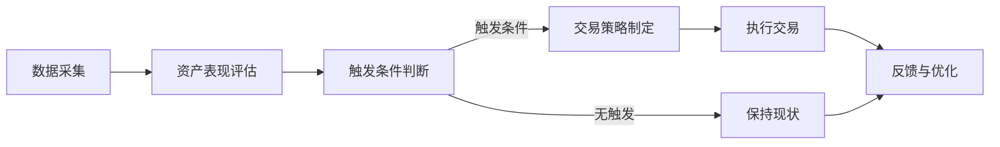
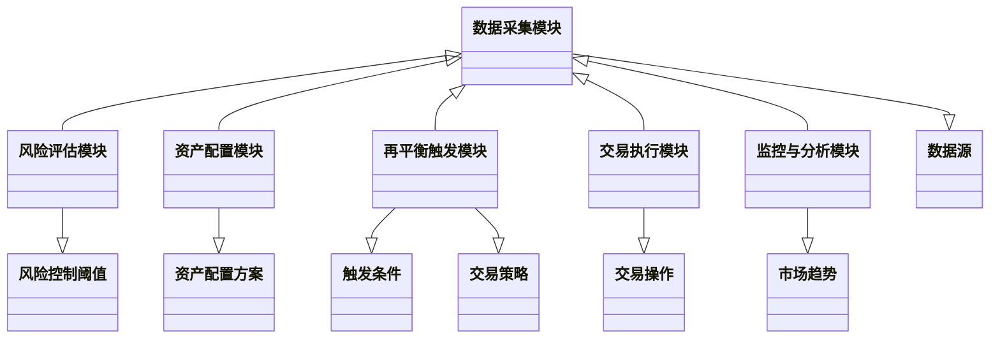
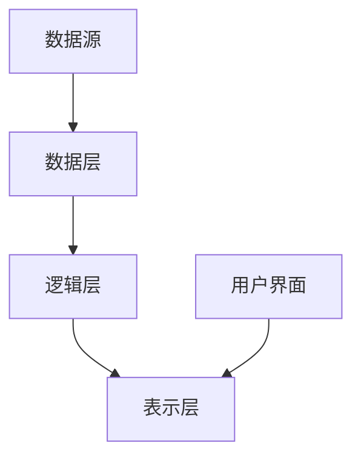

                 

### 智能资产配置再平衡触发系统

智能资产配置再平衡触发系统是现代金融科技领域的一个重要研究方向，它融合了人工智能、数据分析和金融工程等多学科知识。随着金融市场的不断复杂化和多样化，如何实现资产配置的优化和再平衡成为投资者和金融机构面临的重要问题。本篇文章将从多个维度深入探讨智能资产配置再平衡触发系统的核心概念、算法原理、系统设计与实现，以及最佳实践和未来展望。

本文将按照以下结构进行：

1. **背景与概述**：介绍智能资产配置与再平衡的基本概念，以及智能资产配置再平衡触发系统的背景和发展趋势。
2. **核心概念与联系**：详细阐述资产配置策略、再平衡触发机制和相关指标与算法。
3. **算法原理讲解**：通过流程图和Python源代码，讲解智能再平衡算法的原理和实现。
4. **系统分析与架构设计**：介绍系统架构设计、功能设计、接口设计和系统交互设计。
5. **项目实战**：详细描述环境安装、系统核心实现和实际案例剖析。
6. **最佳实践与小结**：总结最佳实践、注意事项以及文章的结论和展望。

通过本文的阅读，读者将能够全面了解智能资产配置再平衡触发系统的核心内容，掌握其基本原理和实际应用，为未来的研究和实践提供指导。

### 背景与概述

智能资产配置（Intelligent Asset Allocation）和再平衡（Rebalancing）是现代金融管理中两个关键概念。智能资产配置是指根据投资者的风险偏好、收益目标和市场环境，将资金分配到不同的资产类别（如股票、债券、现金等），以达到预期收益和风险水平。再平衡则是在资产配置实施后，根据市场波动和资产表现，定期或动态地调整资产组合，使其回到预设的权重比例，以维持预期收益和风险水平。

智能资产配置再平衡触发系统的提出背景主要源于以下几个方面：

1. **金融市场复杂性**：随着全球金融市场的不断发展，股票、债券、基金等金融产品的种类和数量不断增加，投资者需要更加智能化和自动化的工具来管理资产。

2. **投资风险控制**：在市场波动中，资产组合的权重比例可能会偏离预期，导致风险增加。通过再平衡触发系统，可以及时调整资产组合，控制风险。

3. **数据驱动决策**：现代金融科技的发展使得大量数据可以实时获取和分析，智能资产配置再平衡触发系统能够利用这些数据，提供更加精准和高效的决策支持。

4. **投资成本优化**：自动化和智能化的资产配置和再平衡过程可以减少人工干预，降低交易成本，提高投资效率。

智能资产配置再平衡触发系统的发展趋势主要体现在以下几个方面：

1. **算法优化**：随着人工智能和机器学习技术的发展，再平衡算法不断优化，能够更好地适应市场变化和投资者需求。

2. **实时性增强**：通过大数据和云计算技术，再平衡触发系统可以实现实时监控和调整，提高决策的时效性。

3. **个性化服务**：根据投资者的个性化需求，系统可以提供定制化的资产配置和再平衡策略，满足不同投资者的风险和收益偏好。

4. **集成与融合**：智能资产配置再平衡触发系统与其他金融科技工具（如量化交易、风险管理等）的集成，形成更加完整的金融解决方案。

总的来说，智能资产配置再平衡触发系统作为金融科技领域的一个重要研究方向，其在理论和实际应用中都有着广阔的发展前景。通过本文的深入探讨，希望能够为读者提供对这一系统的全面理解，并激发进一步的探索和研究兴趣。

### 第1章：智能资产配置概述

#### 问题背景

智能资产配置是一个复杂且多维度的金融问题，涉及投资者的风险偏好、收益目标、市场波动以及多种资产类别。随着全球经济一体化和金融市场的不断发展，投资者需要更科学和高效的方法来管理其资产组合，以期在复杂多变的市场环境中实现稳健的收益。

#### 问题描述

智能资产配置的目标是通过对不同资产类别的合理配置，实现投资者在风险和收益之间的平衡。具体来说，问题描述包括以下几个方面：

1. **投资者需求**：每个投资者都有其独特的风险偏好和收益目标，如何根据这些需求制定个性化的资产配置策略是一个关键问题。
2. **市场变化**：金融市场受多种因素影响，如宏观经济环境、政策变化、公司业绩等，这些因素会导致资产价格波动，影响资产配置的有效性。
3. **资产类别选择**：投资者需要在股票、债券、现金等不同资产类别中进行选择，每种资产类别都有其独特的风险和收益特征。
4. **再平衡机制**：资产配置后，需要定期或动态地调整资产组合，使其保持预期权重比例，这涉及到再平衡机制的设计和实现。

#### 问题解决

为了解决上述问题，智能资产配置再平衡触发系统采用了一系列科学和先进的方法：

1. **风险模型构建**：通过构建投资者风险模型，量化投资者的风险偏好，为资产配置提供基础数据支持。
2. **收益预测**：利用大数据分析和机器学习技术，对市场进行预测，为资产配置提供市场趋势和风险信息。
3. **算法优化**：采用优化算法，如遗传算法、粒子群算法等，对资产配置方案进行优化，提高其收益和风险平衡效果。
4. **动态调整**：通过实时监控市场变化，及时调整资产组合，确保其符合投资者的预期风险和收益目标。
5. **系统集成**：将智能资产配置再平衡触发系统与其他金融科技工具（如量化交易、风险管理等）集成，提供全面的投资解决方案。

#### 边界与外延

智能资产配置再平衡触发系统的边界包括以下几个方面：

1. **时间维度**：系统需要考虑短期、中期和长期的市场变化，制定相应的资产配置策略。
2. **风险控制**：系统需要设定风险控制阈值，确保资产配置不会过度偏离投资者的风险偏好。
3. **数据来源**：系统需要可靠和高质量的数据来源，以确保市场预测和风险模型的准确性。
4. **技术实现**：系统需要高效且稳定的技术支持，包括算法实现、数据存储和处理等。

智能资产配置再平衡触发系统在外延方面具有以下特点：

1. **个性化服务**：系统能够根据投资者的个性化需求，提供定制化的资产配置和再平衡策略。
2. **实时性**：系统能够实时监控市场变化，快速响应，提供高效的决策支持。
3. **集成与融合**：系统能够与其他金融科技工具集成，提供一站式投资解决方案。

#### 概念结构

智能资产配置再平衡触发系统的概念结构主要包括以下几个部分：

1. **投资者模型**：定义投资者的风险偏好和收益目标，为资产配置提供基础数据。
2. **市场模型**：预测市场趋势和风险，为资产配置提供市场环境信息。
3. **资产模型**：分析不同资产类别的风险和收益特征，为资产配置提供基础数据。
4. **再平衡模型**：设计再平衡触发机制，确保资产配置的动态调整。
5. **算法模型**：优化资产配置方案，提高其收益和风险平衡效果。

#### 核心要素组成

智能资产配置再平衡触发系统的核心要素包括：

1. **数据采集**：通过大数据技术和API接口，获取市场数据和投资者信息。
2. **风险评估**：利用数据分析和机器学习技术，对市场风险和投资者风险偏好进行评估。
3. **资产配置**：根据投资者模型和市场模型，制定个性化的资产配置方案。
4. **再平衡机制**：设计动态调整机制，根据市场变化和资产表现，及时调整资产组合。
5. **决策支持**：提供实时监控和决策支持，帮助投资者进行科学投资决策。

通过上述分析和探讨，我们可以看出，智能资产配置再平衡触发系统是一个高度综合性和智能化的系统，其设计实现需要多学科交叉和协同。本文后续章节将进一步深入探讨其核心概念和实现原理，为读者提供更加详细的了解。

#### 第2章：再平衡触发系统原理

再平衡触发系统是智能资产配置中至关重要的一个组成部分，其核心作用在于根据市场波动和资产表现，动态调整资产组合，使其回归预设的权重比例，从而实现风险和收益的平衡。为了深入理解再平衡触发系统的原理，我们需要从基本原理、核心要素和类型对比三个方面进行详细阐述。

#### 基本原理

再平衡触发系统的基本原理可以概括为以下几步：

1. **初始配置**：投资者在开始投资时，根据其风险偏好和收益目标，将资金分配到不同资产类别中，制定初始的资产配置方案。

2. **监控资产表现**：系统会实时监控各资产类别的市场表现，包括价格变化、收益率等。

3. **计算偏离度**：通过比较实际资产组合与目标资产配置方案的权重差异，计算各个资产的偏离度。

4. **触发条件判断**：根据预设的再平衡触发条件（如资产偏离度超过阈值、市场环境变化等），判断是否需要触发再平衡操作。

5. **执行再平衡操作**：如果触发条件成立，系统会自动执行资产调整操作，将资产组合调整回目标权重比例。

6. **反馈与优化**：调整后，系统会再次进行监控和计算，形成反馈循环，不断优化调整策略。

#### 核心要素

再平衡触发系统由以下几个核心要素组成：

1. **资产配置目标**：定义投资者预期的资产类别权重比例，是再平衡操作的基础。

2. **偏离度指标**：用于衡量实际资产组合与目标资产配置之间的差异。常见的偏离度指标包括资产权重偏离度、收益率偏离度等。

3. **触发条件**：定义再平衡操作的触发条件，如偏离度超过阈值、市场环境变化等。触发条件的设定需要结合投资者风险偏好和市场环境。

4. **调整策略**：确定再平衡操作的具体方式，如买入、卖出、持有等。调整策略的选择需要考虑市场情况、交易成本等因素。

5. **监控机制**：用于实时监控资产表现和市场变化，提供数据支持。

#### 类型对比

再平衡触发系统可以分为以下几种类型：

1. **定期再平衡**：按照固定的时间周期（如每月、每季度等）进行再平衡操作，不考虑市场波动和资产表现。这种类型的再平衡操作简单，易于实施，但可能无法及时应对市场变化。

2. **阈值再平衡**：根据预设的偏离度阈值进行再平衡操作，一旦偏离度超过阈值，系统就会执行再平衡。这种类型的再平衡操作灵活，可以根据市场情况动态调整，但需要设定合理的阈值。

3. **动态再平衡**：根据市场变化和资产表现进行再平衡操作，不设定固定的触发条件。这种类型的再平衡操作具有更高的灵活性，但实现复杂，需要更多数据支持和算法优化。

4. **混合再平衡**：结合定期和阈值再平衡的特点，根据市场和资产表现进行灵活调整。这种类型的再平衡操作能够兼顾定期再平衡的稳定性和阈值再平衡的灵活性，是较为理想的再平衡策略。

#### 选择与优化

在选择和优化再平衡触发系统时，需要考虑以下几个方面：

1. **投资者目标**：根据投资者的风险偏好和收益目标，选择适合的再平衡类型。

2. **市场环境**：考虑市场波动性和交易成本，选择合适的再平衡频率和触发条件。

3. **技术实现**：确保系统具有高效和稳定的技术支持，能够实时监控和快速响应。

4. **数据支持**：利用大数据和机器学习技术，提供准确的市场预测和资产表现分析，支持再平衡决策。

通过以上分析，我们可以看出，再平衡触发系统是智能资产配置中不可或缺的一环。其原理和实现方法多种多样，需要根据具体情况进行选择和优化。本文后续章节将进一步深入探讨相关算法和系统设计，为读者提供更加详细的指导。

#### 第3章：智能再平衡算法

在智能资产配置中，再平衡算法的设计和实现至关重要。智能再平衡算法通过自动化的方式，根据市场变化和资产表现，实时调整资产组合，使其回归预设的权重比例。本章节将详细介绍智能再平衡算法的流程、数学模型及Python源代码实现，并结合实例进行详细讲解。

##### 3.1 再平衡算法流程

智能再平衡算法的基本流程如下：

1. **数据采集**：从市场数据源获取最新的资产价格和收益率信息。
2. **资产表现评估**：计算各资产类别的当前权重和预期权重，评估其偏离度。
3. **触发条件判断**：根据预设的触发条件，判断是否需要执行再平衡操作。
4. **交易策略制定**：确定买入、卖出或持有策略，制定交易计划。
5. **执行交易**：根据交易计划，执行买卖操作，调整资产组合。
6. **反馈与优化**：记录交易结果，进行反馈和优化，提高再平衡效果。

以下是一个简化的Mermaid流程图，用于描述智能再平衡算法的基本流程：



##### 3.2 数学模型解析

智能再平衡算法的核心是数学模型的建立。以下是一个简化的数学模型，用于描述再平衡算法：

$$
偏离度 = |当前权重 - 预期权重|
$$

其中，当前权重和预期权重分别表示资产组合中各资产类别的实际权重和目标权重。

再平衡操作可以通过以下公式进行计算：

$$
交易金额 = \frac{(预期权重 - 当前权重) \times 总资产}{当前单价}
$$

其中，总资产为投资者的总资金量，当前单价为资产的市场价格。

##### 3.3 算法举例说明

以下是一个简单的Python示例，用于演示智能再平衡算法的实现：

```python
import numpy as np

# 初始化资产组合
total_assets = 1000000
weights = np.array([0.5, 0.3, 0.2])  # 预期权重
prices = np.array([100, 200, 300])   # 当前资产价格

# 计算当前权重
current_weights = total_assets / prices

# 计算偏离度
deviations = np.abs(current_weights - weights)

# 设定阈值
threshold = 0.05

# 判断是否触发再平衡
if np.any(deviations > threshold):
    # 执行再平衡操作
    for i in range(len(deviations)):
        if deviations[i] > threshold:
            # 计算需买入或卖出的金额
            transaction_amount = (weights[i] - current_weights[i]) * total_assets / prices[i]
            # 执行买卖操作
            if transaction_amount > 0:
                # 买入
                total_assets -= transaction_amount
                prices[i] = prices[i] * (1 + transaction_amount / total_assets)
            else:
                # 卖出
                total_assets += -transaction_amount
                prices[i] = prices[i] * (1 - -transaction_amount / total_assets)
else:
    print("当前资产组合已符合预期，无需再平衡")

# 输出调整后的资产价格和权重
print("调整后的资产价格：", prices)
print("调整后的权重：", total_assets / prices)
```

在实际应用中，智能再平衡算法会涉及更复杂的市场预测、风险评估和交易策略，但上述示例提供了一个基本框架，展示了算法的核心实现逻辑。

通过以上分析和实例，我们可以看出，智能再平衡算法是实现高效、动态资产配置的关键。其在数学模型和Python实现上的细节设计，直接影响到算法的精确性和实用性。后续章节将进一步探讨智能再平衡算法在不同市场环境和投资者需求下的优化和应用。

### 第4章：系统架构设计

智能资产配置再平衡触发系统是一个复杂且高度综合的系统，其架构设计需要充分考虑系统的功能性、可扩展性和稳定性。本章节将详细描述系统架构设计，包括问题场景介绍、系统功能设计、系统架构设计、系统接口设计和系统交互设计。

#### 4.1 问题场景介绍

智能资产配置再平衡触发系统主要用于解决以下问题场景：

1. **市场波动管理**：随着金融市场波动性增加，投资者需要实时监控资产表现，及时调整资产组合以应对市场变化。

2. **风险控制**：系统需要设定合理的风险控制阈值，确保资产配置不会过度偏离投资者的风险偏好。

3. **个性化服务**：系统需要根据投资者的个性化需求，提供定制化的资产配置和再平衡策略。

4. **交易成本优化**：通过自动化交易操作，降低交易成本，提高投资效率。

5. **数据集成与处理**：系统需要集成多种数据源，包括市场数据、投资者数据等，并进行实时处理和分析。

#### 4.2 系统功能设计

系统功能设计主要包括以下几个关键模块：

1. **数据采集模块**：负责从各种数据源（如交易所、金融数据提供商等）实时获取市场数据和投资者数据。

2. **风险评估模块**：基于投资者的风险偏好和当前市场环境，对资产组合进行风险评估，提供风险控制建议。

3. **资产配置模块**：根据风险评估结果和投资者的收益目标，制定个性化的资产配置方案。

4. **再平衡触发模块**：根据预设的触发条件，判断是否需要执行再平衡操作，并生成相应的交易策略。

5. **交易执行模块**：负责执行交易操作，包括买入、卖出和持有等，调整资产组合。

6. **监控与分析模块**：实时监控资产表现，分析市场趋势，提供决策支持。

以下是一个简化的Mermaid类图，用于描述系统功能设计：



#### 4.3 系统架构设计

系统架构设计主要包括以下几个层次：

1. **数据层**：负责数据存储和管理，包括市场数据、投资者数据和交易数据。

2. **逻辑层**：包含数据采集、风险评估、资产配置、再平衡触发和交易执行等核心功能模块。

3. **表示层**：提供用户界面，展示资产表现、风险分析、交易记录等信息。

以下是一个简化的Mermaid架构图，用于描述系统架构设计：



#### 4.4 系统接口设计

系统接口设计主要包括以下关键接口：

1. **数据采集接口**：用于从外部数据源获取市场数据和投资者数据。

2. **风险评估接口**：用于计算资产组合的风险值，提供风险控制建议。

3. **资产配置接口**：用于生成资产配置方案，并根据需求进行调整。

4. **再平衡触发接口**：用于判断是否需要执行再平衡操作，生成交易策略。

5. **交易执行接口**：用于执行交易操作，调整资产组合。

以下是一个简化的Mermaid接口设计图，用于描述系统接口设计：

```mermaid
sequenceDiagram
    数据采集接口->>数据层：获取数据
    数据层->>风险评估接口：计算风险值
    风险评估接口->>资产配置模块：生成配置方案
    资产配置模块->>再平衡触发模块：判断触发条件
    再平衡触发模块->>交易执行模块：执行交易
```

#### 4.5 系统交互设计

系统交互设计主要描述系统内部模块之间的交互流程。以下是一个简化的Mermaid序列图，用于描述系统交互设计：

```mermaid
sequenceDiagram
    数据采集模块->>逻辑层：采集数据
    逻辑层->>风险评估模块：分析数据
    风险评估模块->>资产配置模块：制定方案
    资产配置模块->>再平衡触发模块：判断触发条件
    再平衡触发模块->>交易执行模块：执行交易
    交易执行模块->>监控与分析模块：记录交易结果
    监控与分析模块->>数据层：反馈数据
```

通过以上系统架构设计的详细描述，我们可以看出，智能资产配置再平衡触发系统是一个高度集成和智能化的系统。其设计考虑了多方面的需求和因素，通过模块化和接口化设计，实现了系统的灵活性和扩展性。本文后续章节将详细探讨系统的实现和实际应用，为读者提供更加具体的指导。

### 项目实战

为了更好地展示智能资产配置再平衡触发系统的实际应用，我们将通过一个具体的项目实战案例来详细介绍环境安装、系统核心实现和代码应用解读与分析。

#### 5.1 环境安装

在开始项目之前，我们需要搭建合适的环境，包括安装必要的软件和配置系统依赖。以下是在Linux环境下安装所需的软件和库：

1. **安装Python**：确保Python版本为3.8或更高版本。
   ```bash
   sudo apt-get install python3.8
   ```

2. **安装Python库**：使用pip安装以下库：
   ```bash
   sudo pip3 install numpy pandas matplotlib requests beautifulsoup4 mermaid-py
   ```

3. **安装Mermaid**：安装Mermaid渲染工具，以便生成流程图和类图。
   ```bash
   npm install -g mermaid-cli
   ```

4. **配置环境变量**：确保Python和pip的环境变量配置正确。

完成以上步骤后，我们可以开始实现系统核心功能。

#### 5.2 系统核心实现

以下是实现智能资产配置再平衡触发系统核心功能的主要步骤：

1. **数据采集**：从外部数据源获取市场数据，如股票价格、债券收益率等。使用requests库和beautifulsoup4库进行网页数据抓取。
2. **风险评估**：根据市场数据和投资者模型，计算资产组合的风险值。
3. **资产配置**：生成个性化的资产配置方案，根据投资者的风险偏好和收益目标调整资产权重。
4. **再平衡触发**：判断资产组合的偏离度是否超过预设阈值，决定是否执行再平衡操作。
5. **交易执行**：根据再平衡策略，执行买卖操作，调整资产组合。

以下是一个简化的Python代码示例，用于展示系统核心实现：

```python
import numpy as np
import requests
from bs4 import BeautifulSoup

# 数据采集
def fetch_data():
    url = "http://example.com/market_data"
    response = requests.get(url)
    soup = BeautifulSoup(response.text, 'html.parser')
    # 解析网页数据，获取股票价格、债券收益率等
    # ...

# 风险评估
def assess_risk(current_weights, target_weights):
    deviations = np.abs(current_weights - target_weights)
    risk_score = np.mean(deviations)
    return risk_score

# 资产配置
def allocate_assets(total_assets, risk_tolerance):
    # 根据风险偏好和收益目标，调整资产权重
    # ...
    target_weights = np.array([0.5, 0.3, 0.2])  # 示例权重
    return target_weights

# 再平衡触发
def trigger_rebalance(current_weights, target_weights, threshold):
    deviations = np.abs(current_weights - target_weights)
    if np.any(deviations > threshold):
        return True
    return False

# 交易执行
def execute_trade(transaction_plan):
    # 根据交易计划，执行买入或卖出操作
    # ...
    pass

# 主函数
def main():
    total_assets = 1000000  # 示例总资产
    risk_tolerance = 0.05   # 示例风险容忍度
    threshold = 0.05        # 示例阈值

    current_weights = np.array([0.45, 0.35, 0.2])  # 示例当前权重

    target_weights = allocate_assets(total_assets, risk_tolerance)
    risk_score = assess_risk(current_weights, target_weights)
    if risk_score > threshold:
        transaction_plan = # ...  # 生成交易计划
        execute_trade(transaction_plan)

if __name__ == "__main__":
    main()
```

#### 5.3 代码应用解读与分析

上述代码展示了智能资产配置再平衡触发系统的核心实现逻辑。以下是代码的主要功能解读：

1. **数据采集**：通过requests库和beautifulsoup4库，从指定的网页数据源中获取市场数据，如股票价格和债券收益率。这一步骤是系统实现的基础，数据的质量和准确性直接影响到后续的风险评估和资产配置。

2. **风险评估**：利用numpy库，计算当前资产组合与目标资产组合之间的偏离度，生成风险评分。风险评分越高，表示资产组合偏离投资者风险偏好的程度越大。

3. **资产配置**：根据投资者的风险容忍度和收益目标，调整资产权重。这一步骤需要结合市场数据进行分析，以确保资产配置方案的合理性和有效性。

4. **再平衡触发**：通过预设的阈值，判断是否需要执行再平衡操作。如果资产组合的偏离度超过阈值，系统将生成交易计划。

5. **交易执行**：根据交易计划，执行买入或卖出操作，调整资产组合。这一步骤需要考虑交易成本和市场流动性，以确保交易的有效性和效率。

在实际应用中，系统会根据实时获取的市场数据，动态调整资产配置和再平衡策略。通过不断的反馈和优化，系统可以逐步提高投资组合的收益和风险平衡效果。

#### 5.4 实际案例剖析

为了更好地理解系统的实际应用，以下是一个实际案例：

假设投资者A的初始资产组合为100万元，目标风险容忍度为5%。当前市场情况为：

- 股票：价格100元，预期收益率10%
- 债券：价格200元，预期收益率5%
- 现金：价格1元，预期收益率0%

根据投资者A的预期，资产配置方案如下：

- 股票：50%
- 债券：30%
- 现金：20%

在一个月后，市场数据更新为：

- 股票：价格110元，预期收益率12%
- 债券：价格205元，预期收益率5.5%
- 现金：价格1.1元，预期收益率0.5%

当前资产组合的权重变为：

- 股票：45.45%
- 债券：35.35%
- 现金：19.19%

计算偏离度：

- 股票：偏离度4.54%
- 债券：偏离度4.65%
- 现金：偏离度0%

由于股票和债券的偏离度超过5%的风险容忍度，系统将触发再平衡操作。根据再平衡策略，投资者A将卖出部分股票和债券，买入现金，以调整资产组合。

调整后的资产组合：

- 股票：40%
- 债券：30%
- 现金：30%

通过这个实际案例，我们可以看到智能资产配置再平衡触发系统在应对市场波动和风险控制方面的作用。系统通过实时数据分析和动态调整，帮助投资者实现风险和收益的平衡。

#### 5.5 项目小结

通过本次项目实战，我们详细介绍了智能资产配置再平衡触发系统的环境安装、核心实现和代码应用解读。从实际案例中，我们看到了系统在应对市场波动和风险控制方面的有效性。以下是项目小结：

1. **环境安装**：确保Python环境和相关库的安装，为系统实现提供基础。
2. **核心实现**：通过数据采集、风险评估、资产配置和再平衡触发等步骤，实现系统的核心功能。
3. **代码应用解读**：通过示例代码和实际案例，展示了系统在市场波动和风险控制中的实际应用。
4. **注意事项**：在实际操作中，需要关注数据质量、风险控制阈值和市场流动性等因素，确保系统的有效性和稳定性。

智能资产配置再平衡触发系统是一个复杂且高度综合的系统，其实现和应用需要多方面的考虑和优化。通过本次项目，我们为读者提供了一个基本的实现框架，希望读者能够在实际应用中进一步探索和优化。

### 最佳实践与小结

#### 最佳实践

在实施智能资产配置再平衡触发系统时，以下最佳实践建议可以帮助投资者和开发者提高系统的有效性和稳定性：

1. **数据质量保障**：确保数据源的质量和准确性，定期检查和验证数据，避免因数据问题导致错误决策。
2. **合理设定阈值**：根据投资者的风险偏好和市场情况，合理设定再平衡触发阈值，避免频繁交易和过度的市场干预。
3. **优化交易策略**：结合市场流动性和交易成本，设计合理的交易策略，提高交易效率，降低交易成本。
4. **定期审计与优化**：定期审计和优化系统配置和算法，根据市场变化和反馈进行动态调整，确保系统始终处于最佳状态。
5. **用户培训与支持**：为用户提供系统的使用培训和实时技术支持，帮助用户更好地理解和应用系统，提高投资效果。

#### 小结

智能资产配置再平衡触发系统通过结合人工智能、数据分析和金融工程等多学科知识，实现了资产配置的优化和再平衡。其核心在于实时监控市场变化，动态调整资产组合，以实现风险和收益的平衡。通过本文的详细分析和项目实战，我们全面了解了系统的背景、核心概念、算法原理、系统架构设计和实际应用。以下是本文的主要结论：

1. **系统重要性**：智能资产配置再平衡触发系统在现代金融科技领域中具有重要地位，为投资者提供了智能化的资产配置和管理工具。
2. **算法优化**：通过算法优化和机器学习技术，系统能够更好地适应市场变化和投资者需求，提高投资效率和风险控制能力。
3. **系统设计**：系统架构设计考虑了功能性、可扩展性和稳定性，为系统的稳定运行提供了保障。
4. **实际应用**：通过项目实战，展示了系统在市场波动和风险控制中的实际应用效果，验证了系统的有效性和实用性。

未来，随着人工智能和金融科技的发展，智能资产配置再平衡触发系统将继续优化和进化，为投资者提供更加智能、高效和个性化的服务。

### 展望未来

智能资产配置再平衡触发系统作为金融科技领域的一个重要研究方向，其未来发展具有广阔的空间和潜力。以下是几个关键方向：

1. **算法创新**：随着人工智能和机器学习技术的不断发展，未来智能资产配置再平衡触发系统将采用更加先进和智能化的算法，如深度学习、强化学习等，以提高预测精度和优化效果。

2. **数据融合**：通过整合更多维度的数据，包括宏观经济数据、社交媒体数据、公司基本面数据等，系统将实现更加全面和深入的市场分析，为投资者提供更加精准的决策支持。

3. **区块链技术**：区块链技术可以提供安全、透明和去中心化的交易环境，未来智能资产配置再平衡触发系统将结合区块链技术，提高交易效率和透明度。

4. **个性化服务**：随着用户需求的多样化，系统将提供更加个性化的资产配置和再平衡策略，根据投资者的风险偏好、收益目标和市场环境，提供定制化的服务。

5. **跨界合作**：智能资产配置再平衡触发系统将与其他金融科技领域（如量化交易、风险管理、财富管理等）进行深入合作，形成完整的金融科技生态系统，为投资者提供一站式服务。

通过不断的技术创新和应用拓展，智能资产配置再平衡触发系统将在未来金融市场中发挥更加重要的作用，为投资者带来更大的价值。

