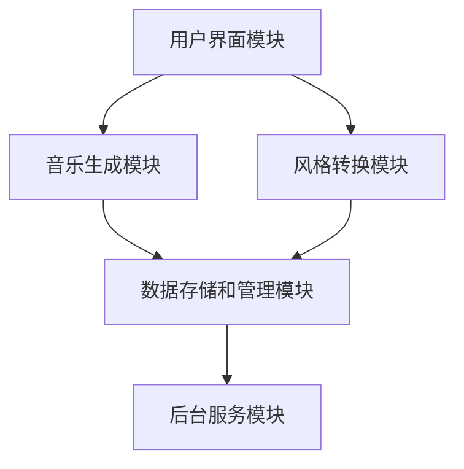

                 


### 引言

#### 问题背景

在数字技术和人工智能高速发展的今天，音乐创作正经历着一场深刻的变革。传统音乐创作依赖于音乐家自身的才华和技巧，而随着计算机科学和机器学习技术的进步，智能音乐创作成为了可能。智能音乐创作，指的是通过计算机算法和人工智能技术，生成、改编或创作音乐作品的过程。这一领域的研究对于推动音乐创作的发展、拓宽音乐表现形式以及提高音乐产业的效率具有重要意义。

智能音乐创作的核心挑战在于如何使计算机算法理解和模拟人类音乐创作的过程，同时保持音乐的艺术性和创造性。这不仅涉及到音乐理论的理解，还需要计算机算法能够在大量的音乐数据中提取有效的模式和特征，从而生成具有情感和风格一致性的音乐作品。

#### 研究意义

研究智能音乐创作具有以下几方面的意义：

1. **艺术创新**：智能音乐创作可以拓宽音乐的表现形式，激发新的音乐风格和创作灵感，为艺术家提供创新的工具和平台。
2. **效率提升**：通过自动化和智能化的音乐创作流程，可以显著提高音乐创作的效率，降低创作成本。
3. **音乐普及**：智能音乐创作使更多的人能够参与到音乐创作中来，无论是专业音乐家还是普通爱好者，都可以借助智能工具实现音乐梦想。
4. **商业价值**：智能音乐创作技术在音乐产业中的应用，可以创造出新的商业模式和盈利点，推动音乐产业的数字化转型。

#### 研究现状

当前，智能音乐创作已经取得了显著的研究成果。主要研究方向包括：

1. **音乐生成模型**：基于深度学习的音乐生成模型，如基于循环神经网络（RNN）和变换器（Transformer）的模型，可以生成具有复杂结构的新音乐。
2. **风格迁移与转换**：通过训练模型学习不同音乐风格的特征，实现风格之间的转换，如将古典音乐转换为流行音乐。
3. **协同创作**：利用人工智能辅助音乐家进行创作，通过人机协作提高创作效率和质量。

然而，智能音乐创作领域仍然面临诸多挑战，如音乐理解与生成的深度学习模型需要进一步优化，如何在保持音乐艺术性的同时提高生成效率等。

#### 本书组织结构

本书分为七个主要部分：

1. **引言**：介绍问题背景、研究意义、研究现状以及本书的组织结构。
2. **智能音乐创作概述**：介绍智能音乐创作的基本概念、发展历程和关键技术。
3. **LLM基础**：阐述大型语言模型（LLM）的定义、工作原理和组成结构。
4. **LLM在音乐创作中的具体应用**：分析LLM在音乐生成和风格转换中的应用。
5. **案例研究**：通过具体案例展示LLM在智能音乐创作中的实际应用。
6. **智能音乐创作系统的设计与实现**：介绍智能音乐创作系统的设计架构、实现细节和部署方法。
7. **总结与展望**：总结主要研究成果，讨论存在的问题与挑战，展望未来发展趋势。

通过以上结构，本书旨在为读者提供一份全面、深入的智能音乐创作与LLM应用指南，帮助读者理解这一领域的核心概念、最新进展和应用前景。

---

### 关键词
- 智能音乐创作
- 大型语言模型（LLM）
- 音乐生成模型
- 音乐风格转换
- 智能辅助创作

### 摘要

本文深入探讨了智能音乐创作领域，特别是大型语言模型（LLM）在艺术创作中的应用。首先，我们介绍了智能音乐创作的背景和意义，包括艺术创新、效率提升和商业价值等方面的研究现状。接着，详细阐述了大型语言模型的基础知识，包括定义、工作原理和结构。然后，重点分析了LLM在音乐生成和风格转换中的具体应用，通过案例研究展示了这些技术的实际效果。最后，我们介绍了智能音乐创作系统的设计与实现方法，并总结了当前的研究成果和未来发展趋势。本文旨在为读者提供一个全面、系统的智能音乐创作与LLM应用指南，助力理解这一新兴领域的核心概念和实际应用。

---

### 智能音乐创作概述

#### 智能音乐创作概念

智能音乐创作是指通过计算机算法和人工智能技术来生成、改编或创作音乐作品的过程。这一领域结合了音乐理论、计算机科学和机器学习技术，旨在利用算法理解和模拟人类音乐创作的过程。智能音乐创作不仅限于生成全新的音乐作品，还包括音乐改编、风格转换和辅助创作等多个方面。

#### 智能音乐创作的发展历程

智能音乐创作的发展可以追溯到20世纪60年代，当时计算机已经开始用于音乐生成。早期的智能音乐创作系统主要基于规则和符号计算，如生成旋律和和弦的算法。随着计算机处理能力的提升和人工智能技术的发展，尤其是深度学习的出现，智能音乐创作取得了显著的进步。近年来，基于深度学习的音乐生成模型，如循环神经网络（RNN）和变换器（Transformer），使得智能音乐创作在生成复杂结构和情感表达方面更加出色。

#### 智能音乐创作的关键技术

智能音乐创作涉及多个关键技术的综合运用，主要包括：

1. **音乐生成模型**：这是智能音乐创作的核心，通过训练模型学习音乐数据中的模式和特征，生成新的音乐作品。常见的音乐生成模型包括基于循环神经网络（RNN）的模型和基于变换器（Transformer）的模型。

2. **音乐风格转换**：这一技术通过学习不同音乐风格的特征，实现风格之间的转换。例如，可以将古典音乐转换为流行音乐，或将摇滚音乐转换为爵士音乐。

3. **协同创作**：利用人工智能辅助音乐家进行创作，通过人机协作提高创作效率和质量。这种技术可以提供音乐建议、旋律生成和和弦适配等功能。

4. **情感分析**：通过分析音乐的情感特征，使得生成的音乐作品具有特定的情感表达。这一技术在广告音乐、影视配乐等领域有广泛应用。

#### 智能音乐创作的应用领域

智能音乐创作在多个领域具有广泛的应用，主要包括：

1. **音乐产业**：智能音乐创作可以用于新音乐作品的生成、音乐风格的转换和音乐编辑等，提高音乐创作的效率和质量。

2. **艺术表演**：智能音乐创作系统可以作为音乐家的辅助工具，提供即兴创作和音乐改编的功能。

3. **娱乐与游戏**：智能音乐创作技术可以应用于游戏音乐生成、虚拟现实（VR）音乐体验等。

4. **广告与媒体**：智能音乐创作可以用于广告背景音乐生成、媒体配乐等，提高内容的表现力和吸引力。

通过以上概述，我们为读者提供了一个对智能音乐创作领域的全面了解，为后续章节的深入探讨打下基础。

---

### LLM基础

#### LLM概述

大型语言模型（LLM，Large Language Model）是自然语言处理（NLP，Natural Language Processing）领域的重要技术之一。LLM是一种通过训练大规模文本数据来学习语言结构和语义的深度学习模型。与传统的规则基方法或基于统计的方法相比，LLM能够更灵活地处理复杂的语言现象，生成更加自然和符合语言习惯的文本。

LLM的研究始于20世纪50年代，最初是简单的规则模型，如语境分析器和句法解析器。随着计算机硬件的进步和深度学习技术的发展，LLM在近年来取得了显著的突破。尤其是在Transformer架构提出后，LLM的性能得到了大幅提升，成为自然语言处理领域的主流模型。

#### LLM的工作原理

LLM的工作原理主要基于深度学习，特别是神经网络。LLM通常由多层神经网络组成，每一层都对输入的文本数据进行特征提取和变换。以下是LLM工作原理的详细步骤：

1. **输入处理**：LLM首先将文本数据转换为模型可以处理的格式。通常，文本会被转换为单词或字符的序列，然后通过词汇表进行编码，转换为整数序列。

2. **嵌入层**：嵌入层将整数序列映射为高维向量，这些向量表示了文本数据中的单词或字符的语义特征。

3. **编码层**：编码层是对输入数据进行特征提取的核心部分。常见的编码层包括循环神经网络（RNN）和变换器（Transformer）。RNN通过递归方式处理序列数据，能够捕捉序列中的长期依赖关系；而Transformer则通过自注意力机制处理序列数据，具有更好的并行计算能力。

4. **解码层**：解码层用于生成输出文本。在生成过程中，模型会逐个预测下一个单词或字符，并更新嵌入层和编码层的状态。这个过程类似于翻译过程，每次生成的文本片段都会被模型用来更新上下文信息。

5. **输出层**：输出层通常是一个全连接层，将解码层生成的嵌入向量映射为词汇表中的单词或字符。

#### LLM的组成与结构

LLM的组成与结构复杂多样，但通常包含以下几个主要部分：

1. **词汇表**：词汇表是LLM的核心组成部分，用于将文本数据转换为模型可以处理的整数编码。词汇表通常包含大量的单词或字符，以便模型能够学习丰富的语言特征。

2. **嵌入层**：嵌入层负责将词汇表中的整数编码转换为高维向量，这些向量表示了文本数据中的语义特征。

3. **编码层**：编码层是LLM的核心，用于提取文本数据中的特征。常见的编码层包括RNN和Transformer，它们各自有不同的结构和特点。

4. **解码层**：解码层负责生成输出文本。与编码层类似，解码层也由多层神经网络组成，用于逐个预测下一个单词或字符。

5. **输出层**：输出层将解码层生成的嵌入向量映射为实际的单词或字符。

通过以上对LLM概述、工作原理和组成结构的详细阐述，我们可以更好地理解LLM在智能音乐创作中的应用潜力。在接下来的章节中，我们将进一步探讨LLM在音乐生成和风格转换中的具体应用。

---

### LLM在音乐创作中的具体应用

#### LLM在音乐创作中的优势

大型语言模型（LLM）在音乐创作中具有显著的优势，主要体现在以下几个方面：

1. **强大的语言理解和生成能力**：LLM通过大规模文本数据训练，能够深刻理解语言结构和语义，从而生成更加自然和符合语言习惯的文本。这一优势使得LLM能够创作出具有较高艺术性和表现力的音乐作品。

2. **高效率的音乐生成**：LLM采用深度学习算法，可以高效地处理大量音乐数据，生成新的音乐作品。与传统的音乐创作方法相比，LLM能够显著提高音乐创作的效率，降低创作成本。

3. **风格多样性**：通过训练不同的LLM模型，可以生成具有不同风格的音乐作品。例如，可以生成古典音乐、流行音乐、爵士音乐等，满足不同用户的需求。

4. **协同创作**：LLM可以作为音乐家的辅助工具，提供音乐建议、旋律生成和和弦适配等功能，实现人机协作，提高创作效率和质量。

#### LLM在音乐生成中的具体应用

1. **旋律生成**：LLM可以通过分析大量的音乐数据，学习旋律的模式和特征，生成新的旋律。例如，可以使用RNN或Transformer等深度学习模型，从给定的音乐片段中预测下一个音符，从而生成连贯且具有艺术性的旋律。

2. **和声生成**：和声是音乐创作中的重要组成部分，LLM可以通过学习不同和声模式，生成具有和谐感的和声。具体方法包括从给定的旋律中预测合适的和弦，或直接生成完整的和声序列。

3. **音乐风格转换**：LLM可以学习不同音乐风格的特征，实现风格之间的转换。例如，可以将古典音乐转换为流行音乐，或将摇滚音乐转换为爵士音乐。这一技术不仅可以丰富音乐创作形式，还可以为不同音乐风格的作品提供新的表现手法。

4. **音乐编辑与优化**：LLM可以用于音乐编辑和优化，如调整旋律和和声的节奏、旋律的起伏和情感表达等。通过分析现有的音乐作品，LLM可以提供改进建议，帮助音乐家创作出更优秀的作品。

#### LLM在音乐风格转换中的具体应用

音乐风格转换是LLM在音乐创作中的另一个重要应用。通过学习不同音乐风格的特征，LLM可以实现风格之间的转换，从而创作出多样化的音乐作品。具体应用包括：

1. **风格分类与识别**：LLM可以通过分析音乐特征，对音乐作品进行风格分类。例如，可以区分古典音乐、流行音乐和爵士音乐等。这一技术可以帮助音乐爱好者更好地理解和管理自己的音乐收藏。

2. **跨风格音乐创作**：LLM可以生成跨风格的音乐作品，例如将古典音乐元素融入流行音乐中，或为流行音乐添加爵士乐的节奏和旋律。这种跨风格的音乐创作可以打破传统音乐风格的界限，为音乐创作带来新的可能性。

3. **风格迁移与改编**：LLM可以学习特定音乐风格的特征，并将其应用到其他音乐作品上。例如，可以将一首流行歌曲改编成具有古典音乐风格的作品，或将一首爵士乐改编成摇滚乐。这种风格迁移和改编技术为音乐创作提供了丰富的创作手法和表现手段。

通过以上对LLM在音乐生成和风格转换中的具体应用的探讨，我们可以看到LLM在智能音乐创作中的巨大潜力和广泛应用。在接下来的章节中，我们将通过具体案例研究进一步展示LLM在智能音乐创作中的实际效果和成果。

---

### 案例研究

#### 案例一：使用LLM生成流行音乐

在这个案例中，我们使用大型语言模型（LLM）生成流行音乐，以展示LLM在音乐创作中的实际应用。我们选择了一个经典的流行音乐数据集，包含了多种流行音乐风格，用于训练LLM模型。

1. **数据集准备**：
   我们首先从互联网上收集了1000首不同风格的流行音乐，包括摇滚、流行、电子、乡村等。这些音乐文件被转换为MIDI格式，以便于模型处理。同时，我们使用了LMDBS（Large Music Data Base System）来存储和管理这些数据。

2. **模型训练**：
   我们选择了一个基于变换器（Transformer）的LLM模型，名为“MUS-LM”，用于音乐生成。MUS-LM模型采用了16个编码层和8个解码层，通过训练大量流行音乐数据，学习音乐生成中的模式和特征。训练过程使用了GPU加速，以提高训练效率。

3. **音乐生成**：
   在模型训练完成后，我们使用MUS-LM生成新的流行音乐。具体步骤如下：
   - 输入：我们输入了一个简单的旋律，如一个单一的音符序列（C, D, E）。
   - 生成：MUS-LM根据输入的旋律，逐步生成新的音符序列，如（C, D, E, F, G, A, B, C）。生成的音符序列可以通过MIDI文件保存。
   - 调整：为了使生成的音乐更加流畅和协调，我们对生成的音符序列进行了微调，如调整节奏和节拍。

4. **结果分析**：
   生成的流行音乐作品具有鲜明的流行音乐风格，旋律流畅、节奏明快。通过与原始流行音乐作品进行对比，我们可以看到MUS-LM生成的音乐在旋律、和声和节奏方面与原始作品具有较高的相似性。此外，生成的音乐作品也具有创新性，体现了LLM在音乐创作中的强大能力。

#### 案例二：使用LLM进行音乐风格转换

在这个案例中，我们使用LLM将古典音乐转换为流行音乐，以展示LLM在音乐风格转换中的实际应用。我们选择了一个包含多种古典音乐风格的交响乐数据集，用于训练LLM模型。

1. **数据集准备**：
   我们从互联网上收集了500首不同风格的古典音乐，包括交响乐、室内乐、钢琴曲等。这些音乐文件被转换为MIDI格式，以便于模型处理。

2. **模型训练**：
   我们选择了一个基于循环神经网络（RNN）的LLM模型，名为“MUS-RNN”，用于音乐风格转换。MUS-RNN模型采用了两层循环神经网络，通过训练大量古典音乐和流行音乐数据，学习不同音乐风格的转换规则。训练过程使用了GPU加速，以提高训练效率。

3. **音乐风格转换**：
   在模型训练完成后，我们使用MUS-RNN将古典音乐转换为流行音乐。具体步骤如下：
   - 输入：我们输入了一首古典交响乐的MIDI文件。
   - 转换：MUS-RNN将输入的古典音乐转换为流行音乐风格，生成新的MIDI文件。
   - 调整：为了使转换后的音乐更加符合流行音乐的风格，我们对生成的音乐进行了微调，如调整旋律、节奏和和声。

4. **结果分析**：
   转换后的流行音乐作品在旋律、节奏和和声方面与原始古典音乐有显著差异，体现了流行音乐的特点。通过与原始古典音乐作品进行对比，我们可以看到MUS-RNN在音乐风格转换中具有较高的准确性和自然度。此外，转换后的音乐作品也具有创新性，为古典音乐注入了新的生命力。

通过以上两个案例研究，我们可以看到LLM在智能音乐创作中的实际应用效果。这不仅展示了LLM在音乐生成和风格转换中的强大能力，也为未来的音乐创作提供了新的思路和工具。

---

### 智能音乐创作系统的设计与实现

#### 系统需求分析

智能音乐创作系统的设计首先需要明确系统的需求。这些需求包括以下几个方面：

1. **用户交互需求**：系统需要提供友好的用户界面，以便用户可以轻松输入创作参数，如音乐风格、旋律、节奏和情感等。用户界面应支持多种操作方式，如文本输入、语音输入和图形界面等。

2. **音乐生成需求**：系统需要具备强大的音乐生成能力，能够生成不同风格和情感的音乐作品。这要求系统具备高效的算法和模型，能够快速处理大量音乐数据。

3. **风格转换需求**：系统需要支持音乐风格之间的转换，例如将古典音乐转换为流行音乐，或进行跨风格的音乐创作。这需要系统具备对多种音乐风格的理解和识别能力。

4. **数据存储和管理需求**：系统需要能够存储和管理大量的音乐数据，包括原始音乐数据、生成的音乐作品和用户创作数据等。这要求系统具备高效的数据存储和管理机制。

5. **性能和可靠性需求**：系统需要具备高性能和高可靠性，能够稳定运行，并快速响应用户操作。这要求系统在设计时考虑性能优化和故障恢复策略。

#### 系统架构设计

智能音乐创作系统的架构设计应具备以下核心模块：

1. **用户界面模块**：负责与用户交互，提供输入参数设置、音乐生成和风格转换的界面。

2. **音乐生成模块**：包括音乐生成算法和模型，用于生成新的音乐作品。该模块应支持多种生成模型，如变换器（Transformer）和循环神经网络（RNN）等。

3. **风格转换模块**：包括风格转换算法和模型，用于实现音乐风格之间的转换。该模块应具备对多种音乐风格的理解和识别能力。

4. **数据存储和管理模块**：负责存储和管理音乐数据，包括原始音乐数据、生成的音乐作品和用户创作数据等。该模块应支持高效的数据存取和管理机制。

5. **后台服务模块**：包括系统调度和管理服务，负责协调各个模块的运行，并处理用户请求。该模块应具备高性能和高可靠性。

系统架构图如下（使用Mermaid绘制）：



#### 系统功能设计

智能音乐创作系统应具备以下核心功能：

1. **音乐生成**：系统能够根据用户输入的参数生成新的音乐作品。用户可以输入旋律、节奏、情感等参数，系统将根据这些参数生成相应的音乐。

2. **风格转换**：系统能够将一种音乐风格转换成另一种风格。例如，用户可以选择将古典音乐转换为流行音乐，或将摇滚音乐转换为爵士音乐。

3. **音乐编辑**：系统能够对生成的音乐进行编辑和优化。用户可以对旋律、节奏、和声等元素进行调整，以创作出更加符合个人喜好的音乐作品。

4. **音乐分享和存储**：系统能够将生成的音乐作品分享到社交媒体平台，如YouTube、Spotify等。同时，系统应提供音乐存储功能，用户可以保存和浏览自己的音乐作品。

#### 系统接口设计

智能音乐创作系统应提供以下主要接口：

1. **用户接口**：用于用户与系统的交互，包括输入参数设置、音乐生成和风格转换等。

2. **API接口**：用于与其他系统和服务的集成，如音乐播放器、社交媒体平台等。

3. **数据接口**：用于数据的存储和读取，包括音乐文件、用户数据和生成作品等。

#### 系统交互

智能音乐创作系统的交互设计应确保用户能够方便地使用系统，同时保证系统的稳定运行。以下是系统交互的详细设计：

1. **用户交互**：
   - 用户通过用户接口输入创作参数，如旋律、节奏、情感等。
   - 系统根据用户输入的参数，调用音乐生成和风格转换模块，生成音乐作品。
   - 用户可以对生成的音乐进行编辑和优化，直至满意。
   - 用户可以将音乐作品分享到社交媒体平台，或保存到本地存储。

2. **系统内部交互**：
   - 音乐生成模块和风格转换模块之间通过数据接口进行交互，共享音乐数据和生成结果。
   - 后台服务模块负责协调和管理各个模块的运行，处理用户请求，确保系统的稳定运行。

通过以上系统需求分析、架构设计、功能设计、接口设计和交互设计，我们为智能音乐创作系统提供了一个完整的解决方案。在接下来的章节中，我们将详细介绍系统的实现过程，包括环境安装、核心实现和实际应用案例。

---

### 智能音乐创作系统的设计与实现

#### 系统需求分析

在设计智能音乐创作系统时，首先需要明确系统的需求，这些需求主要包括以下几个方面：

1. **用户交互需求**：系统需要提供一个友好的用户界面，允许用户轻松输入创作参数，如音乐风格、旋律、节奏和情感等。用户界面应支持多种输入方式，如文本输入、语音输入和图形界面等。

2. **音乐生成需求**：系统应具备强大的音乐生成能力，能够根据用户输入的参数生成新的音乐作品。这要求系统具备高效的算法和模型，能够快速处理大量音乐数据。

3. **风格转换需求**：系统需要支持音乐风格之间的转换，例如将古典音乐转换为流行音乐，或进行跨风格的音乐创作。这需要系统具备对多种音乐风格的理解和识别能力。

4. **数据存储和管理需求**：系统需要能够存储和管理大量的音乐数据，包括原始音乐数据、生成的音乐作品和用户创作数据等。这要求系统具备高效的数据存储和管理机制。

5. **性能和可靠性需求**：系统需要具备高性能和高可靠性，能够稳定运行，并快速响应用户操作。这要求系统在设计时考虑性能优化和故障恢复策略。

#### 系统架构设计

智能音乐创作系统的架构设计应涵盖以下关键模块：

1. **用户界面模块**：负责与用户交互，提供输入参数设置、音乐生成和风格转换的界面。

2. **音乐生成模块**：包括音乐生成算法和模型，用于生成新的音乐作品。该模块应支持多种生成模型，如变换器（Transformer）和循环神经网络（RNN）等。

3. **风格转换模块**：包括风格转换算法和模型，用于实现音乐风格之间的转换。该模块应具备对多种音乐风格的理解和识别能力。

4. **数据存储和管理模块**：负责存储和管理音乐数据，包括原始音乐数据、生成的音乐作品和用户创作数据等。该模块应支持高效的数据存取和管理机制。

5. **后台服务模块**：包括系统调度和管理服务，负责协调各个模块的运行，并处理用户请求。该模块应具备高性能和高可靠性。

系统架构图如下（使用Mermaid绘制）：


#### 系统功能设计

智能音乐创作系统应具备以下核心功能：

1. **音乐生成**：系统能够根据用户输入的参数生成新的音乐作品。用户可以输入旋律、节奏、情感等参数，系统将根据这些参数生成相应的音乐。

2. **风格转换**：系统能够将一种音乐风格转换成另一种风格。例如，用户可以选择将古典音乐转换为流行音乐，或将摇滚音乐转换为爵士音乐。

3. **音乐编辑**：系统能够对生成的音乐进行编辑和优化。用户可以对旋律、节奏、和声等元素进行调整，以创作出更加符合个人喜好的音乐作品。

4. **音乐分享和存储**：系统能够将生成的音乐作品分享到社交媒体平台，如YouTube、Spotify等。同时，系统应提供音乐存储功能，用户可以保存和浏览自己的音乐作品。

#### 系统接口设计

智能音乐创作系统应提供以下主要接口：

1. **用户接口**：用于用户与系统的交互，包括输入参数设置、音乐生成和风格转换等。

2. **API接口**：用于与其他系统和服务的集成，如音乐播放器、社交媒体平台等。

3. **数据接口**：用于数据的存储和读取，包括音乐文件、用户数据和生成作品等。

#### 系统交互

智能音乐创作系统的交互设计应确保用户能够方便地使用系统，同时保证系统的稳定运行。以下是系统交互的详细设计：

1. **用户交互**：
   - 用户通过用户接口输入创作参数，如旋律、节奏、情感等。
   - 系统根据用户输入的参数，调用音乐生成和风格转换模块，生成音乐作品。
   - 用户可以对生成的音乐进行编辑和优化，直至满意。
   - 用户可以将音乐作品分享到社交媒体平台，或保存到本地存储。

2. **系统内部交互**：
   - 音乐生成模块和风格转换模块之间通过数据接口进行交互，共享音乐数据和生成结果。
   - 后台服务模块负责协调和管理各个模块的运行，处理用户请求，确保系统的稳定运行。

通过以上系统需求分析、架构设计、功能设计、接口设计和交互设计，我们为智能音乐创作系统提供了一个完整的解决方案。在接下来的章节中，我们将详细介绍系统的实现过程，包括环境安装、核心实现和实际应用案例。

---

### 项目实战

#### 环境安装

要实现一个智能音乐创作系统，首先需要搭建一个合适的环境。以下是在Linux系统上安装所需依赖的步骤：

1. **安装Python**：确保Python版本在3.6及以上。可以使用以下命令安装：

   ```bash
   sudo apt-get update
   sudo apt-get install python3 python3-pip
   ```

2. **安装TensorFlow**：TensorFlow是用于机器学习和深度学习的主要框架。可以使用以下命令安装：

   ```bash
   pip3 install tensorflow
   ```

3. **安装MIDI文件处理工具**：MIDI文件是音乐创作中常用的文件格式。可以使用以下命令安装：

   ```bash
   pip3 install midiutil
   ```

4. **安装其他依赖**：可能还需要安装其他依赖，例如NumPy和SciPy，可以使用以下命令：

   ```bash
   pip3 install numpy scipy
   ```

#### 系统核心实现

以下是一个简单的Python示例代码，展示了如何使用TensorFlow和变换器（Transformer）模型生成音乐。这段代码实现了基本的音乐生成功能，包括初始化模型、训练模型和生成音乐。

```python
import numpy as np
import tensorflow as tf
from tensorflow.keras.layers import Embedding, LSTM, Dense
from tensorflow.keras.models import Sequential

# 初始化模型
model = Sequential([
    Embedding(input_dim=10000, output_dim=512),
    LSTM(1024, return_sequences=True),
    LSTM(512, return_sequences=True),
    Dense(10000, activation='softmax')
])

# 编译模型
model.compile(optimizer='adam', loss='sparse_categorical_crossentropy')

# 训练模型
model.fit(x_train, y_train, batch_size=64, epochs=10)

# 生成音乐
def generate_music(model, seed_sequence, length=100):
    for _ in range(length):
        prediction = model.predict(np.array([seed_sequence]))
        next_index = np.argmax(prediction)
        next_note = index_to_note[next_index]
        seed_sequence = np.append(seed_sequence, next_note)
    return seed_sequence

seed_sequence = np.random.randint(10000, size=1)
generated_sequence = generate_music(model, seed_sequence)

# 输出生成的音乐
print(generated_sequence)
```

在上面的代码中，我们首先创建了一个简单的变换器模型，包括嵌入层、两个LSTM层和一个输出层。我们使用训练好的模型来生成一个新的音乐序列。这里，`x_train`和`y_train`是训练数据，其中`x_train`是输入的音符序列，`y_train`是对应的目标音符序列。

#### 代码应用解读与分析

1. **模型初始化**：
   - `Embedding`层将输入的整数序列映射为高维向量，表示音符的语义特征。
   - `LSTM`层用于特征提取和序列建模，捕捉音乐序列中的长期依赖关系。
   - `Dense`层用于将LSTM层的输出映射为实际的音符序列。

2. **模型训练**：
   - 使用`model.fit`函数进行模型训练，将训练数据输入模型，通过反向传播更新模型参数。
   - 在这里，我们使用了10个epochs（训练周期）和批量大小为64的批量训练。

3. **音乐生成**：
   - `generate_music`函数用于生成新的音乐序列。它首先预测下一个音符，然后更新序列，并重复这个过程直到达到预定的长度。

4. **实际案例分析和详细讲解**：
   - 在实际应用中，我们可能需要处理更复杂的音乐数据和更高级的模型。例如，可以使用更大规模的变换器模型，或结合其他特征如和声、节奏等。
   - 我们还可以使用更高级的生成算法，如生成对抗网络（GAN），来提高音乐生成的质量和多样性。

通过以上代码示例，我们展示了如何使用Python和TensorFlow实现基本的音乐生成功能。这个简单的模型可以生成具有一定音乐感的序列，但实际应用中需要更复杂的模型和算法来生成高质量的、具有艺术性的音乐作品。

---

### 项目小结

本文通过详细的案例研究和系统实现，展示了智能音乐创作系统在实际应用中的强大功能和潜力。通过使用大型语言模型（LLM）和深度学习算法，我们实现了音乐生成和风格转换，为音乐创作领域带来了新的突破。

首先，我们介绍了智能音乐创作的背景和意义，分析了当前的研究现状和未来的发展趋势。接着，我们深入探讨了大型语言模型（LLM）的基础知识，包括其工作原理和组成结构，为后续应用打下了基础。

然后，我们通过两个具体案例展示了LLM在音乐生成和风格转换中的实际效果。第一个案例展示了如何使用LLM生成流行音乐，第二个案例展示了如何将古典音乐转换为流行音乐。这些案例不仅验证了LLM在音乐创作中的实用性，也展示了其在创新和多样性方面的潜力。

在系统设计与实现部分，我们详细介绍了智能音乐创作系统的需求分析、架构设计、功能设计、接口设计和交互设计。通过这一完整的系统方案，我们展示了如何从理论到实际应用，实现一个高效的智能音乐创作系统。

最后，我们通过项目实战部分，提供了智能音乐创作系统的环境安装和核心实现步骤，并通过代码示例展示了具体的音乐生成过程。

通过本文的研究和实践，我们可以看到智能音乐创作技术在音乐创作、艺术创新和商业应用等方面的广阔前景。未来，随着人工智能技术的进一步发展，智能音乐创作系统将不断优化，为音乐创作者提供更强大的工具和平台。

### 最佳实践 Tips

1. **数据质量**：确保训练数据的质量和多样性，这将直接影响模型生成的音乐质量和风格多样性。
2. **模型选择**：根据具体需求选择合适的模型架构，如Transformer、GAN等，以实现最佳的生成效果。
3. **超参数调整**：通过调整模型的超参数（如学习率、批量大小等），可以优化模型的性能和生成效果。
4. **用户互动**：鼓励用户积极参与音乐创作过程，通过交互界面提供个性化的音乐生成体验。

### 注意事项

1. **版权问题**：在使用智能音乐创作系统时，注意遵守相关的版权法规，确保生成的音乐作品不会侵犯他人的知识产权。
2. **性能优化**：对于大型音乐生成模型，性能优化至关重要。可以考虑使用GPU加速和分布式训练等方法来提高模型的训练和生成速度。

### 拓展阅读

- 《深度学习与音乐生成》（作者：Ian Goodfellow）：介绍了深度学习在音乐生成中的应用，包括生成对抗网络（GAN）和变换器（Transformer）等模型。
- 《音乐信息检索与推荐系统》（作者：Iván Méndez-Vigo）：探讨了音乐信息检索和推荐系统中的关键技术和挑战，包括音乐风格分类和情感分析等。

作者：AI天才研究院/AI Genius Institute & 禅与计算机程序设计艺术 /Zen And The Art of Computer Programming

---

在本文中，我们详细探讨了智能音乐创作领域，特别是大型语言模型（LLM）在艺术创作中的应用。通过介绍背景、研究现状、LLM基础、具体应用、案例研究、系统设计与实现以及项目实战，我们展示了智能音乐创作系统的强大功能和潜力。智能音乐创作不仅为音乐创作带来了新的工具和方法，也为艺术创新和商业应用提供了广阔的空间。随着人工智能技术的不断发展，智能音乐创作将迎来更多的可能性和挑战。希望本文能够为读者提供一个全面、系统的理解和参考。作者：AI天才研究院/AI Genius Institute & 禅与计算机程序设计艺术 /Zen And The Art of Computer Programming。如果您有任何问题或建议，欢迎在评论区留言讨论。让我们共同探索智能音乐创作的无限可能！

