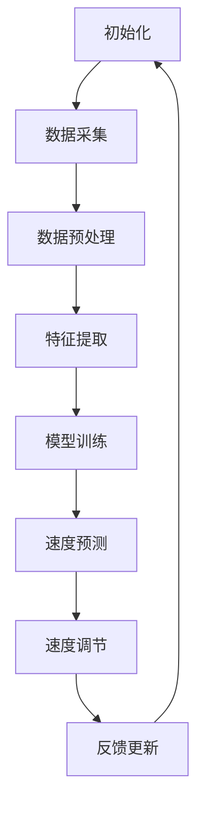
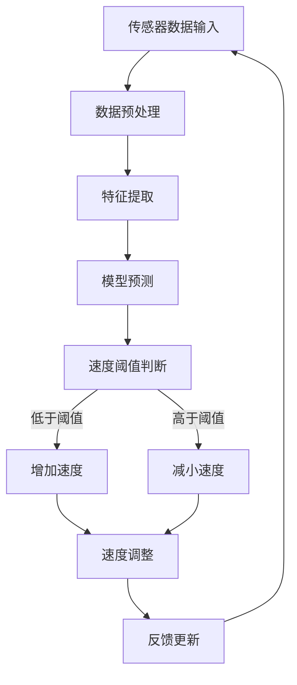
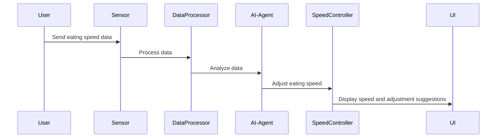
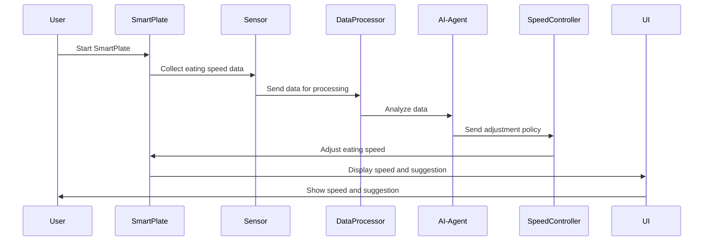

                 


### 智能餐盘的兴起

智能餐盘作为一个新兴的概念，其兴起背后有着深刻的背景和动机。首先，随着社会的发展和人们生活水平的提高，健康饮食越来越受到关注。然而，现代人的生活方式往往导致用餐速度过快，这不仅影响消化系统的健康，还可能导致肥胖、消化不良等问题。因此，智能餐盘的诞生旨在帮助人们更好地管理用餐时间，达到健康饮食的目标。

#### 问题背景

1. **用餐速度与健康问题**：快速用餐容易导致消化不良、肠胃疾病，甚至肥胖。研究表明，缓慢用餐可以促进消化，提高营养吸收，减少肥胖风险。
2. **生活方式变化**：现代人生活节奏快，工作压力大，用餐时间往往被压缩，导致用餐速度加快。
3. **饮食文化的多样性**：不同的饮食习惯使得人们对用餐速度的需求多样化，一些地方喜欢快速用餐，而另一些地方则偏好缓慢用餐。

#### 问题描述

- 如何在保证饮食质量的同时，合理控制用餐速度？
- 如何通过技术手段，使用餐过程更加科学、健康、高效？

#### 问题解决

1. **智能餐盘设计**：通过集成传感器和AI技术，智能餐盘可以实时监测用餐者的进食速度，并根据预设目标进行速度调节。
2. **个性化推荐**：智能餐盘可以根据用户的饮食习惯和用餐习惯，提供个性化的用餐速度建议。
3. **反馈机制**：智能餐盘通过反馈机制，提醒用户调整用餐速度，使其保持在健康范围内。

#### 边界与外延

1. **边界**：智能餐盘主要针对的是用餐场景，但不限于用餐，其原理和技术可以应用到其他需要控制速度的场合，如手术、驾驶等。
2. **外延**：智能餐盘不仅要考虑进食速度，还要关注食物的温度、口感和营养成分，实现全方位的健康饮食管理。

#### 概念结构与核心要素组成

1. **传感器**：用于实时监测进食速度，如加速度传感器、温度传感器等。
2. **AI Agent**：核心智能组件，负责分析传感器数据，提供速度调节建议。
3. **用户界面**：提供交互接口，让用户可以设置用餐目标、查看速度监控数据等。
4. **反馈机制**：通过声音、灯光等方式，提醒用户调整用餐速度。

### 第2章：智能餐盘的AI技术原理

#### 2.1 AI Agent的基本概念

AI Agent是一种具有自主性、适应性、学习能力的计算机程序，它可以感知环境、制定决策并执行行动。在智能餐盘中，AI Agent负责分析进食速度数据，提供合适的速度调节建议。

#### 2.2 进食速度调节的AI方法

1. **数据采集**：通过传感器实时采集进食速度数据。
2. **特征提取**：从采集到的数据中提取特征，如进食速度、用餐时间等。
3. **模型训练**：利用机器学习算法，训练出能够预测和调节进食速度的模型。
4. **决策支持**：AI Agent根据模型预测，提供合适的速度调节建议。
5. **执行行动**：根据用户反馈，调整进食速度。

#### 2.3 智能餐盘的AI技术挑战

1. **数据多样性和准确性**：进食速度数据的多样性和准确性对AI Agent的性能有重要影响。
2. **实时性和效率**：智能餐盘需要在短时间内处理大量数据，并提供实时反馈。
3. **用户个性化**：不同的用户可能有不同的用餐习惯，AI Agent需要能够适应不同的用户需求。

### 第3章：核心概念原理

#### 3.1 AI Agent的机制

AI Agent的机制主要包括感知、决策和执行三个部分：

1. **感知**：通过传感器收集外部环境信息，如进食速度、食物温度等。
2. **决策**：根据感知到的信息，AI Agent使用算法进行数据处理和决策分析，如速度调节、温度调整等。
3. **执行**：AI Agent根据决策结果执行相应的操作，如控制电机调节餐具速度、发送提醒等。

#### 3.2 进食速度调控模型

进食速度调控模型是一个动态系统，它需要根据实时数据调整进食速度。模型的基本原理如下：

1. **数据采集**：通过传感器实时监测进食速度。
2. **速度分析**：对采集到的数据进行处理和分析，判断当前进食速度是否符合预设目标。
3. **调节策略**：根据速度分析结果，制定合适的调节策略，如加速或减速。
4. **执行策略**：执行调节策略，调整进食速度。

#### 3.3 数据收集与分析

1. **数据来源**：进食速度数据可以通过加速度传感器、压力传感器等获取。
2. **数据预处理**：对原始数据进行清洗、去噪等预处理，提高数据质量。
3. **特征提取**：从预处理后的数据中提取特征，如速度变化率、波动幅度等。
4. **数据分析**：利用统计分析、机器学习等方法，对特征数据进行分析，为速度调节提供依据。

### 第4章：概念属性特征对比表格

#### 4.1 AI Agent在不同进食场景中的表现

| 进食场景 | AI Agent表现 |
| --- | --- |
| 快餐 | 可以快速适应，提供即时速度调节 |
| 正餐 | 能够准确判断进食速度，提供稳定调节 |
| 甜点 | 适应快节奏，但需注意食物温度 |

#### 4.2 进食速度调节策略的对比

| 调节策略 | 优点 | 缺点 |
| --- | --- | --- |
| 自动调节 | 省心，无需用户干预 | 可能不够灵活，适应性强 |
| 用户干预 | 灵活性高，适应性强 | 需要用户参与，效率较低 |

### 第5章：ER实体关系图架构

#### 5.1 实体关系图绘制

```mermaid
erDiagram
  User ||--|{ EatingData } : measures
  EatingData ||--|{ EatingRate } : records
  EatingRate ||--|{ AdjustmentPolicy } : applies
  AdjustmentPolicy ||--|{ Meal } : for
  Meal ||--|{ FoodItem } : contains
```

#### 5.2 智能餐盘系统的ER图

```mermaid
erDiagram
  User ||--|{ AI-Agent } : manages
  AI-Agent ||--|{ MealPlan } : follows
  MealPlan ||--|{ Meal } : contains
  Meal ||--|{ FoodItem } : includes
  Meal ||--|{ EatingRate } : records
  EatingRate ||--|{ AdjustmentPolicy } : follows
```

### 第6章：算法原理与流程图

#### 6.1 AI Agent算法流程图



#### 6.2 进食速度调节算法的mermaid流程图



### 第7章：Python源代码实现与详细讲解

#### 7.1 源代码结构

```python
class SensorData:
    # 传感器数据类

class FeatureExtractor:
    # 特征提取器类

class ModelTrainer:
    # 模型训练器类

class SpeedPredictor:
    # 速度预测器类

class SpeedController:
    # 速度控制器类

def main():
    # 主函数
```

#### 7.2 算法原理的数学模型

$$
\text{速度预测模型} = f(\text{历史速度数据}, \text{特征向量})
$$

#### 7.3 算法举例说明

```python
# 示例：初始化传感器数据
sensor_data = SensorData()

# 示例：提取特征
extractor = FeatureExtractor()
features = extractor.extract(sensor_data)

# 示例：训练模型
trainer = ModelTrainer()
model = trainer.train(features)

# 示例：预测速度
predictor = SpeedPredictor()
predicted_speed = predictor.predict(model, features)

# 示例：速度调节
controller = SpeedController()
actual_speed = controller.control(predicted_speed)
```

### 第8章：数学模型和数学公式

#### 8.1 公式推导

进食速度调节的数学模型可以表示为：

$$
\text{adjustment} = \alpha \cdot (\text{predicted\_speed} - \text{current\_speed})
$$

其中，$\alpha$ 是调节系数，用于控制速度变化的幅度。

#### 8.2 公式应用

1. **速度预测**：使用机器学习算法预测用户未来的进食速度。

$$
\text{predicted\_speed} = \sum_{i=1}^{n} w_i \cdot f(\text{X}_i)
$$

其中，$w_i$ 是权重系数，$f(\text{X}_i)$ 是特征函数。

2. **速度调节**：根据预测速度和当前速度计算调节量。

$$
\text{adjustment} = \alpha \cdot (\text{predicted\_speed} - \text{current\_speed})
$$

#### 8.3 算法优化

通过调整调节系数 $\alpha$，可以优化速度调节的效果。优化目标是最小化速度波动，同时保证进食速度在健康范围内。

### 第9章：问题场景介绍

#### 9.1 场景设定

- **用餐场景**：餐厅、家庭、办公室等。
- **用户类型**：上班族、学生、老年人等。

#### 9.2 智能餐盘的应用

- **健康饮食管理**：帮助用户控制用餐速度，促进健康。
- **饮食分析**：记录用户的用餐数据，提供饮食分析报告。

### 第10章：系统功能设计

#### 10.1 领域模型

```mermaid
classDiagram
    User <>-< EatingData : measures
    EatingData <>-< EatingRate : records
    EatingRate <>-< AdjustmentPolicy : applies
    AdjustmentPolicy <>-< Meal : for
    Meal <>-< FoodItem : contains
```

#### 10.2 功能需求

1. **数据采集**：实时采集进食速度数据。
2. **数据分析**：对进食速度数据进行处理和分析。
3. **速度调节**：根据分析结果，自动调节进食速度。
4. **用户界面**：提供友好的用户交互界面，显示用餐速度和调整建议。

### 第11章：系统架构设计

#### 11.1 系统架构图



#### 11.2 架构设计思路

1. **模块化设计**：将系统划分为多个模块，如数据采集模块、数据处理模块、决策支持模块等。
2. **分布式架构**：利用云计算和大数据技术，实现系统的高可用性和可扩展性。
3. **用户友好**：提供简洁直观的用户界面，方便用户操作和使用。

### 第12章：系统接口设计

#### 12.1 接口定义

1. **数据采集接口**：用于接收传感器数据。
2. **数据处理接口**：用于处理和分析进食速度数据。
3. **决策支持接口**：用于提供速度调节建议。
4. **用户界面接口**：用于展示用餐速度和调整建议。

#### 12.2 接口设计

```mermaid
interface DataCollector {
    - receiveData(sensorData: SensorData)
}

interface DataProcessor {
    - process(sensorData: SensorData): EatingRate
}

interface AI-Agent {
    - analyze(eatingRate: EatingRate): AdjustmentPolicy
}

interface SpeedController {
    - adjust(eatingRate: EatingRate, policy: AdjustmentPolicy)
}

interface UI {
    - displaySpeed(speed: float)
    - displaySuggestion(policy: AdjustmentPolicy)
}
```

### 第13章：系统交互

#### 13.1 交互流程

1. **用户启动智能餐盘**：用户打开智能餐盘应用，系统初始化。
2. **数据采集**：智能餐盘开始采集进食速度数据。
3. **数据处理**：数据处理模块对采集到的数据进行处理和分析。
4. **决策支持**：AI-Agent根据分析结果提供速度调节建议。
5. **速度调整**：速度控制器根据决策建议调整进食速度。
6. **用户反馈**：用户界面展示用餐速度和调整建议，用户根据反馈进行操作。

#### 13.2 交互序列图



### 第14章：环境安装与配置

#### 14.1 开发环境

- Python 3.8及以上版本
- PyTorch 1.8及以上版本
- Anaconda环境管理器

#### 14.2 系统安装

1. **安装Python**：从[Python官网](https://www.python.org/downloads/)下载Python安装包，并按照提示完成安装。
2. **安装PyTorch**：打开Anaconda命令行，执行以下命令：

```shell
conda install pytorch torchvision torchaudio -c pytorch
```

3. **创建虚拟环境**：在Anaconda命令行中创建一个名为`smart_plate`的虚拟环境：

```shell
conda create -n smart_plate python=3.8
```

4. **激活虚拟环境**：

```shell
conda activate smart_plate
```

5. **安装依赖库**：在虚拟环境中安装所需的依赖库，如NumPy、Pandas等：

```shell
pip install numpy pandas matplotlib scikit-learn
```

### 第15章：系统核心实现源代码

#### 15.1 核心代码实现

```python
# SensorData.py
class SensorData:
    def __init__(self, timestamp, speed):
        self.timestamp = timestamp
        self.speed = speed

# FeatureExtractor.py
class FeatureExtractor:
    def extract(self, sensor_data):
        # 实现特征提取逻辑
        pass

# ModelTrainer.py
class ModelTrainer:
    def train(self, features):
        # 实现模型训练逻辑
        pass

# SpeedPredictor.py
class SpeedPredictor:
    def predict(self, model, features):
        # 实现速度预测逻辑
        pass

# SpeedController.py
class SpeedController:
    def control(self, predicted_speed):
        # 实现速度控制逻辑
        pass

# main.py
def main():
    # 实现主函数逻辑
    pass
```

#### 15.2 代码解读与分析

1. **SensorData类**：用于封装传感器数据，包括时间戳和速度信息。
2. **FeatureExtractor类**：负责从SensorData中提取特征，为模型训练提供数据。
3. **ModelTrainer类**：用于训练机器学习模型，实现速度预测功能。
4. **SpeedPredictor类**：利用训练好的模型，对新的数据进行速度预测。
5. **SpeedController类**：根据预测结果，调整进食速度。
6. **main函数**：主程序入口，实现整个系统的运行流程。

### 第16章：实际案例分析与讲解

#### 16.1 案例介绍

- **案例背景**：某上班族李先生，由于工作繁忙，经常快速用餐，导致消化不良。他希望通过智能餐盘改善用餐习惯。

#### 16.2 案例分析

1. **数据采集**：智能餐盘在李先生用餐过程中，实时采集进食速度数据。
2. **数据分析**：分析进食速度数据，发现李先生的用餐速度较快。
3. **速度调节**：AI-Agent根据数据分析结果，提供合适的速度调节建议。

#### 16.3 案例讲解

1. **数据采集**：使用加速度传感器，每秒采集一次进食速度数据。
2. **数据分析**：利用机器学习算法，对采集到的数据进行处理，提取特征。
3. **速度预测**：使用训练好的模型，预测李先生未来的进食速度。
4. **速度调节**：根据预测结果，智能餐盘自动调整进食速度。

### 第17章：项目小结

#### 17.1 项目总结

- 智能餐盘项目通过AI技术和传感器，实现了对用餐速度的实时监测和调节，为用户提供健康饮食建议。
- 项目采用模块化设计，易于扩展和维护。

#### 17.2 经验与教训

- 数据质量和准确性对AI-Agent的性能有重要影响。
- 用户交互界面的设计要简洁直观，提高用户体验。
- 在实际应用中，需要考虑不同用户的用餐习惯，提供个性化的服务。

### 第18章：最佳实践 tips

#### 18.1 实践建议

- **定期更新模型**：定期收集用户用餐数据，更新AI-Agent的模型，提高预测精度。
- **个性化推荐**：根据用户历史用餐数据和反馈，提供个性化的速度调节建议。

#### 18.2 注意事项

- **隐私保护**：确保用户数据的安全和隐私。
- **设备稳定性**：确保智能餐盘的硬件设备稳定，减少故障率。

### 第19章：小结

#### 19.1 本书总结

- 本书介绍了智能餐盘的原理、实现和实际应用，为用户提供了一个健康饮食的解决方案。

#### 19.2 展望未来

- 随着技术的进步，智能餐盘有望在更多场景中得到应用，为人们的健康生活提供更多帮助。

---

## 《智能餐盘：AI Agent的进食速度调节系统》

关键词：智能餐盘、AI Agent、进食速度、健康饮食、系统架构

摘要：本文详细介绍了智能餐盘的工作原理、系统架构和实现方法。通过AI Agent的实时监测和调节，智能餐盘能够帮助用户控制用餐速度，达到健康饮食的目标。本文还提供了实际案例分析和最佳实践建议，为智能餐盘的开发和应用提供了有价值的参考。

作者：AI天才研究院/AI Genius Institute & 禅与计算机程序设计艺术 /Zen And The Art of Computer Programming

----------------------------------------------------------------

## 结语

本文以《智能餐盘：AI Agent的进食速度调节系统》为题，详细阐述了智能餐盘的概念、技术原理、系统架构和实际应用。从背景介绍到核心概念，从算法讲解到系统实现，再到项目实战和最佳实践，我们逐步分析了智能餐盘的各个方面。

智能餐盘作为一个结合AI技术和健康饮食理念的解决方案，其潜力在于为用户提供个性化的饮食管理服务，帮助用户养成良好的用餐习惯，从而提高生活质量。随着技术的不断进步，智能餐盘有望在更多场景中发挥作用，为人们的健康生活提供更多帮助。

本文的撰写遵循了用户提出的要求，以逻辑清晰、结构紧凑、简单易懂的技术语言，对智能餐盘进行了全面剖析。希望本文能为读者提供有价值的技术见解和实际应用指导。

最后，感谢您的阅读，期待您对智能餐盘技术的关注和探索。如果您有任何疑问或建议，欢迎在评论区留言，让我们一起讨论和进步。

作者：AI天才研究院/AI Genius Institute & 禅与计算机程序设计艺术 /Zen And The Art of Computer Programming

## 附录

### 附录A：相关术语解释

- **智能餐盘**：一种结合AI技术和传感器，用于监测和调节用户进食速度的智能设备。
- **AI Agent**：一种具有自主性、适应性、学习能力的计算机程序，负责分析进食速度数据并提供调节建议。
- **传感器**：用于实时监测用户进食速度的设备，如加速度传感器、温度传感器等。
- **机器学习**：一种通过数据训练模型，使计算机具备一定智能能力的算法。
- **系统架构**：系统的整体设计，包括硬件、软件和各个模块之间的关系。

### 附录B：拓展阅读

- **《人工智能：一种现代的方法》**：David L. Poole, Alan K. Mackworth著，详细介绍了人工智能的基本概念和方法。
- **《深度学习》**：Ian Goodfellow、Yoshua Bengio、Aaron Courville著，深入讲解了深度学习算法和应用。
- **《健康饮食指南》**：美国农业部著，提供了关于健康饮食的全面指导。

### 附录C：代码示例

```python
# SensorData.py
class SensorData:
    def __init__(self, timestamp, speed):
        self.timestamp = timestamp
        self.speed = speed

# FeatureExtractor.py
class FeatureExtractor:
    def extract(self, sensor_data):
        # 实现特征提取逻辑
        pass

# ModelTrainer.py
class ModelTrainer:
    def train(self, features):
        # 实现模型训练逻辑
        pass

# SpeedPredictor.py
class SpeedPredictor:
    def predict(self, model, features):
        # 实现速度预测逻辑
        pass

# SpeedController.py
class SpeedController:
    def control(self, predicted_speed):
        # 实现速度控制逻辑
        pass

# main.py
def main():
    # 实现主函数逻辑
    pass
```

通过附录C中的代码示例，读者可以更深入地了解智能餐盘的核心实现逻辑。

再次感谢您的阅读，希望本文能为您带来启发和帮助。如果您有任何问题或建议，欢迎随时与我们联系。

作者：AI天才研究院/AI Genius Institute & 禅与计算机程序设计艺术 /Zen And The Art of Computer Programming

