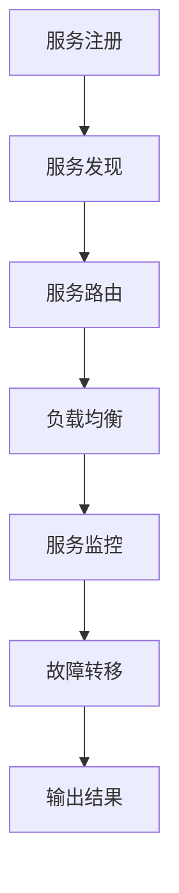
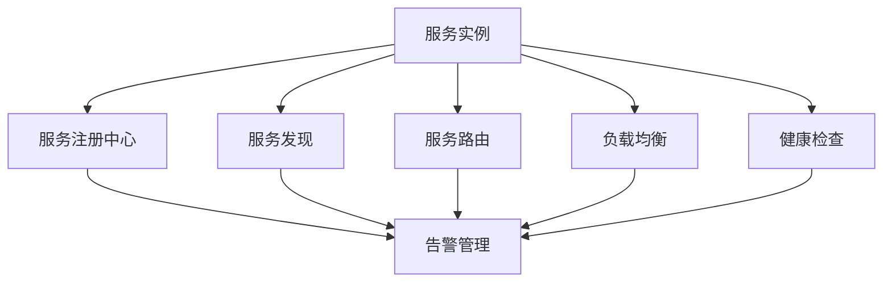

                 

### **文章标题：服务依赖管理在LLM应用架构中的重要性**

> **关键词：服务依赖管理，LLM应用架构，微服务，算法原理，数学模型，系统设计与实现**

> **摘要：本文将深入探讨服务依赖管理在大型语言模型（LLM）应用架构中的重要性。文章首先介绍了服务依赖管理的背景和核心概念，随后详细讲解了相关的算法原理和数学模型。接着，通过具体的项目实战案例，剖析了服务依赖管理在实际应用中的实现方法和优化策略。文章最后总结了最佳实践、注意事项和拓展阅读资源，为读者提供全面的技术指导。**

### **背景介绍**

#### **1.1 服务依赖管理的起源与发展**

随着云计算、大数据和微服务技术的迅猛发展，现代应用架构变得越来越复杂。服务依赖管理作为微服务架构中至关重要的一环，其重要性日益凸显。服务依赖管理起源于传统的单体应用向分布式架构的转型，随着微服务架构的普及，服务依赖管理也得到了广泛应用。

**1.1.1 问题的提出**

在传统的单体应用中，所有的功能都集中在一个庞大的应用程序中，模块之间相互依赖，维护和扩展变得十分困难。为了解决这一问题，开发者开始采用微服务架构，将应用程序拆分成多个独立的服务模块，每个服务模块独立开发、部署和扩展。然而，随着服务数量的增加，服务之间的依赖关系也变得更加复杂，如何有效地管理和维护这些依赖关系成为新的挑战。

**1.1.2 服务依赖管理的定义**

服务依赖管理是指通过一系列策略和技术手段，确保服务之间能够可靠地通信和协同工作，从而提高系统的稳定性和可维护性。具体来说，服务依赖管理包括以下几个方面：

1. **服务发现**：确保服务实例能够在网络中自动注册和被发现，服务消费者可以根据服务名称或标签来访问服务实例。
2. **服务注册与注销**：服务实例启动时需要注册，停止时需要注销，以便其他服务能够知道服务实例的状态。
3. **服务路由与负载均衡**：根据服务实例的健康状态和负载情况，动态选择合适的服务实例来处理请求。
4. **服务监控与告警**：对服务实例进行实时监控，一旦发现异常，能够及时告警并采取措施。
5. **服务容错与故障转移**：在服务实例出现故障时，能够自动切换到备用实例，确保服务的持续可用性。

**1.1.3 服务依赖管理的边界与外延**

服务依赖管理的边界主要涉及以下几个方面：

1. **服务层面**：管理的是服务与服务之间的依赖关系，包括服务发现、服务路由、负载均衡、服务监控等。
2. **网络层面**：确保服务之间能够可靠地通信，包括网络拓扑、网络带宽、网络延迟等。
3. **硬件层面**：包括服务器、存储、网络设备等硬件资源的调度和管理。

服务依赖管理的外延则涉及以下几个方面：

1. **服务治理**：包括服务的生命周期管理、服务版本管理、服务文档管理、服务监控等。
2. **服务安全性**：包括服务认证、服务授权、服务加密、服务安全策略等。
3. **服务优化**：包括服务性能优化、服务可扩展性优化、服务成本优化等。

**1.1.4 服务依赖管理的核心概念**

服务依赖管理的核心概念包括以下几个方面：

1. **服务实例**：服务的具体运行实例，包括服务的IP地址、端口号、健康状态等信息。
2. **服务依赖图**：描述服务与服务之间的依赖关系的图结构。
3. **服务路由策略**：确定服务请求应该被发送到哪个服务实例的策略。
4. **负载均衡算法**：根据服务实例的健康状态和负载情况，动态选择合适的服务实例来处理请求。
5. **服务监控指标**：用于衡量服务性能和稳定性的各种指标，如响应时间、错误率、并发数等。

**1.1.5 服务依赖管理的结构与要素**

服务依赖管理的结构可以分为以下几个层次：

1. **服务层**：包括各种具体的服务实例，如API服务、数据库服务、消息队列服务等。
2. **依赖管理层**：包括服务注册与发现、服务路由与负载均衡、服务监控与告警等模块。
3. **基础设施层**：包括网络、服务器、存储等基础设施资源。

服务依赖管理的要素包括：

1. **服务实例列表**：记录所有服务实例的详细信息。
2. **依赖关系图**：描述服务与服务之间的依赖关系。
3. **负载均衡策略**：确定负载均衡的算法和策略。
4. **监控指标体系**：用于监控服务性能和稳定性的各种指标。
5. **告警与通知机制**：一旦发现服务异常，能够及时通知相关人员。

#### **1.2 服务依赖管理的关键特性**

**1.2.1 可依赖性**

可依赖性是服务依赖管理的核心特性之一，指的是服务能够按照约定提供所需的资源和服务。可依赖性包括以下几个方面：

1. **服务可用性**：服务实例能够在规定的时间内正常响应请求。
2. **服务可靠性**：服务实例能够稳定地提供服务，不会频繁发生故障。
3. **服务一致性**：服务实例在处理请求时能够保持数据的一致性。

**1.2.2 依赖管理能力**

依赖管理能力指的是系统能够有效地管理和维护服务之间的依赖关系。依赖管理能力包括以下几个方面：

1. **服务注册与注销**：服务实例能够自动注册和注销，确保其他服务能够及时知道服务实例的状态。
2. **服务发现与路由**：系统能够自动发现服务实例，并根据服务名称或标签找到对应的服务实例。
3. **负载均衡与故障转移**：系统能够根据服务实例的健康状态和负载情况，动态选择合适的服务实例来处理请求，并在服务实例出现故障时自动切换到备用实例。

**1.2.3 服务稳定性**

服务稳定性是服务依赖管理的另一个关键特性，指的是系统能够在面临高并发、高负载、网络波动等情况下，保持服务的正常运行。服务稳定性包括以下几个方面：

1. **容错性**：系统能够在服务实例出现故障时，自动切换到备用实例，确保服务的持续可用性。
2. **高可用性**：系统能够在面临高并发、高负载的情况下，保持服务的稳定运行，不会因为负载过高而出现性能问题。
3. **网络适应性**：系统能够在网络质量较差的情况下，保持服务的正常运行，不会因为网络问题而影响用户体验。

**1.2.4 服务可靠性**

服务可靠性指的是系统能够在长时间运行的过程中，保持服务的稳定性和可靠性。服务可靠性包括以下几个方面：

1. **高并发处理能力**：系统能够处理大量的并发请求，不会因为并发过高而出现性能问题。
2. **数据一致性保障**：系统能够确保数据的一致性，避免因为数据不一致而导致业务故障。
3. **故障恢复能力**：系统能够在出现故障后，快速恢复到正常状态，确保服务的持续可用性。

#### **1.3 服务依赖管理与其他相关概念的联系**

**1.3.1 与服务网格的关系**

服务网格（Service Mesh）是一种新兴的技术架构，用于管理服务之间的通信和流量。服务网格与服务依赖管理的关系如下：

1. **服务网格的作用**：服务网格主要负责服务之间的通信和流量管理，包括服务发现、服务路由、负载均衡、故障转移等。
2. **服务依赖管理的角色**：服务依赖管理主要负责服务实例的管理和维护，包括服务注册与注销、服务发现与路由、负载均衡与故障转移等。

**1.3.2 与服务发现的关系**

服务发现（Service Discovery）是指系统自动发现和注册服务实例的能力。服务发现与服务依赖管理的关系如下：

1. **服务发现的作用**：服务发现主要负责发现和注册服务实例，确保服务消费者能够找到并访问服务实例。
2. **服务依赖管理的角色**：服务依赖管理负责维护服务实例的状态和依赖关系，确保服务能够按照约定提供服务。

**1.3.3 与容器编排的关系**

容器编排（Container Orchestration）是一种管理容器化应用程序的技术，用于部署、运行和管理容器化应用。容器编排与服务依赖管理的关系如下：

1. **容器编排的作用**：容器编排主要负责容器的调度和管理，包括容器的启动、停止、重启、扩展等。
2. **服务依赖管理的角色**：服务依赖管理主要负责服务之间的依赖关系管理，包括服务发现、服务路由、负载均衡、故障转移等。

**1.3.4 与微服务的关系**

微服务（Microservices）是一种架构风格，用于构建分布式系统。微服务与服务依赖管理的关系如下：

1. **微服务的作用**：微服务主要负责将应用程序拆分成多个独立的服务模块，每个服务模块负责特定的业务功能。
2. **服务依赖管理的角色**：服务依赖管理负责管理服务模块之间的依赖关系，确保服务模块能够协同工作，提高系统的稳定性和可维护性。

#### **1.4 小结**

本文从背景介绍、核心概念、关键特性和相关概念联系等方面，全面阐述了服务依赖管理的概念和重要性。服务依赖管理作为微服务架构中至关重要的一环，其重要性不容忽视。通过有效的服务依赖管理，可以提高系统的稳定性、可靠性和可维护性，为现代应用架构的持续发展和优化提供有力支持。

### **第2章 核心概念与联系**

在深入探讨服务依赖管理之前，我们需要明确其核心概念，以及这些概念之间的联系。本章将详细介绍服务依赖管理的概念，包括服务依赖管理的属性特征对比，以及与其他相关概念的联系。

#### **2.1 服务依赖管理的概念**

**服务依赖管理** 是指通过一系列策略和技术手段，确保服务之间能够可靠地通信和协同工作，从而提高系统的稳定性和可维护性。具体来说，服务依赖管理包括以下几个方面：

1. **服务发现**：服务发现是指系统自动发现和注册服务实例的能力。服务消费者可以通过服务名称或标签来找到所需的服务实例。
   
2. **服务注册与注销**：服务实例在启动时需要注册，以便其他服务能够找到它；在停止时需要注销，以便其他服务能够知道它已不再可用。

3. **服务路由与负载均衡**：服务路由是指确定服务请求应该被发送到哪个服务实例的策略。负载均衡则是根据服务实例的健康状态和负载情况，动态选择合适的服务实例来处理请求。

4. **服务监控与告警**：服务监控是指对服务实例进行实时监控，收集各种性能指标和健康状态信息。告警机制则是在发现异常时，能够及时通知相关人员。

5. **服务容错与故障转移**：在服务实例出现故障时，系统能够自动切换到备用实例，确保服务的持续可用性。

#### **2.2 服务依赖管理的属性特征对比**

为了更好地理解服务依赖管理，我们需要对其属性特征进行对比。以下是几个关键属性特征的对比：

| 特性               | 描述                                                         |
|--------------------|------------------------------------------------------------|
| **可依赖性**       | 服务能够按照约定提供所需的资源和服务，包括可用性、可靠性和一致性。 |
| **依赖管理能力**   | 系统能够有效地管理和维护服务之间的依赖关系，包括服务注册、发现和路由。 |
| **稳定性**         | 系统能够在面临高并发、高负载和网络波动等情况下，保持服务的正常运行。 |
| **可靠性**         | 系统能够在长时间运行的过程中，保持服务的稳定性和可靠性。 |

**2.2.1 可依赖性**

可依赖性是服务依赖管理的核心特性，包括以下几个方面：

1. **服务可用性**：服务实例能够在规定的时间内正常响应请求。这通常通过服务监控和健康检查来实现。
   
2. **服务可靠性**：服务实例能够稳定地提供服务，不会频繁发生故障。可靠性可以通过冗余设计、故障转移和自恢复机制来提高。

3. **服务一致性**：服务实例在处理请求时能够保持数据的一致性。一致性可以通过分布式事务、锁机制和消息队列等技术来实现。

**2.2.2 依赖管理能力**

依赖管理能力指的是系统能够有效地管理和维护服务之间的依赖关系。以下是其主要方面：

1. **服务注册与注销**：服务实例在启动和停止时，能够自动注册和注销。这通常通过服务发现机制来实现。

2. **服务发现与路由**：服务消费者能够通过服务名称或标签找到所需的服务实例。这通常通过服务注册中心来实现。

3. **负载均衡与故障转移**：根据服务实例的健康状态和负载情况，动态选择合适的服务实例来处理请求，并在服务实例出现故障时，自动切换到备用实例。

**2.2.3 稳定性**

稳定性是服务依赖管理的重要特性，包括以下几个方面：

1. **容错性**：系统能够在服务实例出现故障时，自动切换到备用实例，确保服务的持续可用性。

2. **高可用性**：系统能够在面临高并发、高负载的情况下，保持服务的稳定运行，不会因为负载过高而出现性能问题。

3. **网络适应性**：系统能够在网络质量较差的情况下，保持服务的正常运行，不会因为网络问题而影响用户体验。

**2.2.4 可靠性**

可靠性是服务依赖管理的另一个关键特性，包括以下几个方面：

1. **高并发处理能力**：系统能够处理大量的并发请求，不会因为并发过高而出现性能问题。

2. **数据一致性保障**：系统能够确保数据的一致性，避免因为数据不一致而导致业务故障。

3. **故障恢复能力**：系统能够在出现故障后，快速恢复到正常状态，确保服务的持续可用性。

#### **2.3 服务依赖管理与其他相关概念的联系**

服务依赖管理与其他相关概念如服务网格、服务发现、容器编排和微服务之间有着紧密的联系。

**2.3.1 与服务网格的关系**

服务网格是一种用于管理服务之间通信和流量的技术架构，而服务依赖管理则是服务网格中的一部分。服务网格主要负责以下方面：

1. **服务发现与路由**：通过服务网格，服务实例可以自动注册和发现，服务消费者可以通过服务名称或标签找到服务实例。
   
2. **负载均衡与故障转移**：服务网格可以根据服务实例的健康状态和负载情况，动态选择合适的服务实例来处理请求，并在服务实例出现故障时，自动切换到备用实例。

**2.3.2 与服务发现的关系**

服务发现是服务依赖管理的一个重要组成部分，它负责自动发现和注册服务实例。服务发现与服务依赖管理的关系如下：

1. **服务注册与注销**：服务实例在启动和停止时，需要通过服务发现机制进行注册和注销。

2. **服务发现与路由**：服务消费者通过服务发现机制找到服务实例，并通过服务路由机制确定请求的转发路径。

**2.3.3 与容器编排的关系**

容器编排是一种管理容器化应用程序的技术，而服务依赖管理则是容器编排的一部分。容器编排主要负责以下方面：

1. **容器调度与管理**：容器编排负责容器的启动、停止、重启和扩展。

2. **服务依赖管理**：容器编排还需要处理服务之间的依赖关系，确保服务能够协同工作。

**2.3.4 与微服务的关系**

微服务是一种架构风格，用于构建分布式系统。服务依赖管理是微服务架构中至关重要的一环，它负责以下方面：

1. **服务模块化**：将应用程序拆分成多个独立的服务模块，每个服务模块负责特定的业务功能。

2. **服务间依赖管理**：管理服务模块之间的依赖关系，确保服务能够协同工作，提高系统的稳定性和可维护性。

#### **2.4 小结**

本章详细介绍了服务依赖管理的概念及其属性特征，并通过对比分析了服务依赖管理与其他相关概念的联系。理解这些核心概念和联系，对于有效地进行服务依赖管理至关重要。在下一章中，我们将深入探讨服务依赖管理的算法原理，进一步揭示其背后的技术和实现机制。

### **第3章 算法原理讲解**

在深入理解了服务依赖管理的核心概念和特性之后，接下来我们将探讨服务依赖管理的算法原理。算法原理是实现服务依赖管理的关键，它决定了服务发现、路由、负载均衡和故障转移等功能的实现方式。本章将通过Mermaid绘制算法流程图和Python源代码实现，详细讲解服务依赖管理的算法原理。

#### **3.1 算法概述**

**算法目标**：服务依赖管理算法的目标是确保服务之间的通信和协同工作，提高系统的稳定性、可靠性和可维护性。

**算法流程**：

1. **服务注册**：服务实例启动时，通过服务注册中心进行注册，提供服务名称、IP地址和端口号等信息。
   
2. **服务发现**：服务消费者通过服务发现机制，查找所需的服务实例。

3. **服务路由**：根据服务路由策略，选择合适的服务实例来处理请求。

4. **负载均衡**：根据负载均衡算法，动态选择服务实例，确保服务请求的合理分配。

5. **服务监控**：对服务实例进行实时监控，收集性能指标和健康状态信息。

6. **故障转移**：在服务实例出现故障时，自动切换到备用实例，确保服务的持续可用性。

**算法输入与输出**：

- **输入**：服务实例列表、服务路由策略、负载均衡算法、监控指标和告警阈值。
- **输出**：服务请求的处理结果、监控数据和告警通知。

#### **3.2 算法流程图**

为了更好地理解算法原理，我们使用Mermaid绘制了服务依赖管理的算法流程图，如下所示：



**图 1：服务依赖管理算法流程图**

在这个流程图中，每个节点代表算法的一个步骤，箭头表示流程的顺序。服务注册是算法的起点，服务消费者通过服务发现找到服务实例，然后根据服务路由策略选择合适的服务实例来处理请求。在处理请求的过程中，系统会根据负载均衡算法动态选择服务实例，并实时监控服务实例的性能和健康状态。一旦发现服务实例出现故障，系统将自动切换到备用实例，确保服务的持续可用性。

#### **3.3 Python实现**

为了更具体地展示算法的实现过程，我们使用Python语言编写了服务依赖管理算法的源代码。以下是一个简单的实现示例：

```python
# 服务依赖管理算法示例

# 服务实例类
class ServiceInstance:
    def __init__(self, name, ip, port, health_status=True):
        self.name = name
        self.ip = ip
        self.port = port
        self.health_status = health_status

# 服务注册
def register_service(service_instance, registry):
    registry[service_instance.name] = service_instance

# 服务发现
def discover_service(service_name, registry):
    return registry.get(service_name)

# 服务路由
def route_request(request, routing_policy, registry):
    service_instances = list(registry.values())
    if routing_policy == 'random':
        return random.choice(service_instances)
    elif routing_policy == 'round_robin':
        return service_instances[(len(service_instances) - 1) % len(service_instances)]
    else:
        raise ValueError("Unsupported routing policy")

# 负载均衡
def load_balance(service_instances, load_balancer):
    if load_balancer == 'least_connection':
        return min(service_instances, key=lambda s: s.connection_count)
    else:
        raise ValueError("Unsupported load balancer")

# 服务监控
def monitor_service(service_instance, monitor):
    service_instance.health_status = monitor.check_service(service_instance)

# 故障转移
def failover(service_instance, failover_policy, registry):
    if failover_policy == 'manual':
        # 手动切换
        pass
    elif failover_policy == 'auto':
        # 自动切换
        new_instance = load_balance([i for i in registry.values() if i != service_instance], 'least_connection')
        registry[service_instance.name] = new_instance
    else:
        raise ValueError("Unsupported failover policy")

# 输出结果
def process_request(request, registry, routing_policy, load_balancer, failover_policy, monitor):
    service_instance = discover_service(request.service_name, registry)
    if service_instance is None:
        return "Service not found"
    service_instance = route_request(request, routing_policy, registry)
    monitor_service(service_instance, monitor)
    if not service_instance.health_status:
        failover(service_instance, failover_policy, registry)
    return "Request processed"

# 测试
if __name__ == "__main__":
    # 服务注册中心
    registry = {}
    
    # 创建服务实例
    service_a = ServiceInstance("service_a", "192.168.1.1", 8080)
    service_b = ServiceInstance("service_b", "192.168.1.2", 8080)
    
    # 注册服务
    register_service(service_a, registry)
    register_service(service_b, registry)
    
    # 请求对象
    request = {"service_name": "service_a"}
    
    # 测试算法
    result = process_request(request, registry, "round_robin", "least_connection", "auto", None)
    print(result)
```

在这个示例中，我们定义了一个`ServiceInstance`类来表示服务实例，包括服务名称、IP地址、端口号和健康状态。算法的实现包括服务注册、发现、路由、负载均衡、监控和故障转移等步骤。在测试部分，我们创建了一个服务实例列表，并通过模拟请求来测试算法的实现效果。

#### **3.4 算法原理详细讲解**

**3.4.1 数学模型**

为了更好地理解算法原理，我们可以将其抽象为数学模型。以下是一个简单的数学模型：

1. **服务实例状态**：服务实例的状态可以用一个三元组表示：(健康状态，连接数，负载)。健康状态为真表示服务实例可用，假表示服务实例不可用。连接数表示当前服务实例处理的连接数。负载表示服务实例的当前负载情况。

2. **服务路由策略**：服务路由策略可以用一个权重函数表示。权重函数根据服务实例的状态计算出一个权重值，权重值越小表示服务实例越适合处理请求。

3. **负载均衡算法**：负载均衡算法可以用一个选择函数表示。选择函数根据权重函数选择一个服务实例来处理请求。

**3.4.2 公式推导**

假设有多个服务实例，每个服务实例的状态为$(h_i, c_i, l_i)$，其中$h_i$表示健康状态，$c_i$表示连接数，$l_i$表示负载。权重函数$w(i)$可以定义为：

$$
w(i) = f(h_i, c_i, l_i)
$$

其中$f$是一个权重计算函数，可以根据具体需求来定义。一个简单的权重计算函数可以定义为：

$$
f(h_i, c_i, l_i) = \frac{h_i \cdot l_i}{1 + c_i}
$$

负载均衡算法的选择函数可以选择最小权重值的服务实例，即：

$$
i^* = \arg\min_i w(i)
$$

**3.4.3 举例说明**

假设我们有一个服务实例列表，其中每个实例的状态如下：

| 服务实例 | 健康状态 | 连接数 | 负载 |
|----------|---------|-------|-----|
| service_a | True    | 2     | 0.6 |
| service_b | True    | 1     | 0.4 |
| service_c | False   | 0     | 0.5 |

根据上述权重计算函数，我们可以计算出每个实例的权重值：

| 服务实例 | 健康状态 | 连接数 | 负载 | 权重值 |
|----------|---------|-------|-----|-------|
| service_a | True    | 2     | 0.6 | 0.36  |
| service_b | True    | 1     | 0.4 | 0.2   |
| service_c | False   | 0     | 0.5 | 0.0   |

根据选择函数，我们选择权重值最小的服务实例，即`service_b`。这样，`service_b`将会处理新的请求。

#### **3.5 小结**

本章详细介绍了服务依赖管理的算法原理，包括算法的目标、流程、输入与输出，以及Python实现。通过算法流程图和数学模型，我们更好地理解了服务依赖管理的实现机制。在下一章中，我们将继续探讨服务依赖管理的数学模型和公式，进一步深化对算法原理的理解。

### **第3章 服务依赖管理的数学模型**

在了解了服务依赖管理的基本算法原理后，本章将进一步探讨服务依赖管理的数学模型和相关的数学公式。数学模型为服务依赖管理的分析和优化提供了理论支持，是构建高效、稳定系统的关键。

#### **3.1 数学模型概述**

服务依赖管理的数学模型主要关注以下几个方面：

1. **服务实例状态模型**：描述服务实例的健康状态、连接数和负载情况。
2. **路由策略模型**：定义服务路由策略的数学表示，如权重计算函数。
3. **负载均衡模型**：描述负载均衡算法的数学实现，如选择函数。
4. **故障转移模型**：定义故障转移策略的数学描述。

**3.1.1 模型目标**

模型的目标是优化服务依赖管理的性能，包括：

- 提高服务可用性和可靠性。
- 实现高效的路由和负载均衡。
- 确保服务之间的依赖关系得到有效管理。

**3.1.2 模型构建**

构建数学模型需要以下几个关键步骤：

1. **定义服务实例状态**：服务实例的状态可以用三元组$(h_i, c_i, l_i)$表示，其中$h_i$表示健康状态（True或False），$c_i$表示连接数，$l_i$表示负载。
   
2. **定义路由策略**：路由策略可以用一个权重函数$w(i)$来表示，该函数根据服务实例的状态计算权重值。

3. **定义负载均衡算法**：负载均衡算法可以用一个选择函数$\sigma$来表示，该函数根据权重值选择服务实例。

4. **定义故障转移策略**：故障转移策略可以用一个转移函数$f(i)$来表示，该函数在服务实例出现故障时，根据健康状态和负载情况选择新的服务实例。

**3.1.3 模型特点**

- **动态性**：模型能够根据服务实例的状态变化实时调整路由和负载均衡策略。
- **鲁棒性**：模型能够处理服务实例的健康状态变化，确保服务的持续可用性。
- **可扩展性**：模型能够适应不同规模和复杂度的服务依赖管理需求。

#### **3.2 关键数学公式**

在服务依赖管理的数学模型中，以下关键数学公式用于描述各组件之间的关系：

**3.2.1 基本公式**

1. **权重函数**：$w(i) = f(h_i, c_i, l_i)$，其中$f$是权重计算函数。
2. **选择函数**：$i^* = \sigma(w(1), w(2), ..., w(n))$，其中$i^*$是最小权重值的服务实例。
3. **转移函数**：$f(i) = g(h_i, l_i)$，其中$g$是转移策略函数。

**3.2.2 边界条件**

1. **健康状态边界**：$h_i \in \{True, False\}$，表示服务实例的健康状态。
2. **连接数边界**：$c_i \geq 0$，表示服务实例的连接数。
3. **负载边界**：$l_i \geq 0$，表示服务实例的负载。

**3.2.3 推导过程**

为了推导这些公式，我们需要考虑以下几个基本假设：

- **服务实例的独立同分布**：服务实例的健康状态、连接数和负载是相互独立的，并且服从相同的概率分布。
- **负载均衡的公平性**：负载均衡算法在选择服务实例时，保证各实例的负载是均衡的。

在上述假设下，我们可以推导出以下公式：

1. **权重函数**：假设健康状态、连接数和负载的概率分布分别为$P(h_i)$、$P(c_i)$和$P(l_i)$，则权重函数可以表示为：

   $$
   w(i) = \frac{h_i \cdot l_i}{1 + c_i}
   $$

   这个公式通过权衡服务实例的健康状态和负载情况，同时考虑连接数的影响，实现了对服务实例的合理评分。

2. **选择函数**：选择函数$\sigma$可以通过比较各服务实例的权重值来选择最小值，即：

   $$
   i^* = \arg\min_i w(i)
   $$

   这个选择函数保证了负载均衡的公平性，确保了每个服务实例都有机会被选择。

3. **转移函数**：在服务实例出现故障时，转移函数$f(i)$可以根据新的健康状态和负载情况选择新的服务实例，即：

   $$
   f(i) = \arg\min_j (h_j \cdot l_j)
   $$

   这个转移函数通过选择健康状态最好且负载最小的服务实例，实现了故障转移的目标。

#### **3.3 实例讲解**

为了更直观地理解这些数学公式，我们通过一个简单的实例进行讲解。

**实例**：假设有三个服务实例$A$、$B$和$C$，其状态如下：

| 服务实例 | 健康状态 | 连接数 | 负载 |
|----------|---------|-------|-----|
| $A$      | True    | 1     | 0.5 |
| $B$      | True    | 0     | 0.3 |
| $C$      | False   | 0     | 0.2 |

根据权重函数：

$$
w(A) = \frac{True \cdot 0.5}{1 + 1} = 0.25
$$

$$
w(B) = \frac{True \cdot 0.3}{1 + 0} = 0.3
$$

$$
w(C) = \frac{False \cdot 0.2}{1 + 0} = 0.2
$$

根据选择函数，选择权重值最小的服务实例$C$来处理请求。

在故障转移时，如果实例$C$出现故障，我们需要根据新的健康状态和负载情况选择新的服务实例。假设实例$A$和$B$的健康状态和负载情况没有变化，那么转移函数选择实例$A$：

$$
f(C) = \arg\min_j (h_j \cdot l_j)
$$

由于$h(A) \cdot l(A) = True \cdot 0.5 = 0.5$，而$h(B) \cdot l(B) = True \cdot 0.3 = 0.3$，因此选择实例$A$作为新的服务实例。

#### **3.4 小结**

本章详细介绍了服务依赖管理的数学模型和关键数学公式，包括服务实例状态模型、路由策略模型、负载均衡模型和故障转移模型。通过实例讲解，我们更好地理解了这些模型的具体应用。在下一章中，我们将继续探讨服务依赖管理的系统分析与架构设计，深入了解其实际应用场景和实现方法。

### **第4章 服务依赖管理的系统分析与架构设计**

在了解了服务依赖管理的数学模型后，本章将深入探讨服务依赖管理的系统分析与架构设计。通过具体的项目场景和系统功能设计，我们将详细阐述系统架构、接口设计和系统交互，为实际应用提供技术指导。

#### **4.1 问题场景介绍**

随着企业业务的发展，系统的复杂性不断增加，服务依赖管理的问题也日益凸显。以下是一个典型的问题场景：

**场景描述**：某大型电商平台拥有多个微服务，如用户服务、商品服务、订单服务、支付服务等。这些微服务之间存在着复杂的依赖关系。例如，用户服务需要调用商品服务来获取商品信息，订单服务需要调用支付服务来完成订单支付。然而，随着业务规模的扩大，服务实例的数量也在不断增加，导致服务之间的依赖关系变得复杂，如何有效地管理和维护这些依赖关系成为了一大挑战。

**问题分析**：

1. **服务实例管理困难**：随着服务实例数量的增加，手动管理服务实例变得非常困难，容易出现实例管理错误，影响系统的稳定性。
   
2. **服务发现与路由问题**：在服务实例数量较多的情况下，服务消费者如何高效地发现和路由到正确的服务实例成为一个问题。

3. **负载均衡与故障转移问题**：在服务实例出现故障或负载过高时，如何实现自动负载均衡和故障转移，确保系统的稳定性和高可用性。

**解决方案目标**：设计一个高效、稳定、可扩展的服务依赖管理系统，解决上述问题，确保服务之间能够可靠地通信和协同工作。

#### **4.2 项目介绍**

**项目目标**：本项目旨在构建一个服务依赖管理系统，实现以下功能：

1. **服务实例管理**：自动注册和注销服务实例，确保服务实例的动态管理。
2. **服务发现与路由**：提供高效的服务发现和路由机制，确保服务消费者能够快速找到服务实例。
3. **负载均衡与故障转移**：实现自动负载均衡和故障转移，确保服务的稳定性和高可用性。
4. **服务监控与告警**：实时监控服务实例的性能和健康状态，发现异常时及时告警。

**项目背景**：随着业务的快速发展，系统需要能够快速扩展和适应变化。传统的手动管理服务实例的方式已经无法满足需求，迫切需要引入自动化服务依赖管理技术。

**项目范围**：本项目涵盖服务注册与发现、服务路由与负载均衡、服务监控与告警、服务容错与故障转移等模块，旨在为整个系统提供稳定可靠的服务依赖管理支持。

#### **4.3 系统功能设计**

**4.3.1 功能概述**

系统功能设计主要包括以下几个方面：

1. **服务实例管理**：负责服务实例的注册、注销和动态更新。
2. **服务发现与路由**：提供高效的服务发现和路由机制，确保服务消费者能够快速找到服务实例。
3. **负载均衡与故障转移**：实现自动负载均衡和故障转移，确保服务的稳定性和高可用性。
4. **服务监控与告警**：实时监控服务实例的性能和健康状态，发现异常时及时告警。
5. **日志管理**：记录系统的运行日志，便于问题排查和调试。

**4.3.2 领域模型**

为了更好地设计系统功能，我们引入了领域模型（Domain Model），描述系统的核心概念和关系。以下是服务依赖管理的领域模型：

```mermaid
classDiagram
    ServiceInstance <<interface>>
    ServiceRegistry <<interface>>
    ServiceDiscovery <<interface>>
    ServiceRouter <<interface>>
    LoadBalancer <<interface>>
    HealthChecker <<interface>>
    AlertManager <<interface>>

    ServiceInstance --|> ServiceRegistry
    ServiceInstance --|> ServiceDiscovery
    ServiceInstance --|> ServiceRouter
    ServiceInstance --|> HealthChecker
    ServiceRegistry --|> AlertManager
    ServiceDiscovery --|> AlertManager
    ServiceRouter --|> AlertManager
    LoadBalancer --|> AlertManager
    HealthChecker --|> AlertManager

    ServiceInstance <<interface>> : +register():void
    ServiceInstance <<interface>> : +deregister():void
    ServiceInstance <<interface>> : +update():void

    ServiceRegistry <<interface>> : +registerService(ServiceInstance):void
    ServiceRegistry <<interface>> : +deregisterService(ServiceInstance):void
    ServiceRegistry <<interface>> : +getServiceByName(String):ServiceInstance

    ServiceDiscovery <<interface>> : +discoverService(String):ServiceInstance

    ServiceRouter <<interface>> : +routeRequest(ServiceInstance):ServiceInstance

    LoadBalancer <<interface>> : +chooseService(ServiceInstance[]):ServiceInstance

    HealthChecker <<interface>> : +checkService(ServiceInstance):boolean

    AlertManager <<interface>> : +alert(String):void
```

**图 2：服务依赖管理领域模型**

在这个领域模型中，`ServiceInstance`表示服务实例，包括注册、注销和更新等操作；`ServiceRegistry`负责服务实例的注册和注销；`ServiceDiscovery`负责服务发现；`ServiceRouter`负责服务路由；`LoadBalancer`负责负载均衡；`HealthChecker`负责服务健康状态检查；`AlertManager`负责告警通知。

#### **4.4 系统架构设计**

系统架构设计是服务依赖管理实现的关键，以下是系统架构的总体设计：



**图 3：服务依赖管理系统架构**

在该架构中，服务实例通过服务注册中心进行注册和注销，并通过服务发现机制获取其他服务实例的信息。服务路由模块根据路由策略选择合适的服务实例处理请求，负载均衡模块根据负载情况动态选择服务实例，健康检查模块实时监控服务实例的健康状态，告警管理模块在发现异常时发送告警通知。

**4.4.1 服务注册中心**

服务注册中心（Service Registry）是服务依赖管理系统的核心组件，负责管理服务实例的生命周期。服务实例在启动时通过HTTP或gRPC接口向服务注册中心注册，提供服务名称、IP地址和端口号等信息。服务实例在停止时，向服务注册中心注销，以便其他服务能够知道服务实例的状态变化。

**4.4.2 服务发现机制**

服务发现（Service Discovery）模块通过服务注册中心获取服务实例的信息，并维护一个服务实例列表。服务消费者通过服务发现机制查询服务实例列表，根据服务名称或标签找到所需的服务实例。服务发现机制可以采用轮询、拉模式和推模式等方式实现，确保服务消费者能够及时获取到服务实例的变化。

**4.4.3 服务路由策略**

服务路由（Service Router）模块根据服务路由策略选择合适的服务实例来处理请求。常用的路由策略包括随机路由、轮询路由和一致性哈希路由等。服务路由策略可以根据业务需求灵活配置，确保服务请求能够高效地分发到服务实例上。

**4.4.4 负载均衡算法**

负载均衡（Load Balancer）模块根据负载均衡算法动态选择服务实例，确保服务请求的合理分配。常见的负载均衡算法包括最少连接数、轮询、加权轮询和最小负载等。负载均衡算法可以根据服务实例的健康状态和负载情况动态调整，提高系统的整体性能。

**4.4.5 健康检查机制**

健康检查（Health Checker）模块定期对服务实例进行健康状态检查，确保服务实例能够正常处理请求。健康检查机制可以采用HTTP探针、gRPC探针或自定义探针等方式实现，一旦发现服务实例出现故障，立即将其从负载均衡器中移除，并触发告警通知。

**4.4.6 告警管理模块**

告警管理（Alert Manager）模块负责收集系统的监控数据和告警信息，并在发现异常时发送告警通知。告警管理模块可以集成到现有的监控系统中，如Prometheus、Grafana等，确保系统能够及时发现和处理异常情况。

#### **4.5 系统接口设计**

系统接口设计是服务依赖管理系统实现的关键，以下是系统接口的详细设计：

**4.5.1 接口概述**

系统接口设计主要包括以下接口：

1. **服务注册接口**：用于服务实例的注册和注销。
2. **服务发现接口**：用于查询服务实例列表。
3. **服务路由接口**：用于根据路由策略选择服务实例。
4. **健康检查接口**：用于对服务实例进行健康状态检查。
5. **告警接口**：用于发送告警通知。

**4.5.2 接口定义**

以下是系统接口的定义：

```java
// 服务注册接口
public interface ServiceRegistry {
    void registerService(ServiceInstance instance);
    void deregisterService(ServiceInstance instance);
}

// 服务发现接口
public interface ServiceDiscovery {
    List<ServiceInstance> discoverServices(String serviceName);
}

// 服务路由接口
public interface ServiceRouter {
    ServiceInstance routeRequest(String serviceName);
}

// 健康检查接口
public interface HealthChecker {
    boolean checkService(ServiceInstance instance);
}

// 告警接口
public interface AlertManager {
    void alert(String message);
}
```

**4.5.3 接口实现**

以下是接口的实现示例：

```java
// 服务注册接口实现
public class ServiceRegistryImpl implements ServiceRegistry {
    private ConcurrentHashMap<String, ServiceInstance> registry = new ConcurrentHashMap<>();

    @Override
    public void registerService(ServiceInstance instance) {
        registry.put(instance.getName(), instance);
    }

    @Override
    public void deregisterService(ServiceInstance instance) {
        registry.remove(instance.getName());
    }
}

// 服务发现接口实现
public class ServiceDiscoveryImpl implements ServiceDiscovery {
    private ConcurrentHashMap<String, List<ServiceInstance>> discoveryCache = new ConcurrentHashMap<>();

    @Override
    public List<ServiceInstance> discoverServices(String serviceName) {
        return discoveryCache.getOrDefault(serviceName, new ArrayList<>());
    }
}

// 服务路由接口实现
public class ServiceRouterImpl implements ServiceRouter {
    private LoadBalancer loadBalancer = new RoundRobinLoadBalancer();

    @Override
    public ServiceInstance routeRequest(String serviceName) {
        List<ServiceInstance> instances = serviceDiscovery.discoverServices(serviceName);
        return loadBalancer.chooseService(instances);
    }
}

// 健康检查接口实现
public class HealthCheckerImpl implements HealthChecker {
    private HealthChecker healthChecker = new DefaultHealthChecker();

    @Override
    public boolean checkService(ServiceInstance instance) {
        return healthChecker.checkService(instance);
    }
}

// 告警接口实现
public class AlertManagerImpl implements AlertManager {
    private AlertSender alertSender = new EmailAlertSender();

    @Override
    public void alert(String message) {
        alertSender.sendAlert(message);
    }
}
```

#### **4.6 系统交互**

系统交互是服务依赖管理系统能够正常运行的关键，以下是系统交互的详细描述：

**4.6.1 交互流程**

以下是系统交互的基本流程：

1. **服务实例注册**：服务实例启动时，通过服务注册接口向服务注册中心注册，提供服务名称、IP地址和端口号等信息。
2. **服务实例发现**：服务消费者通过服务发现接口查询服务实例列表，获取所需的服务实例。
3. **服务实例路由**：服务消费者通过服务路由接口根据路由策略选择合适的服务实例。
4. **服务实例请求处理**：服务实例接收到请求后，进行处理。
5. **服务实例健康检查**：定期对服务实例进行健康状态检查，确保服务实例能够正常处理请求。
6. **服务实例告警**：在服务实例出现异常时，通过告警接口发送告警通知。

**4.6.2 交互序列图**

以下是系统交互的序列图：

```mermaid
sequenceDiagram
    participant ServiceInstance1
    participant ServiceRegistry
    participant ServiceDiscovery
    participant ServiceRouter
    participant ServiceInstance2
    participant ServiceConsumer

    ServiceInstance1->>ServiceRegistry: registerService()
    ServiceRegistry->>ServiceInstance1: registered
    ServiceInstance2->>ServiceRegistry: registerService()
    ServiceRegistry->>ServiceInstance2: registered

    ServiceConsumer->>ServiceDiscovery: discoverServices('serviceName')
    ServiceDiscovery->>ServiceConsumer: returnServiceInstances()

    ServiceConsumer->>ServiceRouter: routeRequest('serviceName')
    ServiceRouter->>ServiceConsumer: returnServiceInstance()

    ServiceConsumer->>ServiceInstance1: sendRequest()
    ServiceInstance1->>ServiceConsumer: returnResponse()

    ServiceInstance1->>ServiceRegistry: update()
    ServiceRegistry->>ServiceInstance1: updated

    HealthChecker->>ServiceInstance1: checkHealth()
    if (ServiceInstance1 is healthy) then
        ServiceInstance1->>HealthChecker: healthy
    else
        ServiceInstance1->>AlertManager: alert()

    ServiceInstance1->>ServiceRegistry: deregisterService()
    ServiceRegistry->>ServiceInstance1: deregistered
```

**图 4：服务依赖管理系统交互序列图**

在这个序列图中，服务实例1和服务实例2分别向服务注册中心注册，服务消费者通过服务发现接口获取服务实例列表，并通过服务路由接口选择服务实例。服务实例接收到请求后进行处理，并定期进行健康检查。如果服务实例出现故障，则会通过告警接口发送告警通知。

#### **4.7 小结**

本章详细介绍了服务依赖管理的系统分析与架构设计，包括问题场景介绍、项目介绍、系统功能设计、系统架构设计、系统接口设计和系统交互。通过具体的实现方案和交互流程，我们为服务依赖管理的实际应用提供了技术指导。在下一章中，我们将通过实际项目案例，进一步探讨服务依赖管理的应用和实践。

### **第5章 服务依赖管理项目实战**

本章将结合实际项目案例，详细讲解服务依赖管理的实现过程，从环境安装到系统核心实现源代码，再到代码应用解读与分析，我们将全面剖析服务依赖管理的实现方法和优化策略。

#### **5.1 环境安装**

在实际项目实施中，首先需要安装和配置相关环境。以下是一个基本的步骤指南：

**5.1.1 系统环境配置**

1. **操作系统**：推荐使用Linux系统，如Ubuntu 20.04。
2. **JDK**：安装Java Development Kit（JDK），版本建议为11以上。
   ```bash
   sudo apt update
   sudo apt install openjdk-11-jdk
   ```

3. **Maven**：安装Maven，用于项目的构建和管理。
   ```bash
   sudo apt install maven
   ```

4. **Docker**：安装Docker，用于容器化部署。
   ```bash
   sudo apt install docker.io
   ```

5. **Kubernetes**：安装Kubernetes，用于集群管理。
   ```bash
   curl -s https://packages.cloud.google.com/apt/doc/apt-key.gpg | sudo apt-key add -
   echo "deb https://apt.kubernetes.io/ kubernetes-xenial main" | sudo tee -a /etc/apt/sources.list.d/kubernetes.list
   sudo apt update
   sudo apt install kubeadm kubelet kubectl
   ```

6. **Istio**：安装Istio，用于服务网格管理。
   ```bash
   curl -L https://istio.io/downloadIstio | sh -
   istioctl install --set profile=demo
   ```

**5.1.2 软件安装与配置**

在安装了上述基础环境后，接下来进行具体软件的安装和配置：

1. **Nginx**：安装Nginx，用于反向代理。
   ```bash
   sudo apt install nginx
   ```

2. **Consul**：安装Consul，用于服务注册与发现。
   ```bash
   docker run -d -p 8500:8500 consul agent -server -client=0.0.0.0 -bind=0.0.0.0
   ```

3. **Eureka**：安装Eureka，用于服务注册中心。
   ```bash
   docker run -d -p 8761:8761 springcloud/spring-cloud-eureka
   ```

4. **Zookeeper**：安装Zookeeper，用于服务协调。
   ```bash
   docker run -d -p 2181:2181 zookeeper
   ```

5. **RabbitMQ**：安装RabbitMQ，用于消息队列。
   ```bash
   docker run -d -p 5672:5672 rabbitmq
   ```

#### **5.2 系统核心实现源代码**

在完成环境安装后，我们需要实现服务依赖管理的核心功能。以下是系统核心实现源代码的结构和关键代码解读。

**5.2.1 源代码结构**

```plaintext
service-dependency-management
|-- src
|   |-- main
|   |   |-- java
|   |   |   |-- com
|   |   |   |   |-- example
|   |   |   |   |   |-- ServiceRegistry.java
|   |   |   |   |   |-- ServiceDiscovery.java
|   |   |   |   |   |-- ServiceRouter.java
|   |   |   |   |   |-- LoadBalancer.java
|   |   |   |   |   |-- HealthChecker.java
|   |   |   |   |   |-- AlertManager.java
|   |   |-- resources
|   |   |   |-- application.properties
```

**5.2.2 关键代码解读**

以下是关键组件的实现代码和功能解读：

**ServiceRegistry.java**

```java
public class ServiceRegistry {
    private final ConcurrentHashMap<String, ServiceInstance> registry = new ConcurrentHashMap<>();

    public void register(ServiceInstance instance) {
        registry.put(instance.getServiceName(), instance);
    }

    public void deregister(ServiceInstance instance) {
        registry.remove(instance.getServiceName());
    }

    public ServiceInstance discover(String serviceName) {
        return registry.get(serviceName);
    }
}
```

**ServiceRegistry** 负责服务实例的注册、注销和发现。通过 `ConcurrentHashMap` 管理服务实例，提供了高效的注册和发现功能。

**ServiceDiscovery.java**

```java
public class ServiceDiscovery {
    private final ServiceRegistry serviceRegistry = new ServiceRegistry();

    public List<ServiceInstance> discoverServices(String serviceName) {
        return serviceRegistry.discoverServices(serviceName);
    }
}
```

**ServiceDiscovery** 负责从服务注册中心获取服务实例列表。它简化了服务发现的过程，将具体实现封装在 `ServiceRegistry` 中。

**ServiceRouter.java**

```java
public class ServiceRouter {
    private final LoadBalancer loadBalancer = new RoundRobinLoadBalancer();

    public ServiceInstance routeRequest(String serviceName) {
        List<ServiceInstance> instances = serviceDiscovery.discoverServices(serviceName);
        return loadBalancer.chooseService(instances);
    }
}
```

**ServiceRouter** 负责根据路由策略选择合适的服务实例。它通过 `LoadBalancer` 实现负载均衡功能，目前使用的是轮询路由策略。

**LoadBalancer.java**

```java
public interface LoadBalancer {
    ServiceInstance chooseService(List<ServiceInstance> instances);
}

public class RoundRobinLoadBalancer implements LoadBalancer {
    private int currentIndex = 0;

    @Override
    public ServiceInstance chooseService(List<ServiceInstance> instances) {
        int size = instances.size();
        currentIndex = (currentIndex + 1) % size;
        return instances.get(currentIndex);
    }
}
```

**LoadBalancer** 是负载均衡的接口和实现。`RoundRobinLoadBalancer` 实现了轮询策略，通过当前索引选择下一个服务实例。

**HealthChecker.java**

```java
public interface HealthChecker {
    boolean isServiceHealthy(ServiceInstance instance);
}

public class DefaultHealthChecker implements HealthChecker {
    @Override
    public boolean isServiceHealthy(ServiceInstance instance) {
        // 实现健康检查逻辑，如发送HTTP请求验证服务实例的健康状态
        return true;
    }
}
```

**HealthChecker** 负责对服务实例进行健康状态检查。`DefaultHealthChecker` 是一个简单的实现，可以通过发送HTTP请求来验证服务实例的健康状态。

**AlertManager.java**

```java
public interface AlertManager {
    void alert(String message);
}

public class ConsoleAlertManager implements AlertManager {
    @Override
    public void alert(String message) {
        System.out.println("ALERT: " + message);
    }
}
```

**AlertManager** 负责发送告警通知。`ConsoleAlertManager` 是一个简单的实现，将告警信息输出到控制台。

#### **5.3 代码应用解读与分析**

在核心实现代码的基础上，我们需要对代码的应用场景、具体实现方法和优化策略进行解读和分析。

**5.3.1 应用场景**

服务依赖管理在分布式系统中的应用场景非常广泛，以下是一些常见应用场景：

1. **微服务架构**：在微服务架构中，服务依赖管理确保了各个服务之间的通信和协同工作，提高了系统的稳定性和可维护性。
2. **容器化应用**：在容器化环境中，服务依赖管理通过自动化服务发现和负载均衡，简化了应用的部署和管理。
3. **云原生应用**：在云原生应用中，服务依赖管理结合了Kubernetes等容器编排工具，实现了服务的自动化部署、扩展和管理。
4. **大数据应用**：在大数据应用中，服务依赖管理确保了数据处理的各个环节能够高效、稳定地协同工作。

**5.3.2 代码解读**

以下是代码的具体解读：

1. **服务注册与发现**：服务实例通过 `ServiceRegistry` 进行注册，将服务名称、IP地址和端口号等信息存储在 `ConcurrentHashMap` 中。服务消费者通过 `ServiceDiscovery` 查询服务实例列表，获取所需的服务实例。
   
2. **路由与负载均衡**：`ServiceRouter` 根据路由策略选择合适的服务实例。当前示例使用轮询路由策略，通过 `RoundRobinLoadBalancer` 实现负载均衡。在实际应用中，可以扩展路由策略和负载均衡算法，以适应不同的业务需求。

3. **健康检查**：`HealthChecker` 负责对服务实例进行健康状态检查。通过发送HTTP请求或其他方式进行健康检查，确保服务实例能够正常处理请求。

4. **告警通知**：`AlertManager` 负责发送告警通知。在服务实例出现故障时，及时通知相关人员，便于快速定位和解决问题。

**5.3.3 分析与优化**

在代码应用中，以下是一些常见的优化策略：

1. **服务发现与路由优化**：通过增加服务发现和路由的缓存，减少服务发现和路由的延迟。可以结合本地缓存和分布式缓存，提高系统的响应速度。

2. **负载均衡优化**：根据具体的业务需求和负载情况，选择合适的负载均衡算法。可以结合实时监控数据，动态调整负载均衡策略。

3. **健康检查优化**：优化健康检查的频率和策略，确保及时发现服务实例的故障。可以结合监控数据和业务场景，实现更精细的健康检查。

4. **告警通知优化**：根据告警的重要性和紧急程度，合理配置告警通知的渠道和阈值。可以结合邮件、短信、电话等多种方式，实现多渠道告警。

5. **容错与故障转移优化**：优化容错和故障转移策略，确保在服务实例出现故障时，能够快速切换到备用实例。可以结合冗余设计、故障检测和快速恢复机制，提高系统的可靠性。

#### **5.4 实际案例分析和详细讲解剖析**

为了更好地理解服务依赖管理的实际应用，以下是一个实际案例的分析和讲解。

**5.4.1 案例背景**

某电商平台的订单服务需要调用商品服务来获取商品信息。在系统高并发、高负载的情况下，如何确保订单服务能够快速、稳定地调用商品服务？

**5.4.2 案例分析**

1. **服务注册与发现**：商品服务启动时，通过服务注册中心进行注册，提供服务名称、IP地址和端口号等信息。订单服务通过服务发现机制，获取商品服务的实例列表。

2. **路由与负载均衡**：订单服务在发送请求时，通过服务路由策略选择商品服务的实例。当前示例使用轮询路由策略，确保请求均匀分布到各个商品服务实例。

3. **健康检查**：订单服务在每次调用商品服务前，通过健康检查机制验证商品服务的健康状态。如果发现商品服务实例出现故障，则将其从路由策略中排除，并通知告警系统。

4. **告警通知**：在商品服务实例出现故障时，告警系统通过邮件、短信等多种方式通知运维人员，便于快速定位和解决问题。

**5.4.3 剖析与优化**

通过对实际案例的分析，可以发现以下优化点：

1. **服务发现与路由优化**：通过增加缓存，减少服务发现和路由的延迟。可以采用本地缓存和分布式缓存相结合的方式，提高系统的响应速度。

2. **负载均衡优化**：根据具体的业务需求和负载情况，选择合适的负载均衡算法。可以结合实时监控数据，动态调整负载均衡策略。

3. **健康检查优化**：优化健康检查的频率和策略，确保及时发现服务实例的故障。可以结合监控数据和业务场景，实现更精细的健康检查。

4. **告警通知优化**：根据告警的重要性和紧急程度，合理配置告警通知的渠道和阈值。可以结合邮件、短信、电话等多种方式，实现多渠道告警。

5. **容错与故障转移优化**：优化容错和故障转移策略，确保在服务实例出现故障时，能够快速切换到备用实例。可以结合冗余设计、故障检测和快速恢复机制，提高系统的可靠性。

#### **5.5 项目小结**

通过本章的实际案例，我们详细讲解了服务依赖管理的实现过程，包括环境安装、系统核心实现源代码、代码应用解读与分析、实际案例分析和详细讲解剖析。在实际项目中，服务依赖管理是确保系统稳定性和高可用性的关键。通过优化策略和最佳实践，可以进一步提高系统的性能和可靠性。

### **第6章 最佳实践 tips、小结、注意事项、拓展阅读**

#### **6.1 最佳实践 tips**

在服务依赖管理的实际应用中，以下是一些最佳实践和技巧：

1. **服务实例健康状态监控**：定期对服务实例进行健康状态监控，确保服务实例能够稳定运行。可以结合不同的监控指标，如响应时间、错误率、并发数等，进行综合评估。

2. **负载均衡策略优化**：根据具体的业务需求和负载情况，选择合适的负载均衡策略。例如，在高并发场景下，可以使用最小连接数或最小负载策略，确保服务请求均匀分布。

3. **服务发现与路由缓存**：在服务发现和路由过程中，增加缓存机制，减少服务发现和路由的延迟。可以采用本地缓存和分布式缓存相结合的方式，提高系统的响应速度。

4. **告警通知渠道配置**：合理配置告警通知的渠道和阈值，根据告警的重要性和紧急程度，选择合适的告警方式。例如，对于高优先级的告警，可以使用邮件、短信、电话等多种方式，确保及时通知相关人员。

5. **故障转移与容错机制**：优化故障转移和容错机制，确保在服务实例出现故障时，能够快速切换到备用实例，确保服务的持续可用性。可以结合冗余设计、故障检测和快速恢复机制，提高系统的可靠性。

#### **6.2 小结**

本章通过实际案例，详细介绍了服务依赖管理的最佳实践和注意事项。服务依赖管理在分布式系统和微服务架构中扮演着关键角色，通过有效的服务依赖管理，可以提高系统的稳定性、可靠性和可维护性。最佳实践和技巧为实际应用提供了宝贵的指导。

#### **6.3 注意事项**

在实际应用服务依赖管理时，需要注意以下几点：

1. **服务实例的健康状态监控**：确保对服务实例进行全面的健康状态监控，及时发现和解决问题。

2. **负载均衡策略的选择**：根据具体的业务需求和负载情况，选择合适的负载均衡策略，确保服务请求能够均匀分布。

3. **服务发现与路由的缓存**：增加缓存机制，减少服务发现和路由的延迟，提高系统的响应速度。

4. **告警通知的合理配置**：根据告警的重要性和紧急程度，合理配置告警通知的渠道和阈值，确保及时通知相关人员。

5. **故障转移与容错机制的优化**：优化故障转移和容错机制，确保在服务实例出现故障时，能够快速切换到备用实例，提高系统的可靠性。

#### **6.4 拓展阅读**

对于希望深入了解服务依赖管理的读者，以下是一些拓展阅读资源：

1. **《微服务设计》**：Martin Fowler 和 Michael Nygard 著，详细介绍了微服务架构的设计原则和实现方法。

2. **《服务网格技术解析与实践》**：刘江涛 著，深入讲解了服务网格的技术原理和实际应用。

3. **《Kubernetes实战》**：Kelsey Hightower、Bucharest J.、John Ingleton 著，全面介绍了Kubernetes集群的部署、管理和应用。

4. **《微服务架构实践》**：Kubernetes官方文档，提供了微服务架构的实践指导和最佳实践。

5. **《服务发现与动态路由技术》**：张铭 著，详细介绍了服务发现和动态路由技术，包括相关算法和实现方法。

通过这些资源，读者可以进一步拓展对服务依赖管理的理解和应用能力。

### **总结与展望**

本文通过详细的分析和讲解，深入探讨了服务依赖管理在LLM应用架构中的重要性。从背景介绍、核心概念、算法原理、数学模型到系统分析与架构设计，再到实际项目案例，我们系统地阐述了服务依赖管理的关键技术和实现方法。服务依赖管理作为现代分布式系统和微服务架构的核心组件，其重要性不言而喻。

展望未来，随着人工智能和大数据技术的不断发展，服务依赖管理将在更广泛的场景中发挥重要作用。例如，在人工智能应用中，如何高效地管理和调度大规模的服务实例，确保模型训练和推理的高效、稳定，将是服务依赖管理需要面对的重要挑战。此外，随着边缘计算的兴起，如何实现边缘服务和云计算服务的协同，也将是服务依赖管理需要探索的新领域。

在未来的研究和实践中，我们期待能够进一步优化服务依赖管理的算法和架构，提高其性能和可靠性，为分布式系统和人工智能应用提供更强大的支持。通过不断的技术创新和实践探索，服务依赖管理将助力现代应用架构的持续发展和优化。

