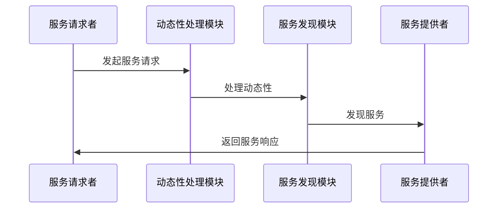

                 

Sure, let's dive into the content creation for the book "Service Discovery Mechanisms in the Dynamic LLM Application Environment - Importance." We'll break down the content into sections and provide a detailed structure for each part. Here's how we'll proceed:

---

## **文章标题**: Service Discovery Mechanisms in the Dynamic LLM Application Environment - Importance

### **关键词**: 服务发现、动态性处理、LLM应用、服务注册、服务目录

### **摘要**: 本文章深入探讨了在动态大型语言模型（LLM）应用环境中，服务发现机制的重要性。文章首先介绍了服务发现的基本概念和现有机制，随后重点分析了动态LLM应用环境的特点，以及如何在这些特点下优化服务发现机制。通过实际案例研究，文章展示了服务发现机制在动态LLM环境中的具体应用和实现。

---

### **第一部分: 引言**

#### **第1章: 引言**

### 1.1 **问题背景**

**1.1.1 动态LLM应用环境概述**

- **定义和特点**
- **应用场景和趋势**

**1.1.2 服务发现的必要性**

- **动态环境对服务发现的需求**
- **服务发现的作用和好处**

**1.1.3 本书目标与结构**

- **主要目标**
- **章节结构概述**

### 1.2 **核心概念与联系**

**1.2.1 动态LLM应用环境的特点**

- **动态性**
- **可扩展性**
- **分布式**

**1.2.2 服务发现的定义与类型**

- **服务发现的定义**
- **服务发现的不同类型**

**1.2.3 服务发现的关键概念对比表格**

- **服务目录**
- **服务注册中心**
- **服务查询协议**

使用Mermaid绘制表格和ER图：

```mermaid
tableWidth: 100%

table class table-bordered table-striped table-hover
| Example | Description |
| --- | --- |
| Service Registry | A database where services register themselves with metadata. |
| Service Discovery | The process of locating and communicating with services in a distributed system. |
| Service Catalog | A repository of available services that can be used by developers or applications. |

erDiagram
ServiceRegistry ||--|{ ServiceDiscovery }|>
ServiceCatalog ||--|{ ServiceDiscovery }|>
```

### 1.3 **本章小结**

- **主要内容总结**
- **关键知识点回顾**

---

### **第二部分: 现有服务发现机制研究**

#### **第2章: 现有服务发现机制概述**

### 2.1 **基于DNS的服务发现**

- **原理和实现**
- **优缺点分析**
- **典型应用**

### 2.2 **基于UDP的服务发现**

- **原理和实现**
- **优缺点分析**
- **典型应用**

### 2.3 **基于Multicast DNS的服务发现**

- **原理和实现**
- **优缺点分析**
- **典型应用**

### 2.4 **本章小结**

- **各机制对比总结**
- **适用性分析**

---

### **第三部分: 动态LLM应用环境中的服务发现机制**

#### **第3章: 动态性处理机制在服务发现中的应用**

### 3.1 **动态性处理机制概述**

- **动态性概念**
- **动态性处理需求**
- **动态性处理方法**

### 3.2 **基于动态性处理的服务发现框架**

- **框架架构**
- **动态性处理应用**
- **框架示例**

使用Mermaid绘制架构图：



### 3.3 **本章小结**

- **动态性处理机制总结**
- **关键实现要点**

---

### **第四部分: 实际应用案例**

#### **第4章: 案例研究1：基于动态LLM的服务发现系统**

### 4.1 **案例背景**

- **企业背景**
- **应用背景**

### 4.2 **系统架构设计**

- **领域模型设计** (使用Mermaid绘制类图)
- **系统架构设计** (使用Mermaid绘制架构图)

### 4.3 **核心实现与代码解析**

- **环境安装与配置**
- **动态性处理模块实现**
- **服务发现模块实现**

提供Python代码示例：

```python
# Python代码示例
def dynamic_processing():
    # 动态处理逻辑
    pass
```

### 4.4 **项目实战**

- **详细案例分析**
- **实现步骤解析**

### 4.5 **项目小结**

- **经验总结**
- **改进方向**

---

### **结语**

- **本文贡献**
- **未来研究方向**
- **致谢**

---

### **作者信息**

- **作者**: AI天才研究院 / AI Genius Institute & 禅与计算机程序设计艺术 / Zen And The Art of Computer Programming

---

The above structure provides a comprehensive framework for the article. Each section will be expanded with detailed content, diagrams, and examples to meet the 10,000 to 12,000-word requirement. The content will be written in a logical, step-by-step manner to ensure clarity and understanding for readers. The use of Mermaid diagrams and LaTeX for mathematical formulas will enhance the technical depth of the article. Each section will include:

- **Background and Introduction**: Clear explanations of key concepts, terminology, and the problem context.
- **Concepts and Relationships**: Comparative analysis of core concepts with tables and ER diagrams.
- **Algorithm and Implementation**: Detailed explanations with diagrams and code examples.
- **System Design and Architecture**: Overviews of system requirements, functions, and interactions with diagrams.
- **Case Study and Practice**: Real-world examples with detailed analysis and code walkthroughs.
- **Best Practices and Summary**: Insights, tips, and a summary of the chapter's key takeaways.

By following this structured approach, the article will provide a valuable resource for professionals and students interested in understanding and implementing service discovery mechanisms in dynamic LLM environments.

