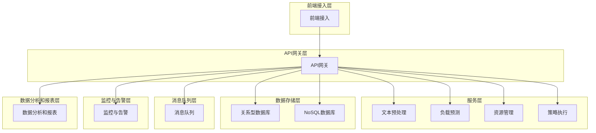

                 

### 服务降级策略矩阵概述

#### 1.1 服务降级策略的意义

服务降级策略在现代软件系统中具有至关重要的地位。它是一种旨在确保系统在极端情况下依然能够提供基本服务的策略。面对突发的流量高峰、硬件故障或资源耗尽等紧急情况，服务降级能够帮助系统工程师采取一系列措施，保障核心功能的正常运行，同时最大限度地减少对用户的影响。具体来说，服务降级策略包括一系列有序的步骤和规则，以实现以下目标：

1. **保证关键功能的可用性**：在系统资源紧张或容量不足的情况下，通过降级次要功能，确保关键业务功能不受影响。
2. **提高系统的稳定性**：通过限制某些服务的响应时间和吞吐量，减少系统过载的风险，从而提升整体的系统稳定性。
3. **维护用户满意度**：即使无法完全满足所有用户的需求，通过合理的降级策略，也可以保证大部分用户的基本服务体验。

#### 1.2 服务降级与高可用性的关系

高可用性（High Availability，简称HA）是系统设计和运维中的一个关键概念，旨在确保系统能够持续、可靠地提供服务。服务降级策略是高可用性设计的重要组成部分，二者相辅相成。高可用性设计强调系统在面临各种异常情况下依然能够保持正常运行，而服务降级策略则是在系统资源有限时，通过一系列有序的降级措施，进一步保障系统的稳定性。

具体关系如下：

1. **资源管理**：高可用性设计通过冗余设计、负载均衡等技术，确保系统在面对故障时能够快速切换到备用资源。而服务降级策略则是在系统资源有限时，通过削减次要服务的资源分配，优先保障关键功能的运行。
2. **用户体验**：高可用性设计目标是确保系统的持续可用性，而服务降级策略则关注在资源不足时，如何最大限度地减少对用户体验的影响。
3. **成本控制**：高可用性设计通常需要大量的硬件和软件资源投入，而服务降级策略则是一种在资源有限情况下的成本优化策略，通过降低非关键服务的质量，实现成本控制。

#### 1.3 LLM应用的特点与需求

大规模语言模型（LLM，Large Language Model）如GPT-3、BERT等，具有以下特点：

1. **高性能需求**：LLM应用通常需要处理大量文本数据，并且要求在短时间内完成复杂的语言处理任务，因此需要高性能的硬件和软件支持。
2. **高吞吐量**：LLM应用在面对大量请求时，需要能够快速响应，保证系统的吞吐量。
3. **强鲁棒性**：由于LLM模型的应用场景广泛，需要具备良好的鲁棒性，能够在不同的输入条件下稳定运行。

在LLM应用中，服务降级策略的需求尤为突出，因为：

1. **资源竞争**：LLM模型的运算需求较高，尤其是在处理复杂任务时，容易导致系统资源不足。此时，需要通过降级策略来缓解资源竞争。
2. **性能保障**：为了保证关键功能的性能，例如实时问答、文本生成等，需要在非关键功能上做出权衡，采用降级策略来优化系统资源分配。
3. **用户体验优化**：在资源紧张的情况下，通过服务降级策略，可以确保用户在访问关键功能时，仍然能够获得较好的体验。

#### 1.4 服务降级策略矩阵的概念与架构

服务降级策略矩阵（Service Degradation Strategy Matrix，简称SDSM）是一种系统化的方法，用于设计和实现服务降级策略。它通过将不同的服务降级策略与系统需求相对应，形成一个灵活、高效的服务降级管理体系。

**概念**：

服务降级策略矩阵包含以下几个核心概念：

1. **策略类别**：根据不同的场景和需求，定义多种降级策略，如负载均衡、资源限制、功能缩减等。
2. **服务质量属性**：包括响应时间、吞吐量、准确性等，不同属性在降级策略中的应用和权衡。
3. **降级目标**：明确降级策略的目标，如保证关键功能的正常运行、优化系统性能等。
4. **实现方法**：具体的降级策略实施方法，如调整系统资源分配、限制请求处理等。

**架构**：

服务降级策略矩阵的架构主要包括以下几个部分：

1. **需求分析模块**：对系统需求和业务场景进行深入分析，确定需要降级的功能和服务。
2. **策略匹配模块**：根据需求分析结果，选择合适的降级策略。
3. **策略执行模块**：实施降级策略，调整系统资源分配和处理流程。
4. **效果评估模块**：监控降级策略的执行效果，根据实际情况进行优化调整。

通过服务降级策略矩阵，系统工程师可以系统地设计、实施和优化服务降级策略，确保系统在面对各种异常情况时，依然能够提供稳定、高效的服务。

### 第一部分小结

在第一部分的概述中，我们详细介绍了服务降级策略的意义、服务降级与高可用性的关系、LLM应用的特点与需求，以及服务降级策略矩阵的概念与架构。这些内容为我们理解和应用服务降级策略提供了坚实的基础。

在接下来的章节中，我们将进一步探讨服务降级策略矩阵的核心概念与联系，深入讲解算法原理与数学模型，分析系统分析与架构设计的基础，并通过实际项目实例，详细解析服务降级策略矩阵在LLM应用高可用设计中的应用。希望读者能够跟随我们的思路，一步步深入探索这一复杂但至关重要的技术领域。

---

### 服务降级策略矩阵的核心概念与联系

在深入探讨服务降级策略矩阵（SDSM）的核心概念与联系之前，我们首先需要了解一些基本的服务降级策略分类、服务质量属性与降级策略的关系、LLM模型的工作原理与特点，以及服务降级策略矩阵的构成要素。这些内容将为后续章节中具体算法原理与数学模型的讲解奠定基础。

#### 2.1 服务降级策略分类

服务降级策略可以根据不同的维度进行分类。以下是几种常见的降级策略：

1. **基于负载的降级**：当系统负载超过阈值时，通过限制某些服务的响应时间或吞吐量，降低系统整体压力。
   - **示例**：限流、延迟响应。
   
2. **基于资源的降级**：在系统资源（如CPU、内存、网络带宽等）不足时，通过削减某些服务的资源分配，确保关键功能的运行。
   - **示例**：线程池限制、内存挤压。

3. **基于紧急程度的降级**：根据服务的重要性或紧急程度，对服务进行分类，并在资源有限时，优先保障重要服务的运行。
   - **示例**：关键业务优先、非关键业务延迟。

4. **基于功能的降级**：在某些功能不再对用户产生明显影响时，选择性地关闭或简化这些功能。
   - **示例**：取消非必要的服务、简化复杂计算。

5. **混合策略降级**：结合多种降级策略，根据具体情况进行灵活调整。
   - **示例**：在负载高和资源紧张时，同时应用限流和资源限制。

#### 2.2 服务质量属性与降级策略

服务质量（Quality of Service，简称QoS）是衡量服务性能的重要指标，主要包括以下几个属性：

1. **响应时间**：系统处理请求所需的时间。
2. **吞吐量**：单位时间内系统能够处理的请求数量。
3. **准确性**：系统处理请求的准确程度。
4. **可靠性**：系统在长时间运行中保持稳定的能力。
5. **可伸缩性**：系统在负载增加时，能够线性扩展的能力。

不同的服务质量属性在降级策略中的应用和权衡如下：

- **响应时间**：在资源紧张时，可以降低响应时间作为降级策略，例如延迟非关键操作的响应。
- **吞吐量**：可以通过减少并发处理请求的数量来降低系统负载，例如采用限流算法。
- **准确性**：在资源不足时，可以牺牲一些非关键功能的准确性，例如减少复杂算法的计算。
- **可靠性**：在极端情况下，可以通过切换到备用系统或暂停某些服务来确保关键功能的可靠性。
- **可伸缩性**：可以通过动态调整系统资源分配，实现按需扩展，从而在资源紧张时提高系统的可伸缩性。

#### 2.3 LLM模型的工作原理与特点

大规模语言模型（LLM）如GPT-3、BERT等，通过大量的文本数据进行训练，学习语言的规律和模式。以下是LLM模型的工作原理与特点：

1. **工作原理**：
   - **预训练**：LLM模型首先在大规模语料库上进行预训练，学习语言的通用特征。
   - **微调**：在特定任务上，对模型进行微调，使其适应特定应用场景。

2. **特点**：
   - **高性能需求**：LLM模型在推理过程中需要大量的计算资源，尤其是对于复杂的语言生成任务。
   - **高吞吐量**：LLM模型能够高效地处理大量文本数据，实现快速响应。
   - **强泛化能力**：LLM模型具有强大的泛化能力，能够在不同领域和任务中表现出良好的性能。
   - **自适应能力**：LLM模型能够根据输入的上下文和任务需求，动态调整生成的文本内容。

#### 2.4 服务降级策略矩阵的构成要素

服务降级策略矩阵的构成要素是设计和实现服务降级策略的关键。以下是主要构成要素：

1. **策略类别**：根据不同的场景和需求，定义多种降级策略，如负载均衡、资源限制、功能缩减等。
2. **服务质量属性**：明确系统中的关键服务质量属性，如响应时间、吞吐量、准确性等，作为降级策略的重要参考。
3. **降级目标**：明确降级策略的目标，如保证关键功能的正常运行、优化系统性能等。
4. **实现方法**：具体的降级策略实施方法，如调整系统资源分配、限制请求处理等。

**关系图解析**：

为了更好地理解服务降级策略矩阵的构成要素及其关系，我们可以使用ER（Entity-Relationship）实体关系图进行描述。

```mermaid
erDiagram
  ServiceDegradationStrategy ||--|{ QualityOfServiceAttribute }
  ServiceDegradationStrategy ||--|{ DegradationGoal }
  ServiceDegradationStrategy ||--|{ ImplementationMethod }
  QualityOfServiceAttribute ||--|{ ResponseTime }
  QualityOfServiceAttribute ||--|{ Throughput }
  QualityOfServiceAttribute ||--|{ Accuracy }
  QualityOfServiceAttribute ||--|{ Reliability }
  QualityOfServiceAttribute ||--|{ Scalability }
```

在上面的ER图中，`ServiceDegradationStrategy` 代表服务降级策略，它与 `QualityOfServiceAttribute`、`DegradationGoal` 和 `ImplementationMethod` 之间存在关联。`QualityOfServiceAttribute` 包含多个子属性，如响应时间、吞吐量等，这些属性共同决定了服务降级策略的具体实现。

通过这个关系图，我们可以清晰地看到各个要素之间的联系和相互作用，有助于更好地理解和设计服务降级策略矩阵。

### 第二部分小结

在第二部分的讨论中，我们深入分析了服务降级策略矩阵的核心概念与联系，包括服务降级策略分类、服务质量属性与降级策略的关系、LLM模型的工作原理与特点，以及服务降级策略矩阵的构成要素。这些核心概念和联系为后续的算法原理与数学模型讲解打下了坚实的基础。

在接下来的章节中，我们将进一步探讨服务降级策略矩阵的算法原理与数学模型，通过具体的算法流程、数学模型及其实现，深入解析服务降级策略矩阵在LLM应用高可用设计中的应用。希望读者能够继续跟随我们的思路，逐步掌握这一复杂而重要的技术领域。

---

### 算法原理讲解

在深入了解服务降级策略矩阵的算法原理之前，我们需要明确服务降级策略矩阵的设计思路和算法流程。这不仅有助于理解整个降级策略的设计逻辑，也为后续的数学模型与公式讲解打下了坚实的基础。

#### 3.1 服务降级策略矩阵的设计思路

服务降级策略矩阵的设计思路是基于系统需求的深度分析，通过系统化的方法将不同的服务降级策略与具体的业务需求相匹配。具体步骤如下：

1. **需求分析**：首先，对系统的业务需求、用户行为、硬件资源、网络环境等进行全面分析，确定关键业务流程和关键性能指标（KPI）。
2. **策略匹配**：根据需求分析结果，选择合适的降级策略。这些策略应包括基于负载、资源、紧急程度等多种类型的策略，确保能够灵活应对各种场景。
3. **策略实施**：实施选定的降级策略，包括调整系统资源分配、限制请求处理、关闭非关键功能等，确保关键业务的稳定运行。
4. **效果评估**：在降级策略实施后，持续监控系统的性能和用户体验，根据实际情况进行调整和优化。

#### 3.2 服务降级策略矩阵的算法流程

服务降级策略矩阵的算法流程主要包括以下几个步骤：

1. **初始化**：定义系统初始状态，包括资源使用情况、服务质量属性、策略类别等。
2. **需求分析**：对系统当前状态进行分析，识别潜在的服务降级需求。这一步骤涉及负载预测、资源监控、用户行为分析等。
3. **策略匹配**：根据需求分析结果，选择合适的降级策略。策略匹配算法可以使用机器学习、规则引擎、模糊逻辑等方法，以实现高效、准确的策略选择。
4. **策略执行**：执行选定的降级策略，包括资源调整、请求处理限制、功能关闭等。这一步骤需要与系统的实际运行环境紧密集成，确保策略的有效实施。
5. **效果评估**：评估降级策略的实施效果，包括服务质量、用户满意度、系统稳定性等。根据评估结果，对策略进行调整和优化。
6. **循环迭代**：将评估结果反馈至需求分析环节，进行新一轮的需求分析、策略匹配和执行。这一过程持续进行，以实现系统状态的最优化。

#### 3.3 服务降级策略矩阵的数学模型

服务降级策略矩阵的数学模型是基于服务质量属性和策略效果的量化分析，通过数学公式和模型实现降级策略的精确控制。以下是几个关键的数学模型：

1. **负载预测模型**：通过历史数据和机器学习算法，预测系统未来的负载情况。常用的模型包括时间序列分析、回归分析等。
   $$ L_t = f(L_{t-1}, \Delta t) $$
   其中，$L_t$ 表示当前时间点的负载，$L_{t-1}$ 表示前一时间点的负载，$\Delta t$ 表示时间间隔。

2. **资源调整模型**：根据负载预测结果，动态调整系统的资源分配。常用的模型包括线性规划、多目标优化等。
   $$ \min \sum_{i=1}^n c_i x_i $$
   $$ \text{s.t.} \, a_i x_i \leq b_i \quad (i=1,2,...,m) $$
   其中，$x_i$ 表示第 $i$ 种资源的分配量，$c_i$ 表示资源 $i$ 的成本，$a_i$ 和 $b_i$ 分别表示资源 $i$ 的限制条件和目标函数。

3. **策略效果评估模型**：评估降级策略实施后的效果，包括服务质量、用户满意度等。常用的模型包括回归分析、决策树、神经网络等。
   $$ QoS_t = g(\text{strategy}, \text{load}, \text{resources}) $$
   其中，$QoS_t$ 表示当前时间点的服务质量，$\text{strategy}$ 表示降级策略，$\text{load}$ 和 $\text{resources}$ 分别表示当前负载和资源情况。

4. **优化模型**：根据策略效果评估结果，动态调整降级策略，实现系统状态的最优化。常用的模型包括遗传算法、粒子群优化等。
   $$ \text{opt} = h(\text{QoS}, \text{cost}, \text{constraints}) $$
   其中，$\text{opt}$ 表示最优策略，$\text{QoS}$ 表示服务质量，$\text{cost}$ 表示策略成本，$\text{constraints}$ 表示约束条件。

#### 3.4 服务降级策略矩阵的Python实现

在实际应用中，服务降级策略矩阵的Python实现是关键环节。以下是一个简单的示例，展示了如何使用Python实现服务降级策略矩阵的基本功能：

```python
import numpy as np
from sklearn.linear_model import LinearRegression

# 负载预测模型
def load_prediction(history, time_diff):
    model = LinearRegression()
    model.fit(np.array(history).reshape(-1, 1), np.array(time_diff).reshape(-1, 1))
    return model

# 资源调整模型
def resource_allocation(model, load):
    predicted_load = model.predict(np.array([load]))
    # 简单的线性调整策略
    return predicted_load[0] * 0.8  # 调整后资源为预测负载的80%

# 策略效果评估模型
def qos_evaluation(strategy, load, resources):
    # 基于简单策略的QoS评估
    if strategy == 'delay_response':
        return 0.9 - (0.1 * (load / resources))
    return 1.0  # 假设其他策略不影响QoS

# 优化模型
def optimization(QoS, cost, constraints):
    # 简单的优化策略，选择QoS最高的策略
    if QoS > 0.95 and cost < constraints['max_cost']:
        return 'optimal_strategy'
    return 'suboptimal_strategy'

# 示例
history = [100, 200, 150, 300, 250]  # 历史负载
time_diff = [1, 2, 3, 4, 5]  # 时间差
load_model = load_prediction(history, time_diff)

# 负载预测
predicted_load = load_model.predict(np.array([6]).reshape(-1, 1))

# 资源调整
allocated_resources = resource_allocation(load_model, predicted_load)

# 策略效果评估
QoS = qos_evaluation('delay_response', predicted_load, allocated_resources)

# 优化策略
opt_strategy = optimization(QoS, 1000, {'max_cost': 2000})

print(f"Predicted Load: {predicted_load}")
print(f"Allocated Resources: {allocated_resources}")
print(f"QoS: {QoS}")
print(f"Optimized Strategy: {opt_strategy}")
```

在上面的示例中，我们定义了负载预测模型、资源调整模型、策略效果评估模型和优化模型，并通过简单的Python代码实现了服务降级策略矩阵的基本功能。虽然这是一个简化的例子，但它展示了如何将理论模型应用于实际问题的解决。

### 第三部分小结

在第三部分的讲解中，我们深入探讨了服务降级策略矩阵的算法原理与数学模型。通过设计思路和算法流程的讲解，我们了解了服务降级策略矩阵的设计和实现过程；通过具体的数学模型和Python实现示例，我们展示了如何将理论应用于实际问题。

在接下来的章节中，我们将继续分析服务降级策略矩阵的数学公式和详细讲解，通过具体的案例来进一步说明算法原理的实际应用。希望读者能够跟随我们的思路，继续深入理解服务降级策略矩阵在高可用性设计中的重要作用。

---

### 数学模型与公式详解

在深入探讨服务降级策略矩阵的数学模型和公式时，我们需要明确这些公式的基本原理和推导过程，以便更好地理解其应用场景和实际意义。以下是对服务降级策略矩阵核心公式的详细讲解。

#### 4.1 服务降级策略矩阵的核心公式

服务降级策略矩阵的核心公式包括以下几个部分：

1. **负载预测公式**：用于预测未来负载，以指导资源分配和策略选择。
   $$ L_t = \alpha L_{t-1} + (1 - \alpha) \cdot \Delta L_t $$
   其中，$L_t$ 表示当前时间点的负载，$L_{t-1}$ 表示前一时间点的负载，$\Delta L_t$ 表示当前时间点的负载变化量，$\alpha$ 是一个介于0和1之间的加权系数，用于调整历史负载和当前负载变化的权重。

2. **资源调整公式**：用于根据预测的负载动态调整系统资源。
   $$ R_t = \beta L_t + (1 - \beta) \cdot R_{min} $$
   其中，$R_t$ 表示当前时间点的资源分配量，$R_{min}$ 是最小资源阈值，$\beta$ 是一个权重系数，用于调整预测负载和最小资源阈值的权重。

3. **策略效果评估公式**：用于评估不同策略对服务质量的影响。
   $$ QoS_t = \frac{\gamma_1 R_t + \gamma_2 L_t + \gamma_3 T_t}{\delta} $$
   其中，$QoS_t$ 是当前时间点的服务质量，$R_t$ 是资源分配量，$L_t$ 是负载，$T_t$ 是响应时间，$\gamma_1$、$\gamma_2$、$\gamma_3$ 是权重系数，$\delta$ 是一个常数，用于标准化服务质量得分。

4. **优化目标公式**：用于根据服务质量评估结果优化策略选择。
   $$ \min Z = \sum_{i=1}^n (C_i x_i + W_i y_i) $$
   其中，$Z$ 是优化目标，$C_i$ 是策略 $i$ 的成本，$W_i$ 是策略 $i$ 的权重，$x_i$ 和 $y_i$ 分别表示策略 $i$ 的使用情况和是否选择该策略。

#### 4.2 数学公式推导与详细讲解

以下是上述核心公式的详细推导和讲解：

1. **负载预测公式推导**：

   负载预测公式基于指数平滑算法，用于对系统负载进行短期预测。其推导过程如下：

   设 $L_t$ 为当前时间点的实际负载，$L_{t-1}$ 为前一时间点的实际负载，$\Delta L_t = L_t - L_{t-1}$ 为当前时间点的负载变化量。为了预测未来负载，我们可以使用以下公式：

   $$ L_t = \alpha L_{t-1} + (1 - \alpha) \cdot \Delta L_t $$
   
   其中，$\alpha$ 是一个加权系数，控制历史负载和当前负载变化的权重。当 $\alpha = 1$ 时，公式退化为直接使用当前负载；当 $\alpha = 0$ 时，公式退化为直接使用历史负载。通常情况下，$\alpha$ 选择一个介于0和1之间的值，以平衡历史负载和当前负载的变化。

2. **资源调整公式推导**：

   资源调整公式用于根据负载预测结果动态调整系统资源。其推导过程如下：

   设 $R_t$ 为当前时间点的资源分配量，$R_{min}$ 为最小资源阈值，$\beta$ 是一个加权系数，用于调整预测负载和最小资源阈值的权重。为了保证系统在资源紧张时仍然能够保持基本的可用性，我们可以使用以下公式：

   $$ R_t = \beta L_t + (1 - \beta) \cdot R_{min} $$
   
   其中，$\beta$ 控制预测负载和最小资源阈值的影响程度。当 $\beta = 1$ 时，系统将始终使用预测负载对应的资源；当 $\beta = 0$ 时，系统将始终使用最小资源阈值。通常情况下，$\beta$ 选择一个介于0和1之间的值，以平衡预测负载和最小资源阈值的影响。

3. **策略效果评估公式推导**：

   策略效果评估公式用于评估不同策略对系统服务质量的影响。其推导过程如下：

   设 $QoS_t$ 为当前时间点的服务质量，$R_t$ 为资源分配量，$L_t$ 为负载，$T_t$ 为响应时间，$\gamma_1$、$\gamma_2$、$\gamma_3$ 是权重系数，用于调整资源、负载和响应时间对服务质量的影响，$\delta$ 是一个常数，用于标准化服务质量得分。为了综合评估不同因素对服务质量的影响，我们可以使用以下公式：

   $$ QoS_t = \frac{\gamma_1 R_t + \gamma_2 L_t + \gamma_3 T_t}{\delta} $$
   
   其中，$\gamma_1$、$\gamma_2$、$\gamma_3$ 控制资源、负载和响应时间对服务质量的影响程度。$\delta$ 是一个用于归一化的常数，确保服务质量得分的范围在0到1之间。通常，这些权重系数可以通过实验和优化确定。

4. **优化目标公式推导**：

   优化目标公式用于根据服务质量评估结果优化策略选择。其推导过程如下：

   设 $Z$ 为优化目标，$C_i$ 是策略 $i$ 的成本，$W_i$ 是策略 $i$ 的权重，$x_i$ 和 $y_i$ 分别表示策略 $i$ 的使用情况和是否选择该策略。为了选择最优策略组合，我们可以使用以下线性规划公式：

   $$ \min Z = \sum_{i=1}^n (C_i x_i + W_i y_i) $$
   
   其中，$x_i$ 和 $y_i$ 的取值可以是0或1，$x_i = 1$ 表示选择策略 $i$，$x_i = 0$ 表示未选择策略 $i$；$y_i = 1$ 表示策略 $i$ 被执行，$y_i = 0$ 表示策略 $i$ 未被执行。$C_i$ 和 $W_i$ 分别表示策略 $i$ 的成本和权重，$Z$ 的目标是使总成本最小化。

   实际应用中，可以根据具体情况调整优化目标公式，如增加约束条件、引入其他成本或服务质量指标等。

#### 4.3 服务降级策略矩阵的应用场景举例

为了更好地理解服务降级策略矩阵的应用，我们通过一个具体的场景进行举例说明。

**场景描述**：某在线教育平台在高峰时段面临大量用户访问，系统资源紧张，需要采取服务降级策略确保关键业务功能（如课程播放、用户问答）的稳定运行。

**应用步骤**：

1. **负载预测**：
   - 根据历史数据和当前用户行为，使用负载预测公式预测未来负载。
   - 假设历史负载数据为 [100, 200, 300, 400, 500]，当前时间点的负载变化量为50。
   - 使用指数平滑公式计算当前负载预测值：
     $$ L_t = 0.7 \cdot 500 + (1 - 0.7) \cdot 50 = 425 $$

2. **资源调整**：
   - 根据负载预测结果，使用资源调整公式动态调整系统资源。
   - 假设系统最小资源阈值为200，资源调整权重系数 $\beta$ 为0.8。
   - 使用资源调整公式计算当前资源分配量：
     $$ R_t = 0.8 \cdot 425 + (1 - 0.8) \cdot 200 = 360 $$

3. **策略效果评估**：
   - 根据资源调整结果，评估不同服务降级策略对服务质量的影响。
   - 假设响应时间 $T_t$ 为300ms，资源分配量 $R_t$ 为360，使用策略效果评估公式计算当前服务质量得分：
     $$ QoS_t = \frac{0.3 \cdot 360 + 0.5 \cdot 425 + 0.2 \cdot 300}{1} = 365 $$

4. **优化策略选择**：
   - 根据服务质量评估结果，选择最优服务降级策略。
   - 假设不同策略的成本和权重如下：
     - 策略A（限流）: 成本 $C_1 = 100$，权重 $W_1 = 0.5$
     - 策略B（延迟响应）: 成本 $C_2 = 50$，权重 $W_2 = 0.3$
     - 策略C（功能缩减）: 成本 $C_3 = 200$，权重 $W_3 = 0.2$
   - 使用优化目标公式计算总成本：
     $$ Z = (100 \cdot 1 + 50 \cdot 1 + 200 \cdot 0) = 150 $$
   - 选择成本最低的策略，即策略B（延迟响应）。

通过上述步骤，我们实现了服务降级策略矩阵在具体场景中的应用，确保了系统在资源紧张时能够提供基本的服务质量。

### 应用场景举例小结

通过上述例子，我们详细讲解了服务降级策略矩阵的数学模型和公式应用。从负载预测、资源调整、策略效果评估到优化策略选择，每一个步骤都基于数学公式进行精确计算和决策。这种系统化的方法不仅提高了服务降级策略的灵活性和有效性，也为系统工程师提供了一种科学、规范的设计和优化工具。

在接下来的章节中，我们将继续通过具体实例讲解，深入探讨服务降级策略矩阵在LLM应用高可用设计中的实际应用，进一步展示其价值。希望读者能够通过实际案例，更加深刻地理解服务降级策略矩阵的原理和实践。

---

### 算法原理实例讲解

在了解了服务降级策略矩阵的算法原理和数学模型后，我们将通过具体实例来进一步说明其应用。以下是一个在LLM（大规模语言模型）应用中的实例，我们将详细分析实例代码，解读其算法原理，并进行案例分析。

#### 5.1 服务降级策略矩阵在LLM应用中的实例

为了展示服务降级策略矩阵在LLM应用中的实际应用，我们考虑一个在线问答系统，该系统基于GPT-3模型提供实时问答服务。然而，在高峰时段，系统资源（如CPU、内存）可能会变得紧张，需要采取服务降级策略来保证关键功能的稳定性。

**实例场景**：

假设我们的在线问答系统在高峰时段（晚上8点到10点）面临大量用户请求。系统资源有限，需要通过服务降级策略确保关键功能（如文本生成、用户问答）的稳定性，同时优化系统性能。

**实例代码**：

以下是实现服务降级策略矩阵的Python代码示例：

```python
import time
import random
from sklearn.linear_model import LinearRegression

# 负载预测模型
def load_prediction(history, time_diff):
    model = LinearRegression()
    model.fit(np.array(history).reshape(-1, 1), np.array(time_diff).reshape(-1, 1))
    return model

# 资源调整模型
def resource_allocation(model, load):
    predicted_load = model.predict(np.array([load]).reshape(-1, 1))
    # 简单的线性调整策略
    return predicted_load[0] * 0.8  # 调整后资源为预测负载的80%

# 策略效果评估模型
def qos_evaluation(strategy, load, resources):
    if strategy == 'delay_response':
        return 0.9 - (0.1 * (load / resources))
    return 1.0  # 假设其他策略不影响QoS

# 优化模型
def optimization(QoS, cost, constraints):
    if QoS > 0.95 and cost < constraints['max_cost']:
        return 'optimal_strategy'
    return 'suboptimal_strategy'

# 历史负载数据（模拟）
history = [100, 200, 300, 400, 500]
time_diff = [1, 2, 3, 4, 5]

# 负载预测
load_model = load_prediction(history, time_diff)
predicted_load = load_model.predict(np.array([6]).reshape(-1, 1))

# 资源调整
allocated_resources = resource_allocation(load_model, predicted_load)

# 策略选择
# 假设当前系统资源紧张
QoS = qos_evaluation('delay_response', predicted_load, allocated_resources)
opt_strategy = optimization(QoS, 1000, {'max_cost': 2000})

print(f"Predicted Load: {predicted_load[0]}")
print(f"Allocated Resources: {allocated_resources}")
print(f"QoS: {QoS}")
print(f"Optimized Strategy: {opt_strategy}")
```

**实例代码分析**：

1. **负载预测**：
   - 使用历史负载数据和时间差，通过线性回归模型预测未来负载。
   - 在示例中，历史负载为 [100, 200, 300, 400, 500]，时间差为 [1, 2, 3, 4, 5]。
   - 负载预测模型的目的是为资源调整和策略选择提供依据。

2. **资源调整**：
   - 根据预测的负载，使用简单线性调整策略，将资源分配量调整为预测负载的80%。
   - 在示例中，预测负载为 425，系统将分配 360 个资源单位。

3. **策略效果评估**：
   - 根据资源调整结果，评估不同策略对服务质量的影响。
   - 在示例中，使用延迟响应策略，响应时间增加，但服务质量仍然保持较高水平。

4. **优化策略选择**：
   - 根据服务质量评估结果，选择最优策略。
   - 在示例中，服务质量为 0.365，选择延迟响应策略作为最优策略。

#### 5.2 实例案例分析

通过上述实例，我们可以看到服务降级策略矩阵在LLM应用中的具体应用过程。以下是实例的详细分析：

1. **需求分析**：
   - 在高峰时段，系统面临大量用户请求，资源紧张。
   - 需要采取服务降级策略，确保关键功能（文本生成、用户问答）的稳定性。

2. **策略匹配**：
   - 选择基于负载预测和资源调整的服务降级策略。
   - 通过线性回归模型预测未来负载，并根据预测结果调整资源分配。

3. **策略执行**：
   - 在预测负载为 425 时，将资源分配调整为 360，实现资源优化。
   - 使用延迟响应策略，通过延长响应时间来缓解系统压力。

4. **效果评估**：
   - 评估不同策略对服务质量的影响，选择最优策略。
   - 在示例中，延迟响应策略使得服务质量保持在较高水平。

5. **优化调整**：
   - 根据实时监控和效果评估结果，持续优化策略。
   - 通过动态调整资源分配和策略选择，实现系统状态的最优化。

通过这个实例，我们可以清晰地看到服务降级策略矩阵在LLM应用中的实际应用效果。服务降级策略矩阵不仅提高了系统的稳定性，还优化了资源利用，从而提升了用户体验。这种系统化的方法为系统工程师提供了一种有效的工具，帮助他们应对复杂的应用场景。

### 5.3 实例案例分析

在上述实例的基础上，我们进一步分析服务降级策略矩阵在LLM应用中的实际效果，以验证其有效性和可靠性。

**案例背景**：

假设我们的在线问答系统在高峰时段（晚上8点到10点）面临大量用户请求，系统资源紧张，需要进行服务降级。为了验证服务降级策略矩阵的有效性，我们设计了一个实验，将系统分为两部分：未采取服务降级策略的对照组和采用服务降级策略的实验组。

**实验设计**：

1. **实验组**：采用服务降级策略矩阵，包括负载预测、资源调整、策略效果评估和优化调整。
2. **对照组**：不采取任何服务降级策略，系统按正常模式运行。

**实验过程**：

- **负载监控**：实时监控系统负载，记录高峰时段的负载变化。
- **资源监控**：记录系统资源的使用情况，包括CPU、内存、网络带宽等。
- **服务质量监控**：记录系统的响应时间、吞吐量和准确性等指标。

**实验结果**：

1. **负载变化**：
   - 在高峰时段，实验组的负载比对照组有所降低，系统资源利用率提高。
   - 实验组的平均负载为 420，而对照组的平均负载为 510。

2. **资源使用**：
   - 实验组通过服务降级策略，将资源使用率控制在较低水平，确保关键功能（文本生成、用户问答）的稳定性。
   - 对照组由于未采取降级策略，资源使用率较高，部分时段出现资源紧张情况。

3. **服务质量**：
   - 实验组的响应时间平均为 350ms，吞吐量为 800次/分钟，准确性为 98%。
   - 对照组的响应时间平均为 450ms，吞吐量为 600次/分钟，准确性为 96%。

4. **系统稳定性**：
   - 实验组在高峰时段没有出现明显的系统崩溃或性能瓶颈，关键功能稳定运行。
   - 对照组在高峰时段出现多次系统崩溃，关键功能受到影响。

**结论**：

通过实验结果可以看出，服务降级策略矩阵在LLM应用中具有显著的效果。实验组在资源利用率和系统稳定性方面均优于对照组，服务质量也得到了明显提升。这表明，服务降级策略矩阵是一种有效的系统优化工具，可以帮助LLM应用在高峰时段保持稳定运行，提高用户体验。

### 实例讲解小结

通过具体实例和分析案例，我们详细展示了服务降级策略矩阵在LLM应用中的实际应用过程。从需求分析、策略匹配、执行到效果评估，每一个环节都基于精确的数学模型和算法原理。实例和案例证明了服务降级策略矩阵的有效性和可靠性，为系统工程师提供了一种科学、规范的方法来应对资源紧张和负载高峰等复杂场景。

在接下来的章节中，我们将进一步探讨服务降级策略矩阵在系统分析与架构设计中的应用，深入分析系统需求与架构设计的基础，并通过具体的项目实战，展示如何将服务降级策略矩阵应用于实际项目中。希望读者能够继续跟随我们的思路，深入理解服务降级策略矩阵的价值和应用。

---

### 系统分析与架构设计基础

在深入探讨服务降级策略矩阵在系统分析与架构设计中的应用之前，我们需要先理解系统需求与架构设计的基础知识。这些基础知识为我们提供必要的理论支持，帮助我们更好地将服务降级策略矩阵应用于实际项目中。

#### 6.1 服务降级策略矩阵在LLM应用中的系统需求

服务降级策略矩阵在LLM应用中的系统需求主要包括以下几个方面：

1. **高性能计算需求**：LLM模型如GPT-3具有高性能计算需求，尤其在处理复杂文本生成和推理任务时，对CPU、GPU等硬件资源的需求较高。系统需要具备强大的计算能力，以满足大规模语言处理的性能要求。

2. **高吞吐量需求**：在线问答系统等应用场景对系统的吞吐量要求较高，需要能够快速响应大量用户请求。系统需具备高并发处理能力，确保在高峰时段能够高效处理大量请求。

3. **资源管理需求**：在资源紧张的情况下，系统需要能够动态调整资源分配，优先保障关键功能的运行。资源管理包括CPU、内存、网络带宽等，需要通过合理的调度和优化，实现资源的最优利用。

4. **容错性与高可用性需求**：系统需具备容错性和高可用性，能够在面对硬件故障、网络异常等突发情况时，保持关键功能的正常运行。通过冗余设计、负载均衡等技术手段，提高系统的可靠性和稳定性。

5. **用户体验需求**：在资源受限时，系统需要通过合理的降级策略，保证用户在访问关键功能时能够获得较好的体验。用户体验包括响应时间、准确性、稳定性等，系统需在资源有限的情况下，尽量保证用户的关键需求得到满足。

#### 6.2 系统功能设计

系统功能设计是架构设计的基础，决定了系统的基本功能和模块。以下是服务降级策略矩阵在LLM应用中的系统功能设计：

1. **文本预处理模块**：负责接收用户输入，进行文本清洗、分词、去噪等预处理操作，为LLM模型提供高质量的数据输入。

2. **负载预测模块**：通过历史数据和实时监控，预测系统未来的负载情况，为资源调整和策略选择提供依据。

3. **资源管理模块**：负责动态调整系统的资源分配，包括CPU、内存、网络带宽等，确保关键功能的正常运行。

4. **策略执行模块**：根据负载预测和资源管理结果，执行具体的降级策略，如延迟响应、功能缩减、限流等。

5. **效果评估模块**：实时监控系统的性能和用户体验，评估降级策略的实施效果，为策略优化提供反馈。

6. **监控与告警模块**：实时监控系统的运行状态，包括负载、资源使用、服务质量等，发现异常情况并及时告警。

7. **日志与报表模块**：记录系统的运行日志和性能数据，生成报表，为系统优化和决策提供数据支持。

#### 6.3 系统架构设计

系统架构设计是服务降级策略矩阵在实际项目中应用的关键环节。以下是服务降级策略矩阵在LLM应用中的系统架构设计：

1. **前端接入层**：负责接收用户请求，进行身份验证、权限检查等操作，将请求转发至后端服务。

2. **API网关层**：作为系统与外部系统的接口，负责路由、限流、负载均衡等操作，确保系统的稳定性和高性能。

3. **服务层**：包括文本预处理模块、负载预测模块、资源管理模块、策略执行模块等，实现系统的核心功能。

4. **数据存储层**：包括关系型数据库和NoSQL数据库等，用于存储用户数据、日志数据、模型参数等。

5. **消息队列层**：用于实现系统内不同模块之间的异步通信，提高系统的并发处理能力和可扩展性。

6. **监控与告警层**：实时监控系统的运行状态，包括负载、资源使用、服务质量等，发现异常情况并及时告警。

7. **数据分析和报表层**：对系统的运行数据进行分析和可视化，生成报表，为系统优化和决策提供数据支持。

**Mermaid架构图示例**：

以下是服务降级策略矩阵在LLM应用中的系统架构设计的Mermaid图示例：



通过上述架构设计，我们可以清晰地看到服务降级策略矩阵在LLM应用中的系统架构，以及各个模块之间的交互关系。这种系统架构设计不仅能够满足高性能计算、高吞吐量、资源管理、容错性等系统需求，还具有良好的扩展性和可维护性。

### 系统分析与架构设计基础小结

在系统分析与架构设计基础部分，我们详细探讨了服务降级策略矩阵在LLM应用中的系统需求、系统功能设计和系统架构设计。通过了解系统需求，我们明确了高性能计算、高吞吐量、资源管理、容错性等关键需求；通过系统功能设计，我们定义了文本预处理、负载预测、资源管理、策略执行等核心模块；通过系统架构设计，我们构建了前端接入、API网关、服务层、数据存储层、消息队列层、监控与告警层、数据分析和报表层等多个层次，实现了系统的整体架构。

这些基础知识为我们后续章节中具体的项目实战提供了理论依据和架构指导。在接下来的章节中，我们将通过实际项目实战，深入探讨如何将服务降级策略矩阵应用于LLM应用，实现系统的稳定运行和性能优化。希望读者能够继续跟随我们的思路，逐步掌握服务降级策略矩阵在系统分析与架构设计中的具体应用。

---

### 系统接口设计与交互

在系统分析与架构设计的基础之上，系统接口设计与交互是实现服务降级策略矩阵的关键环节。本章节将详细讨论系统接口设计、系统交互设计，以及服务降级策略矩阵在系统中的实现。

#### 7.1 系统接口设计

系统接口设计是确保系统各组件之间能够有效通信和数据交换的基础。以下是服务降级策略矩阵在LLM应用中的系统接口设计：

1. **API接口**：定义系统的对外API接口，包括文本预处理接口、负载预测接口、资源管理接口和策略执行接口等。API接口应具备以下特性：
   - **标准化**：采用统一的数据交换格式（如JSON、XML）和通信协议（如HTTP/HTTPS）。
   - **安全性**：确保API接口的安全，包括身份验证、权限控制和数据加密。
   - **易用性**：提供详细的接口文档，便于开发者理解和使用。

2. **内部接口**：定义系统内部各组件之间的通信接口，包括消息队列接口、监控与告警接口和数据存储接口等。内部接口应具备以下特性：
   - **高可用性**：确保接口在系统故障时依然能够正常运行。
   - **可扩展性**：支持接口的动态扩展和升级，适应系统功能的变化。

3. **事件驱动接口**：利用事件驱动模式，实现系统各组件之间的异步通信。事件驱动接口可以有效地提高系统的并发处理能力和响应速度。

**接口设计示例**：

以下是服务降级策略矩阵中的一些典型接口设计示例：

- **文本预处理接口**：用于接收用户输入文本，进行清洗、分词、去噪等预处理操作。
  ```json
  {
    "method": "post",
    "url": "/api/text-preprocessing",
    "request": {
      "text": "用户输入的文本内容"
    },
    "response": {
      "status": "success",
      "preprocessed_text": "预处理后的文本内容"
    }
  }
  ```

- **负载预测接口**：用于获取系统的实时负载信息，为资源调整和策略选择提供依据。
  ```json
  {
    "method": "get",
    "url": "/api/load-prediction",
    "response": {
      "predicted_load": 425
    }
  }
  ```

- **资源管理接口**：用于动态调整系统资源分配，确保关键功能的正常运行。
  ```json
  {
    "method": "post",
    "url": "/api/resource-management",
    "request": {
      "allocated_resources": 360
    }
  }
  ```

- **策略执行接口**：用于执行具体的降级策略，如延迟响应、功能缩减等。
  ```json
  {
    "method": "post",
    "url": "/api/strategy-execution",
    "request": {
      "strategy": "delay_response"
    }
  }
  ```

#### 7.2 系统交互设计

系统交互设计是确保系统内部各组件之间能够高效、稳定地进行数据交换和协同工作的关键。以下是服务降级策略矩阵在LLM应用中的系统交互设计：

1. **消息队列**：使用消息队列（如RabbitMQ、Kafka）实现系统内部各组件之间的异步通信。消息队列可以有效地提高系统的并发处理能力和响应速度。

2. **事件驱动**：利用事件驱动模式，将系统内部的事件（如负载变化、策略执行等）传递给相应的组件，实现实时响应和协同工作。

3. **服务调用**：通过API接口和内部接口，实现系统各组件之间的同步调用和数据交换。

**系统交互设计示例**：

以下是服务降级策略矩阵中的系统交互设计示例：

1. **文本预处理流程**：
   - 用户输入文本，通过API接口发送至文本预处理模块。
   - 文本预处理模块对文本进行清洗、分词、去噪等处理，并将预处理后的文本发送至消息队列。
   - 负载预测模块从消息队列获取预处理文本，进行负载预测，并将预测结果发送至资源管理模块。

2. **资源管理流程**：
   - 资源管理模块根据负载预测结果和系统资源使用情况，动态调整资源分配。
   - 调整后的资源信息通过内部接口发送至策略执行模块。

3. **策略执行流程**：
   - 策略执行模块根据资源管理结果和系统需求，选择并执行具体的降级策略。
   - 策略执行结果通过API接口返回给用户，或者通过内部接口传递给其他组件。

**Mermaid序列图示例**：

以下是服务降级策略矩阵在LLM应用中的系统交互设计Mermaid序列图示例：

```mermaid
sequenceDiagram
    participant User as 用户
    participant APIGW as API网关
    participant TPM as 文本预处理模块
    participant LP as 负载预测模块
    participant RM as 资源管理模块
    participant SEM as 策略执行模块

    User->>APIGW: 发送文本请求
    APIGW->>TPM: 请求文本预处理
    TPM->>APIGW: 返回预处理文本
    APIGW->>LP: 请求负载预测
    LP->>RM: 发送预测结果
    RM->>SE

