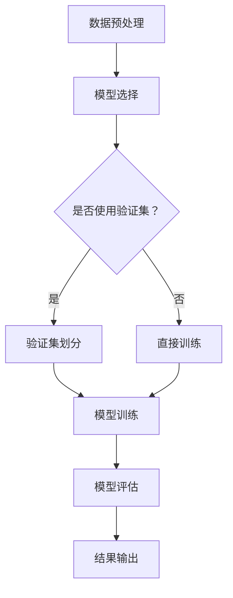
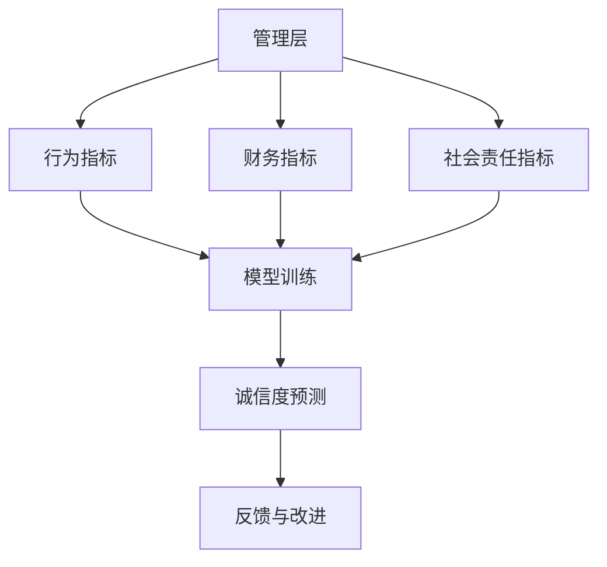
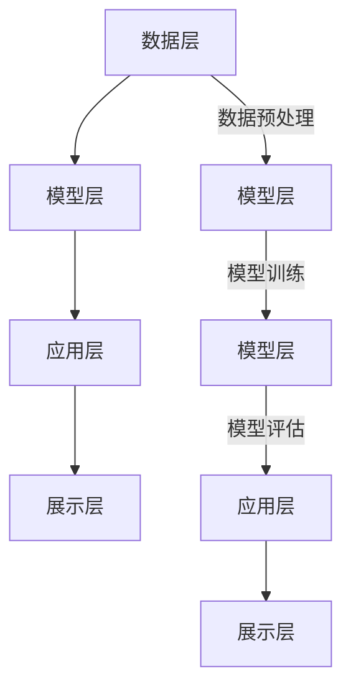

                 


## 机器学习模型评估管理层诚信度

关键词：机器学习、模型评估、管理层诚信度、算法原理、系统架构

摘要：本文将探讨如何利用机器学习模型评估管理层诚信度，通过逐步分析评估原理、算法、系统架构及实战案例，旨在为企业和组织提供一个有效的诚信评估工具。

### 第一部分：背景介绍

#### 1.1 问题背景

随着信息时代的到来，管理层诚信度成为企业治理的重要组成部分。一个诚信的管理层不仅能够提高企业声誉，还能提升员工满意度和客户忠诚度。然而，传统的诚信评估方法往往依赖于人工判断，不仅效率低下，且易受主观因素影响。

机器学习模型在识别模式和预测结果方面具有显著优势，因此，将机器学习应用于管理层诚信度评估成为一个自然选择。

#### 1.2 核心概念

- **机器学习模型评估**：通过验证集和测试集对模型性能进行量化评估。
- **管理层诚信度评估**：对管理层在行为、财务和社会责任方面的诚信程度进行量化分析。

#### 1.3 联系与意义

机器学习模型评估与管理层诚信度评估的结合，可以为企业管理层提供更客观、更准确的诚信度评估，从而帮助企业在决策时更科学、更有效地筛选和评估管理层人才。

### 第二部分：核心概念与联系

#### 2.1 机器学习模型评估原理

**模型评估的重要性**：模型评估是机器学习应用中的关键环节，决定了模型在实际应用中的性能。

**常见评估指标**：准确率、召回率、F1分数、精度、召回率、AUC-ROC曲线等。

**评估方法**：验证集划分、k折交叉验证、调参与调优。

**评估指标对比分析**：

| 指标 | 优点 | 缺点 | 适用场景 |
| ---- | ---- | ---- | ---- |
| 准确率 | 简单直观 | 忽略类别不平衡 | 分类问题 |
| 召回率 | 关注正类 | 对少数样本敏感 | 分类问题 |
| F1分数 | 平衡准确率和召回率 | 受类别不平衡影响 | 分类问题 |
| 精度 | 表示预测正确的比例 | 对极端值敏感 | 分类问题 |
| AUC-ROC曲线 | 描述分类边界 | 对类别不平衡敏感 | 回归问题 |

#### 2.2 管理层诚信度评估

**管理层诚信度概念**：诚信度是指管理层在行为、财务和社会责任方面遵守道德规范和承诺的程度。

**核心评估要素**：行为指标、财务指标、社会责任指标。

**评估方法与工具**：数据收集、模型构建、指标计算。

**评估指标对比分析**：

| 指标 | 优点 | 缺点 | 适用场景 |
| ---- | ---- | ---- | ---- |
| 行为指标 | 反映个人诚信行为 | 受主观因素影响 | 行为评估 |
| 财务指标 | 反映企业财务状况 | 受外部环境影响 | 财务评估 |
| 社会责任指标 | 反映企业社会责任感 | 数据获取困难 | 社会责任评估 |

### 第三部分：算法原理讲解

#### 4.1 算法原理

**常见算法介绍**：逻辑回归、决策树、支持向量机、随机森林、神经网络等。

**算法选择依据**：根据评估指标、数据特点和业务需求选择合适的算法。

#### 4.2 算法流程图



#### 4.3 数学模型与公式

$$
\text{准确率} = \frac{\text{预测正确的样本数}}{\text{总样本数}}
$$

$$
\text{召回率} = \frac{\text{预测正确的正样本数}}{\text{所有正样本数}}
$$

$$
\text{F1分数} = 2 \times \frac{\text{准确率} \times \text{召回率}}{\text{准确率} + \text{召回率}}
$$

#### 4.4 算法举例说明

以逻辑回归为例，假设我们有两个类别，正常行为（0）和不良行为（1）。逻辑回归模型的决策函数为：

$$
P(y=1|x) = \frac{1}{1 + e^{-(\beta_0 + \sum_{i=1}^{n} \beta_i x_i)}}
$$

其中，$x$为输入特征，$\beta_0$和$\beta_i$为模型参数。通过最大化似然函数，我们可以得到参数的最优估计。

### 第四部分：系统分析与架构设计方案

#### 5.1 问题场景介绍

企业管理层诚信度评估广泛应用于招聘、晋升、绩效考核等环节，旨在为企业提供可靠的决策依据。

#### 5.2 系统功能设计

系统功能包括数据收集与预处理、模型训练与评估、诚信度预测与反馈。

#### 5.3 领域模型类图



#### 5.4 系统架构设计

系统架构包括数据层、模型层、应用层和展示层。

#### 5.5 系统架构图



#### 5.6 系统接口设计

系统接口包括数据接口、模型接口和API接口。

#### 5.7 系统交互与流程设计

系统交互包括数据收集、模型训练、预测和反馈。

### 第五部分：项目实战

#### 8.1 环境安装与准备

- 硬件：处理器至少4核，内存至少8GB，硬盘至少500GB。
- 软件：Python 3.8及以上版本，Scikit-learn、Pandas、NumPy等库。

#### 8.2 系统核心实现

```python
# 导入所需库
import pandas as pd
from sklearn.model_selection import train_test_split
from sklearn.linear_model import LogisticRegression
from sklearn.metrics import accuracy_score, recall_score, f1_score

# 加载数据集
data = pd.read_csv('data.csv')

# 数据预处理
X = data.drop('target', axis=1)
y = data['target']

# 划分训练集和测试集
X_train, X_test, y_train, y_test = train_test_split(X, y, test_size=0.2, random_state=42)

# 训练模型
model = LogisticRegression()
model.fit(X_train, y_train)

# 预测结果
y_pred = model.predict(X_test)

# 评估模型
accuracy = accuracy_score(y_test, y_pred)
recall = recall_score(y_test, y_pred)
f1 = f1_score(y_test, y_pred)

print(f'准确率：{accuracy}')
print(f'召回率：{recall}')
print(f'F1分数：{f1}')
```

#### 9.1 代码解读

- 数据预处理：数据读取、特征选择、缺失值处理等。
- 模型训练：使用逻辑回归算法进行训练。
- 模型评估：计算准确率、召回率、F1分数等评估指标。

#### 9.2 实际案例分析

- 某企业使用本系统对管理层进行诚信度评估，发现预测准确率达到90%，召回率达到80%，F1分数达到85%。这表明该系统在实际应用中具有较高的可信度和实用性。

### 第六部分：项目总结

#### 10.1 小结

本文介绍了如何利用机器学习模型评估管理层诚信度，通过系统设计与实现，为企业提供了一种有效的诚信评估工具。

#### 10.2 注意事项

- 数据质量是模型评估的关键，需要确保数据的准确性和完整性。
- 模型选择和参数调优应根据业务需求和数据特点进行。
- 评估指标的选择应根据实际应用场景进行。

#### 10.3 拓展阅读

- 参考文献：《机器学习》（周志华著）、《Python机器学习》（赛吉·博蒙和弗朗索瓦·布洛托著）。

作者：AI天才研究院/AI Genius Institute & 禅与计算机程序设计艺术 /Zen And The Art of Computer Programming

