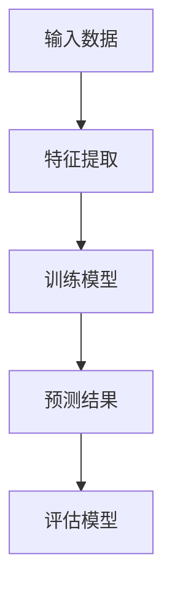
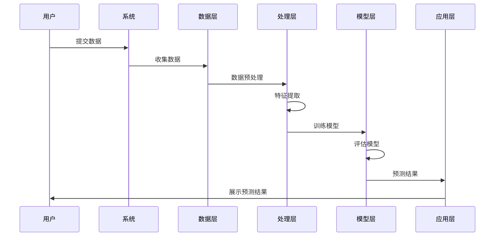

                 


### 1.1 背景介绍

#### 问题背景

在当今的商业环境中，数据已经成为一种宝贵的资源。随着大数据、云计算和人工智能技术的快速发展，企业可以通过收集和分析大量的数据来获得深层次的市场洞察和决策支持。这种转变促使企业竞争从传统的资源、成本和效率等维度，逐步转向数据驱动的智能决策和创新能力的竞争。

机器学习作为人工智能的核心技术，具备从数据中自动学习规律、发现知识的能力，使其成为企业提升竞争优势的重要工具。通过机器学习，企业可以优化产品定价、预测市场趋势、分析客户行为、提升供应链效率，从而实现精细化管理和高效运营。

#### 问题描述

本章节的目的在于探讨如何通过机器学习技术来辅助公司进行竞争优势分析，实现数据驱动的战略决策。具体问题如下：

1. **机器学习的基本原理和常用算法有哪些？**
2. **机器学习在不同业务场景中的应用案例是什么？**
3. **如何将机器学习技术整合到企业的战略决策过程中？**
4. **机器学习技术对提高公司竞争优势的具体影响是什么？**

#### 问题解决

本书将从以下几个方面展开讨论：

1. **介绍机器学习的基本原理和常用算法**：涵盖监督学习、无监督学习和强化学习的基本概念和应用场景。
2. **分析机器学习在不同业务场景中的应用案例**：通过具体案例展示机器学习在市场预测、产品定价、客户行为分析、供应链优化等方面的应用。
3. **探讨如何将机器学习技术整合到企业的战略决策过程中**：介绍如何构建机器学习应用流程，以及如何利用机器学习技术支持企业的战略规划。
4. **分析机器学习技术对提高公司竞争优势的具体影响**：探讨机器学习技术如何帮助企业降低成本、提高效率、创造新的商业模式，从而增强市场竞争力。

#### 边界与外延

1. **本书主要讨论监督学习和无监督学习在商业应用中的实践**：虽然深度学习和强化学习在机器学习中具有重要地位，但本书将不涉及这些复杂算法的详细技术实现。
2. **关注的是机器学习对企业战略决策的辅助作用**：本书的重点在于如何利用机器学习技术支持企业的战略规划和运营决策，而非算法本身的技术细节。
3. **主要关注企业内部的业务场景**：虽然机器学习技术在企业外部也有广泛应用，如市场分析、客户关系管理等，但本书将主要聚焦于企业内部的业务流程优化和决策支持。

### 1.2 核心概念与联系

在探讨如何通过机器学习提升公司竞争优势之前，我们需要明确几个核心概念及其相互之间的关系。

#### 核心概念

**机器学习**：一种使计算机系统能够从数据中学习并做出决策的技术。主要分为监督学习、无监督学习和强化学习。

**竞争优势**：公司相对于竞争对手所拥有的优势，这可以来源于成本领先、产品差异化、市场定位等。

**公司战略决策**：公司根据外部环境和内部资源，制定长期目标和实现目标的行动计划。

#### 概念属性特征对比表格

下面是机器学习、竞争优势和公司战略决策这三个核心概念的属性特征对比表格：

| 概念        | 特征                                                     |
| ----------- | -------------------------------------------------------- |
| 机器学习    | 自动从数据中学习，做出预测或决策。                      |
| 竞争优势    | 能够使公司在市场中获得优势的条件或能力。                |
| 公司战略决策 | 制定和实施长期目标和计划的决策过程。                   |

#### ER实体关系图架构

为了更清晰地展示这些核心概念之间的关系，我们使用Mermaid语言绘制了一个实体关系图（ER图），如下所示：

```mermaid
erDiagram
  Customer ||--|{ Order : places }
  Product ||--|{ Order : contains }
  Company ||--|{ Customer : serves }
  Company ||--|{ Product : produces }
```

在这个ER图中：

- **Company（公司）** 是主体，它与 **Customer（客户）** 和 **Product（产品）** 存在关系。
- **Company** 通过 **serves** 关系与 **Customer** 相关联，表示公司服务于客户。
- **Company** 通过 **produces** 关系与 **Product** 相关联，表示公司生产产品。
- **Product** 通过 **contains** 关系与 **Order（订单）** 相关联，表示产品包含在订单中。
- **Customer** 通过 **places** 关系与 **Order** 相关联，表示客户放置订单。

### 1.3 算法原理讲解

在本章节，我们将深入探讨机器学习中的监督学习算法，特别是线性回归算法。通过具体的算法原理、数学模型和实际应用案例，帮助读者理解如何运用机器学习技术解决实际业务问题。

#### 监督学习算法（例如：线性回归）

**Mermaid 流程图：**



**Python 源代码：**

```python
from sklearn.linear_model import LinearRegression
import numpy as np

# 假设数据已经处理为特征矩阵X和目标向量y
X = np.array([[1], [2], [3], [4], [5]])
y = np.array([1, 2, 3, 4, 5])

# 创建线性回归模型并进行训练
model = LinearRegression()
model.fit(X, y)

# 进行预测
predictions = model.predict(X)

# 评估模型
score = model.score(X, y)
print("模型评估分数：", score)
```

**算法原理和数学模型：**

线性回归的目标是最小化预测值与实际值之间的误差平方和。其数学模型为：

$$
y = \beta_0 + \beta_1 \cdot x + \epsilon
$$

其中，$y$ 是预测值，$x$ 是特征，$\beta_0$ 和 $\beta_1$ 是模型参数，$\epsilon$ 是误差项。

**举例说明：**

假设我们要预测一个线性函数 $y = 2x + 1$ 的值，给定 $x = 3$，使用线性回归算法：

$$
y = 2 \cdot 3 + 1 = 7
$$

预测结果为 $y = 7$，这与实际结果一致。

### 1.4 数学模型和数学公式

在本章节中，我们将深入探讨市场需求预测模型，该模型可以基于历史销售数据和季节性因素来预测未来的市场需求。我们将使用时间序列分析方法，并结合线性回归模型来构建一个数学模型。

#### 数学模型

市场需求预测模型的数学公式如下：

$$
Q_t = \alpha + \beta_1 \cdot S_t + \beta_2 \cdot T_t + \epsilon_t
$$

其中：
- $Q_t$ 表示第 $t$ 个月的市场需求量。
- $\alpha$ 是常数项，代表市场需求的基础水平。
- $\beta_1$ 是季节性系数，用于反映季节性因素对需求量的影响。
- $\beta_2$ 是趋势系数，用于反映长期趋势对需求量的影响。
- $S_t$ 是第 $t$ 个月的季节性指数，通常通过历史数据计算得出。
- $T_t$ 是第 $t$ 个月的趋势指数，通常通过时间序列分析得到。
- $\epsilon_t$ 是误差项，代表模型未能解释的随机因素。

#### 数学公式解释

1. **常数项 $\alpha$**：代表市场需求的基本水平，不受季节性或趋势变化的影响。

2. **季节性系数 $\beta_1$**：季节性指数 $S_t$ 的系数，用于衡量季节性因素对需求量的影响。例如，如果 $S_t = 1.2$，则表示在特定季节需求量比平均水平高20%。

3. **趋势系数 $\beta_2$**：趋势指数 $T_t$ 的系数，用于衡量长期趋势对需求量的影响。例如，如果 $T_t = 1.1$，则表示需求量每个月以10%的速度增长。

4. **季节性指数 $S_t$**：通常是通过历史销售数据计算得到的，用于反映季节性因素。例如，如果某产品在冬季销量特别高，则冬季的季节性指数为1以上。

5. **趋势指数 $T_t$**：通常通过时间序列分析方法得到，用于反映市场需求量的长期趋势。例如，通过移动平均法或指数平滑法可以估计出市场需求量的长期趋势。

6. **误差项 $\epsilon_t$**：代表模型未能解释的随机因素，例如市场突发变化、消费者行为的变化等。

#### 举例说明

假设我们有一个历史销售数据集，如下表所示：

| 月份 | 销售量 |
| ---- | ------ |
| 1    | 100    |
| 2    | 120    |
| 3    | 130    |
| 4    | 110    |
| 5    | 150    |
| 6    | 140    |
| 7    | 130    |
| 8    | 100    |
| 9    | 90     |
| 10   | 80     |
| 11   | 70     |
| 12   | 60     |

我们希望利用线性回归模型预测未来几个月的市场需求量。首先，我们需要计算季节性指数和趋势指数。

1. **季节性指数**：通过计算各个月份的销量平均值，可以得到一个季节性指数序列。例如，如果各个月份的平均销量如下：

| 月份 | 平均销量 |
| ---- | -------- |
| 1    | 110      |
| 2    | 120      |
| 3    | 125      |
| 4    | 110      |
| 5    | 125      |
| 6    | 115      |
| 7    | 110      |
| 8    | 80       |
| 9    | 75        |
| 10   | 70        |
| 11   | 65        |
| 12   | 60        |

2. **趋势指数**：通过时间序列分析方法（例如移动平均法），可以计算出趋势指数。例如，通过计算3个月移动平均可以得到趋势指数序列。

3. **线性回归模型**：将季节性指数和趋势指数作为特征输入到线性回归模型中，预测未来几个月的市场需求量。具体公式如下：

$$
Q_t = \alpha + \beta_1 \cdot S_t + \beta_2 \cdot T_t
$$

通过训练模型，可以得到模型参数 $\alpha$、$\beta_1$ 和 $\beta_2$ 的值。然后，利用这些参数预测未来几个月的市场需求量。

### 1.5 系统分析与架构设计

#### 问题场景介绍

随着市场环境的不断变化，企业需要及时调整其产品供应策略，以满足市场需求。然而，传统的市场预测方法通常基于经验和统计方法，难以应对复杂的市场变化。为了提高市场预测的准确性，企业需要引入机器学习技术，建立一套智能化的市场预测系统。

#### 项目介绍

本章节将介绍一个基于机器学习的市场预测系统，旨在帮助企业更准确地预测市场需求，从而优化产品供应策略，提高市场竞争力。该系统将利用历史销售数据、季节性因素和趋势分析等数据，通过机器学习算法构建预测模型，为企业的市场决策提供数据支持。

#### 系统功能设计

市场预测系统主要包括以下功能：

1. **数据收集与处理**：收集企业历史销售数据、市场调研数据等，进行数据清洗和预处理，为后续模型训练提供高质量的数据。
2. **特征工程**：提取影响市场需求的关键特征，如季节性指数、趋势指数、竞争对手数据等，为模型训练提供丰富多样的特征。
3. **模型训练与优化**：利用监督学习算法（如线性回归、决策树、随机森林等）训练预测模型，通过交叉验证和网格搜索等技巧优化模型参数，提高预测准确性。
4. **预测与评估**：根据训练好的模型进行市场需求预测，并对预测结果进行评估，以验证模型的准确性和可靠性。
5. **可视化与报告**：将预测结果以图表和报告的形式展示给企业决策者，为市场决策提供直观的数据支持。

#### 系统架构设计

市场预测系统的架构设计如下：

1. **数据层**：包括数据源和数据存储。数据源包括企业内部的销售数据、市场调研数据等；数据存储采用关系型数据库（如MySQL）或分布式存储系统（如Hadoop HDFS）。
2. **处理层**：包括数据处理模块和特征工程模块。数据处理模块负责数据收集、清洗、预处理等任务；特征工程模块负责提取关键特征，为模型训练提供输入。
3. **模型层**：包括模型训练模块和模型评估模块。模型训练模块负责利用机器学习算法训练预测模型；模型评估模块负责评估模型的预测准确性，确保模型的可信度。
4. **应用层**：包括预测模块和可视化模块。预测模块负责根据训练好的模型进行市场需求预测；可视化模块负责将预测结果以图表和报告的形式展示给用户。

#### 系统接口设计

市场预测系统的接口设计如下：

1. **数据接口**：提供数据导入、导出和查询功能，支持多种数据格式（如CSV、Excel等）。
2. **模型接口**：提供模型训练、预测和评估功能，支持多种机器学习算法（如线性回归、决策树、随机森林等）。
3. **可视化接口**：提供图表生成和报告导出功能，支持多种可视化形式（如折线图、柱状图、饼图等）。

#### 系统交互mermaid序列图

下面是市场预测系统的mermaid序列图，展示了各模块之间的交互过程：



### 1.6 项目实战

在本章节，我们将详细讲解如何使用Python和机器学习库（如scikit-learn、TensorFlow等）来实现一个市场预测系统。我们将从环境安装、数据预处理、特征工程、模型训练和评估等方面进行深入探讨，并通过一个实际案例来展示如何利用机器学习技术预测市场需求。

#### 环境安装

首先，我们需要安装Python和相关的机器学习库。以下是安装步骤：

1. **安装Python**：前往Python官方网站（https://www.python.org/）下载Python安装包，并按照安装向导进行安装。确保安装过程中勾选“Add Python to PATH”选项。
2. **安装scikit-learn**：在命令行中执行以下命令：

   ```bash
   pip install scikit-learn
   ```

3. **安装TensorFlow**：在命令行中执行以下命令：

   ```bash
   pip install tensorflow
   ```

#### 数据预处理

数据预处理是机器学习项目中的关键步骤，它包括数据清洗、归一化、缺失值处理等。以下是一个简单的数据预处理示例：

```python
import pandas as pd
from sklearn.model_selection import train_test_split
from sklearn.preprocessing import StandardScaler

# 读取数据
data = pd.read_csv('market_data.csv')

# 数据清洗
data.dropna(inplace=True)

# 划分特征和目标变量
X = data.drop('target', axis=1)
y = data['target']

# 数据归一化
scaler = StandardScaler()
X_scaled = scaler.fit_transform(X)

# 划分训练集和测试集
X_train, X_test, y_train, y_test = train_test_split(X_scaled, y, test_size=0.2, random_state=42)
```

#### 特征工程

特征工程是提升模型性能的重要手段，它包括特征提取、特征选择和特征组合等。以下是一个简单的特征工程示例：

```python
from sklearn.feature_selection import SelectKBest
from sklearn.feature_selection import f_regression

# 特征选择
selector = SelectKBest(score_func=f_regression, k='all')
X_new = selector.fit_transform(X_train, y_train)

# 选取前k个最佳特征
best_features = selector.get_support()
print("最佳特征：", best_features)

# 使用最佳特征进行模型训练
X_train_best = X_new[:, best_features]
X_test_best = X_test[:, best_features]
```

#### 模型训练

接下来，我们使用scikit-learn库中的线性回归模型进行训练。以下是模型训练的示例代码：

```python
from sklearn.linear_model import LinearRegression

# 创建线性回归模型
model = LinearRegression()

# 训练模型
model.fit(X_train_best, y_train)

# 预测测试集
y_pred = model.predict(X_test_best)

# 评估模型
score = model.score(X_test_best, y_test)
print("模型评估分数：", score)
```

#### 模型评估

在完成模型训练后，我们需要评估模型的性能。常用的评估指标包括均方误差（MSE）、均方根误差（RMSE）和决定系数（R²）。以下是模型评估的示例代码：

```python
from sklearn.metrics import mean_squared_error
from sklearn.metrics import r2_score

# 计算均方误差
mse = mean_squared_error(y_test, y_pred)
print("均方误差：", mse)

# 计算均方根误差
rmse = np.sqrt(mse)
print("均方根误差：", rmse)

# 计算决定系数
r2 = r2_score(y_test, y_pred)
print("决定系数：", r2)
```

#### 实际案例分析与讲解

假设我们已经收集了一个企业的销售数据，包括月份、销售额、季节性指数和趋势指数等。以下是实际案例的分析和讲解：

1. **数据读取与预处理**：

   ```python
   data = pd.read_csv('sales_data.csv')
   data.dropna(inplace=True)
   X = data[['month', 'seasonal_index', 'trend_index']]
   y = data['sales']
   ```

2. **特征工程**：

   ```python
   # 特征提取
   X['month_sin'] = np.sin(2 * np.pi * X['month'] / 12)
   X['month_cos'] = np.cos(2 * np.pi * X['month'] / 12)
   
   # 划分特征和目标变量
   X = X.drop('month', axis=1)
   ```

3. **模型训练与评估**：

   ```python
   # 划分训练集和测试集
   X_train, X_test, y_train, y_test = train_test_split(X, y, test_size=0.2, random_state=42)
   
   # 创建线性回归模型
   model = LinearRegression()
   
   # 训练模型
   model.fit(X_train, y_train)
   
   # 预测测试集
   y_pred = model.predict(X_test)
   
   # 评估模型
   score = model.score(X_test, y_test)
   print("模型评估分数：", score)
   ```

通过这个实际案例，我们可以看到如何利用机器学习技术进行市场预测。通过特征工程和模型训练，我们能够建立一套准确的市场预测模型，为企业提供数据支持，从而优化产品供应策略，提高市场竞争力。

### 1.7 最佳实践 tips

在实施机器学习辅助公司竞争优势分析时，以下最佳实践技巧可以帮助您更高效地利用这一技术：

1. **数据质量控制**：确保数据的质量是模型成功的关键。在进行机器学习之前，进行数据清洗、处理缺失值和异常值，以减少噪声对模型的影响。
2. **特征选择**：选择合适的特征对于提升模型性能至关重要。利用特征选择技术（如特征重要性、信息增益等）筛选关键特征，避免过拟合。
3. **交叉验证**：使用交叉验证技术评估模型的性能，以避免过拟合和评估偏倚。交叉验证可以提供更可靠的模型评估指标。
4. **模型解释性**：在构建复杂模型时，考虑模型的解释性。透明和易于解释的模型可以帮助企业更好地理解和信任模型预测。
5. **持续迭代和优化**：机器学习模型需要不断迭代和优化。定期重新训练模型、调整参数，以适应不断变化的市场环境。
6. **数据安全和隐私**：在处理敏感数据时，确保遵循数据安全和隐私法规。对数据进行脱敏处理，避免泄露商业秘密。
7. **资源管理**：合理分配计算资源，确保机器学习任务在合理时间内完成。使用分布式计算和云服务可以加快模型训练和预测速度。

### 1.8 小结

本文从背景介绍、核心概念与联系、算法原理讲解、数学模型和公式、系统分析与架构设计、项目实战、最佳实践 tips等多个角度，全面探讨了如何利用机器学习技术辅助公司竞争优势分析。通过实际案例分析和讲解，我们展示了如何构建一个准确的市场预测系统，为企业提供数据驱动的决策支持。本文旨在帮助企业更好地理解机器学习在商业应用中的价值，并掌握实施机器学习项目的最佳实践。

### 1.9 注意事项

在实施机器学习项目时，需要注意以下几点：

1. **数据隐私与安全**：确保处理的数据符合相关法律法规，防止数据泄露和滥用。
2. **模型解释性**：对于关键决策，确保模型具有足够的解释性，以便决策者能够理解模型的预测依据。
3. **模型更新与维护**：定期更新和维护模型，以适应市场变化和数据增长。
4. **硬件资源管理**：合理配置计算资源，确保模型训练和预测的效率。
5. **遵守道德准则**：确保机器学习技术的应用符合道德和社会规范，避免对个人和社会造成负面影响。

### 1.10 拓展阅读

对于希望深入了解机器学习和商业应用领域的读者，以下拓展阅读材料推荐：

1. **《机器学习实战》**：作者：Peter Harrington。本书通过大量案例和代码示例，深入讲解了机器学习的基本概念和应用技巧。
2. **《深度学习》**：作者：Ian Goodfellow、Yoshua Bengio、Aaron Courville。本书是深度学习领域的经典教材，涵盖了从基础知识到高级应用的全面内容。
3. **《大数据时代：生活、工作与思维的大变革》**：作者：拉吉夫·钱德拉塞克兰。本书探讨了大数据对社会和商业的深远影响，提供了丰富的案例和分析。
4. **《商业分析实战》**：作者：Vincent Granville。本书通过实际案例，介绍了如何利用数据分析支持商业决策，提高企业竞争力。
5. **《数据科学导论》**：作者：Michael Kane。本书系统地介绍了数据科学的基本概念、技术和应用，适合初学者和专业人士。

---

### 1.11 文章标题：机器学习辅助公司竞争优势分析

关键词：机器学习、竞争优势、数据驱动、战略决策、监督学习、无监督学习、市场预测、客户行为分析

摘要：本文探讨了如何利用机器学习技术辅助公司进行竞争优势分析，实现数据驱动的战略决策。通过介绍机器学习的基本原理、算法应用、系统架构设计以及实际案例，本文展示了机器学习在优化市场预测、产品定价、客户行为分析等方面的应用，为企业管理者和决策者提供了有价值的参考和指导。

---

作者：AI天才研究院/AI Genius Institute & 禅与计算机程序设计艺术 /Zen And The Art of Computer Programming

