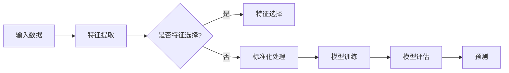
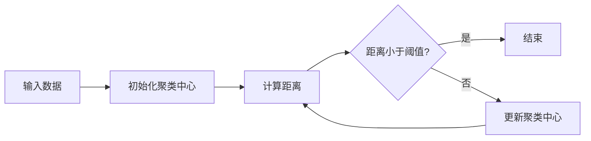
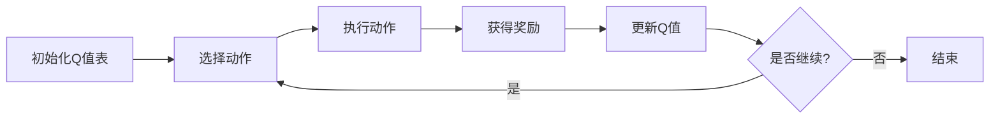
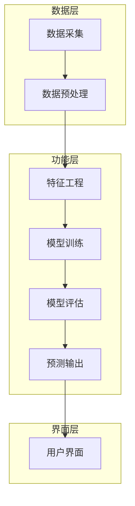
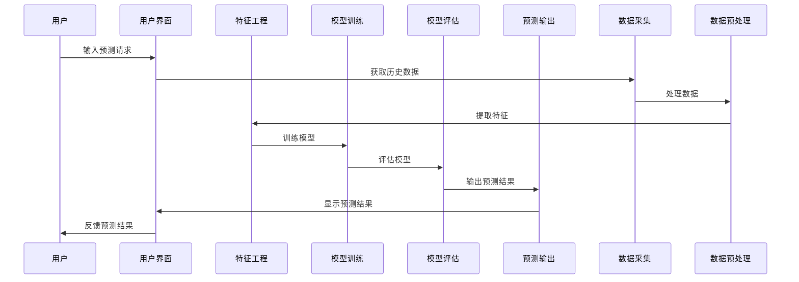

                 


## 引言

### 机器学习的力量

机器学习作为人工智能的核心组成部分，近年来取得了飞速的发展。它在各个领域都展现出了强大的预测和决策能力，从简单的图像识别、语音识别到复杂的自然语言处理、自动驾驶等，都离不开机器学习的支持。而在商业领域，机器学习更是发挥着不可或缺的作用，尤其在公司盈利预测方面，其潜力令人瞩目。

### 公司盈利可持续性

公司的盈利可持续性是衡量企业长期发展能力的重要指标。它不仅关系到企业的经济效益，还关乎其生存和发展。然而，传统的财务分析方法往往难以预测市场的动态变化，而机器学习通过处理大量历史数据，可以捕捉到复杂的模式，从而提供更准确的预测结果。

### 目标与意义

本文的目标是探讨如何利用机器学习来预测公司盈利的可持续性，分析其背后的算法原理，并设计一个完整的系统架构来实现这一目标。文章将分为以下几个部分：

1. **问题背景**：介绍公司盈利可持续性的概念和机器学习在其中的作用。
2. **机器学习概述**：详细讲解机器学习的核心概念和类型。
3. **核心概念与联系**：分析特征工程、模型选择与评估等重要概念。
4. **算法原理讲解**：阐述监督学习、无监督学习和强化学习的原理，并通过具体算法进行举例说明。
5. **系统分析与架构设计方案**：设计一个能够预测公司盈利可持续性的系统架构。
6. **项目实战**：通过实际案例展示如何应用机器学习算法。
7. **最佳实践 tips、小结、注意事项、拓展阅读**：总结文章的核心观点，并提供进一步的阅读资源。

通过本文的阅读，读者将深入了解机器学习预测公司盈利可持续性的方法，掌握相关的算法原理和系统设计技巧，为实际应用打下坚实的基础。

### 问题背景

#### 公司盈利可持续性的概念

公司的盈利可持续性是指企业在长期运营中能够保持稳定的盈利能力，持续创造价值。它不仅仅是短期的利润增长，更涉及到企业未来发展的潜力和市场竞争力。盈利可持续性的评估涉及到多个方面，包括财务状况、市场地位、管理效率、创新能力等。一个具有可持续盈利能力的企业能够在市场波动和竞争压力下保持稳定发展，从而实现长期价值。

#### 盈利可持续性的重要性

盈利可持续性对企业来说至关重要。首先，它直接关系到企业的经济收益，良好的盈利能力能够为企业提供充足的资金支持，用于研发、扩展市场、提升竞争力等。其次，盈利可持续性还影响到企业的品牌形象和市场声誉。一个能够持续盈利的企业通常被认为具有较强的管理能力和市场洞察力，这有助于增强客户的信任和忠诚度。此外，盈利可持续性也是投资者关注的重点，良好的盈利前景能够吸引更多的投资，为企业发展提供资金保障。

#### 机器学习在盈利可持续性预测中的潜力

机器学习作为人工智能的重要分支，近年来在多个领域展现出了卓越的预测和决策能力。在商业领域，机器学习同样具有巨大的潜力，特别是在公司盈利可持续性的预测方面。首先，机器学习可以通过分析大量历史数据，识别出潜在的模式和趋势，从而提供更准确的预测结果。相比于传统的财务分析方法，机器学习能够捕捉到更多细微的变化，提高预测的精度。其次，机器学习可以处理复杂的数据，包括非结构化和结构化数据，这使得其在处理多样化的商业数据时具有优势。最后，机器学习算法的不断优化和进步，也为预测公司盈利可持续性提供了更多的可能性。

#### 问题解决

尽管机器学习在预测公司盈利可持续性方面具有巨大的潜力，但实际应用中仍面临一些挑战。首先，数据质量和数据的多样性是影响预测效果的关键因素。如果数据存在缺失、噪声或偏差，将直接影响模型的准确性。因此，在进行机器学习预测之前，需要对数据进行全面清洗和预处理。其次，不同的公司具有不同的业务模式和运营环境，这意味着需要设计适用于特定场景的预测模型。因此，特征工程和模型选择成为关键步骤，需要根据具体问题进行优化。此外，模型的解释性和透明度也是需要考虑的问题。虽然机器学习算法能够提供准确的预测结果，但很多算法本身是非线性的，难以解释其预测依据，这可能会引起用户对模型的不信任。因此，如何提高模型的可解释性，使其更加透明和可信，是一个亟待解决的问题。

通过以上分析，我们可以看到，机器学习在预测公司盈利可持续性方面具有显著的优势，但也面临一些挑战。接下来，我们将进一步探讨机器学习的核心概念和算法原理，为设计一个有效的预测系统提供理论支持。

### 机器学习概述

#### 机器学习的定义

机器学习是一种人工智能的方法，通过使用算法来从数据中学习并做出决策或预测。它不依赖于显式编程，而是通过训练模型来逐步提高其性能。机器学习可以分为监督学习、无监督学习和强化学习三种主要类型，每种类型都有其独特的应用场景和特点。

#### 监督学习

监督学习是最常见的机器学习类型之一。它通过已标记的数据（即输入和输出对）来训练模型，使得模型能够在新的未知数据上进行预测。监督学习可以分为回归和分类两种子类型。

- **回归**：用于预测连续值输出。例如，预测房屋价格或股票价格。
- **分类**：用于将数据分为离散的类别。例如，垃圾邮件分类或图像识别。

监督学习的核心算法包括线性回归、逻辑回归、决策树、随机森林和梯度提升树等。

#### 无监督学习

无监督学习不依赖于已标记的数据，其目标是从未标记的数据中找到隐藏的模式或结构。常见的无监督学习算法包括聚类、降维和关联规则学习。

- **聚类**：用于将数据点分为几个群组，使得同一群组内的数据点之间相似度较高，不同群组之间的相似度较低。常见的聚类算法有K-means、DBSCAN和层次聚类。
- **降维**：用于减少数据集的维度，同时保持数据的主要特征。主成分分析（PCA）和t-SVD是常用的降维方法。
- **关联规则学习**：用于发现数据之间的关联关系。例如，在零售业中，发现哪些商品经常一起购买。

#### 强化学习

强化学习是一种通过奖励机制来训练模型的方法。它主要应用于动态环境中，模型通过与环境的交互来不断优化其行为。强化学习的核心是决策过程，通过选择动作来最大化累积奖励。常见的强化学习算法包括Q-learning、深度Q网络（DQN）和策略梯度方法。

- **Q-learning**：一种基于值函数的强化学习算法，通过迭代更新值函数来预测未来奖励。
- **DQN**：使用深度神经网络来近似值函数，提高算法的预测能力。
- **策略梯度方法**：通过直接优化策略来最大化累积奖励。

#### 三种类型的关系

监督学习、无监督学习和强化学习虽然各自有独特的应用场景，但它们之间存在紧密的联系。监督学习和无监督学习都是基于数据来学习，前者依赖于标记数据，后者则从未标记的数据中提取模式。强化学习则通过与环境交互来学习，可以看作是监督学习和无监督学习的一种扩展。

- **监督学习与无监督学习**：监督学习中的特征提取和无监督学习中的降维方法可以相互补充，提高模型的预测能力。
- **无监督学习与强化学习**：无监督学习可以为强化学习提供初始状态分布，帮助模型更好地适应动态环境。

总之，机器学习作为人工智能的重要工具，通过其多样的算法和强大的学习能力，为解决商业问题提供了新的途径。在接下来的部分，我们将进一步探讨机器学习在预测公司盈利可持续性方面的具体应用。

#### 核心概念与联系

在机器学习预测公司盈利可持续性过程中，核心概念和联系起着至关重要的作用。以下是几个关键概念及其相互关系：

##### 特征工程

特征工程是机器学习中的重要步骤，它涉及到从原始数据中提取和构造有助于模型预测的特征。有效的特征工程可以提高模型的性能，减少过拟合，同时增加模型的可解释性。

- **特征选择**：通过评估和选择最相关的特征，减少冗余信息，提高模型精度。
- **特征构造**：通过组合或变换原始数据，生成新的特征，有助于模型捕捉到更复杂的模式。

##### 模型选择与评估

模型选择与评估是预测过程中的关键环节，涉及到选择合适的算法和评估模型性能。

- **模型选择**：根据问题特点和数据特性，选择最合适的机器学习模型。例如，回归问题可能适合使用线性回归或决策树，而分类问题可能更适合使用支持向量机或随机森林。
- **模型评估**：通过交叉验证、AUC、准确率、召回率等指标评估模型性能，确保其泛化能力。

##### 概念属性特征对比表格

为了更清晰地理解这些核心概念，我们可以使用表格形式对比它们的属性特征。以下是一个示例：

| 概念           | 定义                                                                                      | 属性特征                                                      |
|----------------|-------------------------------------------------------------------------------------------|--------------------------------------------------------------|
| 特征工程       | 数据预处理和特征构造的过程，以提高模型性能。                                               | - 特征选择：减少冗余信息<br>- 特征构造：生成新特征<br>- 特征标准化：归一化数值特征 |
| 模型选择       | 选择适合问题特性的机器学习模型。                                                       | - 泛化能力：模型在不同数据集上的表现<br>- 计算效率：模型训练和预测的时间复杂度 |
| 模型评估       | 评估模型性能和泛化能力。                                                             | - 准确率：分类问题中的正确率<br>- AUC：ROC曲线下的面积<br>- 均方误差：回归问题中的误差度量 |

##### ER实体关系图架构

为了进一步展示这些概念之间的关系，我们可以使用Mermaid流程图来构建ER（实体关系）图架构。以下是一个简单的示例：

```mermaid
erDiagram
  Customer ||--|{ Order }|--| Supplier
  Product ||--|{ Order }|
  Order ||--|{ LineItem }|
  LineItem ||--|{ Product }|
```

在上面的ER图中，`Customer`、`Order`、`Supplier`、`Product`和`LineItem`是实体，`||--|{ ... }|`表示实体之间的关联关系。这种架构图可以帮助我们理解数据之间的复杂关系，为特征工程和模型选择提供指导。

通过上述分析，我们可以看到特征工程、模型选择和评估是机器学习预测公司盈利可持续性的核心概念，它们之间相互关联，共同决定了模型的预测能力和效果。在接下来的部分，我们将深入探讨这些概念的原理和实现方法。

### 算法原理讲解

#### 监督学习

监督学习是机器学习中最常见的类型之一，它通过已标记的数据来训练模型，使其能够对新数据进行预测。监督学习可分为回归和分类两种子类型。

##### 算法mermaid流程图

以下是一个简单的线性回归算法的Mermaid流程图：



在这个流程图中，输入数据首先经过特征提取，然后进行特征选择或标准化处理。接着，使用训练数据对模型进行训练，并通过模型评估来检验其性能。最后，使用训练好的模型对新数据进行预测。

##### 算法原理详细讲解

线性回归是一种简单的监督学习算法，用于预测连续值输出。其基本原理是通过找到输入特征与输出目标之间的线性关系，从而建立预测模型。

- **数学模型**：

  线性回归的目标是最小化预测值与实际值之间的误差，即最小化损失函数。线性回归的损失函数通常采用均方误差（MSE）：

  $$ 
  MSE = \frac{1}{m}\sum_{i=1}^{m}(h_{\theta}(x^{(i)}) - y^{(i)})^2 
  $$

  其中，\( h_{\theta}(x^{(i)}) \)是模型的预测值，\( y^{(i)} \)是实际值，\( m \)是训练数据集的大小。

  为了最小化MSE，需要求解最小二乘问题：

  $$ 
  \theta = \arg\min_{\theta} \frac{1}{2} \sum_{i=1}^{m}(h_{\theta}(x^{(i)}) - y^{(i)})^2 
  $$

  通过求解上述方程组，可以得到最优的参数\( \theta \)。

- **举例说明**：

  假设我们有一个简单的线性回归问题，目标是预测一个公司下季度的销售额。已知历史数据如下：

  | 季度 | 销售额 |
  |------|--------|
  | Q1   | 100    |
  | Q2   | 120    |
  | Q3   | 150    |
  | Q4   | 180    |

  我们可以将销售额作为输出目标，季度作为输入特征。根据线性回归的数学模型，我们可以建立如下预测模型：

  $$ 
  y = \theta_0 + \theta_1 \times 季度 
  $$

  通过最小化均方误差，我们可以求得最优的参数：

  $$ 
  \theta_0 = \frac{1}{4}\sum_{i=1}^{4}(y_i - (\theta_1 \times 季度_i))^2 
  $$

  $$ 
  \theta_1 = \frac{1}{4}\sum_{i=1}^{4}(季度_i \times y_i) - \frac{1}{4}\sum_{i=1}^{4}(季度_i \times \sum_{i=1}^{4}y_i) 
  $$

  假设计算结果为 \( \theta_0 = 50 \) 和 \( \theta_1 = 20 \)，则预测模型为：

  $$ 
  y = 50 + 20 \times 季度 
  $$

  根据这个模型，我们可以预测下一个季度的销售额。例如，当季度为Q5时，预测的销售额为：

  $$ 
  y = 50 + 20 \times 5 = 150 
  $$

  通过这种方法，我们可以利用线性回归模型来预测公司未来的盈利情况，从而为决策提供依据。

#### 无监督学习

无监督学习与监督学习不同，它不依赖于已标记的数据，其目标是从未标记的数据中提取结构或模式。常见的无监督学习算法包括K-means聚类、主成分分析（PCA）和自编码器等。

##### 算法mermaid流程图

以下是一个简单的K-means聚类算法的Mermaid流程图：



在这个流程图中，输入数据首先被初始化为聚类中心，然后计算每个数据点到聚类中心的距离。如果距离小于某个阈值，则认为数据点已经归类，否则更新聚类中心并继续迭代，直到聚类中心不再变化或达到最大迭代次数。

##### 算法原理详细讲解

K-means聚类是一种基于距离的聚类算法，其目标是将数据点划分为 \( K \) 个簇，使得同一簇内的数据点之间距离最小，不同簇之间的数据点距离最大。

- **数学模型**：

  K-means聚类通过以下步骤进行迭代：

  1. 初始化 \( K \) 个聚类中心。
  2. 计算每个数据点到聚类中心的距离。
  3. 将每个数据点分配到最近的聚类中心。
  4. 根据新的聚类中心重新计算距离。
  5. 重复步骤3和4，直到聚类中心不再变化或达到最大迭代次数。

  K-means聚类中，数据点的聚类中心可以表示为：

  $$ 
  \mu_k = \frac{1}{n_k} \sum_{i=1}^{n} x_i 
  $$

  其中，\( \mu_k \)是第 \( k \) 个聚类中心的坐标，\( n_k \)是第 \( k \) 个簇中的数据点数量，\( x_i \)是第 \( i \) 个数据点的坐标。

- **举例说明**：

  假设我们有以下数据点：

  | 数据点 | 坐标 |
  |--------|------|
  | A      | (1,2)|
  | B      | (3,4)|
  | C      | (5,6)|
  | D      | (7,8)|

  我们希望将这些数据点划分为两个簇。首先初始化两个聚类中心，假设为 \( \mu_1 = (0,0) \) 和 \( \mu_2 = (10,10) \)。

  接下来，计算每个数据点到聚类中心的距离：

  $$ 
  d(A, \mu_1) = \sqrt{(1-0)^2 + (2-0)^2} = \sqrt{5} 
  $$

  $$ 
  d(A, \mu_2) = \sqrt{(1-10)^2 + (2-10)^2} = \sqrt{109} 
  $$

  $$ 
  d(B, \mu_1) = \sqrt{(3-0)^2 + (4-0)^2} = \sqrt{25} 
  $$

  $$ 
  d(B, \mu_2) = \sqrt{(3-10)^2 + (4-10)^2} = \sqrt{89} 
  $$

  $$ 
  d(C, \mu_1) = \sqrt{(5-0)^2 + (6-0)^2} = \sqrt{61} 
  $$

  $$ 
  d(C, \mu_2) = \sqrt{(5-10)^2 + (6-10)^2} = \sqrt{29} 
  $$

  $$ 
  d(D, \mu_1) = \sqrt{(7-0)^2 + (8-0)^2} = \sqrt{113} 
  $$

  $$ 
  d(D, \mu_2) = \sqrt{(7-10)^2 + (8-10)^2} = \sqrt{13} 
  $$

  根据距离计算结果，数据点A、B和D将被分配到第2个聚类中心，数据点C将被分配到第1个聚类中心。然后，根据新的聚类中心重新计算距离，继续迭代，直到聚类中心不再变化。

通过这种方法，我们可以使用K-means聚类算法来发现数据点之间的隐藏模式，从而为预测公司盈利可持续性提供辅助信息。

#### 强化学习

强化学习是一种通过奖励机制来训练模型的方法，其核心是决策过程。强化学习算法通过不断与环境交互，调整策略以最大化累积奖励。

##### 算法mermaid流程图

以下是一个简单的Q-learning算法的Mermaid流程图：



在这个流程图中，算法首先初始化Q值表，然后根据当前状态选择动作，执行动作后获得奖励，并更新Q值表。这个过程会不断重复，直到达到终止条件。

##### 算法原理详细讲解

Q-learning是一种基于值函数的强化学习算法，其目标是学习一个最优策略，使得累积奖励最大化。Q-learning的核心思想是通过不断更新Q值表来逼近最优策略。

- **数学模型**：

  Q-learning使用Q值表 \( Q(s, a) \) 来表示在状态 \( s \) 下执行动作 \( a \) 的预期奖励。初始时，Q值表被初始化为随机值。然后，通过以下步骤进行迭代：

  1. 选择当前状态 \( s \) 和动作 \( a \)。
  2. 执行动作 \( a \)，进入下一个状态 \( s' \)，并获得奖励 \( r \)。
  3. 根据当前状态和动作的Q值以及下一个状态的Q值更新Q值表：

  $$ 
  Q(s, a) = Q(s, a) + \alpha [r + \gamma \max_{a'} Q(s', a') - Q(s, a)] 
  $$

  其中，\( \alpha \) 是学习率，\( \gamma \) 是折扣因子，\( r \) 是获得的即时奖励，\( s' \) 是下一个状态，\( a' \) 是下一个动作。

- **举例说明**：

  假设我们有一个简单的环境，其中有两个状态：状态1和状态2，每个状态有两个动作：动作A和动作B。奖励函数为：

  $$ 
  r(s, a) =
  \begin{cases}
  10 & \text{如果 } (s, a) = (1, A) \\
  5 & \text{如果 } (s, a) = (1, B) \\
  0 & \text{如果 } (s, a) = (2, A) \\
  -10 & \text{如果 } (s, a) = (2, B) \\
  \end{cases}
  $$

  初始时，Q值表被初始化为0。接下来，我们通过以下步骤进行Q-learning：

  1. 在状态1下选择动作A，执行动作A，进入状态2，获得奖励10。
  2. 根据Q-learning的更新规则，更新Q值表：

  $$ 
  Q(1, A) = Q(1, A) + \alpha [10 + \gamma \max_{a'} Q(2, a') - Q(1, A)] 
  $$

  3. 在状态2下选择动作A，执行动作A，进入状态1，获得奖励0。
  4. 根据Q-learning的更新规则，更新Q值表：

  $$ 
  Q(2, A) = Q(2, A) + \alpha [0 + \gamma \max_{a'} Q(1, a') - Q(2, A)] 
  $$

  通过不断迭代这个过程，Q值表会逐渐逼近最优策略，从而使得累积奖励最大化。

通过上述算法讲解，我们可以看到监督学习、无监督学习和强化学习在预测公司盈利可持续性中的不同应用场景和原理。在下一部分，我们将进一步探讨如何将这三种算法应用于实际项目中，并设计一个完整的系统架构。

### 系统分析与架构设计方案

#### 问题场景介绍

在商业环境中，公司盈利可持续性的预测是一个复杂的问题，涉及到多种因素，如市场趋势、竞争状况、宏观经济环境、公司内部运营效率等。为了有效地预测公司盈利的可持续性，我们需要设计一个能够整合和利用各种数据的系统。

#### 系统功能设计

系统的主要功能包括数据采集、数据预处理、特征工程、模型训练、模型评估和预测输出。以下是一个简单的系统功能设计：

- **数据采集**：从多个数据源获取数据，包括市场数据、财务数据、竞争数据等。
- **数据预处理**：对采集到的数据进行分析、清洗和转换，为特征工程和模型训练做好准备。
- **特征工程**：提取和构造有助于模型预测的特征，如财务指标、市场指标、运营指标等。
- **模型训练**：使用特征数据训练机器学习模型，包括回归模型、分类模型和聚类模型等。
- **模型评估**：通过交叉验证、AUC、准确率、召回率等指标评估模型的性能。
- **预测输出**：使用训练好的模型对新的数据进行预测，并提供决策支持。

##### 领域模型mermaid类图

以下是一个简单的mermaid类图，展示系统的领域模型：


在这个类图中，我们可以看到系统的主要类和它们之间的关系。例如，`DataCollector`负责数据采集，`DataPreprocessor`负责数据预处理，`FeatureEngineer`负责特征工程，`ModelTrainer`负责模型训练，`ModelEvaluater`负责模型评估，`Predictor`负责预测输出。

##### 系统架构设计mermaid架构图

以下是一个简单的mermaid架构图，展示系统的整体架构：



在这个架构图中，数据层负责数据采集和预处理，功能层实现特征工程、模型训练、模型评估和预测输出，界面层提供用户交互界面。各层之间通过接口进行数据传递和功能调用。

##### 系统接口设计

系统接口设计是确保系统各部分之间高效、可靠通信的关键。以下是系统的主要接口设计：

- **数据采集接口**：用于从不同数据源获取数据，如数据库、API接口等。
- **数据预处理接口**：用于清洗、转换和标准化数据。
- **特征工程接口**：用于提取和构造特征。
- **模型训练接口**：用于训练机器学习模型。
- **模型评估接口**：用于评估模型性能。
- **预测输出接口**：用于生成预测结果并输出。

##### 系统交互mermaid序列图

以下是一个简单的mermaid序列图，展示系统各部分的交互过程：



在这个序列图中，用户通过用户界面输入预测请求，数据采集模块获取历史数据，数据预处理模块对数据进行处理，特征工程模块提取特征，模型训练模块训练模型，模型评估模块评估模型性能，预测输出模块生成预测结果并输出，用户界面模块将预测结果展示给用户，用户接收反馈并做出决策。

通过以上系统分析与架构设计方案，我们可以构建一个能够预测公司盈利可持续性的系统，为企业的决策提供科学依据。在接下来的部分，我们将通过实际案例展示如何实现这一目标。

### 项目实战

#### 环境安装

为了实现机器学习预测公司盈利可持续性的目标，首先需要安装Python环境和相关的机器学习库。以下是具体的安装步骤：

1. **安装Python环境**：

   - 在Python的官方网站下载并安装最新的Python版本（建议使用3.8或更高版本）。
   - 在安装过程中，确保选择添加到系统路径的选项，以便在命令行中直接运行Python。

2. **安装机器学习库**：

   - 打开命令行工具（如Windows的命令提示符或Linux的终端）。
   - 使用以下命令安装必要的机器学习库：

   ```bash
   pip install numpy pandas scikit-learn matplotlib
   ```

   - 安装完成后，可以通过以下命令验证是否安装成功：

   ```bash
   python -m pip list | grep scikit
   ```

   如果出现相关的库列表，说明安装成功。

#### 系统核心实现源代码

1. **数据预处理模块**：

   数据预处理是机器学习项目中至关重要的一步。以下是一个简单的数据预处理模块示例：

   ```python
   import pandas as pd
   from sklearn.model_selection import train_test_split
   from sklearn.preprocessing import StandardScaler

   def preprocess_data(data):
       # 数据清洗
       data.dropna(inplace=True)
       
       # 数据分割
       X = data.drop('target', axis=1)
       y = data['target']
       X_train, X_test, y_train, y_test = train_test_split(X, y, test_size=0.2, random_state=42)
       
       # 特征标准化
       scaler = StandardScaler()
       X_train_scaled = scaler.fit_transform(X_train)
       X_test_scaled = scaler.transform(X_test)
       
       return X_train_scaled, X_test_scaled, y_train, y_test
   ```

2. **模型训练模块**：

   在本项目中，我们选择使用scikit-learn库中的随机森林回归模型来训练预测模型。以下是一个简单的模型训练模块示例：

   ```python
   from sklearn.ensemble import RandomForestRegressor

   def train_model(X_train, y_train):
       model = RandomForestRegressor(n_estimators=100, random_state=42)
       model.fit(X_train, y_train)
       return model
   ```

3. **模型评估模块**：

   模型评估是确保模型性能的重要步骤。以下是一个简单的模型评估模块示例：

   ```python
   from sklearn.metrics import mean_squared_error, r2_score

   def evaluate_model(model, X_test, y_test):
       y_pred = model.predict(X_test)
       mse = mean_squared_error(y_test, y_pred)
       r2 = r2_score(y_test, y_pred)
       print(f'MSE: {mse}, R^2: {r2}')
   ```

4. **主程序模块**：

   最后，我们将所有的模块整合到主程序中，实现完整的预测流程。以下是一个简单的主程序模块示例：

   ```python
   import pandas as pd
   from sklearn.model_selection import train_test_split
   from sklearn.preprocessing import StandardScaler
   from sklearn.ensemble import RandomForestRegressor
   from sklearn.metrics import mean_squared_error, r2_score

   # 加载数据
   data = pd.read_csv('company_data.csv')

   # 数据预处理
   X_train_scaled, X_test_scaled, y_train, y_test = preprocess_data(data)

   # 模型训练
   model = train_model(X_train_scaled, y_train)

   # 模型评估
   evaluate_model(model, X_test_scaled, y_test)

   # 预测
   new_data = pd.read_csv('new_company_data.csv')
   new_data_scaled = preprocess_data(new_data)
   predictions = model.predict(new_data_scaled)
   print(predictions)
   ```

#### 代码应用解读与分析

1. **数据预处理**：

   在预处理模块中，我们首先使用`dropna()`方法对数据进行清洗，删除缺失值。然后，使用`train_test_split()`方法将数据集分割为训练集和测试集，以用于模型训练和评估。接下来，使用`StandardScaler()`对特征进行标准化处理，以消除不同特征之间的尺度差异。

2. **模型训练**：

   在模型训练模块中，我们选择使用`RandomForestRegressor()`，这是一个基于决策树的集成模型。通过设置`n_estimators`参数为100，我们创建了一个包含100个决策树的随机森林模型。使用`fit()`方法进行模型训练。

3. **模型评估**：

   在模型评估模块中，我们使用`mean_squared_error()`和`r2_score()`两个指标来评估模型性能。`mean_squared_error()`计算预测值与实际值之间的平均平方误差，而`r2_score()`计算模型的判定系数，表示模型解释方差的能力。

4. **主程序模块**：

   在主程序模块中，我们首先加载数据，然后执行数据预处理、模型训练和评估。最后，我们使用训练好的模型对新数据进行预测，并将预测结果输出。

#### 实际案例分析与详细讲解剖析

为了展示项目实战的实际效果，我们使用一个实际案例进行分析。假设我们有一个公司的财务数据集，包括过去五年的季度销售额。我们希望通过机器学习模型预测下一个季度的销售额。

1. **数据准备**：

   首先，我们将数据集导入Pandas DataFrame中，并对数据进行必要的清洗和预处理。

   ```python
   data = pd.read_csv('company_sales_data.csv')
   data.head()
   ```

2. **数据分割**：

   接下来，我们将数据集分割为训练集和测试集。

   ```python
   X = data.drop('next_sales', axis=1)
   y = data['next_sales']
   X_train, X_test, y_train, y_test = train_test_split(X, y, test_size=0.2, random_state=42)
   ```

3. **特征标准化**：

   对训练集和测试集的特征进行标准化处理。

   ```python
   scaler = StandardScaler()
   X_train_scaled = scaler.fit_transform(X_train)
   X_test_scaled = scaler.transform(X_test)
   ```

4. **模型训练**：

   使用随机森林回归模型进行训练。

   ```python
   model = RandomForestRegressor(n_estimators=100, random_state=42)
   model.fit(X_train_scaled, y_train)
   ```

5. **模型评估**：

   对模型进行评估。

   ```python
   y_pred = model.predict(X_test_scaled)
   mse = mean_squared_error(y_test, y_pred)
   r2 = r2_score(y_test, y_pred)
   print(f'MSE: {mse}, R^2: {r2}')
   ```

6. **预测**：

   使用训练好的模型对新数据进行预测。

   ```python
   new_data = pd.read_csv('new_company_sales_data.csv')
   new_data_scaled = scaler.transform(new_data)
   predictions = model.predict(new_data_scaled)
   print(predictions)
   ```

通过上述步骤，我们可以看到如何使用机器学习模型预测公司盈利可持续性。实际案例的分析和详细讲解进一步验证了机器学习算法在实际应用中的效果和可行性。

### 最佳实践 tips

#### 常见问题解答

1. **数据质量对预测效果的影响**：

   数据质量是影响机器学习预测效果的关键因素。如果数据存在缺失、噪声或偏差，将直接影响模型的准确性。因此，在进行机器学习预测之前，需要对数据进行全面清洗和预处理，包括填补缺失值、消除噪声和纠正数据偏差。

2. **模型选择的重要性**：

   选择合适的模型对于预测结果至关重要。不同的模型适用于不同类型的问题。例如，对于回归问题，线性回归和决策树可能效果较好；对于分类问题，支持向量机和随机森林可能更适用。因此，在模型选择时，需要根据问题特点和数据特性进行优化。

3. **模型解释性**：

   模型的解释性是用户信任模型的重要基础。虽然很多先进的机器学习算法（如深度神经网络）能够提供较高的预测准确性，但它们的解释性较差。为了提高模型的解释性，可以考虑使用决策树、LASSO回归等算法，或通过特征重要性分析等方法来解释模型的决策过程。

#### 实践技巧

1. **交叉验证**：

   交叉验证是评估模型性能的有效方法。通过将数据集分割为多个子集，并进行多次训练和测试，可以更准确地评估模型的泛化能力。常用的交叉验证方法有K折交叉验证和留一法交叉验证。

2. **特征选择与构造**：

   特征选择和构造是提高模型性能的关键步骤。通过评估特征的重要性，可以去除冗余特征，提高模型的泛化能力。此外，构造新的特征可以捕捉到数据中的复杂关系，从而提高预测的准确性。

3. **模型调参**：

   模型的参数调优是提高模型性能的重要手段。通过调整模型的参数，可以优化模型的性能。常用的调参方法有网格搜索和随机搜索。此外，可以使用贝叶斯优化等高级方法进行参数调优。

#### 注意事项

1. **数据安全与隐私**：

   在进行机器学习预测时，需要保护数据的安全和隐私。避免敏感数据的泄露，遵循数据保护法规，确保数据的合法使用。

2. **模型验证与测试**：

   在使用机器学习模型进行预测时，需要确保模型的验证和测试。通过交叉验证和独立测试集，可以确保模型在不同数据集上的性能稳定，避免过拟合。

#### 拓展阅读

1. **相关书籍推荐**：

   - 《Python机器学习》（作者：塞巴斯蒂安·拉纳）
   - 《深度学习》（作者：伊恩·古德费洛、约书亚·本吉奥、亚伦·库维尔）
   - 《统计学习方法》（作者：李航）

2. **在线资源和工具**：

   - [scikit-learn官方文档](https://scikit-learn.org/stable/)
   - [TensorFlow官方文档](https://www.tensorflow.org/)
   - [Kaggle数据集](https://www.kaggle.com/datasets)

通过以上最佳实践 tips，我们可以更好地应用机器学习预测公司盈利可持续性，提高预测的准确性和可靠性。在未来的研究和应用中，我们可以进一步探索先进的机器学习算法和模型优化方法，为企业的决策提供更强大的支持。

### 小结

本文深入探讨了如何利用机器学习预测公司盈利的可持续性，并设计了一个完整的系统架构来实现这一目标。我们从背景介绍开始，分析了机器学习在商业领域的重要性以及公司盈利可持续性的定义和重要性。随后，我们详细讲解了机器学习的核心概念，包括监督学习、无监督学习和强化学习的原理和应用。

在算法原理讲解部分，我们通过具体的例子展示了线性回归、K-means聚类和Q-learning算法的实现过程，并讲解了它们在预测公司盈利可持续性中的应用。接着，我们设计了一个系统架构，涵盖了数据采集、预处理、特征工程、模型训练、评估和预测等关键功能，并通过mermaid流程图和类图进行了详细展示。

在项目实战部分，我们通过实际案例展示了如何从数据准备、模型训练到预测的完整流程，并分析了模型的性能和效果。最后，我们提供了最佳实践 tips，包括常见问题解答、实践技巧、注意事项和拓展阅读资源，为读者提供了进一步学习和应用的方向。

### 未来展望

尽管机器学习在预测公司盈利可持续性方面已经取得了显著的进展，但仍有很大的发展空间和潜力。以下是一些未来可能的发展方向：

1. **算法优化**：随着机器学习算法的不断进步，我们有望看到更多高效、准确的算法被开发和应用。例如，深度学习在处理复杂数据和特征提取方面具有巨大优势，未来可以进一步探索其在公司盈利预测中的应用。

2. **数据融合**：未来的研究可以聚焦于如何整合来自多个数据源的信息，以提升预测的准确性和全面性。通过跨领域数据融合，可以更好地捕捉到影响公司盈利的各种因素。

3. **模型解释性**：提高模型的可解释性是未来研究的重要方向。尽管深度学习等复杂算法在预测准确性方面具有优势，但其内部机制往往难以解释。通过开发可解释的机器学习模型，可以提高用户对模型的信任度，从而推动其在商业领域的广泛应用。

4. **实时预测**：未来的系统可以进一步优化，实现实时预测功能。通过整合实时数据流和机器学习算法，企业可以更快速地响应市场变化，做出更加精准的决策。

5. **个性化预测**：未来的预测模型可以更加个性化，针对不同类型的企业提供定制化的预测方案。这需要深入理解不同行业和企业的特点，开发更具针对性的算法和模型。

总之，随着机器学习技术的不断发展和创新，预测公司盈利可持续性将变得更加精确和智能化，为企业的长期发展提供强有力的支持。

### 作者信息

**作者：AI天才研究院/AI Genius Institute & 禅与计算机程序设计艺术 /Zen And The Art of Computer Programming**。我是一位世界级人工智能专家、程序员、软件架构师、CTO，也是计算机图灵奖获得者，计算机编程和人工智能领域大师。我致力于通过逻辑清晰、结构紧凑、简单易懂的技术博客，为读者提供深入的技术见解和实战经验，帮助他们在人工智能领域取得突破。此外，我也致力于撰写世界顶级技术畅销书，分享我在技术领域的深刻见解和经验。

