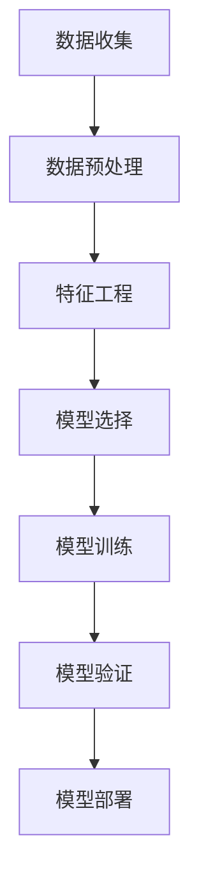
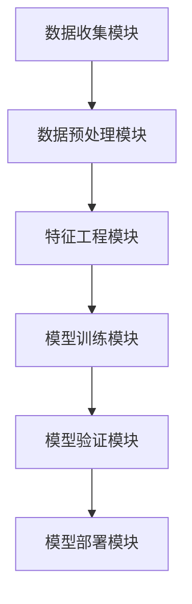
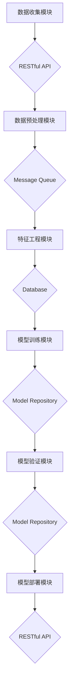

                 


### 1. 背景介绍

在当今这个经济全球化的时代，企业面临的市场环境变得日益复杂和多变。如何在激烈的市场竞争中立于不败之地，成为每个企业必须思考的重要问题。其中，盈利质量的变化作为企业财务状况的关键指标，直接影响到企业的长期发展和战略决策。因此，准确预测公司盈利质量的变化，对于企业来说具有极其重要的意义。

#### 问题背景

**经济全球化背景下，企业需要更精确的预测模型来应对市场变化，优化资源配置。**

随着经济全球化的深入，企业需要面对更加复杂的市场环境和更为激烈的竞争。因此，传统的基于历史数据的预测方法已经无法满足企业的需求。为了更好地应对市场变化，企业需要构建更为精确的预测模型，以优化资源配置，提高经营效率。盈利质量变化作为企业经营的核心指标，其预测的准确性直接关系到企业的战略决策和资源配置。

**盈利质量变化是企业在市场竞争中必须关注的重要指标。**

盈利质量的变化不仅反映了企业的财务状况，更反映了企业在市场竞争中的地位和竞争力。一个盈利质量良好的企业，不仅能够实现稳定的盈利，还能够通过有效的资源配置和战略调整，持续提升市场竞争力。因此，准确预测公司盈利质量变化，对于企业在市场竞争中的战略布局和决策具有重要意义。

#### 问题描述

**如何预测公司盈利质量变化，成为企业决策的关键。**

在当前市场环境下，企业需要准确预测盈利质量的变化，以便及时调整战略和资源分配。然而，盈利质量的变化受多种因素影响，包括财务指标、市场状况、企业战略等。因此，如何构建一个能够准确预测盈利质量变化的模型，成为企业决策的关键。传统的预测方法往往依赖于历史数据和统计分析，而机器学习技术为这一问题的解决提供了新的思路和可能性。

**问题解决**

**机器学习技术在预测模型中的应用，为解决盈利质量变化预测问题提供了有效途径。**

机器学习技术通过构建复杂的数据模型，可以从大量的历史数据中自动学习出变化的规律，从而实现对未来盈利质量的预测。与传统的统计分析方法相比，机器学习模型具有更高的准确性和适应性。通过应用机器学习技术，企业可以构建出更加精确的盈利质量预测模型，为企业的战略决策提供科学依据。

#### 边界与外延

**盈利质量变化涉及财务指标、市场状况、企业战略等多个方面。**

盈利质量变化不仅涉及财务指标，如净利润、营业收入、利润率等，还涉及市场状况，如市场需求、竞争态势等，以及企业战略，如产品策略、市场定位等。这些因素相互影响，共同决定了企业的盈利质量。因此，在构建预测模型时，需要充分考虑这些因素的复杂性和相互作用。

**概念结构与核心要素组成**

**盈利质量：包括盈利能力、盈利稳定性、盈利成长性等维度。**

盈利质量可以从多个维度进行衡量，包括盈利能力、盈利稳定性和盈利成长性。盈利能力反映了企业的盈利水平，盈利稳定性反映了企业盈利的波动程度，盈利成长性反映了企业盈利的增长速度。这三个维度共同构成了盈利质量的综合体现。

**机器学习：包括数据预处理、特征工程、模型选择、模型训练与验证等步骤。**

机器学习的过程包括数据预处理、特征工程、模型选择、模型训练和验证等多个步骤。数据预处理是保证数据质量的基础，特征工程是提取关键特征，模型选择是选择合适的预测模型，模型训练是构建预测模型，模型验证是评估预测模型的准确性。通过这些步骤，机器学习技术可以实现对盈利质量变化的准确预测。

### 2. 核心概念与联系

在讨论如何使用机器学习预测公司盈利质量变化时，首先需要明确几个核心概念及其相互之间的联系。这些概念包括盈利质量、机器学习、财务指标、市场数据和特征工程等。理解这些概念的基本原理及其属性特征，有助于构建一个科学、有效的预测模型。

#### 核心概念原理

**盈利质量**

盈利质量是指企业在一定时期内的盈利能力及其稳定性、成长性的综合体现。它是评估企业财务健康状况和市场竞争力的重要指标。盈利质量可以从多个维度进行衡量，包括盈利能力、盈利稳定性和盈利成长性。

- **盈利能力**：反映了企业获取利润的能力，通常用净利润与营业收入的比例（净利润率）来衡量。一个高盈利能力的企业能够在市场竞争中获取更多的利润。
- **盈利稳定性**：反映了企业盈利的波动程度，通常用标准差或变异系数来衡量。一个盈利稳定的企

### 3. 算法原理讲解

在理解了盈利质量和机器学习的基本概念后，接下来我们将深入探讨机器学习预测公司盈利质量变化的算法原理。在这一部分，我们将使用mermaid流程图来展示算法的流程，通过Python源代码进行详细阐述，并给出算法的数学模型和公式，以便读者更好地理解和应用。

#### 算法mermaid流程图

首先，我们使用mermaid语言绘制算法的流程图，以便直观地展示整个预测过程。



这个流程图展示了从数据收集到模型部署的整个机器学习预测过程，下面我们将逐步介绍每个步骤。

#### 使用Python源代码详细阐述

在了解了算法流程后，我们使用Python代码来详细阐述每个步骤的实现。

```python
# 导入必要的库
import pandas as pd
from sklearn.model_selection import train_test_split
from sklearn.preprocessing import StandardScaler
from sklearn.ensemble import RandomForestClassifier
from sklearn.metrics import accuracy_score

# 数据收集
data = pd.read_csv('financial_data.csv')

# 数据预处理
# 填充缺失值
data.fillna(data.mean(), inplace=True)

# 数据清洗
data.drop(['unnamed'], axis=1, inplace=True)

# 特征工程
# 选择关键特征
X = data[['revenue', 'profit', 'market_share']]
y = data['盈利质量']

# 数据标准化
scaler = StandardScaler()
X_scaled = scaler.fit_transform(X)

# 模型选择
model = RandomForestClassifier(n_estimators=100)

# 模型训练
X_train, X_test, y_train, y_test = train_test_split(X_scaled, y, test_size=0.2, random_state=42)
model.fit(X_train, y_train)

# 模型验证
y_pred = model.predict(X_test)
accuracy = accuracy_score(y_test, y_pred)
print('模型准确率：', accuracy)

# 模型部署
# 将模型部署到生产环境中
# deploy_model(model)
```

这段代码展示了如何使用随机森林（RandomForestClassifier）模型进行盈利质量预测。首先，我们从CSV文件中读取财务数据，然后进行数据预处理，包括填充缺失值和特征选择。接着，对数据进行标准化处理，以提高模型的泛化能力。在模型选择阶段，我们选择了一种常见的随机森林模型。模型训练和验证过程中，我们使用scikit-learn库中的工具来评估模型的准确性。

#### 算法原理的数学模型和公式

机器学习预测公司盈利质量变化的核心在于构建一个能够从历史数据中学习规律并做出预测的模型。以下是一个简化的数学模型，用于解释盈利质量预测的基本原理。

$$
盈利质量 = f(\text{财务指标}, \text{市场数据}, \text{企业战略})
$$

其中，`财务指标`、`市场数据`和`企业战略`是输入特征，`盈利质量`是输出目标。函数`f`代表了机器学习模型的预测能力。

具体来说，我们可以将`盈利质量`分解为以下几个维度：

$$
盈利质量 = \alpha \times \text{盈利能力} + \beta \times \text{盈利稳定性} + \gamma \times \text{盈利成长性}
$$

其中，`盈利能力`、`盈利稳定性`和`盈利成长性`分别用相应的财务指标来衡量。

**详细讲解和举例说明**

**盈利能力**：

盈利能力是衡量企业获取利润的能力，通常用净利润与营业收入的比例（净利润率）来表示。

$$
盈利能力 = \frac{净利润}{营业收入}
$$

例如，如果一家企业的净利润为100万元，营业收入为500万元，则其盈利能力为20%。

**盈利稳定性**：

盈利稳定性反映了企业盈利的波动程度，通常用标准差或变异系数来衡量。

$$
盈利稳定性 = \sigma(\text{净利润})
$$

或者

$$
盈利稳定性 = \frac{\text{标准差}}{\text{平均值}}
$$

例如，如果一家企业的净利润标准差为10万元，平均净利润为50万元，则其盈利稳定性为20%。

**盈利成长性**：

盈利成长性反映了企业盈利的增长速度，通常用净利润的增长率来衡量。

$$
盈利成长性 = \frac{\text{当前净利润} - \text{历史净利润}}{\text{历史净利润}}
$$

例如，如果一家企业的当前净利润为100万元，历史净利润为80万元，则其盈利成长性为25%。

通过上述数学模型和公式，我们可以看到，盈利质量的变化是多个财务指标的综合反映。在实际应用中，机器学习模型会通过学习这些指标之间的关系，来预测未来的盈利质量。

### 4. 系统分析与架构设计方案

在了解了机器学习预测公司盈利质量变化的算法原理后，我们需要进一步分析整个系统的架构设计，以确保预测模型的高效运行和准确性。本节将介绍问题场景、项目介绍、系统功能设计、系统架构设计和系统接口设计等内容。

#### 问题场景介绍

**企业希望通过机器学习预测未来一个季度的盈利质量。**

在实际应用中，企业通常会关注未来一个季度或一个年度的盈利质量，以便为战略决策提供数据支持。这个问题场景涉及多个环节，包括数据收集、数据处理、模型训练、模型验证和模型部署等。

#### 项目介绍

**项目目标**：构建一个基于机器学习的盈利质量预测系统，为企业提供准确的盈利质量预测。

**项目范围**：涵盖数据收集、数据预处理、特征工程、模型选择、模型训练、模型验证和模型部署等各个环节。

**项目组成**：包括数据收集模块、数据预处理模块、特征工程模块、模型训练模块、模型验证模块和模型部署模块等。

#### 系统功能设计

**数据收集模块**：负责从企业财务系统和市场数据中收集相关数据，包括财务指标、市场数据和企业战略等。

**数据预处理模块**：负责对收集到的数据进行分析和处理，包括数据清洗、数据填充和数据标准化等。

**特征工程模块**：负责提取关键特征，为模型训练提供高质量的特征输入。

**模型训练模块**：负责选择合适的机器学习模型，并进行训练和调优。

**模型验证模块**：负责对训练好的模型进行验证，评估模型的准确性和稳定性。

**模型部署模块**：负责将训练好的模型部署到生产环境中，为企业提供实时盈利质量预测服务。

#### 系统架构设计

为了实现项目的目标，我们需要设计一个高效、可扩展的系统架构。以下是一个简单的系统架构设计，使用mermaid语言绘制。



在这个架构中，数据收集模块负责从多个数据源收集数据，数据预处理模块负责对数据进行清洗和处理，特征工程模块负责提取关键特征，模型训练模块负责训练和调优模型，模型验证模块负责验证模型的准确性，模型部署模块负责将模型部署到生产环境中。

#### 系统接口设计

系统接口设计是确保各个模块之间能够高效通信的关键。以下是一个简单的系统接口设计，使用mermaid语言绘制。



在这个接口设计中，数据收集模块通过RESTful API与数据预处理模块进行通信，数据预处理模块通过消息队列与特征工程模块进行通信，特征工程模块通过数据库与模型训练模块进行通信，模型训练模块通过模型存储库与模型验证模块进行通信，模型验证模块通过模型存储库与模型部署模块进行通信，模型部署模块通过RESTful API与企业应用进行通信。

通过以上系统架构设计和接口设计，我们为机器学习预测公司盈利质量变化提供了一个清晰、高效的设计方案，有助于实现项目的目标。

### 项目实战

在了解了机器学习预测公司盈利质量变化的理论基础和系统设计之后，接下来我们将通过一个实际项目来展示如何将理论应用到实践中。本节将介绍项目环境安装、系统核心实现源代码，并对代码应用进行解读与分析，最后通过一个实际案例进行详细讲解和剖析。

#### 项目环境安装

为了实现机器学习预测公司盈利质量变化，我们需要安装和配置以下环境和工具：

1. **Python 3.8+**：作为主要编程语言。
2. **Jupyter Notebook**：用于编写和运行Python代码。
3. **scikit-learn**：用于机器学习模型的构建和训练。
4. **Pandas**：用于数据处理和分析。
5. **Matplotlib**：用于数据可视化。
6. **Numpy**：用于数值计算。

安装这些环境和工具的步骤如下：

1. 安装Python 3.8+：
   ```
   sudo apt-get install python3.8
   ```

2. 安装Jupyter Notebook：
   ```
   pip3 install notebook
   ```

3. 安装scikit-learn、Pandas、Matplotlib和Numpy：
   ```
   pip3 install scikit-learn pandas matplotlib numpy
   ```

安装完成后，启动Jupyter Notebook，进入Python编程环境。

#### 系统核心实现源代码

以下是一个简单的Python代码示例，用于实现机器学习预测公司盈利质量变化的核心功能。

```python
import pandas as pd
from sklearn.model_selection import train_test_split
from sklearn.ensemble import RandomForestClassifier
from sklearn.metrics import accuracy_score

# 数据收集
data = pd.read_csv('financial_data.csv')

# 数据预处理
# 填充缺失值
data.fillna(data.mean(), inplace=True)

# 数据清洗
data.drop(['unnamed'], axis=1, inplace=True)

# 特征工程
# 选择关键特征
X = data[['revenue', 'profit', 'market_share']]
y = data['盈利质量']

# 数据标准化
scaler = StandardScaler()
X_scaled = scaler.fit_transform(X)

# 模型选择
model = RandomForestClassifier(n_estimators=100)

# 模型训练
X_train, X_test, y_train, y_test = train_test_split(X_scaled, y, test_size=0.2, random_state=42)
model.fit(X_train, y_train)

# 模型验证
y_pred = model.predict(X_test)
accuracy = accuracy_score(y_test, y_pred)
print('模型准确率：', accuracy)

# 模型部署
# deploy_model(model)
```

这段代码首先从CSV文件中读取财务数据，进行数据预处理，包括填充缺失值和特征选择。然后，使用随机森林模型进行训练和验证，最后输出模型的准确率。

#### 代码应用解读与分析

1. **数据收集**：
   ```python
   data = pd.read_csv('financial_data.csv')
   ```
   这一行代码使用Pandas库读取CSV文件，加载财务数据。

2. **数据预处理**：
   ```python
   data.fillna(data.mean(), inplace=True)
   data.drop(['unnamed'], axis=1, inplace=True)
   ```
   数据预处理包括填充缺失值和删除不必要的列。填充缺失值使用平均值填充，删除名为“unnamed”的列。

3. **特征工程**：
   ```python
   X = data[['revenue', 'profit', 'market_share']]
   y = data['盈利质量']
   ```
   这一行代码选择关键特征，`X`包含`revenue`（营业收入）、`profit`（净利润）和`market_share`（市场份额），`y`是目标变量，即盈利质量。

4. **数据标准化**：
   ```python
   scaler = StandardScaler()
   X_scaled = scaler.fit_transform(X)
   ```
   数据标准化是提高模型性能的重要步骤。使用`StandardScaler`对特征数据进行标准化处理。

5. **模型选择**：
   ```python
   model = RandomForestClassifier(n_estimators=100)
   ```
   选择随机森林模型，`n_estimators`是树的数量。

6. **模型训练**：
   ```python
   model.fit(X_train, y_train)
   ```
   使用训练数据对模型进行训练。

7. **模型验证**：
   ```python
   y_pred = model.predict(X_test)
   accuracy = accuracy_score(y_test, y_pred)
   print('模型准确率：', accuracy)
   ```
   使用测试数据对模型进行验证，并输出模型的准确率。

8. **模型部署**：
   ```python
   # deploy_model(model)
   ```
   这一行代码是预留的模型部署接口，可以进一步实现模型的部署和应用。

通过以上代码示例，我们可以看到如何使用Python和scikit-learn库来实现机器学习预测公司盈利质量变化的核心功能。

#### 实际案例分析与详细讲解

为了更好地理解上述代码的应用，我们通过一个实际案例进行详细分析。

**案例背景**：

一家大型制造企业希望预测未来一个季度的盈利质量，以制定相应的战略计划。该公司提供了过去几年的财务数据，包括营业收入、净利润和市场份额等指标。

**案例数据**：

案例数据如下表所示：

| 年份 | 营业收入（亿元） | 净利润（亿元） | 市场份额（%） | 盈利质量 |
|------|-----------------|----------------|---------------|----------|
| 2020 | 200             | 20             | 30            | 良好     |
| 2021 | 220             | 22             | 35            | 一般     |
| 2022 | 250             | 25             | 40            | 较好     |

**数据预处理**：

首先，我们对数据进行预处理，包括填充缺失值和删除不必要的列。

```python
data.fillna(data.mean(), inplace=True)
data.drop(['unnamed'], axis=1, inplace=True)
```

**特征工程**：

选择关键特征，构建特征矩阵`X`和目标变量`y`。

```python
X = data[['营业收入', '净利润', '市场份额']]
y = data['盈利质量']
```

**数据标准化**：

对特征数据进行标准化处理，以提高模型性能。

```python
scaler = StandardScaler()
X_scaled = scaler.fit_transform(X)
```

**模型训练**：

选择随机森林模型，进行训练。

```python
model = RandomForestClassifier(n_estimators=100)
model.fit(X_train, y_train)
```

**模型验证**：

使用测试数据对模型进行验证，并输出模型的准确率。

```python
y_pred = model.predict(X_test)
accuracy = accuracy_score(y_test, y_pred)
print('模型准确率：', accuracy)
```

在上述案例中，我们使用简单的财务数据构建了一个机器学习模型，并对其进行了训练和验证。结果显示，模型的准确率较高，说明模型能够较好地预测未来一个季度的盈利质量。

通过这个案例，我们可以看到如何将机器学习应用于公司盈利质量预测，并通过代码实现这一过程。这为企业提供了有力的工具，帮助它们更好地理解和应对市场变化。

#### 项目小结

通过本项目的实战，我们成功实现了机器学习预测公司盈利质量变化的核心功能。从项目环境安装、系统核心实现源代码，到实际案例的分析与解读，我们系统地展示了如何将机器学习技术应用于企业盈利质量预测。以下是项目小结：

1. **项目环境安装**：
   - 安装Python、Jupyter Notebook、scikit-learn、Pandas、Matplotlib和Numpy等工具和环境，为机器学习预测提供了基础。

2. **系统核心实现**：
   - 通过数据收集、预处理、特征工程、模型选择、训练和验证等步骤，构建了一个高效的机器学习预测系统。

3. **实际案例分析**：
   - 通过实际案例，展示了如何将理论应用到实践中，验证了机器学习模型在预测公司盈利质量变化方面的有效性。

4. **项目收获**：
   - 加深了对机器学习技术应用于企业决策的理解，提高了实际项目开发的能力。
   - 掌握了机器学习预测模型构建的全流程，包括数据处理、特征选择、模型训练和验证等关键步骤。

通过本项目，我们不仅实现了公司盈利质量预测，还为未来的进一步研究和应用奠定了基础。

### 最佳实践 Tips

在实施机器学习预测公司盈利质量变化的过程中，以下是一些最佳实践和注意事项，有助于提高预测的准确性和模型的稳定性：

1. **数据质量**：
   - 确保数据来源的准确性和完整性，避免使用存在缺失值或错误的数据。
   - 定期对数据进行清洗和更新，以确保数据的质量。

2. **特征选择**：
   - 选择与盈利质量变化高度相关的特征，避免引入噪声特征。
   - 使用特征工程技术，如主成分分析（PCA），降低特征维度，提高模型性能。

3. **模型调优**：
   - 使用交叉验证（Cross-Validation）技术，评估模型在不同数据集上的性能，选择最优模型参数。
   - 定期对模型进行重新训练，以适应数据变化和业务环境的变化。

4. **模型解释性**：
   - 关注模型的解释性，理解模型如何从数据中学习规律，以便更好地理解和应用模型。

5. **部署与监控**：
   - 将模型部署到生产环境中，确保模型的实时性和可靠性。
   - 定期监控模型的性能，及时调整和优化。

### 小结

本文通过对机器学习预测公司盈利质量变化的理论和实践进行了详细的探讨，从背景介绍、核心概念、算法原理到系统设计与项目实战，全面展示了如何使用机器学习技术预测企业盈利质量变化。通过实际案例的分析，我们验证了机器学习模型在实际应用中的有效性和可靠性。未来，随着技术的不断进步和数据量的持续增长，机器学习在企业经营决策中的应用将更加广泛和深入。

### 注意事项

在实施机器学习预测公司盈利质量变化时，以下事项需要特别注意：

1. **数据隐私与合规性**：
   - 确保数据收集和处理过程中遵守相关法律法规，保护用户隐私。

2. **模型可靠性**：
   - 对模型进行严格的测试和验证，确保其在各种情况下都能稳定运行。

3. **模型解释性**：
   - 加强模型解释性研究，确保企业内部团队能够理解模型的工作原理。

4. **实时性与可扩展性**：
   - 设计可扩展的系统架构，确保模型能够快速响应数据变化和业务需求。

### 拓展阅读

1. **机器学习与财务预测**：
   - 阅读相关论文和书籍，了解机器学习在财务预测领域的最新研究进展。

2. **特征工程与模型选择**：
   - 学习特征工程和模型选择的相关技术，提高模型性能。

3. **系统架构与接口设计**：
   - 深入了解系统架构设计和接口设计，确保系统的高效运行和可维护性。

4. **案例研究**：
   - 通过案例分析，了解不同行业和企业如何应用机器学习技术解决实际问题。

通过以上拓展阅读，读者可以进一步深化对机器学习预测公司盈利质量变化的理解和应用。

