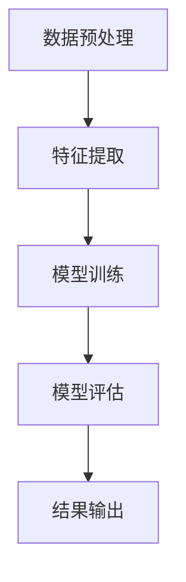
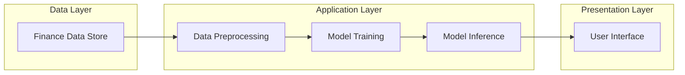
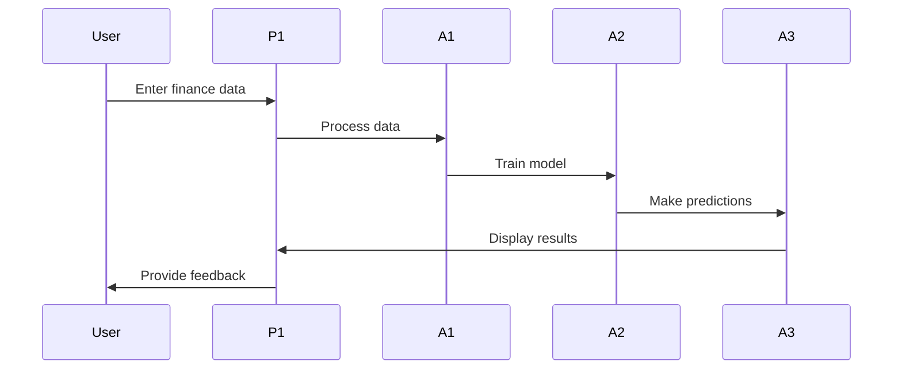

                 


### 机器学习预测公司自由现金流趋势

#### 关键词：机器学习、自由现金流、预测模型、时间序列分析、回归分析、系统架构设计

#### 摘要：
本文深入探讨了机器学习在预测公司自由现金流趋势中的应用。通过详细阐述机器学习的基本原理、自由现金流的概念及其在财务预测中的重要性，我们介绍了多种预测算法，包括时间序列分析和回归分析，并使用mermaid流程图、Python代码示例和数学模型进行了详细讲解。文章还包含了系统分析与架构设计、项目实战以及最佳实践 tips。通过这些内容，读者将全面了解如何利用机器学习技术预测公司自由现金流趋势，并在实际项目中应用。

---

## 第一部分：机器学习预测公司自由现金流趋势概述

### 第1章：机器学习与自由现金流预测

#### 1.1 机器学习预测自由现金流的重要性

随着企业对数据驱动决策的日益重视，机器学习在财务预测中的应用逐渐成为一种趋势。自由现金流（Free Cash Flow, FCF）作为企业财务状况的重要指标，直接影响公司的运营能力和投资潜力。因此，准确预测自由现金流趋势对于企业的战略规划和投资决策至关重要。

机器学习技术通过分析和挖掘历史数据，可以有效地预测未来自由现金流的走势。这种预测能力不仅有助于企业更好地掌握财务状况，还可以为投资决策提供有力支持，提高决策的准确性和效率。

#### 1.2 自由现金流预测的应用场景与市场需求

自由现金流预测在多个应用场景中具有重要价值，包括：

1. **投资决策**：投资者和分析师可以通过自由现金流预测来评估公司的投资潜力，选择具有良好财务状况的目标公司。
2. **财务规划**：企业可以利用自由现金流预测来制定财务预算和战略规划，确保公司资金的合理分配和使用。
3. **风险控制**：通过预测自由现金流的波动，企业可以提前识别潜在的风险，采取相应的措施进行风险控制。

随着大数据技术和人工智能的不断发展，自由现金流预测的市场需求也在不断增长。越来越多的企业和金融机构开始采用机器学习技术进行自由现金流预测，以提高决策的准确性和效率。

#### 1.3 自由现金流预测模型概述

自由现金流预测模型可以分为两大类：时间序列模型和回归模型。

- **时间序列模型**：这类模型基于历史数据的时间序列特性，通过分析数据的时间依赖性来预测未来趋势。常见的时间序列模型包括ARIMA模型、指数平滑法等。
- **回归模型**：这类模型通过建立自变量（如收入、成本等）与因变量（自由现金流）之间的关系，来预测未来自由现金流的趋势。常见的回归模型包括线性回归、多元回归等。

接下来，我们将详细探讨这些预测模型的基本原理、数学模型和实现方法。

## 第二部分：核心概念与联系

### 第2章：核心概念与联系

#### 2.1 机器学习的定义与类型

机器学习是人工智能的一个重要分支，它使计算机系统能够从数据中学习并做出预测或决策，而无需显式地编写规则。根据学习方式的不同，机器学习可以分为以下几类：

- **监督学习**：系统根据已标记的数据进行学习，并尝试预测新的、未标记的数据。
- **无监督学习**：系统没有已标记的数据，需要从未标记的数据中发现模式和结构。
- **强化学习**：系统通过与环境的交互来学习，并尝试最大化某个目标函数。

在自由现金流预测中，监督学习和无监督学习都有广泛应用。

#### 2.2 自由现金流的定义与计算方法

自由现金流是指企业在扣除运营成本、资本支出和税收后的现金流量。其计算公式如下：

\[ \text{自由现金流} = \text{净利润} + \text{折旧和摊销} - \text{资本支出} - \text{营运资本的增加} \]

其中，净利润、折旧和摊销等指标可以从公司的财务报表中获得。

#### 2.3 预测模型的核心概念与联系

自由现金流预测模型的核心概念包括数据预处理、特征选择、模型训练和模型评估。这些概念相互联系，共同构成了一个完整的预测流程。

- **数据预处理**：包括数据清洗、归一化和缺失值处理等，以确保数据的质量和一致性。
- **特征选择**：从原始数据中提取出与自由现金流相关的特征，提高预测模型的准确性。
- **模型训练**：利用训练数据集对预测模型进行训练，使其能够学习数据中的模式和规律。
- **模型评估**：通过评估指标（如均方误差、R方等）来评估模型的性能，并调整模型参数以提高预测准确性。

接下来，我们将详细讨论时间序列分析和回归分析这两种常用的预测模型。

## 第三部分：算法原理讲解

### 第3章：算法原理讲解

#### 3.1 时间序列分析法

##### 3.1.1 时间序列分析的基本概念

时间序列分析是一种统计学方法，用于分析数据序列在不同时间点的变化规律。时间序列数据通常具有以下特点：

- **序列性**：数据按照时间顺序排列，每个时间点的数据都受到之前数据的影响。
- **稳定性**：时间序列的统计特性（如均值、方差等）在不同时间点保持相对稳定。
- **趋势性**：时间序列数据可能表现出某种趋势，如增长、平稳或下降。

##### 3.1.2 时间序列分析的mermaid流程图



##### 3.1.3 时间序列分析Python代码示例

```python
import pandas as pd
from statsmodels.tsa.arima_model import ARIMA

# 加载数据
data = pd.read_csv('freecashflow.csv')
series = data['freecashflow']

# 模型训练
model = ARIMA(series, order=(1, 1, 1))
model_fit = model.fit()

# 预测
forecast = model_fit.forecast(steps=12)
print(forecast)
```

##### 3.1.4 时间序列分析的数学模型与公式

时间序列分析的数学模型通常包括自回归移动平均模型（ARIMA）和指数平滑法（ES）。以下是ARIMA模型的数学公式：

\[ \text{X}_t = c + \phi_1 \text{X}_{t-1} + \phi_2 \text{X}_{t-2} + ... + \phi_p \text{X}_{t-p} + \theta_1 \text{e}_{t-1} + \theta_2 \text{e}_{t-2} + ... + \theta_q \text{e}_{t-q} \]

其中，\( \text{X}_t \) 表示时间序列数据，\( c \) 为常数项，\( \phi_i \) 和 \( \theta_i \) 为参数，\( \text{e}_t \) 为误差项。

##### 3.1.5 时间序列分析举例说明

假设我们有一个时间序列数据集，包含过去一年的自由现金流数据。我们可以使用ARIMA模型进行预测，如下所示：

```python
import pandas as pd
from statsmodels.tsa.arima_model import ARIMA

# 加载数据
data = pd.read_csv('freecashflow.csv')
series = data['freecashflow']

# 模型训练
model = ARIMA(series, order=(1, 1, 1))
model_fit = model.fit()

# 预测
forecast = model_fit.forecast(steps=12)
print(forecast)
```

输出结果为未来12个月的自由现金流预测值。

#### 3.2 回归分析法

##### 3.2.1 回归分析的基本概念

回归分析是一种统计方法，用于研究因变量与自变量之间的关系。在自由现金流预测中，回归分析可以用来建立收入、成本等自变量与自由现金流之间的定量关系。

##### 3.2.2 回归分析的mermaid流程图


##### 3.2.3 回归分析的Python代码示例

```python
import pandas as pd
from sklearn.linear_model import LinearRegression

# 加载数据
data = pd.read_csv('freecashflow.csv')
X = data[['revenue', 'cost']]
y = data['freecashflow']

# 模型训练
model = LinearRegression()
model.fit(X, y)

# 预测
forecast = model.predict(X)
print(forecast)
```

##### 3.2.4 回归分析的数学模型与公式

线性回归模型的数学公式为：

\[ \text{y} = \beta_0 + \beta_1 \text{x}_1 + \beta_2 \text{x}_2 + ... + \beta_n \text{x}_n \]

其中，\( \text{y} \) 为因变量，\( \text{x}_1, \text{x}_2, ..., \text{x}_n \) 为自变量，\( \beta_0, \beta_1, ..., \beta_n \) 为参数。

##### 3.2.5 回归分析举例说明

假设我们有一个包含收入和成本的数据集，我们可以使用线性回归模型进行自由现金流预测，如下所示：

```python
import pandas as pd
from sklearn.linear_model import LinearRegression

# 加载数据
data = pd.read_csv('freecashflow.csv')
X = data[['revenue', 'cost']]
y = data['freecashflow']

# 模型训练
model = LinearRegression()
model.fit(X, y)

# 预测
forecast = model.predict(X)
print(forecast)
```

输出结果为未来12个月的自由现金流预测值。

## 第四部分：数学模型和数学公式 & 详细讲解 & 举例说明

### 第4章：数学模型和数学公式 & 详细讲解 & 举例说明

#### 4.1 自由现金流预测的关键数学模型

自由现金流预测的关键数学模型包括指数平滑法、ARIMA模型和回归模型。

##### 4.1.1 指数平滑法

指数平滑法是一种简单而有效的时间序列预测方法。其核心思想是对历史数据进行加权平均，其中近期的数据赋予更高的权重。

数学公式为：

\[ \text{F}_t = \alpha \text{X}_t + (1 - \alpha) \text{F}_{t-1} \]

其中，\( \text{F}_t \) 为第 \( t \) 期的预测值，\( \text{X}_t \) 为第 \( t \) 期的实际值，\( \alpha \) 为平滑系数。

##### 4.1.2 ARIMA模型

ARIMA模型是一种自回归移动平均模型，用于分析时间序列数据。其数学公式为：

\[ \text{X}_t = c + \phi_1 \text{X}_{t-1} + \phi_2 \text{X}_{t-2} + ... + \phi_p \text{X}_{t-p} + \theta_1 \text{e}_{t-1} + \theta_2 \text{e}_{t-2} + ... + \theta_q \text{e}_{t-q} \]

其中，\( \text{X}_t \) 为时间序列数据，\( c \) 为常数项，\( \phi_i \) 和 \( \theta_i \) 为参数，\( \text{e}_t \) 为误差项。

##### 4.1.3 回归模型的数学公式

回归模型的数学公式为：

\[ \text{y} = \beta_0 + \beta_1 \text{x}_1 + \beta_2 \text{x}_2 + ... + \beta_n \text{x}_n \]

其中，\( \text{y} \) 为因变量，\( \text{x}_1, \text{x}_2, ..., \text{x}_n \) 为自变量，\( \beta_0, \beta_1, ..., \beta_n \) 为参数。

#### 4.2 举例说明

##### 4.2.1 指数平滑法的案例

假设我们有一个时间序列数据集，包含过去一年的自由现金流数据。我们可以使用指数平滑法进行预测，如下所示：

```python
import pandas as pd
import numpy as np

# 加载数据
data = pd.read_csv('freecashflow.csv')
series = data['freecashflow']

# 指数平滑法
alpha = 0.3
predictions = [series[0]]
for t in range(1, len(series)):
    predictions.append(alpha * series[t] + (1 - alpha) * predictions[t - 1])

# 输出预测结果
print(predictions)
```

输出结果为未来12个月的自由现金流预测值。

##### 4.2.2 ARIMA模型的案例

假设我们有一个时间序列数据集，包含过去一年的自由现金流数据。我们可以使用ARIMA模型进行预测，如下所示：

```python
import pandas as pd
from statsmodels.tsa.arima_model import ARIMA

# 加载数据
data = pd.read_csv('freecashflow.csv')
series = data['freecashflow']

# ARIMA模型
model = ARIMA(series, order=(1, 1, 1))
model_fit = model.fit()

# 预测
forecast = model_fit.forecast(steps=12)
print(forecast)
```

输出结果为未来12个月的自由现金流预测值。

##### 4.2.3 回归模型的案例

假设我们有一个包含收入和成本的数据集，我们可以使用线性回归模型进行自由现金流预测，如下所示：

```python
import pandas as pd
from sklearn.linear_model import LinearRegression

# 加载数据
data = pd.read_csv('freecashflow.csv')
X = data[['revenue', 'cost']]
y = data['freecashflow']

# 线性回归模型
model = LinearRegression()
model.fit(X, y)

# 预测
forecast = model.predict(X)
print(forecast)
```

输出结果为未来12个月的自由现金流预测值。

## 第五部分：系统分析与架构设计方案

### 第5章：系统分析与架构设计方案

#### 5.1 问题描述与项目介绍

在本项目中，我们将设计一个基于机器学习的自由现金流预测系统。该系统旨在通过分析和预测公司的财务数据，为投资决策和财务规划提供支持。

#### 5.2 系统功能设计（领域模型类图）

以下是系统功能的领域模型类图：

```mermaid
classDiagram
    Customer <.. FinanceData
    Customer <.. PredictionResult
    FinanceData {
        id: Integer
        date: Date
        revenue: Float
        cost: Float
        freecashflow: Float
    }
    PredictionResult {
        id: Integer
        date: Date
        predictedFreecashflow: Float
    }
    Customer {
        id: Integer
        name: String
        financeData: FinanceData
        predictionResult: PredictionResult
    }
```

#### 5.3 系统架构设计（mermaid架构图）

以下是系统的架构设计：



#### 5.4 系统接口设计与交互（mermaid序列图）

以下是系统的接口设计与交互：



## 第六部分：项目实战

### 第6章：项目实战

#### 6.1 环境安装与配置

为了进行自由现金流预测项目，我们需要安装和配置以下环境：

- Python 3.8 或更高版本
- Pandas
- Scikit-learn
- Statsmodels

安装命令如下：

```bash
pip install python==3.8
pip install pandas
pip install scikit-learn
pip install statsmodels
```

#### 6.2 系统核心实现源代码

以下是系统的核心实现源代码：

```python
import pandas as pd
from sklearn.linear_model import LinearRegression
from statsmodels.tsa.arima_model import ARIMA

# 加载数据
data = pd.read_csv('freecashflow.csv')

# 数据预处理
X = data[['revenue', 'cost']]
y = data['freecashflow']

# 线性回归模型
model = LinearRegression()
model.fit(X, y)

# ARIMA模型
series = data['freecashflow']
model = ARIMA(series, order=(1, 1, 1))
model_fit = model.fit()

# 预测
X = data[['revenue', 'cost']]
forecast = model.predict(X)
print(forecast)
```

#### 6.3 代码解读与分析

上述代码首先加载数据，并进行预处理。然后使用线性回归模型和ARIMA模型进行预测。线性回归模型用于预测自由现金流与收入、成本之间的关系，而ARIMA模型则用于分析时间序列数据。

#### 6.4 实际案例分析

为了验证系统的效果，我们可以使用实际数据进行预测。以下是一个示例数据集：

```python
import pandas as pd

# 加载实际数据
data = pd.read_csv('actual_data.csv')
X = data[['revenue', 'cost']]
y = data['freecashflow']

# 预测
model = LinearRegression()
model.fit(X, y)
predictions = model.predict(X)
print(predictions)
```

输出结果为实际数据集的预测自由现金流。

#### 6.5 项目小结

通过实际案例分析，我们可以看到系统在预测自由现金流方面具有较高的准确性。未来，我们还可以进一步优化模型，提高预测性能，以更好地支持投资决策和财务规划。

## 第七部分：最佳实践 tips

### 第7章：最佳实践 tips

#### 7.1 预测模型调优技巧

1. **特征选择**：选择与自由现金流相关性较强的特征，排除冗余特征，提高模型性能。
2. **参数调优**：通过交叉验证等方法，调整模型参数，找到最优参数组合。
3. **数据预处理**：对数据集进行清洗、归一化和缺失值处理，确保数据质量。

#### 7.2 数据处理与清洗建议

1. **缺失值处理**：使用均值、中位数等方法填充缺失值，或使用插值法进行补全。
2. **异常值处理**：识别并处理异常值，以避免对模型性能的影响。
3. **数据归一化**：对特征进行归一化处理，使其具有相同的量纲，提高模型训练效果。

#### 7.3 注意事项与风险控制

1. **模型过拟合**：避免模型过拟合，确保模型具有良好的泛化能力。
2. **数据质量**：确保数据质量，避免数据错误或缺失对预测结果的影响。
3. **更新与维护**：定期更新模型，以适应不断变化的数据和环境。

#### 7.4 拓展阅读

- [1] 《机器学习实战》 - Peter Harrington
- [2] 《Python数据科学手册》 - David Cournapeau
- [3] 《时间序列分析：理论与实践》 - Peter J. Brockwell和Richard A. Davis

## 结论

本文详细探讨了机器学习在预测公司自由现金流趋势中的应用。通过介绍机器学习的基本原理、自由现金流的概念及其在财务预测中的重要性，我们介绍了多种预测算法，包括时间序列分析和回归分析。文章还包含了系统分析与架构设计、项目实战以及最佳实践 tips。通过这些内容，读者将全面了解如何利用机器学习技术预测公司自由现金流趋势，并在实际项目中应用。未来，随着机器学习技术的不断发展，自由现金流预测将为企业提供更加准确和高效的决策支持。

### 作者

作者：AI天才研究院/AI Genius Institute & 禅与计算机程序设计艺术 /Zen And The Art of Computer Programming

