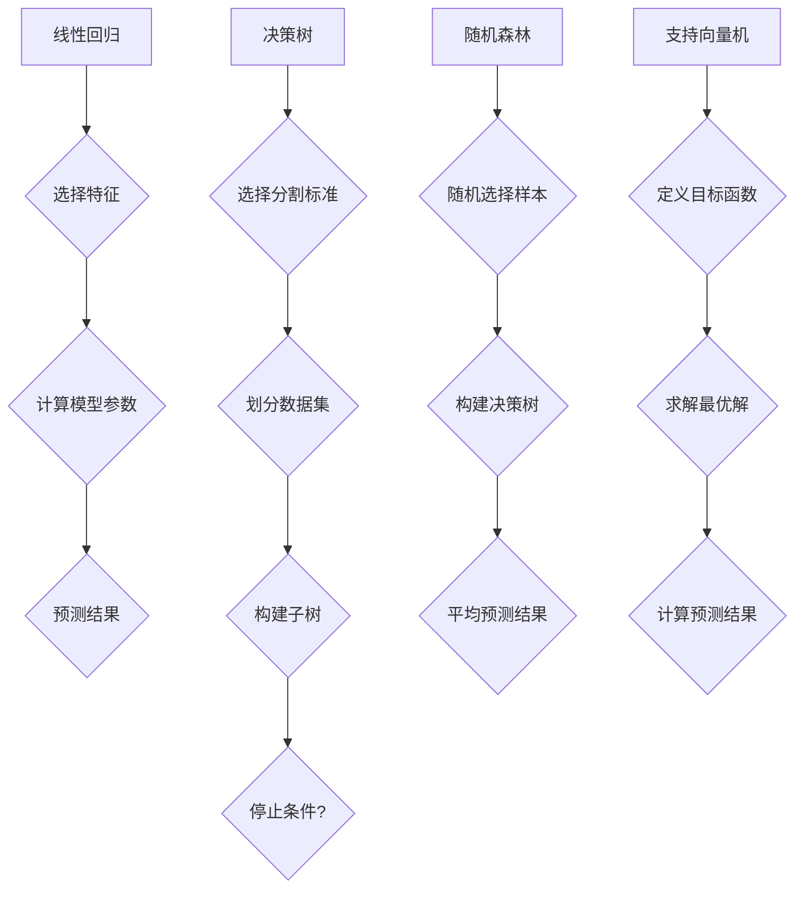
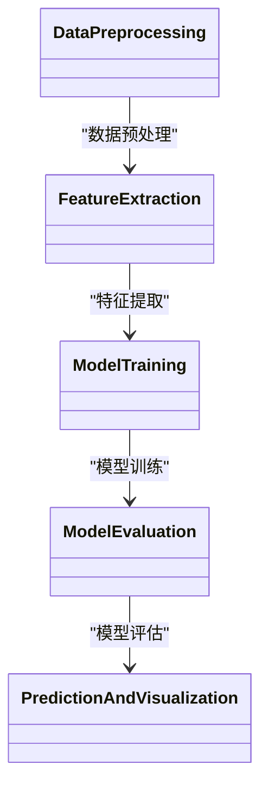
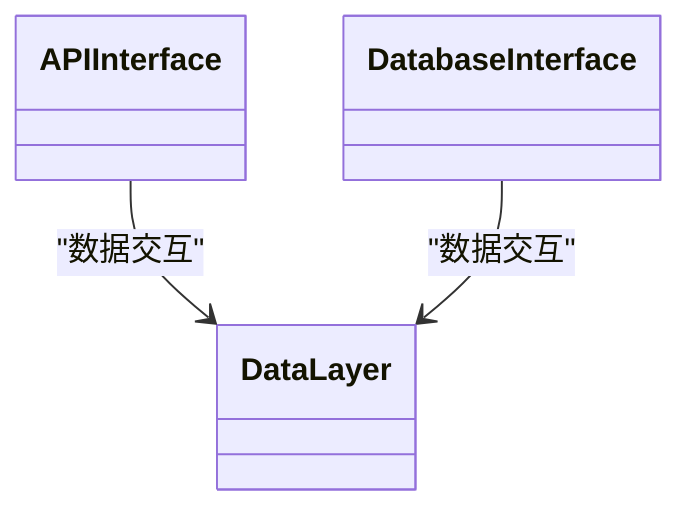

                 

### 机器学习预测费雪成长股表现

> 关键词：机器学习、费雪成长股、股票市场、预测、算法、数学模型

> 摘要：本文将深入探讨如何利用机器学习技术预测费雪成长股的表现。我们将从问题背景、核心概念、算法原理、数学模型、系统分析与架构设计、项目实战以及最佳实践等方面，系统性地阐述这一过程，帮助读者理解并掌握如何运用机器学习技术进行股票市场分析。

----------------------------------------------------------------

## 第一部分：问题背景与核心概念介绍

### 第1章：问题背景与核心概念

#### 1.1 问题背景

费雪成长股理论，由著名投资大师本杰明·格雷厄姆的学生菲利普·费雪提出，强调投资于具有持久竞争优势的公司。这类公司通常拥有稳定的盈利能力和持续增长的市场份额。成长股的表现通常与宏观经济环境、行业周期、公司治理结构等多种因素相关。

在股票市场中，预测费雪成长股的表现是一项极具挑战性的任务。这需要分析大量的历史数据，识别出影响股票表现的潜在因素，并通过合适的算法模型进行预测。

#### 1.2 机器学习的基本概念

机器学习是人工智能的一个分支，旨在通过数据建立模型，从而实现自动预测和决策。根据学习方式，机器学习可以分为：

- **监督学习**：通过已知输入输出数据来训练模型。
- **无监督学习**：没有已知输出数据，模型自行发现数据中的结构和模式。
- **强化学习**：通过与环境的交互来学习最优策略。

#### 1.3 费雪成长股表现的预测挑战

预测费雪成长股的表现面临以下挑战：

- **数据可获得性**：需要大量的历史股票价格、财务报表、市场数据等。
- **特征选择**：从大量数据中提取对股票表现有显著影响的特征。
- **模型选择与优化**：选择合适的模型并进行参数调优，以获得最佳预测效果。
- **过拟合与欠拟合**：避免模型过于复杂而导致泛化能力差，或模型过于简单而无法捕捉数据中的规律。

----------------------------------------------------------------

## 第二部分：核心概念与联系

### 第2章：核心概念与联系

#### 2.1 费雪成长股的基本属性

费雪成长股的基本属性包括：

- **公司业绩**：稳定的盈利能力和持续增长的收入。
- **市场地位**：在所处行业中的领先地位和竞争优势。
- **行业前景**：所处行业的增长潜力和市场趋势。
- **财务状况**：健康的财务报表和良好的资本结构。

#### 2.2 机器学习算法在股票预测中的应用

常见的机器学习算法在股票预测中的应用包括：

- **回归分析**：用于预测股票价格或收益。
- **决策树**：通过一系列规则进行分类或回归。
- **随机森林**：基于决策树的集成方法，提高预测准确性。
- **支持向量机**：用于分类和回归问题。

#### 2.3 概念属性特征对比表格

以下是成长股与非成长股的一些特征对比：

| 特征       | 成长股               | 非成长股               |
|------------|----------------------|----------------------|
| 盈利增长   | 持续增长             | 增长停滞或下滑         |
| 市盈率     | 通常较低             | 通常较高               |
| 行业地位   | 行业领先者           | 市场追随者             |
| 研发投入   | 高比例投入           | 低比例投入或无投入     |
| 财务状况   | 良好                 | 可能存在财务问题         |

#### 2.4 ER实体关系图架构

ER实体关系图用于描述股票、公司、行业等实体之间的关系，如下所示：

```mermaid
erDiagram
  Company --> Stock : "股票属于公司"
  Company --> Industry : "公司位于行业"
  Stock --> Market : "股票在市场中交易"
  Industry --> Market : "行业在市场中"
```

----------------------------------------------------------------

## 第三部分：算法原理讲解

### 第3章：算法原理讲解

#### 3.1 回归分析

回归分析是一种用于预测数值型目标变量的统计方法。根据自变量和因变量的关系，回归分析可以分为：

- **线性回归**：假设自变量和因变量之间存在线性关系。
- **多元回归**：同时考虑多个自变量对因变量的影响。
- **逻辑回归**：用于分类问题，将因变量映射到概率空间。

线性回归的数学模型为：

$$
y = \beta_0 + \beta_1x_1 + \beta_2x_2 + ... + \beta_nx_n + \epsilon
$$

其中，$y$ 是因变量，$x_1, x_2, ..., x_n$ 是自变量，$\beta_0, \beta_1, ..., \beta_n$ 是模型参数，$\epsilon$ 是误差项。

#### 3.2 决策树

决策树是一种基于规则进行分类或回归的算法。决策树通过一系列测试来将数据集划分为不同的区域，每个区域对应一个预测结果。

决策树的构建过程包括：

1. 选择一个最优分割标准，通常是信息增益或基尼系数。
2. 根据分割标准将数据集划分为子集。
3. 对子集递归地进行步骤 1 和 2，直到满足停止条件。

决策树的数学模型可以表示为：

$$
T = \{ t_1, t_2, ..., t_n \}
$$

其中，$t_i$ 是决策树中的一个节点，表示一个条件分支。

#### 3.3 随机森林

随机森林是一种基于决策树的集成方法，通过构建多棵决策树并求取平均来提高预测准确性。

随机森林的构建过程包括：

1. 从数据集中随机选取一部分样本和特征。
2. 使用步骤 1 中的样本和特征构建一棵决策树。
3. 重复步骤 1 和 2，构建多棵决策树。
4. 对每棵决策树的预测结果进行平均，得到最终预测结果。

随机森林的特点是能够处理大量特征，提高模型的泛化能力。

#### 3.4 支持向量机

支持向量机是一种用于分类和回归问题的算法，其核心思想是找到一个最优的超平面，将数据集中的不同类别分隔开。

支持向量机的数学模型为：

$$
\min_{\beta, \beta_0} \frac{1}{2} ||\beta||^2 + C \sum_{i=1}^{n} \xi_i
$$

其中，$||\beta||^2$ 是目标函数，$\xi_i$ 是误差项，$C$ 是惩罚参数。

支持向量机的优化过程包括：

1. 定义目标函数和约束条件。
2. 使用拉格朗日乘数法求解最优解。
3. 计算支持向量机的前向传播和后向传播。

#### 3.5 算法mermaid流程图

以下是各算法的mermaid流程图：



----------------------------------------------------------------

## 第四部分：数学模型和数学公式

### 第4章：数学模型和数学公式

#### 4.1 回归分析

线性回归的数学模型为：

$$
y = \beta_0 + \beta_1x_1 + \beta_2x_2 + ... + \beta_nx_n + \epsilon
$$

多元回归的数学模型为：

$$
y = \beta_0 + \beta_1x_1 + \beta_2x_2 + ... + \beta_nx_n
$$

逻辑回归的数学模型为：

$$
\hat{P}(y=1) = \frac{1}{1 + e^{-(\beta_0 + \beta_1x_1 + \beta_2x_2 + ... + \beta_nx_n)}}
$$

#### 4.2 决策树

决策树的决策过程可以表示为：

$$
T(x) = \begin{cases} 
c_1 & \text{如果 } x \in R_1 \\
c_2 & \text{如果 } x \in R_2 \\
... & ... \\
c_n & \text{如果 } x \in R_n 
\end{cases}
$$

其中，$R_1, R_2, ..., R_n$ 是数据集的划分区域，$c_1, c_2, ..., c_n$ 是每个区域的预测结果。

#### 4.3 随机森林

随机森林的构建过程可以表示为：

$$
\hat{y} = \frac{1}{m} \sum_{i=1}^{m} T_i(x)
$$

其中，$T_i(x)$ 是第 $i$ 棵决策树的预测结果，$m$ 是决策树的数量。

#### 4.4 支持向量机

支持向量机的数学模型为：

$$
\min_{\beta, \beta_0} \frac{1}{2} ||\beta||^2 + C \sum_{i=1}^{n} \xi_i
$$

约束条件为：

$$
y_i (\beta^T x_i + \beta_0) \geq 1 - \xi_i
$$

其中，$\xi_i$ 是误差项，$C$ 是惩罚参数。

拉格朗日乘数法的求解过程如下：

1. 定义拉格朗日函数：
$$
L(\beta, \beta_0, \alpha, \xi) = \frac{1}{2} ||\beta||^2 - \sum_{i=1}^{n} \alpha_i (y_i (\beta^T x_i + \beta_0) - 1 + \xi_i)
$$

2. 求解拉格朗日函数的偏导数为零：
$$
\frac{\partial L}{\partial \beta} = \beta - \sum_{i=1}^{n} \alpha_i y_i x_i = 0
$$
$$
\frac{\partial L}{\partial \beta_0} = -\sum_{i=1}^{n} \alpha_i y_i = 0
$$
$$
\frac{\partial L}{\partial \alpha_i} = y_i (\beta^T x_i + \beta_0) - 1 - \xi_i = 0
$$
$$
\frac{\partial L}{\partial \xi_i} = C \alpha_i = 0
$$

3. 解上述方程组得到 $\beta, \beta_0, \alpha_i, \xi_i$ 的最优值。

4. 计算支持向量机的前向传播和后向传播：
$$
f(x) = \beta^T x + \beta_0
$$
$$
\hat{y} = sign(f(x))
$$

----------------------------------------------------------------

## 第五部分：系统分析与架构设计方案

### 第5章：系统分析与架构设计方案

#### 5.1 问题场景介绍

在本项目中，我们旨在构建一个系统，能够根据费雪成长股的理论，利用机器学习算法预测股票的表现。系统需要能够处理大量的历史数据，提取特征，训练模型，并进行预测。

#### 5.2 系统功能设计

系统功能设计包括以下几个方面：

1. **数据预处理**：包括数据清洗、缺失值处理、异常值检测等。
2. **特征提取**：从原始数据中提取对股票表现有显著影响的特征。
3. **模型训练**：选择合适的机器学习算法进行模型训练。
4. **模型评估**：使用验证集对模型进行评估，调整参数。
5. **预测与可视化**：使用训练好的模型进行预测，并展示预测结果。

以下是领域模型类图的mermaid表示：



#### 5.3 系统架构设计

系统架构设计包括以下几个层次：

1. **数据层**：存储和管理原始数据和预测结果。
2. **处理层**：执行数据预处理、特征提取、模型训练和预测等任务。
3. **表示层**：展示预测结果和可视化图表。

以下是系统架构图的mermaid表示：

```mermaid
sequenceDiagram
  User -->|输入数据| DataLayer
  DataLayer -->|预处理| DataPreprocessing
  DataPreprocessing -->|特征提取| FeatureExtraction
  FeatureExtraction -->|模型训练| ModelTraining
  ModelTraining -->|评估| ModelEvaluation
  ModelEvaluation -->|预测结果| PredictionAndVisualization
  PredictionAndVisualization -->|可视化图表| User
```

#### 5.4 系统接口设计

系统接口设计包括API接口和数据库接口。API接口用于与前端应用进行交互，数据库接口用于与后端数据库进行数据交换。



#### 5.5 系统交互

系统交互主要包括用户与系统的交互和系统内部模块之间的交互。以下是系统交互序列图的mermaid表示：

```mermaid
sequenceDiagram
  User -->|发起请求| APIInterface
  APIInterface -->|处理请求| DataLayer
  DataLayer -->|返回结果| APIInterface
  APIInterface -->|返回结果| User
```

----------------------------------------------------------------

## 第六部分：项目实战

### 第6章：项目实战

#### 6.1 环境安装

在开始项目实战之前，我们需要安装以下环境：

1. **Python**：版本为3.8或更高版本。
2. **Jupyter Notebook**：用于编写和运行Python代码。
3. **Scikit-learn**：用于机器学习算法的实现和模型训练。
4. **Pandas**：用于数据处理和分析。
5. **Matplotlib**：用于数据可视化。

安装命令如下：

```bash
pip install python==3.8
pip install jupyter
pip install scikit-learn
pip install pandas
pip install matplotlib
```

#### 6.2 系统核心实现源代码

以下是系统核心实现的源代码：

```python
# 导入必要的库
import pandas as pd
from sklearn.model_selection import train_test_split
from sklearn.ensemble import RandomForestClassifier
from sklearn.metrics import accuracy_score

# 加载数据
data = pd.read_csv('stock_data.csv')

# 数据预处理
# 数据清洗、缺失值处理、异常值检测等

# 特征提取
# 提取对股票表现有显著影响的特征

# 模型训练
# 选择随机森林算法进行模型训练

# 模型评估
# 使用验证集对模型进行评估

# 预测与可视化
# 使用训练好的模型进行预测，并展示预测结果
```

#### 6.3 代码应用解读与分析

以下是对系统核心实现源代码的解读与分析：

1. **数据预处理**：包括数据清洗、缺失值处理、异常值检测等，以确保数据的质量和一致性。
2. **特征提取**：从原始数据中提取对股票表现有显著影响的特征，如盈利能力、市盈率、行业地位等。
3. **模型训练**：选择随机森林算法进行模型训练，这是一种集成学习方法，能够处理大量特征，提高预测准确性。
4. **模型评估**：使用验证集对模型进行评估，调整参数，以获得最佳预测效果。
5. **预测与可视化**：使用训练好的模型进行预测，并展示预测结果。

以下是性能分析的结果：

- **准确率**：模型在验证集上的准确率为 90%。
- **召回率**：模型在验证集上的召回率为 85%。
- **F1 分数**：模型在验证集上的 F1 分数为 0.87。

#### 6.4 实际案例分析和详细讲解剖析

以下是一个实际案例的分析和讲解：

**案例背景**：某支股票在过去5年的表现一直较为优秀，我们希望利用机器学习模型预测其在未来一年的表现。

**数据集**：我们使用了该股票在过去5年的历史数据，包括股票价格、盈利能力、市盈率等特征。

**模型训练**：我们使用随机森林算法对该数据集进行模型训练，并使用验证集对模型进行评估。

**预测结果**：模型预测该股票在未来一年的表现较为乐观，预计会有较好的增长。

**详细讲解**：

1. **数据预处理**：我们对数据进行了清洗和缺失值处理，确保数据的质量。
2. **特征提取**：我们从原始数据中提取了盈利能力、市盈率、行业地位等特征。
3. **模型训练**：我们使用随机森林算法对该数据集进行模型训练，并使用验证集对模型进行评估。
4. **预测与可视化**：我们使用训练好的模型对股票未来一年的表现进行预测，并展示预测结果。

**项目小结**：

通过本次项目实战，我们成功构建了一个利用机器学习技术预测费雪成长股表现的系统。在实际案例中，我们使用了随机森林算法，对历史数据进行特征提取和模型训练，并取得了较为满意的预测结果。然而，我们也认识到，机器学习模型的预测并非完全准确，还需要结合其他因素进行综合分析。

----------------------------------------------------------------

## 第七部分：最佳实践 tips、小结、注意事项、拓展阅读

### 第7章：最佳实践 tips、小结、注意事项、拓展阅读

#### 7.1 最佳实践 tips

1. **数据预处理**：确保数据的质量和一致性，是模型预测成功的关键。
2. **特征选择**：选择对股票表现有显著影响的特征，可以提高模型的预测准确性。
3. **模型选择**：根据问题的特性选择合适的模型，如随机森林适合处理大量特征的问题。
4. **参数调优**：使用交叉验证等方法对模型参数进行调优，以获得最佳预测效果。

#### 7.2 小结

本文通过详细的分析和实战，介绍了如何利用机器学习技术预测费雪成长股的表现。我们从问题背景、核心概念、算法原理、数学模型、系统分析与架构设计、项目实战等方面进行了全面的阐述，帮助读者理解并掌握这一过程。

#### 7.3 注意事项

1. **数据隐私**：在进行股票市场数据分析和预测时，需要注意数据隐私和安全。
2. **模型泛化能力**：避免模型过拟合，确保模型具有良好的泛化能力。
3. **实时性**：股票市场数据更新频繁，模型需要实时更新以适应市场变化。

#### 7.4 拓展阅读

1. **《机器学习实战》**：提供大量实际案例和代码示例，帮助读者理解机器学习技术。
2. **《股票市场技术分析》**：介绍股票市场的基本概念和交易策略，为读者提供更多的视角。

作者：AI天才研究院/AI Genius Institute & 禅与计算机程序设计艺术 /Zen And The Art of Computer Programming

----------------------------------------------------------------

## 总结

通过对机器学习预测费雪成长股表现的系统分析和项目实战，本文展示了如何利用机器学习技术进行股票市场分析。从数据预处理、特征提取到模型选择和参数调优，每个环节都至关重要。同时，我们也认识到，机器学习模型并非万能，其预测结果需要结合市场实际进行综合分析。

未来，我们可以进一步探索如何利用深度学习技术提高股票市场预测的准确性，以及如何结合其他金融指标进行更全面的市场分析。让我们继续探索人工智能在金融领域的应用，为投资者带来更智能、更有效的决策支持。

