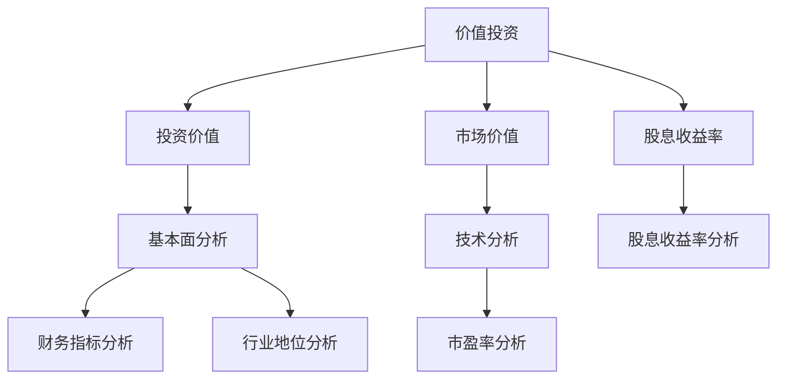
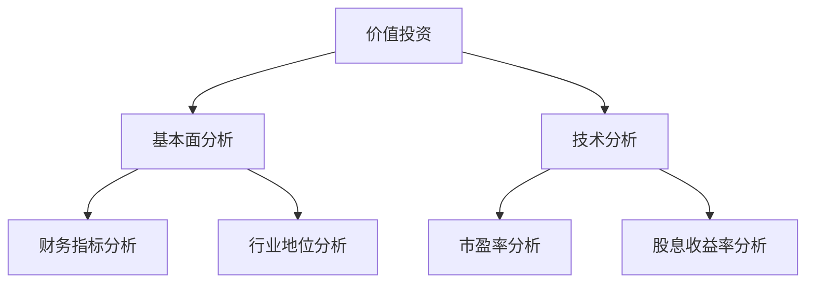

                 

# 杰里米·格兰瑟姆的价值投资新定义

> 关键词：价值投资，市场波动，新兴市场，策略与实践，案例分析

> 摘要：本文旨在探讨杰里米·格兰瑟姆对价值投资的新定义，分析其在当前市场环境下的挑战与机遇。文章将从价值投资的背景与挑战、核心概念、策略与实践、新兴市场应用等方面进行深入剖析，并通过实际案例提供指导。

## 第1章 引言：价值投资的背景与挑战

### 1.1 问题背景

#### 1.1.1 价值投资的概念

价值投资是一种以企业内在价值为依据的投资策略，主张通过深入分析企业的基本面来确定其股票的真正价值。这一概念最早由本杰明·格雷厄姆在20世纪中叶提出，随后经过沃伦·巴菲特等投资大师的发展和完善，成为现代投资领域的重要理论。

#### 1.1.1.1 价值投资的历史

价值投资的历史可以追溯到20世纪30年代，本杰明·格雷厄姆在著作《聪明的投资者》中详细阐述了这一理念。随后，沃伦·巴菲特将价值投资理论付诸实践，成为全球最著名的投资者之一。

#### 1.1.1.2 价值投资的核心原则

价值投资的核心原则包括：

1. **买入价值被低估的股票**：通过深入分析企业的基本面，找到那些市场价格低于其内在价值的股票。
2. **长期持有**：价值投资者倾向于长期持有股票，等待市场认识到其内在价值。
3. **风险管理**：通过分散投资和合理配置资产来降低风险。

### 1.1.2 当前市场环境分析

#### 1.1.2.1 经济周期与市场波动

当前市场环境复杂多变，经济周期和市场波动对投资策略提出了新的挑战。价值投资者需要灵活应对经济周期中的不同阶段，例如经济衰退、复苏、过热等。

#### 1.1.2.2 技术变革与产业趋势

技术变革和产业趋势对传统价值投资提出了新的挑战。新兴行业和技术的崛起，可能导致传统行业的价值评估方法失效。

### 1.2 问题定义

#### 1.2.1 投资者面临的挑战

1. **信息不对称**：投资者难以获取所有相关信息，导致判断失误。
2. **情绪波动**：市场情绪波动可能导致投资者做出非理性决策。

#### 1.2.2 价值投资的具体问题

1. **市场误解与错判**：市场对某些企业的价值判断可能存在误解，导致投资者难以找到真正的价值投资机会。
2. **投资策略的长期坚持**：价值投资需要长期坚持，但投资者可能在短期内受到市场波动的影响而放弃。

### 1.3 价值投资的边界与外延

#### 1.3.1 价值投资的适用范围

价值投资适用于多种市场环境，包括成熟市场和新兴市场。

#### 1.3.1.1 不同市场环境下的适用性

在成熟市场中，价值投资策略较为有效。而在新兴市场，由于市场波动较大，价值投资策略需要更灵活的调整。

#### 1.3.1.2 价值投资与其他投资策略的比较

价值投资与其他投资策略（如成长投资、技术分析等）相比，具有更稳定的长期收益，但可能在短期内表现不佳。

#### 1.3.2 价值投资的限制条件

1. **投资者心理素质**：价值投资需要投资者具备良好的心理素质，能够承受市场波动。
2. **投资者的时间与精力**：价值投资需要对企业的基本面进行深入分析，需要投资者投入大量的时间和精力。

### 1.4 核心概念与联系

#### 1.4.1 主要概念解析

1. **价值与市场价值**：价值是企业的内在价值，市场价值是股票在市场上的价格。
2. **股息与股利收益率**：股息是公司向股东分配的利润，股利收益率是股息与股票价格的比率。

#### 1.4.1.2 概念属性特征对比表

| 概念        | 定义                                                         | 特征对比                   |
| ----------- | ------------------------------------------------------------ | -------------------------- |
| 价值        | 企业在正常运营情况下的真实价值。                             | 客观、长期、稳定           |
| 市场价值    | 股票在市场上的价格。                                         | 主观、短期、波动           |
| 股息收益率  | 股息与股票价格的比率。                                       | 反映投资回报率             |

## 第2章 价值投资的核心概念

### 2.1 价值投资原理

#### 2.1.1 价值投资的定义

价值投资是一种以企业内在价值为依据的投资策略，主张通过深入分析企业的基本面来确定其股票的真正价值。

#### 2.1.1.1 投资价值与市场价值

投资价值是企业的内在价值，市场价值是股票在市场上的价格。价值投资的目标是找到市场价格低于其内在价值的股票。

#### 2.1.1.2 投资价值评估方法

投资价值评估方法包括：

1. **基本面分析**：通过分析企业的财务报表、行业地位、竞争优势等来确定其价值。
2. **技术分析**：通过分析股票的历史价格和成交量等来确定其价值。

#### 2.1.2 价值投资的优势

1. **长期收益稳定性**：价值投资主张长期持有股票，能够降低市场波动对投资收益的影响。
2. **抗市场波动能力**：价值投资通过寻找低估的股票，能够在市场波动中保持相对稳定的表现。

### 2.2 价值评估方法

#### 2.2.1 基本面分析

基本面分析是通过分析企业的财务报表、行业地位、竞争优势等来确定其价值。

1. **财务指标分析**：包括盈利能力、偿债能力、运营能力等指标。
2. **行业地位分析**：分析企业在行业中的地位，如市场份额、竞争优势等。

#### 2.2.2 技术分析

技术分析是通过分析股票的历史价格和成交量等来确定其价值。

1. **市盈率分析**：市盈率是股票价格与每股收益的比率，用于衡量股票的估值水平。
2. **股息收益率分析**：股息收益率是股息与股票价格的比率，用于衡量投资的回报率。

### 2.3 价值投资与成长投资对比

#### 2.3.1 定义与区别

价值投资主张通过分析企业的基本面来确定其价值，成长投资则关注企业的成长性。

#### 2.3.1.1 价值投资的关注点

价值投资关注企业的内在价值，寻找低估的股票。

#### 2.3.1.2 成长投资的关注点

成长投资关注企业的成长性，寻找具有高速增长潜力的股票。

#### 2.3.2 适用性分析

1. **不同投资者的偏好**：价值投资适合风险偏好较低的投资者，成长投资适合风险偏好较高的投资者。
2. **市场环境的影响**：在市场波动较大时，价值投资策略可能更有效。

### 2.4 核心概念联系图

## 第3章 价值投资策略与实践

### 3.1 价值投资策略

#### 3.1.1 选股策略

价值投资的选股策略主要包括：

1. **价值股筛选**：通过基本面分析找到价值被低估的股票。
2. **成长股筛选**：通过成长性分析找到具有高速增长潜力的股票。

#### 3.1.1.1 价值股与成长股的筛选

1. **价值股筛选**：重点关注企业的盈利能力、偿债能力、运营能力等指标。
2. **成长股筛选**：重点关注企业的市场份额、竞争优势、创新能力等指标。

#### 3.1.1.2 股票估值方法的应用

股票估值方法包括：

1. **市盈率法**：通过比较市盈率与行业平均水平，判断股票的估值水平。
2. **股息收益率法**：通过计算股息收益率，判断股票的投资回报率。

#### 3.1.2 风险管理策略

价值投资的风险管理策略主要包括：

1. **分散投资**：通过分散投资降低单一股票的风险。
2. **组合投资**：通过组合投资降低整体投资组合的风险。

#### 3.1.2.1 市场波动应对策略

1. **短期波动**：通过分散投资和组合投资来降低短期波动的影响。
2. **长期波动**：通过长期持有和理性分析来应对长期波动。

### 3.2 价值投资实践案例

#### 3.2.1 案例介绍

1. **案例一：伯克希尔哈撒韦公司**
2. **案例二：约翰·博格尔的投资实践**

#### 3.2.2 案例分析

1. **成功要素分析**：通过深入分析企业的基本面，找到价值被低估的股票。
2. **遇到的挑战与解决方案**：在市场波动中保持冷静，坚持价值投资策略。

### 3.3 价值投资的最佳实践

#### 3.3.1 精选案例

1. **精选案例一：投资比亚迪**
2. **精选案例二：投资阿里巴巴**

#### 3.3.2 实践技巧

1. **价值投资的误区避免**：避免盲目跟风，坚持独立思考。
2. **如何持续学习与改进**：通过不断学习投资理论，提高自己的投资水平。

### 3.4 价值投资的核心要素总结

1. **选股策略**：通过基本面分析和股票估值方法，找到价值被低估的股票。
2. **风险管理**：通过分散投资和组合投资，降低投资风险。
3. **长期持有**：通过长期持有股票，实现投资价值的增值。

## 第4章 价值投资与新兴市场

### 4.1 新兴市场概述

#### 4.1.1 新兴市场的定义

新兴市场是指那些经济发展迅速、市场潜力巨大、但同时也存在较高风险的国家和地区。

#### 4.1.1.1 经济发展水平

新兴市场国家的经济发展水平相对较低，但增长潜力巨大。

#### 4.1.1.2 市场潜力与风险

新兴市场的市场潜力巨大，但也存在较高的政治风险、市场波动风险等。

#### 4.1.2 价值投资在新兴市场中的应用

价值投资在新兴市场中的应用主要包括：

1. **投资机会分析**：通过分析新兴市场的行业趋势、企业基本面等，找到具有投资价值的股票。
2. **投资策略调整**：在新兴市场中，价值投资者需要更加灵活地调整投资策略，以应对市场波动和风险。

### 4.2 新兴市场中的价值投资案例分析

#### 4.2.1 案例一：印度市场投资

1. **印度市场特点**：印度是新兴市场中的大国，市场潜力巨大，但同时也存在较高的市场波动风险。
2. **价值投资策略与实际效果**：通过基本面分析和股票估值方法，找到价值被低估的股票，实现投资回报。

#### 4.2.2 案例二：中国市场投资

1. **中国市场特点**：中国是新兴市场中的领军国家，市场潜力巨大，但同时也存在较高的市场波动风险。
2. **价值投资策略与实际效果**：通过基本面分析和股票估值方法，找到价值被低估的股票，实现投资回报。

### 4.3 新兴市场的风险与挑战

#### 4.3.1 投资风险识别

1. **政治风险**：新兴市场国家的政治风险较高，可能影响投资收益。
2. **市场波动风险**：新兴市场的市场波动较大，可能对投资组合造成较大影响。

#### 4.3.2 风险应对策略

1. **多元化投资**：通过多元化投资降低政治风险和市场波动风险。
2. **深入研究**：通过深入研究新兴市场的行业趋势、企业基本面等，降低投资风险。

## 结束语

杰里米·格兰瑟姆的价值投资新定义为我们提供了更全面、更实用的价值投资理念。在当前复杂多变的市场环境中，价值投资策略仍然具有重要的指导意义。通过深入分析企业的基本面，灵活应对市场波动，投资者可以在新兴市场中找到价值投资的机会。同时，投资者也需要不断提升自己的投资水平，以应对不断变化的市场环境。

### 作者：AI天才研究院/AI Genius Institute & 禅与计算机程序设计艺术 /Zen And The Art of Computer Programming

---

### 附录

1. **价值投资核心概念解析**
   - **投资价值**：企业未来现金流量的现值。
   - **市场价值**：投资者当前对股票的支付价格。
   - **股息收益率**：每年股息与股票价格的比率。

2. **价值投资与成长投资对比表格**

| 对比项       | 价值投资               | 成长投资               |
| ------------ | ---------------------- | ---------------------- |
| 关注点       | 企业内在价值           | 企业成长潜力           |
| 估值方法     | 基本面分析             | 成长性分析             |
| 投资策略     | 长期持有               | 快速交易               |
| 收益稳定性   | 较高                   | 较低                   |

3. **价值投资与新兴市场的联系图**

4. **价值投资策略与实践技巧**

   - **技巧一**：避免盲目跟风，独立分析企业基本面。
   - **技巧二**：长期持有，耐心等待市场认识到企业价值。
   - **技巧三**：多元化投资，降低单一股票的风险。

5. **扩展阅读**

   - 格雷厄姆，本杰明。《聪明的投资者》
   - 巴菲特，沃伦。《股东信》
   - 格兰瑟姆，杰里米。《价值投资新定义》

### 注意事项

- **谨慎评估**：在进行价值投资时，必须谨慎评估企业的基本面和市场价值。
- **持续学习**：价值投资需要不断学习和适应市场变化。
- **风险管理**：合理配置资产，降低投资风险。

