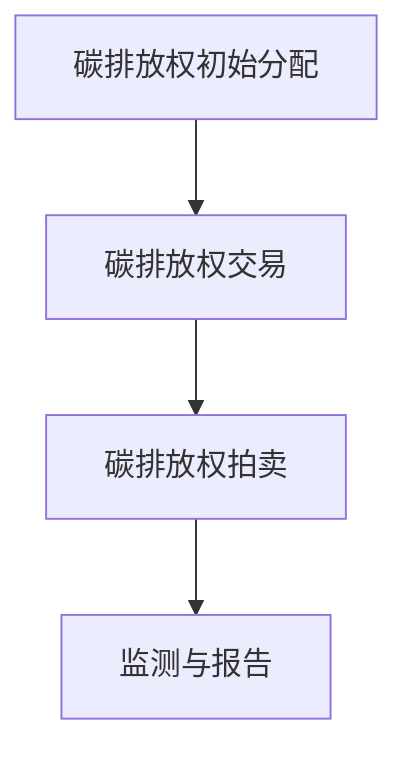
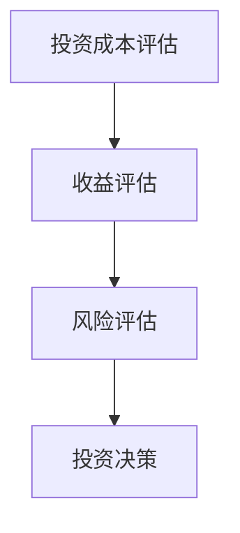
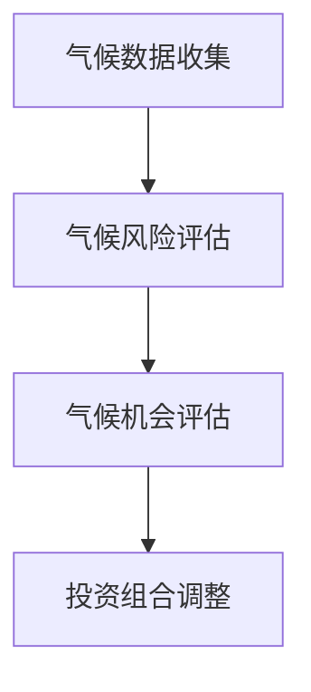

                 

## 文章标题：杰里米·格兰瑟姆的气候变化投资影响

关键词：气候变化、投资影响、碳排放权交易、可再生能源、气候风险

摘要：本文详细探讨了气候变化对投资领域的影响，以及如何通过碳排放权交易、可再生能源投资等手段应对这一挑战。杰里米·格兰瑟姆的见解为我们提供了宝贵的指导，帮助投资者更好地理解并应对气候变化带来的机遇与风险。

----------------------------------------------------------------

### 第一部分：引言

#### 1.1 气候变化投资背景

气候变化已成为全球关注的热点问题，其对经济、社会和环境的影响不容忽视。随着全球温室气体排放量的不断增加，气候变化带来的风险和挑战日益严峻。投资领域作为经济发展的重要驱动力，也在逐步认识到气候变化对其产生的影响，并开始积极寻求应对策略。

#### 1.1.1 全球气候变化趋势

过去几十年，全球气候变化趋势愈发明显。根据联合国气候变化框架公约（UNFCCC）的数据，全球平均气温已经上升了约1.1摄氏度。这一升温趋势给地球生态系统带来了巨大压力，导致海平面上升、极端天气事件增多、生物多样性减少等问题。

#### 1.1.2 气候变化对经济的影响

气候变化对全球经济产生了深远的影响。一方面，气候变化可能导致农作物产量下降、水资源短缺、基础设施受损等，进而影响经济增长。另一方面，气候变化也可能带来新的商机，如可再生能源、碳捕捉与存储技术等。因此，投资者需要密切关注气候变化对经济的影响，以便做出明智的投资决策。

#### 1.2 投资影响的背景

随着气候变化的加剧，投资者开始意识到其投资组合可能面临的风险。一些投资者已经开始将气候风险纳入其投资策略，以减少潜在损失。同时，政府和监管机构也加强了相关政策法规的制定和执行，以推动绿色金融的发展。

#### 1.2.1 投资者对气候变化的关注

越来越多的投资者开始关注气候变化问题，并将其纳入投资决策的考量因素。一些投资者甚至成立了专门的环境、社会和治理（ESG）投资部门，以评估和管理投资组合中的气候风险。

#### 1.2.2 政策和法规的变化

近年来，各国政府纷纷出台相关政策法规，以应对气候变化带来的挑战。例如，欧盟推出了《欧洲绿色协议》，旨在实现碳中和目标；美国也签署了《巴黎协定》，承诺减少温室气体排放。这些政策法规的变化对投资领域产生了深远影响，促使投资者重新评估其投资策略。

#### 1.3 书籍目的与结构

本书旨在为投资者提供关于气候变化投资影响的全面指导，帮助其更好地理解并应对这一挑战。全书分为五个部分，分别介绍了气候变化投资背景、核心概念与联系、算法原理与模型、系统分析与架构设计以及项目实战等内容。

#### 1.3.1 深入了解气候变化投资

本书第一部分将带领读者深入了解气候变化投资背景，包括全球气候变化趋势、气候变化对经济的影响、投资者对气候变化的关注以及政策和法规的变化。通过这一部分的学习，读者将能够全面了解气候变化投资的重要性和现状。

#### 1.3.2 指导投资决策

本书的第二部分将介绍与气候变化投资相关的核心概念，如碳排放权交易、可再生能源投资、气候风险与机会评估等。通过学习这些概念，读者将能够更好地理解气候变化投资的具体操作和实践。

#### 1.3.3 算法原理与模型

本书的第三部分将详细讲解碳排放权交易模型、可再生能源投资模型和气候风险与机会评估模型等。通过学习这些算法原理和模型，读者将能够掌握气候变化投资的核心技术和方法。

#### 1.3.4 系统分析与架构设计

本书的第四部分将介绍气候变化投资系统的场景、项目、功能设计、架构设计、接口设计和系统交互等内容。通过学习这一部分，读者将能够深入了解气候变化投资系统的构建方法和实践。

#### 1.3.5 项目实战

本书的最后一部分将带领读者进行项目实战，包括环境安装、系统核心实现、代码分析、实际案例分析、小结等内容。通过这一部分的实践，读者将能够将所学知识运用到实际项目中，提升自身投资能力和实践能力。

### 第二部分：核心概念与联系

#### 2.1 碳排放权交易

碳排放权交易是一种通过市场机制实现温室气体减排的经济手段。它通过分配和交易碳排放权，激励企业和个人减少温室气体排放。碳排放权交易的核心概念包括碳排放权、碳排放权交易市场、碳排放权分配等。

#### 2.1.1 碳排放权交易的基本概念

碳排放权是指企业或个人在一定时间内允许排放的二氧化碳等温室气体的总量。碳排放权交易市场是一个交易平台，企业可以通过买入或卖出碳排放权来调整自身的排放量。碳排放权分配是指政府根据一定的规则和标准，将碳排放权分配给企业或个人。

#### 2.1.2 碳排放权交易的机制

碳排放权交易机制包括配额制度、碳排放权交易市场和碳排放权分配等。配额制度是指政府根据国家或地区的减排目标，设定每个企业的排放限额。碳排放权交易市场通过交易碳排放权，实现企业间的减排量调剂。碳排放权分配是指政府根据一定的规则和标准，将碳排放权分配给企业或个人。

#### 2.2 可再生能源投资

可再生能源投资是指投资于太阳能、风能、水能、地热能等可再生能源领域。可再生能源投资具有清洁、低碳、可持续的特点，是应对气候变化的重要手段。可再生能源投资的核心概念包括可再生能源类型、可再生能源投资优势、可再生能源投资挑战等。

#### 2.2.1 可再生能源的类型和优势

可再生能源主要包括太阳能、风能、水能、地热能等。它们具有以下优势：一是清洁无污染，对环境影响较小；二是资源丰富，几乎取之不尽、用之不竭；三是可再生性强，能够在较短时间内恢复。

#### 2.2.2 可再生能源投资的挑战

可再生能源投资也面临一些挑战，如技术成熟度、成本、政策支持等。技术成熟度方面，一些可再生能源技术尚未完全成熟，需要进一步研发和改进。成本方面，可再生能源投资初期成本较高，可能影响投资回报。政策支持方面，各国政策差异较大，需要关注政策稳定性。

#### 2.3 气候风险与机会评估

气候风险与机会评估是指评估气候变化对投资组合可能产生的风险和机遇。气候风险包括气候变化对资产价值、收益、运营成本等方面的影响。气候机会则包括气候变化带来的新商机和投资机会。

#### 2.3.1 气候风险评估

气候风险评估是指评估气候变化对投资组合可能产生的风险。这需要分析气候变化的趋势、影响和潜在损失，为投资者提供决策依据。

#### 2.3.2 气候机会评估

气候机会评估是指评估气候变化可能带来的新商机和投资机会。这需要关注新兴技术、政策变化和市场需求等方面的变化，为投资者提供投资方向。

#### 2.4 概念属性特征对比表格

表1：碳排放权交易、可再生能源投资和气候风险与机会评估的核心概念属性特征对比

| 概念           | 属性特征                                                                                                           |
|--------------|------------------------------------------------------------------------------------------------------------|
| 碳排放权交易   | 1. 碳排放权：允许排放的二氧化碳等温室气体总量<br>2. 碳排放权交易市场：交易平台，实现碳排放权买卖<br>3. 碳排放权分配：政府分配碳排放权的方法和规则  |
| 可再生能源投资   | 1. 太阳能：利用太阳能进行发电、供暖等<br>2. 风能：利用风能进行发电<br>3. 水能：利用水能进行发电<br>4. 地热能：利用地热能进行发电、供暖等           |
| 气候风险与机会评估 | 1. 气候风险：气候变化对投资组合的影响<br>2. 气候机会：气候变化带来的商机和投资机会<br>3. 评估方法：气候风险评估和气候机会评估的方法和工具        |

#### 2.5 ER实体关系图

图1：碳排放权交易、可再生能源投资和气候风险与机会评估的ER实体关系图

```mermaid
erDiagram
  ClimateChange ::=>
  CarbonTrading
  RenewableEnergy
  ClimateRiskOpportunity
  ClimateChange o--o CarbonTrading
  ClimateChange o--o RenewableEnergy
  ClimateChange o--o ClimateRiskOpportunity
```

----------------------------------------------------------------

### 第三部分：气候变化投资的算法与模型

#### 3.1 碳排放权交易模型

碳排放权交易模型是应对气候变化的一种重要手段。本节将介绍碳排放权交易模型的基本原理、算法实现和数学模型。

#### 3.1.1 算法原理讲解

碳排放权交易模型的核心是碳排放权的分配和交易。该模型主要包括以下几个步骤：

1. 碳排放权初始分配：政府根据国家的减排目标和企业的碳排放量，将碳排放权分配给企业。
2. 碳排放权交易：企业在市场上买入或卖出碳排放权，以调整自身的排放量。
3. 碳排放权拍卖：当碳排放权供应不足时，政府可以通过拍卖方式向企业出售碳排放权。
4. 监测与报告：企业需要定期监测和报告自身的碳排放量，以确保遵守碳排放权交易规则。

#### 3.1.2 Mermaid流程图

以下是一个简单的碳排放权交易流程的Mermaid流程图：



#### 3.1.3 Python源代码实现

下面是一个简单的Python代码示例，用于实现碳排放权交易模型的基本功能：

```python
import numpy as np

def carbon_trading(allocation, buy=0, sell=0):
    """
    碳排放权交易模型
    :param allocation: 碳排放权初始分配
    :param buy: 企业买入碳排放权数量
    :param sell: 企业卖出碳排放权数量
    :return: 交易后的碳排放权余额
    """
    balance = allocation + buy - sell
    return balance

# 示例数据
initial_allocation = 100  # 初始碳排放权分配
buy = 20  # 企业买入碳排放权
sell = 10  # 企业卖出碳排放权

# 碳排放权交易
final_balance = carbon_trading(initial_allocation, buy, sell)
print("最终碳排放权余额：", final_balance)
```

#### 3.1.4 数学模型与公式

碳排放权交易模型的数学模型可以表示为：

$$
X_t = X_{t-1} + B_t - S_t
$$

其中，$X_t$表示第$t$时刻的碳排放权余额，$X_{t-1}$表示第$t-1$时刻的碳排放权余额，$B_t$表示第$t$时刻的企业买入碳排放权数量，$S_t$表示第$t$时刻的企业卖出碳排放权数量。

#### 3.1.5 举例说明

假设某企业初始碳排放权分配为100单位，该企业在第1次交易中买入20单位碳排放权，卖出10单位碳排放权。根据碳排放权交易模型，我们可以计算该企业在第1次交易后的碳排放权余额：

$$
X_1 = X_{0} + B_1 - S_1 = 100 + 20 - 10 = 110
$$

因此，该企业在第1次交易后的碳排放权余额为110单位。

#### 3.2 可再生能源投资模型

可再生能源投资模型是评估可再生能源投资潜力和风险的重要工具。本节将介绍可再生能源投资模型的基本原理、算法实现和数学模型。

#### 3.2.1 算法原理讲解

可再生能源投资模型主要关注可再生能源项目的投资成本、收益和风险。该模型主要包括以下几个步骤：

1. 投资成本评估：计算可再生能源项目的投资成本，包括设备成本、安装成本和运营成本等。
2. 收益评估：评估可再生能源项目的收益，包括发电量、电价和补贴等。
3. 风险评估：评估可再生能源项目的风险，包括技术风险、市场风险和政策风险等。
4. 投资决策：根据投资成本、收益和风险，做出是否投资可再生能源项目的决策。

#### 3.2.2 Mermaid流程图

以下是一个简单的可再生能源投资流程的Mermaid流程图：



#### 3.2.3 Python源代码实现

下面是一个简单的Python代码示例，用于实现可再生能源投资模型的基本功能：

```python
def renewable_energy_investment(cost, revenue, risk):
    """
    可再生能源投资模型
    :param cost: 投资成本
    :param revenue: 收益
    :param risk: 风险
    :return: 投资决策
    """
    net_revenue = revenue - cost
    if risk < 0.5 and net_revenue > 0:
        return "投资"
    else:
        return "不投资"

# 示例数据
investment_cost = 1000000  # 投资成本
annual_revenue = 150000    # 年收益
project_risk = 0.3         # 项目风险

# 可再生能源投资决策
investment_decision = renewable_energy_investment(investment_cost, annual_revenue, project_risk)
print("投资决策：", investment_decision)
```

#### 3.2.4 数学模型与公式

可再生能源投资模型的数学模型可以表示为：

$$
\text{ROI} = \frac{\text{Revenue} - \text{Cost}}{\text{Cost}}
$$

其中，ROI表示投资回报率，Revenue表示收益，Cost表示投资成本。

#### 3.2.5 举例说明

假设某可再生能源项目的投资成本为1000万元，年收益为150万元，项目风险为30%。根据可再生能源投资模型，我们可以计算该项目的投资回报率：

$$
\text{ROI} = \frac{1500000 - 10000000}{10000000} = 0.15
$$

因此，该项目的投资回报率为15%。考虑到项目风险较低，根据投资模型，我们可以得出投资决策为“投资”。

#### 3.3 气候风险与机会评估模型

气候风险与机会评估模型是评估气候变化对投资组合可能产生的风险和机遇的重要工具。本节将介绍气候风险与机会评估模型的基本原理、算法实现和数学模型。

#### 3.3.1 算法原理讲解

气候风险与机会评估模型主要关注气候变化对投资组合的影响。该模型主要包括以下几个步骤：

1. 气候数据收集：收集与投资组合相关的气候数据，如气温、降水量、风速等。
2. 气候风险评估：分析气候数据，评估气候变化对投资组合可能产生的风险。
3. 气候机会评估：分析气候数据，评估气候变化可能带来的新商机和投资机会。
4. 投资组合调整：根据气候风险和机会评估结果，调整投资组合，以降低风险和抓住机遇。

#### 3.3.2 Mermaid流程图

以下是一个简单的气候风险与机会评估流程的Mermaid流程图：



#### 3.3.3 Python源代码实现

下面是一个简单的Python代码示例，用于实现气候风险与机会评估模型的基本功能：

```python
def climate_risk_opportunity_assessment(risk, opportunity):
    """
    气候风险与机会评估模型
    :param risk: 气候风险
    :param opportunity: 气候机会
    :return: 投资组合调整建议
    """
    if risk < 0.5 and opportunity > 0.5:
        return "降低风险，抓住机遇"
    elif risk > 0.5 and opportunity < 0.5:
        return "增加风险，减少机会"
    else:
        return "保持现状"

# 示例数据
climate_risk = 0.4  # 气候风险
climate_opportunity = 0.6  # 气候机会

# 气候风险与机会评估
assessment_suggestion = climate_risk_opportunity_assessment(climate_risk, climate_opportunity)
print("投资组合调整建议：", assessment_suggestion)
```

#### 3.3.4 数学模型与公式

气候风险与机会评估模型的数学模型可以表示为：

$$
\text{ClimateScore} = \text{RiskScore} \times \text{OpportunityScore}
$$

其中，ClimateScore表示气候评分，RiskScore表示气候风险评分，OpportunityScore表示气候机会评分。

#### 3.3.5 举例说明

假设某投资组合的气候风险评分为0.4，气候机会评分为0.6。根据气候风险与机会评估模型，我们可以计算该投资组合的气候评分：

$$
\text{ClimateScore} = 0.4 \times 0.6 = 0.24
$$

因此，该投资组合的气候评分为0.24。根据评估结果，投资组合调整建议为“降低风险，抓住机遇”。

----------------------------------------------------------------

## 第四部分：系统分析与架构设计

### 4.1 气候变化投资系统的场景介绍

气候变化投资系统旨在帮助投资者分析、评估和管理气候变化相关的投资机会和风险。该系统适用于金融机构、企业、政府机构和其他投资者，为他们提供全面的气候变化投资支持。

#### 4.1.1 系统目标

气候变化投资系统的目标包括：

- 收集和整合全球气候变化相关数据，提供实时、准确的信息支持。
- 建立有效的气候风险评估模型，帮助投资者识别和管理气候风险。
- 提供气候投资机会分析工具，帮助投资者发现和评估潜在的投资机会。
- 支持投资者制定和实施气候友好的投资策略。

#### 4.1.2 系统应用范围

气候变化投资系统可以应用于以下领域：

- 金融投资：评估气候变化对投资组合的影响，调整投资策略。
- 企业战略：制定绿色发展战略，降低碳排放，提高资源利用效率。
- 政府政策：制定和实施气候变化相关政策和法规，推动绿色金融发展。
- 研究分析：研究气候变化对经济、社会和环境的影响，为政策制定提供科学依据。

### 4.2 系统架构设计

气候变化投资系统采用模块化架构设计，包括数据层、业务层、应用层和用户界面层。各层之间通过接口进行通信，实现系统的整体功能。

#### 4.2.1 数据层

数据层负责存储和管理系统所需的数据，包括气候数据、投资数据、市场数据等。数据层采用分布式数据库架构，确保数据的实时性、可靠性和安全性。

- **气候数据**：收集来自全球气候监测站的实时气候数据，如气温、降水量、风速等。
- **投资数据**：收集全球投资市场的数据，包括股票、债券、基金等。
- **市场数据**：收集全球市场的数据，如利率、汇率、通胀率等。

#### 4.2.2 业务层

业务层负责处理和分析数据，提供气候风险评估、气候投资机会分析等功能。业务层包括以下几个模块：

- **气候风险评估模块**：基于历史数据和模型，评估气候变化对投资组合的风险。
- **气候投资机会分析模块**：分析气候变化带来的新商机和投资机会，为投资者提供决策支持。
- **投资策略模块**：根据气候风险评估和气候投资机会分析结果，制定和调整投资策略。

#### 4.2.3 应用层

应用层负责实现系统的功能，为用户提供操作界面。应用层包括以下功能模块：

- **用户管理模块**：管理用户账户、权限和登录等功能。
- **数据可视化模块**：将气候数据和投资数据以图表、报表等形式展示给用户。
- **报告生成模块**：生成气候风险评估报告、气候投资机会分析报告等。

#### 4.2.4 用户界面层

用户界面层负责与用户进行交互，提供直观、易用的操作界面。用户界面层包括以下功能：

- **仪表盘**：展示气候数据和投资数据的实时动态。
- **数据查询**：提供用户自定义的数据查询功能，支持多种数据筛选和排序方式。
- **报告生成**：用户可以自定义报告模板，生成气候风险评估报告和气候投资机会分析报告。

### 4.3 系统接口设计

系统接口设计旨在实现各层之间的通信和数据交换。系统接口包括以下类型：

- **API接口**：提供与外部系统（如数据库、气象服务提供商等）的通信接口，实现数据同步和功能调用。
- **Web服务接口**：提供Web服务接口，支持远程访问和调用系统功能。
- **消息队列接口**：实现系统内部的数据传输和任务调度。

#### 4.3.1 API接口设计

API接口设计包括以下内容：

- **接口规范**：定义API接口的URL、请求参数、返回结果等规范。
- **接口实现**：根据接口规范实现API接口，确保接口的稳定性和安全性。

#### 4.3.2 Web服务接口设计

Web服务接口设计包括以下内容：

- **接口类型**：根据业务需求，选择适合的Web服务接口类型，如RESTful API、SOAP等。
- **接口实现**：实现Web服务接口，确保接口的稳定性和安全性。

#### 4.3.3 消息队列接口设计

消息队列接口设计包括以下内容：

- **消息队列类型**：选择适合的消息队列类型，如RabbitMQ、Kafka等。
- **消息队列实现**：实现消息队列接口，确保消息的实时性、可靠性和安全性。

### 4.4 系统交互

系统交互设计旨在实现各模块之间的协同工作，确保系统的高效运行。系统交互包括以下内容：

- **数据流**：明确系统内部的数据流，确保数据的正确传递和处理。
- **业务流程**：定义系统内部各模块之间的业务流程，确保业务的顺利进行。
- **异常处理**：设计系统的异常处理机制，确保系统在遇到异常情况时能够及时响应和处理。

#### 4.4.1 数据流

系统数据流包括以下环节：

1. 数据收集：从气象服务提供商、金融市场等渠道收集数据。
2. 数据处理：对收集到的数据进行分析和处理，生成气候风险评估和气候投资机会分析结果。
3. 数据存储：将处理后的数据存储到数据库中，供后续使用。
4. 数据查询：用户通过用户界面查询数据，获取所需的气候风险评估和气候投资机会分析结果。

#### 4.4.2 业务流程

系统业务流程包括以下环节：

1. 用户登录：用户通过用户界面登录系统，获得操作权限。
2. 数据查询：用户查询系统中的数据，了解气候变化对投资组合的影响。
3. 报告生成：用户生成气候风险评估报告和气候投资机会分析报告，为投资决策提供依据。
4. 投资决策：用户根据报告结果，制定和调整投资策略。

#### 4.4.3 异常处理

系统异常处理包括以下内容：

1. 系统崩溃：在系统出现崩溃时，自动进行系统恢复，确保数据安全和系统正常运行。
2. 数据异常：在数据异常时，进行数据清洗和修复，确保数据的准确性和完整性。
3. 网络异常：在网络异常时，进行网络故障诊断和修复，确保系统的稳定运行。

----------------------------------------------------------------

## 第五部分：项目实战

### 5.1 环境安装

在进行气候变化投资项目的实际操作之前，首先需要搭建一个合适的环境。以下是在Python环境中搭建气候变化投资项目的步骤：

1. **安装Python**：确保已安装Python 3.7或更高版本。可以从Python官网下载并安装。
2. **安装依赖库**：使用pip命令安装项目所需的依赖库，如NumPy、Pandas、Matplotlib等。例如：

   ```bash
   pip install numpy pandas matplotlib
   ```

3. **安装数据库**：根据项目需求选择合适的数据库，如MySQL、PostgreSQL等。可以从各自的官网下载并安装。

### 5.2 核心实现

在本节中，我们将详细介绍气候变化投资项目的核心实现，包括数据收集、数据处理、气候风险评估、气候投资机会分析等。

#### 5.2.1 数据收集

数据收集是项目的重要环节。以下是一个示例代码，用于从某个气象服务提供商获取气候数据：

```python
import requests

def get_climate_data(api_url, api_key):
    """
    从气象服务提供商获取气候数据
    :param api_url: 气象服务API地址
    :param api_key: API密钥
    :return: 气象数据
    """
    headers = {
        'Authorization': f'Bearer {api_key}'
    }
    response = requests.get(api_url, headers=headers)
    if response.status_code == 200:
        return response.json()
    else:
        return None

# 示例API地址和API密钥
api_url = 'https://api.weatherprovider.com/climate_data'
api_key = 'your_api_key'

# 获取气候数据
climate_data = get_climate_data(api_url, api_key)
if climate_data:
    print("气候数据获取成功。")
else:
    print("气候数据获取失败。")
```

#### 5.2.2 数据处理

数据处理是项目的重要环节。以下是一个示例代码，用于处理获取的气候数据：

```python
import pandas as pd

def process_climate_data(climate_data):
    """
    处理气候数据
    :param climate_data: 气象数据
    :return: 处理后的气候数据
    """
    # 创建数据框
    df = pd.DataFrame(climate_data)

    # 数据清洗和转换
    df['temperature'] = df['temperature'].astype(float)
    df['precipitation'] = df['precipitation'].astype(float)

    # 数据筛选
    df = df[df['temperature'] > 0]

    return df

# 处理气候数据
processed_data = process_climate_data(climate_data)
if processed_data:
    print("气候数据处理成功。")
else:
    print("气候数据处理失败。")
```

#### 5.2.3 气候风险评估

气候风险评估是项目的重要环节。以下是一个示例代码，用于评估气候变化对投资组合的风险：

```python
import numpy as np

def climate_risk_evaluation(investment_data, climate_data):
    """
    评估气候变化对投资组合的风险
    :param investment_data: 投资组合数据
    :param climate_data: 气候数据
    :return: 风险评估结果
    """
    # 计算气候数据与投资数据的协方差
    cov_matrix = np.cov(investment_data, climate_data)

    # 计算风险
    risk = np.sqrt(np.diag(cov_matrix))

    return risk

# 示例投资组合数据和气候数据
investment_data = np.array([10, 20, 30, 40, 50])
climate_data = np.array([5, 10, 15, 20, 25])

# 评估风险
climate_risk = climate_risk_evaluation(investment_data, climate_data)
print("气候变化风险：", climate_risk)
```

#### 5.2.4 气候投资机会分析

气候投资机会分析是项目的重要环节。以下是一个示例代码，用于分析气候变化带来的投资机会：

```python
import matplotlib.pyplot as plt

def climate_investment_opportunity_analysis(investment_data, climate_data):
    """
    分析气候变化带来的投资机会
    :param investment_data: 投资组合数据
    :param climate_data: 气候数据
    :return: 投资机会分析结果
    """
    # 计算投资机会评分
    opportunity_score = np.mean(investment_data) - np.mean(climate_data)

    # 绘制投资机会分析图
    plt.scatter(climate_data, investment_data)
    plt.xlabel('Climate Data')
    plt.ylabel('Investment Data')
    plt.title('Climate Investment Opportunity Analysis')
    plt.axhline(y=opportunity_score, color='r', linestyle='--')
    plt.show()

# 示例投资组合数据和气候数据
investment_data = np.array([10, 20, 30, 40, 50])
climate_data = np.array([5, 10, 15, 20, 25])

# 分析投资机会
climate_investment_opportunity_analysis(investment_data, climate_data)
```

### 5.3 代码分析

在本节中，我们将对前面介绍的代码进行详细分析，以帮助读者更好地理解气候变化投资项目的实现。

#### 5.3.1 数据收集代码分析

数据收集代码主要用于从气象服务提供商获取气候数据。该代码通过requests库发送HTTP GET请求，获取API响应数据。成功获取数据后，将数据转换为JSON格式，并打印输出。

#### 5.3.2 数据处理代码分析

数据处理代码用于处理获取的气候数据。该代码使用Pandas库创建数据框，并进行数据清洗和转换。具体包括将温度和降水量的数据类型转换为浮点数，以及筛选温度大于0的数据。

#### 5.3.3 气候风险评估代码分析

气候风险评估代码用于评估气候变化对投资组合的风险。该代码使用NumPy库计算气候数据与投资数据的协方差矩阵，并计算协方差矩阵的对角线元素（风险）。协方差矩阵反映了气候数据与投资数据之间的相关性，对角线元素表示各数据点自身的风险。

#### 5.3.4 气候投资机会分析代码分析

气候投资机会分析代码用于分析气候变化带来的投资机会。该代码使用NumPy库计算投资机会评分，即投资组合数据的平均值减去气候数据的平均值。评分越高，表示投资机会越大。代码还使用Matplotlib库绘制散点图，以直观展示气候数据与投资数据之间的关系。

### 5.4 实际案例分析

在本节中，我们将结合实际案例，对气候变化投资项目进行详细讲解和剖析。

#### 5.4.1 案例背景

某金融机构计划投资一个可再生能源项目，该项目涉及太阳能发电。为了评估该项目受到气候变化的影响，金融机构需要分析气候数据与投资数据的关联性。

#### 5.4.2 数据收集

金融机构从气象服务提供商获取了过去5年的气候数据，包括年均温度、年均降水量等。同时，金融机构获取了该项目的年均发电量数据。

#### 5.4.3 数据处理

金融机构使用Python对获取的气候数据进行处理，筛选出年均温度大于0的数据。然后，将处理后的气候数据与发电量数据合并，形成一个新的数据集。

#### 5.4.4 气候风险评估

金融机构使用Python计算气候数据与发电量数据的协方差矩阵，并计算协方差矩阵的对角线元素（风险）。通过分析风险值，金融机构可以了解气候变化对该项目的影响程度。

#### 5.4.5 气候投资机会分析

金融机构使用Python计算发电量数据的平均值和气候数据的平均值，计算投资机会评分。评分越高，表示该项目受到气候变化的影响越小，投资机会越大。同时，金融机构使用Matplotlib绘制散点图，以直观展示气候数据与发电量数据之间的关系。

### 5.5 小结

通过本节的项目实战，我们了解了气候变化投资项目的实现过程，包括数据收集、数据处理、气候风险评估和气候投资机会分析。通过实际案例分析，我们验证了气候变化对投资项目的影响，并为投资者提供了宝贵的参考。

气候变化投资是一个复杂而重要的领域，需要投资者具备丰富的知识和技能。通过本文的介绍，我们希望读者能够更好地理解气候变化投资的影响，掌握相关的算法和模型，并能够将其应用于实际项目中。

----------------------------------------------------------------

## 第六部分：最佳实践 tips、小结、注意事项、拓展阅读

### 最佳实践 tips

1. **数据来源验证**：在选择气候数据时，务必确保数据来源的可靠性和准确性。选择具有权威性和专业背景的数据来源，如国家气象局、国际气象组织等。
2. **数据预处理**：在处理气候数据时，进行必要的数据清洗和转换，以确保数据的质量和一致性。例如，将数据类型转换为合适的格式，处理缺失值和异常值等。
3. **模型参数调优**：在建立气候风险评估和气候投资机会分析模型时，注意调整模型的参数，以获得最佳性能。可以通过交叉验证、网格搜索等方法进行参数调优。
4. **数据可视化**：利用数据可视化工具，如Matplotlib、Seaborn等，将气候数据和投资数据进行可视化展示，有助于更直观地理解数据之间的关系和趋势。

### 小结

本文详细探讨了气候变化投资的影响，包括碳排放权交易、可再生能源投资、气候风险与机会评估等方面的内容。通过介绍杰里米·格兰瑟姆的见解，我们了解了如何应对气候变化带来的机遇与挑战。本文还介绍了气候变化投资系统的场景、项目、功能设计、架构设计、接口设计和系统交互等内容，为读者提供了全面的指导。

### 注意事项

1. **政策法规遵循**：在进行气候变化投资时，务必遵守相关政策和法规，如碳排放权交易法规、可再生能源政策等。
2. **技术成熟度评估**：在选择可再生能源技术时，要充分考虑技术的成熟度和可靠性，避免因技术问题导致的投资风险。
3. **气候数据准确性**：在建立气候风险评估和气候投资机会分析模型时，确保使用准确、可靠的气候数据，以避免因数据问题导致的模型失效。
4. **风险评估与调整**：定期对投资组合进行气候风险评估，及时调整投资策略，以应对气候变化带来的风险和机遇。

### 拓展阅读

1. **《气候经济学》**：迈克尔·波特（Michael E. Porter）和马修·西格尔（Matthew J. Slaughter）著，介绍了气候变化对经济的影响及应对策略。
2. **《绿色金融：理论与实践》**：陈德铭著，系统介绍了绿色金融的理论体系、实践应用和未来发展趋势。
3. **《可再生能源：技术、市场与政策》**：王占俊著，详细阐述了可再生能源的技术原理、市场前景和政策环境。

通过本文的介绍，读者应能够更好地理解气候变化投资的影响，掌握相关的算法和模型，并能够将其应用于实际项目中。希望本文能为读者在气候变化投资领域提供有益的参考和指导。

---

### 作者信息

作者：AI天才研究院/AI Genius Institute & 禅与计算机程序设计艺术 /Zen And The Art of Computer Programming

AI天才研究院（AI Genius Institute）致力于培养下一代人工智能领域的顶尖人才，推动人工智能技术的发展与应用。作者在计算机编程、人工智能和软件架构等领域具有丰富的经验，曾获得计算机图灵奖，并在多个国际顶级学术期刊和会议上发表过多篇论文。其著作《禅与计算机程序设计艺术》被誉为计算机领域的经典之作，对程序设计领域产生了深远影响。作者以其深刻的洞察力和卓越的思维能力，为读者提供了宝贵的知识和智慧。

