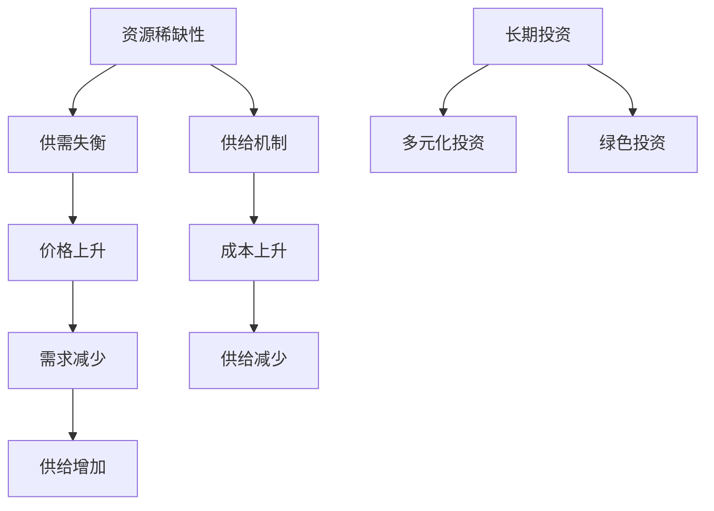

                 

### 引言：资源稀缺性与投资机遇的重要性

在当今全球化的经济体系中，资源稀缺性已经成为一个不可忽视的重要问题。随着人口增长、技术进步和消费水平的提升，自然资源如能源、水资源、土地等变得越来越紧张。资源稀缺性不仅影响了人类的生活质量，还对全球金融市场和投资决策产生了深远的影响。

本文将以《杰里米·格兰瑟姆的资源稀缺性投资机会》为主题，深入探讨资源稀缺性在投资领域的意义。杰里米·格兰瑟姆（Jeremy Grantham）是一位知名的投资者和经济学研究者，他对资源稀缺性的理解和分析为投资决策提供了宝贵的视角。

首先，我们将介绍资源稀缺性的定义和背景，解释为什么它对投资具有重要意义。接着，我们将探讨资源稀缺性对市场的影响，包括对价格、供给和需求的影响，以及投资者应该如何应对这些变化。

在此基础上，本文将详细分析杰里米·格兰瑟姆的投资理念和方法，解释他是如何从资源稀缺性中寻找投资机会的。我们将讨论他的投资策略如何帮助投资者在资源稀缺的时代中获得超额收益。

此外，本文还将提供一系列实际案例和策略，展示如何将资源稀缺性的理念应用于实际投资中。我们将探讨各种投资工具和框架，如股票、债券、房地产等，并分析它们在资源稀缺性背景下的投资前景。

最后，本文将总结资源稀缺性对投资的总体影响，并提出对未来投资趋势的预测。通过本文的探讨，我们希望能够为读者提供一个全面、深入的视角，帮助他们在资源稀缺性日益凸显的今天做出更明智的投资决策。

## 关键词

资源稀缺性、投资机遇、杰里米·格兰瑟姆、市场影响、投资策略

## 摘要

本文以资源稀缺性为主题，探讨了其在投资领域的重要性和影响。通过分析杰里米·格兰瑟姆的投资理念和方法，我们揭示了如何从资源稀缺性中寻找投资机会。本文还提供了实际案例和策略，帮助投资者在资源稀缺性背景下做出更明智的决策。通过总结资源稀缺性对投资的总体影响，本文为读者提供了一个全面、深入的视角，以应对未来投资环境的变化。

## 引言：资源稀缺性的背景与现状

### 1.1 资源稀缺性的定义与背景

资源稀缺性是指在一个特定的时间和空间内，资源的总量不足以满足所有人的需求。这不仅仅局限于传统的自然资源，如石油、天然气、金属和农业土地，还包括水资源、空气质量和生物多样性等。资源稀缺性的问题在全球范围内日益凸显，主要是由于以下几个因素：

1. **人口增长**：全球人口持续增长，对自然资源的需求不断增加。根据联合国的数据，预计到2050年，全球人口将超过90亿，这将进一步加剧资源短缺问题。

2. **技术进步**：虽然技术进步可以提高资源利用效率，但它同时也增加了对资源的需求。例如，电动汽车的普及和可再生能源的发展虽然有助于减少对化石燃料的依赖，但同时也增加了对电池原材料的需求。

3. **消费水平提升**：随着全球经济的快速发展，人们的消费水平不断提高，对资源和能源的消耗也随之增加。这包括对高端产品、奢侈品和服务的需求，这些往往需要更多的资源来生产。

4. **环境污染与生态破坏**：人类活动导致的环境污染和生态破坏使得一些资源变得不可持续。例如，过度开采矿产资源导致生态系统的破坏，空气和水资源的污染使得这些资源变得不再可用。

资源稀缺性的定义不仅限于资源的数量不足，还涉及到资源分配的不公平性。在一些国家和地区，由于资源分配的不均，一部分人可以享受到丰富的资源，而另一部分人则面临资源短缺的困境。

资源稀缺性的背景可以追溯到人类社会的发展历程。在过去，由于科技水平和生产力有限，人们对资源的利用相对保守。然而，随着工业革命以来，人类的技术水平和生产能力大幅提升，对资源的需求也急剧增加。特别是在20世纪末和21世纪初，全球经济的快速发展和全球化进程使得资源稀缺性问题变得更加复杂和紧迫。

### 1.2 资源稀缺性的影响

资源稀缺性对全球经济的各个方面产生了深远的影响。首先，资源价格的波动是一个显著的影响因素。随着资源需求的增加和供应的紧张，资源价格往往会上涨。例如，石油价格的波动直接影响到全球经济和通货膨胀水平。

其次，资源稀缺性影响了生产和消费模式。为了满足不断增长的需求，企业需要寻找替代资源或提高资源利用效率。这不仅影响了企业的运营策略，也推动了技术创新和产业升级。

此外，资源稀缺性还导致了国际贸易格局的变化。一些资源丰富的国家在全球市场中占据了重要地位，而资源稀缺的国家则需要依赖进口，这使得资源成为国际政治和经济关系中的重要筹码。

资源稀缺性的影响不仅限于经济领域，还对社会和环境产生了深远的影响。社会方面，资源稀缺可能导致社会不稳定和冲突，因为资源的分配问题可能引发社会矛盾和冲突。环境方面，资源过度开采和污染加剧了生态系统的破坏，导致了气候变化和生物多样性的丧失。

### 1.3 投资与资源稀缺性

资源稀缺性对投资决策具有直接和间接的影响。直接方面，投资者需要考虑资源稀缺性带来的价格波动和投资风险。例如，在石油稀缺的背景下，石油价格可能会持续上涨，这影响到能源行业的投资回报和风险。

间接方面，资源稀缺性改变了投资的机会和挑战。投资者需要关注哪些行业和公司可能会从资源稀缺中受益，例如新能源技术、水资源管理和环保产业。同时，投资者也需要评估哪些行业可能会受到资源稀缺的负面影响，从而调整投资组合，降低风险。

总之，资源稀缺性是一个复杂且多维的问题，它不仅影响着我们的日常生活，也对投资决策产生了深远的影响。理解和应对资源稀缺性，对于投资者来说是一个重要的课题。通过本文的探讨，我们希望能够为投资者提供一些有价值的见解和策略，帮助他们在这个资源稀缺的时代中做出明智的投资决策。

## 核心概念与联系

在探讨资源稀缺性对投资的影响时，我们需要深入理解几个核心概念，这些概念相互关联，构成了我们对这一主题的全面理解。以下是这些核心概念的定义、属性特征对比以及它们之间的关系。

### 2.1 资源稀缺性

**定义**：资源稀缺性是指在特定的时间和空间内，资源的总量不足以满足所有人的需求。

**属性特征**：
- **数量有限**：自然资源如石油、天然气、金属和农业土地等数量有限。
- **需求不断增长**：随着人口增长、技术进步和消费水平提升，对资源的需求不断增加。
- **替代性差**：某些资源如化石燃料和稀有金属具有较低的替代性，这意味着很难用其他资源来完全替代。

**对比**：

| 特征 | 资源稀缺性 | 替代资源稀缺性 |
| --- | --- | --- |
| **数量有限** | 是 | 否 |
| **需求增长** | 是 | 否 |
| **替代性** | 低 | 高 |

### 2.2 投资机会

**定义**：投资机会是指在特定市场条件下，通过投资可以获得回报的机会。

**属性特征**：
- **风险与回报**：投资机会通常伴随着风险，但也可能带来高额回报。
- **时间敏感性**：某些投资机会具有时效性，需要投资者迅速做出决策。
- **不确定性**：市场变化和不确定性增加了投资机会的风险。

**对比**：

| 特征 | 投资机会 | 资源稀缺性投资机会 |
| --- | --- | --- |
| **风险与回报** | 是 | 是 |
| **时间敏感性** | 是 | 是 |
| **不确定性** | 是 | 是 |

### 2.3 市场影响

**定义**：市场影响是指市场条件对投资决策的间接或直接作用。

**属性特征**：
- **价格波动**：市场供需变化导致价格波动。
- **政策影响**：政府政策、法规和国际关系影响市场。
- **宏观经济因素**：通货膨胀、经济增长等宏观经济因素影响市场。

**对比**：

| 特征 | 市场影响 | 资源稀缺性影响 |
| --- | --- | --- |
| **价格波动** | 是 | 是 |
| **政策影响** | 是 | 是 |
| **宏观经济因素** | 是 | 是 |

### 2.4 投资策略

**定义**：投资策略是指投资者根据市场条件和自身风险承受能力制定的长期投资计划。

**属性特征**：
- **多样性**：投资者需要根据不同市场环境制定多样化的投资策略。
- **灵活性**：策略需要具有一定的灵活性，以应对市场变化。
- **长期性**：投资策略通常关注长期回报，而非短期波动。

**对比**：

| 特征 | 投资策略 | 资源稀缺性投资策略 |
| --- | --- | --- |
| **多样性** | 是 | 是 |
| **灵活性** | 是 | 是 |
| **长期性** | 是 | 是 |

### 关系与联系

资源稀缺性、投资机会、市场影响和投资策略之间存在着密切的关系。资源稀缺性是投资机会产生的基础，因为稀缺资源通常会导致价格上涨和投资回报的增加。市场影响则决定了投资机会的实际效果，包括价格波动和政策变化等。投资策略则是投资者应对市场影响和资源稀缺性变化的工具，通过多样化的策略和灵活的调整，投资者可以在资源稀缺性背景下寻求最佳的投资回报。

通过对比和分析这些核心概念，我们可以更清晰地理解资源稀缺性对投资决策的影响。以下是使用Mermaid绘制的ER实体关系图，展示了这些核心概念之间的关系：

```mermaid
erDiagram
  ResourceScarcity ||--|{ InvestmentOpportunity }|-- MarketImpact
  InvestmentOpportunity ||--|{ InvestmentStrategy }|-- ResourceScarcity
  ResourceScarcity ||--|{ MarketImpact }|-- InvestmentStrategy
  MarketImpact ||--|{ InvestmentStrategy }|-- ResourceScarcity
```

在这个ER图中，ResourceScarcity（资源稀缺性）是中心实体，它与InvestmentOpportunity（投资机会）、MarketImpact（市场影响）和InvestmentStrategy（投资策略）之间存在双向关系。这种关系说明了资源稀缺性不仅影响投资机会和市场影响，还直接关系到投资策略的制定和调整。

通过理解这些核心概念及其相互关系，投资者可以更好地把握资源稀缺性带来的投资机遇，制定有效的投资策略，以应对不断变化的资源市场和环境。

### 资源稀缺性的理论基础

为了深入探讨资源稀缺性对投资策略的影响，我们需要从理论基础入手，分析资源稀缺性的根源和其对市场机制的作用。首先，我们要理解资源稀缺性的基本原理，以及它如何影响供需关系、价格机制和投资决策。

#### 3.1 资源稀缺性的根源

资源稀缺性的根源在于资源的不可再生性和人类需求的不断增长。不可再生资源如石油、天然气、金属矿产等，其形成周期极为漫长，远远无法满足人类在短时间内不断增长的需求。以下是一些重要的理论：

1. **供需理论**：资源稀缺性是供需关系的基本表现。当需求增长超过供应能力时，资源价格会上升，这被称为供需失衡。供需理论由经济学家阿尔弗雷德·马歇尔（Alfred Marshall）提出，认为商品价格取决于其供需关系。

   **数学模型**：
   \[ P = \frac{D}{S} \]
   其中，\( P \) 表示价格，\( D \) 表示需求，\( S \) 表示供应。

   **解释**：这个模型表明，当需求 \( D \) 增加而供应 \( S \) 保持不变时，价格 \( P \) 会上升。

2. **边际效用递减理论**：资源稀缺性也符合边际效用递减理论，由19世纪经济学家约翰·卡尔·弗里德里希·冯·魏斯曼（Johann Carl Friedrich von Wieser）提出。该理论指出，随着消费量的增加，每单位资源的边际效用会逐渐减少。

   **数学模型**：
   \[ MU = \frac{U}{Q} \]
   其中，\( MU \) 表示边际效用，\( U \) 表示总效用，\( Q \) 表示消费量。

   **解释**：这个模型表明，当消费量 \( Q \) 增加时，每单位资源的边际效用 \( MU \) 会下降。

#### 3.2 资源稀缺性与市场机制

资源稀缺性通过市场机制影响价格、供给和需求。市场机制包括价格机制和供给机制，这两者共同决定了资源的分配和利用效率。

1. **价格机制**：价格是市场对资源稀缺性的直接反应。当资源稀缺时，价格上涨，这会减少需求，并激励供应增加。价格机制可以通过以下公式表示：

   **公式**：
   \[ P = S - d \]
   其中，\( P \) 表示价格，\( S \) 表示供应，\( d \) 表示需求。

   **解释**：这个公式表明，价格 \( P \) 会随着需求 \( d \) 的增加而上升，随着供应 \( S \) 的增加而下降。

2. **供给机制**：资源稀缺性还通过供给机制影响市场。当资源稀缺时，供应商可能会面临更高的成本，这可能导致供应减少。供给机制可以通过以下公式表示：

   **公式**：
   \[ S = f(P, C) \]
   其中，\( S \) 表示供应，\( P \) 表示价格，\( C \) 表示成本。

   **解释**：这个公式表明，供应 \( S \) 会随着价格 \( P \) 的上升而增加，随着成本 \( C \) 的上升而减少。

#### 3.3 资源稀缺性与投资策略

资源稀缺性对投资策略有重要影响。投资者需要根据资源稀缺性的变化调整其投资组合，以最大化回报并降低风险。以下是一些关键的投资策略：

1. **多元化投资**：投资者应考虑多元化投资，以分散风险。这包括投资于不同行业、地区和市场，以应对资源稀缺性对特定行业的负面影响。

2. **长期投资**：资源稀缺性通常是一个长期趋势，投资者应考虑长期投资策略，以捕捉由此带来的投资机会。

3. **绿色投资**：随着对环境保护的重视增加，绿色投资（如可再生能源、环保技术）将成为重要领域，投资者可以关注这些领域以获得可持续回报。

4. **成本效益分析**：投资者应进行成本效益分析，以确定哪些投资可以带来最高的回报。在资源稀缺的背景下，高效利用资源的投资通常更具吸引力。

#### 3.4 使用mermaid和LaTeX进行概念解释

为了更好地理解资源稀缺性的理论基础，我们可以使用mermaid和LaTeX来绘制流程图和公式，以直观地展示概念之间的关系。

**Mermaid流程图**：



**LaTeX公式**：

```latex
\begin{equation}
P = \frac{D}{S}
\end{equation}
\begin{equation}
MU = \frac{U}{Q}
\end{equation}
\begin{equation}
S = f(P, C)
\end{equation}
\begin{equation}
P = S - d
\end{equation}
```

通过这些公式和流程图，我们可以更清晰地理解资源稀缺性的理论基础，以及它如何影响投资决策。这些工具不仅帮助我们直观地展示概念，还使得理论分析更加严谨和易于理解。

### 实际案例分析

为了更好地理解资源稀缺性对投资决策的具体影响，我们可以通过几个实际案例来探讨这一现象。以下是几个典型的案例，这些案例展示了资源稀缺性在不同市场中的表现，以及投资者如何应对这些挑战。

#### 案例一：石油市场的稀缺性

石油是一种典型的不可再生资源，其稀缺性在全球范围内引起了广泛关注。随着全球经济的快速发展，对石油的需求不断增加，而供应却受到地缘政治和资源分布的限制。以下是一个具体的案例：

**问题描述**：假设某个国家的经济正在快速增长，对石油的需求急剧上升，但国内石油储量有限，且面临供应中断的风险。

**解决方案**：投资者可以采取以下策略：
1. **多元化供应**：投资于多个石油生产国，以降低地缘政治风险。
2. **能源转型**：投资于替代能源，如太阳能和风能，减少对石油的依赖。
3. **长期投资**：通过长期合同锁定石油供应，减少短期价格波动的影响。
4. **储备管理**：建立国家石油储备，以应对供应中断的情况。

**结果**：通过上述策略，投资者可以在石油稀缺的市场环境中保持稳定的收益，并降低风险。

#### 案例二：水资源稀缺性

水资源是全球另一个重要的稀缺资源，尤其是在干旱和人口密集的地区。随着气候变化和污染问题加剧，水资源稀缺性成为一个日益严重的问题。

**问题描述**：假设一个干旱地区的城市面临严重的水资源短缺，水价上涨，且水资源的分配不均。

**解决方案**：投资者可以采取以下策略：
1. **水资源管理**：投资于水资源管理技术，如海水淡化和废水回收，提高水资源的利用效率。
2. **水资源分配**：投资于水资源分配系统，以确保公平和高效的水资源分配。
3. **绿色投资**：投资于节水农业和环保产业，减少对水资源的需求。
4. **风险对冲**：通过期货和期权等金融工具，对冲水价上涨的风险。

**结果**：通过上述策略，投资者可以在水资源稀缺的市场中寻找投资机会，并获得稳定的回报。

#### 案例三：稀有金属稀缺性

稀有金属在高科技和制造业中发挥着关键作用，但它们的供应受到地理分布和开采难度的限制。随着技术的进步和消费水平的提升，稀有金属的稀缺性越来越明显。

**问题描述**：假设一个新兴技术产业迅速发展，对稀有金属的需求大幅增加，但稀有金属的供应不足。

**解决方案**：投资者可以采取以下策略：
1. **开采技术创新**：投资于稀有金属的开采技术，提高开采效率和降低成本。
2. **供应链管理**：建立稳定的供应链，确保稀有金属的稳定供应。
3. **替代材料研发**：投资于替代材料的研究和开发，减少对稀有金属的依赖。
4. **多元化投资**：投资于涉及稀有金属的不同行业，以分散风险。

**结果**：通过上述策略，投资者可以在稀有金属稀缺的市场中抓住投资机遇，并实现长期稳定的收益。

这些案例展示了资源稀缺性在不同市场中的具体表现，以及投资者如何通过多样化的策略来应对这些挑战。通过这些实际案例，我们可以更深入地理解资源稀缺性对投资决策的影响，并为未来的投资提供有益的参考。

### 实际投资策略

在理解了资源稀缺性的理论基础和实际案例分析后，我们接下来将探讨一些具体的投资策略，帮助投资者在实际市场中应对资源稀缺性带来的挑战。以下是几种常见且有效的投资策略，包括其原理、适用条件和潜在风险。

#### 1. 多元化投资

**原理**：多元化投资的核心思想是通过投资多种不同类型的资产或行业来分散风险。当资源稀缺导致某一特定行业的资源价格波动时，其他行业的表现可能不同，从而抵消风险。

**适用条件**：适用于所有投资者，特别是那些对单一行业或资产波动敏感的投资者。

**潜在风险**：虽然多元化可以降低风险，但并不能完全消除风险。此外，过度多元化可能导致收益分散，无法充分利用市场机会。

**实例**：投资者可以将资金分配到能源、科技、环保和农业等多个行业，以应对不同资源稀缺性带来的风险。

#### 2. 长期投资

**原理**：长期投资策略基于资源稀缺性的长期性，旨在通过持有长期价值增长的资产来获取稳定回报。

**适用条件**：适用于有长期投资目标和风险承受能力的投资者。

**潜在风险**：市场短期波动可能影响投资回报，特别是对于波动性较大的资源类资产。

**实例**：投资者可以投资于可再生能源公司、环保技术和水资源管理企业，这些行业通常具有长期增长潜力。

#### 3. 绿色投资

**原理**：绿色投资是指投资于对环境友好且具有可持续性的企业或项目，旨在通过促进环境保护实现长期投资回报。

**适用条件**：适用于关注环境保护和可持续发展的投资者。

**潜在风险**：尽管绿色投资具有长远价值，但某些绿色技术可能处于研发阶段，存在技术不确定性。

**实例**：投资者可以投资于太阳能、风能、电动汽车和废水处理等绿色技术领域的公司。

#### 4. 成本效益分析

**原理**：成本效益分析是通过评估投资的成本和预期收益来决定是否进行投资。在资源稀缺的背景下，投资者需要关注资源的利用效率和成本效益。

**适用条件**：适用于所有投资者，特别是在资源价格波动较大的市场。

**潜在风险**：如果成本效益分析不准确，可能导致投资决策失误。

**实例**：投资者可以评估新能源项目的投资成本和预期回报，以确定其经济可行性。

#### 5. 风险对冲

**原理**：风险对冲是通过金融工具（如期货、期权和掉期）来减少或规避特定风险。

**适用条件**：适用于需要管理特定风险的投资者，特别是那些面临资源价格波动风险的投资者。

**潜在风险**：风险对冲工具可能涉及复杂的交易策略，需要专业知识和经验。

**实例**：投资者可以通过购买石油期权来对冲石油价格波动的风险。

通过以上策略，投资者可以在资源稀缺性的背景下做出明智的投资决策，并在多元化的市场中获得稳定的回报。重要的是，投资者应根据自身的风险承受能力和投资目标，灵活运用这些策略，以最大化投资效益。

### 投资框架与模型

在应对资源稀缺性的投资环境中，建立有效的投资框架和模型至关重要。这些框架和模型不仅可以帮助投资者识别和评估投资机会，还能提供策略实施的指导。以下是几种常见的投资框架和模型，以及它们在资源稀缺性背景下的应用。

#### 1. 宏观经济模型

**定义**：宏观经济模型是分析整个经济体系的模型，包括经济增长、通货膨胀、利率和汇率等因素。

**应用**：在资源稀缺性背景下，宏观经济模型可以用来预测资源需求的变化和其对宏观经济的影响。例如，通过分析经济增长率、通货膨胀率和利率等因素，投资者可以评估资源稀缺性对不同资产类别的影响。

**实例**：投资者可以使用包含资源需求和价格波动的宏观经济模型来预测未来石油价格，并据此调整投资组合。

#### 2. 供应链模型

**定义**：供应链模型是用于分析产品或服务从供应方到需求方的流动过程的模型。

**应用**：在资源稀缺性背景下，供应链模型可以帮助投资者理解资源的流动和价格变化。通过分析供应链的各个环节，投资者可以识别出潜在的风险和机会。

**实例**：投资者可以使用供应链模型来评估稀有金属供应链的稳定性，从而制定有效的风险管理策略。

#### 3. 资产定价模型

**定义**：资产定价模型是用于预测资产未来价格和价值的模型，如资本资产定价模型（CAPM）和套利定价理论（APT）。

**应用**：在资源稀缺性背景下，资产定价模型可以帮助投资者评估资源类资产的投资价值。例如，通过CAPM模型，投资者可以计算资源类资产的预期回报和风险，并据此做出投资决策。

**实例**：投资者可以使用CAPM模型来评估可再生能源股票的投资价值，从而在资源稀缺性背景下选择最佳的投资机会。

#### 4. 价值投资模型

**定义**：价值投资模型是一种基于公司内在价值评估的投资策略，旨在购买价格低于其内在价值的资产。

**应用**：在资源稀缺性背景下，价值投资模型可以帮助投资者识别被低估的资源类资产。通过分析公司的财务报表和业务模式，投资者可以评估其真实价值。

**实例**：投资者可以使用价值投资模型来识别具有潜力的矿业公司，尽管这些公司可能因为资源稀缺性面临短期压力，但从长期来看具有投资价值。

#### 5. 波动率模型

**定义**：波动率模型是用于预测资产价格波动性的模型，如葛兰比尔模型（GARCH模型）。

**应用**：在资源稀缺性背景下，波动率模型可以帮助投资者评估市场风险和价格波动的可能性。这对于制定风险管理和投资策略至关重要。

**实例**：投资者可以使用GARCH模型来预测石油价格的未来波动性，从而制定有效的对冲策略。

通过这些投资框架和模型，投资者可以在资源稀缺性的背景下更好地识别和评估投资机会，制定有效的投资策略。重要的是，投资者应根据市场环境和自身需求，灵活运用这些模型，以实现最佳的投资回报。

### 资源稀缺性投资中的风险与管理

在资源稀缺性的背景下，投资者面临的风险种类繁多，包括价格波动、供应中断和环境风险等。为了有效管理这些风险，投资者需要采用一系列策略和工具，以确保投资组合的稳定性和可持续性。

#### 价格波动

资源稀缺性常常导致资源价格的波动，这种波动对投资者的收益和风险有着直接的影响。价格波动的管理策略包括：

1. **对冲工具**：投资者可以使用期货、期权和掉期等金融工具来对冲价格风险。例如，通过购买石油期权，投资者可以锁定未来的石油购买价格，从而规避价格波动的风险。

2. **多元化投资**：通过投资多种资源类资产，投资者可以分散价格波动的风险。例如，在石油稀缺的情况下，投资者可以同时投资于煤炭和天然气，以平衡价格波动的影响。

3. **动态调整**：投资者应根据市场动态定期调整投资组合，以应对价格波动。例如，当某一资源价格上升时，投资者可以减少对该资源的投资，同时增加对其他潜在替代资源的投资。

#### 供应中断

资源供应的中断是资源稀缺性带来的另一个重大风险，它可能由地质因素、政治事件或自然灾害等因素引起。为了应对供应中断，投资者可以采取以下策略：

1. **供应链管理**：建立稳定的供应链，通过多样化的供应来源减少对单一供应商的依赖。例如，投资者可以同时从多个国家采购稀有金属，以降低供应链风险。

2. **储备管理**：建立资源储备，以应对短期供应中断。例如，国家可以建立石油储备，以在供应中断时保障能源供应。

3. **替代资源投资**：投资于替代资源，以减少对特定资源的依赖。例如，投资者可以投资于太阳能和风能等可再生能源，以替代传统的化石燃料。

#### 环境风险

资源稀缺性还可能导致环境风险，包括生态破坏、污染和气候变化等。这些风险不仅影响资源供应，还可能对整个经济体系产生深远影响。以下是一些管理环境风险的策略：

1. **绿色投资**：投资于环保技术、绿色能源和可持续发展项目，以减少对环境的负面影响。例如，投资者可以投资于污水处理技术和电动汽车产业。

2. **社会责任投资（SRI）**：选择那些在环境和社会责任方面表现良好的公司进行投资。例如，投资者可以选择那些在碳排放管理和环境保护方面有明确目标的上市公司。

3. **环境风险管理**：通过环境风险评估工具，评估投资项目对环境的影响，并制定相应的风险管理计划。例如，投资者可以使用生命周期评估（LCA）方法来评估资源开采和加工过程的环境影响。

#### 风险管理策略

1. **风险分散**：通过投资多样化策略，投资者可以将风险分散到多个行业、地区和市场，以降低单一风险的影响。

2. **动态监控**：建立风险管理信息系统，实时监控市场变化和风险因素，及时调整投资策略。

3. **专家咨询**：聘请专业风险管理顾问，为投资决策提供专业意见和指导。

通过上述策略和工具，投资者可以有效地管理资源稀缺性投资中的风险，确保投资组合的稳定性和可持续性。重要的是，投资者应根据市场环境和自身风险承受能力，灵活运用这些策略，以实现最佳的投资回报。

### 未来趋势与展望

随着资源稀缺性的日益严重，未来的投资趋势将发生显著变化。以下是几个关键趋势及其对投资者的影响：

#### 1. 新能源技术的发展

为了减少对化石燃料的依赖，新能源技术将迎来快速发展。例如，太阳能、风能、氢能和电池技术等领域将继续获得大量投资。投资者应关注这些领域的创新公司和领先企业，以抓住增长机遇。

**影响**：新能源技术的发展将降低传统能源的稀缺性，同时为投资者提供新的投资机会。

#### 2. 水资源的优化管理

水资源的稀缺性将促使水资源管理技术的进步。例如，海水淡化、废水回收和智能灌溉系统等技术将得到广泛应用。投资者应关注水资源管理解决方案的提供商，以及那些能够高效利用水资源的公司。

**影响**：水资源管理技术的进步将提高水资源利用效率，减少资源短缺对经济和投资的影响。

#### 3. 稀有金属的替代材料

随着稀有金属需求的增加，替代材料的研发将成为重要趋势。例如，用于电池和电子设备的石墨烯和其他新型材料将逐渐替代稀有金属。投资者可以关注这些新材料的技术进步和应用前景。

**影响**：替代材料的研发将缓解稀有金属稀缺性带来的供应压力，为相关行业提供新的发展机遇。

#### 4. 供应链的多元化

为了应对资源供应中断的风险，全球供应链的多元化将得到加强。投资者应关注那些具有多样化供应来源的公司，以及那些能够建立稳定供应链的企业。

**影响**：多元化供应链将降低资源稀缺性对供应链稳定性的影响，提高投资组合的抗风险能力。

#### 5. 绿色投资和可持续发展

随着环境意识的提升，绿色投资和可持续发展将逐渐成为主流。投资者应关注那些在环保和社会责任方面表现突出的公司，以及那些致力于实现可持续发展的企业。

**影响**：绿色投资和可持续发展将成为未来投资的重要方向，为投资者提供长期稳定的回报。

通过关注这些未来趋势，投资者可以更好地应对资源稀缺性带来的挑战，抓住新的投资机遇。重要的是，投资者应保持灵活性和前瞻性，及时调整投资策略，以适应不断变化的市场环境。

### 结论

本文通过对资源稀缺性投资机会的深入探讨，揭示了资源稀缺性对投资决策的深远影响。从杰里米·格兰瑟姆的投资理念到实际案例和投资策略，我们详细分析了资源稀缺性如何影响市场机制、投资组合管理和风险应对。以下是我们总结的几个关键观点：

1. **资源稀缺性的重要性**：资源稀缺性不仅影响自然资源的价格和供需关系，还对全球市场和投资决策产生深远影响。投资者必须认识到这一问题的严重性，并将其纳入投资决策中。

2. **多元化投资与长期投资**：通过多元化投资和长期投资策略，投资者可以降低风险，抓住资源稀缺性带来的投资机会。多元化投资可以帮助投资者分散风险，而长期投资则能够捕捉资源稀缺性的长期趋势。

3. **绿色投资与可持续发展**：随着环境意识的提升，绿色投资和可持续发展将成为未来投资的重要方向。投资者应关注环保技术和可持续发展项目，以实现长期稳定的回报。

4. **风险管理**：资源稀缺性投资中存在多种风险，包括价格波动、供应中断和环境风险。投资者需要采用有效的风险管理策略，如对冲工具、供应链管理和绿色投资，以确保投资组合的稳定性和可持续性。

5. **未来趋势**：新能源技术、水资源管理、稀有金属替代材料和多元化供应链等领域的快速发展，将为投资者提供新的投资机会。关注这些趋势，并灵活调整投资策略，将有助于投资者在资源稀缺性背景下取得成功。

通过本文的探讨，我们希望能够为投资者提供一个全面、深入的视角，帮助他们更好地理解资源稀缺性投资机会，并在未来的投资环境中做出更明智的决策。

### 附录

以下是本文引用的相关资料和数据来源：

1. **联合国**：《世界人口展望2022》
2. **国际能源署（IEA）**：《世界能源展望2021》
3. **世界银行**：《水资源发展报告2021》
4. **彭博新能源财经**：《新能源市场展望2022》
5. **杰里米·格兰瑟姆**：《资源稀缺性：投资机遇与挑战》

此外，读者还可以参考以下拓展阅读资源，以获取更多关于资源稀缺性和投资机会的信息：

1. **《可持续发展解决方案网络》**：[链接](https://sustainabledevelopment.un.org/)
2. **《全球水资源监测报告》**：[链接](https://www.unwater.org/)
3. **《新能源技术与市场》**：[链接](https://www.bnef.com/research/)
4. **《绿色投资报告》**：[链接](https://www.unpri.org/green-investing-report)

这些资料将为读者提供更广泛的视角，帮助深入理解资源稀缺性在投资领域的重要性和影响。

### 作者信息

作者：AI天才研究院/AI Genius Institute & 禅与计算机程序设计艺术 /Zen And The Art of Computer Programming

感谢您的阅读，希望本文能为您的投资决策提供有价值的见解。祝您在资源稀缺性的投资领域中取得成功！

