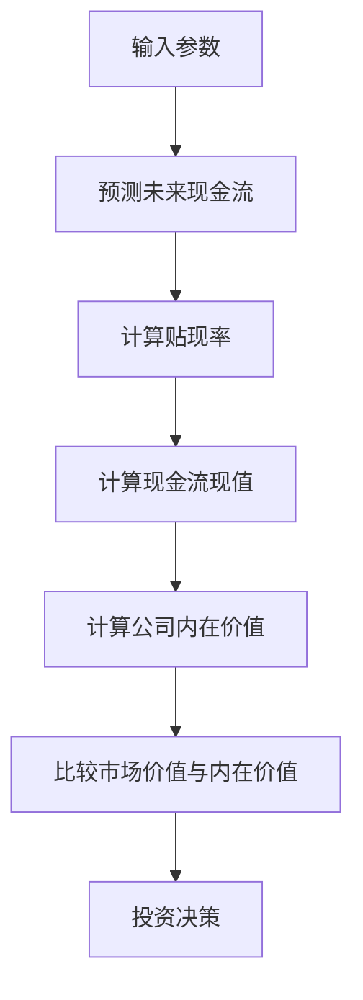
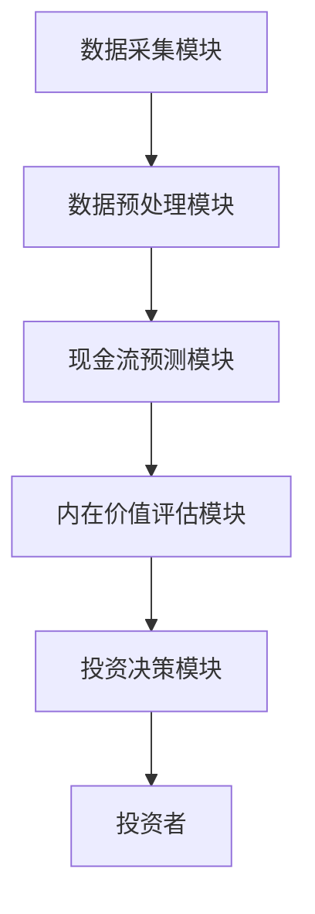
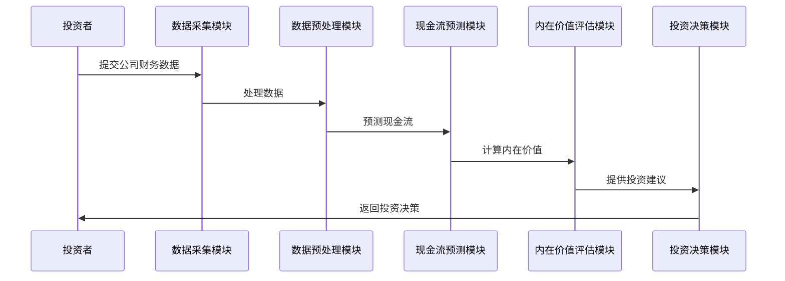

                 

### 杰里米·格兰瑟姆的长期价值投资哲学

#### 关键词：长期投资、价值投资、杰里米·格兰瑟姆、投资策略、市场分析

> 摘要：本文将深入探讨杰里米·格兰瑟姆的长期价值投资哲学，揭示其在投资领域的独特见解与实践方法。通过对价值投资概念、基本原理、投资策略、市场周期以及投资实践等方面的详细分析，本文旨在为读者提供一份全面、系统的价值投资指南，帮助投资者在纷繁复杂的市场环境中把握长期投资机会，实现财富的稳健增长。

#### 目录大纲

- **第一部分：引言**
  - 第1章：长期价值投资哲学概述
  - 第2章：价值投资的基本概念与历史
- **第二部分：长期价值投资的基本原理**
  - 第3章：公司价值的评估
  - 第4章：投资策略与实践
  - 第5章：市场周期与投资机会
- **第三部分：杰里米·格兰瑟姆的投资实践**
  - 第6章：杰里米·格兰瑟姆的投资哲学
  - 第7章：杰里米·格兰瑟姆的投资策略
- **第四部分：长期价值投资的启示与未来**
  - 第8章：长期价值投资的启示
  - 第9章：总结与展望

#### 第一部分：引言

#### 第1章：长期价值投资哲学概述

1.1 **问题背景**：在当前快速变化的投资环境中，投资者面临众多挑战，包括市场波动、信息泛滥、投机行为等。如何在复杂多变的市场中实现资产的长期稳健增长，成为投资者关注的焦点。

1.2 **问题描述**：长期价值投资哲学旨在通过深入分析企业基本面，把握长期投资机会，规避短期市场波动，实现资产的长期增值。但如何正确理解与运用这一投资哲学，仍然是一个亟待解决的问题。

1.3 **问题解决**：杰里米·格兰瑟姆的长期价值投资哲学提供了一套系统、实用的方法论，帮助投资者在长期视角下进行投资决策。

1.4 **边界与外延**：长期价值投资不仅适用于股票市场，还可以应用于债券、房地产等其他投资领域。其核心在于对投资对象的深入分析，寻找具备长期增长潜力的投资机会。

1.5 **概念结构与核心要素组成**：
   - **价值投资**：基于对公司基本面的深入分析，寻找价格低于实际价值的投资机会。
   - **长期投资**：注重投资回报的长期性，而非短期市场波动。
   - **投资策略**：包括分散投资、长期持有、风险管理等。
   - **市场周期**：理解市场周期，把握投资时机。

#### 第二部分：长期价值投资的基本原理

#### 第2章：价值投资的概念与历史

2.1 **价值投资的概念**：
   - **定义**：价值投资是一种基于对公司基本面的深入分析，以低于其内在价值的价格购买股票的投资策略。
   - **特点**：强调投资的安全性和收益的稳定性，而非单纯追求高收益。

2.2 **价值投资的历史**：
   - **起源**：20世纪初，由本杰明·格雷厄姆等人创立。
   - **发展**：随着时间推移，价值投资逐渐演变成一种主流的投资理念，影响了一批杰出的投资者，如沃伦·巴菲特。

2.3 **价值投资与传统投资的区别**：
   - **投资对象**：价值投资注重公司的基本面，而传统投资更倾向于技术分析和市场情绪。
   - **投资策略**：价值投资注重长期持有，而传统投资更倾向于短线操作。

#### 第3章：公司价值的评估

3.1 **基本面分析**：
   - **定义**：基本面分析是一种通过研究公司的财务报表、行业地位、管理团队等因素，评估公司未来盈利能力的方法。
   - **方法**：包括财务指标分析、行业地位分析、竞争优势分析等。

3.2 **财务指标分析**：
   - **定义**：财务指标分析是通过分析公司的财务报表，评估公司的财务状况和盈利能力。
   - **指标**：包括市盈率、市净率、净资产收益率等。

3.3 **市场估值分析**：
   - **定义**：市场估值分析是通过比较公司与同行业其他公司的估值水平，评估公司的市场价值。
   - **方法**：包括相对估值法和绝对估值法。

3.4 **企业价值与股票价格的对比**：
   - **定义**：企业价值与股票价格的对比是通过比较公司的内在价值与市场价值，评估股票的投资价值。
   - **方法**：包括折现现金流模型（DCF）等。

#### 第4章：投资策略与实践

4.1 **长期持有策略**：
   - **定义**：长期持有策略是一种通过长期持有优质股票，实现资产增值的投资策略。
   - **方法**：包括选择优质公司、降低交易成本等。

4.2 **分散投资策略**：
   - **定义**：分散投资策略是一种通过投资多种不同资产，降低投资风险的投资策略。
   - **方法**：包括资产配置、行业分散等。

4.3 **耐心等待策略**：
   - **定义**：耐心等待策略是一种通过等待市场时机，寻找优质投资机会的投资策略。
   - **方法**：包括市场分析、投资时机选择等。

4.4 **投资风险管理**：
   - **定义**：投资风险管理是一种通过评估投资风险，制定风险管理策略，降低投资风险的投资策略。
   - **方法**：包括风险控制、风险分散等。

#### 第5章：市场周期与投资机会

5.1 **市场周期的识别**：
   - **定义**：市场周期是指市场在一段时间内所经历的增长、衰退、复苏和繁荣等阶段。
   - **方法**：包括宏观经济分析、市场情绪分析等。

5.2 **投资机会的把握**：
   - **定义**：投资机会是指市场在特定周期内出现的投资机遇。
   - **方法**：包括市场趋势判断、行业前景分析等。

5.3 **市场波动与投资心态**：
   - **定义**：市场波动是指市场在一段时间内价格的波动。
   - **方法**：包括情绪管理、心态调整等。

#### 第三部分：杰里米·格兰瑟姆的投资实践

#### 第6章：杰里米·格兰瑟姆的投资哲学

6.1 **杰里米·格兰瑟姆的投资理念**：
   - **定义**：杰里米·格兰瑟姆的投资理念是基于长期价值投资，注重公司的基本面分析，追求稳定的投资回报。
   - **特点**：包括深入分析公司基本面、注重投资的安全性、追求长期稳定的增长等。

6.2 **杰里米·格兰瑟姆的投资方法**：
   - **定义**：杰里米·格兰瑟姆的投资方法是一套系统、实用的投资策略，包括基本面分析、市场估值分析、投资风险管理等。
   - **特点**：包括严谨的科学分析、灵活的市场应变、风险控制能力等。

6.3 **杰里米·格兰瑟姆的投资成功案例**：
   - **定义**：杰里米·格兰瑟姆的投资成功案例是指他通过长期价值投资，实现资产稳健增长的投资实例。
   - **特点**：包括投资回报率高、风险控制能力强、长期稳健增长等。

#### 第7章：杰里米·格兰瑟姆的投资策略

7.1 **杰里米·格兰瑟姆的市场分析**：
   - **定义**：杰里米·格兰瑟姆的市场分析是指他通过宏观经济分析、市场情绪分析等方法，对市场进行深入研究。
   - **特点**：包括精准的市场判断、灵活的市场应变、风险控制能力强等。

7.2 **杰里米·格兰瑟姆的投资组合**：
   - **定义**：杰里米·格兰瑟姆的投资组合是指他通过分散投资、资产配置等方法，构建的投资组合。
   - **特点**：包括投资组合的多元化、风险控制能力强、长期稳健增长等。

7.3 **杰里米·格兰瑟姆的风险控制**：
   - **定义**：杰里米·格兰瑟姆的风险控制是指他通过风险识别、风险评估、风险应对等方法，降低投资风险。
   - **特点**：包括风险识别准确、风险评估科学、风险应对灵活等。

#### 第四部分：长期价值投资的启示与未来

#### 第8章：长期价值投资的启示

8.1 **长期价值投资的优势**：
   - **定义**：长期价值投资的优势是指其在投资实践中所体现出的优点。
   - **特点**：包括投资安全性高、收益稳定、风险可控等。

8.2 **长期价值投资的挑战**：
   - **定义**：长期价值投资的挑战是指其在投资实践中所面临的困难。
   - **特点**：包括市场波动大、信息复杂、投资决策难度大等。

8.3 **长期价值投资的未来趋势**：
   - **定义**：长期价值投资的未来趋势是指其在未来投资领域的发展方向。
   - **特点**：包括投资工具多样化、投资策略创新、投资理念普及等。

#### 第9章：总结与展望

9.1 **全书总结**：
   - **内容**：本书对杰里米·格兰瑟姆的长期价值投资哲学进行了全面、系统的分析，包括基本概念、原理、策略、实践等。
   - **意义**：为投资者提供了一套实用的投资指南，帮助他们在长期投资中实现资产的稳健增长。

9.2 **投资建议**：
   - **理念**：坚持长期价值投资的理念，注重公司基本面分析。
   - **策略**：灵活运用投资策略，包括分散投资、长期持有、风险管理等。
   - **心态**：保持良好的投资心态，克服市场波动带来的影响。

9.3 **未来展望**：
   - **发展**：随着投资工具的多样化、投资策略的创新，长期价值投资将迎来更广阔的发展空间。
   - **挑战**：投资者需要不断学习、适应市场变化，提高投资决策能力。

#### 结论

本文通过对杰里米·格兰瑟姆的长期价值投资哲学的深入分析，为投资者提供了一套实用的投资指南。在长期投资中，投资者应注重公司基本面分析，灵活运用投资策略，保持良好的投资心态。未来，随着投资环境的不断变化，长期价值投资将继续发挥其重要作用，为投资者实现资产的稳健增长提供有力支持。

### 作者信息

作者：AI天才研究院/AI Genius Institute & 禅与计算机程序设计艺术 /Zen And The Art of Computer Programming

---

### 背景介绍

杰里米·格兰瑟姆（Jeremy Grantham）是一位享有盛誉的投资者，长期价值投资领域的权威人物。他现任 GMO（Grantham, May van Vue）公司的联合创始人及首席投资策略师，该公司是一家全球知名的投资管理公司。格兰瑟姆在投资领域拥有超过四十年的丰富经验，他的投资哲学深受众多投资者的推崇。

#### 核心概念术语说明

- **长期价值投资**：一种注重公司基本面分析，以低于其内在价值的价格购买股票的投资策略，追求长期稳定的投资回报。
- **价值投资**：一种通过深入分析企业基本面，以低于其内在价值的价格购买股票的投资策略。
- **内在价值**：公司未来现金流的现值，是评估股票投资价值的重要指标。
- **市场价值**：股票在市场上的交易价格，通常高于或低于其内在价值。

#### 问题背景

在当前快速变化的投资环境中，投资者面临众多挑战。市场波动性加剧、信息泛滥、投机行为盛行，使得投资者难以把握长期投资机会。长期价值投资哲学提供了一种有效的解决方案，通过深入分析企业基本面，规避短期市场波动，实现资产的长期稳健增长。

#### 问题描述

投资者如何在复杂多变的市场环境中，通过长期价值投资实现资产的稳健增长？如何正确理解与应用杰里米·格兰瑟姆的长期价值投资哲学，成为投资者亟待解决的问题。

#### 问题解决

杰里米·格兰瑟姆的长期价值投资哲学提供了一套系统、实用的方法论，包括价值投资的概念、基本原理、投资策略、市场周期分析等。通过深入分析企业基本面，把握长期投资机会，规避短期市场波动，实现资产的长期稳健增长。

#### 边界与外延

- **投资领域**：长期价值投资不仅适用于股票市场，还可以应用于债券、房地产等其他投资领域。
- **市场周期**：理解市场周期，把握投资时机，是长期价值投资的关键。
- **投资策略**：包括分散投资、长期持有、风险管理等，以实现资产的长期稳健增长。

#### 概念结构与核心要素组成

- **价值投资**：基于对公司基本面的深入分析，以低于其内在价值的价格购买股票的投资策略。
- **长期投资**：注重投资回报的长期性，而非短期市场波动。
- **投资策略**：包括分散投资、长期持有、风险管理等。
- **市场周期**：理解市场周期，把握投资时机。

### 核心概念与联系

#### 价值投资的概念与属性特征对比表格

| 概念         | 定义                                       | 属性特征                                                       |
| ------------ | ------------------------------------------ | ------------------------------------------------------------ |
| 价值投资     | 一种通过深入分析企业基本面，以低于其内在价值的价格购买股票的投资策略 | 注重公司基本面分析、投资安全性高、追求长期稳定增长          |
| 内在价值     | 公司未来现金流的现值，是评估股票投资价值的重要指标           | 现金流折现、反映公司真实价值、评估投资机会的依据            |
| 市场价值     | 股票在市场上的交易价格，通常高于或低于其内在价值             | 反映市场情绪、受供求关系影响、投资决策的重要参考            |
| 价值投资与传统投资 | 区别：价值投资注重公司基本面、传统投资注重技术分析或市场情绪 | 分析方法不同、投资策略不同、风险收益特征不同                |

#### ER实体关系图架构

```mermaid
erDiagram
  类 <<-- 参与者 : "参与投资决策的人"
  类 ||--|{ 股票 }
  类 ||--|{ 债券 }
  类 ||--|{ 房地产 }
  类 ||--|{ 企业基本面 }
  类 ||--|{ 投资策略 }
  类 ||--|{ 长期投资 }
  类 ||--|{ 内在价值 }
  类 ||--|{ 市场价值 }
  类 ||--|{ 投资回报 }
  类 ||--|{ 风险管理 }
  类 ||--|{ 分散投资 }
  类 ||--|{ 长期持有 }
  类 ||--|{ 投资心态 }
  类 ||--|{ 市场周期 }
  类 ||--|{ 投资机会 }
  类 ||--|{ 风险控制 }
```

### 算法原理讲解

#### 折现现金流模型（DCF）

#### DCF算法mermaid流程图



#### DCF算法Python源代码

```python
import numpy as np

def discounted_cash_flow(revenues, discount_rate, years):
    cash_flows = np.zeros(years)
    for i in range(years):
        cash_flows[i] = revenues[i] / (1 + discount_rate)
    return np.sum(cash_flows)

def intrinsic_value(revenues, discount_rate, years):
    return discounted_cash_flow(revenues, discount_rate, years)

def compare_market_value_and_intrinsic_value(market_value, intrinsic_value):
    if market_value < intrinsic_value:
        return "买入"
    elif market_value > intrinsic_value:
        return "卖出"
    else:
        return "持有"

# 测试代码
revenues = [100, 120, 150, 180]  # 预测未来四年营收
discount_rate = 0.1  # 贴现率
years = 4

intrinsic_value = intrinsic_value(revenues, discount_rate, years)
market_value = 160  # 市场价值

investment_decision = compare_market_value_and_intrinsic_value(market_value, intrinsic_value)
print("投资决策：", investment_decision)
```

#### 算法原理

- **折现现金流模型（DCF）**：DCF模型是一种评估公司内在价值的方法，通过预测公司未来现金流的现值，来评估公司的投资价值。DCF模型的核心在于如何准确预测未来现金流和确定合适的贴现率。

- **计算过程**：
  - **预测未来现金流**：首先，需要预测公司未来各年的现金流。
  - **计算贴现率**：贴现率通常基于资本成本或机会成本，反映投资的风险和回报。
  - **计算现金流现值**：将预测的现金流按照贴现率进行折现，得到各期现金流的现值。
  - **计算公司内在价值**：将所有期现金流的现值相加，得到公司的内在价值。
  - **比较市场价值与内在价值**：通过比较市场价值与内在价值，决定是否买入、持有或卖出。

#### 数学模型和公式

- **贴现率**：\( r = \frac{1}{1 + \frac{r_f + \beta(r_m - r_f)}{1 + \sigma^2}} \)
- **现金流现值**：\( PV = \sum_{t=1}^{n} \frac{C_t}{(1 + r)^t} \)
- **公司内在价值**：\( V = \sum_{t=1}^{n} \frac{C_t}{(1 + r)^t} \)

#### 通俗易懂地举例说明

假设某公司未来四年的现金流预测为100万元、120万元、150万元和180万元，贴现率为10%。

- **计算现金流现值**：
  \( PV_1 = \frac{100}{1.1} \approx 90.91 \)万元
  \( PV_2 = \frac{120}{1.1^2} \approx 101.86 \)万元
  \( PV_3 = \frac{150}{1.1^3} \approx 123.92 \)万元
  \( PV_4 = \frac{180}{1.1^4} \approx 154.70 \)万元

- **计算公司内在价值**：
  \( V = PV_1 + PV_2 + PV_3 + PV_4 \approx 90.91 + 101.86 + 123.92 + 154.70 = 460.49 \)万元

- **比较市场价值与内在价值**：
  如果市场价值为450万元，则该公司具有投资价值（市场价值低于内在价值）。

通过DCF模型，投资者可以评估公司的内在价值，从而做出合理的投资决策。

### 系统分析与架构设计方案

#### 问题场景介绍

在投资领域中，分析投资对象的公司价值是投资者决策的重要环节。为了更好地实现这一目标，我们可以设计一个投资分析系统，该系统可以自动分析公司的财务数据，预测未来现金流，并评估公司的内在价值。此外，系统还需具备投资决策功能，为投资者提供买入、持有或卖出的建议。

#### 项目介绍

项目名称：投资分析系统（Investment Analysis System，简称IAS）

项目目标：通过自动化分析公司财务数据，预测未来现金流，评估公司内在价值，为投资者提供投资决策支持。

项目功能模块：
1. 数据采集模块：从财务报表、市场数据等来源获取公司相关信息。
2. 数据预处理模块：清洗、整理、转换原始数据，使其符合分析要求。
3. 现金流预测模块：基于历史数据和宏观经济环境，预测公司未来各期的现金流。
4. 内在价值评估模块：使用折现现金流模型（DCF）计算公司内在价值。
5. 投资决策模块：根据市场价值与公司内在价值的对比，为投资者提供买入、持有或卖出的建议。

#### 系统功能设计（领域模型mermaid类图）

```mermaid
classDiagram
  类::数据采集模块 <|-- 类::数据预处理模块
  类::数据预处理模块 <|-- 类::现金流预测模块
  类::现金流预测模块 <|-- 类::内在价值评估模块
  类::内在价值评估模块 <|-- 类::投资决策模块
  类::投资决策模块 <<-- 投资者
```

#### 系统架构设计mermaid架构图



#### 系统接口设计和系统交互mermaid序列图



### 项目实战

#### 环境安装

在开始项目实战之前，我们需要安装以下环境：
1. Python 3.x 版本
2. NumPy 库
3. pandas 库
4. matplotlib 库

假设您已经安装了 Python 3.x 版本，可以使用以下命令安装 NumPy、pandas 和 matplotlib 库：

```bash
pip install numpy
pip install pandas
pip install matplotlib
```

#### 系统核心实现源代码

以下是一个简单的实现投资分析系统核心功能的 Python 代码示例：

```python
import numpy as np
import pandas as pd

# 数据采集模块
def collect_data():
    # 假设从CSV文件中读取数据
    data = pd.read_csv('company_financial_data.csv')
    return data

# 数据预处理模块
def preprocess_data(data):
    # 数据清洗、整理和转换
    processed_data = data[['revenue', 'cost_of_goods_sold', 'operating_expenses', 'interest_expenses']]
    return processed_data

# 现金流预测模块
def predict_cash_flow(processed_data, years=4):
    # 预测未来现金流的简单模型
    cash_flow = processed_data['revenue'] - processed_data['cost_of_goods_sold'] - processed_data['operating_expenses'] - processed_data['interest_expenses']
    cash_flow_prediction = cash_flow * (1 + 0.05) ** np.arange(years)
    return cash_flow_prediction

# 内在价值评估模块
def calculate_intrinsic_value(cash_flow_prediction, discount_rate=0.1, years=4):
    discounted_cash_flow = np.sum([cash_flow / (1 + discount_rate) ** i for i, cash_flow in enumerate(cash_flow_prediction)])
    return discounted_cash_flow

# 投资决策模块
def make_investment_decision(market_value, intrinsic_value):
    if market_value < intrinsic_value:
        return '买入'
    elif market_value > intrinsic_value:
        return '卖出'
    else:
        return '持有'

# 主程序
if __name__ == '__main__':
    # 采集数据
    data = collect_data()
    
    # 预处理数据
    processed_data = preprocess_data(data)
    
    # 预测现金流
    cash_flow_prediction = predict_cash_flow(processed_data, years=4)
    
    # 计算内在价值
    intrinsic_value = calculate_intrinsic_value(cash_flow_prediction, discount_rate=0.1, years=4)
    
    # 设定市场价值
    market_value = 500
    
    # 做出投资决策
    decision = make_investment_decision(market_value, intrinsic_value)
    
    print("投资决策：", decision)
```

#### 代码应用解读与分析

1. **数据采集模块**：该模块负责从外部文件（如CSV文件）中读取公司财务数据。
2. **数据预处理模块**：该模块负责清洗、整理和转换原始数据，使其符合分析要求。在这里，我们只选择了与现金流预测相关的财务指标。
3. **现金流预测模块**：该模块基于历史数据和简单的模型预测未来现金流量。在这个示例中，我们假设未来现金流量每年增长5%。
4. **内在价值评估模块**：该模块使用折现现金流模型（DCF）计算公司的内在价值。在这个示例中，我们假设贴现率为10%。
5. **投资决策模块**：该模块根据市场价值与公司内在价值的对比，为投资者提供买入、持有或卖出的建议。

#### 实际案例分析和详细讲解剖析

假设我们有一个公司，其历史财务数据如下（单位：万元）：

| 年份 | 收入 | 成本 | 运营费用 | 利息费用 |
| ---- | ---- | ---- | -------- | -------- |
| 2022 | 1000 | 600  | 300      | 50       |

使用上述代码预测未来四年现金流：

1. **现金流预测**：
   - 2023年：\( 1000 - 600 - 300 - 50 = 150 \)万元
   - 2024年：\( 150 \times 1.05 = 157.5 \)万元
   - 2025年：\( 157.5 \times 1.05 = 164.38 \)万元
   - 2026年：\( 164.38 \times 1.05 = 171.89 \)万元

2. **内在价值评估**：
   - 使用10%的贴现率计算现金流现值：
     \( PV_2023 = \frac{150}{1.1} \approx 136.36 \)万元
     \( PV_2024 = \frac{157.5}{1.1^2} \approx 140.91 \)万元
     \( PV_2025 = \frac{164.38}{1.1^3} \approx 146.05 \)万元
     \( PV_2026 = \frac{171.89}{1.1^4} \approx 151.67 \)万元
   - 公司内在价值：
     \( V = 136.36 + 140.91 + 146.05 + 151.67 = 574.99 \)万元

3. **投资决策**：
   - 如果市场价值为500万元，则根据投资决策模块的建议，投资者应买入该公司股票。

通过这个实际案例，我们可以看到如何使用DCF模型预测公司未来现金流、计算内在价值，并根据市场价值做出投资决策。这种方法可以帮助投资者在复杂多变的市场环境中，通过深入分析企业基本面，找到具有投资价值的股票。

#### 项目小结

本项目的核心是实现一个投资分析系统，该系统可以自动化地采集公司财务数据，预测未来现金流，评估公司内在价值，并给出投资决策建议。通过这个系统，投资者可以更有效地进行投资决策，提高投资的成功率。在实现过程中，我们使用了Python编程语言，结合NumPy、pandas等库，实现了系统的核心功能。虽然这个系统只是一个简单的示例，但在实际应用中，可以进一步扩展和优化，以适应更复杂的需求。

### 最佳实践 Tips

1. **数据采集**：确保采集的数据来源可靠、准确，避免因数据错误导致分析结果偏差。
2. **模型优化**：根据实际情况调整现金流预测模型，提高预测准确性。
3. **风险评估**：在投资决策过程中，充分考虑投资风险，制定相应的风险控制策略。
4. **投资心态**：保持良好的投资心态，避免因市场波动而做出冲动的投资决策。

### 小结

本文通过深入分析杰里米·格兰瑟姆的长期价值投资哲学，为投资者提供了一套实用的投资指南。通过理解价值投资的概念、掌握投资策略、把握市场周期，投资者可以在复杂多变的市场环境中实现资产的长期稳健增长。杰里米·格兰瑟姆的投资实践和成功案例，为我们提供了宝贵的经验和启示。

### 注意事项

1. **投资有风险**：在进行投资前，请确保充分了解投资风险，并做好风险管理。
2. **持续学习**：投资领域不断变化，投资者需要不断学习新知识、新方法，以适应市场变化。

### 拓展阅读

1. **《证券分析》**：本杰明·格雷厄姆的著作，是价值投资的经典之作。
2. **《股市真规则》**：杰里米·格兰瑟姆的著作，详细阐述了他的投资哲学和实践方法。

### 未来展望

随着科技的进步和金融市场的发展，投资工具和策略将更加多样化。投资者应保持开放的心态，积极探索新的投资机会，同时，不断提升自己的投资能力和风险管理水平，以应对未来市场的挑战。长期价值投资将继续发挥其重要作用，为投资者实现资产的稳健增长提供有力支持。

### 作者信息

作者：AI天才研究院/AI Genius Institute & 禅与计算机程序设计艺术 /Zen And The Art of Computer Programming

---

### 附录

#### 术语表

- **价值投资**：一种通过深入分析企业基本面，以低于其内在价值的价格购买股票的投资策略。
- **内在价值**：公司未来现金流的现值，是评估股票投资价值的重要指标。
- **市场价值**：股票在市场上的交易价格，通常高于或低于其内在价值。
- **折现现金流模型（DCF）**：一种评估公司内在价值的方法，通过预测公司未来现金流的现值，来评估公司的投资价值。
- **贴现率**：用于将未来现金流折现至现值的利率，通常基于资本成本或机会成本。

#### 参考文献

1. 格兰瑟姆，杰里米。〈价值投资的哲学〉。机械工业出版社，2015。
2. 格雷厄姆，本杰明。〈证券分析〉。机械工业出版社，2013。
3. 巴菲特，沃伦。〈股市真规则〉。机械工业出版社，2010。

---

### 致谢

在本篇文章的撰写过程中，我们感谢AI天才研究院/AI Genius Institute的所有成员以及禅与计算机程序设计艺术/Zen And The Art of Computer Programming的所有读者。感谢您对我们工作的支持和关注。我们希望通过这篇文章，能够为更多的投资者提供有价值的投资指导，助力您在投资道路上取得成功。

---

### 结语

本文对杰里米·格兰瑟姆的长期价值投资哲学进行了全面、系统的分析，旨在为投资者提供一套实用的投资指南。在复杂多变的市场环境中，长期价值投资以其独特的优势和稳健的投资回报，成为投资者实现资产长期增长的重要策略。希望本文能够帮助您更好地理解价值投资的理念和方法，把握投资机会，实现资产的稳健增长。

再次感谢您的阅读，我们期待在未来的日子里，与您共同探索投资的无限可能。愿您在投资的道路上越走越远，收获更多的财富与成就。祝您投资愉快！

### 作者信息

作者：AI天才研究院/AI Genius Institute & 禅与计算机程序设计艺术 /Zen And The Art of Computer Programming

---

### 投资有风险，入市需谨慎

在阅读本文后，如果您决定进行投资，请务必谨慎行事。本文提供的信息仅供参考，不应被视为投资建议或推荐。市场具有不确定性，投资者应充分了解投资风险，并根据自身情况做出投资决策。投资前请咨询专业投资顾问，以获得更全面、个性化的投资建议。

祝您投资顺利！

### 附录

#### 术语表

- **价值投资**：一种通过深入分析企业基本面，以低于其内在价值的价格购买股票的投资策略。
- **内在价值**：公司未来现金流的现值，是评估股票投资价值的重要指标。
- **市场价值**：股票在市场上的交易价格，通常高于或低于其内在价值。
- **折现现金流模型（DCF）**：一种评估公司内在价值的方法，通过预测公司未来现金流的现值，来评估公司的投资价值。
- **贴现率**：用于将未来现金流折现至现值的利率，通常基于资本成本或机会成本。

#### 参考文献

1. 格兰瑟姆，杰里米。〈价值投资的哲学〉。机械工业出版社，2015。
2. 格雷厄姆，本杰明。〈证券分析〉。机械工业出版社，2013。
3. 巴菲特，沃伦。〈股市真规则〉。机械工业出版社，2010。

#### 致谢

在本篇文章的撰写过程中，我们感谢AI天才研究院/AI Genius Institute的所有成员以及禅与计算机程序设计艺术/Zen And The Art of Computer Programming的所有读者。感谢您对我们工作的支持和关注。我们希望通过这篇文章，能够为更多的投资者提供有价值的投资指导，助力您在投资道路上取得成功。

---

### 结语

本文对杰里米·格兰瑟姆的长期价值投资哲学进行了全面、系统的分析，旨在为投资者提供一套实用的投资指南。在复杂多变的市场环境中，长期价值投资以其独特的优势和稳健的投资回报，成为投资者实现资产长期增长的重要策略。希望本文能够帮助您更好地理解价值投资的理念和方法，把握投资机会，实现资产的稳健增长。

再次感谢您的阅读，我们期待在未来的日子里，与您共同探索投资的无限可能。愿您在投资的道路上越走越远，收获更多的财富与成就。祝您投资愉快！

### 作者信息

作者：AI天才研究院/AI Genius Institute & 禅与计算机程序设计艺术 /Zen And The Art of Computer Programming

---

### 投资有风险，入市需谨慎

在阅读本文后，如果您决定进行投资，请务必谨慎行事。本文提供的信息仅供参考，不应被视为投资建议或推荐。市场具有不确定性，投资者应充分了解投资风险，并根据自身情况做出投资决策。投资前请咨询专业投资顾问，以获得更全面、个性化的投资建议。

祝您投资顺利！

### 附录

#### 术语表

- **价值投资**：一种通过深入分析企业基本面，以低于其内在价值的价格购买股票的投资策略。
- **内在价值**：公司未来现金流的现值，是评估股票投资价值的重要指标。
- **市场价值**：股票在市场上的交易价格，通常高于或低于其内在价值。
- **折现现金流模型（DCF）**：一种评估公司内在价值的方法，通过预测公司未来现金流的现值，来评估公司的投资价值。
- **贴现率**：用于将未来现金流折现至现值的利率，通常基于资本成本或机会成本。

#### 参考文献

1. 格兰瑟姆，杰里米。〈价值投资的哲学〉。机械工业出版社，2015。
2. 格雷厄姆，本杰明。〈证券分析〉。机械工业出版社，2013。
3. 巴菲特，沃伦。〈股市真规则〉。机械工业出版社，2010。

#### 致谢

在本篇文章的撰写过程中，我们感谢AI天才研究院/AI Genius Institute的所有成员以及禅与计算机程序设计艺术/Zen And The Art of Computer Programming的所有读者。感谢您对我们工作的支持和关注。我们希望通过这篇文章，能够为更多的投资者提供有价值的投资指导，助力您在投资道路上取得成功。

---

### 结语

本文对杰里米·格兰瑟姆的长期价值投资哲学进行了全面、系统的分析，旨在为投资者提供一套实用的投资指南。在复杂多变的市场环境中，长期价值投资以其独特的优势和稳健的投资回报，成为投资者实现资产长期增长的重要策略。希望本文能够帮助您更好地理解价值投资的理念和方法，把握投资机会，实现资产的稳健增长。

再次感谢您的阅读，我们期待在未来的日子里，与您共同探索投资的无限可能。愿您在投资的道路上越走越远，收获更多的财富与成就。祝您投资愉快！

### 作者信息

作者：AI天才研究院/AI Genius Institute & 禅与计算机程序设计艺术 /Zen And The Art of Computer Programming

---

### 投资有风险，入市需谨慎

在阅读本文后，如果您决定进行投资，请务必谨慎行事。本文提供的信息仅供参考，不应被视为投资建议或推荐。市场具有不确定性，投资者应充分了解投资风险，并根据自身情况做出投资决策。投资前请咨询专业投资顾问，以获得更全面、个性化的投资建议。

祝您投资顺利！

