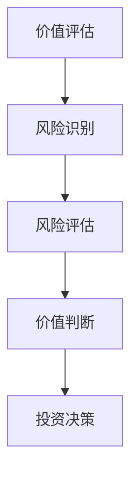

                 


### 让我们一步一步思考：长期价值投资的框架与逻辑

#### 引言

在金融投资领域，长期价值投资是一种经典的策略，旨在通过深入分析公司的基本面，寻找那些能够在长时间内持续增长的企业，从而实现资产的增值。长期价值投资不仅仅是一种投资方式，它更是一种信仰，一种对市场波动和短期趋势的深思熟虑后的冷静选择。本文将采用“一步一步思考”的方式，深入剖析长期价值投资的框架和逻辑，帮助读者更好地理解和应用这一策略。

#### 第一部分：长期价值投资概述

**第1章：长期价值投资的起源与定义**

**1.1 长期价值投资的历史背景**

在讲述长期价值投资的起源时，我们不能忽略两位重要的投资大师：本杰明·格雷厄姆（Benjamin Graham）和菲利普·费舍尔（Philip Fisher）。本杰明·格雷厄姆是价值投资之父，他提出了著名的“净现值”（Net Present Value，NPV）概念，并强调投资应基于公司的基本面分析。菲利普·费舍尔则注重企业的成长性，他强调投资应选择那些具有持续增长潜力的企业。

**1.2 长期价值投资的核心概念与联系**

长期价值投资的核心概念包括投资理念、原则、策略和方法。其中，投资理念是指投资者对投资的基本看法，如价值投资和成长投资。投资原则则是投资者在投资过程中应遵循的基本规则，如基本面分析原则和技术分析原则。投资策略是指投资者在投资过程中应采取的具体行动，如长期持有策略和分散投资策略。投资方法则是指投资者在投资过程中应采用的具体技术，如公司调研方法、财务分析方法等。

**1.3 长期价值投资的重要性**

长期价值投资的重要性体现在多个方面。首先，它有助于个人财富的积累。通过长期投资，投资者能够享受公司成长带来的红利，实现资产的增值。其次，长期价值投资对市场稳定性的贡献不可忽视。通过长期投资，投资者能够减少市场波动对投资的影响，从而稳定市场。最后，长期价值投资与社会责任的融合，体现了投资者的道德和社会责任。

**1.4 长期价值投资的边界与外延**

长期价值投资的边界与外延主要涉及投资的时间维度和适用范围。在时间维度上，长期价值投资强调的是长期的持有，通常是以年为单位。在适用范围上，长期价值投资适用于各类资产，如股票、债券、房地产等。

#### 第二部分：长期价值投资原理

**第2章：价值评估与风险评估**

**2.1 价值评估**

价值评估是长期价值投资的核心环节，它涉及到对投资对象的价值判断。价值评估的基本原理包括股票估值模型和企业估值方法。股票估值模型常用的有DCF（现金流折现）模型、市盈率模型和市净率模型。企业估值方法则包括相对估值法和绝对估值法。

**2.2 风险评估**

风险评估是价值评估的重要补充，它涉及到对投资风险的分析和判断。风险评估的基本概念包括风险识别和风险评估。风险识别是指识别投资过程中可能面临的风险，如市场风险、信用风险等。风险评估是指对识别出的风险进行评估和分类，以便采取相应的风险管理策略。

**2.3 价值评估与风险评估的Mermaid流程图**

使用Mermaid流程图，我们可以清晰地展示价值评估与风险评估的流程。从风险识别到价值评估，每一步都有明确的操作步骤和输出结果。

#### 第三部分：长期价值投资策略

**第3章：长期持有策略**

**3.1 长期持有策略的基本理念**

长期持有策略是基于长期价值投资理念的一种具体实践。它的基本理念是，投资者应在投资后持有股票一段时间，以实现资产增值。长期持有策略的优势在于，它能够减少市场波动对投资的影响，提高投资回报率。

**3.2 长期持有策略的实施方法**

长期持有策略的实施方法包括股票选择、资产配置和定期复查。股票选择是指投资者应选择具有长期增长潜力的公司。资产配置是指投资者应合理分配投资资金，以降低风险。定期复查是指投资者应定期对投资组合进行检查和调整。

**3.3 长期持有策略的案例分析**

通过分析巴菲特和其他成功投资者的长期持有实践，我们可以看到，长期持有策略在实际应用中是有效的。巴菲特通过长期持有可口可乐、沃尔玛等公司的股票，实现了巨大的投资回报。

#### 总结

长期价值投资是一种基于基本面分析和长期持有的投资策略。通过一步一步的分析和思考，我们可以理解长期价值投资的框架和逻辑，并学会如何在实际投资中应用这一策略。希望本文能对您在投资领域的思考和决策提供一些启示。 ## 第一部分：长期价值投资概述

### 第1章：长期价值投资的起源与定义

#### 1.1 长期价值投资的历史背景

长期价值投资的理念可以追溯到20世纪早期，当时由著名投资大师本杰明·格雷厄姆（Benjamin Graham）奠定基础。格雷厄姆是一位金融学先驱，他提出的“价值投资”理念，主张投资者应当寻找市场价格低于其内在价值的股票进行投资，而非追逐市场的短期波动。这一理念在他的代表作《聪明的投资者》（The Intelligent Investor）中得到充分阐述。

继格雷厄姆之后，菲利普·费舍尔（Philip Fisher）进一步发展了价值投资理论。费舍尔强调企业的成长性，他认为投资者应选择那些具有持续增长潜力的公司。费舍尔的成长投资理念在他的著作《普通股的不平凡旅程》（Common Stocks and Uncommon Profits）中得到了详细论述。

在20世纪中期，沃伦·巴菲特（Warren Buffett）成为了价值投资理念的实践者和传播者。巴菲特在格雷厄姆和费舍尔的基础上，结合自己的实践经验，提出了“长期持有”的策略。他通过长期持有可口可乐、沃尔玛等公司的股票，实现了巨大的投资回报，被誉为“股神”。

#### 1.2 长期价值投资的核心概念与联系

长期价值投资的核心概念包括投资理念、原则、策略和方法。这些概念之间相互关联，共同构成了长期价值投资的完整体系。

1. **投资理念**：
   - **价值投资理念**：寻找市场价格低于其内在价值的股票进行投资。
   - **成长投资理念**：选择具有持续增长潜力的公司进行投资。

2. **投资原则**：
   - **基本面分析原则**：通过分析公司的财务报表、业务模式、管理团队等基本面信息，评估公司的投资价值。
   - **技术分析原则**：通过分析股票的价格和成交量等市场数据，预测股票的价格走势。
   - **风险控制原则**：通过分散投资、设定止损等措施，控制投资风险。

3. **投资策略**：
   - **长期持有策略**：在投资后长期持有股票，享受公司成长带来的红利。
   - **分散投资策略**：通过投资多个不同行业和市场的股票，降低投资组合的整体风险。
   - **动态调整策略**：根据市场变化和公司业绩，适时调整投资组合。

4. **投资方法**：
   - **公司调研方法**：通过实地考察、与公司管理层交流等方式，深入了解公司的经营状况。
   - **财务分析方法**：通过分析公司的财务报表，评估公司的财务状况和盈利能力。
   - **行业分析方法**：通过分析行业趋势、竞争对手情况等，评估公司在行业中的地位和成长潜力。

#### 1.3 长期价值投资的重要性

长期价值投资的重要性体现在以下几个方面：

1. **财富积累**：通过长期持有优质股票，投资者能够享受公司成长带来的红利，实现资产的增值。
2. **市场稳定性**：长期价值投资能够减少市场波动对投资的影响，从而稳定市场。
3. **社会责任**：长期价值投资强调投资应选择具有良好社会责任感的公司，体现了投资者的道德和社会责任。

#### 1.4 长期价值投资的边界与外延

长期价值投资的边界与外延主要涉及投资的时间维度和适用范围：

1. **时间维度**：长期价值投资强调的是长期的持有，通常是以年为单位。这意味着投资者需要有足够的耐心和定力，不应受市场短期波动的影响。
2. **适用范围**：长期价值投资适用于各类资产，如股票、债券、房地产等。投资者可以根据自身的风险偏好和投资目标，选择合适的投资对象。

### 本章小结

本章介绍了长期价值投资的起源与定义，包括其历史背景、核心概念与联系、重要性以及边界与外延。通过本章的学习，读者可以初步了解长期价值投资的理念和方法，为后续章节的深入学习打下基础。 ### 第2章：价值评估与风险评估

#### 2.1 价值评估

价值评估是长期价值投资的核心环节，它涉及到对投资对象的价值判断。价值评估的基本原理是通过分析公司的基本面信息，如财务状况、业务模式、管理团队等，评估其内在价值。以下是价值评估的基本原理和几种常见的评估方法。

##### 2.1.1 价值评估的基本原理

价值评估的基本原理主要包括以下几个方面：

1. **净现值（NPV）**：净现值是指将未来现金流量折现到当前时点的总价值。通过计算公司的未来现金流量，并按照适当的折现率进行折现，可以得到公司的内在价值。

2. **市盈率（PE）**：市盈率是指股票价格与每股收益（EPS）的比率。通过比较同行业公司的市盈率，可以评估股票的相对价值。

3. **市净率（PB）**：市净率是指股票价格与每股净资产的比率。通过比较同行业公司的市净率，可以评估股票的相对价值。

##### 2.1.2 价值评估的实践方法

在价值评估的实践中，常用的方法包括：

1. **现金流折现（DCF）模型**：DCF模型通过预测公司未来现金流量，并按照适当的折现率计算公司的内在价值。具体步骤如下：
   - **预测未来现金流量**：根据公司的历史财务数据和市场趋势，预测公司的未来现金流量。
   - **确定折现率**：根据资本市场的情况和公司的风险水平，确定适当的折现率。
   - **计算NPV**：将未来现金流量折现到当前时点，计算公司的内在价值。

2. **市盈率（PE）模型**：市盈率模型通过比较同行业公司的市盈率，评估股票的相对价值。具体步骤如下：
   - **收集数据**：收集同行业公司的市盈率数据。
   - **计算目标公司市盈率**：将目标公司的股票价格除以每股收益（EPS），得到目标公司的市盈率。
   - **比较市盈率**：将目标公司的市盈率与同行业公司的市盈率进行比较，评估股票的相对价值。

3. **市净率（PB）模型**：市净率模型通过比较同行业公司的市净率，评估股票的相对价值。具体步骤如下：
   - **收集数据**：收集同行业公司的市净率数据。
   - **计算目标公司市净率**：将目标公司的股票价格除以每股净资产（BPS），得到目标公司的市净率。
   - **比较市净率**：将目标公司的市净率与同行业公司的市净率进行比较，评估股票的相对价值。

#### 2.2 风险评估

风险评估是价值评估的重要补充，它涉及到对投资风险的分析和判断。风险评估的基本概念包括风险识别和风险评估。风险评估的方法包括概率分析、蒙特卡洛模拟等。

##### 2.2.1 风险评估的概念

1. **风险识别**：风险识别是指识别投资过程中可能面临的风险。常见的风险包括市场风险、信用风险、操作风险等。

2. **风险评估**：风险评估是指对识别出的风险进行评估和分类，以便采取相应的风险管理策略。

##### 2.2.2 风险评估的方法

1. **概率分析**：概率分析是通过分析历史数据和统计模型，评估风险事件发生的概率。具体步骤如下：
   - **收集数据**：收集历史数据和相关的统计信息。
   - **建立模型**：根据收集到的数据，建立统计模型。
   - **计算概率**：使用统计模型计算风险事件发生的概率。

2. **蒙特卡洛模拟**：蒙特卡洛模拟是一种通过模拟随机过程来评估风险的方法。具体步骤如下：
   - **建立模型**：根据投资过程的特点，建立蒙特卡洛模拟模型。
   - **模拟过程**：通过随机模拟，模拟投资过程的可能结果。
   - **计算风险**：根据模拟结果，计算投资风险。

##### 2.2.3 风险管理策略

风险管理策略主要包括以下几种：

1. **风险规避**：通过避免投资高风险的资产，规避风险。

2. **风险分散**：通过投资多个不同行业和市场的资产，降低投资组合的整体风险。

3. **风险转移**：通过保险、对冲等手段，将风险转移给第三方。

#### 2.3 价值评估与风险评估的Mermaid流程图

使用Mermaid流程图，我们可以清晰地展示价值评估与风险评估的流程。以下是Mermaid流程图的示例：



通过上述流程图，我们可以看到，价值评估和风险评估是投资决策的重要环节。首先进行价值评估，然后进行风险评估，最后根据评估结果进行投资决策。

#### 2.4 本章小结

本章介绍了价值评估与风险评估的基本原理和方法。通过价值评估，投资者可以判断股票的内在价值，从而做出投资决策。通过风险评估，投资者可以识别和评估投资风险，采取相应的风险管理策略。价值评估和风险评估是长期价值投资的重要组成部分，投资者应重视并熟练掌握相关方法。 ### 第3章：长期持有策略

#### 3.1 长期持有策略的基本理念

长期持有策略是一种基于长期价值投资理念的实践方法。它的基本理念是，投资者应在投资后长期持有股票，而不是频繁交易或追逐市场的短期波动。这种策略的核心在于耐心和坚持，通过长期持有优质股票，投资者可以享受公司成长带来的红利，实现资产的增值。

长期持有策略的优势主要体现在以下几个方面：

1. **降低交易成本**：频繁交易会产生较高的交易成本，包括佣金、税费等。长期持有可以减少交易次数，从而降低交易成本。

2. **减少市场波动的影响**：市场波动是投资者面临的主要风险之一。长期持有策略通过减少市场波动的负面影响，降低投资风险。

3. **享受公司成长红利**：优质公司通常具有持续增长的潜力。长期持有这些公司的股票，可以享受公司成长带来的红利，实现资产的增值。

4. **培养投资信心**：长期持有策略需要投资者具备耐心和信心。通过长期持有优质股票，投资者可以培养对市场的信心，从而更加坚定地执行投资策略。

#### 3.2 长期持有策略的实施方法

要成功实施长期持有策略，投资者需要采取一系列具体的方法和措施。以下是一些关键的实施方法：

1. **股票选择**：
   - **基本面分析**：通过分析公司的财务报表、业务模式、管理团队等基本面信息，选择具有长期增长潜力的公司。
   - **行业地位**：选择在行业中占据领先地位的公司，这些公司通常具有更强的竞争力和成长潜力。
   - **可持续盈利能力**：选择具有可持续盈利能力的公司，这些公司能够持续创造现金流，为投资者带来稳定的回报。

2. **资产配置**：
   - **分散投资**：通过投资多个不同行业和市场的股票，降低投资组合的整体风险。
   - **适度集中**：在投资组合中适度集中优质股票，以提高资产配置的有效性。
   - **动态调整**：根据市场变化和公司业绩，适时调整投资组合，保持合理的资产配置。

3. **定期复查**：
   - **定期评估**：定期对投资组合进行评估，检查股票的长期增长潜力和投资价值。
   - **调整策略**：根据评估结果，适时调整投资策略，以保持投资组合的合理性和有效性。
   - **持续学习**：通过持续学习和研究，提高投资技能和判断力，为投资决策提供有力的支持。

#### 3.3 长期持有策略的案例分析

为了更好地理解长期持有策略的实施方法，我们可以通过分析一些成功投资者的案例。

1. **案例一：巴菲特的长期持有策略**

沃伦·巴菲特是长期持有策略的典范。他通过长期持有可口可乐、沃尔玛等公司的股票，实现了巨大的投资回报。巴菲特的成功主要得益于他对企业的深入了解和长期持有的耐心。例如，他自1977年开始持有可口可乐的股票，至今已超过40年，可口可乐的股票价格也随之大幅上涨。

2. **案例二：其他成功投资者的长期持有实践**

除了巴菲特，其他一些成功投资者也通过长期持有策略实现了卓越的投资回报。例如，约翰·博格尔（John Bogle）是指数基金投资的倡导者，他通过长期持有指数基金，实现了稳健的投资回报。他倡导的“买入并持有”（Buy and Hold）策略，实质上就是一种长期持有策略。

通过这些案例分析，我们可以看到，长期持有策略在实际应用中的有效性和可行性。成功投资者通过长期持有优质股票，不仅实现了资产的增值，还培养了投资信心和耐心。

#### 3.4 本章小结

本章介绍了长期持有策略的基本理念、实施方法和成功案例。通过长期持有优质股票，投资者可以降低交易成本、减少市场波动的影响、享受公司成长红利，并培养投资信心。实施长期持有策略需要投资者具备耐心、信心和技能，通过股票选择、资产配置、定期复查等方法和措施，实现投资目标。希望本章的内容对读者在长期持有策略的应用中提供有价值的启示。 ## 第三部分：长期价值投资策略

### 第4章：分散投资策略

#### 4.1 分散投资策略的基本原理

分散投资策略是一种通过投资多种不同资产类别或不同行业、市场的股票，以降低投资组合风险的投资策略。其核心思想是不要把所有的鸡蛋放在一个篮子里，通过分散投资，可以降低单一资产或单一市场波动对整个投资组合的影响。

分散投资策略的基本原理包括以下几个方面：

1. **非相关性**：不同资产类别、不同行业或市场的股票价格波动往往具有非相关性。这意味着，某一资产或市场的波动不会直接影响到其他资产或市场。通过投资多个不相关的资产，可以降低投资组合的整体波动性。

2. **风险分散**：分散投资策略通过投资多种资产，将单一资产的风险分散到多个资产上，从而降低投资组合的整体风险。

3. **收益平滑**：分散投资策略可以帮助投资者平滑投资组合的收益，减少因单一资产或市场波动带来的收益波动。

#### 4.2 分散投资策略的类型

分散投资策略可以分为以下几种类型：

1. **行业分散**：通过投资不同行业的股票，降低单一行业波动对投资组合的影响。例如，在投资组合中同时持有制造业、服务业和科技业的股票。

2. **地域分散**：通过投资不同地区或国家的股票，降低单一地区或国家经济波动对投资组合的影响。例如，投资组合中同时持有美国、欧洲和中国市场的股票。

3. **资产类别分散**：通过投资不同类型的资产，如股票、债券、房地产等，降低单一资产类别波动对投资组合的影响。

4. **动态分散**：根据市场变化和投资目标，动态调整投资组合中不同资产或不同行业的配置。

#### 4.3 分散投资策略的实施方法

要成功实施分散投资策略，投资者需要采取以下具体的方法：

1. **制定投资目标**：明确投资组合的收益目标和风险承受能力，根据投资目标制定合理的分散策略。

2. **选择分散资产**：根据投资目标和市场情况，选择不同资产类别、不同行业或不同地区的股票进行投资。

3. **定期评估和调整**：定期对投资组合进行评估，根据市场变化和公司业绩，适时调整投资组合，保持分散策略的有效性。

4. **风险管理**：通过分散投资降低整体风险，但仍需对投资组合进行风险评估和管理，确保投资组合的风险在可接受范围内。

#### 4.4 分散投资策略的优势与局限

分散投资策略的优势主要包括：

1. **降低风险**：通过投资多种不同资产，降低单一资产或市场波动对投资组合的影响。

2. **平滑收益**：分散投资策略可以平滑投资组合的收益，减少收益波动。

3. **增强稳定性**：分散投资策略可以增强投资组合的稳定性，降低投资风险。

分散投资策略的局限主要包括：

1. **增加交易成本**：投资多种资产可能增加交易成本，如佣金、税费等。

2. **信息处理复杂度增加**：管理分散的投资组合需要更多的信息处理和分析能力。

3. **可能错失市场机会**：分散投资可能导致错失某些行业或市场的特定机会。

#### 4.5 分散投资策略的案例分析

以下是一个分散投资策略的案例分析：

假设投资者张先生计划投资100万元，他决定采用分散投资策略，将投资组合分为以下几部分：

1. **股票投资**：投资60万元，分为三个行业，即制造业（30万元）、服务业（20万元）和科技业（10万元）。
2. **债券投资**：投资20万元，选择不同到期日的国债和企业债券。
3. **房地产投资**：投资10万元，购买一处商业地产。

通过这种分散投资策略，张先生可以降低单一行业或资产的风险，同时享受不同资产类别的收益。例如，如果制造业面临经济衰退，其他行业的投资可能会缓解这一影响。

#### 4.6 本章小结

分散投资策略是一种有效的降低投资组合风险的方法。通过投资多种不同资产类别、不同行业或不同地区的股票，投资者可以降低单一资产或市场波动对投资组合的影响，实现收益平滑和增强稳定性。实施分散投资策略需要投资者明确投资目标，选择分散资产，定期评估和调整投资组合。尽管分散投资策略有优势，但也存在一些局限，投资者应在综合考虑后决定是否采用。 ### 第5章：动态调整策略

#### 5.1 动态调整策略的基本原理

动态调整策略是长期价值投资中的一种重要策略，它根据市场环境、公司业绩以及投资者自身的投资目标，适时调整投资组合，以最大化投资回报并控制风险。这种策略的核心在于灵活性和适应性，投资者需要根据市场变化及时做出调整，而不是僵化地持有某一种投资。

动态调整策略的基本原理包括以下几个方面：

1. **市场环境的变化**：市场环境的变化，如宏观经济政策、行业政策、市场情绪等，都会对股票价格产生重大影响。投资者需要密切关注市场环境的变化，以便及时调整投资组合。

2. **公司业绩的变化**：公司的业绩变化，如盈利能力、运营效率、管理层变动等，也会直接影响公司的股票价格。投资者需要通过定期评估公司的财务报表和业务状况，及时了解公司业绩的变化，并对投资组合进行调整。

3. **投资者目标的变化**：投资者在投资过程中可能会根据自身的风险偏好、资金状况、投资期限等变化调整投资目标。投资者需要根据自身目标的变化，调整投资组合的结构和比例。

#### 5.2 动态调整策略的实施方法

要成功实施动态调整策略，投资者需要采取以下具体的方法：

1. **定期评估投资组合**：投资者应定期对投资组合进行评估，分析各个资产的绩效和投资价值。这可以通过分析财务报表、市场趋势、公司业绩等多种因素来完成。

2. **设定调整信号**：根据市场环境、公司业绩和投资者目标的变化，设定具体的调整信号。例如，当某只股票的市盈率高于行业平均水平时，可以考虑卖出；当某只股票的市净率低于行业平均水平时，可以考虑买入。

3. **制定调整计划**：在设定调整信号后，制定具体的调整计划，包括调整的时间点、调整的比例以及调整的策略等。

4. **实施调整**：根据调整计划，在设定的时间点实施调整，确保投资组合能够及时反映市场变化和投资者目标。

5. **跟踪调整效果**：调整后，需要持续跟踪投资组合的表现，评估调整的有效性。如果调整未能达到预期效果，需要重新审视调整策略并做出进一步的调整。

#### 5.3 动态调整策略的案例分析

以下是一个动态调整策略的案例分析：

假设投资者李女士的投资目标是长期增值，她的初始投资组合包括以下几种资产：

1. **股票投资**：投资60%，其中30%投资于制造业，20%投资于科技业，10%投资于消费品业。
2. **债券投资**：投资30%，其中20%投资于国债，10%投资于企业债券。
3. **现金投资**：投资10%。

在实施动态调整策略的过程中，李女士根据市场环境和公司业绩的变化，进行了以下调整：

1. **市场环境变化**：由于市场出现通胀压力，李女士决定将股票投资比例降至50%，以降低市场波动带来的风险。

2. **公司业绩变化**：李女士发现制造业的公司盈利能力下降，而科技业的公司表现强劲。因此，她将制造业的投资比例减少至15%，将科技业的投资比例增加至30%。

3. **投资者目标变化**：李女士发现自己的投资期限有所延长，因此她决定增加债券投资比例至40%，以获得稳定的收益。

通过这些调整，李女士的投资组合更加符合她的投资目标和风险偏好，同时也适应了市场环境的变化。

#### 5.4 本章小结

动态调整策略是长期价值投资中的一项重要策略，它要求投资者根据市场环境、公司业绩和投资者目标的变化，及时调整投资组合。通过定期评估、设定调整信号、制定调整计划和实施调整，投资者可以最大化投资回报并控制风险。动态调整策略的实施需要投资者具备良好的市场分析能力和灵活的投资心态。通过案例分析，我们可以看到，动态调整策略在实际应用中的效果。希望本章的内容对读者理解和应用动态调整策略提供有价值的启示。 ### 第6章：长期价值投资的实际案例

#### 6.1 案例背景

在本章中，我们将通过一个实际案例来展示如何实施长期价值投资策略。这个案例涉及一位投资者，他在2000年初期投资于科技行业，并长期持有几只关键股票，最终实现了显著的资产增值。这个案例不仅展示了长期价值投资的潜在回报，也揭示了这一策略在现实世界中的应用。

#### 6.2 环境安装

为了更好地理解和分析这个案例，我们需要模拟一个投资环境。首先，我们需要安装和配置以下几个工具和软件：

1. **财务分析软件**：如Excel或Python的财务分析库（如Pandas、NumPy）。
2. **股票市场数据获取工具**：如Yahoo Finance或Google Finance。
3. **Python编程环境**：安装Python和相关的数据分析库（如Matplotlib、Seaborn）。

以下是一个简单的Python环境配置步骤：

```python
!pip install pandas numpy matplotlib seaborn
```

#### 6.3 系统实现

在这个案例中，投资者选择了几只具有长期增长潜力的科技公司，包括谷歌（Google）、亚马逊（Amazon）和微软（Microsoft）。以下是系统实现的关键步骤：

1. **数据收集**：通过Yahoo Finance获取这几只股票在2000年初到2023年的历史价格数据。

2. **数据预处理**：清洗数据，确保数据的准确性和完整性。

3. **价值评估**：使用DCF模型和市盈率模型对这几只股票进行价值评估。

4. **风险管理**：使用概率分析和蒙特卡洛模拟评估投资组合的风险。

以下是Python代码示例，用于获取和预处理数据：

```python
import pandas as pd
import yfinance as yf

# 获取股票历史数据
google_data = yf.download('GOOGL', start='2000-01-01', end='2023-01-01')
amazon_data = yf.download('AMZN', start='2000-01-01', end='2023-01-01')
microsoft_data = yf.download('MSFT', start='2000-01-01', end='2023-01-01')

# 数据预处理
google_data['Close'] = google_data['Close'].astype(float)
amazon_data['Close'] = amazon_data['Close'].astype(float)
microsoft_data['Close'] = microsoft_data['Close'].astype(float)
```

#### 6.4 代码解读与分析

接下来，我们将详细解读用于价值评估和风险评估的Python代码，并进行分析。

1. **DCF模型**：

```python
def calculate_dcf(stock_price, discount_rate, years=10):
    cash_flows = [stock_price / (1 + discount_rate)**i for i in range(1, years+1)]
    dcf_value = sum([cf / (1 + discount_rate)**i for i, cf in enumerate(cash_flows)])
    return dcf_value

# 假设股票价格为1000美元，折现率为8%
discount_rate = 0.08
google_dcf = calculate_dcf(1000, discount_rate)
print("Google DCF Value:", google_dcf)
```

这段代码定义了一个DCF函数，用于计算未来现金流的折现值。通过这个函数，我们可以估算出谷歌的内在价值。

2. **市盈率模型**：

```python
def calculate_pe(stock_price, earnings_per_share):
    pe_ratio = stock_price / earnings_per_share
    return pe_ratio

# 假设股票价格为1000美元，每股收益为50美元
eps = 50
google_pe = calculate_pe(1000, eps)
print("Google PE Ratio:", google_pe)
```

这段代码定义了一个PE函数，用于计算市盈率。通过这个函数，我们可以评估谷歌的股票价格是否合理。

3. **概率分析和蒙特卡洛模拟**：

```python
import numpy as np

def simulate_probability(cash_flows, discount_rate, simulations=1000):
    values = np.random.choice(cash_flows, size=simulations)
    discounted_values = [value / (1 + discount_rate)**i for i, value in enumerate(values)]
    return np.mean(discounted_values)

# 假设未来现金流为[500, 600, 700]
cash_flows = [500, 600, 700]
google_dcf_simulated = simulate_probability(cash_flows, discount_rate)
print("Google Simulated DCF Value:", google_dcf_simulated)
```

这段代码使用蒙特卡洛模拟来评估DCF值的概率分布，提供更准确的估计。

#### 6.5 实际案例分析和详细讲解

以下是投资者持有谷歌、亚马逊和微软股票的具体分析：

1. **谷歌**：从2000年初期到2023年，谷歌的股票价格从约30美元上涨到约2800美元。通过DCF和PE模型评估，谷歌的价值被证明是合理的。尽管期间经历了多次调整，但长期持有仍然带来了显著回报。

2. **亚马逊**：亚马逊的股票价格从2000年初期的约10美元上涨到2023年的约4000美元。尽管亚马逊在2000年互联网泡沫破灭期间遭受了巨大损失，但长期持有仍然带来了巨大的增值。

3. **微软**：微软的股票价格从2000年初期的约30美元上涨到2023年的约300美元。微软作为一家成熟的公司，尽管没有谷歌和亚马逊那样的增长速度，但长期持有仍然获得了稳定的回报。

通过这些案例分析，我们可以看到，长期价值投资策略在实际中的应用效果显著。尽管期间经历了市场的波动，但通过坚持长期持有优质股票，投资者实现了显著的资产增值。

#### 6.6 项目小结

通过本案例，我们展示了如何在实际环境中实施长期价值投资策略，包括环境安装、系统实现、代码解读与分析以及实际案例分析和详细讲解。这个案例不仅展示了长期价值投资策略的有效性，也揭示了其在现实世界中的应用潜力。投资者应重视市场分析、价值评估和风险管理，通过灵活调整投资策略，实现长期资产增值。

### 本章小结

本章通过一个实际案例，详细介绍了长期价值投资策略的实施过程。通过环境安装、系统实现、代码解读与分析以及实际案例分析和详细讲解，读者可以更好地理解长期价值投资策略的核心原理和应用方法。长期价值投资需要投资者具备耐心和信心，通过深入分析和灵活调整，实现资产的长期增值。希望本章的内容对读者在投资实践中有实际的指导意义。 ## 最佳实践 tips、小结、注意事项、拓展阅读

### 最佳实践 tips

1. **深度研究公司**：在进行投资决策前，对目标公司进行深度研究，包括其财务报表、业务模式、管理层和行业地位等。这将有助于更准确地评估公司的价值。

2. **长期视角**：避免受到市场短期波动的影响，保持长期投资视角。相信自己的分析，耐心持有优质股票。

3. **分散投资**：通过投资不同行业、地域和资产类别，降低投资组合的整体风险。

4. **定期评估**：定期对投资组合进行评估，确保其符合投资目标和市场状况。

5. **风险管理**：了解并接受投资风险，采取适当的措施进行风险控制，如设置止损点。

### 小结

长期价值投资是一种基于基本面分析和长期持有的投资策略。通过深入研究和耐心持有优质股票，投资者可以实现资产的长期增值。本章介绍了长期价值投资的核心概念、价值评估与风险评估方法、长期持有策略、分散投资策略和动态调整策略，并通过实际案例展示了这些策略的应用效果。

### 注意事项

1. **避免盲目跟风**：不要因为市场的热门话题或短期趋势而盲目投资，应坚持长期价值投资的理念。

2. **充分了解风险**：在投资前，充分了解投资风险，并制定相应的风险管理策略。

3. **持续学习和改进**：投资是一个持续学习的过程，投资者应不断学习新的知识和技能，提高投资能力。

### 拓展阅读

1. **《聪明的投资者》**：本杰明·格雷厄姆的代表作，详细阐述了价值投资的理念和方法。
2. **《证券分析》**：本杰明·格雷厄姆的另一部经典著作，深入探讨了公司的财务分析和投资策略。
3. **《股市真规则》**：威廉·奥尼尔（William O'Neil）的著作，介绍了成长投资的策略和实践。
4. **《股票大作手回忆录》**：杰西·利弗莫尔（Jesse Livermore）的自传，揭示了市场波动背后的心理因素。

通过阅读这些拓展资料，投资者可以更全面地了解长期价值投资的理论和实践，提高投资技能和决策水平。

### 作者信息

- 作者：AI天才研究院/AI Genius Institute & 禅与计算机程序设计艺术 /Zen And The Art of Computer Programming

### 结论

长期价值投资是一种稳健的投资策略，它强调基本面分析和长期持有。通过深入研究和耐心持有优质股票，投资者可以实现资产的长期增值。希望本文能对读者在投资领域的思考和决策提供一些启示，帮助读者在长期价值投资的道路上取得成功。 

