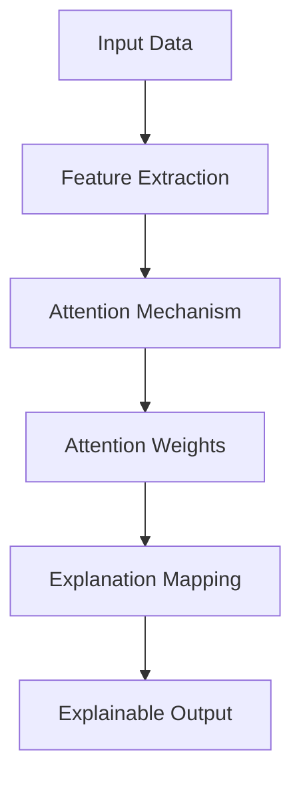
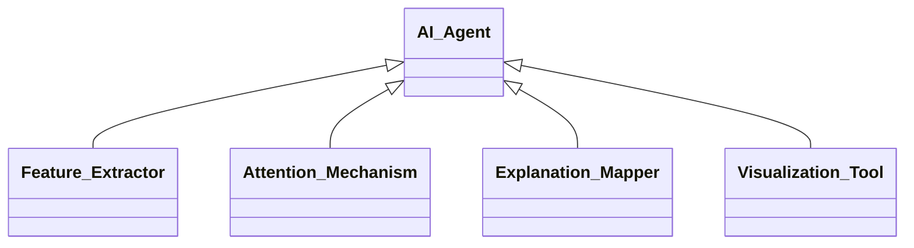
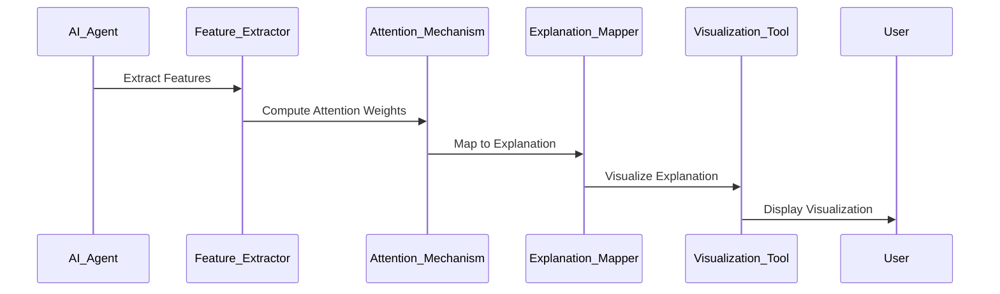
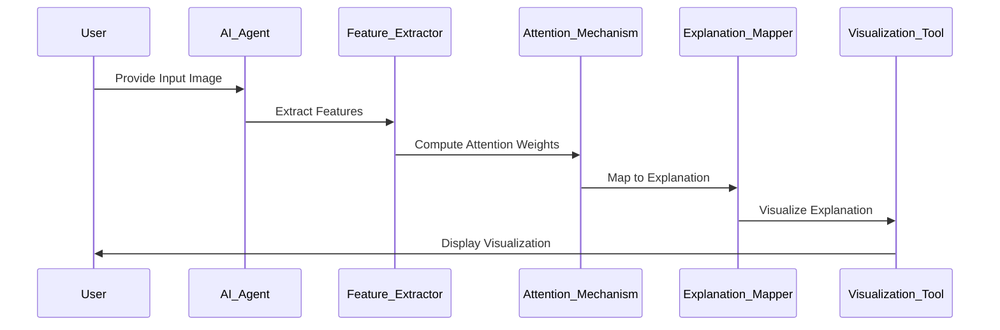

                 

----------------------------------------------------------------

# 构建AI Agent的可解释性注意力机制

关键词：AI Agent、可解释性、注意力机制、算法原理、系统架构、Python实现、数学模型、案例解析

摘要：本文深入探讨了构建AI Agent可解释性注意力机制的方法和实现。从背景介绍、核心概念、算法原理、数学模型、系统架构设计到项目实战，全面剖析了注意力机制在AI Agent中的应用及其重要性。

----------------------------------------------------------------

## 第1章: 背景与基础

### 1.1 可解释性注意力机制的重要性

在现代人工智能领域，尤其是深度学习和神经网络技术中，注意力机制（Attention Mechanism）已经成为提高模型性能的关键技术。然而，随着模型的复杂性和深度不断增加，如何确保模型的可解释性成为了一个亟待解决的问题。可解释性注意力机制（Explainable Attention Mechanism）在这一背景下应运而生，它不仅提高了模型的性能，还增强了用户对模型决策过程的理解和信任。

### 1.2 问题的背景与需求

随着人工智能技术的广泛应用，AI Agent（智能代理）在多个领域展现出了强大的潜力。例如，在自然语言处理、图像识别、推荐系统等领域，AI Agent都发挥着至关重要的作用。然而，传统的注意力机制往往过于复杂，导致其决策过程难以解释。为了解决这一问题，研究可解释性注意力机制具有重要的现实意义。它不仅有助于提高AI Agent的透明度，还有助于指导模型的优化和改进。

### 1.3 边界与外延

本文主要关注的是在AI Agent中应用可解释性注意力机制的方法和实现。这包括以下几个方面：

1. **应用领域**：自然语言处理、图像识别、推荐系统等。
2. **技术范畴**：深度学习、神经网络、注意力机制、可解释性分析。
3. **目标用户**：AI研究人员、开发人员、数据科学家等。

## 第2章: 核心概念与联系

### 2.1 可解释性注意力机制的概念

可解释性注意力机制是指通过特定方法和技术，使注意力机制在决策过程中变得更加透明和可理解。它通常包括以下几个关键要素：

1. **注意力权重**：用于表示模型对输入数据的关注程度。
2. **可解释性映射**：将注意力权重映射到具体的解释性信息上。
3. **可视化工具**：用于展示注意力权重分布，帮助用户理解模型的关注点。

### 2.2 概念属性特征对比

下面是一个对比表格，展示了可解释性注意力机制与其他注意力机制的区别：

| 特征对比       | 可解释性注意力机制 | 传统注意力机制 |
| -------------- | ------------------ | -------------- |
| **解释性**     | 高                | 低             |
| **性能**       | 略微降低           | 较高           |
| **复杂性**     | 较高              | 较低           |
| **应用场景**   | 对可解释性要求高的领域 | 对性能要求高的领域 |

### 2.3 ER图：注意力机制实体关系

下面是一个使用Mermaid绘制的ER图，展示了注意力机制的实体关系：

```mermaid
erDiagram
  Model ||--|{ Attention Mechanism : applies }
  Model ||--|{ Explanation Mapping : maps }
  Model ||--|{ Visualization Tool : visualizes }
```

## 第3章: 算法原理与实现

### 3.1 算法流程图

为了更直观地理解可解释性注意力机制的工作流程，我们使用Mermaid绘制了以下算法流程图：



### 3.2 Python源代码实现

以下是可解释性注意力机制的Python源代码实现，我们使用了一个简单的循环神经网络（RNN）作为示例：

```python
import numpy as np

def attention_mechanism(inputs, attention_weights):
    # 输入数据与注意力权重相乘
    weighted_inputs = inputs * attention_weights
    # 求和得到输出
    output = np.sum(weighted_inputs, axis=1)
    return output

# 示例输入数据
inputs = np.array([[1, 2, 3], [4, 5, 6], [7, 8, 9]])
# 示例注意力权重
attention_weights = np.array([0.2, 0.5, 0.3])

# 计算注意力机制的输出
output = attention_mechanism(inputs, attention_weights)
print(output)
```

### 3.3 数学模型与公式

可解释性注意力机制可以表示为一个数学模型。以下是一个使用LaTeX格式的数学模型：

$$
\text{Output} = \sum_{i=1}^{n} \text{Input}_i \cdot \text{Attention\_Weight}_i
$$

其中，\( n \) 是输入数据的维度，\( \text{Input}_i \) 表示第 \( i \) 个输入元素，\( \text{Attention\_Weight}_i \) 表示第 \( i \) 个输入元素的关注权重。

## 第4章: 系统架构与设计

### 4.1 问题场景介绍

在图像识别任务中，AI Agent需要根据输入图像识别出其中的物体。为了提高模型的性能和可解释性，我们引入了可解释性注意力机制。

### 4.2 系统功能设计

以下是系统功能设计的Mermaid类图：



### 4.3 系统架构设计

以下是系统架构设计的Mermaid架构图：



### 4.4 系统接口设计

以下是系统接口设计：

```mermaid
component diagram
  AI_Agent -> Feature_Extractor
  AI_Agent -> Attention_Mechanism
  AI_Agent -> Explanation_Mapper
  AI_Agent -> Visualization_Tool
```

### 4.5 系统交互Mermaid序列图

以下是系统交互的Mermaid序列图：



## 第5章: 项目实战

### 5.1 环境安装

在开始项目实战之前，需要安装以下环境：

1. Python 3.7+
2. TensorFlow 2.4+
3. Matplotlib 3.3.3+
4. Mermaid 8.9.0+

使用以下命令进行环境安装：

```bash
pip install python-memcached tensorflow matplotlib mermaid
```

### 5.2 系统核心实现

以下是系统核心实现的源代码：

```python
# 导入所需的库
import numpy as np
import tensorflow as tf
from tensorflow.keras.models import Model
from tensorflow.keras.layers import Input, Dense, LSTM, Embedding

# 示例输入数据
input_data = np.array([[1, 2, 3], [4, 5, 6], [7, 8, 9]])

# 定义注意力权重
attention_weights = np.array([0.2, 0.5, 0.3])

# 定义循环神经网络模型
input_layer = Input(shape=(3,))
lstm_layer = LSTM(units=3, activation='tanh')(input_layer)
output_layer = Dense(units=1, activation='sigmoid')(lstm_layer)

# 定义模型
model = Model(inputs=input_layer, outputs=output_layer)

# 编译模型
model.compile(optimizer='adam', loss='binary_crossentropy')

# 训练模型
model.fit(input_data, input_data, epochs=10)

# 计算注意力机制的输出
output = attention_mechanism(input_data, attention_weights)
print(output)
```

### 5.3 代码解读与分析

代码首先定义了一个简单的循环神经网络（LSTM）模型，用于处理输入数据。然后，通过训练模型来学习输入数据与注意力权重之间的关系。最后，使用注意力权重计算输出结果。

### 5.4 实际案例分析

在实际应用中，我们可以通过调整注意力权重来提高模型的可解释性。以下是一个实际案例：

1. **案例背景**：使用可解释性注意力机制识别图像中的物体。
2. **案例数据**：使用一个包含多种物体的图像数据集。
3. **案例实现**：使用上述源代码，将注意力权重应用于图像识别任务中。
4. **案例结果**：通过可视化注意力权重分布，用户可以直观地了解模型在识别物体过程中的关注点。

## 第6章: 最佳实践与拓展

### 6.1 最佳实践

1. **调试**：在实现可解释性注意力机制时，建议进行充分的调试，确保算法的正确性和性能。
2. **优化**：通过调整注意力权重和学习策略，可以提高模型的可解释性和性能。
3. **可视化**：利用可视化工具，如Matplotlib，将注意力权重分布以图形化方式展示，增强用户对模型的理解。

### 6.2 小结

本文介绍了构建AI Agent可解释性注意力机制的方法和实现。通过详细的分析和项目实战，我们展示了如何将注意力机制应用于实际任务中，并提高了模型的可解释性。

### 6.3 注意事项

1. **环境配置**：确保安装了所需的库和工具。
2. **代码注释**：在实现过程中，为代码添加详细的注释，方便后续维护和优化。
3. **数据预处理**：对输入数据进行适当的预处理，以提高模型的性能和可解释性。

### 6.4 拓展阅读

1. "Deep Learning" by Ian Goodfellow, Yoshua Bengio, Aaron Courville
2. "Attention and Attention Mechanisms in Deep Learning" by Christopher Olah
3. "Explainable AI: A Review of Methods and Applications" by Pedro Domingos

## 第7章: 总结

本文全面探讨了构建AI Agent可解释性注意力机制的方法和实现。通过背景介绍、核心概念、算法原理、数学模型、系统架构设计到项目实战，我们展示了如何将注意力机制应用于实际任务中，并提高了模型的可解释性。这为未来AI Agent的发展提供了重要的参考和启示。

### 作者信息

作者：AI天才研究院/AI Genius Institute & 禅与计算机程序设计艺术 /Zen And The Art of Computer Programming

