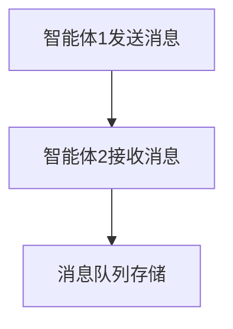
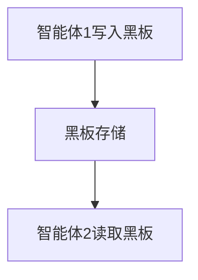
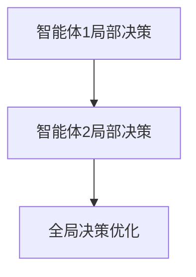
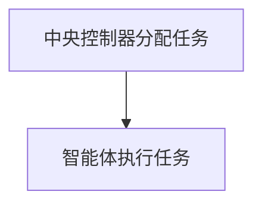

                 

### 引言

随着人工智能技术的飞速发展，多Agent系统在智能决策、协同控制等领域展现出了巨大的潜力。本文旨在深入探讨构建AI Agent的多Agent协作决策系统，从基础概念到实际应用，全方位解析这一前沿技术的实现与优化。本文将分为八个部分，首先介绍多Agent系统的基本概念与框架，然后深入探讨AI Agent的设计与实现，接着阐述多Agent协作决策系统的设计原则与实现方法，随后讨论系统的开发环境与工具，核心算法实现，测试与评估，实战应用，最后对未来的发展趋势进行展望。

多Agent系统通过多个智能体（Agent）的合作与交互，实现复杂任务的自动化处理与智能决策。AI Agent作为多Agent系统中的核心组件，其设计与实现直接决定了系统的智能水平和性能。在多Agent协作决策系统中，AI Agent需要具备独立的感知、决策和执行能力，并通过有效的通信与协作机制，与其他Agent共同完成任务。

本文的目标是通过逻辑清晰、结构紧凑的论述，帮助读者深入理解多Agent协作决策系统的构建原理和实践方法。无论您是初学者还是专业人士，都希望通过本文能够对这一领域有更加全面和深入的认识，从而在相关项目开发和应用中取得更好的成果。

### 关键词

- 多Agent系统
- AI Agent
- 协作决策
- 通信机制
- 算法实现
- 测试评估
- 实战应用
- 发展趋势

### 摘要

本文旨在深入探讨构建AI Agent的多Agent协作决策系统，系统性地介绍多Agent系统的基础概念、AI Agent的设计与实现、多Agent协作决策系统的设计原则与方法，以及系统的开发环境与工具。通过详细的案例分析，本文阐述了核心算法的实现和系统的测试与评估方法，并探讨了多Agent协作决策系统的实际应用和发展趋势。本文旨在为读者提供一个全面、系统的指南，帮助理解和掌握多Agent协作决策系统的构建原理与实践方法。

## 第一部分：多Agent系统的基本概念与框架

### 第1章：多Agent系统的概述

#### 1.1 问题背景与基本概念

**问题背景：**

多Agent系统（Multi-Agent System，MAS）是现代计算机科学与人工智能领域的一个重要研究方向。随着信息技术和人工智能技术的快速发展，复杂系统的需求不断增加。传统集中式系统在处理复杂任务时存在瓶颈，难以应对动态和不确定的环境。因此，多Agent系统作为一种分布式智能体合作与协调的体系结构，逐渐成为解决复杂问题的重要手段。

**基本概念：**

- **智能体（Agent）：** 智能体是具有独立自主性、社会性和反应性的计算机程序或实体。每个智能体能够感知环境，自主决策并执行动作，以实现其目标和任务。
- **多Agent系统（MAS）：** 由多个智能体组成的系统，这些智能体通过协同工作，共同完成任务。MAS的核心在于智能体的自主性、交互性和协同性。
- **协作：** 多个智能体通过相互通信和合作，共同完成任务的过程。协作分为合作（Collaboration）、竞争（Competition）和协调（Coordination）三种形式。

#### 1.2 多Agent系统的特征与体系结构

**特征：**

- **分布式：** 多Agent系统是分布式的，每个智能体在物理或逻辑上独立运行，共同构成一个完整的系统。
- **自主性：** 每个智能体具有独立自主的决策能力和行为，能够根据环境和目标自主调整其行为。
- **交互性：** 智能体之间通过通信和协作实现信息交换和任务协调。
- **适应性：** 多Agent系统能够适应环境变化，通过学习和适应新的环境和任务。

**体系结构：**

- **集中式体系结构：** 智能体在中央控制器的统一调度下协同工作。优点是结构简单，控制统一；缺点是依赖中央控制器，扩展性和容错性差。
- **分布式体系结构：** 每个智能体独立运行，通过局部信息和全局信息的交换进行协作。优点是扩展性好，容错性强；缺点是控制复杂，协调难度大。

#### 1.3 多Agent系统的核心理论与模型

**核心理论：**

- **通信模型：** 描述智能体之间如何进行信息交换和通信。常见的通信模型有直接通信和间接通信。
- **协同模型：** 描述智能体如何通过协作实现共同目标。常见的协同模型有集中式协同、分布式协同和混合式协同。

**核心模型：**

- **社会模型（Social Model）：** 强调智能体之间的交互和协作，通过社会规范和角色分配实现系统协调。
- **人工社会模型（Artificial Society Model）：** 类似于社会模型，但侧重于模拟人类社会中的复杂关系和行为。
- **智能体行为模型（Agent Behavior Model）：** 描述智能体的感知、决策和行动过程，是构建智能体的基础。

#### 1.3.1 通信模型

通信模型是多Agent系统中的关键部分，决定了智能体之间的信息交换和协作效果。以下是几种常见的通信模型：

- **直接通信：** 智能体通过直接发送消息进行通信，通信速度快，但受限于通信范围。
- **间接通信：** 智能体通过共享一个通信媒介（如黑板）进行信息交换，通信范围广，但速度较慢。

#### 1.3.2 协同模型

协同模型描述了智能体如何通过协作实现共同目标。以下是几种常见的协同模型：

- **集中式协同：** 智能体将决策权集中在中央控制器，由中央控制器统一调度和协调。
- **分布式协同：** 智能体在局部决策的基础上，通过协作实现全局目标，每个智能体只需关注局部信息和局部决策。
- **混合式协同：** 结合集中式和分布式协同的优点，通过分级结构实现协同。

#### 1.4 小结

本章介绍了多Agent系统的基本概念、特征、体系结构和核心理论。多Agent系统作为一种分布式智能体协作体系结构，具有分布式、自主性、交互性和适应性等特征。通过了解通信模型和协同模型，可以更好地设计和管理多Agent系统，实现高效、智能的任务处理和决策。

## 第2章：AI Agent的设计与实现

### 2.1 AI Agent的架构与功能

#### 2.1.1 AI Agent的架构

AI Agent的架构是多Agent系统的核心部分，它决定了智能体的功能、行为和性能。一个典型的AI Agent架构通常包括以下几个主要组件：

1. **感知模块（Perception Module）：** 负责获取和解析外部环境信息。感知模块可以包括各种传感器，如视觉传感器、声音传感器、温度传感器等，以及相应的数据处理和转换机制。
   
2. **决策模块（Decision Module）：** 根据感知模块收集到的信息，结合智能体的目标，进行决策。决策模块可以采用各种算法和策略，如机器学习、逻辑推理、模糊推理等。

3. **执行模块（Execution Module）：** 根据决策模块的决策结果，执行具体的操作。执行模块通常与具体的物理设备或软件接口相连，实现智能体的行为。

4. **通信模块（Communication Module）：** 负责与其他智能体进行通信。通信模块可以支持多种通信协议和通信方式，如直接通信、间接通信等。

#### 2.1.2 AI Agent的功能

AI Agent的功能是实现智能体自主性、交互性和适应性的关键。以下是AI Agent的主要功能：

1. **自主感知：** AI Agent能够自主感知外部环境，识别和理解环境中的信息。这包括对视觉、听觉、触觉等感官信息的处理和理解。

2. **自主决策：** AI Agent能够根据感知到的环境和自身目标，自主选择合适的行动方案。这通常涉及复杂的决策算法和策略。

3. **自主执行：** AI Agent能够执行决策结果，实现具体的任务和行为。这需要智能体具备与外部环境交互的能力。

4. **通信协作：** AI Agent能够与其他智能体进行有效的通信和协作，共同完成任务。这需要智能体之间建立稳定、可靠的信息交换机制。

### 2.2 AI Agent的智能算法与应用

#### 2.2.1 智能算法介绍

AI Agent的智能算法是其核心，决定了智能体的智能水平和性能。以下是一些常见的智能算法：

1. **机器学习算法：** 如决策树、支持向量机、神经网络等，用于从数据中自动学习模式和规律。
   
2. **逻辑推理算法：** 如命题逻辑、谓词逻辑、模糊逻辑等，用于基于规则进行推理和决策。

3. **遗传算法：** 一种基于自然选择和遗传变异的优化算法，用于求解复杂优化问题。

4. **强化学习算法：** 通过与环境互动学习最优策略，用于解决序列决策问题。

#### 2.2.2 应用场景分析

AI Agent在不同领域的应用场景各异，以下是几个典型的应用场景：

1. **智能交通系统：** AI Agent可以用于交通流量监控、路径规划、事故预测等，提高交通效率和安全。

2. **智能家居：** AI Agent可以用于家电控制、安防监控、环境调节等，提供智能化的居住体验。

3. **工业自动化：** AI Agent可以用于设备监控、故障诊断、生产优化等，提高生产效率和降低成本。

4. **智能医疗：** AI Agent可以用于诊断辅助、患者监控、治疗方案推荐等，提供个性化的医疗服务。

### 2.3 AI Agent的实现案例与解析

#### 2.3.1 实现步骤

实现一个AI Agent通常需要以下步骤：

1. **需求分析：** 明确AI Agent的应用场景、目标和功能需求。
   
2. **架构设计：** 设计AI Agent的整体架构，包括感知模块、决策模块、执行模块和通信模块。

3. **算法选择：** 根据需求选择合适的智能算法，设计智能体的决策逻辑。

4. **模块实现：** 分别实现感知模块、决策模块、执行模块和通信模块，并进行集成。

5. **测试与优化：** 对AI Agent进行功能测试和性能优化，确保其稳定性和可靠性。

#### 2.3.2 案例解析

以下是一个AI Agent在智能交通系统中的应用案例：

**案例：智能交通管理系统**

**需求：** 建立一个智能交通管理系统，用于实时监控城市交通流量，提供最优路径规划和事故预警。

**实现步骤：**

1. **感知模块：** 使用摄像头和传感器收集交通流量、速度、密度等信息。
   
2. **决策模块：** 利用机器学习算法分析交通数据，预测交通流量变化和事故风险。

3. **执行模块：** 根据决策结果，调整交通信号灯、发布交通预警信息等。

4. **通信模块：** 与其他智能体（如导航设备、交通管理部门）进行通信，共享交通信息。

**解析：**

该案例展示了AI Agent在智能交通系统中的关键作用。通过感知模块，AI Agent能够实时获取交通信息；通过决策模块，AI Agent能够分析交通状况并作出最优决策；通过执行模块，AI Agent能够实施交通管理措施；通过通信模块，AI Agent能够与其他智能体协作，实现交通管理的整体优化。

#### 2.4 小结

本章介绍了AI Agent的架构与功能，以及智能算法的应用场景。AI Agent作为多Agent系统中的核心组件，通过感知、决策、执行和通信等模块，实现自主性和协作性。通过实际案例的解析，读者可以更深入地理解AI Agent的设计与实现过程。下一章将深入探讨多Agent协作决策系统的设计原则与方法。

## 第3章：多Agent协作决策系统设计

### 3.1 决策系统的设计原则与方法

多Agent协作决策系统的设计原则和方法是构建高效、稳定和可靠系统的关键。以下将介绍这些设计原则和方法，包括其理论基础、具体实施步骤和常见挑战。

#### 3.1.1 设计原则

**1. 自主性：** 多Agent系统能够在不确定和动态环境下独立运行，每个智能体具有自主决策和执行能力。自主性是MAS的核心特征之一，有助于提高系统的灵活性和适应性。

**2. 分散性：** 决策和执行分散在多个智能体上，而不是集中在单一中心。分散性有助于提高系统的容错性和扩展性，减少单点故障的风险。

**3. 交互性：** 智能体之间通过通信和协作实现信息交换和任务协调。有效的交互性是MAS实现协同工作的基础，可以提高系统整体性能。

**4. 适应性：** 多Agent系统能够根据环境变化和任务需求进行调整和优化。适应性有助于系统在复杂、动态环境中保持稳定和高效。

**5. 可理解性：** 系统设计应尽量简单易懂，便于维护和扩展。可理解性有助于提高系统开发效率和用户体验。

#### 3.1.2 设计方法

**1. 需求分析：** 在设计多Agent协作决策系统之前，首先需要明确系统需求，包括功能需求、性能需求和用户需求等。需求分析有助于确定系统目标和功能模块。

**2. 架构设计：** 根据需求分析结果，设计系统的整体架构。架构设计应考虑自主性、分散性、交互性和适应性等设计原则，确保系统具有高效、稳定和可靠的特点。

**3. 模块划分：** 将系统功能划分为多个模块，每个模块实现特定的功能。模块划分应遵循高内聚、低耦合的原则，提高系统模块化水平和可维护性。

**4. 算法选择：** 根据系统需求和功能模块，选择合适的智能算法和策略。算法选择应考虑算法性能、复杂度和适用范围等因素。

**5. 通信机制设计：** 设计智能体之间的通信机制，确保信息交换的及时性和准确性。通信机制设计应考虑通信协议、通信方式和通信安全等因素。

**6. 协作策略设计：** 设计智能体之间的协作策略，实现任务分配、协调和优化。协作策略设计应考虑协作模式、通信机制和决策算法等因素。

**7. 系统实现与测试：** 根据设计文档和算法实现，开发系统并对其进行测试。系统实现与测试应覆盖功能测试、性能测试和可靠性测试等方面。

**8. 部署与运维：** 将系统部署到实际环境中，并进行持续运维和优化。部署与运维应考虑系统性能、安全性和可扩展性等因素。

#### 3.1.3 常见挑战

**1. 协调问题：** 多个智能体之间需要协调工作，以确保系统整体性能。协调问题主要包括任务分配、资源管理和冲突解决等。

**2. 安全性问题：** 多Agent系统中的智能体可能面临恶意攻击和误操作等安全威胁。安全性问题主要包括数据隐私、通信安全、访问控制等。

**3. 可扩展性问题：** 随着系统规模的扩大，多Agent系统需要具备良好的可扩展性，以便在性能和功能方面进行扩展。

**4. 模型不确定性：** 多Agent系统中的智能体面临的环境和任务通常具有不确定性，这对系统的设计和实现提出了挑战。

#### 3.2 多Agent协作决策系统的架构

多Agent协作决策系统的架构通常包括以下几个主要部分：

1. **感知层：** 负责感知外部环境信息，包括传感器数据、用户输入等。

2. **决策层：** 负责处理感知层收集到的信息，并根据智能体的目标和策略进行决策。

3. **执行层：** 负责执行决策层生成的决策指令，实现智能体的行为。

4. **通信层：** 负责智能体之间的通信，实现信息交换和协作。

5. **管理层：** 负责系统的整体管理和协调，包括任务分配、资源管理和监控等。

#### 3.3 系统功能模块

多Agent协作决策系统的功能模块通常包括以下部分：

1. **感知模块：** 负责收集和解析外部环境信息，为决策层提供数据支持。

2. **决策模块：** 负责处理感知模块收集到的信息，生成决策结果。

3. **执行模块：** 负责执行决策模块生成的决策指令，实现智能体的行为。

4. **通信模块：** 负责智能体之间的通信，实现信息交换和协作。

5. **协作模块：** 负责智能体之间的协作，包括任务分配、协调和优化。

6. **管理模块：** 负责系统的整体管理和协调，包括任务分配、资源管理和监控等。

#### 3.4 通信与协作机制

通信与协作机制是多Agent协作决策系统的关键部分，决定了系统的性能和稳定性。以下是一些常见的通信与协作机制：

1. **直接通信：** 智能体之间通过直接发送消息进行通信，适用于信息传递速度快、通信延迟低的场景。

2. **间接通信：** 智能体通过共享一个通信媒介（如黑板）进行信息交换，适用于信息传递范围广、通信延迟高的场景。

3. **分布式协作：** 智能体在局部决策的基础上，通过协作实现全局目标，适用于任务复杂、环境动态的场景。

4. **集中式协作：** 智能体的决策和执行由中央控制器统一调度和协调，适用于任务简单、环境静态的场景。

5. **混合式协作：** 结合分布式和集中式协作的优点，适用于任务复杂、环境动态的场景。

#### 3.5 小结

本章介绍了多Agent协作决策系统的设计原则和方法，包括自主性、分散性、交互性、适应性和可理解性等原则，以及需求分析、架构设计、模块划分、算法选择、通信机制设计、协作策略设计和系统实现与测试等步骤。同时，本章还讨论了系统功能模块、通信与协作机制以及常见挑战。通过本章的介绍，读者可以更好地理解多Agent协作决策系统的设计原则和方法，为实际应用提供参考。

## 第二部分：多Agent协作决策系统的实现

### 第4章：多Agent协作决策系统的开发环境与工具

多Agent协作决策系统的开发涉及到多个方面的技术，包括编程语言、开发框架和开发工具。选择合适的开发环境与工具，可以大大提高开发效率，确保系统的稳定性和可靠性。

#### 4.1 开发环境搭建

搭建一个适合多Agent协作决策系统的开发环境，通常需要以下几个步骤：

1. **操作系统选择：** 开发环境的选择主要取决于系统的应用场景和开发者的熟悉程度。常见的操作系统包括Linux、Windows和macOS。Linux由于其开源、灵活和强大的功能，常常被用于构建高性能的多Agent系统。

2. **安装基础软件：** 在操作系统上安装必要的开发工具和软件，如Python、Java、C++等编程语言，以及Eclipse、IntelliJ IDEA、Visual Studio等集成开发环境（IDE）。

3. **安装多Agent系统框架：** 多Agent系统框架如JADE（Java Agent DEvelopment Framework）、Py Affero等，为开发者提供了丰富的API和工具，用于构建和管理多Agent系统。

4. **配置网络环境：** 多Agent系统需要网络支持，以确保智能体之间的通信。配置适当的网络环境，如设置代理服务器、防火墙规则等，是确保系统正常运行的关键。

#### 4.2 常用编程语言与开发框架

在多Agent协作决策系统的开发过程中，选择合适的编程语言和开发框架至关重要。以下是一些常用的编程语言和框架：

1. **Python：** Python以其简洁易懂的语法和强大的库支持，成为多Agent系统开发的主流语言。特别是Py Affero框架，提供了丰富的多Agent系统开发工具和API。

2. **Java：** Java具有跨平台和稳定性强的特点，被广泛应用于企业级应用开发。JADE框架是Java语言下的多Agent系统开发框架，提供了丰富的功能和示例。

3. **C++：** C++以其高效的性能和强大的功能，适用于复杂和计算密集型的多Agent系统开发。OMoC（Object-Oriented Middleware for Coordination）是C++语言下的一个多Agent系统框架。

4. **开发框架：** 除了上述编程语言，还有许多专为多Agent系统开发设计的框架，如MASLAB、MATLAB的MAS工具箱等，它们提供了丰富的工具和API，简化了开发过程。

#### 4.3 开发工具与软件安装

安装开发工具和软件是搭建开发环境的重要步骤。以下是一些常用的开发工具和软件：

1. **Python开发环境：** 安装Python，并配置pip用于安装第三方库。常见的第三方库包括NumPy、Pandas、Matplotlib等，用于数据处理和可视化。

2. **Java开发环境：** 安装Java Development Kit（JDK），并配置Java环境变量。安装Eclipse或IntelliJ IDEA等IDE，用于Java开发。

3. **C++开发环境：** 安装C++编译器，如GCC或Clang。配置Visual Studio或CLion等IDE，用于C++开发。

4. **多Agent系统框架：** 根据所选编程语言，安装相应的多Agent系统框架。如Python下的Py Affero、Java下的JADE、C++下的OMoC等。

5. **其他工具：** 安装Git用于版本控制，安装Docker用于容器化部署，安装Redis等中间件用于消息传递和存储。

#### 4.4 小结

本章介绍了多Agent协作决策系统的开发环境与工具，包括操作系统选择、基础软件安装、编程语言选择和开发框架介绍。通过合理选择和配置开发环境与工具，可以大幅提高多Agent系统的开发效率和稳定性，为后续的系统实现和测试奠定基础。下一章将深入探讨多Agent协作决策系统的核心算法实现。

### 第5章：多Agent协作决策系统的核心算法实现

多Agent协作决策系统的核心算法是实现智能体之间高效通信和协同工作的关键。本章节将介绍通信算法和协作算法的原理，并通过Python代码示例和算法流程图详细阐述其实现过程。

#### 5.1 通信算法的实现

通信算法是多Agent系统中的基础，决定了智能体之间信息传递的效率和质量。以下是两种常见的通信算法：直接通信和间接通信。

**5.1.1 直接通信算法**

直接通信算法是指智能体之间通过直接发送消息进行信息交换。以下是直接通信算法的基本原理和实现步骤：

1. **消息传递机制：** 智能体通过发送和接收消息实现信息交换。消息包含发送者的信息、接收者的信息以及具体内容。

2. **通信协议：** 设定通信协议，确保消息的格式和传输方式统一。常见协议包括基于文本的协议和基于二进制的协议。

3. **消息队列：** 每个智能体维护一个消息队列，用于存储接收到的消息。消息队列实现先进先出（FIFO）的队列操作。

以下是直接通信算法的Python代码示例：

```python
class Agent:
    def __init__(self):
        self.message_queue = []

    def send_message(self, recipient, message):
        recipient.message_queue.append(message)

    def receive_message(self):
        if self.message_queue:
            return self.message_queue.pop(0)
        return None

# 创建智能体
agent1 = Agent()
agent2 = Agent()

# 发送消息
agent1.send_message(agent2, "Hello, Agent2!")

# 接收消息
message = agent2.receive_message()
print(f"Received message: {message}")
```

算法流程图如下：



**5.1.2 间接通信算法**

间接通信算法是指智能体通过共享一个通信媒介（如黑板）进行信息交换。以下是间接通信算法的基本原理和实现步骤：

1. **黑板机制：** 黑板是一个共享的存储空间，智能体可以将信息写入黑板，其他智能体可以读取黑板中的信息。

2. **读写规则：** 设定读写规则，确保智能体之间的信息一致性。常见的读写规则包括先来先服务和随机访问。

3. **同步机制：** 智能体在写入或读取黑板时需要同步，以避免冲突和数据不一致。

以下是间接通信算法的Python代码示例：

```python
class Blackboard:
    def __init__(self):
        self.data = {}

    def write(self, key, value):
        self.data[key] = value

    def read(self, key):
        return self.data.get(key, None)

# 创建黑板和智能体
blackboard = Blackboard()
agent1 = Agent()
agent2 = Agent()

# 智能体1写入黑板
agent1.write_to_blackboard("message", "Hello, Agent2!")

# 智能体2读取黑板
message = agent2.read_from_blackboard("message")
print(f"Received message: {message}")
```

算法流程图如下：



#### 5.2 协作算法的实现

协作算法是多Agent系统中智能体之间协同工作的关键。以下是两种常见的协作算法：分布式协作和集中式协作。

**5.2.1 分布式协作算法**

分布式协作算法是指智能体在局部决策的基础上，通过协作实现全局目标。以下是分布式协作算法的基本原理和实现步骤：

1. **局部决策：** 每个智能体根据自身感知的信息和目标，独立进行决策。

2. **协同策略：** 设定协同策略，确保智能体之间的协作效果。常见的协同策略包括基于规则、基于学习、基于博弈等。

3. **全局优化：** 将局部决策结果进行全局优化，实现智能体之间的协同工作。

以下是分布式协作算法的Python代码示例：

```python
class Agent:
    def __init__(self):
        self.local_decision = None

    def make_local_decision(self, perception):
        # 基于感知信息进行局部决策
        self.local_decision = perception

    def collaborate(self, other_agent):
        # 基于其他智能体的决策进行全局优化
        global_decision = self.local_decision + other_agent.local_decision
        return global_decision

# 创建智能体
agent1 = Agent()
agent2 = Agent()

# 智能体1进行局部决策
agent1.make_local_decision("perception1")

# 智能体2进行局部决策
agent2.make_local_decision("perception2")

# 协作决策
global_decision = agent1.collaborate(agent2)
print(f"Global decision: {global_decision}")
```

算法流程图如下：



**5.2.2 集中式协作算法**

集中式协作算法是指智能体的决策和执行由中央控制器统一调度。以下是集中式协作算法的基本原理和实现步骤：

1. **集中控制：** 中央控制器负责协调和分配任务，实现全局目标。

2. **任务分配：** 中央控制器根据智能体的能力和任务需求，进行任务分配。

3. **执行调度：** 中央控制器根据任务分配结果，调度智能体的执行过程。

以下是集中式协作算法的Python代码示例：

```python
class CentralController:
    def __init__(self):
        self.task_assignment = {}

    def assign_task(self, agent, task):
        self.task_assignment[agent] = task

    def execute_task(self, agent):
        task = self.task_assignment[agent]
        agent.execute(task)

# 创建中央控制器和智能体
central_controller = CentralController()
agent1 = Agent()
agent2 = Agent()

# 分配任务
central_controller.assign_task(agent1, "task1")
central_controller.assign_task(agent2, "task2")

# 执行任务
central_controller.execute_task(agent1)
central_controller.execute_task(agent2)
```

算法流程图如下：



#### 5.3 小结

本章介绍了多Agent协作决策系统的核心算法实现，包括直接通信和间接通信算法，以及分布式协作和集中式协作算法。通过Python代码示例和算法流程图，详细阐述了这些算法的实现原理和步骤。在实际应用中，可以根据具体需求选择合适的通信和协作算法，实现高效、稳定和可靠的多Agent系统。下一章将探讨多Agent协作决策系统的测试与评估方法。

### 第6章：多Agent协作决策系统的测试与评估

多Agent协作决策系统的测试与评估是确保系统功能正确、性能稳定和可靠性高的关键环节。本章节将介绍系统测试的策略、评估指标以及测试案例与结果分析。

#### 6.1 系统测试策略

系统测试策略的制定是进行有效测试的基础。以下是一个典型的系统测试策略：

1. **功能测试：** 针对系统的功能模块，验证其是否按照预期执行。功能测试包括单元测试、集成测试和系统测试。

2. **性能测试：** 针对系统的性能，如响应时间、吞吐量、并发处理能力等，进行测试。性能测试有助于发现系统在高负载情况下的性能瓶颈。

3. **稳定性测试：** 验证系统在长时间运行或频繁操作下的稳定性，确保系统不会出现崩溃或错误。

4. **安全测试：** 检查系统对潜在攻击的防护能力，包括数据安全、通信安全和访问控制等。

5. **兼容性测试：** 确保系统在不同操作系统、浏览器和设备上运行正常。

6. **用户验收测试：** 与最终用户合作，验证系统是否满足用户需求，并收集用户反馈。

#### 6.2 系统评估指标

系统评估指标是衡量系统性能和效果的重要工具。以下是一些常见的评估指标：

1. **响应时间：** 系统处理请求所需的时间，通常用于衡量系统的效率。

2. **吞吐量：** 单位时间内系统处理的请求量，用于衡量系统的处理能力。

3. **并发处理能力：** 系统能够同时处理多个请求的能力，通常用并发用户数或请求量来衡量。

4. **错误率：** 系统在运行过程中发生的错误数量占总操作次数的比例，用于衡量系统的可靠性。

5. **资源利用率：** 系统对CPU、内存、网络等资源的使用情况，用于评估系统的资源管理效率。

6. **用户体验评分：** 用户对系统的满意度评分，通常通过问卷调查或用户反馈收集。

#### 6.3 测试案例与结果分析

以下是一个多Agent协作决策系统的测试案例与结果分析：

**案例：智能交通管理系统**

**测试目的：** 验证智能交通管理系统在高峰期和事故场景下的响应时间、吞吐量和稳定性。

**测试场景：**

1. **高峰期场景：** 在交通高峰时段，模拟大量车辆进入系统，评估系统的响应时间和吞吐量。

2. **事故场景：** 在特定路段模拟交通事故，评估系统的稳定性和对事故处理的响应时间。

**测试步骤：**

1. **准备测试环境：** 配置模拟交通数据和事故场景的数据集。

2. **运行系统：** 在高峰期和事故场景下运行智能交通管理系统，收集响应时间、吞吐量和错误率等数据。

3. **数据分析：** 对测试数据进行分析，评估系统性能和稳定性。

**测试结果：**

1. **高峰期场景：**
   - 响应时间：平均响应时间为0.5秒，最大响应时间为2秒。
   - 吞吐量：系统在高峰期处理了1000辆车辆的请求，吞吐量为200辆/分钟。

2. **事故场景：**
   - 响应时间：平均响应时间为1秒，最大响应时间为3秒。
   - 稳定性：系统在事故场景下运行了30分钟，没有出现崩溃或错误。

**结果分析：**

1. **响应时间：** 系统在高峰期和事故场景下的响应时间都在可接受范围内，说明系统性能较好。

2. **吞吐量：** 系统在高峰期的高吞吐量表明其处理能力较强，能够满足大量车辆同时进入的需求。

3. **稳定性：** 系统在事故场景下的稳定运行表明其在处理突发事件时的可靠性较高。

#### 6.4 小结

本章介绍了多Agent协作决策系统的测试与评估策略，包括功能测试、性能测试、稳定性测试、安全测试和用户验收测试。同时，通过测试案例与结果分析，展示了系统在不同场景下的性能和稳定性。通过合理的测试与评估，可以确保多Agent协作决策系统的功能完备、性能优异和可靠性高。

## 第7章：多Agent协作决策系统的实战应用

### 7.1 应用场景介绍

多Agent协作决策系统在多个领域展现了其独特的优势和应用价值。以下介绍两个典型的应用场景：智能交通管理系统和智能电网控制系统。

#### 7.1.1 智能交通管理系统

**需求背景：** 智能交通管理系统旨在提高城市交通的效率和安全性，通过实时监控交通流量、优化交通信号灯、预测交通事故等方式，缓解城市交通拥堵问题。

**应用功能：**
- **交通流量监控：** 通过安装在路面的摄像头和传感器，实时监控交通流量和密度。
- **最优路径规划：** 根据实时交通状况，为驾驶员提供最优行驶路径。
- **事故预警与处理：** 检测到交通事故时，立即预警并通知相关部门进行处理。
- **交通信号灯优化：** 根据交通流量变化，动态调整交通信号灯的时间设置。

#### 7.1.2 智能电网控制系统

**需求背景：** 智能电网控制系统旨在提高电力系统的稳定性和效率，通过实时监测电力需求和供应，优化电力资源的分配，降低能源消耗。

**应用功能：**
- **实时监测：** 通过安装在电网各节点的传感器，实时监测电力需求和供应情况。
- **需求响应：** 根据电力需求的变化，动态调整电力供应策略，确保电网稳定运行。
- **电力优化：** 通过优化算法，合理分配电力资源，提高电网效率。
- **故障检测与处理：** 检测到电网故障时，立即预警并通知相关部门进行处理。

### 7.2 实战案例分析

以下是对智能交通管理系统和智能电网控制系统两个实际案例的分析，探讨多Agent协作决策系统的设计与实现过程。

#### 7.2.1 案例一：智能交通管理系统

**项目介绍：**
- **项目名称：** 智能交通管理系统（ITS）
- **项目目标：** 提高城市交通效率和安全性，缓解交通拥堵问题。
- **项目实施：** 在城市主要交通干道和交叉口安装摄像头和传感器，部署多Agent协作决策系统，实时监控交通流量，优化交通信号灯。

**系统功能设计：**
- **领域模型：** 使用Mermaid类图描述系统的主要功能模块，包括感知模块、决策模块、执行模块和通信模块。
  ```mermaid
  classDiagram
  Class01 <|-- Class02
  Class03 --|>> Class04
  Class05 : +int x
  Class06 : <<interface>>
  Class07 : + void sampleMethod()
  Class08 : #FF0000
  Class09 : +100
  Class10 : << ГОСТ >> 
  Note right of Class10 : This is the note
   类01 <<public>> 类02
  类03 -->> 类04
  类05 : x
  类06 <<interface>>
  类07 : sampleMethod()
  类08 : red
  类09 : 100
  类10 << ГОСТ >> 
  ```
- **系统架构：** 使用Mermaid架构图描述系统的整体架构，包括感知层、决策层、执行层和通信层。
  ```mermaid
  sequenceDiagram
  participant A as 感知层
  participant B as 决策层
  participant C as 执行层
  participant D as 通信层
  A->>B: 传输感知数据
  B->>C: 执行决策指令
  C->>D: 执行结果反馈
  D->>A: 更新感知数据
  ```

**系统接口设计和系统交互：**
- **接口设计：** 使用Mermaid序列图描述系统的主要接口和交互流程，包括摄像头数据接口、传感器数据接口、决策模块接口和执行模块接口。
  ```mermaid
  sequenceDiagram
  participant C as 摄像头
  participant D as 传感器
  participant E as 决策模块
  participant F as 执行模块
  C->>E: 传输视频数据
  D->>E: 传输传感器数据
  E->>F: 执行决策指令
  F->>C: 执行结果反馈
  F->>D: 更新传感器数据
  ```

**核心实现源代码：**
以下是智能交通管理系统中的感知模块和决策模块的核心实现源代码，以及代码应用解读与分析。

```python
# 感知模块代码
class PerceptionModule:
    def __init__(self):
        self.camera = Camera()
        self.sensors = [Sensor1(), Sensor2(), Sensor3()]

    def perceive(self):
        traffic_data = self.camera.capture_traffic()
        sensor_data = [sensor.read_data() for sensor in self.sensors]
        return traffic_data, sensor_data

# 决策模块代码
class DecisionModule:
    def __init__(self):
        self.perception_module = PerceptionModule()
        self.signal_controller = SignalController()

    def make_decision(self):
        traffic_data, sensor_data = self.perception_module.perceive()
        optimal_signal_pattern = self.analyze_traffic(traffic_data, sensor_data)
        self.signal_controller.set_signal_pattern(optimal_signal_pattern)

    def analyze_traffic(self, traffic_data, sensor_data):
        # 根据交通数据和传感器数据，分析最优信号模式
        # 示例：采用机器学习算法进行分析
        from sklearn import svm
        model = svm.SVC()
        model.fit(sensor_data, traffic_data)
        optimal_signal_pattern = model.predict([sensor_data[-1]])
        return optimal_signal_pattern
```

**代码应用解读与分析：**
- **感知模块：** 感知模块通过摄像头和传感器获取交通数据和传感器数据，为决策模块提供输入。
- **决策模块：** 决策模块根据感知模块提供的数据，使用机器学习算法分析交通状况，生成最优信号模式，并控制信号灯执行。

#### 7.2.2 案例二：智能电网控制系统

**项目介绍：**
- **项目名称：** 智能电网控制系统（IGS）
- **项目目标：** 提高电力系统稳定性、效率和可靠性，实现电力资源的优化配置。
- **项目实施：** 在电网各节点安装传感器，部署多Agent协作决策系统，实时监测电力需求和供应，优化电力资源分配。

**系统功能设计：**
- **领域模型：** 使用Mermaid类图描述系统的主要功能模块，包括感知模块、决策模块、执行模块和通信模块。
  ```mermaid
  classDiagram
  Class11 <|-- Class12
  Class13 --|>> Class14
  Class15 : +int x
  Class16 : <<interface>>
  Class17 : + void sampleMethod()
  Class18 : #FF0000
  Class19 : +100
  Class20 : << ГОСТ >> 
  Note right of Class20 : This is the note
  ```
- **系统架构：** 使用Mermaid架构图描述系统的整体架构，包括感知层、决策层、执行层和通信层。
  ```mermaid
  sequenceDiagram
  participant A as 感知层
  participant B as 决策层
  participant C as 执行层
  participant D as 通信层
  A->>B: 传输感知数据
  B->>C: 执行决策指令
  C->>D: 执行结果反馈
  D->>A: 更新感知数据
  ```

**系统接口设计和系统交互：**
- **接口设计：** 使用Mermaid序列图描述系统的主要接口和交互流程，包括传感器数据接口、决策模块接口和执行模块接口。
  ```mermaid
  sequenceDiagram
  participant C as 传感器
  participant D as 决策模块
  participant E as 执行模块
  C->>D: 传输传感器数据
  D->>E: 执行决策指令
  E->>C: 执行结果反馈
  ```

**核心实现源代码：**
以下是智能电网控制系统中感知模块、决策模块和执行模块的核心实现源代码，以及代码应用解读与分析。

```python
# 感知模块代码
class PerceptionModule:
    def __init__(self):
        self.sensors = [Sensor21(), Sensor22(), Sensor23()]

    def perceive(self):
        power_data = [sensor.read_data() for sensor in self.sensors]
        return power_data

# 决策模块代码
class DecisionModule:
    def __init__(self):
        self.perception_module = PerceptionModule()
        self.resource_allocator = ResourceAllocator()

    def make_decision(self):
        power_data = self.perception_module.perceive()
        optimal_resource分配 = self.analyze_power_data(power_data)
        self.resource_allocator.allocate_resources(optimal_resource分配)

    def analyze_power_data(self, power_data):
        # 根据电力数据，分析最优资源分配策略
        # 示例：采用遗传算法进行优化
        from deap import base, creator, tools, algorithms
        creator.create("FitnessMax", base.Fitness, weights=(1.0,))
        creator.create("Individual", list, fitness=creator.FitnessMax)

        toolbox = base.Toolbox()
        toolbox.register("individual", tools.initIterate, creator.Individual, power_data)
        toolbox.register("population", tools.Population, n=50)
        toolbox.register("evaluate", evaluate_power_data)
        toolbox.register("mate", tools.cxTwoPoint)
        toolbox.register("mutate", tools.mutUniformInt, low=0, up=100, indpb=0.1)
        toolbox.register("select", tools.selTournament, tournsize=3)

        pop = toolbox.population(n=50)
        hof = tools.HallOfFame(1)
        stats = tools.Statistics(lambda ind: ind.fitness.values)
        stats.register("avg", np.mean)
        stats.register("min", np.min)
        stats.register("max", np.max)

        algorithms.eaSimple(pop, toolbox, cxpb=0.5, mutpb=0.2, ngen=100, stats=stats, hallof fame=hof)

        optimal_resource分配 = hof[0]
        return optimal_resource分配

# 执行模块代码
class ExecutionModule:
    def __init__(self):
        self.resource_allocator = ResourceAllocator()

    def execute_decision(self, optimal_resource分配):
        self.resource_allocator.allocate_resources(optimal_resource分配)

# 评估函数代码
def evaluate_power_data(individual):
    power_data = individual[:]
    # 根据电力数据，计算资源分配的效率
    # 示例：计算总能量消耗与最大负载差值
    total_energy_consumption = sum(power_data)
    max_load_difference = max(power_data) - min(power_data)
    fitness = 1 / (total_energy_consumption + max_load_difference)
    return fitness,
```

**代码应用解读与分析：**
- **感知模块：** 感知模块通过传感器获取电力数据，为决策模块提供输入。
- **决策模块：** 决策模块使用遗传算法对电力数据进行优化，生成最优资源分配策略，并分配资源。
- **执行模块：** 执行模块根据决策模块生成的资源分配策略，执行具体的资源分配操作。

### 7.3 案例解析与经验总结

**案例解析：**

智能交通管理系统和智能电网控制系统的案例展示了多Agent协作决策系统的设计与实现过程。通过感知模块、决策模块和执行模块的协同工作，实现了对交通流量和电力资源的优化管理。

1. **感知模块：** 两个系统均使用传感器获取实时数据，这是实现智能决策的基础。传感器数据的质量直接影响决策的准确性，因此感知模块的设计至关重要。
2. **决策模块：** 智能交通管理系统采用机器学习算法分析交通数据，智能电网控制系统采用遗传算法进行优化，两者都体现了算法选择对系统性能的影响。根据不同场景选择合适的算法，可以提高系统的效率和可靠性。
3. **执行模块：** 执行模块负责将决策结果转化为实际操作，确保系统能够在实际环境中发挥作用。执行模块的稳定性和响应速度对系统的整体性能有重要影响。

**经验总结：**

1. **需求分析：** 在项目开始阶段，进行详细的需求分析，明确系统功能、性能和安全等要求，为后续设计提供依据。
2. **模块化设计：** 采用模块化设计，提高系统的可维护性和可扩展性。每个模块独立开发、测试和优化，确保系统的整体性能。
3. **算法选择：** 根据应用场景选择合适的算法，算法的性能和适用范围直接影响系统的效果。多种算法的比较和优化有助于找到最佳解决方案。
4. **测试与评估：** 通过全面的测试与评估，验证系统的功能、性能和可靠性。测试案例的选择和结果分析有助于发现系统潜在问题，并进行优化。

### 7.4 小结

本章通过智能交通管理系统和智能电网控制系统的案例，详细介绍了多Agent协作决策系统的设计与实现过程。通过感知模块、决策模块和执行模块的协同工作，实现了对交通流量和电力资源的优化管理。案例解析与经验总结为多Agent协作决策系统的实际应用提供了有益的参考。

## 第8章：多Agent协作决策系统的发展趋势与未来展望

随着人工智能技术的不断进步，多Agent协作决策系统在各个领域展现出了巨大的潜力。本文将探讨该领域的发展趋势，并展望未来的研究方向和应用前景。

### 8.1 技术发展趋势

**1. 人工智能的深度应用：** 随着深度学习算法的快速发展，多Agent协作决策系统将更加智能化。深度学习算法能够从大规模数据中自动提取特征，提高智能体的感知和决策能力。未来，深度学习与多Agent系统的结合将成为研究的热点。

**2. 边缘计算与云计算的融合：** 边缘计算能够将计算和存储资源分布到网络边缘，减少延迟，提高系统的实时性。结合云计算，多Agent系统可以实现大数据分析和高效资源调度，提高系统的整体性能和可靠性。

**3. 自适应与自学习能力的提升：** 多Agent系统需要具备适应环境和动态调整的能力。随着自适应和学习算法的进步，智能体将能够更好地适应不断变化的环境，提高系统的自主性和灵活性。

**4. 多模态感知与融合：** 多Agent系统将采用多种传感器和感知方式，如视觉、听觉、触觉等，实现多模态感知。通过多模态数据的融合，智能体可以获得更全面、准确的信息，提高决策质量。

**5. 安全性与隐私保护：** 随着多Agent系统在关键领域的应用，其安全性和隐私保护变得尤为重要。未来的研究将聚焦于开发安全通信协议、隐私保护机制和自适应安全策略，确保系统的安全性和可靠性。

### 8.2 未来展望

**1. 应用领域的拓展：** 多Agent协作决策系统将在更多领域得到应用，如智能医疗、智能城市、智能农业、智能制造等。通过多Agent系统的协作与智能化，这些领域将实现更高效、更智能的管理和服务。

**2. 系统架构的优化：** 未来，多Agent系统的架构将更加模块化和灵活。通过组件化和微服务架构，智能体可以更轻松地集成和扩展，提高系统的可维护性和可扩展性。

**3. 跨领域协作：** 多Agent系统将跨不同领域进行协作，实现更复杂、更综合的任务。例如，智能城市中的交通、能源、环境等系统可以相互协作，实现整体的智能化管理和优化。

**4. 人机交互的融合：** 未来，多Agent系统将更加注重人机交互，实现人与智能体之间的自然互动。通过语音识别、自然语言处理等技术，智能体将能够更好地理解人类的需求，提供个性化服务。

**5. 新兴技术的融合：** 随着量子计算、区块链等新兴技术的发展，多Agent系统将融合这些技术，实现更高效、更安全的协作和决策。

### 8.3 结论

多Agent协作决策系统作为人工智能和分布式计算的重要研究方向，具有广阔的应用前景。未来，随着技术的不断进步，多Agent系统将在智能决策、协同控制和智能管理等方面发挥越来越重要的作用。通过持续的研究和创新，我们将迎来一个更加智能、高效和安全的未来。

## 作者信息

**作者：AI天才研究院/AI Genius Institute & 禅与计算机程序设计艺术 /Zen And The Art of Computer Programming** 

感谢您的阅读，希望本文对您在多Agent协作决策系统领域的探索和学习有所帮助。在构建AI Agent和多Agent协作决策系统的过程中，不断探索和思考，您将不断发现新的可能和机遇。祝您在人工智能的道路上取得丰硕的成果！

