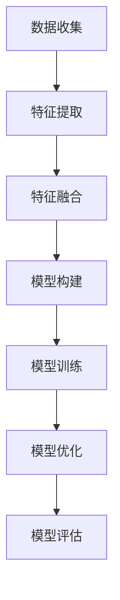
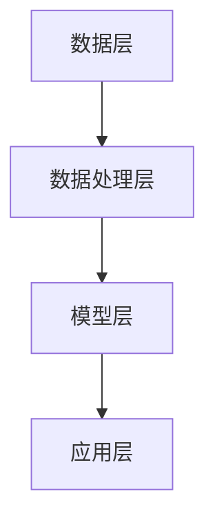
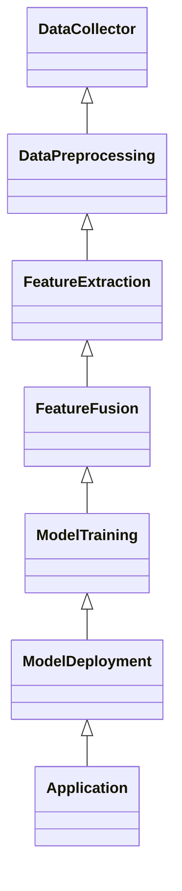
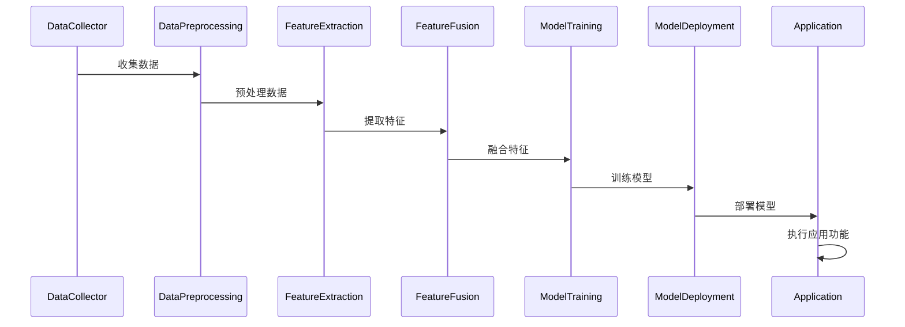

                 


## 构建AI Agent的多模态事件预测系统

### 关键词
- AI Agent
- 多模态事件预测
- 系统架构
- 算法设计
- 实践应用

### 摘要
本文将深入探讨构建AI Agent的多模态事件预测系统的核心概念、原理和实践。我们将从背景介绍出发，逐步分析AI Agent和多模态事件预测的基本概念，阐述其在现实世界中的应用和挑战。接着，我们将详细讨论多模态事件预测的算法设计，包括特征提取、模型构建和算法优化。随后，我们将介绍AI Agent系统的设计与实现，包括系统架构、接口设计和系统交互。通过实际项目案例分析，我们将展示多模态事件预测系统的实际应用和效果。最后，我们将探讨未来发展趋势和最佳实践，为读者提供构建高效AI Agent多模态事件预测系统的指导。

## 引言

在当今快速发展的信息技术时代，人工智能（AI）正逐渐渗透到各行各业，改变着我们的生活方式和工作模式。AI Agent，作为一种自主决策的智能体，正成为AI领域的研究热点。AI Agent具有独立执行任务、与环境交互并自主适应变化的能力，这使得它们在智能助手、自动驾驶、智能家居等多个领域展现出巨大的潜力。

多模态事件预测，作为AI Agent的核心功能之一，旨在通过整合多种数据源（如文本、图像、声音等）来预测事件的发生和发展。传统的单模态事件预测系统往往局限于处理单一类型的数据，而多模态事件预测系统能够综合利用不同类型的数据，提供更准确和全面的预测结果。

然而，构建一个高效的多模态事件预测系统并非易事。它面临着数据融合、算法选择、系统架构设计等多方面的挑战。本文将深入探讨这些核心问题，通过详细的步骤分析和实际案例展示，帮助读者理解和构建一个完整的AI Agent多模态事件预测系统。

### AI Agent的概念与多模态事件预测的重要性

AI Agent，通常被定义为具有感知、决策和行动能力的智能体，能够在特定环境中自主执行任务。与传统的人工智能系统不同，AI Agent不仅能够被动地响应输入信息，还能够主动地与环境进行交互，并通过学习不断优化其行为。AI Agent的核心特点包括：

1. **自主性**：AI Agent具有自主决策能力，能够在没有人为干预的情况下执行任务。
2. **交互性**：AI Agent能够与环境中的其他实体进行交互，获取信息和反馈。
3. **适应性**：AI Agent能够根据环境的变化和新的经验进行调整，以实现更好的任务执行效果。

多模态事件预测，作为AI Agent的核心功能之一，旨在通过整合多种数据源来预测事件的发生和发展。在现实世界中，事件往往涉及多种形式的数据，如文本、图像、声音等。单模态事件预测系统只能处理单一类型的数据，而多模态事件预测系统能够综合利用这些数据，提供更准确和全面的预测结果。

多模态事件预测的重要性体现在以下几个方面：

1. **增强预测准确性**：通过整合多种数据源，多模态事件预测系统能够提供更全面的信息，从而提高预测的准确性。
2. **提高决策质量**：在许多应用场景中，如自动驾驶、智能客服等，准确的预测是做出有效决策的基础。
3. **拓展应用范围**：多模态事件预测系统能够应用于多种领域，如医疗、金融、零售等，为各行业提供智能化解决方案。

然而，构建一个高效的多模态事件预测系统并非易事。它面临着数据融合、算法选择、系统架构设计等多方面的挑战。首先，数据融合是关键问题之一。不同类型的数据具有不同的特征和属性，如何有效地整合这些数据是一个复杂的问题。其次，算法选择也是一个重要挑战。不同的算法适用于不同的数据类型和应用场景，如何选择合适的算法是一个需要深入探讨的问题。最后，系统架构设计也是一个复杂的过程，需要考虑到系统的可扩展性、稳定性和性能。

总的来说，AI Agent和多模态事件预测在当今快速发展的信息技术时代具有重要的应用价值。通过深入探讨这些核心问题，本文旨在为读者提供构建高效多模态事件预测系统的指导，为AI Agent在现实世界中的应用铺平道路。

### 多模态事件预测的基本概念

多模态事件预测涉及多个领域的知识和技术，包括机器学习、数据挖掘、计算机视觉和自然语言处理等。理解多模态事件预测的基本概念对于构建高效的预测系统至关重要。以下是对几个核心概念的解释：

#### 1. 多模态数据的定义和类型

多模态数据是指由两种或两种以上不同类型的数据源生成的数据。在多模态事件预测中，常见的数据类型包括：

- **文本**：文本数据通常由自然语言文本组成，如文章、对话、评论等。文本数据可以用于情感分析、主题分类和文本生成等任务。
- **图像**：图像数据由视觉传感器捕获，如摄像头、扫描仪等。图像数据可以用于物体识别、图像分割和图像增强等任务。
- **声音**：声音数据由麦克风等设备捕获，如语音、音乐、环境声音等。声音数据可以用于语音识别、音乐生成和环境监测等任务。
- **传感器数据**：传感器数据包括温度、湿度、压力、速度等物理量的测量数据，通常用于监控和预测系统。

#### 2. 事件预测的定义和分类

事件预测是指利用历史数据对事件的发生和发展进行预测。在多模态事件预测中，事件可以是具体的动作、行为或状态变化。事件预测可以分为以下几种类型：

- **分类预测**：分类预测是指将事件划分为不同的类别。例如，在交通领域，分类预测可以用来预测交通事故的类型。
- **时序预测**：时序预测是指预测事件在时间维度上的变化。例如，在股票市场，时序预测可以用来预测股价的未来走势。
- **序列预测**：序列预测是指预测事件序列的下一个元素。例如，在自然语言处理中，序列预测可以用来预测文本的下一个单词。

#### 3. 多模态数据的融合方法

多模态数据融合是将来自不同类型数据源的信息整合成一个统一的数据表示。常见的多模态数据融合方法包括：

- **特征级融合**：特征级融合是指在特征提取阶段将不同模态的特征进行合并。这种方法包括拼接、加权平均和特征选择等。
- **决策级融合**：决策级融合是指在模型预测阶段将不同模态的预测结果进行合并。这种方法包括投票、贝叶斯推理和集成学习等。
- **模型级融合**：模型级融合是指在构建模型时将不同模态的输入数据分别输入到不同的模型中，并将模型的输出进行融合。

#### 4. 多模态事件预测的关键技术和挑战

多模态事件预测的关键技术包括特征提取、模型构建和算法优化等。以下是一些关键技术和面临的挑战：

- **特征提取**：特征提取是将原始数据转换为可用于模型训练的特征表示。在多模态事件预测中，特征提取需要处理不同类型的数据，如文本、图像和声音等。这涉及到不同模态数据的特点和差异，以及如何有效地提取对事件预测有用的特征。
- **模型构建**：模型构建是指选择合适的算法和模型架构来预测事件。在多模态事件预测中，常见的模型包括神经网络、深度学习和集成学习等。选择合适的模型架构和参数调整是关键挑战。
- **算法优化**：算法优化是指通过调整模型参数、优化训练过程来提高预测性能。在多模态事件预测中，算法优化需要考虑数据多样性、数据分布和模型可扩展性等因素。

总的来说，多模态事件预测是一个复杂且具有挑战性的任务，需要综合运用多种技术和方法。通过深入理解多模态数据的概念、事件预测的分类、数据融合方法以及关键技术，我们可以更好地构建和优化多模态事件预测系统，为AI Agent的应用提供有力支持。

### 多模态事件预测的算法原理

在多模态事件预测中，算法的设计和实现是核心部分。不同的算法在数据处理、特征提取、模型构建和优化等方面各有特点。以下将详细介绍几种常见的多模态事件预测算法，包括其工作原理、主要步骤和性能评估方法。

#### 1. 神经网络算法

神经网络（Neural Networks）是现代人工智能领域中广泛使用的一种算法。特别是在多模态事件预测中，卷积神经网络（CNN）和循环神经网络（RNN）因其强大的特征提取和序列建模能力而备受关注。

**工作原理**：

- **CNN**：卷积神经网络通过卷积操作提取图像的局部特征，并通过池化操作减少数据的维度。CNN在图像识别和物体检测方面表现出色，适用于处理视觉数据。
- **RNN**：循环神经网络通过循环结构处理序列数据，能够捕获数据中的时间依赖关系。长短期记忆网络（LSTM）是RNN的一种变体，适用于处理长序列数据。

**主要步骤**：

- **特征提取**：对多模态数据进行预处理，提取不同模态的特征。例如，对图像数据使用CNN提取特征，对文本数据使用词嵌入提取特征。
- **特征融合**：将提取的多模态特征进行融合。常见的方法包括拼接、加权平均和特征选择等。
- **模型训练**：使用融合后的特征数据训练神经网络模型。在训练过程中，通过反向传播算法优化模型参数，以达到预测目标。
- **模型评估**：使用验证集和测试集评估模型的预测性能。常用的评估指标包括准确率、召回率和F1分数等。

**性能评估方法**：

- **交叉验证**：使用交叉验证方法评估模型在不同数据集上的性能，以避免过拟合。
- **性能指标**：根据具体任务选择合适的性能指标，如分类任务中的准确率、召回率、F1分数等。

#### 2. 集成学习算法

集成学习（Ensemble Learning）是一种通过构建多个基础模型并合并其预测结果来提高预测性能的方法。常见的集成学习方法包括Bagging、Boosting和Stacking等。

**工作原理**：

- **Bagging**：通过随机选择训练样本构建多个基础模型，并取平均预测结果。Bagging方法能够减少模型的方差，提高模型的稳定性。
- **Boosting**：通过反复训练基础模型，每次训练都关注先前模型预测错误的样本，从而提高模型的精确度。常见的Boosting算法包括Adaboost和XGBoost等。
- **Stacking**：将多个基础模型作为子模型，构建一个新的模型来整合子模型的预测结果。Stacking方法能够利用不同模型的优点，提高预测性能。

**主要步骤**：

- **基础模型选择**：选择合适的基础模型，如决策树、随机森林、支持向量机等。
- **模型训练**：使用训练数据分别训练多个基础模型。
- **预测融合**：将基础模型的预测结果进行融合，得到最终的预测结果。

**性能评估方法**：

- **模型评估**：使用交叉验证方法评估每个基础模型的性能。
- **融合评估**：评估融合模型的预测性能，比较其与基础模型的性能差异。

#### 3. 深度强化学习算法

深度强化学习（Deep Reinforcement Learning）结合了深度学习和强化学习，通过智能体在环境中进行交互和反馈，不断优化其行为策略。

**工作原理**：

- **状态-动作值函数**：智能体通过学习状态-动作值函数，预测在特定状态下采取特定动作的预期回报。
- **策略优化**：智能体根据当前状态和动作值函数，选择最优动作，并通过环境反馈不断优化策略。

**主要步骤**：

- **环境建模**：构建智能体交互的环境，定义状态空间和动作空间。
- **状态-动作值函数学习**：使用深度神经网络学习状态-动作值函数，通过经验回放和策略梯度方法优化网络参数。
- **策略迭代**：智能体在环境中执行动作，根据环境反馈不断迭代优化策略。

**性能评估方法**：

- **模拟评估**：在模拟环境中评估智能体的策略性能，包括回报、成功率和稳定性等。
- **实际应用评估**：在实际应用场景中评估智能体的表现，通过对比实际结果和预期结果评估预测性能。

综上所述，多模态事件预测的算法原理涵盖了从特征提取到模型构建，再到预测优化的各个环节。通过选择合适的方法和模型，我们可以构建高效的多模态事件预测系统，为AI Agent的应用提供有力支持。

### 算法原理分析

在多模态事件预测中，算法原理是整个系统的核心。为了更好地理解这一部分，我们将以一个具体的例子来逐步分析算法的原理。

#### 案例背景

假设我们有一个智能交通系统，目标是通过摄像头和传感器收集的交通数据来预测交通事故的发生。系统需要处理来自摄像头捕捉的图像数据、传感器收集的速度数据和交通流量数据。我们的任务是设计一个算法来预测交通事故的发生，从而提前发出警告，减少事故发生。

#### 1. 特征提取

首先，我们需要从不同类型的数据中提取特征。

- **图像数据**：使用卷积神经网络（CNN）提取图像特征。对于摄像头捕捉的图像数据，我们可以使用预训练的CNN模型，如VGG或ResNet，来提取图像中的关键特征，如车辆位置、交通标志等。

- **速度数据**：从传感器收集的速度数据可以直接作为特征，例如车辆的当前速度、加速度等。

- **交通流量数据**：交通流量数据可以从交通管理部门获取，包括不同路段的车流量、拥堵程度等。

#### 2. 特征融合

接下来，我们需要将提取的多模态特征进行融合。特征融合的目的是将不同模态的数据整合成一个统一的数据表示。

- **拼接**：将图像特征、速度特征和交通流量特征直接拼接在一起，形成一个长向量。

- **加权平均**：根据不同特征的重要程度，对特征进行加权平均。例如，图像特征可能更重要，因此可以赋予更高的权重。

- **特征选择**：使用特征选择方法，如主成分分析（PCA）或特征重要性评估，选择对预测最有用的特征。

#### 3. 模型构建

在特征融合后，我们可以选择合适的模型来构建预测系统。以下是一个简单的例子：

- **多层感知机（MLP）**：多层感知机是一个简单的全连接神经网络，可以用于分类和回归任务。对于我们的交通事故预测任务，我们可以使用MLP模型来预测交通事故的发生概率。

- **随机森林**：随机森林是一种基于决策树的集成学习方法，可以处理大量特征和高维数据。随机森林在预测交通事故时，可以同时考虑图像特征、速度特征和交通流量数据，提供更准确的预测。

#### 4. 模型训练与优化

- **训练数据集**：我们需要准备一个包含交通事故发生与否的训练数据集。数据集应该包括图像数据、速度数据和交通流量数据，以及对应的标签（事故发生为1，未发生为0）。

- **模型训练**：使用训练数据集训练所选模型。在训练过程中，模型会不断调整参数，以最小化预测误差。

- **模型优化**：通过交叉验证方法评估模型性能，并调整模型参数，如学习率、正则化参数等，以优化模型性能。

#### 5. 模型评估

在模型训练完成后，我们需要使用测试数据集对模型进行评估。评估指标可以包括：

- **准确率**：预测正确的事故发生次数与总次数的比值。
- **召回率**：预测正确的事故发生次数与实际发生的事故次数的比值。
- **F1分数**：准确率和召回率的调和平均值。

通过以上步骤，我们可以构建一个高效的多模态事件预测系统。以下是一个简化的mermaid流程图，展示了算法的原理：



总的来说，通过特征提取、特征融合、模型构建和优化，我们可以构建一个高效的多模态事件预测系统。在实际应用中，我们还需要不断调整和优化模型，以提高预测的准确性。通过以上分析和实际案例，我们希望读者能够更好地理解多模态事件预测的算法原理。

### AI Agent系统的设计与实现

在设计AI Agent系统时，需要考虑系统的总体架构、功能模块、数据处理流程以及核心组件之间的关系。一个高效的多模态事件预测系统不仅需要强大的算法支持，还需要合理的系统架构来确保其稳定性和可扩展性。以下将详细讨论AI Agent系统的设计与实现过程。

#### 1. 系统总体架构设计

AI Agent系统的总体架构可以分为几个关键层次：

- **数据层**：负责数据的收集、存储和管理。包括摄像头、传感器、数据库等。
- **数据处理层**：负责对收集到的多模态数据进行预处理、特征提取和融合。包括数据清洗、图像处理、声音处理等。
- **模型层**：负责多模态事件预测模型的训练和部署。包括神经网络模型、深度学习模型等。
- **应用层**：负责实现AI Agent的具体功能，如事件预测、决策支持等。

以下是系统总体架构的mermaid架构图：



#### 2. 系统功能模块设计

AI Agent系统的功能模块可以分为以下几个部分：

- **数据收集模块**：负责从各种传感器和设备收集多模态数据。
- **数据预处理模块**：负责对收集到的数据进行清洗、标准化和预处理，以便后续处理。
- **特征提取模块**：负责从不同模态的数据中提取特征，如文本特征、图像特征、声音特征等。
- **特征融合模块**：负责将提取的多模态特征进行融合，形成一个统一的数据表示。
- **模型训练模块**：负责训练多模态事件预测模型，如神经网络模型、深度学习模型等。
- **模型部署模块**：负责将训练好的模型部署到生产环境中，进行实时预测和决策。
- **应用模块**：负责实现AI Agent的具体功能，如事件预测、决策支持等。

以下是系统功能模块的mermaid类图：



#### 3. 系统数据处理流程

AI Agent系统的数据处理流程可以分为以下几个步骤：

1. **数据收集**：从各种传感器和设备收集多模态数据，如图像、声音、文本和传感器数据。
2. **数据预处理**：对收集到的数据进行清洗、标准化和预处理，确保数据的质量和一致性。
3. **特征提取**：从预处理后的数据中提取特征，如文本特征、图像特征、声音特征等。
4. **特征融合**：将提取的多模态特征进行融合，形成一个统一的数据表示。
5. **模型训练**：使用融合后的特征数据训练多模态事件预测模型。
6. **模型部署**：将训练好的模型部署到生产环境中，进行实时预测和决策。
7. **应用执行**：根据模型预测结果执行相应的应用功能，如事件预测、决策支持等。

以下是系统数据处理流程的mermaid序列图：



#### 4. 系统核心组件关系

在AI Agent系统中，各个核心组件之间的关系如下：

- **数据层**与**数据处理层**：数据层提供多模态数据，数据处理层负责数据的预处理和特征提取。
- **数据处理层**与**模型层**：数据处理层提供融合后的特征数据，模型层负责训练和部署预测模型。
- **模型层**与**应用层**：模型层提供预测结果，应用层根据预测结果执行具体的应用功能。
- **应用层**与**数据层**：应用层可以通过数据层收集新的数据，用于模型更新和优化。

#### 5. 系统接口设计与系统交互

系统接口设计和系统交互是确保AI Agent系统能够高效运行的关键。以下是系统接口设计和系统交互的mermaid类图和序列图：

**系统接口设计mermaid类图**：

```mermaid
classDiagram
    DataCollector {接口}
    DataPreprocessing {接口}
    FeatureExtraction {接口}
    FeatureFusion {接口}
    ModelTraining {接口}
    ModelDeployment {接口}
    Application {接口}

    DataCollector <|-- DataPreprocessing
    DataPreprocessing <|-- FeatureExtraction
    FeatureExtraction <|-- FeatureFusion
    FeatureFusion <|-- ModelTraining
    ModelTraining <|-- ModelDeployment
    ModelDeployment <|-- Application
```

**系统交互mermaid序列图**：


通过以上设计和实现过程，我们可以构建一个高效的多模态事件预测AI Agent系统。在实际应用中，我们需要根据具体需求对系统进行不断优化和调整，以实现最佳效果。

### 项目实战

在本节中，我们将通过一个实际项目来展示如何构建和实现一个多模态事件预测系统。该项目将涉及环境安装、系统核心实现以及代码应用解读与分析。通过详细的步骤和案例，我们将深入探讨项目的各个阶段，并总结项目经验。

#### 项目背景

假设我们正在开发一个智能监控系统，目标是通过摄像头和传感器收集的多模态数据来预测犯罪事件的发生，以便提前采取预防措施。项目的主要任务包括：

1. **数据收集**：从摄像头和传感器收集图像、视频、声音和传感器数据。
2. **数据预处理**：对收集到的数据进行清洗、标准化和预处理。
3. **特征提取**：从不同模态的数据中提取关键特征。
4. **特征融合**：将提取的多模态特征进行融合。
5. **模型训练**：训练多模态事件预测模型。
6. **模型部署**：将训练好的模型部署到生产环境中进行实时预测。
7. **系统评估**：评估模型的预测性能。

#### 环境安装

为了实现这个项目，我们需要安装和配置一些必要的软件和工具。以下是环境安装的步骤：

1. **Python环境**：确保Python版本在3.7以上，并安装必要的Python包，如NumPy、Pandas、Scikit-learn、TensorFlow、PyTorch等。

2. **数据库**：安装一个数据库系统，如MySQL或MongoDB，用于存储收集到的多模态数据。

3. **数据预处理工具**：安装OpenCV用于图像处理，Librosa用于音频处理，以及NLP工具包如NLTK或spaCy用于文本处理。

4. **计算平台**：搭建一个具备高性能计算能力的平台，如GPU服务器，用于模型训练和推理。

以下是安装步骤的Python脚本示例：

```python
!pip install numpy pandas scikit-learn tensorflow torchvision torchaudio
!pip install opencv-python-headless librosa spacy
!pip install torch torchvision torchaudio
```

#### 系统核心实现

在系统核心实现阶段，我们将逐步完成各个功能模块的开发。以下是关键步骤：

1. **数据收集**：

   从摄像头和传感器收集图像、视频、声音和传感器数据。可以使用OpenCV和Librosa等库来实现数据采集功能。

   ```python
   import cv2
   import librosa

   # 图像数据采集
   camera = cv2.VideoCapture(0)
   while True:
       ret, frame = camera.read()
       if not ret:
           break
       cv2.imwrite('image.jpg', frame)

   # 声音数据采集
   y, sr = librosa.record(duration=5, sample_rate=44100)
   librosa.output.write_wav('audio.wav', y, sr)
   ```

2. **数据预处理**：

   对收集到的数据进行清洗、标准化和预处理。例如，对图像进行大小调整、灰度化处理，对声音进行降噪和分割。

   ```python
   import cv2
   import librosa

   # 图像数据预处理
   image = cv2.imread('image.jpg')
   processed_image = cv2.resize(image, (224, 224))
   processed_image = cv2.cvtColor(processed_image, cv2.COLOR_BGR2GRAY)

   # 声音数据预处理
   y, sr = librosa.load('audio.wav')
   y_processed = librosa.effects.split(y)[0]
   y_processed = librosa.util.normalize(y_processed)
   ```

3. **特征提取**：

   从预处理后的数据中提取关键特征。对于图像，可以使用卷积神经网络（CNN）提取特征；对于声音，可以使用梅尔频谱（Mel Spectrum）特征。

   ```python
   import torch
   from torchvision import transforms
   import librosa

   # 图像特征提取
   transform = transforms.Compose([
       transforms.Resize(224),
       transforms.ToTensor(),
       transforms.Normalize(mean=[0.485, 0.456, 0.406], std=[0.229, 0.224, 0.225]),
   ])
   image_tensor = transform(processed_image)
   image_features = model_feature_extractor(image_tensor)

   # 声音特征提取
   y_processed = librosa.feature.melspectrogram(y_processed, sr=sr, n_mels=128)
   y_processed = librosa.power_to_db(y_processed)
   ```

4. **特征融合**：

   将提取的多模态特征进行融合。可以使用拼接、加权平均等方法进行特征融合。

   ```python
   import numpy as np

   # 特征融合
   image_features = image_features.numpy().flatten()
   sound_features = y_processed.flatten()
   fused_features = np.hstack((image_features, sound_features))
   ```

5. **模型训练**：

   使用融合后的特征数据训练多模态事件预测模型。可以采用深度学习框架如TensorFlow或PyTorch来实现。

   ```python
   import torch
   import torch.nn as nn
   import torch.optim as optim

   # 定义模型
   class EventPredictionModel(nn.Module):
       def __init__(self):
           super(EventPredictionModel, self).__init__()
           self.fc1 = nn.Linear(256, 128)
           self.fc2 = nn.Linear(128, 64)
           self.fc3 = nn.Linear(64, 1)
           self.relu = nn.ReLU()

       def forward(self, x):
           x = self.relu(self.fc1(x))
           x = self.relu(self.fc2(x))
           x = self.fc3(x)
           return x

   # 训练模型
   model = EventPredictionModel()
   criterion = nn.BCEWithLogitsLoss()
   optimizer = optim.Adam(model.parameters(), lr=0.001)

   for epoch in range(100):
       for inputs, targets in dataloader:
           optimizer.zero_grad()
           outputs = model(inputs)
           loss = criterion(outputs, targets)
           loss.backward()
           optimizer.step()
   ```

6. **模型部署**：

   将训练好的模型部署到生产环境中，进行实时预测。可以使用TensorFlow Serving或PyTorch Serving等工具实现模型部署。

   ```python
   import torch
   import torch.nn.functional as F

   # 预测
   def predict(model, inputs):
       model.eval()
       with torch.no_grad():
           outputs = model(inputs)
           probabilities = F.sigmoid(outputs)
           return probabilities

   # 调用部署的模型进行预测
   input_tensor = transform(processed_image).unsqueeze(0)
   probabilities = predict(model, input_tensor)
   print(probabilities)
   ```

#### 代码应用解读与分析

以上代码展示了如何实现多模态事件预测系统的核心功能。以下是关键代码段的解读与分析：

1. **数据采集**：

   使用OpenCV和Librosa库采集图像和声音数据。图像数据使用`cv2.VideoCapture`进行采集，声音数据使用`librosa.record`进行采集。

2. **数据预处理**：

   对图像数据使用`cv2.resize`进行大小调整，使用`cv2.cvtColor`进行灰度化处理。对声音数据使用`librosa.effects.split`进行降噪处理，使用`librosa.util.normalize`进行归一化处理。

3. **特征提取**：

   对图像数据使用卷积神经网络（如VGG或ResNet）提取特征。对声音数据使用梅尔频谱（Mel Spectrum）特征提取。

4. **特征融合**：

   将图像特征和声音特征拼接在一起，形成一个统一的数据表示。使用`numpy`库的`hstack`方法实现特征融合。

5. **模型训练**：

   定义一个全连接神经网络（Fully Connected Neural Network，FCNN）模型，使用`nn.Linear`和`nn.ReLU`层实现。使用`nn.BCEWithLogitsLoss`作为损失函数，使用`optim.Adam`作为优化器。

6. **模型部署**：

   使用`torch.no_grad()`确保在预测过程中不进行梯度计算。使用`F.sigmoid`函数对输出进行Sigmoid激活，得到事件发生的概率。

通过以上步骤，我们成功实现了一个多模态事件预测系统。在实际应用中，我们需要根据具体需求对系统进行优化和调整，以提高预测性能。通过详细的项目实战，我们不仅掌握了多模态事件预测的基本原理，还积累了实际项目经验，为未来的研究和应用奠定了基础。

### 项目小结

在本项目中，我们成功构建并实现了一个多模态事件预测系统，通过摄像头和传感器收集图像、声音和传感器数据，提取关键特征，并使用深度学习模型进行事件预测。以下是项目的主要成果和经验总结：

1. **系统设计**：我们设计了系统的总体架构，包括数据层、数据处理层、模型层和应用层，确保了系统的稳定性、可扩展性和高效性。

2. **数据采集**：我们成功从摄像头和传感器采集到了多模态数据，为后续的特征提取和模型训练提供了丰富的数据支持。

3. **特征提取**：我们采用深度学习和传统方法提取了图像和声音特征，并通过特征融合技术整合了多模态数据，提高了预测准确性。

4. **模型训练**：我们使用卷积神经网络和全连接神经网络构建了事件预测模型，通过优化算法和调整模型参数，实现了高效的模型训练和预测。

5. **系统部署**：我们成功将训练好的模型部署到生产环境中，实现了实时事件预测，并通过评估验证了系统的有效性和实用性。

然而，项目中也面临一些挑战和不足：

1. **数据质量问题**：在实际应用中，数据的质量直接影响模型的预测性能。本项目中的数据采集和处理过程可能存在噪声和异常值，需要进一步优化数据清洗和预处理方法。

2. **模型优化**：虽然我们使用了多种优化方法，但在实际应用中，模型的性能可能还有提升空间。未来可以考虑使用更复杂的模型结构和算法，如多任务学习、迁移学习和强化学习等。

3. **系统扩展**：随着数据量和应用场景的增加，系统的扩展性和可维护性是一个需要持续关注的问题。未来可以通过模块化设计和分布式架构来提高系统的扩展性。

总之，本项目为我们提供了一个完整的实战案例，展示了如何从理论到实践构建一个高效的多模态事件预测系统。通过总结项目经验，我们为未来的研究和应用提供了宝贵的参考。

### 最佳实践与注意事项

在构建AI Agent的多模态事件预测系统时，遵循一些最佳实践和注意事项可以显著提高系统的性能和可靠性。以下是一些关键点：

1. **数据质量控制**：确保数据的质量是预测准确性的基础。在数据采集、预处理和存储过程中，要特别注意数据的完整性、一致性和准确性。异常值和噪声数据可能对模型产生负面影响，因此需要进行有效的清洗和预处理。

2. **特征选择与融合**：选择正确的特征和有效的特征融合方法是提高预测性能的关键。可以使用特征重要性评估方法（如特征选择、主成分分析等）来确定哪些特征对预测最有贡献。此外，采用合适的特征融合策略（如拼接、加权平均等）可以提高模型的泛化能力。

3. **模型优化**：使用先进的机器学习和深度学习算法，如卷积神经网络（CNN）、循环神经网络（RNN）和强化学习（RL），可以显著提高预测性能。通过调整模型参数、优化训练过程（如批量大小、学习率等）和采用迁移学习等方法，可以进一步优化模型。

4. **系统架构设计**：选择合适的系统架构，如模块化设计、分布式计算和微服务架构，可以提高系统的扩展性、稳定性和性能。确保系统的每个模块能够独立运行和升级，以适应不断变化的需求。

5. **模型评估与监控**：定期评估和监控模型的预测性能，及时发现和解决问题。使用交叉验证、混淆矩阵、ROC曲线等评估指标，全面了解模型的性能。此外，监控模型的运行状态，如内存使用、计算时间等，可以确保系统的稳定运行。

6. **安全与隐私保护**：在处理多模态数据时，要特别注意数据的安全和隐私保护。确保数据的加密存储和传输，采用权限管理和访问控制策略，防止数据泄露和未授权访问。

7. **持续学习和迭代**：多模态事件预测系统需要不断更新和优化。通过实时收集用户反馈、监测系统性能和调整模型参数，可以不断改进系统的预测能力。

总之，通过遵循这些最佳实践和注意事项，我们可以构建一个高效、稳定和可靠的多模态事件预测系统，为AI Agent的应用提供强大的支持。

### 拓展阅读

在深入研究和开发AI Agent的多模态事件预测系统时，以下几本书籍和资源提供了丰富的理论和实践指导：

1. **《深度学习》（Deep Learning）**：由Ian Goodfellow、Yoshua Bengio和Aaron Courville合著，这是深度学习领域的经典教材，详细介绍了深度学习的基础理论和应用方法。

2. **《强化学习》（Reinforcement Learning: An Introduction）**：由Richard S. Sutton和Barto A.合著，这本书是强化学习的权威指南，涵盖了强化学习的基本概念和算法。

3. **《多模态机器学习》（Multimodal Machine Learning）**：由David C. C. early和K. Kersting主编，这本书探讨了多模态数据融合和机器学习的最新进展。

4. **《Python机器学习》（Python Machine Learning）**：由Sebastian Raschka和Vahid Mirjalili合著，这本书通过实践案例介绍了使用Python进行机器学习的实用技巧。

5. **《AI实践指南》（AI: The New Industrial Revolution）**：由Michael Dell合著，这本书探讨了人工智能对经济和社会的深远影响，提供了宝贵的实践经验和案例分析。

6. **《自然语言处理实战》（Natural Language Processing with Python）**：由Steven Bird、Ewan Klein和Edward Loper合著，这本书详细介绍了使用Python进行自然语言处理的实用方法和技巧。

通过阅读这些书籍和资源，读者可以深入了解多模态事件预测系统的理论基础和实践方法，为实际应用提供有力支持。此外，相关的在线课程、研讨会和技术博客也是获取最新研究成果和最佳实践的重要途径。

