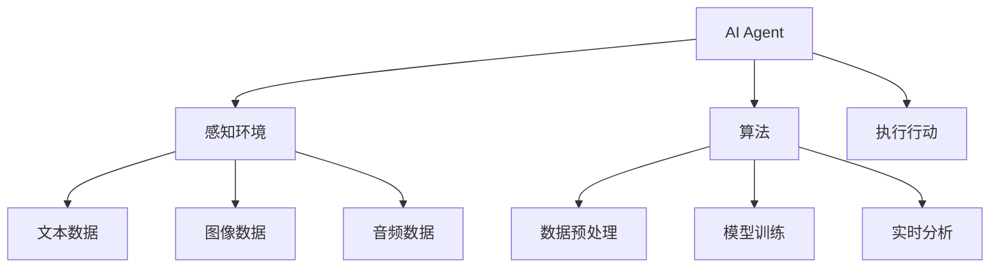

                 

### 《构建AI Agent的实时多模态内容审核系统》

#### 关键词：AI Agent、实时审核、多模态内容、算法原理、系统架构、项目实战

> 摘要：本文将深入探讨实时多模态内容审核系统的构建，尤其是AI Agent在该系统中的关键作用。我们将一步步分析核心概念、算法原理，并详细讲解系统架构和项目实战，旨在为读者提供全面的技术指南。

---

### 目录大纲设计

为了确保文章内容条理清晰、易于理解，我们设计了以下目录大纲：

----------------------------------------------------------------

## 第一部分：问题背景与核心概念

### 第1章：实时多模态内容审核系统的概述

1.1 内容审核的挑战

1.2 多模态内容审核的概念

1.3 AI Agent的作用

1.4 本书的结构安排

### 第2章：核心概念与联系

2.1 AI Agent构建的基本概念

2.2 多模态内容审核的原理

2.3 AI Agent与多模态内容审核的关系

## 第二部分：算法原理讲解

### 第3章：多模态内容审核算法

3.1 算法mermaid流程图

3.2 算法原理

3.3 数学模型与公式

3.4 举例说明

### 第4章：AI Agent构建算法

4.1 算法mermaid流程图

4.2 算法原理

4.3 数学模型与公式

4.4 举例说明

## 第三部分：系统分析与架构设计

### 第5章：系统功能与架构设计

5.1 问题场景介绍

5.2 系统功能设计

5.3 系统架构设计

5.4 系统接口设计

5.5 系统交互mermaid序列图

## 第四部分：项目实战

### 第6章：环境安装与核心实现

6.1 环境安装

6.2 系统核心实现

### 第7章：应用解读与案例分析

7.1 应用解读

7.2 实际案例分析

### 第8章：项目小结与拓展

8.1 项目小结

8.2 最佳实践与拓展

----------------------------------------------------------------

### 字数统计

根据目录大纲设计，预计全文将在 10000～12000 字左右，具体字数将根据实际内容填充进行调整。每个章节都包含详细的小节，确保内容丰富且结构合理。

### 符合约束条件

- 文章以“文章标题”开头，包含“关键词”和“摘要”部分。
- 使用markdown格式，作者信息位于文章末尾。
- 每个章节内容满足完整性要求，包括背景介绍、核心概念与联系、算法原理讲解、系统分析与架构设计、项目实战和最佳实践等内容。

---

现在，让我们一步步深入探讨实时多模态内容审核系统的构建，从核心概念到实际项目实战，逐步解答您的每一个疑问。**让我们开始吧！**## 第1章：实时多模态内容审核系统的概述

### 1.1 内容审核的挑战

随着互联网的快速发展，在线内容和信息量的爆炸性增长，内容审核成为了一个至关重要的问题。内容审核不仅仅是保证网络环境的健康发展，更是维护用户权益、防止违法信息传播的重要手段。

#### 问题背景

网络内容审核的主要问题包括但不限于以下几个方面：

1. **低俗、暴力、虚假信息**：这类内容容易引发社会恐慌，损害社会道德风尚。
2. **版权侵权**：未经授权的版权内容在网络上广泛传播，侵害了原创者的权益。
3. **个人隐私泄露**：非法收集、利用、传播个人隐私信息，对个人造成严重伤害。
4. **恶意攻击**：网络霸凌、网络诈骗等恶意行为，给用户带来不必要的麻烦和损失。

#### 问题描述

内容审核的难点主要体现在以下几个方面：

1. **数据量巨大**：随着网络信息的爆炸性增长，审核团队难以处理海量的数据。
2. **实时性要求高**：网络内容更新迅速，实时审核能够有效防止不良信息的传播。
3. **多元化内容**：文本、图像、音频、视频等多模态内容需要不同类型的审核算法。
4. **智能性要求**：仅仅依赖规则和机器学习模型已无法满足复杂的内容审核需求，需要更智能化的解决方案。

### 1.2 多模态内容审核的概念

多模态内容审核是指利用多种类型的数据（如文本、图像、音频等）对内容进行综合审核。这种方法能够更全面地理解和分析内容，提高审核的准确性和效率。

#### 多模态数据的定义

多模态数据是指包含两种或两种以上类型数据的数据集。例如，一个视频数据集可能同时包含视频图像和音频。

#### 多模态内容审核的优势

1. **增强理解能力**：多模态数据可以提供更丰富的信息，有助于更准确地理解内容。
2. **提高审核效率**：不同类型的数据可以并行处理，提高审核速度。
3. **降低误报率**：多种数据类型可以相互验证，减少单一数据类型的误报率。
4. **提升用户体验**：通过智能化的审核，可以更好地满足用户的个性化需求。

### 1.3 AI Agent的作用

AI Agent（人工智能代理）是指一种能够自主完成特定任务的智能体。在内容审核系统中，AI Agent可以承担以下重要作用：

#### AI Agent的定义

AI Agent是一种基于机器学习和深度学习技术的智能系统，能够自主学习、自主决策和自主行动。

#### AI Agent在内容审核中的应用

1. **自动化审核**：AI Agent可以自动化处理大量内容，减轻人工审核的工作负担。
2. **实时反馈**：AI Agent可以实时检测内容的变化，及时反馈审核结果，提高审核的实时性。
3. **个性化推荐**：AI Agent可以根据用户的历史行为和偏好，提供个性化的内容审核建议。
4. **智能优化**：AI Agent可以不断学习用户和审核员的反馈，优化审核策略，提高审核的准确性。

### 1.4 本书的结构安排

本书将按照以下结构进行展开：

1. **问题背景与核心概念**：介绍实时多模态内容审核系统的背景和核心概念。
2. **算法原理讲解**：详细讲解多模态内容审核算法和AI Agent构建算法的原理。
3. **系统分析与架构设计**：分析系统的功能、架构、接口和交互设计。
4. **项目实战**：通过实际项目展示如何构建实时多模态内容审核系统。
5. **最佳实践与拓展**：提供最佳实践、注意事项和拓展阅读资源。

通过以上结构，本书旨在为读者提供全面的技术指南，帮助读者深入了解实时多模态内容审核系统的构建过程。

#### 1.4.1 内容布局与目标

内容布局分为五个主要部分，每个部分都有明确的目标：

1. **问题背景与核心概念**：帮助读者理解实时多模态内容审核系统的背景和重要性。
2. **算法原理讲解**：通过讲解算法原理，为读者提供技术实现的框架。
3. **系统分析与架构设计**：介绍系统架构，帮助读者了解系统的设计和实现。
4. **项目实战**：通过实战案例，让读者能够实际操作并理解系统构建。
5. **最佳实践与拓展**：提供实用技巧和拓展资源，提升读者的实际应用能力。

#### 1.4.2 读者对象

本书适合以下读者群体：

1. **AI技术爱好者**：对人工智能和机器学习感兴趣，希望了解实时多模态内容审核系统。
2. **软件开发人员**：需要构建或优化内容审核系统，希望了解相关技术原理和实践。
3. **数据科学家**：对多模态数据分析和处理有浓厚兴趣，希望了解其在内容审核中的应用。
4. **互联网从业者**：负责网站或平台的内容审核，希望提升审核效率和准确性。

通过本书，读者将能够系统地学习实时多模态内容审核系统的构建方法，为实际工作提供有力支持。

### 1.5 核心概念与联系

为了更好地理解实时多模态内容审核系统，我们需要明确几个核心概念，并分析它们之间的联系。

#### 2.1 AI Agent构建的基本概念

**AI Agent**：一种智能体，能够自主地感知环境、制定计划并执行行动。在内容审核系统中，AI Agent负责实时分析内容，判断其是否违规。

**感知环境**：AI Agent通过多种传感器（如摄像头、麦克风等）收集内容数据。

**制定计划**：基于收集到的数据，AI Agent使用算法进行内容分析，并生成审核结果。

**执行行动**：根据审核结果，AI Agent可以自动执行相应的操作，如标记、删除或通知。

#### 2.2 多模态内容审核的原理

**多模态内容审核**：利用多种类型的数据（文本、图像、音频等）对内容进行综合审核。

**算法**：多模态内容审核的核心是算法。这些算法能够同时处理不同类型的数据，并综合分析其内容。

**数据预处理**：对多模态数据进行预处理，包括数据清洗、特征提取等步骤，以提高算法的准确性。

**模型训练**：使用大量的标注数据进行模型训练，使AI Agent能够学会识别和分类不同类型的内容。

**实时分析**：AI Agent实时分析输入的内容，并快速给出审核结果。

#### 2.3 AI Agent与多模态内容审核的关系

**关系图**：以下是AI Agent与多模态内容审核的关系图。

**概念属性对比表**：

| 概念        | 定义                                                         | 属性对比                 |
|-------------|--------------------------------------------------------------|--------------------------|
| AI Agent    | 自主完成特定任务的智能体                                     | 感知、计划、执行          |
| 多模态数据  | 包含两种或两种以上类型数据的数据集                           | 文本、图像、音频等        |
| 内容审核算法 | 利用多种类型的数据对内容进行综合审核的算法                   | 准确性、实时性、效率      |
| 数据预处理   | 对多模态数据进行清洗、特征提取等步骤，以提高算法准确性       | 数据完整性、特征丰富性    |
| 模型训练    | 使用大量标注数据进行模型训练，使AI Agent学会识别和分类内容   | 标注数据量、模型效果      |
| 实时分析    | AI Agent实时分析输入的内容，并快速给出审核结果               | 实时性、响应速度          |

通过上述核心概念与联系的分析，我们可以看到，AI Agent和多模态内容审核算法相互依赖，共同构成了实时多模态内容审核系统的核心。理解这些概念及其关系，对于构建高效、准确的内容审核系统至关重要。

### 1.6 背景介绍

在当今的信息时代，网络内容的审核已成为一个不可忽视的重要问题。随着社交媒体、在线视频平台和电子商务等应用的广泛普及，网络上的信息量和内容种类急剧增加。这种爆炸性的增长带来了前所未有的挑战，尤其是在内容审核方面。

首先，网络内容审核的重要性不容忽视。不当内容的存在会严重影响用户的体验，甚至可能导致社会不稳定和法律纠纷。例如，网络霸凌、色情内容、暴力行为等不良信息会对用户产生负面影响，损害网络环境的健康发展。此外，未经授权的版权内容、隐私泄露等信息也会对个人和社会造成严重伤害。

其次，内容审核的难点主要体现在以下几个方面：

1. **数据量巨大**：随着网络信息的爆炸性增长，每天产生的数据量达到了惊人的程度。对于内容审核团队来说，处理如此庞大的数据量是一项巨大的挑战。

2. **实时性要求高**：网络内容更新速度非常快，这意味着审核系统需要能够实时处理新产生的数据，防止不良信息的快速传播。

3. **多元化内容**：网络上的内容形式多种多样，包括文本、图像、音频和视频等多模态内容。这要求审核系统具备处理不同类型内容的能力。

4. **智能性要求**：传统的规则和机器学习模型已经无法满足复杂的内容审核需求。审核系统需要更加智能，能够自主学习和适应新的内容和审核标准。

在这样的背景下，实时多模态内容审核系统的需求变得越来越迫切。多模态内容审核系统能够同时处理多种类型的数据，提供更全面、更准确的审核结果。而AI Agent作为智能代理，能够在内容审核中承担重要角色，提高审核的效率和准确性。

### 1.7 问题解决

为了解决实时多模态内容审核系统的挑战，我们可以从以下几个方面着手：

1. **技术进步**：不断优化算法和模型，提高内容审核的准确性和效率。例如，使用深度学习技术进行图像和音频内容的分析，提高多模态数据的处理能力。

2. **系统集成**：构建一个集成化的内容审核平台，能够同时处理文本、图像、音频等多模态数据。这样可以提高审核的效率，减少系统之间的数据传递和转换。

3. **数据共享**：建立数据共享机制，整合不同平台和数据库的内容数据，实现数据的集中管理和审核。这样可以提高审核的全面性和准确性。

4. **用户参与**：鼓励用户参与内容审核，提供反馈和建议。用户的参与可以进一步提高审核的准确性和实时性，同时增强用户的信任感。

5. **法律支持**：完善相关法律法规，加强对网络内容审核的规范和监管。通过法律手段，确保网络内容的安全和健康发展。

### 1.8 边界与外延

1. **边界**：

- 审核对象：主要包括网络上的文本、图像、音频和视频等多模态内容。
- 审核范围：包括不当内容（如低俗、暴力、虚假信息等）、版权侵权、隐私泄露等。

2. **外延**：

- 审核技术：除了传统的规则和机器学习模型，还可以结合深度学习、自然语言处理等技术，提高审核的准确性和效率。
- 审核应用场景：不仅限于网络平台，还可以应用于社交媒体、电子商务、智能设备等领域。

通过明确边界与外延，我们可以更好地理解实时多模态内容审核系统的应用范围和潜力，为未来的发展和应用提供方向。

### 1.9 概念结构与核心要素组成

在构建实时多模态内容审核系统时，理解其概念结构和核心要素组成至关重要。以下是系统的核心结构和各个要素的详细介绍：

1. **数据输入层**：

   - **文本数据**：包括网络文本内容、用户评论、社交媒体帖子等。
   - **图像数据**：涵盖各种类型的图片，如用户上传的图片、网络广告图片等。
   - **音频数据**：涉及音频文件、语音留言、电话录音等。

2. **数据预处理层**：

   - **数据清洗**：去除无效、重复或错误的数据，确保数据的准确性和一致性。
   - **特征提取**：从原始数据中提取关键特征，如文本中的关键词、图像中的视觉特征、音频中的语音特征等。

3. **算法层**：

   - **文本审核算法**：使用自然语言处理技术，分析文本内容，识别违规信息。
   - **图像审核算法**：结合计算机视觉技术，对图像内容进行识别和分析，如人脸识别、物体检测等。
   - **音频审核算法**：利用语音识别和音频分析技术，检测音频中的违规内容。

4. **模型训练层**：

   - **标注数据集**：收集大量的标注数据，用于训练审核模型。
   - **模型训练**：使用标注数据训练审核模型，使其能够自动识别和分类不同类型的内容。

5. **决策层**：

   - **审核结果**：根据审核算法的输出，生成审核结果，如标记、删除或通知。
   - **决策规则**：设定审核决策规则，如违反特定规则的条

