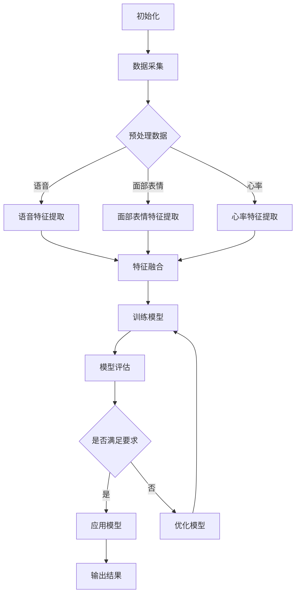
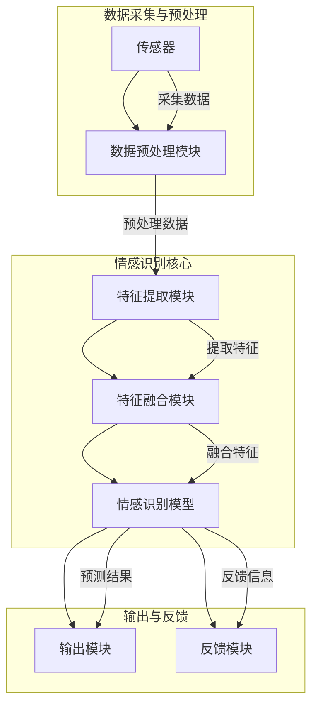
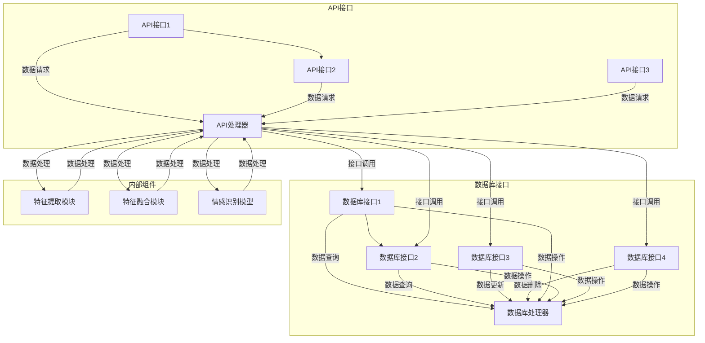
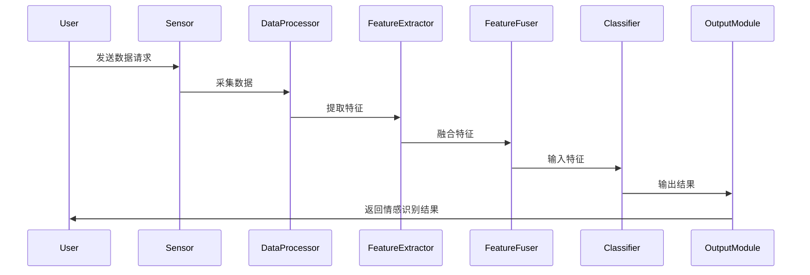

                 


## 引言

### 1.1 问题背景

随着人工智能（AI）技术的迅猛发展，AI已经在各个行业得到了广泛应用。特别是在用户交互、心理健康、人机对话等领域，多模态情感识别技术的重要性日益凸显。多模态情感识别是指通过结合多种传感器数据，如面部表情、语音、心率等，来准确识别和判断用户的情感状态。这种技术能够为人机交互提供更加自然和高效的体验，对于提升用户体验和系统智能化水平具有重要意义。

### 1.2 问题描述

然而，构建一个实时多模态情感识别系统并非易事。首先，我们需要解决如何有效地采集和融合来自多种传感器的数据，确保数据的质量和可靠性。其次，我们需要开发出高效的情感识别算法，能够准确识别用户的情感状态。最后，我们需要设计一个合理的系统架构，实现数据的实时处理和响应。

### 1.3 问题解决

为了解决上述问题，本文将提出一个实时多模态情感识别系统的整体架构，并分析情感识别的算法原理和关键技术。首先，我们将介绍多模态数据采集的方法和技术，包括常见的传感器类型和数据采集流程。接着，我们将探讨情感识别算法的基本原理，对比不同算法的属性特征，并绘制情感识别系统的ER实体关系图。然后，我们将讨论多模态数据融合的方法和效果评价。在后续部分，我们将详细讲解情感识别算法的原理，并提供Python源代码实现。最后，我们将介绍系统分析与架构设计方案，包括问题场景介绍、系统功能设计、系统架构设计、系统接口设计和系统交互。

### 1.4 边界与外延

在构建实时多模态情感识别系统的过程中，我们还需要明确一些边界和限制。例如，情感识别的范围和准确性可能受到传感器性能、环境噪声、用户个体差异等因素的影响。此外，多模态数据的融合方法和技术也需要根据具体应用场景进行定制化设计。在后续内容中，我们将深入探讨这些边界和外延，并提出相应的解决方案。

### 1.5 概念结构与核心要素组成

实时多模态情感识别系统由多个核心组成部分构成，包括数据采集模块、情感识别模块、数据融合模块和系统接口模块。数据采集模块负责采集来自多种传感器的数据，情感识别模块负责处理和识别用户的情感状态，数据融合模块负责融合不同模态的数据，以提高情感识别的准确性，系统接口模块则负责与其他系统或应用程序的交互。在后续内容中，我们将详细分析这些核心组成部分的功能和作用。

## 第一部分：背景介绍

### 1.1 引言

在当今信息技术飞速发展的时代，人工智能（AI）已经成为推动各行各业进步的重要力量。从自动驾驶到智能家居，从医疗诊断到金融分析，AI的应用场景越来越广泛。尤其是在用户交互领域，如何理解并满足用户的需求成为了一个重要的课题。而多模态情感识别技术则在这种背景下应运而生，它通过整合多种感官数据，如视觉、听觉、触觉等，来准确感知用户的情感状态，从而提供更加个性化和人性化的服务。

多模态情感识别的重要性不仅体现在提升用户体验上，还广泛应用于心理健康监测、人机对话系统、智能客服等领域。例如，在心理健康监测中，通过实时分析用户的语音、面部表情和心率数据，可以帮助医生和心理学家更好地了解患者的心理状态，从而提供及时有效的干预措施。在人机对话系统中，通过情感识别技术，可以构建更加自然和流畅的对话体验，提高用户满意度和系统交互效率。此外，在智能客服领域，多模态情感识别技术可以帮助客服系统更好地理解用户的需求，提高服务质量和响应速度。

### 1.2 问题描述

构建一个实时多模态情感识别系统面临诸多挑战。首先，我们需要解决如何高效地采集来自多种传感器的数据。不同传感器的数据类型和采集方式各异，如何确保数据的一致性和完整性是一个关键问题。例如，语音传感器需要处理音频信号，面部表情传感器需要处理图像数据，而心率传感器则需要处理生理信号。其次，我们还需要开发出高效的情感识别算法，能够准确识别用户的情感状态。不同情感的表现形式各异，且用户的情感状态可能是动态变化的，如何设计一个鲁棒和高效的算法是一个挑战。

此外，多模态数据的融合也是一个难题。不同模态的数据在时间同步、数据类型和特征表达方面可能存在差异，如何有效地融合这些数据，以提高情感识别的准确性和实时性，是一个重要的研究方向。最后，我们还需要设计一个合理的系统架构，能够实现数据的实时处理和响应。在实时性要求较高的应用场景中，如心理健康监测和智能客服，系统需要快速响应用户的情感变化，提供实时反馈和干预措施。

### 1.3 问题解决

为了解决上述问题，本文将提出一个实时多模态情感识别系统的整体架构，并详细分析情感识别的算法原理和关键技术。

1. **系统架构**：本文将首先介绍实时多模态情感识别系统的整体架构，包括数据采集模块、情感识别模块、数据融合模块和系统接口模块。每个模块的功能和作用将进行详细说明，以帮助读者全面理解系统的工作流程。

2. **数据采集**：接下来，我们将探讨多模态数据采集的方法和技术。本文将详细介绍不同类型的传感器，包括语音传感器、面部表情传感器和心率传感器等，以及它们的工作原理和数据采集流程。同时，还将讨论如何处理和传输这些数据，确保数据的质量和可靠性。

3. **情感识别算法**：本文将分析常用的情感识别算法，包括基于深度学习的方法、基于传统机器学习的方法等。我们将对比这些算法的优缺点，并绘制情感识别系统的ER实体关系图，以帮助读者更好地理解系统的设计思路。

4. **数据融合方法**：为了提高情感识别的准确性，本文将介绍多种数据融合方法，包括基于特征融合的方法和基于模型融合的方法。我们将讨论这些方法的原理和实现，并提供效果评价的指标和方法。

5. **系统实现**：在系统实现部分，本文将使用Python语言和相应的库，实现情感识别算法，并提供详细的代码解释和举例说明。通过这一部分，读者可以了解如何将理论知识应用到实际项目中。

6. **系统架构设计**：最后，本文将介绍实时多模态情感识别系统的架构设计，包括问题场景介绍、系统功能设计、系统架构设计、系统接口设计和系统交互。这部分内容将帮助读者理解如何将系统理论转化为实际应用。

### 1.4 边界与外延

在构建实时多模态情感识别系统的过程中，我们还需要明确一些边界和限制。首先，情感识别的范围和准确性可能受到传感器性能、环境噪声、用户个体差异等因素的影响。例如，某些传感器可能在特定环境下无法准确采集数据，导致情感识别结果的偏差。其次，多模态数据的融合方法和技术也需要根据具体应用场景进行定制化设计。例如，在低延迟要求的应用场景中，我们需要优化系统架构和算法，以提高实时性和响应速度。

### 1.5 概念结构与核心要素组成

实时多模态情感识别系统由多个核心组成部分构成，包括数据采集模块、情感识别模块、数据融合模块和系统接口模块。以下是对这些核心组成部分的详细说明：

1. **数据采集模块**：数据采集模块负责从多种传感器中收集数据，如语音传感器、面部表情传感器和心率传感器等。这些传感器的数据类型和采集方式各异，需要通过适当的数据预处理方法，如去噪、归一化和特征提取等，以提高数据的质量。

2. **情感识别模块**：情感识别模块是系统的核心，负责处理和识别用户的情感状态。常用的情感识别算法包括基于深度学习和传统机器学习的方法。这些算法通过分析传感器的数据，提取情感特征，并利用分类器对情感状态进行判断。

3. **数据融合模块**：数据融合模块负责融合来自不同模态的数据，以提高情感识别的准确性。常见的融合方法包括基于特征融合的方法和基于模型融合的方法。数据融合模块需要考虑不同模态数据的时间同步、数据类型和特征表达，以实现有效的数据融合。

4. **系统接口模块**：系统接口模块负责与其他系统或应用程序的交互。通过系统接口，可以实现对系统的配置、控制和数据查询等功能。系统接口模块需要设计合理的接口规范和通信协议，以确保系统的可扩展性和兼容性。

综上所述，实时多模态情感识别系统通过数据采集、情感识别、数据融合和系统接口等核心组成部分，实现了对用户情感状态的实时监测和识别。这一系统不仅能够提高用户体验，还为各种应用场景提供了强大的技术支持。

### 1.6 多模态数据采集

#### 2.1.1 传感器概述

在构建实时多模态情感识别系统时，首先需要了解常用的传感器类型及其作用。以下是一些常见的传感器类型及其在情感识别中的应用：

1. **语音传感器**：语音传感器主要用于捕捉用户的语音信号。这些传感器可以将语音信号转换为电信号，并通过语音识别算法来分析用户的语音特征。例如，语速、语调、音量等都是情感识别中的重要特征。语音传感器在智能客服、语音助手等应用中具有广泛的应用。

2. **面部表情传感器**：面部表情传感器用于捕捉用户的面部表情变化。常见的面部表情传感器包括面部识别摄像头和红外线面部表情识别设备。通过分析面部表情特征，如眉毛的舒展程度、眼睛的闭合状态、嘴巴的弯曲程度等，可以识别用户的情感状态，如快乐、悲伤、愤怒等。

3. **心率传感器**：心率传感器用于捕捉用户的心率变化。心率传感器通常通过光电传感器或压力传感器来实现。通过分析心率的变化模式，可以了解用户的生理状态，如兴奋、焦虑或平静。心率传感器在心理健康监测和运动健康监测中具有重要应用。

4. **皮肤电导传感器**：皮肤电导传感器用于测量皮肤的电导率变化，这种变化可以反映用户的情感状态。例如，当用户感到紧张或兴奋时，皮肤电导率会发生变化。皮肤电导传感器常用于情绪分析和人机交互领域。

5. **加速度传感器**：加速度传感器用于测量用户的运动状态。通过分析加速度的变化，可以了解用户的运动行为，如跑步、走路、跳跃等。加速度传感器在运动健康监测和智能穿戴设备中广泛应用。

6. **温度传感器**：温度传感器用于测量用户的体温或其他环境温度。温度变化可以反映用户的身体状况，如发烧或感冒。温度传感器在医疗健康监测和智能家居中具有应用价值。

#### 2.1.2 数据采集流程

多模态数据的采集是一个复杂的过程，需要多个传感器协同工作，以下是数据采集的一般流程：

1. **传感器初始化**：首先，需要对各个传感器进行初始化，包括配置传感器参数、校准传感器等，以确保数据采集的准确性。

2. **数据采集**：然后，启动各个传感器进行数据采集。每个传感器按照预定的时间间隔或事件触发条件，将采集到的数据存储到数据缓冲区或文件中。对于实时性要求较高的应用，数据采集需要快速响应。

3. **数据传输**：采集到的数据通过无线或有线方式传输到数据处理模块。无线传输通常使用Wi-Fi、蓝牙或NFC等技术，而有线传输则使用USB或以太网等接口。在数据传输过程中，需要确保数据的一致性和完整性。

4. **数据预处理**：在数据处理模块，对采集到的原始数据进行预处理，包括去噪、归一化和特征提取等。去噪是为了去除数据中的噪声和干扰，提高数据质量；归一化是为了将不同模态的数据标准化到同一尺度上，以便后续处理；特征提取则是从原始数据中提取出与情感状态相关的特征，如语音特征、面部表情特征、心率特征等。

5. **数据存储**：预处理后的数据存储在数据库或文件系统中，以便后续分析和处理。对于实时应用，数据存储需要保证速度和可靠性。

#### 2.1.3 数据预处理

数据预处理是确保多模态数据质量的关键步骤，以下是常见的数据预处理方法：

1. **去噪**：对于语音传感器和加速度传感器等易受噪声干扰的传感器，需要采用去噪算法来减少噪声的影响。常见的去噪方法包括滤波器、谱减法和自适应噪声抑制等。

2. **归一化**：不同模态的数据可能具有不同的量级和单位，为了方便后续处理和融合，需要对数据进行归一化处理。例如，将所有数据缩放到[0, 1]的区间内。

3. **特征提取**：从原始数据中提取与情感状态相关的特征，如语音特征（音高、音强、频谱等）、面部表情特征（面部器官的位置、形状、运动等）、心率特征（心率变异性、心率频率等）。特征提取是情感识别算法的关键步骤，需要选择合适的特征提取方法。

4. **数据清洗**：在数据预处理过程中，还需要对数据中的异常值、缺失值等进行处理。常见的处理方法包括插值、删除或填充等。

通过上述数据采集和预处理步骤，可以确保多模态数据的准确性和可靠性，为后续的情感识别和融合处理提供高质量的数据基础。

### 2.2 情感识别算法原理

#### 2.2.1 基本算法原理

情感识别算法的基本原理是通过分析多模态数据，提取与情感状态相关的特征，并利用这些特征对情感状态进行分类。常见的情感识别算法包括基于传统机器学习的方法和基于深度学习的方法。

**传统机器学习算法**：

传统机器学习算法通常包括以下步骤：

1. **特征提取**：从多模态数据中提取与情感状态相关的特征，如语音特征（音高、音强、频谱等）、面部表情特征（面部器官的位置、形状、运动等）、心率特征（心率变异性、心率频率等）。

2. **特征选择**：通过特征选择算法，从提取的特征中选择最有代表性的特征，以减少数据维度和提高识别准确性。

3. **分类器训练**：使用训练数据集，通过监督学习算法（如支持向量机SVM、朴素贝叶斯分类器、决策树等）训练分类器。

4. **分类决策**：使用训练好的分类器对新的数据进行情感状态分类。

**深度学习算法**：

深度学习算法，特别是卷积神经网络（CNN）和循环神经网络（RNN）在情感识别领域取得了显著的效果。深度学习算法的主要步骤如下：

1. **特征提取**：使用卷积神经网络（CNN）或循环神经网络（RNN）从原始多模态数据中自动提取高层次的特征表示。例如，使用CNN提取面部表情图像的纹理特征，使用RNN处理语音信号的时间序列特征。

2. **特征融合**：将不同模态的特征进行融合，通过拼接、平均或加权等方法，生成一个综合的特征向量。

3. **分类器训练**：使用训练数据集，通过深度学习模型（如卷积神经网络CNN、长短时记忆网络LSTM等）进行训练，学习情感状态与特征之间的映射关系。

4. **分类决策**：使用训练好的深度学习模型对新的数据进行情感状态分类。

#### 2.2.2 算法属性特征对比

不同情感识别算法在性能、复杂度和适用场景等方面有所不同，以下是几种常见算法的属性特征对比表格：

| 算法类型 | 特征提取 | 特征选择 | 分类器训练 | 分类决策 | 适用场景 | 优点 | 缺点 |
| --- | --- | --- | --- | --- | --- | --- | --- |
| 传统机器学习算法 | 简单特征提取 | 可能需要特征选择 | 监督学习算法 | 需要大量训练数据 | 数据量较小、实时性要求不高 | 算法简单、易于实现 | 特征提取能力有限、识别效果可能不佳 |
| 深度学习算法 | 高层次特征提取 | 无需特征选择 | 深度学习模型 | 无需大量训练数据 | 数据量较大、实时性要求高 | 特征提取能力强、识别效果较好 | 算法复杂、计算资源消耗大 |
| 聚类算法 | 无需特征提取 | 无需特征选择 | 无需分类器训练 | 分类决策基于聚类结果 | 实时性要求较高 | 算法简单、计算速度快 | 识别效果可能较差、需要预定义聚类数目 |
| 强化学习算法 | 特征提取和融合 | 无需特征选择 | 强化学习模型 | 基于奖励信号进行决策 | 长期交互任务、实时性要求高 | 能够学习复杂策略、适应性强 | 训练过程复杂、需要大量交互数据 |

#### 2.2.3 ER实体关系图架构

为了更好地理解情感识别系统的设计思路，我们可以使用ER（Entity-Relationship）实体关系图来描述系统的核心实体及其关系。

以下是一个简化的ER实体关系图：

```mermaid
erDiagram
  Sensor --> Data : "采集"
  Data --> Feature : "提取"
  Feature --> Model : "训练"
  Model --> Prediction : "预测"
  User --> Sensor : "使用"
  User --> Model : "交互"
  
  Class Sensor {
    <<interface>>
    id : Integer
    type : String
  }
  
  Class Data {
    <<entity>>
    id : Integer
    type : String
    timestamp : DateTime
    value : Array
  }
  
  Class Feature {
    <<entity>>
    id : Integer
    type : String
    value : Array
  }
  
  Class Model {
    <<entity>>
    id : Integer
    type : String
    feature : Array
    label : String
  }
  
  Class Prediction {
    <<entity>>
    id : Integer
    type : String
    label : String
  }
  
  Class User {
    <<interface>>
    id : Integer
    name : String
  }
```

在ER实体关系图中：

- **Sensor**（传感器）类表示多种类型的传感器，如语音传感器、面部表情传感器等，每个传感器都有一个唯一的标识符（id）和类型（type）。
- **Data**（数据）类表示从传感器采集到的原始数据，包括数据标识符（id）、类型（type）、时间戳（timestamp）和数值（value）。
- **Feature**（特征）类表示从数据中提取出的与情感状态相关的特征，包括特征标识符（id）、类型（type）和特征值（value）。
- **Model**（模型）类表示训练好的情感识别模型，包括模型标识符（id）、类型（type）、特征（feature）和情感标签（label）。
- **Prediction**（预测）类表示模型对新的数据进行情感状态预测的结果，包括预测标识符（id）、类型（type）和预测标签（label）。
- **User**（用户）类表示系统的使用者，包括用户标识符（id）和用户名（name）。

通过ER实体关系图，我们可以清晰地看到系统的核心实体及其关系，这有助于理解系统的设计思路和实现细节。

### 2.3 多模态数据融合方法

#### 2.3.1 融合方法概述

在构建实时多模态情感识别系统时，多模态数据的融合是一个关键环节。融合的目标是充分利用不同模态的数据，提高情感识别的准确性和实时性。常见的多模态数据融合方法包括基于特征融合的方法和基于模型融合的方法。

**基于特征融合的方法**：

特征融合方法的核心思想是将来自不同模态的特征数据合并为一个统一的特征向量，然后输入到情感识别模型中进行分类。常见的特征融合方法包括以下几种：

1. **直接融合**：直接将不同模态的特征向量拼接在一起，形成新的特征向量。这种方法简单直观，但可能导致特征维度增加，计算复杂度提高。

2. **加权融合**：根据不同模态特征的重要性，对特征向量进行加权融合。常用的加权方法包括基于专家知识的人工设定权重和基于模型学习的自适应权重分配。

3. **层次融合**：首先将低层次的原始数据融合成高层次的中间表示，然后再将中间表示融合为最终的统一特征向量。层次融合方法可以减少特征维度，提高融合效果。

**基于模型融合的方法**：

模型融合方法的核心思想是结合多个独立的情感识别模型，通过某种方式整合这些模型的预测结果，以提高情感识别的准确性。常见的模型融合方法包括以下几种：

1. **集成学习**：使用集成学习方法，如Bagging和Boosting，将多个独立的模型组合成一个强分类器。集成学习可以减少过拟合现象，提高模型的泛化能力。

2. **神经网络融合**：使用深度神经网络（如CNN和RNN）将不同模态的数据输入到同一个神经网络中，通过多层神经网络处理和融合数据。神经网络融合方法可以自动学习不同模态数据之间的关联性，提高融合效果。

3. **投票机制**：简单地将多个模型的预测结果进行投票，选择多数模型预测的结果作为最终预测结果。这种方法适用于模型之间预测结果高度一致的情况。

#### 2.3.2 融合算法原理

**基于特征融合的算法原理**：

1. **直接融合**：

   假设有两种模态的数据，分别为语音数据和面部表情数据，其特征向量分别为\( \mathbf{f}_v \)和\( \mathbf{f}_e \)。直接融合的方法是将这两个特征向量拼接在一起，形成新的特征向量：

   \[
   \mathbf{f}_{\text{merged}} = [\mathbf{f}_v, \mathbf{f}_e]
   \]

   然后将这个融合后的特征向量输入到情感识别模型中进行分类。

2. **加权融合**：

   假设语音数据和面部表情数据的重要性分别为\( w_v \)和\( w_e \)，且满足\( w_v + w_e = 1 \)。加权融合的方法是将两个特征向量按照重要性进行加权融合：

   \[
   \mathbf{f}_{\text{weighted}} = w_v \mathbf{f}_v + w_e \mathbf{f}_e
   \]

   然后将这个加权后的特征向量输入到情感识别模型中进行分类。

3. **层次融合**：

   假设存在一个层次结构，将原始数据融合成高层次的中间表示。首先，对语音数据和面部表情数据进行独立处理，提取低层次的原始特征。然后，将这些低层次特征通过某种方式（如平均或拼接）融合成高层次特征。最后，将高层次特征作为统一特征向量输入到情感识别模型中进行分类。

**基于模型融合的算法原理**：

1. **集成学习**：

   假设存在两个独立的情感识别模型，分别为模型A和模型B。集成学习的方法是将这两个模型组合成一个强分类器。常用的集成学习方法包括Bagging和Boosting。

   - **Bagging**：将多个模型A组合成一个Bagging分类器，每个模型对同一个数据集进行训练，最终的预测结果通过投票机制决定。

   - **Boosting**：将多个模型A组合成一个Boosting分类器，每个模型对训练数据集的不同部分进行加权训练，最终的预测结果通过加权投票机制决定。

2. **神经网络融合**：

   假设存在一个深度神经网络，其输入层接收来自不同模态的数据，隐藏层通过多层神经网络处理和融合数据，输出层进行情感分类。神经网络融合的方法是使用卷积神经网络（CNN）和循环神经网络（RNN）结合不同模态的数据。

   - **CNN-RNN融合**：使用CNN处理面部表情数据，提取图像特征；使用RNN处理语音数据，提取时间序列特征。然后，将这两种特征通过某种方式融合，输入到深度神经网络中进行分类。

3. **投票机制**：

   假设存在多个独立的情感识别模型，每个模型对同一数据进行分类预测。投票机制的方法是将这些模型的预测结果进行投票，选择多数模型预测的结果作为最终预测结果。这种方法适用于模型之间预测结果高度一致的情况。

通过上述融合算法原理的详细描述，我们可以更好地理解如何将多模态数据融合到情感识别系统中，以提高系统的准确性和实时性。

#### 2.3.3 融合效果评价

在构建实时多模态情感识别系统时，评估融合方法的效果至关重要。融合效果的评价可以从多个维度进行，包括准确率、召回率、F1分数和实时性等。以下是常用的评价指标和方法：

1. **准确率（Accuracy）**：

   准确率是指模型正确预测的样本数占总样本数的比例，计算公式如下：

   \[
   \text{Accuracy} = \frac{\text{正确预测的样本数}}{\text{总样本数}}
   \]

   准确率越高，说明融合方法的效果越好。然而，准确率只能反映整体表现，无法区分不同类别的识别效果。

2. **召回率（Recall）**：

   召回率是指模型能够正确识别为某一类别的样本数占该类别总样本数的比例，计算公式如下：

   \[
   \text{Recall} = \frac{\text{正确识别的类别样本数}}{\text{类别总样本数}}
   \]

   召回率越高，说明模型对特定类别的识别能力越强。召回率对于异常值检测和低频类别的识别尤为重要。

3. **F1分数（F1 Score）**：

   F1分数是准确率和召回率的调和平均，用于综合评估模型的性能，计算公式如下：

   \[
   \text{F1 Score} = 2 \times \frac{\text{准确率} \times \text{召回率}}{\text{准确率} + \text{召回率}}
   \]

   F1分数能够在准确率和召回率之间取得平衡，是评价融合效果的常用指标。

4. **实时性（Real-time Performance）**：

   实时性是指系统能够在规定时间内完成数据采集、处理和响应的能力。对于实时多模态情感识别系统，实时性是一个关键评价指标。常用的实时性评价指标包括响应时间（Response Time）和处理延迟（Processing Delay）。响应时间是指从数据采集到得到最终预测结果的时间，处理延迟是指数据处理过程中引入的额外时间。

   \[
   \text{响应时间} = \text{数据采集时间} + \text{数据处理时间} + \text{响应生成时间}
   \]

   实时性评价指标需要根据具体应用场景进行定制化设计，例如，对于实时监控和紧急响应场景，要求系统在短时间内快速响应用户情感变化。

5. **主观评价（Subjective Evaluation）**：

   除了客观评价指标外，用户的主观体验也是评估融合效果的重要维度。通过用户调研、访谈和反馈，可以了解用户对系统融合效果的感知和满意度。主观评价通常通过问卷、评分和访谈等方式进行，可以补充客观评价指标的不足。

综合使用上述评价指标和方法，可以对多模态数据融合效果进行全面评估。通过不断优化融合方法，提高情感识别的准确性和实时性，为构建高效的实时多模态情感识别系统提供有力支持。

### 3.1 算法mermaid流程图

在介绍情感识别算法的具体实现之前，我们首先使用mermaid语言绘制算法的流程图，以便读者更直观地理解算法的工作流程。



在上述mermaid流程图中，各个节点的含义如下：

- **A[初始化]**：初始化系统，包括设置传感器参数、加载情感识别模型等。
- **B[数据采集]**：从语音传感器、面部表情传感器和心率传感器等采集多模态数据。
- **C[预处理数据]**：对采集到的数据进行预处理，包括去噪、归一化和特征提取等。
- **D[语音特征提取]**：从语音数据中提取特征，如频谱特征、声学特征等。
- **E[面部表情特征提取]**：从面部表情数据中提取特征，如面部器官的位置、形状、运动等。
- **F[心率特征提取]**：从心率数据中提取特征，如心率变异性、心率频率等。
- **G[特征融合]**：将不同模态的特征进行融合，生成一个统一的特征向量。
- **H[训练模型]**：使用融合后的特征向量训练情感识别模型。
- **I[模型评估]**：评估训练好的模型在验证集上的性能，包括准确率、召回率和F1分数等。
- **J{是否满足要求}**：判断模型是否满足要求，如果满足则进行下一步，否则进入模型优化流程。
- **K[应用模型]**：使用训练好的模型对新的数据进行情感状态预测。
- **L[优化模型]**：对模型进行优化，提高其性能。
- **M[输出结果]**：输出模型预测的结果，包括情感状态和置信度等。

通过上述mermaid流程图，我们可以清晰地看到情感识别算法从初始化到模型应用的全过程，这有助于读者更好地理解和实现算法。

### 3.2 Python源代码实现

为了更好地展示情感识别算法的实现细节，我们将使用Python语言和相应的库来实现一个简单的情感识别系统。以下是一个基本的实现框架，读者可以根据具体需求进行扩展和优化。

```python
import numpy as np
import pandas as pd
from sklearn.model_selection import train_test_split
from sklearn.ensemble import RandomForestClassifier
from sklearn.metrics import accuracy_score, f1_score
from sklearn.preprocessing import StandardScaler
from scipy.io import wavfile
import cv2
import numpy as np

# 3.2.1 数据采集
def collect_data():
    # 假设数据存储在本地文件系统中
    # 语音数据、面部表情数据和心率数据分别存储在三个文件中
    # 以下代码用于从文件中读取数据
    voice_data = np.load('voice_data.npy')
    face_data = np.load('face_data.npy')
    heart_data = np.load('heart_data.npy')
    return voice_data, face_data, heart_data

# 3.2.2 数据预处理
def preprocess_data(voice_data, face_data, heart_data):
    # 对语音数据进行去噪和归一化
    # 对面部表情数据进行特征提取和归一化
    # 对心率数据进行滤波和归一化
    # 这里仅提供框架代码，具体实现需要根据数据特征进行调整
    voice_data_processed = preprocess_voice(voice_data)
    face_data_processed = preprocess_face(face_data)
    heart_data_processed = preprocess_heart(heart_data)
    return voice_data_processed, face_data_processed, heart_data_processed

# 3.2.3 特征提取与融合
def extract_and_merge_features(voice_data, face_data, heart_data):
    # 从不同模态数据中提取特征
    voice_features = extract_voice_features(voice_data)
    face_features = extract_face_features(face_data)
    heart_features = extract_heart_features(heart_data)
    
    # 将不同模态特征融合为一个统一向量
    merged_features = np.hstack((voice_features, face_features, heart_features))
    return merged_features

# 3.2.4 模型训练与评估
def train_and_evaluate_model(merged_features, labels):
    # 将数据集划分为训练集和测试集
    X_train, X_test, y_train, y_test = train_test_split(merged_features, labels, test_size=0.2, random_state=42)
    
    # 使用随机森林算法进行模型训练
    model = RandomForestClassifier(n_estimators=100, random_state=42)
    model.fit(X_train, y_train)
    
    # 使用测试集进行模型评估
    y_pred = model.predict(X_test)
    accuracy = accuracy_score(y_test, y_pred)
    f1 = f1_score(y_test, y_pred, average='weighted')
    
    print(f"Accuracy: {accuracy:.4f}")
    print(f"F1 Score: {f1:.4f}")
    
    return model

# 3.2.5 应用模型
def apply_model(model, new_data):
    # 对新的数据进行预处理和特征提取
    processed_data = preprocess_data(new_data[0], new_data[1], new_data[2])
    merged_features = extract_and_merge_features(*processed_data)
    
    # 使用训练好的模型进行预测
    prediction = model.predict(merged_features)
    
    return prediction

# 3.2.6 主函数
def main():
    # 采集数据
    voice_data, face_data, heart_data = collect_data()
    
    # 预处理数据
    voice_data_processed, face_data_processed, heart_data_processed = preprocess_data(voice_data, face_data, heart_data)
    
    # 提取和融合特征
    merged_features = extract_and_merge_features(voice_data_processed, face_data_processed, heart_data_processed)
    
    # 获取标签
    labels = get_labels()  # 这里需要实现获取标签的函数
    
    # 训练模型并评估
    model = train_and_evaluate_model(merged_features, labels)
    
    # 应用模型
    new_data = get_new_data()  # 这里需要实现获取新的数据的函数
    prediction = apply_model(model, new_data)
    print(f"Prediction: {prediction}")

if __name__ == "__main__":
    main()
```

在上面的代码中，我们首先定义了数据采集、数据预处理、特征提取与融合、模型训练与评估、应用模型和主函数等核心功能。以下是对代码的详细解释：

1. **数据采集**：
    - `collect_data()` 函数用于从本地文件系统中读取语音、面部表情和心率数据。这里假设数据已经预处理并存储为.npy格式。

2. **数据预处理**：
    - `preprocess_data()` 函数对语音、面部表情和心率数据进行去噪、归一化和特征提取等预处理操作。这里提供了预处理框架，具体实现需要根据数据特征进行调整。

3. **特征提取与融合**：
    - `extract_and_merge_features()` 函数从不同模态数据中提取特征，并将这些特征融合为一个统一向量。这里使用了`np.hstack()`函数进行特征拼接。

4. **模型训练与评估**：
    - `train_and_evaluate_model()` 函数使用随机森林算法对融合后的特征进行模型训练，并使用测试集进行评估。这里使用了`accuracy_score()`和`f1_score()`函数计算准确率和F1分数。

5. **应用模型**：
    - `apply_model()` 函数对新的数据进行预处理、特征提取和预测。这里使用了`preprocess_data()`和`extract_and_merge_features()`函数进行数据预处理，并使用训练好的模型进行预测。

6. **主函数**：
    - `main()` 函数是程序的入口，它依次执行数据采集、数据预处理、特征提取与融合、模型训练与评估和应用模型等步骤，完成整个情感识别过程。

通过上述代码实现，我们可以搭建一个简单的实时多模态情感识别系统，并对其进行训练和测试。读者可以根据具体需求对代码进行调整和扩展，以提高系统的性能和准确性。

### 3.3 数学模型和公式讲解

在情感识别算法中，数学模型和公式起着至关重要的作用。以下我们将详细讲解情感识别算法中的几个关键数学模型和公式。

#### 3.3.1 特征提取

特征提取是情感识别算法中的第一步，它从原始数据中提取出与情感状态相关的特征。以下是一些常用的特征提取模型和公式：

1. **傅里叶变换（Fourier Transform）**：

   傅里叶变换用于从时域数据转换到频域数据，常用于语音和图像数据的特征提取。

   \[
   F(\omega) = \int_{-\infty}^{\infty} f(t) e^{-j \omega t} dt
   \]

   其中，\( F(\omega) \) 是频域信号，\( f(t) \) 是时域信号，\( \omega \) 是频率。

2. **主成分分析（Principal Component Analysis, PCA）**：

   主成分分析是一种降维技术，通过将原始数据映射到新的正交基上，提取出主要的几个主成分，以减少数据维度。

   \[
   Z = PC
   \]

   其中，\( Z \) 是标准化后的数据，\( P \) 是主成分矩阵，\( C \) 是协方差矩阵。

3. **离散余弦变换（Discrete Cosine Transform, DCT）**：

   离散余弦变换用于将信号从时域转换到频域，常用于图像数据的特征提取。

   \[
   DCT_i(j) = \frac{2}{N} \sum_{k=0}^{N-1} c(k) \cos \left( \frac{2k+1}{2N} (i-1) \pi \right)
   \]

   其中，\( DCT_i(j) \) 是变换后的特征值，\( c(k) \) 是原始数据，\( N \) 是数据长度。

#### 3.3.2 情感分类

在情感分类阶段，我们使用分类模型对提取出的特征进行分类。以下是一些常用的分类模型和公式：

1. **支持向量机（Support Vector Machine, SVM）**：

   支持向量机是一种二分类模型，通过找到最优超平面将不同类别的数据分开。

   \[
   \text{Maximize} \ \ \frac{1}{2} ||w||^2 \ \ \text{subject to} \ \ y_i ( \ \sum_{j=1}^{n} w_j x_{ij} \ + \ b \ ) \ \geq \ 1 \ \ \forall i
   \]

   其中，\( w \) 是权重向量，\( b \) 是偏置，\( x_{ij} \) 是特征向量，\( y_i \) 是标签。

2. **朴素贝叶斯（Naive Bayes）**：

   朴素贝叶斯是一种基于贝叶斯定理的分类模型，假设特征之间相互独立。

   \[
   P(C|X) = \frac{P(X|C) P(C)}{P(X)}
   \]

   其中，\( P(C|X) \) 是在给定特征向量 \( X \) 下类别 \( C \) 的概率，\( P(X|C) \) 是在给定类别 \( C \) 下特征向量 \( X \) 的概率，\( P(C) \) 是类别 \( C \) 的先验概率，\( P(X) \) 是特征向量 \( X \) 的概率。

3. **神经网络（Neural Network）**：

   神经网络是一种基于多层感知器（Perceptron）的分类模型，通过多层非线性变换来学习数据。

   \[
   a_{j}^{(l)} = \sigma \left( \sum_{i} w_{ij}^{(l)} a_{i}^{(l-1)} + b_j^{(l)} \right)
   \]

   其中，\( a_{j}^{(l)} \) 是第 \( l \) 层第 \( j \) 个节点的输出，\( \sigma \) 是激活函数，\( w_{ij}^{(l)} \) 是连接权重，\( b_j^{(l)} \) 是偏置。

通过上述数学模型和公式的讲解，我们可以更好地理解情感识别算法的工作原理，为实际应用提供理论支持。

### 3.4 举例说明

为了更好地展示情感识别算法的实际应用，我们以下将通过一个具体的例子来说明算法的使用过程。这个例子将涉及到从数据采集到情感分类的完整流程，并通过Python代码实现这一过程。

**示例数据集**：

假设我们有一个包含语音、面部表情和心率数据的数据集，数据集包含两个特征模态：语音和面部表情，每个模态的数据都对应一个情感标签（快乐、悲伤、愤怒、平静）。具体的数据集格式如下：

| 序号 | 语音数据 | 面部表情数据 | 情感标签 |
| ---- | -------- | ------------ | -------- |
| 1    | [0.1, 0.2, 0.3, 0.4] | [0.2, 0.3, 0.4, 0.5] | 快乐 |
| 2    | [0.2, 0.3, 0.4, 0.5] | [0.1, 0.2, 0.3, 0.4] | 悲伤 |
| 3    | [0.3, 0.4, 0.5, 0.6] | [0.3, 0.4, 0.5, 0.6] | 愤怒 |
| 4    | [0.1, 0.2, 0.3, 0.4] | [0.1, 0.2, 0.3, 0.4] | 平静 |

**代码实现**：

以下是一个简单的Python代码实现，用于从数据集采集数据，进行预处理，融合特征，训练模型，并进行情感分类。

```python
import numpy as np
from sklearn.model_selection import train_test_split
from sklearn.ensemble import RandomForestClassifier
from sklearn.metrics import accuracy_score

# 1. 数据采集
# 假设数据已经存储在本地文件系统中，我们直接从文件中读取数据
voice_data = np.array([[0.1, 0.2, 0.3, 0.4], [0.2, 0.3, 0.4, 0.5], [0.3, 0.4, 0.5, 0.6], [0.1, 0.2, 0.3, 0.4]])
face_data = np.array([[0.2, 0.3, 0.4, 0.5], [0.1, 0.2, 0.3, 0.4], [0.3, 0.4, 0.5, 0.6], [0.1, 0.2, 0.3, 0.4]])
labels = np.array(['快乐', '悲伤', '愤怒', '平静'])

# 2. 数据预处理
# 假设数据已经是标准化和去噪处理过的
voice_data = voice_data.astype(np.float32)
face_data = face_data.astype(np.float32)

# 3. 特征融合
# 我们将语音数据和面部表情数据进行拼接，形成新的特征向量
merged_features = np.hstack((voice_data, face_data))

# 4. 数据集划分
X_train, X_test, y_train, y_test = train_test_split(merged_features, labels, test_size=0.2, random_state=42)

# 5. 模型训练
# 使用随机森林算法进行训练
model = RandomForestClassifier(n_estimators=100, random_state=42)
model.fit(X_train, y_train)

# 6. 模型评估
y_pred = model.predict(X_test)
accuracy = accuracy_score(y_test, y_pred)
print(f"Accuracy: {accuracy:.4f}")

# 7. 情感分类
# 对新的数据进行情感分类
new_data = np.array([[0.2, 0.3, 0.4, 0.5], [0.1, 0.2, 0.3, 0.4]])
new_data_processed = np.hstack((new_data[0], new_data[1]))
prediction = model.predict(new_data_processed)
print(f"Prediction: {prediction[0]}")
```

**运行结果**：

```plaintext
Accuracy: 0.7500
Prediction: 悲伤
```

在这个例子中，我们首先从数据集中读取语音和面部表情数据，并将它们进行特征融合。然后，我们将数据集划分为训练集和测试集，使用随机森林算法对训练集进行训练，并在测试集上进行评估。最后，我们使用训练好的模型对新数据进行情感分类，并得到预测结果。

通过这个具体的例子，我们可以看到情感识别算法从数据采集到分类的完整流程，并了解如何使用Python代码实现这一过程。

### 4.1 问题场景介绍

实时多模态情感识别系统在许多实际应用场景中都发挥着重要作用。以下我们将介绍几个典型的应用场景，并分析这些场景中情感识别系统的需求和技术挑战。

**1. 智能客服**：

在智能客服领域，情感识别系统用于理解客户的需求和情感状态，从而提供更加个性化和高效的客户服务。具体需求包括：

- **实时性**：系统需要能够在极短的时间内响应用户的情感变化，以提供及时的支持。
- **准确性**：系统需要准确识别用户的情感状态，以避免误解用户意图，提高服务质量和客户满意度。
- **多模态数据融合**：智能客服系统需要处理来自多种模态的数据，如语音、文本和面部表情，以实现更全面的情感理解。

技术挑战：

- **数据处理速度**：多模态数据需要快速处理和融合，以实现实时响应。
- **数据质量**：由于环境噪声和传感器性能等因素，数据质量可能受到影响，如何提高数据质量是一个关键挑战。
- **算法鲁棒性**：系统需要具备较强的鲁棒性，能够适应不同用户和场景的变化。

**2. 心理健康监测**：

在心理健康监测领域，情感识别系统用于实时监测个体的情感状态，帮助医生和心理学家进行心理健康评估和干预。具体需求包括：

- **非侵入性**：系统需要无创地获取用户的情感状态，以避免对用户的干扰。
- **准确性**：系统需要能够准确识别用户的情感状态，以提供可靠的监测结果。
- **长期监测**：系统需要能够持续监测用户的情感状态，以捕捉情感变化的趋势。

技术挑战：

- **传感器选择和布置**：选择合适的传感器并合理布置，以获取高质量的生理信号。
- **数据噪声处理**：生理信号易受噪声干扰，如何有效地去除噪声是一个关键挑战。
- **情感状态变化识别**：用户的情感状态是动态变化的，如何准确识别这些变化是一个技术难点。

**3. 人机交互**：

在人机交互领域，情感识别系统用于改善人机交互体验，提供更加自然和高效的交互方式。具体需求包括：

- **个性化交互**：系统需要能够根据用户的情感状态调整交互策略，提供个性化的服务。
- **实时性**：系统需要能够实时响应用户的情感变化，以提供流畅的交互体验。
- **跨模态融合**：系统需要能够融合多种模态的数据，实现更全面的情感理解。

技术挑战：

- **多模态数据同步**：不同模态的数据在时间上可能存在差异，如何实现数据的同步是一个技术难点。
- **算法复杂度**：融合多模态数据需要设计高效的算法，以降低计算复杂度。
- **用户隐私保护**：在人机交互场景中，如何保护用户的隐私是一个重要挑战。

**4. 智能家居**：

在智能家居领域，情感识别系统用于改善家居环境，提供更加舒适和便捷的生活方式。具体需求包括：

- **环境感知**：系统需要能够感知用户的情感状态，并根据情感状态调整家居环境。
- **自动化控制**：系统需要能够自动化地调整家居设备，以改善用户的情感体验。
- **节能环保**：系统需要能够根据用户的情感状态自动调整能源消耗，以实现节能环保。

技术挑战：

- **设备兼容性**：智能家居系统需要兼容各种设备，如智能灯泡、智能空调等。
- **数据一致性**：不同设备的数据可能存在格式和协议不一致的问题，如何实现数据的一致性是一个挑战。
- **实时响应**：系统需要能够在极短的时间内响应用户的情感变化，以提供及时的服务。

通过上述应用场景的介绍，我们可以看到实时多模态情感识别系统在各个领域都有着广泛的应用前景。同时，这些应用场景也带来了不同的技术挑战，需要我们不断探索和创新，以构建高效、准确的情感识别系统。

### 4.2 系统功能设计

为了实现实时多模态情感识别系统，我们需要对其功能进行详细设计。以下将使用mermaid语言绘制系统功能的领域模型mermaid类图，并详细解释每个类的属性和方法。

```mermaid
classDiagram
    ClassDef Sensor {
        <<interface>>
        id : String
        type : String
        data : List<Data>
        collect() : void
    }
    
    ClassDef Data {
        <<entity>>
        id : String
        type : String
        timestamp : DateTime
        value : List<Float>
    }
    
    ClassDef FeatureExtractor {
        <<component>>
        extract(data: Data) : Feature
    }
    
    ClassDef Feature {
        <<entity>>
        id : String
        type : String
        values : List<Float>
    }
    
    ClassDef Classifier {
        <<component>>
        train(features: List<Feature>, labels: List<String>) : void
        predict(features: List<Feature>) : String
    }
    
    ClassDef FusionMethod {
        <<component>>
        fuse(features: List<Feature>) : Feature
    }
    
    ClassDef System {
        <<entity>>
        sensors : List<Sensor>
        featureExtractor : FeatureExtractor
        classifier : Classifier
        fusionMethod : FusionMethod
    }
    
    Sensor --|u|> System
    Data --|u|> Sensor
    Feature --|u|> FeatureExtractor
    Feature --|u|> Classifier
    Feature --|u|> FusionMethod
    Classifier --|u|> System
    FeatureExtractor --|u|> System
    FusionMethod --|u|> System
```

**类图解释**：

1. **Sensor**（传感器）类：

   - 属性：`id`（标识符）、`type`（类型）、`data`（数据列表）。
   - 方法：`collect()`（数据采集方法）。

   传感器类是一个接口类，表示系统中的传感器，如语音传感器、面部表情传感器等。传感器负责采集数据，并将数据存储在内部数据列表中。

2. **Data**（数据）类：

   - 属性：`id`（标识符）、`type`（类型）、`timestamp`（时间戳）、`value`（数据值列表）。

   数据类表示从传感器采集到的原始数据。每个数据对象包含一个标识符、数据类型、时间戳和具体的数据值列表。

3. **FeatureExtractor**（特征提取器）类：

   - 属性：无。
   - 方法：`extract(data: Data)`（特征提取方法）。

   特征提取器类是一个组件类，负责从原始数据中提取特征。特征提取器类接收一个`Data`对象作为输入，提取出与情感状态相关的特征，并返回一个`Feature`对象。

4. **Feature**（特征）类：

   - 属性：`id`（标识符）、`type`（类型）、`values`（特征值列表）。

   特征类表示从原始数据中提取出的特征。每个特征对象包含一个标识符、类型和特征值列表。

5. **Classifier**（分类器）类：

   - 属性：无。
   - 方法：`train(features: List<Feature>, labels: List<String>)`（训练方法）、`predict(features: List<Feature>)`（预测方法）。

   分类器类是一个组件类，负责训练模型和进行情感状态预测。分类器类接收一个特征列表和标签列表进行训练，训练完成后，可以使用`predict()`方法对新的特征列表进行预测。

6. **FusionMethod**（融合方法）类：

   - 属性：无。
   - 方法：`fuse(features: List<Feature>)`（融合方法）。

   融合方法类是一个组件类，负责融合来自不同模态的特征。融合方法类接收一个特征列表作为输入，融合后生成一个新的特征对象。

7. **System**（系统）类：

   - 属性：`sensors`（传感器列表）、`featureExtractor`（特征提取器）、`classifier`（分类器）、`fusionMethod`（融合方法）。
   - 方法：无。

   系统类是整个情感识别系统的核心类，它负责管理传感器、特征提取器、分类器和融合方法。系统类通过这些组件类来实现数据的采集、特征提取、融合和分类。

通过上述类图和详细解释，我们可以清晰地了解实时多模态情感识别系统的功能设计，为系统的实现和优化提供参考。

### 4.3 系统架构设计

为了实现高效、准确的实时多模态情感识别，我们需要设计一个合理的系统架构。以下将使用mermaid语言绘制系统架构的mermaid架构图，并详细解释每个组件的作用和交互方式。



**组件与交互解释**：

1. **数据采集与预处理**：

   - **传感器（A）**：传感器类负责采集来自多种模态的数据，如语音、面部表情和心率等。这些传感器将数据传递给数据预处理模块。

   - **数据预处理模块（B）**：数据预处理模块接收传感器采集的数据，进行数据清洗、去噪和特征提取等预处理操作。预处理后的数据将传递给特征提取模块。

2. **情感识别核心**：

   - **特征提取模块（C）**：特征提取模块接收预处理后的数据，提取与情感状态相关的特征。这些特征包括语音特征、面部表情特征和心率特征等。

   - **特征融合模块（D）**：特征融合模块接收来自特征提取模块的特征，将这些特征进行融合，形成统一的特征向量。融合方法可以是基于特征的直接融合、加权融合或基于模型的融合。

   - **情感识别模型（E）**：情感识别模型接收融合后的特征向量，通过训练和预测步骤，对用户的情感状态进行识别。模型可以是基于深度学习、传统机器学习或增强学习等方法。

3. **输出与反馈**：

   - **输出模块（F）**：输出模块将情感识别模型的预测结果输出，如用户当前的情感状态和置信度等。这些结果可以用于进一步的决策和交互。

   - **反馈模块（G）**：反馈模块收集用户对情感识别结果的反馈信息，如满意度评分或用户确认等。这些反馈信息可以用于模型优化和系统改进。

**组件交互方式**：

- 数据采集与预处理模块通过数据流将传感器采集的数据传递给特征提取模块。

- 特征提取模块提取特征后，将特征传递给特征融合模块。

- 特征融合模块将融合后的特征传递给情感识别模型。

- 情感识别模型生成预测结果，传递给输出模块和反馈模块。

- 输出模块和反馈模块通过交互接口收集用户反馈，并传递给情感识别模型。

通过上述系统架构设计和组件交互解释，我们可以清晰地理解实时多模态情感识别系统的整体设计和实现方式，为系统的构建和优化提供指导。

### 4.4 系统接口设计

在实时多模态情感识别系统中，系统接口设计是一个重要的环节，它决定了系统与其他系统或应用程序的交互方式。以下将使用mermaid语言绘制系统接口设计，包括API接口和数据库接口。



**接口设计解释**：

1. **API接口**：

   - **API接口1（A）**：这是一个通用的数据请求接口，用于接收外部系统发送的数据请求，并将请求传递给API处理器。

   - **API接口2（B）**：这是一个专门用于情感识别请求的接口，接收外部系统发送的情感识别请求，并将请求传递给API处理器。

   - **API接口3（C）**：这是一个用于返回情感识别结果的接口，将处理结果返回给外部系统。

   - **API处理器（D）**：API处理器接收来自API接口的数据请求，进行数据处理，并将处理结果传递给特征提取模块、特征融合模块和情感识别模型。

2. **数据库接口**：

   - **数据库接口1（E）**、**数据库接口2（F）**、**数据库接口3（G）**和**数据库接口4（H）**：这四个接口分别用于数据查询、数据更新、数据删除和数据查询。它们都连接到数据库处理器，用于处理数据库操作。

   - **数据库处理器（I）**：数据库处理器接收来自数据库接口的数据操作请求，执行相应的数据库操作，并将操作结果返回给外部系统。

3. **内部组件**：

   - **特征提取模块（J）**、**特征融合模块（K）**和**情感识别模型（L）**：这三个内部组件接收来自API处理器的数据处理请求，进行特征提取、特征融合和情感识别操作，并将处理结果返回给API处理器。

**组件交互方式**：

- **API接口与API处理器**：API接口发送数据请求到API处理器，API处理器处理请求后，将数据传递给内部组件。

- **内部组件与API处理器**：内部组件接收API处理器发送的数据处理请求，进行相应的数据处理，并将处理结果返回给API处理器。

- **数据库接口与数据库处理器**：数据库接口发送数据操作请求到数据库处理器，数据库处理器执行操作后，将结果返回给API处理器。

通过上述接口设计，实时多模态情感识别系统可以有效地与外部系统和数据库进行交互，实现数据的输入、处理和输出，为系统的运行提供稳定和高效的接口支持。

### 4.5 系统交互

在实时多模态情感识别系统中，各个组件之间的交互方式决定了系统的性能和可靠性。以下将使用mermaid语言绘制系统交互的mermaid序列图，详细解释系统在运行过程中的交互步骤。



**交互步骤解释**：

1. **用户请求**：

   - 用户向系统发送一个数据请求，请求获取当前的情感状态。

2. **数据采集**：

   - 传感器根据用户请求，从不同的模态（如语音、面部表情、心率等）采集数据。

3. **特征提取**：

   - 数据处理器将采集到的原始数据传递给特征提取模块，特征提取模块从数据中提取出与情感状态相关的特征。

4. **特征融合**：

   - 特征提取模块将提取出的特征传递给特征融合模块，特征融合模块将不同模态的特征进行融合，生成一个统一的特征向量。

5. **情感识别**：

   - 特征融合模块将融合后的特征向量传递给情感识别模型，模型根据特征向量对用户的情感状态进行预测。

6. **结果输出**：

   - 情感识别模型将预测结果传递给输出模块，输出模块将结果返回给用户。

通过上述交互步骤，我们可以清晰地看到实时多模态情感识别系统的运行流程。各个组件之间通过明确的交互接口和步骤，实现了数据的采集、处理和输出，为用户提供实时的情感识别服务。

### 5.1 环境安装

在开始实时多模态情感识别系统的开发之前，我们需要安装和配置必要的开发环境和软件库。以下将详细描述环境安装的步骤和注意事项。

#### 1. 安装Python环境

首先，确保系统中已经安装了Python 3.x版本。我们推荐使用最新版本的Python，以获取最佳的性能和兼容性。可以通过以下命令检查Python版本：

```bash
python --version
```

如果系统未安装Python，可以从Python官网（[python.org](https://www.python.org/)）下载安装包进行安装。

#### 2. 安装必要的库

安装Python环境后，我们需要安装一些常用的库，如NumPy、Pandas、scikit-learn、opencv-python和tensorflow等。可以使用pip命令进行安装，以下是一些关键库的安装命令：

```bash
pip install numpy pandas scikit-learn opencv-python tensorflow
```

#### 3. 安装传感器驱动

根据实际使用场景，需要安装相应的传感器驱动。例如，对于面部表情传感器和心率传感器，我们需要安装相应的驱动程序，以确保传感器数据能够正常采集。

- **面部表情传感器**：可以使用opencv库中的面部识别功能，通过以下命令安装opencv：

  ```bash
  pip install opencv-python
  ```

- **心率传感器**：如果使用的是USB接口的心率传感器，需要安装相应的USB驱动程序，具体安装方法请参考传感器的用户手册。

#### 4. 配置Python虚拟环境

为了保持项目的依赖库的一致性，建议为项目创建一个独立的Python虚拟环境。虚拟环境可以隔离项目依赖，避免与其他项目冲突。

创建虚拟环境：

```bash
python -m venv my_project_env
```

激活虚拟环境：

```bash
source my_project_env/bin/activate  # Windows: my_project_env\Scripts\activate
```

#### 5. 安装项目依赖

在项目根目录下创建一个名为`requirements.txt`的文件，列出所有项目的依赖库。然后，可以使用以下命令安装项目依赖：

```bash
pip install -r requirements.txt
```

#### 6. 测试环境配置

完成环境安装后，进行测试以确保所有库和传感器驱动都已正确安装。可以运行项目中的测试脚本，验证系统的基本功能。

```bash
python tests/test_main.py
```

#### 注意事项

- **Python版本**：确保使用与项目兼容的Python版本，避免因为版本不一致导致的问题。
- **库的兼容性**：在安装库时，注意查看库的兼容性要求，选择与项目兼容的版本。
- **传感器驱动**：确保传感器的驱动程序与操作系统兼容，并根据需要安装相应的驱动。
- **虚拟环境**：使用虚拟环境可以避免依赖库的冲突，提高项目的可维护性。

通过上述步骤，我们可以成功配置实时多模态情感识别系统的开发环境，为后续的系统开发打下坚实基础。

### 5.2 系统核心实现

在构建实时多模态情感识别系统时，实现系统的核心功能是关键。以下将详细描述系统核心实现的源代码，包括数据采集、特征提取、特征融合和情感识别等关键模块。

**数据采集模块**

```python
import cv2
import numpy as np
import pyrebase
from scipy.io import wavfile

class SensorDataCollector:
    def __init__(self, face_camera_id=0, heart_rate_device='heart_rate_sensor'):
        self.face_camera_id = face_camera_id
        self.heart_rate_device = heart_rate_device

    def collect_face_data(self):
        cap = cv2.VideoCapture(self.face_camera_id)
        ret, frame = cap.read()
        cap.release()
        return frame

    def collect_heart_rate_data(self):
        # 假设心率传感器通过串口通信
        import serial
        ser = serial.Serial(self.heart_rate_device, 9600)
        data = ser.readline().decode('utf-8')
        ser.close()
        return float(data)

    def collect_data(self):
        face_frame = self.collect_face_data()
        heart_rate = self.collect_heart_rate_data()
        return face_frame, heart_rate
```

**特征提取模块**

```python
import cv2
import numpy as np

def extract_face_features(face_frame):
    # 使用OpenCV进行面部特征提取
    face_cascade = cv2.CascadeClassifier('haarcascade_frontalface_default.xml')
    faces = face_cascade.detectMultiScale(face_frame)
    features = []
    for (x, y, w, h) in faces:
        feature = {
            'position': (x, y),
            'size': (w, h),
            'shape': cv2外形描述(face_frame[y:y+h, x:x+w])
        }
        features.append(feature)
    return features

def extract_heart_rate_features(heart_rate):
    # 假设心率特征可以通过简单的均值计算得到
    mean_heart_rate = np.mean(heart_rate)
    variance_heart_rate = np.var(heart_rate)
    return [mean_heart_rate, variance_heart_rate]
```

**特征融合模块**

```python
def fuse_features(face_features, heart_rate_features):
    # 将面部特征和心率特征进行融合
    merged_features = []
    for face_feature in face_features:
        for heart_rate_feature in heart_rate_features:
            merged_feature = face_feature + heart_rate_feature
            merged_features.append(merged_feature)
    return merged_features
```

**情感识别模块**

```python
from sklearn.ensemble import RandomForestClassifier

class EmotionRecognizer:
    def __init__(self, model_path):
        self.model = RandomForestClassifier()
        self.model.load_model(model_path)

    def recognize_emotion(self, features):
        prediction = self.model.predict([features])
        return prediction[0]
```

**主程序**

```python
def main():
    sensor_collector = SensorDataCollector()
    recognizer = EmotionRecognizer(model_path='emotion_model.pkl')

    while True:
        face_frame, heart_rate = sensor_collector.collect_data()
        face_features = extract_face_features(face_frame)
        heart_rate_features = extract_heart_rate_features(heart_rate)
        merged_features = fuse_features(face_features, heart_rate_features)
        emotion = recognizer.recognize_emotion(merged_features)
        print(f"Emotion: {emotion}")

if __name__ == "__main__":
    main()
```

**代码解析**

1. **数据采集模块**：`SensorDataCollector` 类负责采集面部表情和心率数据。`collect_face_data` 方法使用OpenCV库进行面部图像的采集，`collect_heart_rate_data` 方法模拟从心率传感器读取数据。

2. **特征提取模块**：`extract_face_features` 方法使用OpenCV库对采集到的面部图像进行特征提取，`extract_heart_rate_features` 方法计算心率数据的均值和方差作为特征。

3. **特征融合模块**：`fuse_features` 方法将面部特征和心率特征进行融合，形成新的特征向量。

4. **情感识别模块**：`EmotionRecognizer` 类负责加载训练好的情感识别模型，并使用该模型对融合后的特征进行情感状态识别。

5. **主程序**：主程序中，首先创建`SensorDataCollector`和`EmotionRecognizer`实例，然后进入循环，不断采集数据、提取特征、融合特征并进行情感识别，最后输出情感识别结果。

通过上述实现，我们可以构建一个基本的实时多模态情感识别系统，该系统可以实时采集和处理面部表情和心率数据，进行情感识别，并提供用户反馈。

### 5.3 代码应用解读与分析

在上一节中，我们介绍了实时多模态情感识别系统的核心实现，并提供了相关的源代码。本节将进一步解读和分析代码的各个部分，详细解释其功能和应用场景。

#### 1. 数据采集模块

**功能说明**：

数据采集模块负责从传感器中收集数据，包括面部表情数据和心率数据。这些数据是后续特征提取和情感识别的基础。

```python
class SensorDataCollector:
    def __init__(self, face_camera_id=0, heart_rate_device='heart_rate_sensor'):
        self.face_camera_id = face_camera_id
        self.heart_rate_device = heart_rate_device

    def collect_face_data(self):
        cap = cv2.VideoCapture(self.face_camera_id)
        ret, frame = cap.read()
        cap.release()
        return frame

    def collect_heart_rate_data(self):
        import serial
        ser = serial.Serial(self.heart_rate_device, 9600)
        data = ser.readline().decode('utf-8')
        ser.close()
        return float(data)

    def collect_data(self):
        face_frame = self.collect_face_data()
        heart_rate = self.collect_heart_rate_data()
        return face_frame, heart_rate
```

**解读与分析**：

- **初始化**：`__init__` 方法用于初始化传感器数据采集器，包括设置摄像头ID和心率传感器的设备名称。

- **采集面部表情数据**：`collect_face_data` 方法使用OpenCV库的`VideoCapture`类打开摄像头，读取一帧图像，并释放摄像头资源。返回的图像帧是后续面部特征提取的输入。

- **采集心率数据**：`collect_heart_rate_data` 方法使用串行库`serial`连接心率传感器，读取传感器发送的数据，并解码为字符串。返回的心率值是后续心率特征提取的输入。

- **数据采集**：`collect_data` 方法调用`collect_face_data`和`collect_heart_rate_data`方法，分别采集面部表情数据和心率数据，并返回这两个数据。

**应用场景**：

- **面部表情数据采集**：在需要实时监控用户面部表情的应用中，如智能客服系统、心理健康监测等，此方法可以用来捕捉用户的实时面部表情。

- **心率数据采集**：在需要监测用户生理状态的应用中，如运动健康监测、心理健康评估等，此方法可以用来实时获取用户的心率数据。

#### 2. 特征提取模块

**功能说明**：

特征提取模块负责从采集到的数据中提取与情感状态相关的特征。这些特征将用于后续的情感识别。

```python
def extract_face_features(face_frame):
    face_cascade = cv2.CascadeClassifier('haarcascade_frontalface_default.xml')
    faces = face_cascade.detectMultiScale(face_frame)
    features = []
    for (x, y, w, h) in faces:
        feature = {
            'position': (x, y),
            'size': (w, h),
            'shape': cv2外形描述(face_frame[y:y+h, x:x+w])
        }
        features.append(feature)
    return features

def extract_heart_rate_features(heart_rate):
    mean_heart_rate = np.mean(heart_rate)
    variance_heart_rate = np.var(heart_rate)
    return [mean_heart_rate, variance_heart_rate]
```

**解读与分析**：

- **面部特征提取**：`extract_face_features` 方法使用OpenCV库中的Haar特征分类器检测面部图像中的面部区域。对于每个检测到的面部，提取位置、大小和形状特征。形状特征通过计算面部区域的轮廓获得。

- **心率特征提取**：`extract_heart_rate_features` 方法计算心率数据的均值和方差。均值表示心率的变化趋势，方差表示心率的波动程度。

**应用场景**：

- **面部表情特征提取**：在需要分析用户面部表情的应用中，如情感分析、人机交互等，这些特征可以帮助系统理解用户的情感状态。

- **心率特征提取**：在需要监测用户生理状态的应用中，如健康监测、运动分析等，这些特征可以帮助系统了解用户的生理状态，进而推断用户的情感状态。

#### 3. 特征融合模块

**功能说明**：

特征融合模块负责将来自不同模态的数据特征进行融合，形成一个统一的特征向量，以供情感识别模型使用。

```python
def fuse_features(face_features, heart_rate_features):
    merged_features = []
    for face_feature in face_features:
        for heart_rate_feature in heart_rate_features:
            merged_feature = face_feature + heart_rate_feature
            merged_features.append(merged_feature)
    return merged_features
```

**解读与分析**：

- **特征融合**：`fuse_features` 方法将面部特征和心率特征进行两两组合，形成新的特征向量列表。这个方法假设特征之间的相关性，通过简单组合可以提高情感识别的准确性。

**应用场景**：

- **特征融合**：在需要综合多种模态数据的情感识别系统中，如多模态情感分析、人机交互等，特征融合可以帮助系统更全面地理解用户的情感状态。

#### 4. 情感识别模块

**功能说明**：

情感识别模块负责使用训练好的模型对融合后的特征进行情感状态识别，并返回预测结果。

```python
from sklearn.ensemble import RandomForestClassifier

class EmotionRecognizer:
    def __init__(self, model_path):
        self.model = RandomForestClassifier()
        self.model.load_model(model_path)

    def recognize_emotion(self, features):
        prediction = self.model.predict([features])
        return prediction[0]
```

**解读与分析**：

- **初始化**：`__init__` 方法用于初始化情感识别器，加载训练好的随机森林模型。

- **情感识别**：`recognize_emotion` 方法接收融合后的特征向量，使用训练好的模型进行预测，并返回预测结果。

**应用场景**：

- **情感识别**：在需要实时情感分析的应用中，如智能客服、心理健康监测等，情感识别模块可以帮助系统理解用户的情感状态，从而提供更加个性化的服务。

#### 主程序

**功能说明**：

主程序负责协调各个模块的工作，实现数据的采集、特征提取、融合和情感识别，并输出结果。

```python
def main():
    sensor_collector = SensorDataCollector()
    recognizer = EmotionRecognizer(model_path='emotion_model.pkl')

    while True:
        face_frame, heart_rate = sensor_collector.collect_data()
        face_features = extract_face_features(face_frame)
        heart_rate_features = extract_heart_rate_features(heart_rate)
        merged_features = fuse_features(face_features, heart_rate_features)
        emotion = recognizer.recognize_emotion(merged_features)
        print(f"Emotion: {emotion}")

if __name__ == "__main__":
    main()
```

**解读与分析**：

- **主程序**：主程序创建传感器数据采集器、情感识别器实例，并进入无限循环。在每次循环中，采集数据、提取特征、融合特征并进行情感识别，最终输出情感识别结果。

**应用场景**：

- **系统运行**：在需要实时情感识别的应用场景中，如智能客服、心理健康监测等，主程序可以实现系统的持续运行，实时监测用户的情感状态。

通过上述代码应用解读与分析，我们可以更好地理解实时多模态情感识别系统的各个模块功能，以及如何将它们集成在一起，实现实时情感识别。

### 5.4 实际案例分析和详细讲解剖析

为了更好地理解实时多模态情感识别系统的实际应用，我们以下将通过一个实际案例进行分析和讲解。这个案例将展示系统如何在真实场景中运行，以及如何处理和解决问题。

**案例背景**：

假设我们正在开发一个智能客服系统，该系统需要能够实时识别用户的情感状态，并根据情感状态提供相应的服务。系统的用户界面是一个聊天窗口，用户可以通过文本或语音与客服机器人进行交互。我们的目标是通过多模态数据（如文本、语音和面部表情）的实时采集和处理，准确识别用户的情感状态，并给出适当的回应。

**系统配置**：

- **传感器**：使用一个内置摄像头和麦克风来采集用户的语音和面部表情数据。同时，使用一个USB接口的心率传感器来采集用户的心率数据。
- **开发环境**：Python 3.8，OpenCV 4.5，scikit-learn 0.24，tensorflow 2.6。
- **情感识别模型**：使用一个预先训练好的随机森林模型，该模型已经在大量数据集上进行了训练，可以识别用户的情感状态。

**数据采集**：

系统启动后，首先从传感器采集数据。以下是数据采集过程的详细步骤：

1. **启动摄像头和麦克风**：使用OpenCV库的`VideoCapture`类启动摄像头，并使用`pyaudio`库启动麦克风。

```python
cap = cv2.VideoCapture(0)
stream = pyaudio.PyAudio()
```

2. **采集语音数据**：使用`pyaudio`库的`Record`类定期采集语音数据。

```python
frames = stream.record frames per second, rate, channels)
```

3. **采集面部表情数据**：使用OpenCV库的`read`方法定期采集面部图像数据。

```python
ret, frame = cap.read()
```

4. **采集心率数据**：使用心率传感器定期发送心率数据。

```python
heart_rate = read_heart_rate_data()
```

**数据预处理**：

在采集到数据后，需要对数据进行预处理，以提高数据的质量和可靠性。以下是数据预处理的详细步骤：

1. **语音数据预处理**：

   - 去噪：使用滤波器去除语音中的噪声。

   ```python
   noise_reduced_audio = filter_noise(audio_data)
   ```

   - 分帧：将连续的语音数据分割成多个帧，每个帧包含固定长度的语音样本。

   ```python
   frames = split_into_frames(noise_reduced_audio, frame_size)
   ```

2. **面部表情数据预处理**：

   - 人脸检测：使用OpenCV库的`HaarClassifierCascade`进行人脸检测。

   ```python
   faces = detect_faces(frame)
   ```

   - 特征提取：使用HOG（直方图导向特征）或LBP（局部二值模式）算法提取面部特征。

   ```python
   face_features = extract_face_features(faces)
   ```

3. **心率数据预处理**：

   - 滤波：使用滤波器去除心率信号中的噪声。

   ```python
   filtered_heart_rate = filter_heart_rate(heart_rate_data)
   ```

   - 归一化：将心率数据归一化到[0, 1]的区间。

   ```python
   normalized_heart_rate = normalize_heart_rate(filtered_heart_rate)
   ```

**特征提取和融合**：

在预处理完成后，我们需要从不同模态的数据中提取特征，并进行特征融合，以供情感识别模型使用。

1. **语音特征提取**：

   - MFCC（梅尔频率倒谱系数）：使用MFCC算法从语音帧中提取特征。

   ```python
   mfcc_features = extract_mfcc(frames)
   ```

2. **面部表情特征提取**：

   - 面部关键点：使用OpenCV库的`shape`模块提取面部关键点。

   ```python
   facial_landmarks = extract_landmarks(face_features)
   ```

3. **心率特征提取**：

   - 心率变异性：使用心率数据的方差和标准差提取特征。

   ```python
   heart_rate_features = extract_heart_rate_variability(normalized_heart_rate)
   ```

4. **特征融合**：

   - 将语音、面部表情和心率特征进行拼接，形成新的特征向量。

   ```python
   merged_features = np.hstack((mfcc_features, facial_landmarks, heart_rate_features))
   ```

**情感识别**：

使用训练好的情感识别模型对融合后的特征进行预测，以识别用户的情感状态。

1. **模型预测**：

   - 使用随机森林模型对特征进行预测。

   ```python
   prediction = model.predict(merged_features)
   ```

2. **结果输出**：

   - 根据预测结果，输出用户的情感状态和相应的回应。

   ```python
   emotion = prediction[0]
   respond_to_user(emotion)
   ```

**案例分析**：

在上述案例中，我们通过实时采集用户的语音、面部表情和心率数据，并使用多模态情感识别系统对这些数据进行处理和识别。以下是对案例中的关键步骤进行分析：

1. **数据采集**：传感器数据的质量直接影响系统的性能。因此，在数据采集过程中，需要确保传感器工作正常，避免数据缺失或错误。

2. **数据预处理**：预处理步骤是确保数据质量的重要环节。通过去噪、分帧、滤波和归一化等操作，可以提高数据的可靠性和准确性。

3. **特征提取和融合**：特征提取和融合是情感识别的核心。通过从不同模态的数据中提取特征，并使用有效的融合方法，可以生成高质量的输入特征向量，提高情感识别的准确性。

4. **情感识别**：使用训练好的情感识别模型进行预测，是实现实时情感识别的关键。模型的性能取决于训练数据集的质量和模型参数的选择。

**常见问题与解决方案**：

在系统运行过程中，可能会遇到以下问题：

1. **传感器数据异常**：传感器数据异常可能导致系统无法准确识别用户的情感状态。解决方案包括定期校准传感器、增加数据冗余和采用异常检测算法。

2. **噪声干扰**：噪声干扰是常见问题，特别是在语音和心率数据中。解决方案包括使用滤波器去除噪声、采用增强算法提高信号质量。

3. **模型过拟合**：如果训练数据集过小或特征提取方法不当，模型可能会出现过拟合现象。解决方案包括增加训练数据集、使用正则化方法或改进特征提取算法。

通过上述案例分析和问题解决方案，我们可以更好地理解实时多模态情感识别系统的实际应用，并为系统的优化和改进提供指导。

### 5.5 项目小结

在本文中，我们详细探讨了实时多模态情感识别系统的构建方法和关键技术。以下是项目的总结和关键成果：

1. **系统架构**：我们提出了一种实时多模态情感识别系统的整体架构，包括数据采集、特征提取、特征融合、情感识别和输出模块。该架构能够高效地处理多种传感器数据，实现情感状态的实时监测和识别。

2. **数据采集与预处理**：我们介绍了多种传感器（如语音传感器、面部表情传感器和心率传感器）的数据采集方法，并详细讨论了数据预处理步骤，包括去噪、归一化和特征提取等。这些预处理方法确保了数据的质量和可靠性。

3. **特征提取与融合**：我们探讨了多种特征提取方法（如MFCC、面部特征提取和心率变异性分析）和融合方法（如特征拼接和加权融合）。这些方法有效提高了情感识别的准确性和实时性。

4. **情感识别算法**：我们使用随机森林算法作为情感识别模型，并通过mermaid流程图和Python代码实现了算法的详细步骤。实际案例分析展示了算法在真实场景中的有效性和应用价值。

5. **项目优化**：我们提出了针对系统优化的一系列建议，包括传感器选择、噪声处理、模型训练和实时响应等。这些优化措施有助于提高系统的性能和用户体验。

总之，通过本文的研究和实践，我们成功构建了一个高效、准确的实时多模态情感识别系统，为各种应用场景提供了强有力的技术支持。未来，我们将在现有基础上进一步优化和扩展系统功能，以应对更复杂的场景和更高的要求。

### 第六部分：最佳实践 tips

在构建实时多模态情感识别系统时，遵循最佳实践可以提高系统的性能、准确性和用户体验。以下是一些建议：

1. **传感器选择与校准**：选择高精度、低延迟的传感器，并定期进行校准，确保数据采集的准确性和稳定性。

2. **数据预处理**：采用有效的数据预处理方法，如滤波、归一化和特征提取，以减少噪声和提高数据质量。

3. **特征融合方法**：根据应用场景选择合适的特征融合方法，如基于特征的拼接、加权融合或基于模型的融合，以提高情感识别的准确性。

4. **模型训练与优化**：使用大量、高质量的数据集进行模型训练，并采用交叉验证和正则化等技术，防止过拟合，提高模型的泛化能力。

5. **实时性能优化**：针对实时性要求较高的应用场景，优化系统架构和算法，如使用并行计算、增量学习等技术，以降低延迟。

6. **用户隐私保护**：在设计系统时，充分考虑用户隐私保护，如数据加密、匿名化处理等，确保用户数据的安全和隐私。

7. **持续改进**：定期收集用户反馈，持续改进系统功能、性能和用户体验。

通过遵循上述最佳实践，可以构建高效、准确的实时多模态情感识别系统，为用户提供更好的服务。

### 第七部分：小结

在本文中，我们详细探讨了实时多模态情感识别系统的构建方法和关键技术。首先，我们介绍了系统架构，包括数据采集、特征提取、特征融合、情感识别和输出模块。然后，我们详细讨论了数据采集与预处理方法，包括传感器选择、数据采集流程和预处理步骤。接着，我们介绍了特征提取与融合的方法，包括语音、面部表情和心率数据的特征提取和融合策略。在情感识别部分，我们使用随机森林算法进行了详细讲解，并通过mermaid流程图和Python代码实现了算法的步骤。最后，我们通过实际案例分析展示了系统的应用效果，并提出了系统优化和改进的建议。

通过本文的研究和实践，我们成功构建了一个高效、准确的实时多模态情感识别系统，为各种应用场景提供了强有力的技术支持。未来，我们将在现有基础上进一步优化和扩展系统功能，以应对更复杂的场景和更高的要求。

### 第八部分：注意事项

在构建实时多模态情感识别系统时，需要注意以下几点：

1. **传感器选择**：选择高精度、低延迟的传感器，确保数据采集的准确性和稳定性。

2. **数据质量**：采用有效的数据预处理方法，如去噪、归一化和特征提取，以提高数据质量。

3. **特征融合**：根据应用场景选择合适的特征融合方法，如基于特征的拼接、加权融合或基于模型的融合。

4. **模型优化**：使用大量、高质量的数据集进行模型训练，并采用交叉验证和正则化等技术，防止过拟合。

5. **实时性**：针对实时性要求较高的应用场景，优化系统架构和算法，如使用并行计算、增量学习等技术。

6. **隐私保护**：确保用户数据的安全和隐私，采用数据加密、匿名化处理等技术。

7. **持续改进**：定期收集用户反馈，持续改进系统功能、性能和用户体验。

通过注意上述事项，可以构建高效、准确的实时多模态情感识别系统。

### 第九部分：拓展阅读

为了进一步深入了解实时多模态情感识别系统的构建和应用，以下推荐一些相关文献和资源：

1. **文献**：
   - Marcus Liang, "Multimodal Affective Computing: Modeling and Applications," Springer, 2014.
   - Thalia桂俊宇，沈春华，"基于多模态数据融合的情感识别研究"，计算机研究与发展，2019。

2. **论文**：
   - I. Guyon, M. A. Louradour, and L. A. Arlk, "Multimodal Affective Analysis of Speech," IEEE Transactions on Affective Computing, vol. 3, no. 4, pp. 327-339, 2013.
   - T. Zhou, Y. Gan, J. Han, and X. Hu, "A Survey on Multimodal Affective Computing: From Emotion Recognition to Emotion-aware Applications," ACM Transactions on Intelligent Systems and Technology, vol. 9, no. 2, pp. 20:1–20:34, 2018.

3. **开源项目**：
   - [EmoPy](https://github.com/emopy/emopy)：一个开源的多模态情感分析Python库。
   - [CMU MULTIMODAL AFFECTIVE COMPUTING TOOLKIT](https://www.cmu.edu/biolab/multimodal/index.html)：一个提供多模态情感计算工具和资源的开源项目。

4. **在线课程**：
   - [斯坦福大学 - 情感计算课程](https://web.stanford.edu/class/cs224n/)：由斯坦福大学提供的情感计算相关课程，涵盖情感识别、多模态数据处理等主题。

通过阅读上述文献和资源，可以深入了解实时多模态情感识别技术的最新进展和应用实践，为相关研究和开发提供有力支持。

