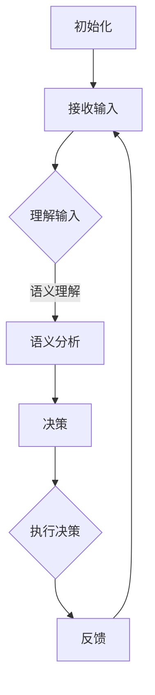

                 

### 第3章: AI Agent的原理与结构

#### 3.1.1 AI Agent的工作原理

##### 3.1.1.1 Mermaid流程图



该流程图展示了AI Agent的基本工作原理。从初始化开始，AI Agent接收输入，理解输入的语义，进行语义分析，然后根据分析结果做出决策，执行决策，并接收用户反馈。

##### 3.1.1.2 Python源代码

```python
class AIAgent:
    def __init__(self):
        # 初始化
        self.model = Model()

    def receive_input(self, input):
        # 接收输入
        return self.model.parse_input(input)

    def understand_input(self, input):
        # 理解输入
        return self.model.understand_input(input)

    def make_decision(self, input):
        # 决策
        return self.model.make_decision(input)

    def execute_decision(self, decision):
        # 执行决策
        self.model.execute_decision(decision)

    def get_feedback(self, feedback):
        # 获取反馈
        self.model.update_model(feedback)
```

这段代码展示了AI Agent的基本操作。首先，AI Agent通过初始化加载模型。然后，接收输入并通过模型进行解析和理解。在理解输入之后，AI Agent会根据输入做出决策，并执行决策。最后，AI Agent会接收用户的反馈并更新模型。

##### 3.1.1.3 算法原理讲解

AI Agent的工作原理可以分解为以下几个步骤：

1. **初始化**：AI Agent首先加载预训练的模型。模型通常是一个神经网络，它可以处理文本数据并进行预测。

   $$ Model \rightarrow Neural \ Network $$

2. **接收输入**：AI Agent接收用户输入。输入可以是文本或语音。

   $$ Input \rightarrow Text/voice $$

3. **理解输入**：AI Agent使用模型对输入进行语义理解。这一步骤通常涉及到自然语言处理（NLP）技术。

   $$ Input \rightarrow Semantic \ understanding $$

4. **语义分析**：AI Agent对理解后的输入进行分析，以提取关键信息。

   $$ Semantic \ understanding \rightarrow Key \ information \ extraction $$

5. **决策**：基于分析结果，AI Agent会做出决策。决策可能包括回复用户、执行某个操作或触发其他任务。

   $$ Decision \rightarrow Action \ selection $$

6. **执行决策**：AI Agent执行决策。例如，如果决策是回复用户，AI Agent会生成一个回复文本。

   $$ Decision \rightarrow Action $$

7. **反馈**：用户会对AI Agent的回复进行反馈。反馈可以用来优化AI Agent的性能。

   $$ Feedback \rightarrow Model \ update $$

##### 3.1.1.4 数学模型和公式

AI Agent的决策过程可以用以下数学模型来描述：

1. **输入表示**：将用户输入表示为向量。

   $$ Input \rightarrow Vector \ representation $$

2. **嵌入层**：将输入向量映射到高维空间。

   $$ Input \rightarrow Embedding \ layer $$

3. **隐藏层**：使用神经网络对嵌入层进行变换。

   $$ Embedding \ layer \rightarrow Hidden \ layer $$

4. **输出层**：从隐藏层提取特征，并生成决策。

   $$ Hidden \ layer \rightarrow Output \ layer $$

5. **损失函数**：计算预测与真实值之间的差距，并使用梯度下降进行优化。

   $$ Loss \ function \rightarrow Gradient \ descent $$

6. **反馈更新**：根据用户反馈更新模型。

   $$ Feedback \rightarrow Model \ update $$

通过这些步骤，AI Agent可以不断学习和优化，以提供更好的用户体验。

##### 3.1.1.5 举例说明

例如，假设用户输入：“明天天气怎么样？”。AI Agent会按照以下步骤操作：

1. **初始化**：加载预训练模型。
2. **接收输入**：将文本输入转换为向量。
3. **理解输入**：使用模型对输入进行语义理解。
4. **语义分析**：提取关键词“明天”和“天气”。
5. **决策**：生成天气查询的回复文本。
6. **执行决策**：发送回复文本给用户。
7. **反馈**：用户对回复进行评价。

通过这个过程，AI Agent不断学习和优化，以提供更准确的天气查询服务。

### 3.1.2 AI Agent的主要组成部分

AI Agent的主要组成部分包括：

1. **自然语言处理（NLP）模块**：负责接收和处理用户输入，进行语义理解。
2. **决策模块**：根据输入和分析结果，生成合适的回复或执行操作。
3. **执行模块**：执行决策，如生成回复文本、执行查询等。
4. **反馈模块**：接收用户反馈，用于模型更新和优化。

这些模块协同工作，使AI Agent能够实时、有效地与用户交互。接下来，我们将深入探讨这些模块的工作原理和设计要点。

