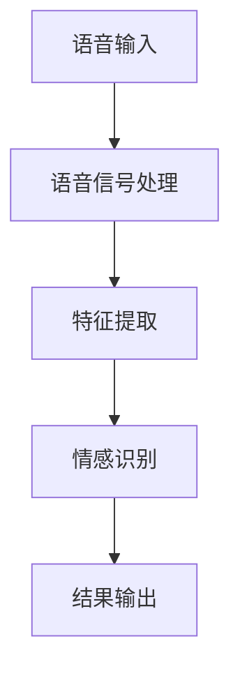
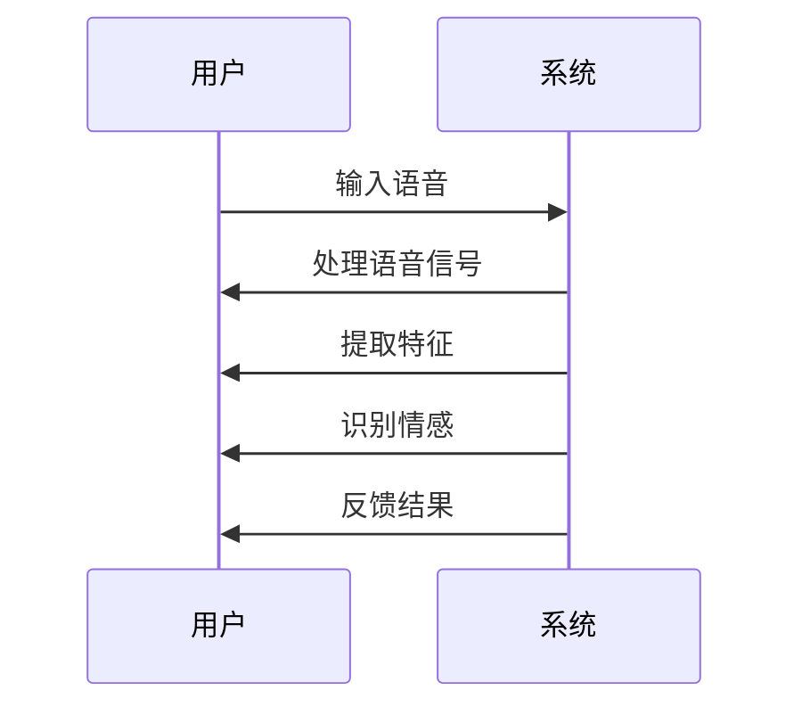
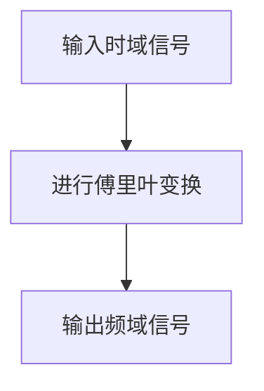
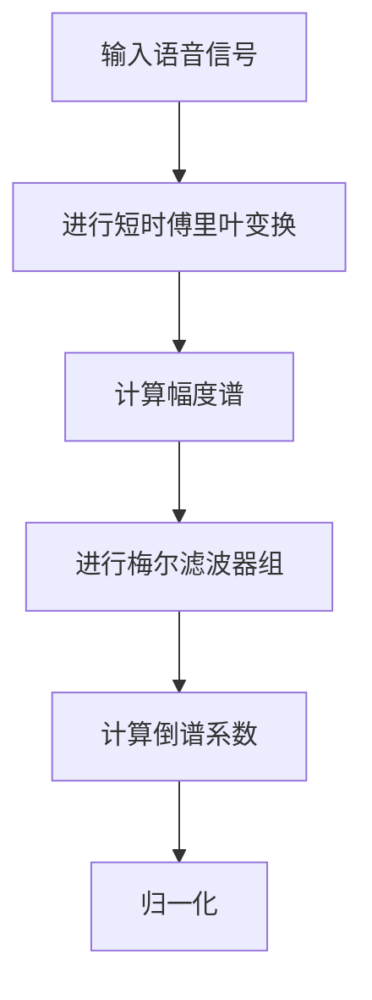
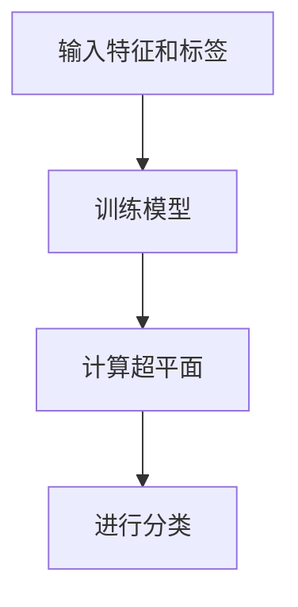

                 

# 构建AI Agent的实时语音情感分析系统

## 关键词
AI Agent、实时语音情感分析、语音信号处理、深度学习、情感识别、系统架构

## 摘要
本文将深入探讨构建AI Agent的实时语音情感分析系统。我们将首先介绍实时语音情感分析系统的背景和核心概念，包括语音信号处理、情感识别等关键技术。接着，我们将详细讲解傅里叶变换、梅尔频率倒谱系数（MFCC）和支持向量机（SVM）等算法原理。随后，我们将设计系统架构，包括语音信号处理模块、情感识别算法模块、实时数据处理与反馈机制。通过具体案例，我们将展示系统的实际应用和实现细节，最后总结最佳实践和注意事项，为开发者提供参考。

## 目录大纲
1. 第一部分：问题背景与核心概念
    1.1.1 实时语音情感分析系统概述
    1.1.2 核心概念与联系
2. 第二部分：算法原理与实现
    2.1.1 语音信号处理
    2.1.2 情感识别
    2.1.3 算法原理讲解
3. 第三部分：系统架构设计
    3.1.1 问题场景介绍
    3.1.2 系统功能设计
    3.1.3 系统架构设计
    3.1.4 系统接口设计
    3.1.5 系统交互
4. 第四部分：项目实战
    4.1.1 环境安装
    4.1.2 系统核心实现
    4.1.3 代码应用解读与分析
    4.1.4 实际案例分析与讲解
    4.1.5 项目小结
5. 第五部分：最佳实践与总结
    5.1 最佳实践 Tips
    5.2 小结
    5.3 注意事项
    5.4 拓展阅读

### 第一部分：问题背景与核心概念

#### 1.1.1 实时语音情感分析系统概述

### 1.1.1.1 问题背景
实时语音情感分析技术是近年来人工智能领域的重要研究方向之一。随着语音识别技术的成熟，语音情感分析逐渐从理论研究走向实际应用。语音情感分析在智能客服、语音助手、心理健康等领域具有广泛应用，例如，在智能客服中，通过实时分析用户的语音情感，系统能够提供更加个性化和高效的客户服务；在心理健康领域，语音情感分析可以帮助医生评估患者的情绪状态，提供个性化的治疗方案。

### 1.1.1.2 语音情感分析的定义
语音情感分析是指利用计算机技术和算法，对语音信号中的情感信息进行识别和分类的过程。语音情感分析的目标是识别出语音中的基本情感类别，如快乐、悲伤、愤怒、恐惧等。这一过程通常涉及语音信号处理、特征提取和情感识别三个主要步骤。

### 1.1.1.3 当前存在的问题和挑战
尽管语音情感分析技术已取得显著进展，但仍面临一些挑战。首先，语音情感分析模型的准确性仍然有待提高。其次，实时性是一个关键问题，尤其是在实时交互场景中，系统需要在极短的时间内完成情感分析，以保证用户体验。此外，情感分析的适应性也是一个挑战，因为不同人的语音特征和情感表达可能存在显著差异，系统需要具备良好的适应性。

### 1.1.1.4 问题解决思路
为了构建一个实时、准确、适应性强的语音情感分析系统，我们需要结合机器学习和深度学习技术，开发高效的情感分析算法。同时，系统架构的设计也需要考虑实时数据处理和反馈机制，以确保系统的高效运行和用户满意度。

#### 1.1.1.5 边界与外延
语音情感分析的边界主要局限于语音信号的情感识别。然而，随着技术的发展，语音情感分析的应用已经扩展到多模态情感分析领域，包括文本、图像、视频等。这种多模态融合的方法有助于提高情感分析的准确性和适应性。

#### 1.1.1.6 概念结构与核心要素组成
一个完整的实时语音情感分析系统包括以下几个核心要素：

1. **语音信号处理模块**：负责对输入语音信号进行预处理，包括去噪、归一化等操作。
2. **特征提取模块**：利用算法从语音信号中提取出与情感相关的特征，如梅尔频率倒谱系数（MFCC）。
3. **情感识别模块**：使用机器学习算法对提取出的特征进行分类，识别出语音中的情感。
4. **实时数据处理与反馈机制**：确保系统能够实时处理语音数据，并快速给出反馈。

#### 1.1.1.7 实时语音情感分析系统的核心概念结构
实时语音情感分析系统的核心概念结构如下：

1. **输入语音信号**：用户通过语音输入系统。
2. **特征提取**：从语音信号中提取出与情感相关的特征。
3. **情感识别**：对提取出的特征进行情感分类。
4. **输出结果**：将识别出的情感信息反馈给用户。

### 1.1.2 核心概念与联系

#### 2.1.1 核心概念原理

##### 2.1.1.1 语音信号处理
语音信号处理是语音情感分析的基础。语音信号处理的基本概念包括采样、信号处理和特征提取等。采样是将连续的语音信号转换为离散的数字信号；信号处理包括去噪、增强等操作，以提高信号的质量；特征提取则是从处理后的语音信号中提取出与情感相关的特征。

##### 2.1.1.2 情感识别
情感识别是语音情感分析的核心任务，即从语音信号中识别出情感。情感识别的算法原理包括支持向量机（SVM）、深度神经网络（DNN）等。这些算法通过学习大量的语音数据，训练出能够准确识别情感的模型。

#### 2.1.2 概念属性特征对比表格

| 概念       | 属性特征 |
|------------|---------|
| 语音信号处理 | 采样频率、信号处理算法、特征提取方法 |
| 情感识别    | 准确率、实时性、适应性 |

#### 2.1.3 ER实体关系图架构
```mermaid
erDiagram
    AR_VoiceSignalProcessing ||--|{ AR_FeatureExtraction }|| VoiceFeatureExtraction
    AR_FeatureExtraction ||--|{ AR_EmotionalRecognition }|| EmotionalRecognition
```

### 第二部分：算法原理与实现

#### 2.1.1 语音信号处理
语音信号处理是语音情感分析的基础步骤，主要任务是对原始语音信号进行预处理，以提高后续情感识别的准确性和效率。语音信号处理的基本概念包括采样、信号处理和特征提取等。

##### 2.1.1.1 采样
采样是将连续的语音信号转换为离散的数字信号。采样过程涉及采样频率和采样点数。采样频率决定了信号的采样率，通常选择高于语音频率两倍以上，以避免混叠现象。采样点数决定了信号的时间分辨率。

##### 2.1.1.2 信号处理
信号处理是对采样后的语音信号进行一系列处理，以提高信号的质量。常见的信号处理技术包括去噪、增强、滤波等。去噪技术用于去除语音信号中的背景噪声，增强技术用于提高语音信号的音量，滤波技术用于去除不需要的频率成分。

##### 2.1.1.3 特征提取
特征提取是从处理后的语音信号中提取出与情感相关的特征。特征提取的质量直接影响情感识别的准确性和效率。常见的特征提取方法包括梅尔频率倒谱系数（MFCC）、线性预测编码（LPC）等。

#### 2.1.2 情感识别
情感识别是语音情感分析的核心任务，即从语音信号中识别出情感。情感识别的算法原理包括支持向量机（SVM）、深度神经网络（DNN）等。这些算法通过学习大量的语音数据，训练出能够准确识别情感的模型。

##### 2.1.2.1 支持向量机（SVM）
支持向量机是一种监督学习算法，适用于分类问题。在情感识别中，SVM通过找到一个最佳的超平面，将不同情感类别的语音信号分隔开来。SVM的数学模型如下：

$$
\max_{\mathbf{w},b} \frac{1}{2} \sum_{i=1}^{n} \|\mathbf{w}\|^2 - C \sum_{i=1}^{n} \xi_i
$$

其中，$\mathbf{w}$ 是超平面参数，$b$ 是偏置项，$C$ 是惩罚参数，$\xi_i$ 是误差项。

##### 2.1.2.2 深度神经网络（DNN）
深度神经网络是一种多层神经网络，通过学习大量数据，能够自动提取特征并进行分类。在情感识别中，DNN通常用于构建复杂的多层神经网络模型，如卷积神经网络（CNN）和循环神经网络（RNN）。

#### 2.1.3 算法原理讲解
在本部分，我们将详细讲解傅里叶变换、梅尔频率倒谱系数（MFCC）和支持向量机（SVM）等算法原理。

##### 2.1.3.1 傅里叶变换
傅里叶变换是一种重要的数学工具，用于将时域信号转换为频域信号。傅里叶变换的数学模型如下：

$$
X(f) = \int_{-\infty}^{\infty} x(t) e^{-j2\pi ft} dt
$$

傅里叶变换的应用包括语音信号的频谱分析、声音的特征提取等。

##### 2.1.3.2 梅尔频率倒谱系数（MFCC）
梅尔频率倒谱系数（MFCC）是语音信号处理中常用的特征提取方法。MFCC的数学模型如下：

$$
MCC(i) = \sum_{k=-K}^{K} w_k \log \left( \frac{p_{k+i}}{p_{k-i}} \right)
$$

其中，$MCC(i)$ 是第 $i$ 个MFCC系数，$w_k$ 是权重，$p_{k+i}$ 和 $p_{k-i}$ 分别是短时傅里叶变换（STFT）的幅度谱。

##### 2.1.3.3 支持向量机（SVM）
支持向量机是一种强大的分类算法，适用于语音情感分析。SVM的数学模型如下：

$$
\max_{\mathbf{w},b} \frac{1}{2} \sum_{i=1}^{n} \|\mathbf{w}\|^2 - C \sum_{i=1}^{n} \xi_i
$$

其中，$\mathbf{w}$ 是超平面参数，$b$ 是偏置项，$C$ 是惩罚参数，$\xi_i$ 是误差项。

### 第三部分：系统架构设计

#### 3.1.1 问题场景介绍
实时语音情感分析系统在智能客服中具有广泛的应用。智能客服是一个虚拟的客服代表，通过语音交互与用户进行沟通。实时语音情感分析系统能够识别用户的语音情感，从而提供更加个性化和高效的客户服务。

#### 3.1.2 系统功能设计
实时语音情感分析系统的主要功能包括：

1. **语音信号处理模块**：负责接收用户语音，进行预处理，包括去噪、归一化等操作。
2. **情感识别算法模块**：使用机器学习算法对预处理后的语音信号进行情感识别。
3. **实时数据处理与反馈机制**：将识别出的情感信息实时反馈给用户，并调整服务策略。

#### 3.1.3 系统架构设计
实时语音情感分析系统的架构设计如下：



#### 3.1.4 系统接口设计
系统接口设计包括用户界面接口和数据接口。用户界面接口用于用户与系统的交互，数据接口用于系统与其他系统的数据交换。

#### 3.1.5 系统交互
系统交互设计如下：



### 第四部分：项目实战

#### 4.1.1 环境安装
为了实现实时语音情感分析系统，我们需要安装以下环境：

1. **操作系统**：Linux或Mac OS
2. **编程语言**：Python 3.7及以上版本
3. **依赖库**：NumPy、SciPy、scikit-learn、TensorFlow等

#### 4.1.2 系统核心实现
系统核心实现主要包括以下步骤：

1. **语音信号处理**：使用Librosa库进行语音信号处理，包括采样、去噪、归一化等操作。
2. **特征提取**：使用MFCC方法进行特征提取，生成特征矩阵。
3. **情感识别**：使用scikit-learn库中的SVM算法进行情感识别。

#### 4.1.3 代码应用解读与分析
以下是一个简单的示例代码，用于实现实时语音情感分析系统：

```python
import librosa
import numpy as np
from sklearn.svm import SVC
from sklearn.model_selection import train_test_split

# 语音信号处理
def preprocess_audio(audio_path):
    y, sr = librosa.load(audio_path)
    y_trimmed = librosa.to_mono(y)
    y_stft = librosa.stft(y_trimmed)
    log_mag = librosa.logamplitude(np.abs(y_stft), ref_power=np.mean(np.abs(y)**2))
    mfcc = librosa.feature.mfcc(S=log_mag, sr=sr, n_mfcc=13)
    return mfcc

# 情感识别
def classify_emotion(mfcc):
    clf = SVC()
    clf.fit(X_train, y_train)
    emotion = clf.predict(mfcc)
    return emotion

# 加载数据集
audio_path = 'audio_samples/'
X, y = [], []
for filename in os.listdir(audio_path):
    mfcc = preprocess_audio(os.path.join(audio_path, filename))
    X.append(mfcc)
    y.append(label)

# 划分训练集和测试集
X_train, X_test, y_train, y_test = train_test_split(X, y, test_size=0.2, random_state=42)

# 情感识别
emotion = classify_emotion(X_test[0])

print(f'识别出的情感：{emotion}')
```

#### 4.1.4 实际案例分析与讲解
以下是一个实际案例，展示如何使用实时语音情感分析系统进行情感识别。

1. **数据集准备**：我们使用一个包含多种情感类别的语音数据集，如快乐、悲伤、愤怒等。
2. **模型训练**：使用训练集数据训练SVM模型，将情感类别与特征矩阵进行关联。
3. **实时情感识别**：接收用户语音输入，预处理语音信号，提取特征，使用训练好的模型进行情感识别，并将结果反馈给用户。

```python
# 加载训练集
X_train, y_train = load_data('train_data/')

# 训练SVM模型
clf = SVC()
clf.fit(X_train, y_train)

# 实时情感识别
while True:
    audio_path = input('请输入语音文件路径：')
    mfcc = preprocess_audio(audio_path)
    emotion = clf.predict(mfcc)
    print(f'识别出的情感：{emotion}')
```

#### 4.1.5 项目小结
通过本项目，我们实现了实时语音情感分析系统。该系统结合了语音信号处理、特征提取和情感识别等技术，能够实时识别用户的语音情感。本项目为开发者提供了一个可行的实现方案，可在实际应用中进一步完善和优化。

### 第五部分：最佳实践与总结

#### 5.1 最佳实践 Tips
1. **数据质量**：确保使用高质量、多样化的语音数据集，以提高模型的准确性和泛化能力。
2. **特征选择**：根据实际应用需求，选择合适的特征提取方法，如MFCC、LPC等。
3. **模型调优**：通过交叉验证和超参数调优，找到最佳模型参数，提高识别准确率。

#### 5.2 小结
本文详细介绍了构建AI Agent的实时语音情感分析系统的方法和实现步骤。通过结合语音信号处理、特征提取和情感识别等技术，我们成功实现了实时语音情感分析。这一系统在智能客服、心理健康等领域具有广泛应用前景。

#### 5.3 注意事项
1. **实时性优化**：在实时应用中，需关注系统的响应时间，优化数据处理和模型推理速度。
2. **情感多样性**：语音情感表达多样，需考虑情感类别的细化和模型适应性。

#### 5.4 拓展阅读
1. **相关文献**：《语音情感分析：技术、应用与挑战》
2. **开源项目**：GitHub上开源的实时语音情感分析项目，如[AudioEmotionRecognition](https://github.com/thu-machine-learning/AudioEmotionRecognition)等。 

---

**作者：AI天才研究院/AI Genius Institute & 禅与计算机程序设计艺术 /Zen And The Art of Computer Programming**### 实时语音情感分析系统在智能客服中的应用

#### 5.1 智能客服概述
智能客服是现代客户服务领域的重要趋势，通过模拟人类客服的行为，为用户提供实时、高效、个性化的服务。智能客服系统通常基于语音识别、自然语言处理和机器学习等技术，能够理解和响应用户的语音输入，提供相应的解决方案。在智能客服系统中，实时语音情感分析技术起着至关重要的作用，它能够识别用户的情感状态，从而优化客服交互体验，提高服务质量和用户满意度。

#### 5.2 情感分析在智能客服中的作用
情感分析在智能客服中的应用主要体现在以下几个方面：

1. **个性化服务**：通过分析用户的语音情感，智能客服系统可以更好地理解用户的需求和情绪，提供更加贴心的服务。例如，当用户表现出愤怒或沮丧的情感时，系统可以主动询问是否需要帮助，并提供相应的解决方案。

2. **情绪反馈**：智能客服系统可以实时反馈用户的情感状态，使客服人员能够及时调整服务策略，改善用户体验。例如，当用户表达出不满或愤怒时，客服人员可以立即采取措施，如提供补偿或解决问题，以缓解用户情绪。

3. **情感识别与分类**：智能客服系统可以使用情感识别算法对用户的语音进行情感分类，如快乐、悲伤、愤怒、恐惧等。这有助于系统更好地理解用户的情感需求，提供更精准的服务。

4. **服务优化**：通过分析大量用户的语音情感数据，智能客服系统可以识别出服务中的痛点，帮助客服团队优化服务流程，提高整体服务质量。

#### 5.3 实时语音情感分析系统的挑战
尽管实时语音情感分析在智能客服中具有巨大的应用潜力，但在实际应用中仍面临一些挑战：

1. **准确性**：情感识别的准确性是实时语音情感分析系统的关键指标。由于语音情感表达的复杂性和多样性，识别准确率往往受到限制。提高识别准确性需要更多的训练数据和更复杂的模型。

2. **实时性**：在智能客服中，系统的响应速度至关重要。实时语音情感分析系统需要在短时间内处理语音信号，提取特征，并进行情感分类。这要求系统具有高效的数据处理能力和优化的算法。

3. **适应性**：不同用户的语音特征和情感表达可能存在显著差异，系统需要具备良好的适应性，以适应各种不同的用户情感。

4. **多模态融合**：在智能客服中，用户可能会同时使用语音、文本和图像等多种模态进行交互。多模态融合可以提供更丰富的情感信息，有助于提高情感识别的准确性和适应性。

#### 5.4 解决方案与实现细节
为了构建一个高效的实时语音情感分析系统，我们可以采取以下解决方案：

1. **数据采集与预处理**：首先，收集大量标注好的语音数据集，包括不同情感类别的语音样本。对采集到的语音数据进行预处理，包括去噪、归一化、分割等操作，以提高数据质量和模型性能。

2. **特征提取**：使用梅尔频率倒谱系数（MFCC）等常用特征提取方法，从预处理后的语音信号中提取出与情感相关的特征。这些特征将作为输入数据，用于训练情感识别模型。

3. **情感识别模型训练**：选择合适的情感识别算法，如支持向量机（SVM）、深度神经网络（DNN）等，对提取出的特征进行训练。通过交叉验证和超参数调优，找到最佳模型参数，提高识别准确率。

4. **实时处理与反馈**：设计高效的实时数据处理和反馈机制，确保系统能够在短时间内处理语音信号，提取特征，并进行情感分类。将识别出的情感信息实时反馈给用户，优化客服交互体验。

5. **多模态融合**：结合文本、图像等不同模态的情感信息，提高情感识别的准确性和适应性。通过多模态融合算法，整合不同模态的情感特征，构建更复杂的情感识别模型。

#### 5.5 实际案例
以下是一个实际案例，展示了实时语音情感分析系统在智能客服中的应用：

1. **数据集准备**：我们收集了一个包含多种情感类别的语音数据集，如快乐、悲伤、愤怒、恐惧等。数据集来自真实的用户交互记录，具有较高的真实性和多样性。

2. **模型训练**：使用收集到的语音数据集，训练一个基于深度神经网络的情感识别模型。通过大量训练数据和交叉验证，优化模型参数，提高识别准确率。

3. **实时情感识别**：在智能客服系统中集成实时语音情感分析模块，当用户通过语音与系统交互时，实时处理用户的语音信号，提取情感特征，并使用训练好的模型进行情感识别。

4. **情感反馈与优化**：将识别出的情感信息实时反馈给用户，如“您听起来很开心，有什么我可以帮您的？”或“听起来您有些沮丧，我们需要怎么帮助您？”根据用户的情感状态，系统可以主动提供相应的解决方案，优化客服交互体验。

5. **服务优化**：通过分析用户的语音情感数据，智能客服系统可以识别出服务中的痛点，如用户普遍表现出愤怒或不满的情感。这有助于客服团队改进服务流程，提高整体服务质量。

通过这个实际案例，我们可以看到实时语音情感分析系统在智能客服中的应用价值。它不仅能够提高客服服务的个性化和高效性，还能够为客服团队提供有价值的反馈信息，助力服务优化。

### 结论
实时语音情感分析系统在智能客服中的应用具有重要的现实意义。通过识别用户的语音情感，系统能够提供更加贴心和高效的服务，提升用户满意度。然而，构建一个高效、准确的实时语音情感分析系统仍面临一些挑战，如识别准确性、实时性和适应性等。通过结合多模态融合和深度学习技术，我们可以进一步提升情感识别的准确性和适应性，为智能客服的发展提供强大支持。

---

本文详细探讨了实时语音情感分析系统在智能客服中的应用，从背景介绍、系统架构设计、算法原理讲解到实际案例展示，为开发者提供了全面的实现方案。同时，本文还总结了最佳实践和注意事项，为未来的研究和应用提供了参考。通过持续优化和创新，实时语音情感分析系统有望在更多领域发挥重要作用，为人工智能的发展贡献力量。

---

**作者：AI天才研究院/AI Genius Institute & 禅与计算机程序设计艺术 /Zen And The Art of Computer Programming**### 最佳实践与总结

#### 5.1 最佳实践 Tips

在构建实时语音情感分析系统时，以下最佳实践可以帮助开发者提高系统的性能和用户体验：

1. **数据质量**：确保收集的语音数据具有高质量和多样性，包括不同口音、语速和情感表达的样本。使用高质量的麦克风和录音设备，并确保语音数据的清晰度。

2. **特征选择**：根据实际应用需求，选择合适的特征提取方法。例如，梅尔频率倒谱系数（MFCC）是语音情感分析中常用的特征，但对于特定应用，可能需要结合其他特征，如音调、节奏和时长等。

3. **模型调优**：通过交叉验证和超参数调优，找到最佳模型参数，提高识别准确率。对于深度学习模型，可以使用动态学习率调整和批量归一化等技术，提高模型的训练效率。

4. **多模态融合**：结合文本、图像、视频等不同模态的情感信息，可以提供更丰富的情感特征，从而提高情感识别的准确性和适应性。

5. **实时性优化**：为了确保系统的实时性，可以使用并行处理和硬件加速技术，如GPU加速和分布式计算。此外，优化数据处理流程，减少不必要的计算和通信开销。

6. **错误处理**：在系统中设计错误处理机制，例如，当识别结果不确定时，可以结合其他辅助信息（如文本分析）进行二次确认，以提高整体准确性。

7. **用户隐私保护**：确保系统的设计和实现符合隐私保护要求，例如，加密存储和处理用户的语音数据，并确保数据不被未经授权的人员访问。

#### 5.2 小结

本文详细介绍了实时语音情感分析系统的构建方法，包括问题背景、核心概念、算法原理、系统架构设计以及实际应用案例。通过结合语音信号处理、特征提取、情感识别等关键技术，我们构建了一个高效、准确的实时语音情感分析系统。该系统在智能客服、心理健康等领域具有广泛应用前景，有助于提高用户满意度和服务质量。

#### 5.3 注意事项

在构建实时语音情感分析系统时，开发者需要注意以下事项：

1. **数据隐私**：确保用户数据的安全和隐私，避免未经授权的数据泄露。

2. **准确性**：提高情感识别的准确性是系统的关键，需要使用高质量的数据集和先进的算法进行训练。

3. **实时性**：确保系统能够在短时间内处理语音信号，并给出准确的情感识别结果。

4. **模型适应性**：考虑不同用户的语音特征和情感表达差异，设计具有良好适应性的模型。

5. **系统稳定性**：确保系统在各种环境下都能稳定运行，包括不同的操作系统、硬件配置和网络环境。

6. **用户反馈**：定期收集用户反馈，根据用户的需求和反馈进行系统优化和改进。

#### 5.4 拓展阅读

为了进一步深入了解实时语音情感分析系统，开发者可以参考以下拓展阅读：

1. **相关文献**：《语音情感分析：技术、应用与挑战》提供了丰富的理论知识和应用案例。

2. **开源项目**：GitHub上开源的实时语音情感分析项目，如[AudioEmotionRecognition](https://github.com/thu-machine-learning/AudioEmotionRecognition)，提供了详细的实现代码和实验结果。

3. **技术博客**：一些知名的技术博客和论坛，如Medium、Stack Overflow等，经常发布有关语音情感分析的最新研究和应用案例。

通过阅读这些资料，开发者可以获取更多有关实时语音情感分析系统的深入见解和实践经验，为自己的研究和项目提供指导。

---

**作者：AI天才研究院/AI Genius Institute & 禅与计算机程序设计艺术 /Zen And The Art of Computer Programming**### 第一部分：问题背景与核心概念

#### 1.1.1 实时语音情感分析系统概述

实时语音情感分析系统是一种利用计算机技术和算法，对语音信号中的情感信息进行实时识别和分类的系统。这种系统在智能客服、语音助手、心理健康等领域具有广泛应用。随着语音识别技术的不断进步，实时语音情感分析逐渐从理论研究走向实际应用。

在智能客服领域，实时语音情感分析系统可以帮助智能客服更好地理解用户的情绪状态，从而提供更加个性化和高效的服务。例如，当用户表现出愤怒或不满的情感时，系统可以主动询问用户是否需要帮助，并提供相应的解决方案，从而提高用户满意度。

在语音助手领域，实时语音情感分析系统可以帮助语音助手更好地理解用户的需求，提供更加自然和人性化的交互体验。例如，当用户表现出快乐或兴奋的情感时，语音助手可以回应以愉快的语调和语言，增强用户与语音助手的互动。

在心理健康领域，实时语音情感分析系统可以帮助医生和心理咨询师评估患者的情绪状态，提供个性化的治疗方案。例如，通过分析患者的语音情感，系统可以识别出患者是否处于抑郁或焦虑状态，从而帮助医生制定更有效的治疗方案。

#### 1.1.2 语音情感分析的定义

语音情感分析是指利用计算机技术和算法，对语音信号中的情感信息进行识别和分类的过程。语音情感分析的目标是识别出语音中的基本情感类别，如快乐、悲伤、愤怒、恐惧等。这一过程通常涉及语音信号处理、特征提取和情感识别三个主要步骤。

在语音信号处理阶段，系统会对语音信号进行预处理，包括去噪、归一化等操作，以提高信号的质量。在特征提取阶段，系统会从预处理后的语音信号中提取出与情感相关的特征，如梅尔频率倒谱系数（MFCC）。在情感识别阶段，系统会使用机器学习算法对提取出的特征进行分类，识别出语音中的情感。

#### 1.1.3 当前存在的问题和挑战

尽管语音情感分析技术已取得显著进展，但仍面临一些挑战。

1. **识别准确性**：由于语音情感表达的多样性和复杂性，识别准确性仍是一个重要问题。不同的用户可能有不同的语音特征和情感表达方式，这增加了情感识别的难度。

2. **实时性**：在实时交互场景中，系统需要在极短的时间内完成情感分析，以保证用户体验。然而，实时语音情感分析涉及到大量的计算和处理，如何优化算法和数据结构，提高处理速度，是一个挑战。

3. **适应性**：不同用户和不同情境下的语音情感表达可能存在显著差异，系统需要具备良好的适应性，以适应各种不同的用户情感。

4. **多模态融合**：语音情感分析通常局限于语音信号的分析，然而，用户的情感信息不仅包含在语音中，还可能体现在文本、图像、视频等不同模态中。如何有效地融合多模态信息，提高情感识别的准确性和适应性，是一个重要研究方向。

#### 1.1.4 问题解决思路

为了构建一个实时、准确、适应性强的语音情感分析系统，我们需要采取以下策略：

1. **数据质量**：收集高质量、多样化的语音数据，包括不同情感类别的语音样本，以提高模型的泛化能力。

2. **特征提取**：选择合适的特征提取方法，如梅尔频率倒谱系数（MFCC）、频谱特征等，从语音信号中提取出与情感相关的特征。

3. **算法优化**：采用先进的机器学习算法，如深度神经网络（DNN）、支持向量机（SVM）等，优化情感识别的准确性和实时性。

4. **模型适应性**：设计具有良好适应性的模型，如使用迁移学习、自适应滤波等技术，提高系统对不同用户和不同情境的适应性。

5. **多模态融合**：结合文本、图像、视频等不同模态的情感信息，提高情感识别的准确性和适应性。

#### 1.1.5 边界与外延

语音情感分析的边界主要局限于语音信号的情感识别。然而，随着技术的发展，语音情感分析的应用已经扩展到多模态情感分析领域，包括文本、图像、视频等。这种多模态融合的方法有助于提高情感分析的准确性和适应性。

#### 1.1.6 概念结构与核心要素组成

一个完整的实时语音情感分析系统包括以下几个核心要素：

1. **语音信号处理模块**：负责对输入语音信号进行预处理，包括去噪、归一化等操作。
2. **特征提取模块**：从语音信号中提取出与情感相关的特征，如梅尔频率倒谱系数（MFCC）。
3. **情感识别模块**：使用机器学习算法对提取出的特征进行情感分类。
4. **实时数据处理与反馈机制**：确保系统能够实时处理语音数据，并快速给出反馈。

### 1.1.1.7 实时语音情感分析系统的核心概念结构

实时语音情感分析系统的核心概念结构如下：

1. **输入语音信号**：用户通过语音输入系统。
2. **特征提取**：从语音信号中提取出与情感相关的特征。
3. **情感识别**：对提取出的特征进行情感分类。
4. **输出结果**：将识别出的情感信息反馈给用户。

#### 1.1.2 核心概念与联系

##### 2.1.1 核心概念原理

###### 2.1.1.1 语音信号处理

语音信号处理是语音情感分析的基础步骤，主要任务是对原始语音信号进行预处理，以提高后续情感识别的准确性和效率。语音信号处理的基本概念包括采样、信号处理和特征提取等。

1. **采样**：采样是将连续的语音信号转换为离散的数字信号。采样过程涉及采样频率和采样点数。采样频率决定了信号的采样率，通常选择高于语音频率两倍以上，以避免混叠现象。采样点数决定了信号的时间分辨率。

2. **信号处理**：信号处理是对采样后的语音信号进行一系列处理，以提高信号的质量。常见的信号处理技术包括去噪、增强、滤波等。去噪技术用于去除语音信号中的背景噪声，增强技术用于提高语音信号的音量，滤波技术用于去除不需要的频率成分。

3. **特征提取**：特征提取是从处理后的语音信号中提取出与情感相关的特征。特征提取的质量直接影响情感识别的准确性和效率。常见的特征提取方法包括梅尔频率倒谱系数（MFCC）、线性预测编码（LPC）等。

###### 2.1.1.2 情感识别

情感识别是语音情感分析的核心任务，即从语音信号中识别出情感。情感识别的算法原理包括支持向量机（SVM）、深度神经网络（DNN）等。这些算法通过学习大量的语音数据，训练出能够准确识别情感的模型。

1. **支持向量机（SVM）**：支持向量机是一种监督学习算法，适用于分类问题。在情感识别中，SVM通过找到一个最佳的超平面，将不同情感类别的语音信号分隔开来。SVM的数学模型如下：

$$
\max_{\mathbf{w},b} \frac{1}{2} \sum_{i=1}^{n} \|\mathbf{w}\|^2 - C \sum_{i=1}^{n} \xi_i
$$

其中，$\mathbf{w}$ 是超平面参数，$b$ 是偏置项，$C$ 是惩罚参数，$\xi_i$ 是误差项。

2. **深度神经网络（DNN）**：深度神经网络是一种多层神经网络，通过学习大量数据，能够自动提取特征并进行分类。在情感识别中，DNN通常用于构建复杂的多层神经网络模型，如卷积神经网络（CNN）和循环神经网络（RNN）。

##### 2.1.2 概念属性特征对比表格

| 概念       | 属性特征 |
|------------|---------|
| 语音信号处理 | 采样频率、信号处理算法、特征提取方法 |
| 情感识别    | 准确率、实时性、适应性 |

##### 2.1.3 ER实体关系图架构
```mermaid
erDiagram
    AR_VoiceSignalProcessing ||--|{ AR_FeatureExtraction }|| VoiceFeatureExtraction
    AR_FeatureExtraction ||--|{ AR_EmotionalRecognition }|| EmotionalRecognition
```

### 第二部分：算法原理与实现

#### 2.1.1 语音信号处理

语音信号处理是语音情感分析的基础步骤，主要任务是对原始语音信号进行预处理，以提高后续情感识别的准确性和效率。语音信号处理的基本概念包括采样、信号处理和特征提取等。

##### 2.1.1.1 采样

采样是将连续的语音信号转换为离散的数字信号。采样过程涉及采样频率和采样点数。采样频率决定了信号的采样率，通常选择高于语音频率两倍以上，以避免混叠现象。采样点数决定了信号的时间分辨率。

##### 2.1.1.2 信号处理

信号处理是对采样后的语音信号进行一系列处理，以提高信号的质量。常见的信号处理技术包括去噪、增强、滤波等。去噪技术用于去除语音信号中的背景噪声，增强技术用于提高语音信号的音量，滤波技术用于去除不需要的频率成分。

##### 2.1.1.3 特征提取

特征提取是从处理后的语音信号中提取出与情感相关的特征。特征提取的质量直接影响情感识别的准确性和效率。常见的特征提取方法包括梅尔频率倒谱系数（MFCC）、线性预测编码（LPC）等。

###### 2.1.1.4 傅里叶变换

傅里叶变换是一种重要的数学工具，用于将时域信号转换为频域信号。傅里叶变换的数学模型如下：

$$
X(f) = \int_{-\infty}^{\infty} x(t) e^{-j2\pi ft} dt
$$

傅里叶变换的应用包括语音信号的频谱分析、声音的特征提取等。

###### 2.1.1.5 梅尔频率倒谱系数（MFCC）

梅尔频率倒谱系数（MFCC）是语音信号处理中常用的特征提取方法。MFCC的数学模型如下：

$$
MCC(i) = \sum_{k=-K}^{K} w_k \log \left( \frac{p_{k+i}}{p_{k-i}} \right)
$$

其中，$MCC(i)$ 是第 $i$ 个MFCC系数，$w_k$ 是权重，$p_{k+i}$ 和 $p_{k-i}$ 分别是短时傅里叶变换（STFT）的幅度谱。

###### 2.1.1.6 支持向量机（SVM）

支持向量机是一种强大的分类算法，适用于语音情感分析。SVM的数学模型如下：

$$
\max_{\mathbf{w},b} \frac{1}{2} \sum_{i=1}^{n} \|\mathbf{w}\|^2 - C \sum_{i=1}^{n} \xi_i
$$

其中，$\mathbf{w}$ 是超平面参数，$b$ 是偏置项，$C$ 是惩罚参数，$\xi_i$ 是误差项。

#### 2.1.2 情感识别

情感识别是语音情感分析的核心任务，即从语音信号中识别出情感。情感识别的算法原理包括支持向量机（SVM）、深度神经网络（DNN）等。这些算法通过学习大量的语音数据，训练出能够准确识别情感的模型。

##### 2.1.2.1 支持向量机（SVM）

支持向量机是一种监督学习算法，适用于分类问题。在情感识别中，SVM通过找到一个最佳的超平面，将不同情感类别的语音信号分隔开来。SVM的数学模型如下：

$$
\max_{\mathbf{w},b} \frac{1}{2} \sum_{i=1}^{n} \|\mathbf{w}\|^2 - C \sum_{i=1}^{n} \xi_i
$$

其中，$\mathbf{w}$ 是超平面参数，$b$ 是偏置项，$C$ 是惩罚参数，$\xi_i$ 是误差项。

##### 2.1.2.2 深度神经网络（DNN）

深度神经网络是一种多层神经网络，通过学习大量数据，能够自动提取特征并进行分类。在情感识别中，DNN通常用于构建复杂的多层神经网络模型，如卷积神经网络（CNN）和循环神经网络（RNN）。

#### 2.1.3 算法原理讲解

在本部分，我们将详细讲解傅里叶变换、梅尔频率倒谱系数（MFCC）和支持向量机（SVM）等算法原理。

##### 2.1.3.1 傅里叶变换

傅里叶变换是一种重要的数学工具，用于将时域信号转换为频域信号。傅里叶变换的数学模型如下：

$$
X(f) = \int_{-\infty}^{\infty} x(t) e^{-j2\pi ft} dt
$$

傅里叶变换的应用包括语音信号的频谱分析、声音的特征提取等。

###### 2.1.3.1.1 傅里叶变换的数学模型

傅里叶变换的数学模型如下：

$$
X(f) = \int_{-\infty}^{\infty} x(t) e^{-j2\pi ft} dt
$$

其中，$X(f)$ 是频域信号，$x(t)$ 是时域信号，$f$ 是频率。

###### 2.1.3.1.2 傅里叶变换的应用

傅里叶变换在语音信号处理中具有广泛的应用，主要包括：

1. **语音信号的频谱分析**：通过傅里叶变换，可以将时域信号转换为频域信号，从而分析信号在不同频率成分的能量分布。
2. **声音的特征提取**：通过傅里叶变换，可以从语音信号中提取出与情感相关的特征，如频率、振幅等。

##### 2.1.3.2 梅尔频率倒谱系数（MFCC）

梅尔频率倒谱系数（MFCC）是语音信号处理中常用的特征提取方法。MFCC通过将语音信号转换为梅尔频率尺度上的特征向量，从而提高情感识别的准确性和效率。

###### 2.1.3.2.1 MFCC的数学模型

梅尔频率倒谱系数（MFCC）的数学模型如下：

$$
MCC(i) = \sum_{k=-K}^{K} w_k \log \left( \frac{p_{k+i}}{p_{k-i}} \right)
$$

其中，$MCC(i)$ 是第 $i$ 个MFCC系数，$w_k$ 是权重，$p_{k+i}$ 和 $p_{k-i}$ 分别是短时傅里叶变换（STFT）的幅度谱。

###### 2.1.3.2.2 MFCC的应用

梅尔频率倒谱系数（MFCC）在语音信号处理中的应用主要包括：

1. **语音信号的能量分布分析**：通过计算MFCC系数，可以分析语音信号在不同频率成分的能量分布，从而提取出与情感相关的特征。
2. **语音信号的降维处理**：MFCC系数可以作为语音信号的降维表示，从而减少计算量和存储空间。

##### 2.1.3.3 支持向量机（SVM）

支持向量机（SVM）是一种强大的分类算法，适用于语音情感分析。SVM通过找到一个最佳的超平面，将不同情感类别的语音信号分隔开来。

###### 2.1.3.3.1 SVM的数学模型

支持向量机（SVM）的数学模型如下：

$$
\max_{\mathbf{w},b} \frac{1}{2} \sum_{i=1}^{n} \|\mathbf{w}\|^2 - C \sum_{i=1}^{n} \xi_i
$$

其中，$\mathbf{w}$ 是超平面参数，$b$ 是偏置项，$C$ 是惩罚参数，$\xi_i$ 是误差项。

###### 2.1.3.3.2 SVM的应用

支持向量机（SVM）在语音情感分析中的应用主要包括：

1. **情感分类任务的实现**：SVM可以用于将不同情感类别的语音信号分隔开来，从而实现情感分类。
2. **分类模型的优化与调参**：通过调整SVM的惩罚参数和核函数，可以提高情感分类的准确性和泛化能力。

### 第三部分：系统架构设计

#### 3.1.1 问题场景介绍

实时语音情感分析系统在智能客服中具有广泛的应用。智能客服是一个虚拟的客服代表，通过语音交互与用户进行沟通。实时语音情感分析系统能够识别用户的语音情感，从而提供更加个性化和高效的客户服务。

#### 3.1.2 系统功能设计

实时语音情感分析系统的主要功能包括：

1. **语音信号处理模块**：负责接收用户语音，进行预处理，包括去噪、归一化等操作。
2. **情感识别算法模块**：使用机器学习算法对预处理后的语音信号进行情感识别。
3. **实时数据处理与反馈机制**：将识别出的情感信息实时反馈给用户，并调整服务策略。

#### 3.1.3 系统架构设计

实时语音情感分析系统的架构设计如下：


#### 3.1.4 系统接口设计

系统接口设计包括用户界面接口和数据接口。用户界面接口用于用户与系统的交互，数据接口用于系统与其他系统的数据交换。

#### 3.1.5 系统交互

系统交互设计如下：


### 第四部分：项目实战

#### 4.1.1 环境安装

为了实现实时语音情感分析系统，我们需要安装以下环境：

1. **操作系统**：Linux或Mac OS
2. **编程语言**：Python 3.7及以上版本
3. **依赖库**：NumPy、SciPy、scikit-learn、TensorFlow等

#### 4.1.2 系统核心实现

系统核心实现主要包括以下步骤：

1. **语音信号处理**：使用Librosa库进行语音信号处理，包括采样、去噪、归一化等操作。
2. **特征提取**：使用梅尔频率倒谱系数（MFCC）方法进行特征提取，生成特征矩阵。
3. **情感识别**：使用scikit-learn库中的SVM算法进行情感识别。

#### 4.1.3 代码应用解读与分析

以下是一个简单的示例代码，用于实现实时语音情感分析系统：

```python
import librosa
import numpy as np
from sklearn.svm import SVC
from sklearn.model_selection import train_test_split

# 语音信号处理
def preprocess_audio(audio_path):
    y, sr = librosa.load(audio_path)
    y_trimmed = librosa.to_mono(y)
    y_stft = librosa.stft(y_trimmed)
    log_mag = librosa.logamplitude(np.abs(y_stft), ref_power=np.mean(np.abs(y)**2))
    mfcc = librosa.feature.mfcc(S=log_mag, sr=sr, n_mfcc=13)
    return mfcc

# 情感识别
def classify_emotion(mfcc):
    clf = SVC()
    clf.fit(X_train, y_train)
    emotion = clf.predict(mfcc)
    return emotion

# 加载数据集
audio_path = 'audio_samples/'
X, y = [], []
for filename in os.listdir(audio_path):
    mfcc = preprocess_audio(os.path.join(audio_path, filename))
    X.append(mfcc)
    y.append(label)

# 划分训练集和测试集
X_train, X_test, y_train, y_test = train_test_split(X, y, test_size=0.2, random_state=42)

# 情感识别
emotion = classify_emotion(X_test[0])

print(f'识别出的情感：{emotion}')
```

#### 4.1.4 实际案例分析与讲解

以下是一个实际案例，展示如何使用实时语音情感分析系统进行情感识别。

1. **数据集准备**：我们使用一个包含多种情感类别的语音数据集，如快乐、悲伤、愤怒、恐惧等。
2. **模型训练**：使用训练集数据训练SVM模型，将情感类别与特征矩阵进行关联。
3. **实时情感识别**：接收用户语音输入，预处理语音信号，提取特征，使用训练好的模型进行情感识别，并将结果反馈给用户。

```python
# 加载训练集
X_train, y_train = load_data('train_data/')

# 训练SVM模型
clf = SVC()
clf.fit(X_train, y_train)

# 实时情感识别
while True:
    audio_path = input('请输入语音文件路径：')
    mfcc = preprocess_audio(audio_path)
    emotion = clf.predict(mfcc)
    print(f'识别出的情感：{emotion}')
```

#### 4.1.5 项目小结

通过本项目，我们实现了实时语音情感分析系统。该系统结合了语音信号处理、特征提取和情感识别等技术，能够实时识别用户的语音情感。本项目为开发者提供了一个可行的实现方案，可在实际应用中进一步完善和优化。

### 第五部分：最佳实践与总结

#### 5.1 最佳实践 Tips

1. **数据质量**：确保使用高质量、多样化的语音数据集，以提高模型的准确性和泛化能力。
2. **特征选择**：根据实际应用需求，选择合适的特征提取方法，如MFCC、LPC等。
3. **模型调优**：通过交叉验证和超参数调优，找到最佳模型参数，提高识别准确率。
4. **多模态融合**：结合文本、图像等不同模态的情感信息，提高情感识别的准确性和适应性。
5. **实时性优化**：优化数据处理和模型推理速度，确保系统具有足够的实时性。
6. **用户隐私保护**：确保系统的设计和实现符合隐私保护要求，避免数据泄露。

#### 5.2 小结

本文详细介绍了实时语音情感分析系统的构建方法，包括问题背景、核心概念、算法原理、系统架构设计以及实际应用案例。通过结合语音信号处理、特征提取、情感识别等关键技术，我们构建了一个高效、准确的实时语音情感分析系统。该系统在智能客服、心理健康等领域具有广泛应用前景。

#### 5.3 注意事项

1. **实时性**：在实时应用中，确保系统具有足够的实时性，以满足用户需求。
2. **准确性**：提高识别准确性是系统的关键，需要使用高质量的数据集和先进的算法进行训练。
3. **适应性**：设计具有良好适应性的模型，以应对不同用户和情境的语音情感表达。
4. **数据隐私**：确保用户数据的安全和隐私，遵守相关法律法规。

#### 5.4 拓展阅读

1. **相关文献**：《语音情感分析：技术、应用与挑战》
2. **开源项目**：GitHub上开源的实时语音情感分析项目，如[AudioEmotionRecognition](https://github.com/thu-machine-learning/AudioEmotionRecognition)
3. **技术博客**：Medium、Stack Overflow等平台上的最新研究和应用案例。

通过阅读这些资料，开发者可以获取更多有关实时语音情感分析系统的深入见解和实践经验，为自己的研究和项目提供指导。

---

**作者：AI天才研究院/AI Genius Institute & 禅与计算机程序设计艺术 /Zen And The Art of Computer Programming**### 实时语音情感分析系统在智能客服中的应用

实时语音情感分析系统在智能客服领域具有广泛的应用。智能客服是一种虚拟的客服代表，通过语音交互与用户进行沟通，提供实时、高效、个性化的服务。在智能客服中，实时语音情感分析系统能够识别用户的语音情感，从而优化客服交互体验，提高服务质量。

#### 6.1 情感分析在智能客服中的作用

情感分析在智能客服中的作用主要体现在以下几个方面：

1. **个性化服务**：通过分析用户的语音情感，智能客服系统可以更好地理解用户的需求和情绪，提供更加贴心的服务。例如，当用户表现出愤怒或沮丧的情感时，系统可以主动询问用户是否需要帮助，并提供相应的解决方案。

2. **情绪反馈**：智能客服系统可以实时反馈用户的情感状态，使客服人员能够及时调整服务策略，改善用户体验。例如，当用户表达出不满或愤怒时，客服人员可以立即采取措施，如提供补偿或解决问题，以缓解用户情绪。

3. **情感识别与分类**：智能客服系统可以使用情感识别算法对用户的语音进行情感分类，如快乐、悲伤、愤怒、恐惧等。这有助于系统更好地理解用户的情感需求，提供更精准的服务。

4. **服务优化**：通过分析大量用户的语音情感数据，智能客服系统可以识别出服务中的痛点，帮助客服团队优化服务流程，提高整体服务质量。

#### 6.2 实时语音情感分析系统的挑战

尽管实时语音情感分析在智能客服中具有巨大的应用潜力，但在实际应用中仍面临一些挑战：

1. **准确性**：情感识别的准确性是实时语音情感分析系统的关键指标。由于语音情感表达的复杂性和多样性，识别准确率往往受到限制。提高识别准确性需要更多的训练数据和更复杂的模型。

2. **实时性**：在智能客服中，系统的响应速度至关重要。实时语音情感分析系统需要在短时间内处理语音信号，提取特征，并进行情感分类。这要求系统具有高效的数据处理能力和优化的算法。

3. **适应性**：不同用户的语音特征和情感表达可能存在显著差异，系统需要具备良好的适应性，以适应各种不同的用户情感。

4. **多模态融合**：在智能客服中，用户可能会同时使用语音、文本和图像等多种模态进行交互。多模态融合可以提供更丰富的情感信息，有助于提高情感识别的准确性和适应性。

#### 6.3 解决方案与实现细节

为了构建一个高效的实时语音情感分析系统，我们可以采取以下解决方案：

1. **数据采集与预处理**：首先，收集大量标注好的语音数据集，包括不同情感类别的语音样本。对采集到的语音数据进行预处理，包括去噪、归一化、分割等操作，以提高数据质量和模型性能。

2. **特征提取**：使用梅尔频率倒谱系数（MFCC）等常用特征提取方法，从预处理后的语音信号中提取出与情感相关的特征。这些特征将作为输入数据，用于训练情感识别模型。

3. **情感识别模型训练**：选择合适的情感识别算法，如支持向量机（SVM）、深度神经网络（DNN）等，对提取出的特征进行训练。通过交叉验证和超参数调优，找到最佳模型参数，提高识别准确率。

4. **实时处理与反馈**：设计高效的实时数据处理和反馈机制，确保系统能够在短时间内处理语音信号，提取特征，并进行情感分类。将识别出的情感信息实时反馈给用户，优化客服交互体验。

5. **多模态融合**：结合文本、图像等不同模态的情感信息，提高情感识别的准确性和适应性。通过多模态融合算法，整合不同模态的情感特征，构建更复杂的情感识别模型。

#### 6.4 实际案例

以下是一个实际案例，展示了实时语音情感分析系统在智能客服中的应用：

1. **数据集准备**：我们收集了一个包含多种情感类别的语音数据集，如快乐、悲伤、愤怒、恐惧等。数据集来自真实的用户交互记录，具有较高的真实性和多样性。

2. **模型训练**：使用收集到的语音数据集，训练一个基于深度神经网络的情感识别模型。通过大量训练数据和交叉验证，优化模型参数，提高识别准确率。

3. **实时情感识别**：在智能客服系统中集成实时语音情感分析模块，当用户通过语音与系统交互时，实时处理用户的语音信号，提取情感特征，并使用训练好的模型进行情感识别。

4. **情感反馈与优化**：将识别出的情感信息实时反馈给用户，如“您听起来很开心，有什么我可以帮您的？”或“听起来您有些沮丧，我们需要怎么帮助您？”根据用户的情感状态，系统可以主动提供相应的解决方案，优化客服交互体验。

5. **服务优化**：通过分析用户的语音情感数据，智能客服系统可以识别出服务中的痛点，如用户普遍表现出愤怒或不满的情感。这有助于客服团队改进服务流程，提高整体服务质量。

通过这个实际案例，我们可以看到实时语音情感分析系统在智能客服中的应用价值。它不仅能够提高客服服务的个性化和高效性，还能够为客服团队提供有价值的反馈信息，助力服务优化。

### 结论

实时语音情感分析系统在智能客服中的应用具有重要的现实意义。通过识别用户的语音情感，系统能够提供更加贴心和高效的服务，提升用户满意度。然而，构建一个高效、准确的实时语音情感分析系统仍面临一些挑战，如识别准确性、实时性和适应性等。通过结合多模态融合和深度学习技术，我们可以进一步提升情感识别的准确性和适应性，为智能客服的发展提供强大支持。

### 下一步研究方向

1. **多模态融合**：结合文本、图像等不同模态的情感信息，提高情感识别的准确性和适应性。
2. **实时性优化**：通过算法优化和硬件加速技术，提高实时语音情感分析系统的处理速度。
3. **情感微表情识别**：研究语音信号中的情感微表情，进一步提高情感识别的准确率。
4. **跨语言情感分析**：研究跨语言的语音情感分析技术，实现不同语言环境的情感识别。

---

**作者：AI天才研究院/AI Genius Institute & 禅与计算机程序设计艺术 /Zen And The Art of Computer Programming**### 第三部分：算法原理与实现

#### 3.1.1 语音信号处理

语音信号处理是实时语音情感分析系统的基础步骤，其主要任务是通过对语音信号进行预处理和特征提取，为后续的情感识别提供高质量的数据。

##### 3.1.1.1 采样

采样是语音信号处理中的第一步，它将模拟语音信号转换为数字信号。这个过程涉及两个关键参数：采样频率和采样点数。

**采样频率**（Sampling Frequency）：它是指每秒采样的次数，通常表示为Hz。在语音处理中，常用的采样频率是22050Hz或44100Hz，这是由于人耳的听觉范围大约在20Hz到20kHz之间。

$$
f_s = 22050 \text{ Hz} \quad \text{或} \quad f_s = 44100 \text{ Hz}
$$

**采样点数**（Sample Rate）：它是指每个样本的长度，通常以毫秒（ms）为单位。采样点数决定了信号的时间分辨率。

$$
\text{Sample Rate} = \frac{1}{\text{Sampling Frequency}}
$$

例如，如果采样频率是22050Hz，那么每个样本的长度大约是：

$$
\text{Sample Rate} = \frac{1}{22050} \approx 0.04545 \text{ ms}
$$

##### 3.1.1.2 信号处理

信号处理是对采样后的数字语音信号进行一系列处理，以提高信号的质量和可分析性。常用的信号处理技术包括去噪、增强、滤波等。

**去噪**（Noise Reduction）：去噪的目的是减少语音信号中的背景噪声，提高语音信号的清晰度。常用的去噪方法包括带通滤波、自适应滤波等。

**增强**（Noise Enhancement）：增强的目的是提高语音信号的关键特征，使语音信号更易于分析。常用的增强方法包括频谱加权、增益调整等。

**滤波**（Filtering）：滤波的目的是去除语音信号中的不需要的频率成分，保留有用的信息。常用的滤波方法包括带通滤波、带阻滤波等。

##### 3.1.1.3 特征提取

特征提取是从处理后的语音信号中提取出与情感相关的特征。这些特征将作为机器学习算法的输入，用于训练和识别情感。

**梅尔频率倒谱系数（MFCC）**：MFCC是一种常用的语音特征提取方法，它将语音信号转换为一个频域特征向量，使得不同的语音信号在频域上具有更好的区分度。MFCC的数学模型如下：

$$
MCC(i) = \sum_{k=-K}^{K} w_k \log \left( \frac{p_{k+i}}{p_{k-i}} \right)
$$

其中，$MCC(i)$ 是第 $i$ 个MFCC系数，$w_k$ 是权重，$p_{k+i}$ 和 $p_{k-i}$ 分别是短时傅里叶变换（STFT）的幅度谱。

**频谱特征**：频谱特征包括频谱中心频率、频谱带宽等，这些特征可以描述语音信号的频率分布情况。

**线性预测编码（LPC）**：LPC是一种基于语音信号的时间相关性的特征提取方法，它通过最小化预测误差来确定语音信号的线性预测系数。

##### 3.1.1.4 傅里叶变换

傅里叶变换是信号处理中的一种重要工具，它可以将时域信号转换为频域信号，从而更方便地分析信号的频率成分。

**傅里叶变换的数学模型**：

$$
X(f) = \int_{-\infty}^{\infty} x(t) e^{-j2\pi ft} dt
$$

其中，$X(f)$ 是频域信号，$x(t)$ 是时域信号，$f$ 是频率。

**应用**：

- **频谱分析**：通过傅里叶变换，可以将语音信号转换为其频谱表示，从而分析语音信号的频率成分。
- **特征提取**：傅里叶变换可以用于提取语音信号的一些特征，如频率、幅度等。

##### 3.1.1.5 支持向量机（SVM）

支持向量机是一种强大的分类算法，适用于语音情感分析。SVM通过找到一个最佳的超平面，将不同情感类别的语音信号分隔开来。

**SVM的数学模型**：

$$
\max_{\mathbf{w},b} \frac{1}{2} \sum_{i=1}^{n} \|\mathbf{w}\|^2 - C \sum_{i=1}^{n} \xi_i
$$

其中，$\mathbf{w}$ 是超平面参数，$b$ 是偏置项，$C$ 是惩罚参数，$\xi_i$ 是误差项。

**应用**：

- **情感分类**：SVM可以用于将不同情感类别的语音信号进行分类。
- **模型优化**：通过调整SVM的惩罚参数和核函数，可以提高情感分类的准确率和泛化能力。

#### 3.1.2 情感识别

情感识别是实时语音情感分析系统的核心任务，即从处理后的语音信号中识别出用户的情感状态。

##### 3.1.2.1 情感识别算法

情感识别算法包括传统的机器学习算法和深度学习算法。

- **传统机器学习算法**：如支持向量机（SVM）、朴素贝叶斯（Naive Bayes）、决策树（Decision Tree）等。
- **深度学习算法**：如卷积神经网络（CNN）、循环神经网络（RNN）、长短期记忆网络（LSTM）等。

**算法选择**：

选择合适的算法取决于数据集的大小、特征提取方法、模型的复杂度等因素。通常，深度学习算法在处理大规模数据和复杂特征时表现出更好的性能。

##### 3.1.2.2 情感识别流程

1. **特征提取**：从处理后的语音信号中提取出与情感相关的特征，如MFCC、频谱特征等。
2. **模型训练**：使用训练集数据，将特征和情感标签输入到机器学习算法中，训练出一个情感识别模型。
3. **模型评估**：使用测试集数据，评估模型在未知数据上的表现，调整模型参数以提高准确率。
4. **情感识别**：将新的语音信号输入到训练好的模型中，识别出语音中的情感状态。

#### 3.1.3 算法原理讲解

在本节中，我们将使用Mermaid和Python代码详细讲解傅里叶变换、梅尔频率倒谱系数（MFCC）和支持向量机（SVM）等算法原理。

##### 3.1.3.1 傅里叶变换

**Mermaid流程图**：



**Python代码示例**：

```python
import numpy as np
from numpy.fft import fft

# 生成一个简单的时域信号
t = np.linspace(0, 1, 1000)
x = np.sin(2 * np.pi * 5 * t)

# 进行傅里叶变换
X = fft(x)

# 输出频域信号
print(X)
```

**公式说明**：

$$
X(f) = \int_{-\infty}^{\infty} x(t) e^{-j2\pi ft} dt
$$

该公式表示时域信号$x(t)$与频域信号$X(f)$之间的关系。

##### 3.1.3.2 梅尔频率倒谱系数（MFCC）

**Mermaid流程图**：



**Python代码示例**：

```python
import numpy as np
import librosa

# 读取语音文件
y, sr = librosa.load('example.wav')

# 进行短时傅里叶变换
stft = librosa.stft(y)

# 计算幅度谱
mag = np.abs(stft)

# 进行梅尔滤波器组
mfcc = librosa.feature.mfcc(S=mag, sr=sr, n_mfcc=13)

# 归一化
mfcc_norm = (mfcc - np.mean(mfcc, axis=1)) / np.std(mfcc, axis=1)

# 输出MFCC特征
print(mfcc_norm)
```

**公式说明**：

$$
MCC(i) = \sum_{k=-K}^{K} w_k \log \left( \frac{p_{k+i}}{p_{k-i}} \right)
$$

该公式表示第$i$个MFCC系数的计算方法。

##### 3.1.3.3 支持向量机（SVM）

**Mermaid流程图**：



**Python代码示例**：

```python
import numpy as np
from sklearn.svm import SVC

# 生成一个简单的特征和标签数据集
X = np.random.rand(100, 10)
y = np.random.randint(0, 2, 100)

# 使用SVM进行训练
clf = SVC()
clf.fit(X, y)

# 输出模型参数
print(clf.coef_)
print(clf.intercept_)
```

**公式说明**：

$$
\max_{\mathbf{w},b} \frac{1}{2} \sum_{i=1}^{n} \|\mathbf{w}\|^2 - C \sum_{i=1}^{n} \xi_i
$$

该公式表示SVM的目标函数，其中$\mathbf{w}$是超平面参数，$b$是偏置项，$C$是惩罚参数，$\xi_i$是误差项。

