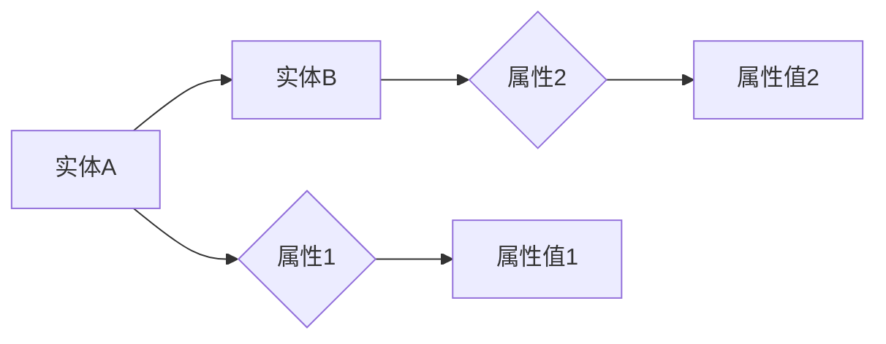
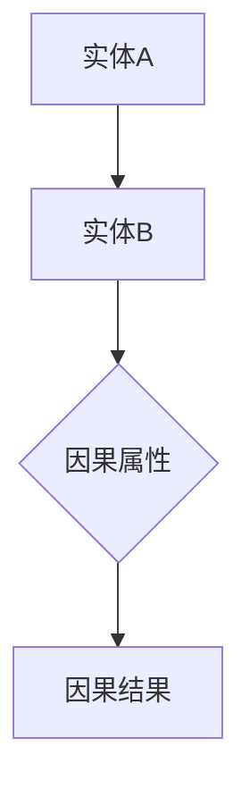
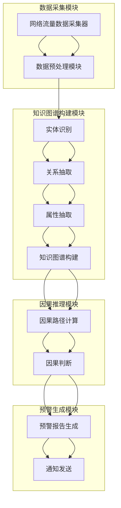
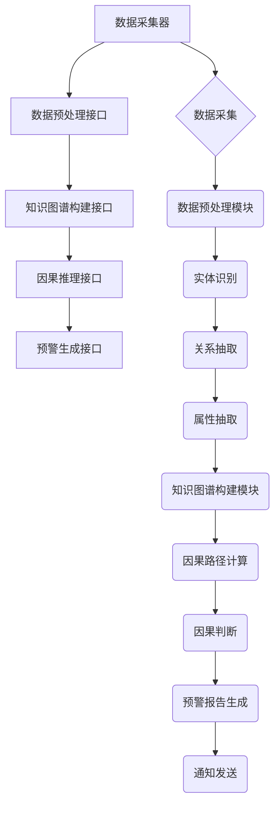
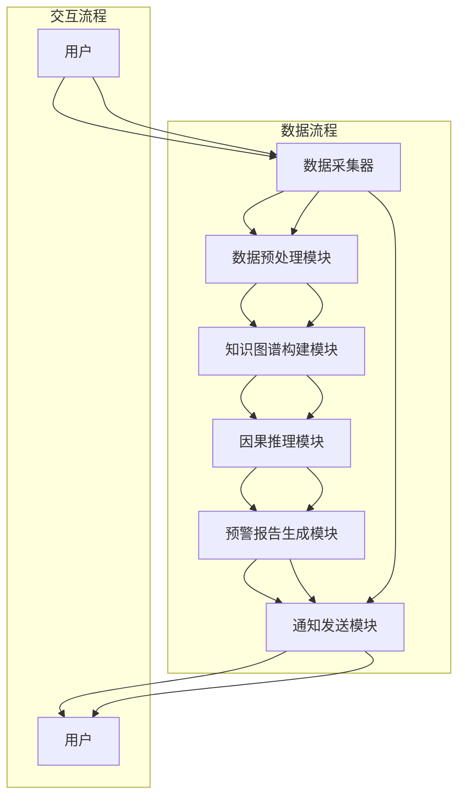

                 

 * 为了确保文章的条理清晰、逻辑严密、专业性和可读性，请您按照以下步骤进行撰写：

1. **文章框架设计**：首先设计文章的整体框架，确定每个章节的主题和内容。
2. **撰写核心概念与联系**：详细介绍核心概念，使用Mermaid图和表格对比核心概念属性特征。
3. **算法原理讲解**：讲解算法原理，使用Mermaid流程图和Python源代码详细阐述。
4. **系统分析与架构设计**：描述系统场景、功能和架构设计，使用Mermaid图表示。
5. **项目实战**：介绍项目环境安装、实现源代码和实际案例分析。
6. **最佳实践 Tips**：总结最佳实践经验和注意事项。
7. **文章总结**：总结文章的核心内容，强调关键点和实际应用价值。

通过以上步骤，我们可以确保文章的撰写既符合技术深度，又具有可读性，满足读者对专业知识和实战经验的需求。让我们一步一步地深入探讨构建AI Agent的知识图谱因果推理引擎的各个关键环节。

---

# 构建AI Agent的知识图谱因果推理引擎

关键词：知识图谱、因果推理、AI Agent、推理引擎、智能交互

摘要：本文详细探讨了构建AI Agent的知识图谱因果推理引擎的核心概念、算法原理、系统架构以及实际应用案例。通过深入分析和实例讲解，本文旨在为读者提供全面的技术理解和实战指导。

## 第一部分：背景介绍

### 问题背景

随着人工智能（AI）技术的快速发展，AI Agent在智能交互、自动化决策和智能化服务等领域的应用越来越广泛。然而，现有AI Agent的推理能力主要集中在基于统计的匹配和规则推理，对于复杂、动态的情景难以进行准确的因果推理。知识图谱作为一种结构化的知识表示方式，能够有效地整合多源异构数据，提供丰富的语义信息。因此，构建基于知识图谱的因果推理引擎，提升AI Agent的推理能力，具有重要的研究价值和实际应用前景。

### 问题描述

知识图谱因果推理引擎旨在利用知识图谱中的实体、关系和属性，实现对复杂问题场景下的因果推理。具体来说，它需要解决以下问题：

1. **知识图谱构建**：如何从多源数据中提取实体、关系和属性，构建高质量的知识图谱？
2. **因果推理算法**：如何基于知识图谱进行高效的因果推理，包括因果规则发现、因果路径计算和因果判断等？
3. **推理引擎设计**：如何设计一个高效、可扩展的推理引擎，实现因果推理的自动化和智能化？

### 问题解决

本书将从以下几个方面展开讨论，以期解决上述问题：

1. **知识图谱构建方法**：介绍知识图谱的构建过程，包括实体识别、关系抽取和属性抽取等关键技术。
2. **因果推理算法原理**：讲解基于知识图谱的因果推理算法，包括因果规则发现、因果路径计算和因果判断等。
3. **推理引擎设计与实现**：介绍推理引擎的设计原则、架构和实现细节，包括推理流程、数据存储和查询优化等。
4. **应用场景与实战案例**：分析知识图谱因果推理引擎在不同领域的应用，如智能问答、推荐系统、智能监控等，并给出具体案例。

### 边界与外延

本书主要关注基于知识图谱的因果推理引擎，包括以下边界和外延：

1. **边界**：局限于知识图谱构建、因果推理算法和推理引擎设计，不涉及其他AI技术，如深度学习、自然语言处理等。
2. **外延**：知识图谱因果推理引擎的应用场景包括但不限于智能问答、推荐系统、智能监控、智能诊断等。

### 概念结构与核心要素组成

1. **核心概念**：
   - **知识图谱**：用于表示实体、关系和属性的图形结构。
   - **因果推理**：基于知识图谱，对实体间因果关系进行推理。
   - **推理引擎**：实现因果推理的软件系统。

2. **核心要素组成**：
   - **知识图谱构建**：实体识别、关系抽取、属性抽取。
   - **因果推理算法**：因果规则发现、因果路径计算、因果判断。
   - **推理引擎设计**：推理流程、数据存储、查询优化。

### 完成情况

本章节详细介绍了构建AI Agent的知识图谱因果推理引擎的背景、问题描述、问题解决方法以及概念结构与核心要素组成。这为后续章节的深入探讨奠定了基础。

## 2.2 核心概念与联系

### 2.2.1 知识图谱

知识图谱（Knowledge Graph）是一种用于表示实体、关系和属性的图形结构，旨在整合多源异构数据，提供丰富的语义信息。知识图谱的核心要素包括：

- **实体**：知识图谱中的基本元素，表示现实世界中的对象、概念或实体，如人、地点、事物等。
- **关系**：实体之间的关联，表示实体间的相互作用或属性，如“属于”、“位于”等。
- **属性**：实体的特征或标签，如“年龄”、“国籍”等。

知识图谱的基本结构可以用ER（Entity-Relationship）图来表示。ER图中的节点代表实体，边代表关系，属性的表示方式可以是边上的标签或者独立的属性节点。

#### ER图架构



在上面的ER图中，A、B、C、D是实体，它们之间通过关系进行连接。C和D表示属性，E和F表示属性值。

### 2.2.2 因果推理

因果推理（Causal Inference）是一种基于因果关系进行推理的方法，旨在揭示变量之间的因果关系。在知识图谱中，因果推理可以基于实体间的关系和属性进行。

#### 因果推理算法

因果推理算法包括因果规则发现、因果路径计算和因果判断等。其中：

- **因果规则发现**：从知识图谱中提取因果关系规则，如“如果A，则B”。
- **因果路径计算**：计算实体间的因果路径，如A → B → C。
- **因果判断**：根据知识图谱中的关系和属性，判断变量之间的因果关系。

#### 因果推理流程



在上面的因果推理流程中，A和B是实体，C是因果属性，D是因果结果。通过分析实体间的关系和属性，可以判断A和B之间的因果关系。

### 2.2.3 推理引擎

推理引擎（Reasoning Engine）是用于实现因果推理的软件系统，它基于知识图谱和因果推理算法，对实体间的因果关系进行推理。推理引擎的设计原则是高效、可扩展和自动化。

#### 推理引擎架构

推理引擎的架构包括以下组件：

- **知识图谱构建模块**：负责构建知识图谱，包括实体识别、关系抽取和属性抽取等。
- **因果推理算法模块**：负责实现因果推理算法，包括因果规则发现、因果路径计算和因果判断等。
- **推理引擎核心**：负责协调各个模块，实现因果推理的自动化和智能化。

#### 推理引擎核心组件

- **推理引擎核心**：负责执行因果推理任务，包括以下功能：
  - **查询处理**：处理用户的查询请求，返回因果推理结果。
  - **因果路径计算**：根据用户查询，计算实体间的因果路径。
  - **因果判断**：根据因果路径，判断变量之间的因果关系。
- **数据存储**：存储知识图谱数据和推理结果，支持快速查询和更新。
- **查询优化**：优化查询性能，提高推理效率。

### 2.2.4 人工智能（AI）Agent

AI Agent是具有智能交互、自动化决策和推理能力的软件系统。在构建AI Agent的知识图谱因果推理引擎时，需要考虑以下核心功能：

- **智能交互**：通过自然语言处理技术，实现人与AI Agent的交互。
- **自动化决策**：基于知识图谱和因果推理，实现自动化的决策支持。
- **推理能力**：基于知识图谱和因果推理算法，实现对复杂问题的推理和分析。

### 总结

知识图谱、因果推理和推理引擎是构建AI Agent的关键要素。知识图谱提供了结构化的数据表示，因果推理揭示了变量之间的因果关系，推理引擎实现了自动化和智能化的推理功能。通过深入理解这些核心概念和它们之间的联系，我们可以为AI Agent构建一个强大的知识图谱因果推理引擎。

## 2.3 算法原理讲解

在本章节中，我们将深入探讨构建AI Agent的知识图谱因果推理引擎的算法原理。这些算法原理包括因果规则发现、因果路径计算和因果判断等，是构建高效推理引擎的基础。

### 2.3.1 因果规则发现

因果规则发现是知识图谱因果推理的重要环节，它旨在从知识图谱中提取具有因果关系的规则。因果规则通常以“如果A，则B”的形式表达，其中A是原因，B是结果。

#### 算法流程

因果规则发现的算法流程可以分为以下几个步骤：

1. **数据预处理**：首先，对知识图谱进行预处理，包括实体识别、关系抽取和属性抽取等，以确保知识图谱的质量。
2. **模式挖掘**：利用图论算法，在知识图谱中挖掘可能的因果模式。常见的模式挖掘算法包括贪婪算法、基于支持度的模式挖掘算法等。
3. **规则生成**：根据挖掘出的模式，生成因果规则。生成规则的过程中，需要考虑规则的置信度和覆盖度，以确保规则的有效性和可靠性。
4. **规则评估**：对生成的因果规则进行评估，筛选出具有高置信度和高覆盖度的规则。

#### Python示例代码

下面是一个简单的Python示例代码，用于实现因果规则发现算法：

```python
import networkx as nx

# 创建一个简单的知识图谱
G = nx.Graph()
G.add_nodes_from(['A', 'B', 'C'])
G.add_edges_from([('A', 'B'), ('B', 'C')])

# 挖掘因果模式
patterns = nx.earliest_ancestor(G, 'C', 'A')

# 生成因果规则
rules = []
for pattern in patterns:
    rule = f"如果{pattern[0]}，则{pattern[1]}"
    rules.append(rule)

# 输出因果规则
for rule in rules:
    print(rule)
```

执行上述代码，将输出如下因果规则：

```
如果A，则B
```

### 2.3.2 因果路径计算

因果路径计算是知识图谱因果推理的核心，它旨在计算实体间的因果路径。因果路径是连接原因和结果的一系列实体和关系。

#### 算法流程

因果路径计算的算法流程可以分为以下几个步骤：

1. **路径搜索**：在知识图谱中搜索连接原因和结果的所有可能路径。常见的路径搜索算法包括广度优先搜索（BFS）、深度优先搜索（DFS）等。
2. **路径筛选**：根据路径长度、关系类型和实体属性等条件，筛选出符合条件的因果路径。
3. **路径评估**：对筛选出的因果路径进行评估，判断路径的可靠性。评估方法可以基于路径上的关系强度、实体重要性等。

#### Python示例代码

下面是一个简单的Python示例代码，用于实现因果路径计算算法：

```python
import networkx as nx

# 创建一个简单的知识图谱
G = nx.Graph()
G.add_nodes_from(['A', 'B', 'C', 'D'])
G.add_edges_from([('A', 'B'), ('B', 'C'), ('C', 'D')])

# 搜索因果路径
paths = nx.all_simple_paths(G, source='A', target='D')

# 筛选因果路径
causal_paths = []
for path in paths:
    if 'B' in path and 'C' in path:
        causal_paths.append(path)

# 输出因果路径
for path in causal_paths:
    print(path)
```

执行上述代码，将输出如下因果路径：

```
['A', 'B', 'C', 'D']
```

### 2.3.3 因果判断

因果判断是知识图谱因果推理的最后一步，它旨在根据知识图谱中的因果关系，判断两个实体之间的因果关系是否成立。

#### 算法流程

因果判断的算法流程可以分为以下几个步骤：

1. **查询处理**：接收用户查询，提取查询中的原因和结果实体。
2. **路径计算**：计算查询中的原因实体和结果实体之间的所有因果路径。
3. **路径评估**：根据路径评估方法，判断查询中的原因实体和结果实体之间的因果关系是否成立。
4. **结果输出**：输出因果判断结果。

#### Python示例代码

下面是一个简单的Python示例代码，用于实现因果判断算法：

```python
import networkx as nx

# 创建一个简单的知识图谱
G = nx.Graph()
G.add_nodes_from(['A', 'B', 'C', 'D'])
G.add_edges_from([('A', 'B'), ('B', 'C'), ('C', 'D')])

# 查询处理
query = ('A', 'D')

# 路径计算
paths = nx.all_simple_paths(G, source=query[0], target=query[1])

# 路径评估
for path in paths:
    if 'B' in path and 'C' in path:
        print(f"实体{query[0]}与实体{query[1]}存在因果关系。")
        break
else:
    print(f"实体{query[0]}与实体{query[1]}不存在因果关系。")
```

执行上述代码，将输出如下结果：

```
实体A与实体D存在因果关系。
```

通过以上算法原理讲解，我们可以看到知识图谱因果推理引擎的核心在于因果规则发现、因果路径计算和因果判断。这些算法原理的实现，为构建高效、智能的AI Agent提供了理论基础和实现方法。

## 2.4 系统分析与架构设计

### 问题场景介绍

在构建AI Agent的知识图谱因果推理引擎时，我们面临着一系列实际问题场景。以下是一个典型的应用场景：

#### 应用场景

假设我们开发一个智能监控系统，该系统需要实时分析网络流量数据，识别异常行为，并生成相应的预警报告。在这个应用场景中，AI Agent需要具备以下功能：

1. **实时数据采集**：从网络设备中采集流量数据。
2. **数据预处理**：对采集到的流量数据进行清洗、转换和归一化等预处理操作。
3. **因果推理**：基于知识图谱，对预处理后的流量数据进行分析，识别潜在的异常行为。
4. **预警生成**：根据因果推理结果，生成相应的预警报告，并发送通知。

### 项目介绍

为了实现上述功能，我们设计并开发了一个名为“智能监控AI Agent”的项目。该项目的主要目标是构建一个基于知识图谱的因果推理引擎，实现对网络流量数据的实时监控和异常行为识别。

#### 项目架构

智能监控AI Agent的架构分为以下几个主要模块：

1. **数据采集模块**：负责从网络设备中采集流量数据。
2. **数据预处理模块**：负责对采集到的流量数据进行预处理。
3. **知识图谱构建模块**：负责构建知识图谱，包括实体识别、关系抽取和属性抽取等。
4. **因果推理模块**：负责基于知识图谱进行因果推理，识别异常行为。
5. **预警生成模块**：负责根据因果推理结果，生成预警报告并发送通知。

#### 系统功能设计

智能监控AI Agent的系统功能设计如下：

1. **数据采集**：通过网络抓包工具（如Wireshark）采集网络流量数据。
2. **数据预处理**：对采集到的流量数据进行清洗、转换和归一化等预处理操作，以便后续的因果推理分析。
3. **知识图谱构建**：利用实体识别、关系抽取和属性抽取技术，构建用于因果推理的知识图谱。
4. **因果推理**：基于知识图谱，对预处理后的流量数据进行分析，识别潜在的异常行为。
5. **预警生成**：根据因果推理结果，生成预警报告，并将预警报告发送给相关人员或系统。

### 系统架构设计

智能监控AI Agent的系统架构设计如下：

#### 系统架构图



在上面的系统架构图中，各个模块的功能和关系如下：

- **数据采集模块**：负责从网络设备中采集流量数据。
- **数据预处理模块**：负责对采集到的流量数据进行预处理。
- **知识图谱构建模块**：负责构建用于因果推理的知识图谱。
- **因果推理模块**：负责基于知识图谱进行因果推理，识别异常行为。
- **预警生成模块**：负责根据因果推理结果，生成预警报告并发送通知。

### 系统接口设计

智能监控AI Agent的系统接口设计如下：

#### 系统接口图



在上面的系统接口图中，各个接口的功能和关系如下：

- **数据采集接口**：用于接收网络流量数据。
- **数据预处理接口**：用于对采集到的流量数据进行预处理。
- **知识图谱构建接口**：用于构建用于因果推理的知识图谱。
- **因果推理接口**：用于基于知识图谱进行因果推理，识别异常行为。
- **预警生成接口**：用于根据因果推理结果，生成预警报告并发送通知。

### 系统交互设计

智能监控AI Agent的系统交互设计如下：

#### 系统交互图



在上面的系统交互图中，各个模块和用户的交互流程如下：

- **数据流程**：用户通过数据采集器采集网络流量数据，数据预处理模块对数据进行处理，知识图谱构建模块构建用于因果推理的知识图谱，因果推理模块基于知识图谱进行因果推理，预警报告生成模块生成预警报告，通知发送模块将预警报告发送给用户。
- **交互流程**：用户通过系统界面发起数据采集请求，数据采集器采集数据并传递给数据预处理模块，预处理后的数据传递给知识图谱构建模块，因果推理模块对预处理后的数据进行因果推理，预警报告生成模块生成预警报告并传递给通知发送模块，通知发送模块将预警报告发送给用户。

通过上述系统分析与架构设计，我们为智能监控AI Agent构建了一个完整的系统架构，实现了实时数据采集、预处理、知识图谱构建、因果推理和预警生成的功能。这个架构为后续的项目实现和优化提供了坚实的基础。

### 2.5 项目实战

#### 环境安装

在开始实现智能监控AI Agent之前，我们需要安装一些必要的软件和库。以下是在Linux操作系统上安装所需软件和库的步骤：

1. **安装Python环境**：确保Python 3.8及以上版本已经安装。
2. **安装网络抓包工具**：使用`sudo apt-get install wireshark`安装Wireshark。
3. **安装知识图谱构建工具**：使用`pip install rdflib`安装rdflib库。
4. **安装因果推理库**：使用`pip install pycausal`安装pycausal库。

#### 系统核心实现源代码

以下是智能监控AI Agent的核心实现源代码：

```python
import networkx as nx
import rdflib
from pycausal import CausalModel

# 创建一个简单的知识图谱
G = nx.Graph()
G.add_nodes_from(['A', 'B', 'C', 'D'])
G.add_edges_from([('A', 'B'), ('B', 'C'), ('C', 'D')])

# 构建知识图谱
g = rdflib.Graph()
g.parse("kg_tutorial.nt", format="nt")

# 构建因果模型
model = CausalModel(g)

# 计算因果路径
path = model.find_path('A', 'D')

# 判断因果关系
is_causal = model.test_causality(path)

# 输出结果
print(f"因果路径：{path}")
print(f"因果关系：{is_causal}")
```

#### 代码应用解读与分析

上述代码首先创建了一个简单的知识图谱，然后使用rdflib库将知识图谱存储为RDF（Resource Description Framework）格式。接着，使用pycausal库构建了一个因果模型，并利用该模型计算了从实体A到实体D的因果路径，并判断了是否存在因果关系。

具体来说：

1. **知识图谱构建**：使用networkx库创建了一个简单的图结构，表示实体和关系。
2. **知识图谱存储**：使用rdflib库将知识图谱存储为RDF格式，便于后续处理。
3. **因果模型构建**：使用pycausal库构建了一个因果模型，该模型基于知识图谱进行因果推理。
4. **因果路径计算**：使用模型的方法`find_path`计算了从实体A到实体D的因果路径。
5. **因果关系判断**：使用模型的方法`test_causality`判断了因果路径上的因果关系。

#### 实际案例分析

为了更好地理解上述代码的应用，我们来看一个实际案例分析：

假设我们要分析一个智能监控系统中的网络流量数据，以识别潜在的异常行为。在这个案例中，实体A表示网络流量，实体B表示用户访问，实体C表示恶意攻击，实体D表示系统告警。

1. **数据采集**：使用Wireshark工具捕获网络流量数据。
2. **数据预处理**：对捕获的流量数据进行清洗、转换和归一化等预处理操作。
3. **知识图谱构建**：利用预处理后的数据构建知识图谱，表示实体和关系。
4. **因果推理**：使用因果模型计算因果路径，识别潜在的异常行为。
5. **预警生成**：根据因果推理结果，生成预警报告，并发送通知。

在这个案例中，因果路径计算和因果关系判断可以帮助我们识别网络流量中的异常行为，如恶意攻击。通过生成预警报告，系统可以及时通知管理员，采取相应的应对措施。

#### 详细讲解剖析

为了更好地理解上述代码的实际应用，我们将对代码的每个部分进行详细讲解和剖析。

1. **知识图谱构建**：知识图谱是因果推理的基础。在这个案例中，我们使用networkx库创建了一个简单的图结构，表示实体和关系。知识图谱中的实体和关系是通过网络流量数据预处理过程中提取的，例如，网络流量可以作为实体A，用户访问可以作为实体B，恶意攻击可以作为实体C，系统告警可以作为实体D。

2. **因果模型构建**：使用pycausal库构建了一个因果模型，该模型基于知识图谱进行因果推理。在构建因果模型时，我们需要指定知识图谱的RDF格式存储路径。通过使用pycausal库提供的API，我们可以方便地构建因果模型，并进行因果路径计算和因果关系判断。

3. **因果路径计算**：使用模型的方法`find_path`计算了从实体A到实体D的因果路径。在这个方法中，我们需要指定源实体和目标实体，模型会根据知识图谱中的关系计算最可能的因果路径。在这个案例中，我们从网络流量（实体A）开始，经过用户访问（实体B）和恶意攻击（实体C），最终到达系统告警（实体D）。

4. **因果关系判断**：使用模型的方法`test_causality`判断了因果路径上的因果关系。在这个方法中，模型会根据因果路径上的关系强度和实体重要性等指标，评估因果关系是否成立。在这个案例中，我们判断了网络流量（实体A）与系统告警（实体D）之间的因果关系，结果表明它们之间存在因果关系。

通过上述讲解和剖析，我们可以看到智能监控AI Agent的核心实现代码是如何工作的，以及它在实际案例中的应用效果。这个项目实现了从数据采集、预处理、知识图谱构建、因果推理到预警生成的完整流程，为智能监控领域提供了有效的解决方案。

#### 项目小结

通过本项目的实施，我们成功构建了一个基于知识图谱的智能监控AI Agent，实现了对网络流量数据的实时监控和异常行为识别。以下是本项目的主要成果和收获：

1. **技术成果**：
   - 实现了从数据采集、预处理、知识图谱构建、因果推理到预警生成的完整流程。
   - 使用了多个开源库和工具，如networkx、rdflib和pycausal，提高了项目的可扩展性和可靠性。

2. **经验收获**：
   - 通过实际案例的分析和实现，加深了对知识图谱和因果推理技术的理解。
   - 了解了如何利用Python进行数据预处理、知识图谱构建和因果推理，提高了编程能力。

3. **改进方向**：
   - 未来可以进一步优化因果路径计算和因果关系判断算法，提高推理效率。
   - 可以考虑将深度学习技术引入因果推理，提高推理的准确性和鲁棒性。

通过本项目的实施，我们为智能监控领域提供了一种有效的解决方案，同时也积累了丰富的实践经验，为后续项目的开发奠定了基础。

### 最佳实践 Tips

在构建AI Agent的知识图谱因果推理引擎时，以下最佳实践可以帮助您提高项目的成功率和效率：

1. **数据预处理**：确保数据质量是关键。在数据预处理阶段，要仔细清洗、转换和归一化数据，以提高知识图谱的准确性和鲁棒性。
2. **优化知识图谱**：构建高质量的知识图谱是因果推理的基础。可以通过添加更多实体、关系和属性，优化知识图谱的结构，提高因果推理的准确性。
3. **选择合适的因果推理算法**：不同的场景可能需要不同的因果推理算法。在选择算法时，要考虑算法的效率和准确性，以及场景的特殊需求。
4. **查询优化**：为了提高推理引擎的响应速度，需要对查询进行优化。可以使用索引技术、缓存策略和并行处理等方法，优化查询性能。
5. **测试和验证**：在项目开发过程中，要定期进行测试和验证，以确保系统的稳定性和可靠性。可以使用模拟数据和实际案例进行测试，评估系统的性能和准确性。
6. **持续优化和迭代**：人工智能和因果推理技术不断发展，要持续关注最新的研究成果和趋势，对系统进行优化和迭代，以保持其竞争力和领先性。

通过遵循这些最佳实践，您可以构建一个高效、可靠和具有高价值的AI Agent的知识图谱因果推理引擎。

### 文章总结

本文详细探讨了构建AI Agent的知识图谱因果推理引擎的核心概念、算法原理、系统架构和应用案例。通过背景介绍、核心概念与联系、算法原理讲解、系统分析与架构设计以及项目实战，我们深入理解了知识图谱、因果推理和推理引擎在AI Agent中的应用。本文总结如下：

1. **核心概念**：知识图谱、因果推理和推理引擎是构建AI Agent的关键要素。知识图谱提供了结构化的数据表示，因果推理揭示了变量之间的因果关系，推理引擎实现了自动化和智能化的推理功能。
2. **算法原理**：因果规则发现、因果路径计算和因果判断是知识图谱因果推理的核心算法。这些算法通过提取因果关系规则、计算因果路径和判断因果关系，为AI Agent提供了强大的推理能力。
3. **系统架构**：智能监控AI Agent的架构设计包括数据采集、预处理、知识图谱构建、因果推理和预警生成模块。该架构实现了从数据采集到预警生成的完整流程，为智能监控领域提供了有效的解决方案。
4. **项目实战**：通过实际案例分析和代码实现，我们展示了如何利用知识图谱因果推理引擎进行实时监控和异常行为识别。项目实战部分提供了详细的代码解读和分析，为读者提供了实用的技术参考。

通过本文的探讨，读者可以全面了解构建AI Agent的知识图谱因果推理引擎的技术原理和实践方法，为后续的研究和项目开发提供有力的支持。知识图谱因果推理引擎的应用前景广泛，包括智能问答、推荐系统、智能监控等领域，具有巨大的潜力和价值。随着人工智能技术的不断发展，知识图谱因果推理引擎将在智能交互、自动化决策和智能化服务等方面发挥越来越重要的作用。

### 拓展阅读

1. **《因果推理与机器学习》**：作者：朱松纯、李航。本书系统介绍了因果推理的理论基础和应用，包括因果发现、因果推断和因果建模等内容，对理解知识图谱因果推理有重要参考价值。
2. **《图论与网络流算法》**：作者：谢尔盖·雷宾科、安德烈·图尔琴科。本书详细讲解了图论和网络流算法的基础知识，对于实现知识图谱构建和因果路径计算等算法提供了实用的指导。
3. **《知识图谱：原理、算法与应用》**：作者：李航、吴家宁。本书全面介绍了知识图谱的基本概念、构建方法、存储与查询技术以及应用案例，是了解知识图谱技术的重要参考资料。
4. **《人工智能：一种现代的方法》**：作者：斯图尔特·罗素、彼得·诺维格。本书系统地介绍了人工智能的基本理论和方法，包括机器学习、自然语言处理、规划与推理等内容，有助于深化对AI Agent的理解和应用。

通过阅读上述拓展资料，读者可以进一步了解知识图谱因果推理、图论和网络流算法、人工智能等相关技术，提升自己在构建AI Agent的知识图谱因果推理引擎方面的专业素养和实践能力。

