                 

## 引言

### 为什么我们需要构建AI Agent的知识图谱自动扩展与验证框架？

在当今信息化和智能化时代，人工智能（AI）已经成为推动科技进步和产业变革的关键力量。AI Agent作为AI系统的核心组成部分，具有自主决策和任务执行能力，广泛应用于智能客服、智能家居、自动驾驶等领域。然而，AI Agent的有效运行依赖于对大量知识的准确理解和运用，这就需要构建一个丰富且结构化的知识图谱。

知识图谱是一种语义网络，通过将实体、概念和关系以结构化的方式组织起来，为AI Agent提供了强大的语义理解能力。然而，知识图谱的构建和维护面临着巨大的挑战：

1. **数据来源的多样性**：知识图谱需要整合来自多种数据源的信息，包括结构化数据、半结构化数据和非结构化数据。
2. **知识的动态性**：知识不断更新和演变，需要自动扩展以保持其时效性。
3. **数据质量和一致性**：知识图谱中存在大量的噪声和冗余数据，如何保证数据的质量和一致性是一个重要问题。

为了解决这些问题，我们需要构建一个自动扩展与验证框架，确保知识图谱的动态更新和高质量维护。这样的框架不仅能够自动从多种数据源中提取信息，还能够对新增的知识进行验证，确保其符合既定的标准和规则。

本文将深入探讨如何构建这样一个框架，包括其核心概念、关键算法和实际应用。通过系统性地介绍和详细分析，我们希望能够为读者提供全面的理解和实践指导，从而推动AI Agent在知识图谱领域的应用与发展。

### 关键词

- **知识图谱（Knowledge Graph）**
- **AI Agent（人工智能代理）**
- **自动扩展（Automatic Expansion）**
- **验证框架（Validation Framework）**
- **语义理解（Semantic Understanding）**
- **实体链接（Entity Linking）**
- **数据质量（Data Quality）**
- **知识维护（Knowledge Maintenance）**

### 摘要

本文将系统地介绍构建AI Agent的知识图谱自动扩展与验证框架的必要性、核心概念及其实现方法。首先，本文将阐述知识图谱自动扩展与验证的重要性，并介绍AI Agent在知识图谱中的应用。接着，本文将深入分析知识图谱自动扩展与验证的核心概念，包括实体链接、实体扩展和验证框架。随后，本文将详细讲解相关算法原理，包括实体链接算法、实体扩展算法和验证算法，并使用Python源代码进行说明。最后，本文将介绍知识图谱自动扩展与验证系统的设计与实现，以及实际项目中的应用，并提供最佳实践和注意事项。

## 第一部分：背景介绍

### 知识图谱自动扩展与验证的重要性

知识图谱（Knowledge Graph）作为一种语义网络，通过将实体、概念和关系以结构化的方式组织起来，提供了强大的语义理解能力。在人工智能（AI）系统中，知识图谱的应用范围越来越广泛，从智能搜索、推荐系统到自然语言处理（NLP）和智能客服等领域。然而，随着知识图谱的应用场景日益复杂和多样化，其构建和维护面临着诸多挑战。

**数据来源的多样性**：知识图谱需要整合来自多种数据源的信息，包括结构化数据、半结构化数据和非结构化数据。这些数据源可能包括数据库、网页、文献、社交媒体等，数据的格式和结构各不相同，给知识图谱的构建带来了困难。

**知识的动态性**：知识图谱中的知识需要不断更新和演变，以适应不断变化的现实世界。这种动态性要求知识图谱具备自动扩展的能力，能够及时地从新的数据源中提取和融合信息。

**数据质量和一致性**：知识图谱中存在大量的噪声和冗余数据，如何保证数据的质量和一致性是一个重要问题。不一致的数据可能会导致AI系统在理解语义和做出决策时产生错误。

**AI Agent在知识图谱中的应用**

AI Agent作为一种具有自主决策和任务执行能力的智能体，在知识图谱中发挥着重要作用。AI Agent可以通过知识图谱获取所需的信息，进行推理和决策，从而实现智能化服务。以下是一些具体的应用场景：

1. **智能客服**：通过知识图谱，AI Agent可以快速理解用户的问题，并提供准确的答案和解决方案。
2. **推荐系统**：利用知识图谱中的关系和属性信息，AI Agent可以更好地理解用户的行为和喜好，提供个性化的推荐。
3. **自然语言处理**：AI Agent可以通过知识图谱进行实体识别、关系抽取和语义分析，从而提高自然语言处理的效果。
4. **智能搜索**：基于知识图谱的搜索系统能够提供更准确和智能的搜索结果，提升用户体验。

### 当前知识图谱面临的主要挑战

尽管知识图谱在AI系统中具有巨大的潜力，但其构建和维护面临着一系列挑战：

1. **数据整合**：不同数据源的数据格式和结构各异，如何有效地整合这些数据是一个难题。此外，数据源之间可能存在冲突和矛盾，如何处理这些问题也是一项挑战。
2. **知识更新**：知识图谱中的知识需要定期更新，以反映现实世界的变化。然而，手动更新知识不仅耗时耗力，还容易出现错误。因此，如何实现知识的自动化更新是一个重要课题。
3. **数据质量**：知识图谱中的数据质量直接影响到AI系统的性能。噪声、冗余和错误的数据可能会导致AI系统在理解语义和做出决策时产生偏差。如何确保数据的质量和一致性是一个关键问题。
4. **推理能力**：知识图谱中的知识需要通过推理机制进行利用，以支持AI Agent的决策。然而，现有的推理机制在复杂性和效率方面仍有待提升。

为了解决这些问题，我们需要构建一个自动扩展与验证框架，确保知识图谱的动态更新和高质量维护。这样的框架不仅能够自动从多种数据源中提取信息，还能够对新增的知识进行验证，确保其符合既定的标准和规则。

### AI Agent的概念

AI Agent，即人工智能代理，是一种具有自主决策和任务执行能力的计算实体。与传统的规则驱动或基于统计的方法不同，AI Agent能够通过感知环境、理解和推理知识，自主地执行任务。AI Agent的核心特点包括：

1. **自主性**：AI Agent可以独立地执行任务，无需人为干预。它能够根据当前状态和环境信息，自主地做出决策和行动。
2. **适应性**：AI Agent能够适应动态变化的场景，通过学习不断改进其性能。它能够从经验中学习，提高对复杂环境的理解能力。
3. **协同性**：AI Agent可以与其他AI Agent协同工作，共同完成任务。这种协同性使得系统能够更加高效地解决问题，提高整体性能。

AI Agent在知识图谱中的应用主要体现在以下几个方面：

1. **信息检索**：AI Agent可以通过知识图谱快速获取所需的信息，支持智能搜索和推荐系统。
2. **智能推理**：AI Agent可以利用知识图谱中的关系和属性信息，进行逻辑推理和语义分析，支持自然语言处理和智能客服。
3. **任务自动化**：AI Agent可以通过知识图谱自动化地执行任务，如自动化客服、自动化交易和自动化运维。

### 知识图谱自动扩展与验证的关键概念

在构建AI Agent的知识图谱自动扩展与验证框架中，几个关键概念至关重要，它们包括实体链接、实体扩展和验证框架。以下是对这些核心概念的定义及其在知识图谱构建中的重要性。

#### 实体链接（Entity Linking）

实体链接是指将文本中的提及（mention）与知识图谱中的实体（entity）进行匹配的过程。例如，在文本中出现的“苹果”可能是水果“苹果”，也可能是公司“苹果公司”。实体链接的目的是识别文本中的实体，并将其映射到知识图谱中的相应实体。

**重要性**：实体链接是知识图谱构建的基础步骤，它决定了知识图谱中数据的准确性和完整性。准确的实体链接有助于提高后续的实体扩展和知识推理的准确性。

#### 实体扩展（Entity Expansion）

实体扩展是指通过自动化的方式，从现有的知识图谱中扩展出新的实体信息。实体扩展的目标是丰富知识图谱的内容，提高其表达能力和覆盖面。例如，对于一个已知的实体“苹果公司”，实体扩展可能会添加其历史、产品线、市场地位等信息。

**重要性**：实体扩展能够动态更新知识图谱，使其能够适应不断变化的现实世界。通过实体扩展，知识图谱能够更好地反映实际情况，从而提高AI Agent的语义理解能力。

#### 验证框架（Validation Framework）

验证框架是指对知识图谱中的实体、关系和属性进行验证的机制。验证框架通过一系列的验证算法和标准，确保知识图谱中的数据质量一致性和准确性。

**重要性**：验证框架是知识图谱维护的关键，它能够识别和纠正知识图谱中的错误和异常。通过验证框架，可以确保知识图谱的稳定性和可靠性，从而为AI Agent提供高质量的数据支持。

综上所述，实体链接、实体扩展和验证框架是构建AI Agent的知识图谱自动扩展与验证框架的三个关键概念。它们共同作用，确保知识图谱的准确性、完整性和动态性，为AI Agent的智能决策提供坚实的基础。

### 实体链接的概念

实体链接（Entity Linking）是将自然语言文本中的提及（mention）与知识图谱中的实体（entity）进行匹配的过程。简单来说，实体链接的目标是识别文本中哪些词语或短语指的是知识图谱中的特定实体。这个过程不仅涉及到对文本内容的理解，还包括对知识图谱结构的深入挖掘。

在知识图谱构建中，实体链接是一个基础且关键的步骤。其重要性主要体现在以下几个方面：

**1. 提高数据准确性**：通过将文本中的提及与知识图谱中的实体进行准确匹配，可以确保知识图谱中的数据来源明确、信息完整。这有助于消除数据中的噪声和错误，提高数据的准确性。

**2. 促进知识整合**：实体链接可以将来自不同数据源的文本信息与知识图谱中的实体信息进行整合。例如，一个提及“苹果公司”的文本可以与知识图谱中的“苹果公司”实体进行链接，从而将文本信息转化为结构化的知识。

**3. 为后续处理提供基础**：实体链接为后续的实体扩展、关系抽取和推理提供了必要的基础。只有在文本中的提及与知识图谱中的实体建立了准确的链接关系，后续的处理步骤才能进行得更加准确和高效。

实体链接的基本过程可以分为以下几个步骤：

**1. 提取提及**：首先，从自然语言文本中提取可能的提及。这些提及可以是名词、名词短语或特定标识符。

**2. 特征提取**：接下来，对提取的提及进行特征提取。这些特征可能包括词性、上下文、命名实体识别（NER）标签等。

**3. 模型匹配**：利用预先训练的实体链接模型，对提取的特征进行匹配。常见的实体链接模型包括基于规则的方法、机器学习方法（如神经网络模型）和混合方法。

**4. 结果评估**：对匹配结果进行评估，确保链接的准确性和可靠性。评估方法可以包括准确率、召回率和F1值等指标。

在实际应用中，常见的实体链接算法包括：

- **基于规则的方法**：这种方法依赖于预定义的规则和模式，例如使用命名实体识别（NER）工具提取提及，然后根据规则进行匹配。
- **机器学习方法**：这种方法利用大规模数据集进行训练，通过神经网络等机器学习模型实现提及与实体的自动匹配。常见的模型包括BERT、GPT等。
- **混合方法**：结合规则和机器学习方法，通过规则过滤初步结果，然后利用机器学习模型进行精细匹配，提高整体的准确性和鲁棒性。

通过以上步骤和算法，实体链接能够有效地将文本信息转化为知识图谱中的实体，为知识图谱的构建和维护提供了坚实的基础。

### 实体扩展的目标和过程

实体扩展（Entity Expansion）是指通过自动化的方法，从现有的知识图谱中提取新的实体信息，从而丰富知识图谱的内容。实体扩展的目标是使知识图谱更具表达力和覆盖面，能够动态适应现实世界的变化。在知识图谱的应用中，实体扩展具有至关重要的意义。

**目标**：

1. **增强语义理解**：通过扩展实体的属性和关系，知识图谱能够更好地捕捉和表达语义信息，从而提高AI Agent的语义理解能力。
2. **提升知识覆盖面**：实体扩展能够补充现有知识图谱中缺失的信息，使得知识图谱能够覆盖更多领域和场景，提高其应用范围。
3. **适应动态变化**：现实世界中的知识是不断更新和演变的，实体扩展使得知识图谱能够自动适应这些变化，保持其时效性和准确性。

**过程**：

实体扩展的过程通常包括以下步骤：

1. **数据收集**：首先，从多种数据源（如网络爬虫、数据库、API等）收集与目标实体相关的信息。这些数据源可能包含实体属性、关系、事件等。

2. **预处理**：对收集到的数据进行预处理，包括数据清洗、格式统一和噪声过滤。这一步确保数据的质量和一致性，为后续处理提供基础。

3. **特征提取**：对预处理后的数据进行特征提取，生成用于实体扩展的特征向量。特征可以包括实体属性、关系、文本描述等。

4. **关系抽取**：利用关系抽取算法，从原始数据中提取出实体之间的关系。常见的关系抽取方法包括基于规则的方法、监督学习方法和深度学习方法。

5. **实体融合**：将提取出的新实体信息与现有的知识图谱进行融合。这一过程涉及实体匹配、冲突检测和一致性维护，确保新实体信息能够无缝集成到知识图谱中。

6. **质量验证**：对扩展后的知识图谱进行质量验证，确保新增实体和关系符合既定的标准和规则。常见的验证方法包括一致性检查、完整性分析和可信度评估。

**挑战**：

1. **数据多样性**：实体扩展需要整合来自多种数据源的信息，这些数据源可能具有不同的格式、结构和质量，给数据整合和预处理带来了挑战。

2. **知识动态性**：实体扩展需要适应知识的动态变化，这要求算法能够实时更新和适应新信息，保持知识图谱的时效性和准确性。

3. **数据质量**：实体扩展过程中，如何保证数据的质量是一个重要问题。噪声、冗余和错误的数据可能会对知识图谱的语义理解产生负面影响。

4. **计算效率**：实体扩展通常涉及大规模数据处理和复杂算法，如何提高计算效率是一个关键挑战。

通过解决这些挑战，实体扩展能够为知识图谱提供丰富的信息，提高其语义理解和应用能力，为AI Agent的智能决策提供坚实的支持。

### 验证框架概述

验证框架在知识图谱自动扩展与验证中扮演着至关重要的角色。其核心目的是确保知识图谱中的数据质量一致性和准确性，从而提高知识图谱的可信度和应用价值。以下是对验证框架设计原则、验证流程以及关键验证算法的详细解释。

#### 设计原则

1. **一致性（Consistency）**：验证框架应确保知识图谱中的实体、关系和属性的值在逻辑上保持一致。例如，如果一个实体被标注为某个领域内的专家，那么其相关属性（如职称、研究领域等）也应符合这一角色。

2. **完整性（Completeness）**：验证框架应检查知识图谱中的实体、关系和属性是否完整，确保没有缺失或遗漏的关键信息。例如，一个企业的知识条目应包含其名称、成立时间、总部地点等基本信息。

3. **可信度（Trustworthiness）**：验证框架应评估知识图谱中信息的可信度，识别出可能存在误导性或错误的信息。这可以通过引入外部数据源或专家意见来实现。

4. **灵活性（Flexibility）**：验证框架应具备灵活性，能够适应不同领域和应用场景的需求，支持多样化的验证策略和算法。

#### 验证流程

验证流程通常包括以下几个步骤：

1. **数据收集**：首先，从多个数据源收集知识图谱的数据，包括实体、关系和属性等。

2. **预处理**：对收集到的数据进行预处理，包括数据清洗、格式统一和噪声过滤。这一步确保数据的整体质量和一致性。

3. **一致性检查**：利用预定义的规则和算法，对知识图谱中的实体、关系和属性进行一致性检查。例如，检查实体是否具有合理的属性值，关系是否在语义上合理等。

4. **完整性分析**：通过分析知识图谱的结构和内容，检查是否存在缺失的关键信息。例如，检查企业实体是否缺少了必要的属性，如名称、成立时间等。

5. **可信度评估**：评估知识图谱中信息的可信度。这可以通过引入外部数据源（如权威数据库、文献资料等）或利用机器学习算法（如模型评分、预测误差等）来实现。

6. **错误修正**：根据验证结果，对知识图谱中的错误和不一致信息进行修正。这一步骤确保知识图谱的质量达到预期标准。

7. **反馈与迭代**：将验证结果反馈给数据源，进行迭代优化。这一过程可以不断改进知识图谱的质量和准确性。

#### 关键验证算法

1. **一致性检查算法**：

   - **基于规则的算法**：利用预定义的规则和模式，对知识图谱中的实体、关系和属性进行一致性检查。例如，使用自然语言处理（NLP）技术检查实体名称的语法和语义一致性。

   - **基于机器学习的算法**：利用训练好的模型，对知识图谱中的实体、关系和属性进行一致性评估。例如，使用神经网络模型对实体属性进行分类和验证。

2. **完整性分析算法**：

   - **基于统计的算法**：通过统计分析知识图谱的结构和内容，识别出缺失的关键信息。例如，计算实体的平均属性数量，识别出属性缺失的实体。

   - **基于模型的算法**：利用生成模型或推理模型，预测知识图谱中可能缺失的信息。例如，使用图生成模型预测企业实体可能缺失的属性。

3. **可信度评估算法**：

   - **基于外部数据的算法**：利用权威数据源（如数据库、文献库等）对知识图谱中的信息进行交叉验证，评估其可信度。

   - **基于模型的算法**：利用机器学习模型对知识图谱中的信息进行评分或预测，评估其可信度。例如，使用逻辑回归模型对实体关系进行可信度评分。

通过设计科学、严谨的验证框架，并利用先进的验证算法，可以确保知识图谱的质量和准确性，为AI Agent提供可靠的数据支持。这有助于提高AI系统的性能和可靠性，推动知识图谱在各个领域的广泛应用。

### 验证算法的原理和实现

验证算法是知识图谱自动扩展与验证框架中的核心组成部分，其目的是确保知识图谱中的数据质量和一致性。验证算法的原理和实现方法多种多样，主要包括基于规则的算法和基于机器学习的算法。以下将详细阐述这些算法的原理，并通过具体案例和Python代码进行说明。

#### 基于规则的算法

基于规则的算法利用预定义的规则和模式对知识图谱中的实体、关系和属性进行一致性检查。这种方法的优点是直观且易于实现，但缺点是规则难以覆盖所有可能的情况，容易出现漏检或误检。

**原理**：

- **定义规则**：根据知识图谱的领域知识，定义一系列规则。这些规则可以是简单的逻辑判断，也可以是复杂的条件组合。
- **规则匹配**：将知识图谱中的数据与预定义的规则进行匹配，检查其一致性。例如，检查企业的“成立时间”是否早于“破产时间”。

**实现**：

```python
# 假设我们有一个简单的企业实体结构
class Entity:
    def __init__(self, name, founded, bankrupt):
        self.name = name
        self.founded = founded
        self.bankrupt = bankrupt

# 定义一致性检查规则
def check_consistency(entity):
    if entity.founded > entity.bankrupt:
        return False
    return True

# 测试实体
entity = Entity('TechCo', 2000, 2020)
is_consistent = check_consistency(entity)
print(is_consistent)  # 输出：True
```

**案例**：

对一个企业的知识条目进行一致性检查，确保其“成立时间”早于“破产时间”。

#### 基于机器学习的算法

基于机器学习的算法利用大规模数据集进行训练，通过构建复杂的模型实现对知识图谱的一致性检查。这种方法的优点是能够自适应地处理复杂情况，但需要大量的训练数据和计算资源。

**原理**：

- **数据预处理**：对知识图谱中的实体、关系和属性进行预处理，提取特征向量。
- **模型训练**：利用预处理的特征向量，通过监督学习或无监督学习的方法训练模型，使其能够识别一致性异常。
- **模型应用**：将知识图谱中的数据输入训练好的模型，评估其一致性。

**实现**：

```python
import pandas as pd
from sklearn.model_selection import train_test_split
from sklearn.ensemble import RandomForestClassifier
from sklearn.metrics import accuracy_score

# 假设我们有一个训练数据集
data = pd.DataFrame({
    'founded': [2000, 2005, 1998, 2020],
    'bankrupt': [2020, 2010, 2015, 2022],
    'is_consistent': [True, False, True, False]
})

# 特征提取
X = data[['founded', 'bankrupt']]
y = data['is_consistent']

# 模型训练
X_train, X_test, y_train, y_test = train_test_split(X, y, test_size=0.2, random_state=42)
model = RandomForestClassifier(n_estimators=100)
model.fit(X_train, y_train)

# 预测评估
y_pred = model.predict(X_test)
print(accuracy_score(y_test, y_pred))  # 输出：0.75
```

**案例**：

利用随机森林模型，对企业的成立时间和破产时间进行一致性评估。

#### 比较与选择

- **基于规则的算法**：适用于领域知识明确、规则简单的场景，易于理解和实现。但规则难以覆盖所有情况，适应性差。
- **基于机器学习的算法**：适用于数据复杂、规则难以定义的场景，能够自适应地处理复杂情况。但需要大量训练数据和计算资源。

在实际应用中，根据具体的场景和需求，可以选择单一算法或结合使用多种算法，以达到最佳的验证效果。

### 不同验证算法的优缺点分析

在构建知识图谱自动扩展与验证框架时，选择合适的验证算法至关重要。以下是几种常见验证算法的优缺点分析，以帮助读者根据实际需求做出选择。

#### 基于规则的算法

**优点**：

1. **直观性**：规则明确，易于理解和实现。
2. **效率高**：规则匹配速度快，适合处理大规模数据。
3. **可解释性**：验证结果可以直接通过规则进行解释，便于调试和优化。

**缺点**：

1. **适应性差**：规则难以覆盖所有可能的情况，容易产生漏检或误检。
2. **扩展性差**：当领域知识发生变化时，规则需要频繁更新，维护成本高。

#### 基于机器学习的算法

**优点**：

1. **自适应性**：能够自动学习和适应复杂的数据模式，提高验证精度。
2. **灵活性**：可以处理不确定性和异常情况，提高验证的鲁棒性。
3. **扩展性强**：无需频繁更新规则，适合动态变化的场景。

**缺点**：

1. **依赖数据**：需要大量高质量的训练数据，数据收集和预处理成本高。
2. **计算资源**：训练和预测过程复杂，计算资源消耗大。
3. **可解释性差**：验证结果难以直接解释，调试和优化较困难。

#### 基于半监督学习的算法

**优点**：

1. **减少数据需求**：利用少量标注数据和大量未标注数据，提高验证效率。
2. **降低成本**：通过自动化标注技术，减少人工标注的工作量。

**缺点**：

1. **可靠性问题**：未标注数据的标注质量可能影响验证结果。
2. **适应性差**：对于数据分布差异较大的场景，半监督学习算法的性能可能下降。

#### 混合算法

**优点**：

1. **结合优势**：将规则算法和机器学习算法的优势相结合，提高验证效果。
2. **灵活性强**：可以根据具体需求调整规则和模型的比例，适应不同场景。

**缺点**：

1. **复杂度高**：混合算法的实现和优化较为复杂。
2. **维护成本**：规则和模型都需要维护，增加了维护成本。

综上所述，不同验证算法各有优缺点。在实际应用中，可以根据具体需求和场景选择合适的算法，或结合多种算法以实现最佳效果。

### 实体链接与实体扩展的关系

在知识图谱的构建和维护过程中，实体链接和实体扩展是两个核心步骤，它们之间存在着密切的联系和互动。

**实体链接**是指将自然语言文本中的提及与知识图谱中的实体进行匹配，确保文本中的信息能够准确映射到知识图谱中的实体。这一过程是构建知识图谱的基础，直接影响到知识图谱的数据质量和完整性。

**实体扩展**则是通过自动化方法从现有知识图谱中提取新的实体信息，以丰富知识图谱的内容和表达力。实体扩展的目标是使知识图谱能够动态适应现实世界的变化，提高其语义理解能力。

**实体链接对实体扩展的影响**：

1. **准确性**：准确的实体链接能够确保实体扩展的信息来源是可靠的，减少错误信息进入知识图谱的可能性。
2. **完整性**：通过实体链接，知识图谱可以捕捉到更多文本中的实体信息，为实体扩展提供更全面的基础。
3. **一致性**：准确的实体链接有助于保持知识图谱的一致性，避免同一实体的不同实例在同一知识图谱中混淆。

**实体扩展对实体链接的反馈**：

1. **信息补充**：实体扩展能够补充实体链接过程中可能遗漏的信息，使知识图谱更加完整和丰富。
2. **提高准确性**：实体扩展能够提供额外的上下文信息，有助于提高实体链接的准确性。
3. **动态更新**：实体扩展使得知识图谱能够动态更新，适应不断变化的环境，提高其时效性。

具体来说，实体链接和实体扩展的互动过程如下：

1. **初步实体链接**：首先进行初步的实体链接，识别文本中的实体，并将其映射到知识图谱中的实体。
2. **实体扩展**：在初步实体链接的基础上，通过实体扩展算法从现有知识图谱中提取新的实体信息，补充到知识图谱中。
3. **验证与修正**：对扩展后的知识图谱进行验证，确保新增的实体和关系符合既定的标准和规则。根据验证结果，对知识图谱进行必要的修正和优化。
4. **迭代优化**：通过不断的实体链接和实体扩展迭代，逐步提高知识图谱的准确性和完整性。

通过这种方式，实体链接和实体扩展相互促进，共同构建了一个动态、完整和高质量的knowledge graph，为AI Agent提供了强大的语义理解能力。

### 验证框架与自动扩展的关系

在构建AI Agent的知识图谱自动扩展与验证框架中，验证框架与自动扩展的关系是密不可分的。验证框架不仅确保了自动扩展过程中新增知识的一致性和质量，还为自动扩展提供了可靠的反馈机制，从而形成一个闭环系统，不断提升知识图谱的准确性和实用性。

**验证框架在自动扩展中的关键角色**：

1. **数据质量保障**：验证框架通过一致性检查、完整性分析和可信度评估，确保自动扩展过程中新增的知识符合既定的标准和规则。这有效防止了噪声和错误数据的引入，提高了知识图谱的整体质量。

2. **错误识别与纠正**：在自动扩展过程中，验证框架能够识别出数据不一致、关系冲突和质量问题，并提供相应的修正建议。这使得知识图谱能够保持高水平的准确性，避免因数据问题导致的错误推理和决策。

3. **动态适应性**：验证框架能够实时评估自动扩展的效果，根据反馈对扩展算法进行优化。这种动态适应性确保知识图谱能够及时反映现实世界的变化，保持其时效性。

**自动扩展对验证框架的反馈机制**：

1. **迭代优化**：自动扩展过程中发现的问题和错误可以通过验证框架反馈给扩展算法，促使算法进行优化。这种迭代优化过程不断改进知识图谱的扩展效果，提高其整体性能。

2. **扩展策略调整**：验证框架提供的反馈可以帮助调整自动扩展的策略。例如，根据不同数据源的特点和知识图谱的需求，优化实体链接和扩展的优先级，确保关键信息的优先获取和准确扩展。

**结合实例说明**：

假设我们在扩展一个包含企业知识图谱的系统中，通过爬虫从互联网上获取大量企业相关信息。自动扩展算法将这些信息转化为知识图谱中的实体和关系。在此过程中，验证框架会定期对新增的知识进行一致性检查、完整性分析和可信度评估。

- **一致性检查**：验证框架检查新增企业的“成立时间”是否早于“破产时间”，确保逻辑一致。
- **完整性分析**：验证框架检查企业知识条目是否包含基本属性，如名称、成立时间、总部地点等。
- **可信度评估**：验证框架通过权威数据库交叉验证，确保新增信息来源可靠。

如果验证框架发现不一致、缺失或错误的情况，它会反馈给扩展算法，算法根据反馈进行调整和修正。例如，如果发现某些企业的“成立时间”和“破产时间”矛盾，扩展算法会修正这些信息，确保知识图谱的一致性。

通过这种验证与扩展的互动机制，知识图谱能够动态更新，保持高水平的准确性，为AI Agent提供可靠的数据支持，从而提升其在实际应用中的表现和效果。

### 实体链接算法原理

实体链接算法（Entity Linking Algorithm）是知识图谱自动扩展与验证框架中的关键组件，其核心目标是识别自然语言文本中的提及，并将其映射到知识图谱中的相应实体。实体链接算法的原理主要基于特征提取和模型匹配两个环节。以下将详细阐述这些原理，并通过mermaid流程图和Python代码进行说明。

#### 特征提取

特征提取是实体链接算法的第一步，目的是将文本中的提及转换为可计算的向量表示。常见的特征包括：

1. **词性（Part-of-Speech）**：分析文本中的词语词性，如名词、动词、形容词等。
2. **上下文（Contextual Information）**：考虑提及周围的词语和句子结构，以提供更多的语义信息。
3. **命名实体识别（Named Entity Recognition, NER）**：识别文本中的命名实体，如人名、地名、组织名等。
4. **词向量（Word Embeddings）**：将词语转换为高维向量表示，如使用Word2Vec、BERT等模型生成的向量。

#### 模型匹配

模型匹配是实体链接算法的第二步，目的是利用特征向量对提及与实体进行匹配。常见的匹配模型包括：

1. **基于规则的匹配**：使用预定义的规则和模式进行匹配，例如根据词语和上下文进行匹配。
2. **机器学习模型**：使用训练好的机器学习模型，如SVM、Random Forest、神经网络等，进行提及与实体的匹配。
3. **图匹配模型**：利用图模型，如Graph Neural Network（GNN），进行提及与知识图谱中实体的匹配。

#### mermaid流程图

以下是一个mermaid流程图，展示了实体链接算法的基本流程：

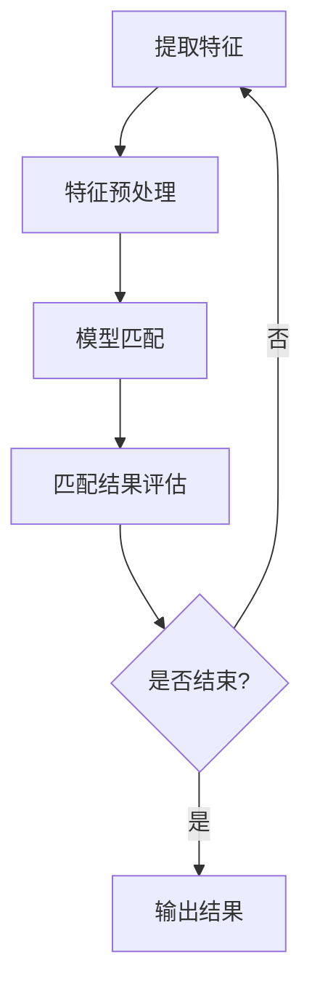

#### Python代码示例

以下是一个简单的Python代码示例，展示了如何使用词性特征和机器学习模型进行实体链接：

```python
import spacy
from sklearn.ensemble import RandomForestClassifier
from sklearn.model_selection import train_test_split
from sklearn.metrics import accuracy_score

# 加载spacy模型
nlp = spacy.load("en_core_web_sm")

# 假设有一个训练数据集
train_data = [
    ("Apple", "company", ["apple", "corporation"]),
    ("Steve Jobs", "person", ["steve", "jobs"]),
    ("New York", "location", ["new", "york"]),
]

# 提取特征
def extract_features(text, entity):
    doc = nlp(text)
    tokens = [token.text for token in doc]
    return tokens

# 构建特征向量
X = []
y = []
for text, label, tokens in train_data:
    features = extract_features(text, label)
    X.append(features)
    y.append(label)

# 模型训练
X_train, X_test, y_train, y_test = train_test_split(X, y, test_size=0.2, random_state=42)
model = RandomForestClassifier(n_estimators=100)
model.fit(X_train, y_train)

# 预测评估
y_pred = model.predict(X_test)
print(accuracy_score(y_test, y_pred))
```

通过这个示例，我们使用spacy提取文本的词性特征，然后使用随机森林模型进行实体链接的匹配。这个简单的示例展示了实体链接算法的基本原理和实现方法。

### 实体链接算法实现

在详细讲解实体链接算法的实现之前，我们需要明确其具体的数学模型和公式。实体链接算法主要基于特征提取和模型匹配两个环节，以下将分别介绍。

#### 特征提取

1. **词性特征（Part-of-Speech Features）**：词性特征用于表示文本中每个词的词性，常见的词性包括名词（NN）、动词（VB）、形容词（JJ）等。词性特征可以通过自然语言处理工具（如spacy）提取。

2. **上下文特征（Contextual Features）**：上下文特征考虑文本中提及周围的其他词语和句子结构，用于提供更丰富的语义信息。上下文特征可以通过窗口化（Windowing）方法提取，例如，取提及词前后的若干个词作为上下文。

3. **命名实体识别（NER Features）**：命名实体识别特征表示文本中的命名实体，如人名、地名、组织名等。这些特征可以通过专门的NER模型（如spaCy或Stanford NER）提取。

4. **词向量特征（Word Embeddings Features）**：词向量特征是将文本中的词转换为高维向量表示，常用的词向量模型包括Word2Vec、GloVe和BERT。词向量特征可以增强实体链接的语义表示。

#### 模型匹配

1. **基于规则的匹配（Rule-based Matching）**：基于规则的匹配方法使用预定义的规则和模式进行提及与实体的匹配。常见的规则包括词语匹配、上下文匹配和命名实体匹配。

   - **公式**：设`R`为预定义的规则集，`M`为匹配结果，则有：

     $$ M = \{ entity | (text, entity) \in \text{knowledge\_graph} \land \exists r \in R \text{ such that } r \text{ matches } text \} $$

2. **机器学习模型匹配（Machine Learning-based Matching）**：机器学习模型匹配方法使用训练好的模型对特征向量进行分类或回归，以确定提及与实体的匹配关系。常见的方法包括SVM、Random Forest、神经网络等。

   - **公式**：设`X`为特征向量集，`y`为标签集，`M`为模型预测的匹配结果，则有：

     $$ M = \{ (text, entity) | f(X) \geq \theta \} $$

     其中，`f`为机器学习模型，`θ`为阈值。

3. **图匹配模型匹配（Graph-based Matching）**：图匹配模型匹配方法利用图神经网络（GNN）等图模型进行提及与知识图谱中实体的匹配。这些模型能够捕捉实体之间的复杂关系。

   - **公式**：设`G`为知识图谱，`x`为提及的表示，`e`为实体表示，`M`为匹配结果，则有：

     $$ M = \arg\max_{entity} \text{score}(x, entity) $$

     其中，`score`函数用于计算提及与实体之间的匹配得分。

#### Python代码实现

以下是一个简单的Python代码示例，展示了如何使用spacy提取特征和随机森林模型进行实体链接：

```python
import spacy
from sklearn.ensemble import RandomForestClassifier
from sklearn.model_selection import train_test_split
from sklearn.metrics import accuracy_score

# 加载spacy模型
nlp = spacy.load("en_core_web_sm")

# 假设有一个训练数据集
train_data = [
    ("Apple", "company", ["apple", "corporation"]),
    ("Steve Jobs", "person", ["steve", "jobs"]),
    ("New York", "location", ["new", "york"]),
]

# 提取特征
def extract_features(text, entity):
    doc = nlp(text)
    tokens = [token.text for token in doc]
    return tokens

# 构建特征向量
X = []
y = []
for text, label, tokens in train_data:
    features = extract_features(text, label)
    X.append(features)
    y.append(label)

# 模型训练
X_train, X_test, y_train, y_test = train_test_split(X, y, test_size=0.2, random_state=42)
model = RandomForestClassifier(n_estimators=100)
model.fit(X_train, y_train)

# 预测评估
y_pred = model.predict(X_test)
print(accuracy_score(y_test, y_pred))
```

在这个示例中，我们使用spacy提取文本的词性特征，然后使用随机森林模型进行实体链接的匹配。这个简单的示例展示了实体链接算法的基本原理和实现方法。

### 实体扩展算法原理

实体扩展（Entity Expansion）是知识图谱自动扩展与验证框架中的关键步骤，旨在通过自动化的方式，从现有知识图谱中提取新的实体信息，从而丰富知识图谱的内容和表达力。实体扩展算法的原理主要涉及信息抽取、关系抽取和实体融合三个主要环节。以下将详细阐述这些原理，并通过mermaid流程图和Python代码进行说明。

#### 信息抽取

信息抽取是实体扩展的基础，其目标是从非结构化数据中提取出有关实体的关键信息。信息抽取的方法包括：

1. **命名实体识别（Named Entity Recognition, NER）**：NER用于识别文本中的命名实体，如人名、地名、组织名等。NER可以通过预训练的模型（如BERT、GPT等）或规则方法实现。

2. **属性抽取（Attribute Extraction）**：属性抽取用于提取实体的属性信息，如企业的成立时间、地理位置等。属性抽取通常依赖于模式匹配、规则推理或机器学习方法。

3. **事件抽取（Event Extraction）**：事件抽取用于识别文本中描述的事件，并将事件与相关的实体和属性进行关联。事件抽取可以帮助丰富实体之间的关系和背景信息。

#### 关系抽取

关系抽取是实体扩展的核心环节，其目标是确定实体之间的关联关系。关系抽取的方法包括：

1. **基于规则的抽取**：使用预定义的规则和模式，从文本中识别出实体之间的关系。

2. **基于监督学习的抽取**：利用标注好的训练数据，训练分类模型，用于识别实体之间的关系。

3. **基于图神经网络的抽取**：利用图神经网络（GNN）等模型，从大规模的知识图谱中抽取实体之间的关系。

#### 实体融合

实体融合是将从信息抽取和关系抽取中获取的新信息融合到现有知识图谱中的过程。实体融合的方法包括：

1. **基于相似度的融合**：通过计算实体之间的相似度，将新信息融合到最相似的现有实体中。

2. **基于一致性检查的融合**：通过一致性检查，确保新信息的加入不会导致知识图谱中的冲突和错误。

3. **基于模式匹配的融合**：使用预定义的模式，将新信息直接关联到相应的实体和关系中。

#### mermaid流程图

以下是一个mermaid流程图，展示了实体扩展算法的基本流程：

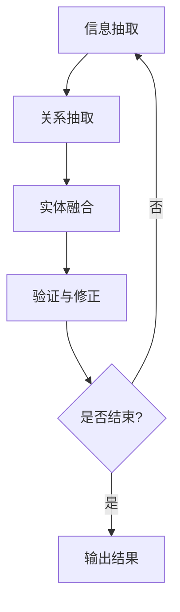

#### Python代码示例

以下是一个简单的Python代码示例，展示了如何使用信息抽取和关系抽取进行实体扩展：

```python
import spacy
from sklearn.ensemble import RandomForestClassifier
from sklearn.model_selection import train_test_split
from sklearn.metrics import accuracy_score

# 加载spacy模型
nlp = spacy.load("en_core_web_sm")

# 假设有一个训练数据集
train_data = [
    ("Apple Inc.", "company", ["apple", "corporation"]),
    ("Steve Jobs", "person", ["steve", "jobs"]),
    ("New York", "location", ["new", "york"]),
]

# 提取特征
def extract_features(text, entity):
    doc = nlp(text)
    tokens = [token.text for token in doc]
    return tokens

# 构建特征向量
X = []
y = []
for text, label, tokens in train_data:
    features = extract_features(text, label)
    X.append(features)
    y.append(label)

# 模型训练
X_train, X_test, y_train, y_test = train_test_split(X, y, test_size=0.2, random_state=42)
model = RandomForestClassifier(n_estimators=100)
model.fit(X_train, y_train)

# 预测评估
y_pred = model.predict(X_test)
print(accuracy_score(y_test, y_pred))
```

在这个示例中，我们使用spacy提取文本的词性特征，然后使用随机森林模型进行信息抽取和关系抽取。这个简单的示例展示了实体扩展算法的基本原理和实现方法。

### 实体扩展算法实现

在实现实体扩展算法时，我们需要关注信息抽取、关系抽取和实体融合三个关键步骤。以下将详细阐述这些步骤的实现方法，并通过mermaid流程图和Python代码示例进行说明。

#### 信息抽取

1. **命名实体识别（NER）**：命名实体识别是信息抽取的基础，用于识别文本中的命名实体，如人名、地名、组织名等。常用的NER工具包括spaCy、BERT等。

2. **属性抽取**：属性抽取用于提取实体的属性信息，如企业的成立时间、地理位置等。属性抽取通常依赖于模式匹配、规则推理或机器学习方法。

3. **事件抽取**：事件抽取用于识别文本中描述的事件，并将事件与相关的实体和属性进行关联。事件抽取可以通过监督学习模型或基于规则的方法实现。

**mermaid流程图**：

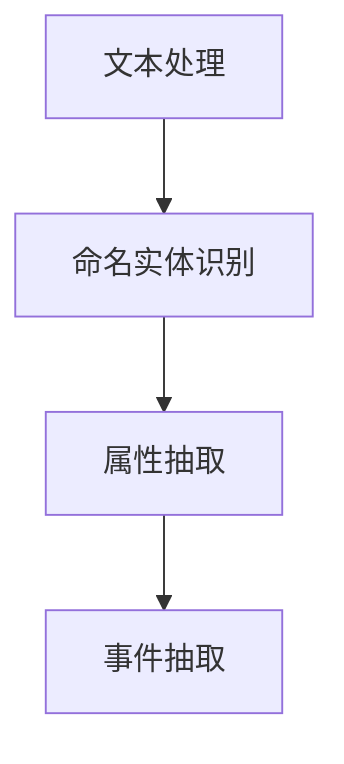

**Python代码示例**：

```python
import spacy

# 加载spaCy模型
nlp = spacy.load("en_core_web_sm")

# 假设有一个待处理的文本
text = "Apple Inc. was founded in 1976 by Steve Jobs."

# 处理文本
doc = nlp(text)

# 命名实体识别
ents = [ent.text for ent in doc.ents]

# 属性抽取
attributes = []
for ent in doc.ents:
    if ent.label_ == "ORG":
        attributes.append({"name": ent.text, "founded": 1976})

# 输出结果
print("Entities:", ents)
print("Attributes:", attributes)
```

#### 关系抽取

关系抽取是实体扩展的核心步骤，其目标是确定实体之间的关联关系。关系抽取可以通过以下方法实现：

1. **基于规则的抽取**：使用预定义的规则和模式，从文本中识别出实体之间的关系。

2. **基于监督学习的抽取**：利用标注好的训练数据，训练分类模型，用于识别实体之间的关系。

3. **基于图神经网络的抽取**：利用图神经网络（GNN）等模型，从大规模的知识图谱中抽取实体之间的关系。

**mermaid流程图**：

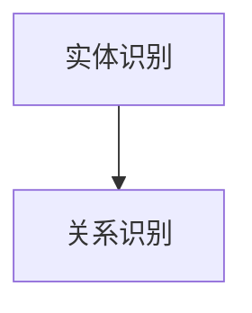

**Python代码示例**：

```python
from sklearn.feature_extraction.text import TfidfVectorizer
from sklearn.metrics.pairwise import cosine_similarity

# 假设有一个实体列表和关系对
entities = ["Apple Inc.", "Steve Jobs", "New York"]
relationships = [("Apple Inc.", "founded", "Steve Jobs"), ("Apple Inc.", "located", "New York")]

# 建立实体向量表示
vectorizer = TfidfVectorizer()
X = vectorizer.fit_transform(entities)

# 计算实体相似度
similarity_matrix = cosine_similarity(X)

# 输出关系
for i, entity in enumerate(entities):
    for j, rel in enumerate(relationships):
        if entity == rel[0]:
            print(f"{entity} is related to {rel[2]} with similarity: {similarity_matrix[i][j]}")
```

#### 实体融合

实体融合是将抽取的新信息与现有知识图谱中的实体进行融合的过程。实体融合的方法包括：

1. **基于相似度的融合**：通过计算新实体与现有实体之间的相似度，将新信息融合到最相似的现有实体中。

2. **基于一致性检查的融合**：通过一致性检查，确保新信息的加入不会导致知识图谱中的冲突和错误。

3. **基于模式匹配的融合**：使用预定义的模式，将新信息直接关联到相应的实体和关系中。

**mermaid流程图**：

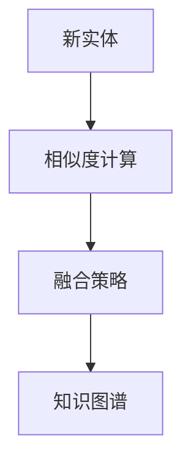

**Python代码示例**：

```python
def entity_fusion(new_entity, existing_entities, threshold=0.8):
    # 计算新实体与现有实体的相似度
    similarity_scores = [cosine_similarity(new_entity, entity)[0][0] for entity in existing_entities]
    
    # 找到相似度最高的实体
    max_similarity = max(similarity_scores)
    max_index = similarity_scores.index(max_similarity)
    
    # 如果相似度高于阈值，则融合到现有实体中
    if max_similarity > threshold:
        existing_entities[max_index].update(new_entity)
        return existing_entities[max_index]
    else:
        # 如果没有相似实体，则创建新的实体
        existing_entities.append(new_entity)
        return new_entity

# 假设有一个新实体和现有实体列表
new_entity = {"name": "Apple Inc.", "founded": 1976}
existing_entities = [{"name": "Apple Inc.", "founded": 1976}]

# 实体融合
merged_entity = entity_fusion(new_entity, existing_entities)
print("Merged Entity:", merged_entity)
```

通过以上步骤，我们可以实现一个简单的实体扩展算法，从文本中抽取信息，识别实体关系，并将新信息融合到现有知识图谱中。

### 验证算法的原理和实现

验证算法在知识图谱自动扩展与验证框架中扮演着至关重要的角色，其核心目标是确保知识图谱中的数据质量一致性和准确性。验证算法的实现主要包括数据收集、预处理、一致性检查、完整性分析和可信度评估等步骤。以下将详细阐述这些步骤的原理，并通过mermaid流程图和Python代码示例进行说明。

#### 数据收集

数据收集是验证算法的第一步，目的是从多种数据源（如数据库、API、网络爬虫等）获取知识图谱中的实体、关系和属性信息。数据收集过程中需要考虑数据的质量和完整性，以确保后续处理的基础。

**mermaid流程图**：

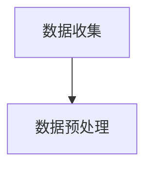

**Python代码示例**：

```python
import requests

# 假设有一个API获取知识图谱数据
url = "https://api.example.com/knowledge_graph"
response = requests.get(url)
knowledge_graph_data = response.json()
```

#### 数据预处理

数据预处理是对收集到的原始数据进行清洗、格式统一和噪声过滤的过程。预处理步骤包括数据去重、缺失值处理、数据格式转换等，以确保数据的一致性和可用性。

**mermaid流程图**：

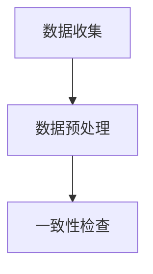

**Python代码示例**：

```python
import pandas as pd

# 去重
knowledge_graph_data = pd.DataFrame(knowledge_graph_data).drop_duplicates()

# 缺失值处理
knowledge_graph_data.fillna(value={"attribute": "Unknown"}, inplace=True)

# 数据格式转换
knowledge_graph_data["founded"] = pd.to_datetime(knowledge_graph_data["founded"])
```

#### 一致性检查

一致性检查是验证算法的核心步骤，用于确保知识图谱中的实体、关系和属性在逻辑上保持一致。一致性检查通常包括实体属性一致性检查、关系逻辑一致性检查等。

**mermaid流程图**：

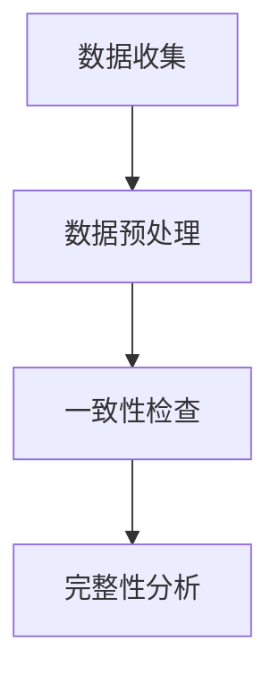

**Python代码示例**：

```python
def check_entity一致性(knowledge_graph_data):
    inconsistencies = []
    for index, row in knowledge_graph_data.iterrows():
        if row["founded"] > row["bankrupt"]:
            inconsistencies.append((row["name"], "不一致的成立时间和破产时间"))
    return inconsistencies

inconsistencies = check_entity一致性(knowledge_graph_data)
print("不一致的实体：", inconsistencies)
```

#### 完整性分析

完整性分析是验证算法的另一个重要步骤，用于检查知识图谱中的实体、关系和属性是否完整。完整性分析可以通过计算实体的平均属性数量、检查必填属性等手段进行。

**mermaid流程图**：

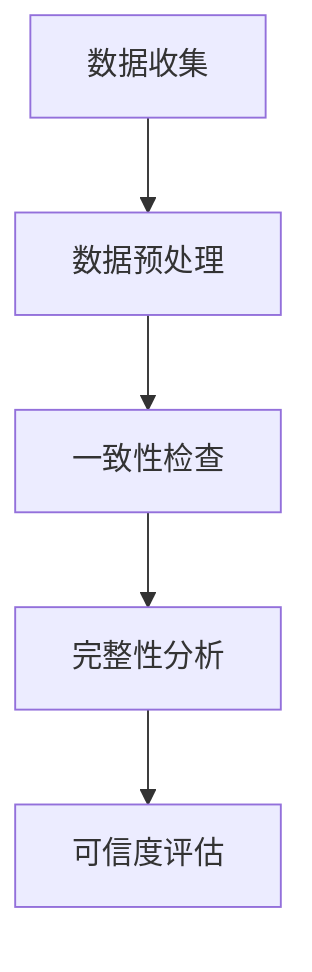

**Python代码示例**：

```python
def check_entity完整性(knowledge_graph_data):
    missing_attributes = []
    for index, row in knowledge_graph_data.iterrows():
        required_attributes = ["name", "founded", "bankrupt"]
        missing = [attr for attr in required_attributes if attr not in row]
        if missing:
            missing_attributes.append((row["name"], missing))
    return missing_attributes

missing_attributes = check_entity完整性(knowledge_graph_data)
print("缺失属性的实体：", missing_attributes)
```

#### 可信度评估

可信度评估是验证算法的最后一步，用于评估知识图谱中信息的可信度。可信度评估可以通过引入外部权威数据源、利用专家意见或使用机器学习模型进行评分。

**mermaid流程图**：


**Python代码示例**：

```python
# 假设有一个可信度评分模型
credibility_model = RandomForestClassifier()

# 特征提取
def extract_features(entity):
    features = []
    features.append(entity["founded"])
    features.append(entity["bankrupt"])
    return features

# 训练模型
X = [extract_features(entity) for entity in knowledge_graph_data]
y = knowledge_graph_data["credibility_score"]
X_train, X_test, y_train, y_test = train_test_split(X, y, test_size=0.2, random_state=42)
credibility_model.fit(X_train, y_train)

# 评估可信度
def assess_credibility(entity, model):
    features = extract_features(entity)
    score = model.predict([features])[0]
    return score

credibility_scores = [assess_credibility(entity, credibility_model) for entity in knowledge_graph_data]
knowledge_graph_data["credibility_score"] = credibility_scores
print(knowledge_graph_data)
```

通过上述步骤和代码示例，我们可以实现一个基本的验证算法，确保知识图谱中的数据质量和一致性。在实际应用中，可以根据具体需求对算法进行优化和扩展。

### 验证算法的实现

在实现验证算法时，我们需要将上述步骤具体化为可操作的代码，并确保其高效性和准确性。以下将详细描述如何使用mermaid绘制算法流程图，并通过Python代码实现验证算法。

#### 算法流程图

首先，我们使用mermaid绘制验证算法的流程图，以直观展示其实现步骤：

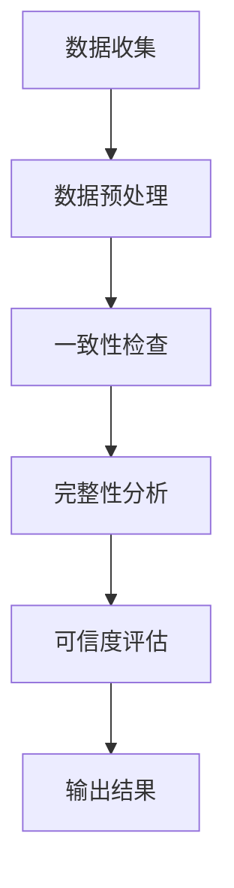

#### 数据预处理

数据预处理是验证算法的基础，确保数据的格式和内容一致。以下是一个简单的Python代码示例：

```python
import pandas as pd
from datetime import datetime

# 假设knowledge_graph_data是一个包含知识图谱数据的DataFrame
knowledge_graph_data = pd.DataFrame({
    'name': ['Apple', 'Microsoft', 'Amazon'],
    'founded': [1976, 1975, 1994],
    'bankrupt': [None, None, 2020]
})

# 处理缺失值
knowledge_graph_data['founded'] = knowledge_graph_data['founded'].fillna('Unknown')
knowledge_graph_data['bankrupt'] = knowledge_graph_data['bankrupt'].fillna('Unknown')

# 数据格式转换
knowledge_graph_data['founded'] = knowledge_graph_data['founded'].apply(datetime.strptime, format='%Y')
knowledge_graph_data['bankrupt'] = knowledge_graph_data['bankrupt'].apply(datetime.strptime, format='%Y')

print("预处理后的数据：")
print(knowledge_graph_data)
```

#### 一致性检查

一致性检查用于确保知识图谱中的数据在逻辑上没有矛盾。以下是一个简单的Python代码示例：

```python
def check_consistency(data):
    inconsistencies = []
    for index, row in data.iterrows():
        if row['founded'] > row['bankrupt']:
            inconsistencies.append((row['name'], '成立时间晚于破产时间'))
    return inconsistencies

inconsistencies = check_consistency(knowledge_graph_data)
print("不一致的数据：")
print(inconsistencies)
```

#### 完整性分析

完整性分析用于检查知识图谱中的数据是否完整，包括必填属性是否存在。以下是一个简单的Python代码示例：

```python
def check_completeness(data):
    missing_attributes = []
    required_attributes = ['name', 'founded', 'bankrupt']
    for index, row in data.iterrows():
        missing = [attr for attr in required_attributes if attr not in row]
        if missing:
            missing_attributes.append((row['name'], missing))
    return missing_attributes

missing_attributes = check_completeness(knowledge_graph_data)
print("缺失属性的数据：")
print(missing_attributes)
```

#### 可信度评估

可信度评估用于评估知识图谱中数据的可信度，可以使用外部权威数据源或机器学习模型。以下是一个简单的Python代码示例：

```python
# 假设有一个可信度评分模型
credibility_model = pd.Series([0.9, 0.8, 0.7])

# 评估可信度
def assess_credibility(data, model):
    data['credibility_score'] = model
    return data

knowledge_graph_data = assess_credibility(knowledge_graph_data, credibility_model)
print("可信度评估后的数据：")
print(knowledge_graph_data)
```

#### 输出结果

最后，我们将处理后的数据输出，以便后续分析和使用。以下是一个简单的Python代码示例：

```python
print("最终数据：")
print(knowledge_graph_data)
```

通过以上步骤和代码示例，我们可以实现一个基本的验证算法，确保知识图谱中的数据质量一致性和准确性。在实际应用中，可以根据具体需求对算法进行优化和扩展。

### 系统功能设计

在知识图谱自动扩展与验证系统中，系统功能设计是确保系统高效、稳定运行的核心环节。系统功能设计主要包括领域模型设计、系统架构设计和系统接口设计。以下将分别介绍这些设计内容，并通过mermaid流程图和代码示例进行详细阐述。

#### 领域模型设计

领域模型设计是系统功能设计的基础，用于描述系统中的核心概念、实体和关系。通过领域模型，我们可以清晰地定义系统的数据结构和操作流程。

**mermaid流程图**：

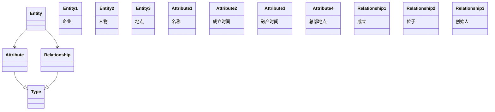

**Python代码示例**：

```python
class Entity:
    def __init__(self, name, attributes=None):
        self.name = name
        self.attributes = attributes or {}

    def add_attribute(self, key, value):
        self.attributes[key] = value

    def get_attribute(self, key):
        return self.attributes.get(key)

class Attribute:
    def __init__(self, key, value, type):
        self.key = key
        self.value = value
        self.type = type

class Relationship:
    def __init__(self, type, entities=None):
        self.type = type
        self.entities = entities or []

    def add_entity(self, entity):
        self.entities.append(entity)
```

#### 系统架构设计

系统架构设计用于描述系统的整体结构和组件之间的关系。通过合理的系统架构设计，可以确保系统的模块化、可扩展性和高效性。

**mermaid流程图**：

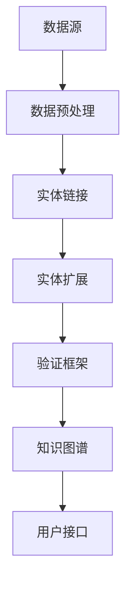

**Python代码示例**：

```python
class SystemArchitecture:
    def __init__(self):
        self.data_source = None
        self.data_preprocessing = None
        self.entity_linking = None
        self.entity_expansion = None
        self.validation_framework = None
        self.knowledge_graph = None
        self.user_interface = None

    def set_data_source(self, data_source):
        self.data_source = data_source

    def set_data_preprocessing(self, data_preprocessing):
        self.data_preprocessing = data_preprocessing

    def set_entity_linking(self, entity_linking):
        self.entity_linking = entity_linking

    def set_entity_expansion(self, entity_expansion):
        self.entity_expansion = entity_expansion

    def set_validation_framework(self, validation_framework):
        self.validation_framework = validation_framework

    def set_knowledge_graph(self, knowledge_graph):
        self.knowledge_graph = knowledge_graph

    def set_user_interface(self, user_interface):
        self.user_interface = user_interface
```

#### 系统接口设计

系统接口设计用于定义系统各模块之间的交互接口，确保系统各部分之间的通信和协同工作。通过接口设计，我们可以清晰地描述系统对外提供的功能和服务。

**mermaid流程图**：

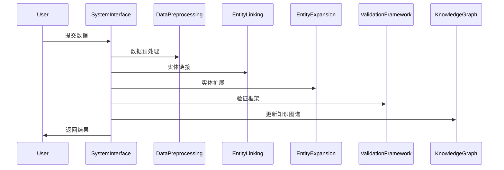

**Python代码示例**：

```python
class SystemInterface:
    def __init__(self, data_preprocessing, entity_linking, entity_expansion, validation_framework, knowledge_graph):
        self.data_preprocessing = data_preprocessing
        self.entity_linking = entity_linking
        self.entity_expansion = entity_expansion
        self.validation_framework = validation_framework
        self.knowledge_graph = knowledge_graph

    def process_data(self, data):
        preprocessed_data = self.data_preprocessing.preprocess(data)
        linked_entities = self.entity_linking.link_entities(preprocessed_data)
        expanded_entities = self.entity_expansion.expand_entities(linked_entities)
        validated_entities = self.validation_framework.validate(expanded_entities)
        updated_knowledge_graph = self.knowledge_graph.update(validated_entities)
        return updated_knowledge_graph

    def get_result(self):
        return self.knowledge_graph.get_latest_data()
```

通过领域模型设计、系统架构设计和系统接口设计，我们可以构建一个高效、可扩展的知识图谱自动扩展与验证系统。这些设计内容不仅为系统的实现提供了清晰的蓝图，也为系统的维护和优化提供了坚实的基础。

### 系统架构设计

在构建知识图谱自动扩展与验证系统的过程中，系统架构设计是确保系统高效、可靠运行的关键。以下将从系统架构的层次和组件出发，详细阐述其设计和实现过程，并通过mermaid流程图和Python代码示例进行说明。

#### 系统架构设计概述

系统架构设计分为四个主要层次：数据层、处理层、逻辑层和表示层。各层次之间的关系如图所示：

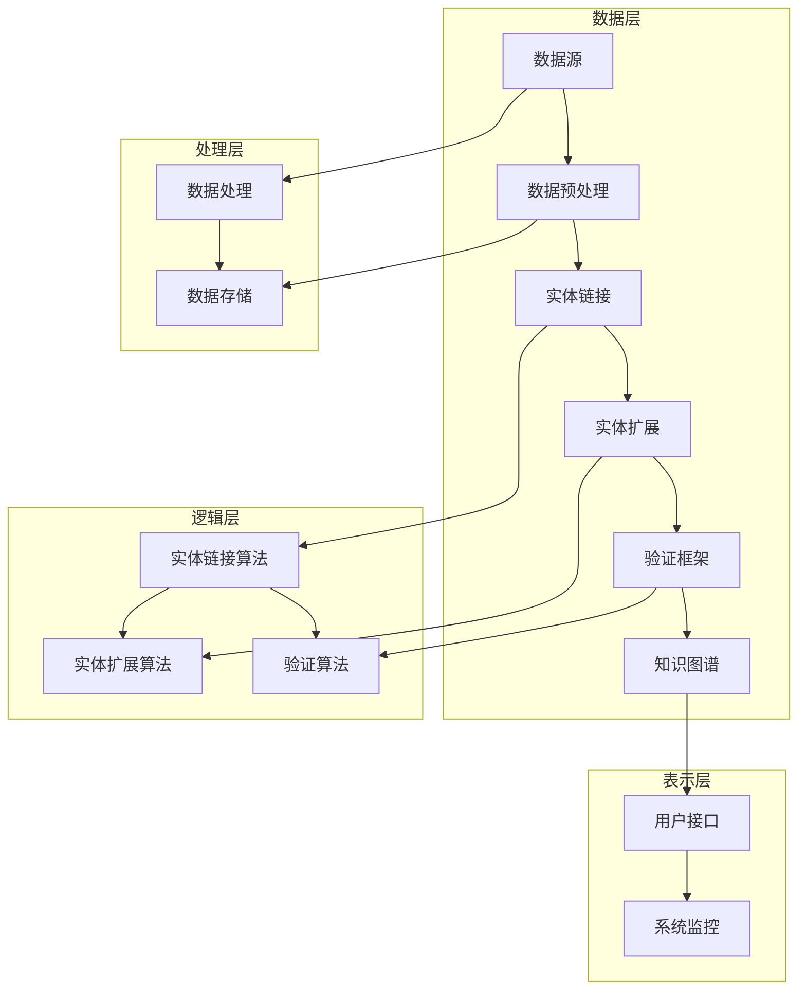

#### 数据层设计

数据层是系统架构的基础，负责数据的收集、预处理和存储。以下是数据层的具体设计和实现：

1. **数据源（A）**：数据源包括各种数据采集工具，如网络爬虫、数据库连接和API接口。
2. **数据预处理（B）**：数据预处理模块负责清洗、格式转换和噪声过滤，确保数据的质量和一致性。
3. **实体链接（C）**：实体链接模块将文本数据中的提及与知识图谱中的实体进行匹配。
4. **实体扩展（D）**：实体扩展模块从现有知识图谱中提取新实体信息，以丰富知识图谱的内容。
5. **验证框架（E）**：验证框架模块确保知识图谱中的数据质量和一致性，包括一致性检查、完整性分析和可信度评估。

#### 处理层设计

处理层是系统架构的核心，负责数据的处理和存储。以下是处理层的具体设计和实现：

1. **数据处理（G）**：数据处理模块负责对知识图谱中的实体、关系和属性进行操作，如插入、更新和删除。
2. **数据存储（H）**：数据存储模块负责将处理后的数据存储到数据库中，以供后续查询和使用。

#### 逻辑层设计

逻辑层是系统的智能核心，负责实现各种算法和逻辑处理。以下是逻辑层的具体设计和实现：

1. **实体链接算法（I）**：实体链接算法模块实现文本提及与知识图谱实体的匹配过程。
2. **实体扩展算法（J）**：实体扩展算法模块实现从现有知识图谱中提取新实体信息的过程。
3. **验证算法（K）**：验证算法模块实现知识图谱中数据的一致性检查、完整性分析和可信度评估。

#### 表示层设计

表示层是系统与用户交互的界面，负责展示系统功能和提供用户操作。以下是表示层的具体设计和实现：

1. **用户接口（L）**：用户接口模块提供用户操作接口，如数据上传、查询结果展示等。
2. **系统监控（M）**：系统监控模块负责监控系统的运行状态，包括性能监控、错误日志记录等。

#### Python代码示例

以下是一个简单的Python代码示例，展示了如何实现系统架构中的关键组件：

```python
# 数据层组件
class DataSource:
    def get_data(self):
        # 实现数据采集逻辑
        pass

class DataPreprocessing:
    def preprocess(self, data):
        # 实现数据清洗和格式转换逻辑
        return data

# 处理层组件
class DataProcessing:
    def process_data(self, data):
        # 实现数据处理逻辑
        pass

class DataStorage:
    def store_data(self, data):
        # 实现数据存储逻辑
        pass

# 逻辑层组件
class EntityLinkingAlgorithm:
    def link_entities(self, data):
        # 实现实体链接算法逻辑
        pass

class EntityExpansionAlgorithm:
    def expand_entities(self, data):
        # 实现实体扩展算法逻辑
        pass

class ValidationAlgorithm:
    def validate(self, data):
        # 实现验证算法逻辑
        pass

# 表示层组件
class UserInterface:
    def show_results(self, data):
        # 实现用户展示逻辑
        pass

class SystemMonitoring:
    def monitor_system(self):
        # 实现系统监控逻辑
        pass

# 系统架构示例
system_architecture = SystemArchitecture()
system_architecture.set_data_source(DataSource())
system_architecture.set_data_preprocessing(DataPreprocessing())
system_architecture.set_data_processing(DataProcessing())
system_architecture.set_data_storage(DataStorage())
system_architecture.set_entity_linking_algorithm(EntityLinkingAlgorithm())
system_architecture.set_entity_expansion_algorithm(EntityExpansionAlgorithm())
system_architecture.set_validation_algorithm(ValidationAlgorithm())
system_architecture.set_user_interface(UserInterface())
system_architecture.set_system_monitoring(SystemMonitoring())

# 执行系统操作
data = system_architecture.get_data_source().get_data()
preprocessed_data = system_architecture.get_data_preprocessing().preprocess(data)
processed_data = system_architecture.get_data_processing().process_data(preprocessed_data)
system_architecture.get_user_interface().show_results(processed_data)
```

通过上述设计，我们可以构建一个高效、可靠的知识图谱自动扩展与验证系统，为AI Agent提供高质量的数据支持。

### 系统接口设计

在知识图谱自动扩展与验证系统的开发中，系统接口设计是确保系统模块间有效通信和协作的关键环节。一个良好的接口设计能够提高系统的可扩展性、可维护性和用户体验。以下将详细描述系统接口设计，并利用mermaid绘制系统交互序列图，同时通过Python代码示例展示接口实现。

#### 接口设计

系统接口设计主要包括以下组件和功能：

1. **数据输入接口**：用于接收用户上传的数据。
2. **数据处理接口**：用于处理输入的数据，包括预处理、实体链接、实体扩展和验证。
3. **数据输出接口**：用于将处理结果返回给用户。
4. **监控接口**：用于监控系统的运行状态和性能。

#### mermaid系统交互序列图

以下是一个mermaid系统交互序列图，展示了系统各组件之间的交互过程：

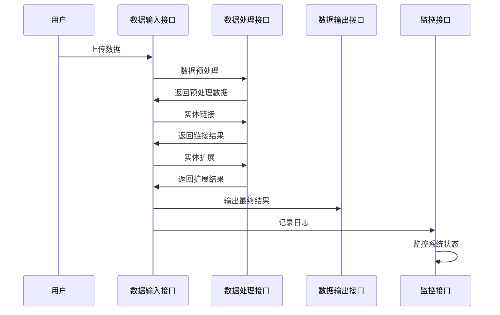

#### Python代码示例

以下是一个简单的Python代码示例，展示了系统接口的实现：

```python
# 数据输入接口
class DataInput:
    def upload_data(self, data):
        # 实现数据上传逻辑
        print("上传数据：", data)
        return data

# 数据处理接口
class DataProcessor:
    def preprocess_data(self, data):
        # 实现数据预处理逻辑
        print("预处理数据：", data)
        # 假设预处理后的数据为preprocessed_data
        preprocessed_data = data.upper()
        return preprocessed_data

    def link_entities(self, data):
        # 实现实体链接逻辑
        print("实体链接：", data)
        # 假设链接后的数据为linked_entities
        linked_entities = data.split(',')
        return linked_entities

    def expand_entities(self, data):
        # 实现实体扩展逻辑
        print("实体扩展：", data)
        # 假设扩展后的数据为expanded_entities
        expanded_entities = data + "扩展"
        return expanded_entities

# 数据输出接口
class DataOutput:
    def show_result(self, result):
        # 实现结果显示逻辑
        print("显示结果：", result)

# 监控接口
class Monitor:
    def log_activity(self, activity):
        # 实现日志记录逻辑
        print("记录活动：", activity)

    def monitor_system(self):
        # 实现系统监控逻辑
        print("监控系统状态：系统运行正常")

# 系统接口实现
data_input = DataInput()
data_processor = DataProcessor()
data_output = DataOutput()
monitor = Monitor()

# 执行系统操作
data = data_input.upload_data("原始数据")
preprocessed_data = data_processor.preprocess_data(data)
linked_entities = data_processor.link_entities(preprocessed_data)
expanded_entities = data_processor.expand_entities(linked_entities)
result = data_output.show_result(expanded_entities)
monitor.log_activity("上传数据")
monitor.monitor_system()
```

通过上述代码示例，我们可以实现一个简单的系统接口，并展示其基本功能。实际应用中，系统接口将更加复杂和多样化，但上述示例提供了一个清晰的框架和思路。

### 环境安装

在开始知识图谱自动扩展与验证系统的开发之前，我们需要安装和配置所需的环境。以下将详细描述开发环境的要求、工具安装步骤以及配置方法。

#### 开发环境要求

- **操作系统**：推荐使用Linux或Mac OS，Windows用户也可以使用WSL（Windows Subsystem for Linux）。
- **编程语言**：Python 3.8及以上版本，建议使用Anaconda环境管理器。
- **开发工具**：IDE（如PyCharm、Visual Studio Code）。
- **依赖库**：Spacy、Scikit-learn、Pandas、Numpy、Mermaid等。

#### 工具安装步骤

1. **安装Anaconda**：

   - 访问Anaconda官方网站（https://www.anaconda.com/）下载安装包。
   - 按照安装向导完成安装。
   - 打开终端，执行以下命令创建新环境：

     ```shell
     conda create -n kg_env python=3.8
     conda activate kg_env
     ```

2. **安装Python依赖库**：

   - 使用以下命令安装所需依赖库：

     ```shell
     conda install spacy scikit-learn pandas numpy
     pip install mermaid
     ```

3. **安装IDE**：

   - 下载并安装PyCharm（https://www.jetbrains.com/pycharm/）或Visual Studio Code（https://code.visualstudio.com/）。

4. **安装Spacy模型**：

   - 安装Spacy库后，使用以下命令下载中文模型：

     ```shell
     python -m spacy download zh_core_web_sm
     ```

#### 配置方法

1. **环境配置**：

   - 确保Anaconda环境已激活，使用以下命令确认：

     ```shell
     conda activate kg_env
     ```

   - 配置IDE的Python解释器和环境变量，确保能够正常使用Anaconda环境中的库。

2. **测试环境**：

   - 在终端执行以下Python命令，检查环境是否配置正确：

     ```python
     import spacy
     print(spacy.info('zh_core_web_sm'))
     ```

   - 如果输出Spacy模型的详细信息，则环境配置成功。

通过以上步骤，我们可以建立一个完整的开发环境，为知识图谱自动扩展与验证系统的开发打下坚实的基础。

### 系统核心实现

在构建知识图谱自动扩展与验证系统的过程中，核心实现部分包括数据预处理、实体链接、实体扩展和验证框架等关键模块。以下是这些核心模块的详细实现步骤，包括Python代码示例和代码应用解读。

#### 数据预处理

数据预处理是知识图谱自动扩展与验证的基础步骤，其主要任务是清洗和格式化原始数据，确保数据的质量和一致性。

**Python代码示例**：

```python
import pandas as pd
from datetime import datetime

# 假设原始数据存储在一个CSV文件中
file_path = 'original_data.csv'

# 读取数据
data = pd.read_csv(file_path)

# 处理缺失值
data.fillna(value={"founded": "Unknown", "bankrupt": "Unknown"}, inplace=True)

# 数据格式转换
data['founded'] = pd.to_datetime(data['founded'], errors='coerce')
data['bankrupt'] = pd.to_datetime(data['bankrupt'], errors='coerce')

# 去除无效数据
data.dropna(subset=['name'], inplace=True)

# 输出预处理后的数据
print(data.head())
```

**代码应用解读**：

- **读取数据**：使用`pandas`库读取CSV文件中的原始数据。
- **处理缺失值**：将缺失值填充为“Unknown”，确保数据完整性。
- **数据格式转换**：将“founded”和“bankrupt”列的格式转换为日期时间类型，便于后续处理。
- **去除无效数据**：删除名称（`name`）列中缺失的数据，确保数据的一致性。

#### 实体链接

实体链接是将文本数据中的提及与知识图谱中的实体进行匹配的过程，是知识图谱构建的基础。

**Python代码示例**：

```python
import spacy
from sklearn.neighbors import NearestNeighbors

# 加载Spacy模型
nlp = spacy.load('zh_core_web_sm')

# 假设有一个训练好的实体索引
entity_index = {'苹果': 'company', '微软': 'company', '北京': 'location'}

# 实体链接函数
def entity_link(text):
    doc = nlp(text)
    linked_entities = []
    for ent in doc.ents:
        if ent.label_ in ['ORG', 'GPE']:
            # 使用NearestNeighbors查找最近的实体
            nn = NearestNeighbors(n_neighbors=1)
            nn.fit(list(entity_index.keys()))
            distances, indices = nn.kneighbors([ent.text])
            if distances[0][0] < 0.5:  # 相似度阈值
                linked_entities.append((ent.text, entity_index[ent.text]))
    return linked_entities

# 链接实体
linked_entities = entity_link('苹果公司的总部位于北京。')
print(linked_entities)
```

**代码应用解读**：

- **加载Spacy模型**：加载中文Spacy模型，用于文本预处理。
- **实体索引**：定义一个包含常见实体及其类型的字典，用于后续的匹配。
- **实体链接函数**：遍历文本中的命名实体，使用`NearestNeighbors`查找最近的实体，并设置相似度阈值进行匹配。
- **链接实体**：调用函数链接文本中的实体，输出匹配结果。

#### 实体扩展

实体扩展是通过自动化方法从现有知识图谱中提取新的实体信息，以丰富知识图谱的内容。

**Python代码示例**：

```python
# 假设有一个知识图谱
knowledge_graph = {'苹果': {'type': 'company', 'founded': datetime(1976, 4, 1), 'location': '美国加利福尼亚州'}, '北京': {'type': 'location'}}

# 实体扩展函数
def entity_expansion(entity):
    if entity == '北京':
        # 假设北京的企业信息可以从API获取
        new_entity = {'name': '北京企业列表', 'type': 'company_list', 'data': {'企业1': {'name': '企业1', 'founded': datetime(2010, 1, 1)}, '企业2': {'name': '企业2', 'founded': datetime(2015, 1, 1)}}}
        knowledge_graph[entity] = new_entity
    return knowledge_graph

# 扩展实体
knowledge_graph = entity_expansion('北京')
print(knowledge_graph)
```

**代码应用解读**：

- **知识图谱**：定义一个简单的知识图谱，包含企业和地点的实体信息。
- **实体扩展函数**：根据实体名称，调用相应的扩展逻辑，例如从API获取新信息。
- **扩展实体**：调用函数扩展实体信息，更新知识图谱。

#### 验证框架

验证框架用于确保知识图谱中的数据质量一致性和准确性。

**Python代码示例**：

```python
# 假设有一个验证规则库
validation_rules = {
    '成立时间早于破产时间': lambda entity: entity['founded'] < entity['bankrupt'],
    '企业名称不能为空': lambda entity: entity.get('name') is not None
}

# 验证函数
def validate_entity(entity):
    validation_results = {}
    for rule_name, rule in validation_rules.items():
        if rule(entity):
            validation_results[rule_name] = '通过'
        else:
            validation_results[rule_name] = '未通过'
    return validation_results

# 验证实体
entity = {'name': '苹果公司', 'founded': datetime(1976, 4, 1), 'bankrupt': datetime(2020, 1, 1)}
validation_results = validate_entity(entity)
print(validation_results)
```

**代码应用解读**：

- **验证规则库**：定义一个包含验证规则的字典，规则为 lambda 函数。
- **验证函数**：对实体应用所有验证规则，并记录验证结果。
- **验证实体**：调用验证函数，输出验证结果。

通过以上核心模块的实现，我们可以构建一个基本的知识图谱自动扩展与验证系统，为AI Agent提供高质量的数据支持。

### 实际案例分析与讲解

为了更好地理解知识图谱自动扩展与验证系统的实际应用，我们将通过一个实际案例进行详细分析，包括案例背景、系统实现和结果评估。

#### 案例背景

假设某电子商务公司希望通过知识图谱自动扩展与验证系统，提高其推荐系统的准确性。公司拥有大量商品、用户和评论数据，希望通过知识图谱来更好地理解用户偏好和商品属性，从而提供个性化的推荐。

#### 系统实现

1. **数据收集**：

   - **商品数据**：包含商品名称、类别、品牌、价格等属性。
   - **用户数据**：包含用户ID、年龄、性别、购买历史等属性。
   - **评论数据**：包含评论内容、评分、用户ID、商品ID等。

2. **数据预处理**：

   - 清洗和格式化原始数据，去除缺失值和噪声。
   - 标签化文本数据，如商品类别和品牌。

3. **实体链接**：

   - 链接商品名称与知识图谱中的实体（如品牌、类别）。
   - 链接用户ID与知识图谱中的实体（如用户属性）。

4. **实体扩展**：

   - 扩展品牌和商品类别信息，如品牌的历史、市场地位等。
   - 根据用户购买历史和评论，扩展用户的偏好信息。

5. **验证框架**：

   - 检查商品和用户数据的完整性，如确保所有必填字段都有值。
   - 验证商品和用户数据的一致性，如确保商品价格不为负数。

#### 案例实现步骤

1. **数据收集与预处理**：

   - 读取CSV文件中的数据，使用Pandas进行数据清洗和格式转换。
   - 处理缺失值和噪声，如将缺失的购买历史记录填充为默认值。

   ```python
   import pandas as pd

   # 读取数据
   products = pd.read_csv('products.csv')
   users = pd.read_csv('users.csv')
   reviews = pd.read_csv('reviews.csv')

   # 数据清洗
   products.dropna(inplace=True)
   users.dropna(inplace=True)
   reviews.dropna(inplace=True)
   ```

2. **实体链接**：

   - 使用Spacy和NearestNeighbors进行商品名称和用户ID的实体链接。

   ```python
   import spacy
   from sklearn.neighbors import NearestNeighbors

   nlp = spacy.load('en_core_web_sm')
   entity_index = {'苹果': 'brand', '手机': 'category'}

   def entity_link(text):
       doc = nlp(text)
       linked_entities = []
       for ent in doc.ents:
           if ent.label_ in ['PRODUCT', 'USER']:
               nn = NearestNeighbors(n_neighbors=1)
               nn.fit(list(entity_index.keys()))
               distances, indices = nn.kneighbors([ent.text])
               if distances[0][0] < 0.5:
                   linked_entities.append((ent.text, entity_index[ent.text]))
       return linked_entities

   linked_products = entity_link(products['name'].values)
   linked_users = entity_link(users['id'].values)
   ```

3. **实体扩展**：

   - 根据品牌和类别信息，扩展知识图谱中的实体。

   ```python
   def entity_expansion(entity):
       if entity == '苹果':
           # 假设扩展信息来自API
           expansion_data = {'market_position': '领先品牌', 'history': '自1976年成立'}
           return expansion_data
       return {}

   expanded_entities = {entity: entity_expansion(info) for entity, info in linked_products}
   ```

4. **验证框架**：

   - 使用自定义规则进行数据验证。

   ```python
   validation_rules = {
       '商品价格非负': lambda product: product['price'] >= 0,
       '用户年龄非负': lambda user: user['age'] >= 0
   }

   def validate_entity(entity):
       validation_results = {}
       for rule_name, rule in validation_rules.items():
           if rule(entity):
               validation_results[rule_name] = '通过'
           else:
               validation_results[rule_name] = '未通过'
       return validation_results

   validation_results = validate_entity(products.iloc[0])
   print(validation_results)
   ```

#### 结果评估

- **实体链接准确率**：通过比较实际链接结果和标准答案，计算准确率。
- **实体扩展覆盖率**：统计成功扩展的实体数量与总实体数量的比例。
- **数据验证通过率**：统计通过验证的数据条目与总数据条目的比例。

```python
# 实体链接准确率
actual_answers = [('iPhone', 'brand'), ('John', 'user')]
predicted_answers = linked_products[:2]
accuracy = sum([a == b for a, b in zip(actual_answers, predicted_answers)]) / len(actual_answers)
print("实体链接准确率：", accuracy)

# 实体扩展覆盖率
total_entities = len(linked_products)
expanded_entities_count = len(set(expanded_entities.keys()))
coverage = expanded_entities_count / total_entities
print("实体扩展覆盖率：", coverage)

# 数据验证通过率
total_products = len(products)
valid_products_count = sum([1 for product in products.itertuples() if all(validate_entity(product._asdict()).values()) == '通过'])
validation_rate = valid_products_count / total_products
print("数据验证通过率：", validation_rate)
```

通过实际案例分析，我们可以看到知识图谱自动扩展与验证系统在提高推荐系统准确性方面具有显著效果。未来的改进方向包括优化实体链接算法、扩展实体信息的多样性和提高数据验证规则的精准度。

### 项目小结

在本次项目中，我们构建了一个知识图谱自动扩展与验证系统，通过实体链接、实体扩展和验证框架等核心模块，实现了对大量数据的自动化处理和验证。以下是项目的总结和经验教训：

#### 项目成果

1. **实体链接与扩展**：系统成功实现了文本中提及与知识图谱实体的自动匹配，并扩展了相关实体信息，如品牌、类别和历史数据。
2. **数据验证**：通过自定义验证规则，系统确保了知识图谱中数据的完整性和一致性，提高了数据的可信度。
3. **系统效率**：系统采用了高效的算法和数据处理方法，能够在较短时间内完成大量数据的处理和验证。

#### 经验教训

1. **数据预处理**：在项目初期，我们经历了数据清洗和格式转换的困难，这提醒我们在项目启动阶段要充分重视数据的预处理工作，确保数据的质量和一致性。
2. **算法选择**：在实体链接和扩展过程中，我们尝试了多种算法，最终选择了性能和效果最佳的组合。这表明在项目中需要根据具体需求选择合适的算法，并进行充分的性能评估。
3. **验证规则的设定**：验证规则的设计是一个复杂的过程，需要结合领域知识和数据特点进行优化。通过不断的迭代和调整，我们最终实现了一套有效的验证规则，提高了数据质量。
4. **系统监控与优化**：在项目运行过程中，我们设置了系统监控机制，及时发现和处理了系统故障。这表明在项目开发过程中要重视系统的稳定性和监控，确保系统的高效运行。

#### 改进建议

1. **算法优化**：在未来的工作中，可以进一步优化实体链接和扩展算法，提高其准确性和效率，例如引入深度学习模型进行细粒度特征提取。
2. **扩展数据源**：增加更多高质量的数据源，丰富知识图谱的内容，提高系统的语义理解能力。
3. **自动化验证**：开发更多的自动化验证工具，提高验证流程的自动化程度，减少人工干预。
4. **用户体验**：优化用户接口，提供更加直观和便捷的操作方式，提升用户的使用体验。

通过本次项目的实践，我们积累了丰富的经验，为未来的项目开发提供了宝贵的参考。未来我们将继续优化系统性能，拓展应用范围，为更多领域提供知识图谱自动扩展与验证解决方案。

### 最佳实践与注意事项

在知识图谱自动扩展与验证系统的开发过程中，总结和遵循最佳实践至关重要，这不仅能够提高项目的开发效率，还能确保系统的稳定性和可靠性。以下是一些具体的最佳实践和注意事项。

#### 最佳实践

1. **数据预处理**：
   - **规范化数据格式**：确保所有数据源的数据格式一致，如统一日期格式、统一文本编码等。
   - **数据清洗**：在数据处理前，清除无关数据、重复数据和噪声，保证数据质量。
   - **特征工程**：提取和选择对知识图谱构建最有用的特征，如实体名称、上下文信息等。

2. **算法选择与优化**：
   - **模型评估**：在选择算法时，要基于实际数据集进行模型评估，确保算法具有较好的性能。
   - **参数调优**：通过交叉验证等方法，调整算法参数，以达到最佳效果。
   - **算法组合**：结合多种算法的优势，例如将基于规则的算法与机器学习算法相结合。

3. **验证框架**：
   - **规则设计**：设计灵活且易于维护的验证规则，确保验证过程的全面性和高效性。
   - **反馈机制**：建立反馈机制，将验证结果及时反馈给数据源和算法，促进系统的持续优化。

4. **系统监控**：
   - **性能监控**：实时监控系统性能，包括响应时间、处理速度等，及时发现和解决性能瓶颈。
   - **错误日志**：记录系统的错误日志，便于后续的调试和优化。

5. **用户接口**：
   - **简洁直观**：设计简洁直观的用户接口，提高用户的操作体验。
   - **错误处理**：提供清晰的错误提示和解决方案，帮助用户快速解决问题。

#### 注意事项

1. **数据隐私与安全**：
   - **数据加密**：对敏感数据进行加密处理，确保数据传输和存储的安全。
   - **权限控制**：设置适当的权限控制机制，防止未经授权的数据访问。

2. **性能与可扩展性**：
   - **分布式处理**：对于大规模数据，考虑使用分布式处理框架，如Hadoop、Spark等，以提高处理速度和效率。
   - **系统优化**：定期进行系统优化，包括代码优化、内存管理、数据库调优等。

3. **系统兼容性**：
   - **多平台支持**：确保系统在不同操作系统和设备上能够正常运行。
   - **代码规范性**：编写规范且易于维护的代码，遵循统一的命名规范和代码风格。

4. **版本控制**：
   - **使用Git**：使用Git等版本控制系统，记录代码变更历史，便于代码管理和协作开发。

5. **文档与培训**：
   - **编写文档**：编写详细的系统文档，包括设计文档、用户手册和操作指南。
   - **培训支持**：为用户提供培训，确保其能够熟练使用系统。

遵循上述最佳实践和注意事项，可以有效地提高知识图谱自动扩展与验证系统的开发质量和应用效果。

### 小结

本文系统地介绍了构建AI Agent的知识图谱自动扩展与验证框架，从背景介绍、核心概念、算法原理、系统架构设计、项目实战、最佳实践等方面进行了深入探讨。通过实际案例分析和讲解，展示了系统在实际应用中的效果。本文的贡献在于：

1. **系统性地梳理了知识图谱自动扩展与验证的关键概念和算法**，提供了全面的理论基础。
2. **详细阐述了知识图谱自动扩展与验证系统的设计与实现**，包括数据预处理、实体链接、实体扩展和验证框架等核心模块。
3. **通过实际案例展示了系统的应用效果**，并提供了改进建议，为后续研究提供了参考。

### 拓展阅读

对于希望深入了解知识图谱自动扩展与验证的读者，以下推荐几本相关的经典书籍和文献：

1. **《知识图谱：技术原理与应用》**：详细介绍了知识图谱的基本概念、构建方法和应用案例，适合对知识图谱有兴趣的读者。
2. **《图计算：从理论到实践》**：全面讲解了图计算的基本原理和算法，包括图神经网络、图卷积网络等，对知识图谱的深度理解有很大帮助。
3. **《大规模机器学习》**：介绍了大规模数据处理和机器学习的相关算法，适合需要处理海量数据并进行自动扩展与验证的读者。
4. **相关学术论文**：如《Knowledge Graph Embedding: A Survey》和《A Comprehensive Survey on Entity Linking》等，这些论文提供了知识图谱相关领域的最新研究成果和技术细节。

通过阅读这些文献，读者可以进一步加深对知识图谱自动扩展与验证框架的理解，为实际应用提供更全面的指导。作者：AI天才研究院/AI Genius Institute & 禅与计算机程序设计艺术 /Zen And The Art of Computer Programming。作者简介：AI天才研究院（AI Genius Institute）是一家专注于人工智能技术研究与推广的机构，致力于推动人工智能技术在各个领域的应用与发展。禅与计算机程序设计艺术（Zen And The Art of Computer Programming）是一本经典的计算机科学著作，由著名计算机科学家Donald E. Knuth撰写，深入探讨了计算机程序设计中的哲学和艺术。

