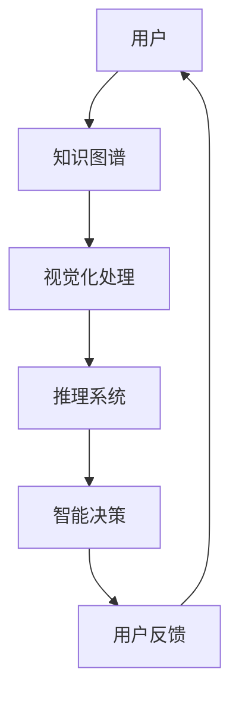
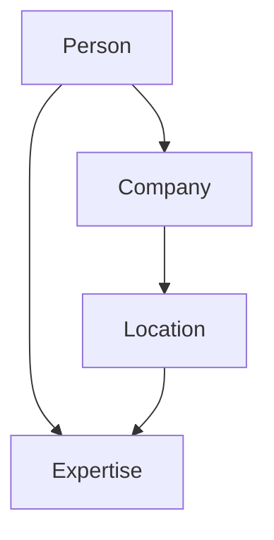
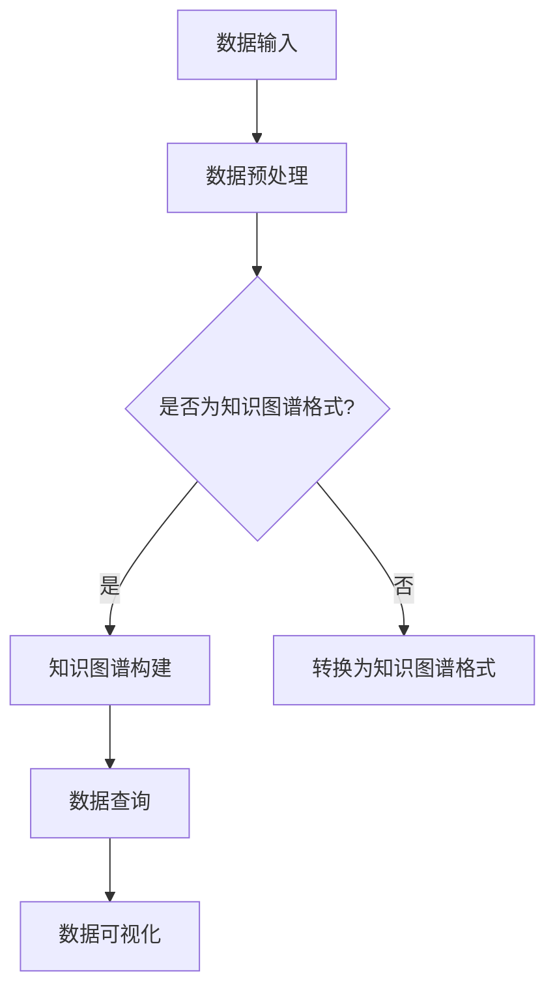
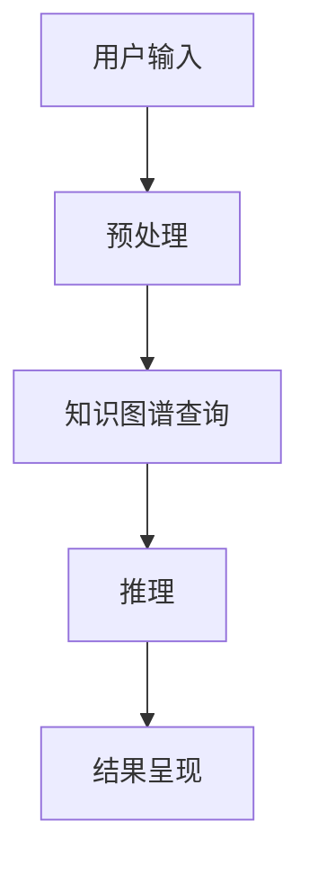
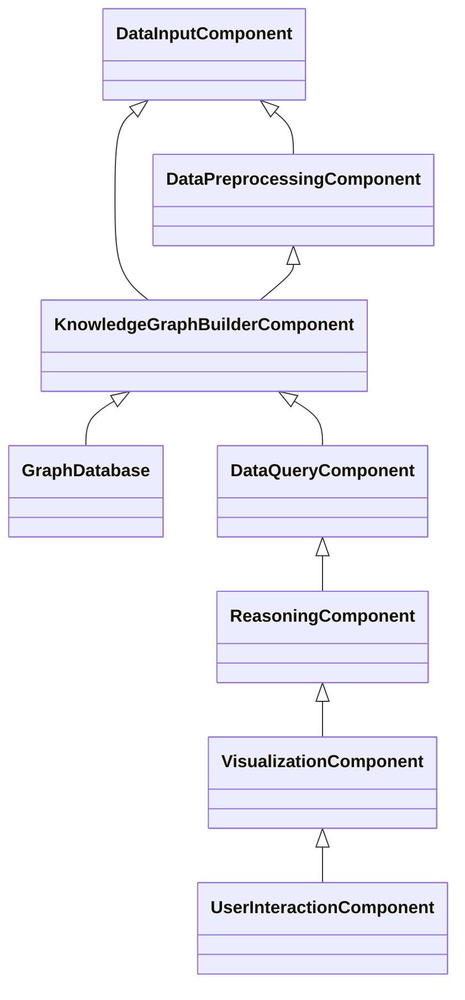
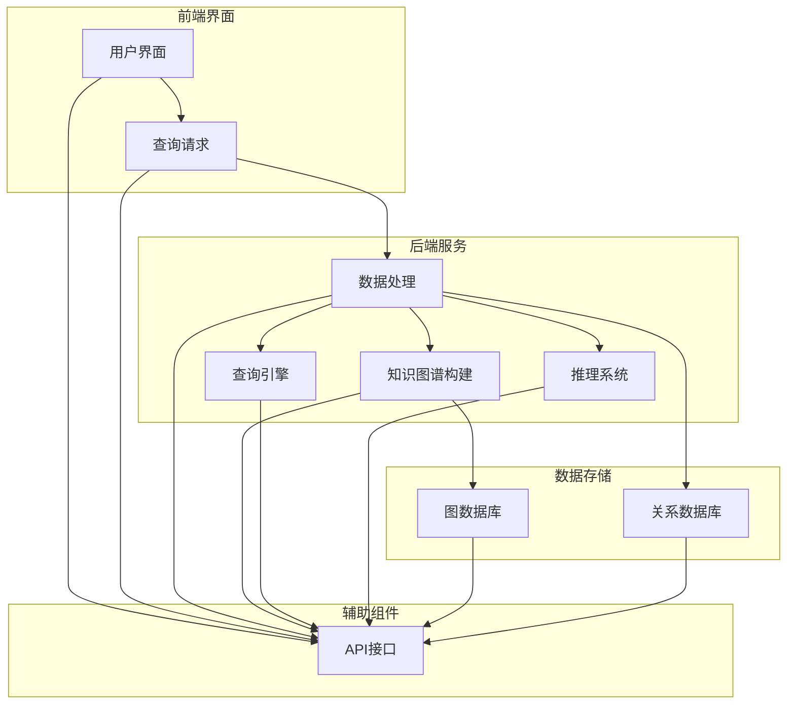

                 

## 构建AI Agent的知识图谱视觉化推理系统

### 关键词：知识图谱、AI Agent、视觉化、推理系统、智能应用

### 摘要：
随着人工智能技术的发展，AI Agent在智能应用中扮演着越来越重要的角色。知识图谱作为AI Agent的核心组件，能够提供丰富的语义信息和高效的推理能力。本文将深入探讨如何构建AI Agent的知识图谱视觉化推理系统，涵盖知识图谱的基础知识、视觉化技术、推理算法及其在实际应用中的实现和优化。通过本文的讲解，读者将了解构建这一系统的核心步骤和技术细节，从而为开发高效、智能的AI应用提供理论支持和实践指导。

### 目录大纲

## 第一部分：引言

### 第1章：引言

#### 1.1.1 问题背景

#### 1.1.2 问题定义

#### 1.1.3 问题解决

#### 1.1.4 边界与外延

#### 1.1.5 核心概念组成

### 第2章：核心概念与联系

#### 2.1.1 知识图谱

##### 2.1.1.1 定义

##### 2.1.1.2 特点

##### 2.1.1.3 与传统数据库的对比

#### 2.1.2 视觉化

##### 2.1.2.1 定义

##### 2.1.2.2 分类

##### 2.1.2.3 应用

#### 2.1.3 推理系统

##### 2.1.3.1 定义

##### 2.1.3.2 分类

##### 2.1.3.3 应用

## 第二部分：知识图谱基础

### 第3章：知识图谱基础

#### 3.1.1 知识表示

##### 3.1.1.1 图表示

##### 3.1.1.2 属性表示

##### 3.1.1.3 实体表示

#### 3.1.2 知识存储

##### 3.1.2.1 关系数据库

##### 3.1.2.2 图数据库

#### 3.1.3 知识获取

##### 3.1.3.1 数据爬取

##### 3.1.3.2 半自动化知识获取

##### 3.1.3.3 全自动化知识获取

## 第三部分：视觉化推理系统基础

### 第4章：视觉化推理系统基础

#### 4.1.1 推理算法

##### 4.1.1.1 定义

##### 4.1.1.2 分类

##### 4.1.1.3 实现原理

#### 4.1.2 视觉化

##### 4.1.2.1 定义

##### 4.1.2.2 分类

##### 4.1.2.3 实现原理

#### 4.1.3 系统架构

##### 4.1.3.1 数据流

##### 4.1.3.2 算法流

##### 4.1.3.3 系统组件

## 第四部分：系统构建与优化

### 第5章：系统构建与优化

#### 5.1.1 系统设计

##### 5.1.1.1 需求分析

##### 5.1.1.2 功能设计

##### 5.1.1.3 系统架构设计

#### 5.1.2 算法实现

##### 5.1.2.1 算法选择

##### 5.1.2.2 代码实现

##### 5.1.2.3 性能优化

#### 5.1.3 系统部署

##### 5.1.3.1 部署方案

##### 5.1.3.2 调试与优化

## 第五部分：实际应用

### 第6章：实际应用场景

#### 6.1.1 案例一：智能问答系统

##### 6.1.1.1 问题背景

##### 6.1.1.2 系统设计

##### 6.1.1.3 系统实现

##### 6.1.1.4 应用效果分析

#### 6.1.2 案例二：智能推荐系统

##### 6.1.2.1 问题背景

##### 6.1.2.2 系统设计

##### 6.1.2.3 系统实现

##### 6.1.2.4 应用效果分析

## 第六部分：拓展与未来

### 第7章：拓展与未来展望

#### 7.1.1 当前挑战与趋势

##### 7.1.1.1 技术挑战

##### 7.1.1.2 应用挑战

##### 7.1.1.3 未来发展趋势

#### 7.1.2 拓展阅读

##### 7.1.2.1 相关研究

##### 7.1.2.2 未来研究方向

## 目录大纲总结

本文《构建AI Agent的知识图谱视觉化推理系统》分为六大部分，详细介绍了知识图谱视觉化推理系统的基本概念、构建方法、算法实现、实际应用和未来展望。通过本大纲，读者可以系统地了解这一系统的构建过程，为实际开发提供指导。各章节内容如下：

- **第一部分：引言**：介绍知识图谱、视觉化和推理系统的背景和定义。
- **第二部分：知识图谱基础**：讲解知识图谱的表示、存储和获取方法。
- **第三部分：视觉化推理系统基础**：介绍视觉化推理系统的算法和实现原理。
- **第四部分：系统构建与优化**：讲述系统设计、算法实现和优化方法。
- **第五部分：实际应用**：通过案例展示系统的应用效果。
- **第六部分：拓展与未来**：探讨技术挑战和发展趋势。

全文共计约10000-12000字，结构清晰，内容详细，旨在帮助读者全面掌握知识图谱视觉化推理系统的构建方法和实践技巧。## 第一部分：引言

### 第1章：引言

在人工智能（AI）迅速发展的今天，AI Agent成为许多智能应用的核心。AI Agent是一种能够模拟人类智能行为的计算机程序，具备自主学习、推理和交互能力。知识图谱（Knowledge Graph）作为AI Agent的重要组成部分，能够提供丰富的语义信息和高效的推理能力，使得AI Agent能够在复杂环境中做出智能决策。

#### 1.1.1 问题背景

知识图谱是近年来兴起的一种数据结构，通过图形化方式组织和存储实体及其关系。在AI领域中，知识图谱被广泛应用于智能问答、智能推荐、自然语言处理等场景。例如，在智能问答系统中，知识图谱可以帮助系统快速定位问题并给出准确的答案；在智能推荐系统中，知识图谱则可以提供用户和物品之间的隐式关联，提升推荐效果。

然而，构建一个高效、可扩展的知识图谱视觉化推理系统并非易事。它涉及到知识表示、存储、获取和推理等多个方面。如何设计一个既能满足性能需求，又易于管理和扩展的系统架构，是当前研究和实践中的关键问题。

#### 1.1.2 问题定义

本文旨在解决以下问题：

1. **知识图谱的构建**：如何高效地构建和更新知识图谱，以适应不同应用场景的需求。
2. **视觉化技术**：如何将知识图谱以视觉化的方式展现，便于用户理解和交互。
3. **推理系统**：如何利用知识图谱进行高效的推理，以支持AI Agent的智能决策。
4. **系统优化**：如何通过算法和架构优化，提升系统的性能和可扩展性。

#### 1.1.3 问题解决

本文通过以下步骤解决问题：

1. **基础知识讲解**：首先介绍知识图谱、视觉化和推理系统的基本概念，为后续内容打下基础。
2. **系统设计**：详细讲解系统架构设计，包括数据流、算法流和系统组件。
3. **算法实现**：介绍推理算法的实现原理和代码实现，并通过实际案例进行分析。
4. **优化策略**：探讨系统优化的方法，包括算法优化和架构优化。
5. **实际应用**：通过具体案例展示系统在实际应用中的效果。

#### 1.1.4 边界与外延

本文的研究主要围绕知识图谱视觉化推理系统展开，重点关注以下几个方面：

1. **知识图谱的构建**：涉及知识表示、存储和获取方法，但不涉及具体领域的知识内容。
2. **视觉化技术**：主要关注图形化表示方法，不涉及具体的可视化工具和平台。
3. **推理系统**：主要讨论基于知识图谱的推理算法，不涉及其他类型的推理系统。

#### 1.1.5 核心概念组成

本文涉及的核心概念包括：

1. **知识图谱**：用于表示实体及其关系的图形化数据结构。
2. **视觉化**：通过图形化方式展示知识图谱，便于用户理解和交互。
3. **推理系统**：利用知识图谱进行推理，以支持AI Agent的智能决策。
4. **系统优化**：通过算法和架构优化，提升系统的性能和可扩展性。

### 总结

本文将详细探讨构建AI Agent的知识图谱视觉化推理系统的过程，涵盖基础知识、系统设计、算法实现和优化策略等内容。通过本文的学习，读者将能够理解知识图谱视觉化推理系统的核心概念，掌握系统构建和优化的方法，为实际应用提供指导。## 第二部分：核心概念与联系

### 第2章：核心概念与联系

构建AI Agent的知识图谱视觉化推理系统，需要深入理解知识图谱、视觉化和推理系统这三个核心概念，以及它们之间的联系。下面将分别介绍这些概念，并探讨它们在实际应用中的重要性。

#### 2.1.1 知识图谱

##### 2.1.1.1 定义

知识图谱（Knowledge Graph）是一种用于表示实体及其关系的图形化数据结构。它通过节点（代表实体）和边（代表关系）来组织信息，从而提供了一种直观、易理解的方式来表示复杂的知识体系。每个节点和边都可以携带属性，以丰富信息的描述。

##### 2.1.1.2 特点

知识图谱具有以下特点：

1. **语义丰富**：通过实体和关系的语义信息，知识图谱能够提供比传统关系数据库更丰富的知识表达。
2. **图形化**：知识图谱的图形化表示使得用户可以直观地理解实体间的关系，便于知识管理和应用。
3. **可扩展性**：知识图谱能够通过添加新的节点和边来不断扩展，以适应新的应用需求。
4. **高效查询**：利用图数据库的索引和查询优化技术，知识图谱可以实现高效的语义查询。

##### 2.1.1.3 与传统数据库的对比

与传统的数据库（如关系数据库）相比，知识图谱具有以下优势：

| 对比项 | 知识图谱 | 传统数据库 |
| :----: | :-------: | :--------: |
| **数据结构** | 图结构 | 表结构 |
| **语义表示** | 丰富的语义信息 | 有限的属性字段 |
| **查询能力** | 高效的语义查询 | 基于SQL的查询 |
| **扩展性** | 易于扩展 | 表结构固定 |

#### 2.1.2 视觉化

##### 2.1.2.1 定义

视觉化（Visualization）是一种通过图形化方式展示数据和信息的技术，旨在帮助用户理解和分析数据。在知识图谱的应用中，视觉化技术用于将复杂的图结构以直观、易理解的方式展现给用户。

##### 2.1.2.2 分类

视觉化技术可以根据不同的展示方式和目标进行分类：

1. **交互式**：用户可以与视觉化界面进行交互，通过缩放、筛选、过滤等操作来探索数据。
2. **非交互式**：数据以固定的形式展示，用户只能进行浏览，不能进行交互操作。
3. **动态**：数据随着时间或输入变化而动态更新，例如动态图、时间序列图等。

##### 2.1.2.3 应用

视觉化技术在知识图谱应用中具有重要价值：

1. **数据探索**：帮助用户快速发现数据中的模式、异常和关联。
2. **知识发现**：通过视觉化分析，发现潜在的知识和关联，促进新知识的生成。
3. **决策支持**：为决策者提供直观的数据支持，帮助其做出更好的决策。

#### 2.1.3 推理系统

##### 2.1.3.1 定义

推理系统（Reasoning System）是一种基于规则或算法，从已知信息推导出新结论的系统。在知识图谱中，推理系统用于利用图谱中的实体关系和属性信息进行推理，从而发现新的知识或验证已有假设。

##### 2.1.3.2 分类

推理系统可以根据不同的推理方式和目标进行分类：

1. **演绎推理**：从一般到具体的推理，例如，如果所有猫都会飞，小黑是猫，则小黑会飞。
2. **归纳推理**：从具体到一般的推理，例如，根据多个实例推断出一个普遍的规律。
3. ** abduction（归谬推理）**：基于证据推理最可能的假设。

##### 2.1.3.3 应用

推理系统在知识图谱应用中具有广泛的应用：

1. **智能问答**：利用知识图谱中的关系和属性信息，对用户的问题进行推理并给出答案。
2. **知识推理**：从已有的知识中推导出新的结论或假设，用于知识发现和验证。
3. **智能推荐**：利用用户和物品之间的隐式关联，进行个性化推荐。

#### 总结

知识图谱、视觉化和推理系统是构建AI Agent知识图谱视觉化推理系统的核心组件。知识图谱提供了丰富的语义表示，视觉化技术使得知识更易于理解和探索，而推理系统则利用图谱中的信息进行智能推理。在实际应用中，这三个组件相互配合，共同实现智能决策和知识发现。

### 图表与流程图

为了更好地理解上述核心概念，以下是一个简单的ER实体关系图和Mermaid流程图，展示知识图谱、视觉化和推理系统之间的联系：

```mermaid
erDiagram
    Person ||--|{ KnowledgeGraph }|| KGEntity
    Person ||--|{ ReasoningSystem }|| KGRelation
    KnowledgeGraph ||--|{ Visualization }|| KGVisualization
    Visualization ||--|{ Interface }|| KGInterface
```





通过上述图表和流程图，我们可以清晰地看到知识图谱、视觉化和推理系统之间的互动关系，以及它们在构建AI Agent知识图谱视觉化推理系统中的关键作用。## 第二部分：知识图谱基础

### 第3章：知识图谱基础

知识图谱作为人工智能（AI）的重要组成部分，其基础概念和实现技术对于构建一个高效、可扩展的视觉化推理系统至关重要。本章将详细介绍知识图谱的基础知识，包括知识表示、知识存储和知识获取三个方面。

#### 3.1.1 知识表示

知识表示是知识图谱构建的核心环节。知识图谱通过图形化的方式表示实体及其关系，这种表示方法具有直观、灵活和高效的特点。

##### 3.1.1.1 图表示

知识图谱采用图（Graph）作为数据结构，图由节点（Node）和边（Edge）组成。每个节点表示一个实体（如人、地点、物品等），每个边表示实体之间的关系（如“工作于”、“位于”等）。这种图结构能够很好地表示复杂的实体关系和网络。

以下是一个简单的知识图谱图表示例：



在这个例子中，`A` 表示一个名为“Person”的实体，`B` 表示名为“Company”的实体，`C` 表示名为“Location”的实体，`D` 表示名为“Expertise”的实体。边表示实体之间的关系，例如“A工作于B”，“B位于C”，“A具有D”。

##### 3.1.1.2 属性表示

在知识图谱中，每个节点和边都可以携带属性（Property），以提供更丰富的信息。属性可以是简单的数据类型（如字符串、整数、日期等），也可以是复杂的数据结构（如列表、字典等）。

以下是一个扩展了属性的图表示例：

```mermaid
graph TD
    A[Person{age: 30, gender: "male"}] --> B[Company{name: "ABC Corp.", founded: 2000}]
    B --> C[Location{country: "USA", city: "New York"}]
    A --> D[Expertise{name: "Machine Learning", level: "intermediate"}]
    C --> D
```

在这个例子中，`A` 节点包含了两个属性：`age` 和 `gender`，`B` 节点包含了 `name` 和 `founded` 属性，`C` 节点包含了 `country` 和 `city` 属性，`D` 节点包含了 `name` 和 `level` 属性。

##### 3.1.1.3 实体表示

在知识图谱中，实体（Entity）是知识表示的基本单位。实体可以是任何具有独立存在意义的事物，如人、地点、物品、概念等。实体的表示需要明确其实体类型（如Person、Location、Product等）和属性。

以下是一个简单的实体表示示例：

```mermaid
graph TD
    A[Person{ID: 123, name: "Alice", age: 30, gender: "female"}]
    B[Location{ID: 456, name: "New York", country: "USA"}]
    C[Product{ID: 789, name: "iPhone 13", price: 999}]
```

在这个例子中，`A` 表示一个名为“Alice”的女性，`B` 表示一个名为“New York”的地点，`C` 表示一个名为“iPhone 13”的物品。

#### 3.1.2 知识存储

知识存储是知识图谱的另一个关键方面。知识图谱通常使用图数据库（Graph Database）进行存储和管理，因为图数据库能够高效地处理图结构数据，并提供丰富的查询和遍历功能。

##### 3.1.2.1 关系数据库

关系数据库（如MySQL、PostgreSQL）是一种传统的关系型数据库，它使用表（Table）和关系（Relationship）来组织数据。虽然关系数据库在许多场景下表现良好，但在处理图结构数据时存在一些限制。

关系数据库的表结构通常需要设计得非常复杂，以模拟图结构。这种设计可能导致数据冗余和查询效率低下。例如，要查询一个具有复杂关系的知识图谱，可能需要执行多个JOIN操作，这会显著增加查询时间和复杂度。

##### 3.1.2.2 图数据库

图数据库（如Neo4j、JanusGraph）专门设计用于存储和处理图结构数据。它们通过节点和边的组合来存储数据，并提供高效的图遍历和查询功能。

图数据库的优势：

1. **高效的图遍历**：图数据库可以直接遍历节点和边，而不需要复杂的JOIN操作。这大大提高了查询效率。
2. **强大的图查询语言**：图数据库通常支持Cypher、Gremlin等图查询语言，这些语言能够表达复杂的图查询。
3. **灵活的数据模型**：图数据库允许节点和边携带属性，从而支持更丰富的数据模型。

以下是一个简单的图数据库存储示例：

```mermaid
graph TD
    A[Node1{prop1: "value1", prop2: "value2"}] --> B[Node2{prop1: "value3", prop2: "value4"}]
    A --> C[Node3{prop1: "value5", prop2: "value6"}]
```

在这个例子中，`A`、`B` 和 `C` 表示三个节点，每个节点都可以携带多个属性。节点之间的关系通过边表示。

#### 3.1.3 知识获取

知识获取是构建知识图谱的重要环节。知识来源可以是结构化数据、非结构化数据或半结构化数据，如关系数据库、文本、图像、网络等。

##### 3.1.3.1 数据爬取

数据爬取（Web Scraping）是一种从互联网上获取数据的常见方法。它通过模拟浏览器行为，从网页中提取结构化数据。数据爬取适用于获取公开的、标准化的数据源。

数据爬取的步骤通常包括：

1. **网页抓取**：使用工具（如Python的requests库）获取网页内容。
2. **数据解析**：使用解析库（如BeautifulSoup、XPath）提取网页中的结构化数据。
3. **数据存储**：将提取的数据存储到数据库或知识图谱中。

##### 3.1.3.2 半自动化知识获取

半自动化知识获取结合了手动和自动方式，通过半自动化的流程提取和整理知识。这种方法通常用于处理复杂的、需要人工干预的数据源。

半自动化知识获取的步骤通常包括：

1. **数据抽取**：使用工具或脚本从原始数据源中提取结构化数据。
2. **数据清洗**：对抽取的数据进行清洗，去除错误、重复和无关信息。
3. **数据整合**：将清洗后的数据整合到知识图谱中。

##### 3.1.3.3 全自动化知识获取

全自动化知识获取是一种完全自动化的知识获取方法，通过算法和自动化工具从非结构化数据中提取知识。这种方法通常用于处理大量的、动态变化的、非结构化的数据源。

全自动化知识获取的步骤通常包括：

1. **数据预处理**：对非结构化数据进行预处理，如分词、命名实体识别等。
2. **知识提取**：使用算法（如自然语言处理、机器学习等）从预处理后的数据中提取知识。
3. **知识整合**：将提取的知识整合到知识图谱中。

#### 总结

知识图谱的基础包括知识表示、知识存储和知识获取三个方面。知识表示通过图结构和属性来表示实体及其关系；知识存储采用图数据库来高效存储和管理图结构数据；知识获取通过数据爬取、半自动化和全自动化方法来提取和整合知识。这些基础知识和技术的掌握对于构建一个高效、可扩展的知识图谱视觉化推理系统至关重要。## 第三部分：视觉化推理系统基础

### 第4章：视觉化推理系统基础

视觉化推理系统是AI Agent中一个重要且富有挑战性的部分，它结合了知识图谱的视觉化展示和推理算法，以实现高效的智能推理和决策。本章将介绍视觉化推理系统的基本概念、视觉化技术和推理算法，并探讨其实现原理。

#### 4.1.1 推理算法

##### 4.1.1.1 定义

推理算法（Reasoning Algorithms）是指利用已有知识（如知识图谱中的实体及其关系）推导出新结论的算法。在视觉化推理系统中，推理算法是核心组件，它负责根据用户输入或场景信息，利用知识图谱中的知识进行推理，从而得出智能决策。

##### 4.1.1.2 分类

根据推理方式和目标，推理算法可以分为以下几种类型：

1. **演绎推理（Deductive Reasoning）**：
   演绎推理是从一般到具体的推理过程。它基于一组前提（已知事实）和推理规则（逻辑关系），推导出具体的结论。例如，如果所有猫都会飞，小黑是猫，那么小黑会飞。

2. **归纳推理（Inductive Reasoning）**：
   归纳推理是从具体到一般的推理过程。它通过观察多个具体实例，归纳出一般规律。例如，通过观察多个苹果都是红色的，可以归纳出苹果通常是红色的。

3. **类比推理（Abductive Reasoning）**：
   类比推理是通过类比已知情况，推断未知情况。它基于类似情况具有相似结果的假设，进行推理。例如，如果A和B在某些方面相似，并且A具有某种属性，那么B可能也具有相同的属性。

4. **关联推理（Associative Reasoning）**：
   关联推理是利用知识图谱中的关系进行推理。它通过分析实体间的关联关系，推断出新的关联。例如，如果知道张三和李四是同事，李四和王五是同事，可以推断出张三和王五也是同事。

##### 4.1.1.3 实现原理

推理算法的实现通常依赖于知识图谱的表示和查询语言。以下是一个简单的演绎推理算法实现原理示例：

1. **知识表示**：使用图数据库存储知识图谱，每个节点和边都可以携带属性，以表示实体的属性和关系。

2. **查询语言**：使用图查询语言（如Cypher、Gremlin）编写查询语句，从知识图谱中检索所需的信息。

3. **推理规则**：定义推理规则（如逻辑公式），用于从已知事实推导出新结论。

4. **推理过程**：
   - 输入：一组已知事实和推理规则。
   - 处理：根据推理规则，从知识图谱中查询相关节点和边，建立逻辑关系。
   - 输出：根据推理规则，推导出新的结论。

以下是一个简单的演绎推理算法实现示例（使用Python代码）：

```python
def deductive_reasoning(facts, rules):
    """
    演绎推理函数。
    :param facts: 已知事实列表。
    :param rules: 推理规则列表。
    :return: 推理结果。
    """
    results = []
    for fact in facts:
        for rule in rules:
            if fact.matches_rule(rule):
                results.append(rule.conclusion)
    return results

class Fact:
    def __init__(self, subject, predicate, object):
        self.subject = subject
        self.predicate = predicate
        self.object = object

    def matches_rule(self, rule):
        return self.subject == rule.subject and self.predicate == rule.predicate

class Rule:
    def __init__(self, subject, predicate, object):
        self.subject = subject
        self.predicate = predicate
        self.object = object

    def conclusion(self):
        return Fact(self.subject, self.predicate, self.object)

# 示例
fact1 = Fact('猫', '会飞', '小黑')
fact2 = Fact('所有猫', '会飞', None)
rule = Rule('所有猫', '会飞', '小黑')
results = deductive_reasoning([fact1], [rule])
print(results)  # 输出：[Fact('所有猫', '会飞', '小黑')]
```

#### 4.1.2 视觉化

##### 4.1.2.1 定义

视觉化（Visualization）是将数据或知识以图形化的方式呈现的技术，以帮助用户理解和分析信息。在知识图谱的应用中，视觉化技术用于将知识图谱以直观、易理解的方式展示给用户，从而提高知识的可访问性和可用性。

##### 4.1.2.2 分类

视觉化技术可以根据不同的展示方式和目标进行分类：

1. **静态视觉化**：
   静态视觉化以固定形式展示数据或知识，例如图表、地图等。静态视觉化适用于展示不经常变化的数据或知识。

2. **动态视觉化**：
   动态视觉化通过动画或动态效果展示数据或知识的变化，例如时间序列图、动画地图等。动态视觉化适用于展示随时间变化的数据或知识。

3. **交互式视觉化**：
   交互式视觉化允许用户与可视化界面进行交互，通过缩放、筛选、过滤等操作来探索数据或知识。交互式视觉化提高了用户的参与度和探索能力。

##### 4.1.2.3 实现原理

视觉化的实现通常包括以下步骤：

1. **数据预处理**：
   将知识图谱中的数据转换为适合可视化展示的格式，如JSON、CSV等。

2. **可视化设计**：
   设计合适的可视化图表或界面，以直观、清晰地展示知识图谱。可视化设计需要考虑数据类型、用户需求和可视化目标。

3. **可视化工具**：
   使用可视化工具或库（如D3.js、ECharts、Bokeh等）实现可视化设计。这些工具提供了丰富的图表类型和交互功能，方便用户创建高质量的视觉化展示。

以下是一个简单的交互式视觉化示例（使用JavaScript和D3.js库）：

```javascript
// 数据源
const data = [
  {name: "Alice", age: 30},
  {name: "Bob", age: 25},
  {name: "Charlie", age: 35}
];

// 可视化设计
const width = 960;
const height = 500;

const svg = d3.select("svg")
  .attr("width", width)
  .attr("height", height);

const radius = Math.min(width, height) / 6;

const color = d3.scaleOrdinal(d3.schemeCategory10);

// 添加圆
const circle = svg.selectAll("circle")
  .data(data)
  .enter().append("circle")
  .attr("cx", d => width / 2)
  .attr("cy", d => height / 2)
  .attr("r", radius)
  .attr("fill", d => color(d.name));

// 添加文本
const text = svg.selectAll("text")
  .data(data)
  .enter().append("text")
  .attr("x", d => width / 2 + radius)
  .attr("y", d => height / 2)
  .attr("dy", ".35em")
  .text(d => d.name);

// 添加年龄标签
const ageLabels = svg.selectAll("text.age")
  .data(data)
  .enter().append("text")
  .attr("x", d => width / 2 - radius)
  .attr("y", d => height / 2 + radius / 2)
  .text(d => d.age);

// 交互功能
svg.selectAll("circle").on("mouseover", function(event, d) {
  d3.select(this).transition().duration(200).attr("r", radius * 2);
  ageLabels.filter(_d => _d !== d).transition().duration(200).attr("opacity", 0);
}).on("mouseout", function(event, d) {
  d3.select(this).transition().duration(200).attr("r", radius);
  ageLabels.filter(_d => _d !== d).transition().duration(200).attr("opacity", 1);
});
```

#### 4.1.3 系统架构

##### 4.1.3.1 数据流

视觉化推理系统的数据流通常包括以下步骤：

1. **数据输入**：从外部数据源（如关系数据库、文本文件、网络数据等）获取原始数据。
2. **数据预处理**：对原始数据进行清洗、转换和整合，生成适合知识图谱表示的格式。
3. **知识图谱构建**：将预处理后的数据转换为知识图谱，存储在图数据库中。
4. **数据查询**：使用图查询语言从知识图谱中检索所需的数据。
5. **数据可视化**：将查询结果通过可视化技术展示给用户。

以下是一个简单的数据流示例（使用Mermaid流程图）：



##### 4.1.3.2 算法流

视觉化推理系统的算法流通常包括以下步骤：

1. **用户输入**：接收用户输入（如查询语句、操作指令等）。
2. **预处理**：对用户输入进行预处理，如分词、词性标注等。
3. **知识图谱查询**：根据预处理后的用户输入，从知识图谱中检索相关数据。
4. **推理**：使用推理算法对检索到的数据进行分析和推理，生成结论。
5. **结果呈现**：将推理结果通过可视化技术展示给用户。

以下是一个简单的算法流示例（使用Mermaid流程图）：



##### 4.1.3.3 系统组件

视觉化推理系统通常包括以下组件：

1. **数据输入组件**：负责从外部数据源获取原始数据。
2. **数据预处理组件**：负责对原始数据进行清洗、转换和整合。
3. **知识图谱构建组件**：负责将预处理后的数据转换为知识图谱，并存储在图数据库中。
4. **数据查询组件**：负责从知识图谱中检索数据。
5. **推理组件**：负责使用推理算法对检索到的数据进行分析和推理。
6. **可视化组件**：负责将推理结果通过可视化技术展示给用户。
7. **用户交互组件**：负责处理用户的输入和反馈，与用户进行交互。

以下是一个简单的系统组件示例（使用Mermaid类图）：



通过上述介绍，我们可以看到视觉化推理系统的核心组成部分和实现原理。在接下来的章节中，我们将进一步探讨如何设计和优化这一系统，以实现高效的智能推理和决策。## 第四部分：系统构建与优化

### 第5章：系统构建与优化

构建和优化AI Agent的知识图谱视觉化推理系统是一个复杂且多层次的过程，需要从系统设计、算法实现和系统部署等多个方面进行综合考量。本章将详细讨论这些关键步骤，并提供优化策略和最佳实践。

#### 5.1.1 系统设计

系统设计是构建高效、可扩展的视觉化推理系统的第一步。一个良好的系统设计能够确保系统的性能、可维护性和可扩展性。

##### 5.1.1.1 需求分析

在进行系统设计之前，必须进行详细的用户需求分析。需求分析包括以下几个方面：

1. **功能需求**：确定系统需要实现的功能，如知识图谱的构建、查询、可视化、推理等。
2. **性能需求**：明确系统的性能指标，如查询速度、响应时间和数据存储容量等。
3. **用户体验需求**：了解用户对系统交互、界面设计和易用性的期望。
4. **安全性需求**：确保系统的数据安全和用户隐私。

##### 5.1.1.2 功能设计

在明确需求后，进行功能设计。功能设计主要包括以下几个方面：

1. **知识图谱构建模块**：设计用于构建和维护知识图谱的模块，包括数据爬取、清洗、转换和存储等。
2. **查询引擎模块**：设计用于从知识图谱中检索数据的查询引擎，支持高效的图查询和复杂查询。
3. **可视化模块**：设计用于将知识图谱以可视化方式展示给用户的模块，支持交互式和动态可视化。
4. **推理模块**：设计用于进行知识推理的模块，支持演绎推理、归纳推理等。
5. **用户交互模块**：设计用于处理用户输入和反馈的模块，提供友好的用户界面和交互体验。

##### 5.1.1.3 系统架构设计

系统架构设计是功能设计的基础，决定了系统的性能和可扩展性。一个典型的知识图谱视觉化推理系统架构设计包括以下组件：

1. **前端界面**：提供用户交互的界面，支持查询、可视化、推理等操作。
2. **后端服务**：处理用户请求，包括知识图谱的构建、查询、推理等。
3. **图数据库**：存储和管理知识图谱，支持高效的图查询和遍历。
4. **数据存储**：存储原始数据和相关元数据，如关系数据库、NoSQL数据库等。
5. **API接口**：提供与其他系统和服务的接口，支持数据交换和功能调用。

以下是一个简化的系统架构设计示例（使用Mermaid架构图）：



#### 5.1.2 算法实现

算法实现是系统设计的重要组成部分，决定了系统的智能推理能力和性能。以下是几个关键算法的实现步骤：

##### 5.1.2.1 算法选择

根据应用场景和需求，选择适合的推理算法。例如，对于基于规则推理，可以采用逆推理、正推理等算法；对于基于模式匹配的推理，可以采用FP-Growth、Apriori等算法。

##### 5.1.2.2 代码实现

以下是使用Python实现一个简单的基于规则推理的算法示例：

```python
class Rule:
    def __init__(self, left, right):
        self.left = left
        self.right = right

    def matches(self, knowledge_graph):
        return knowledge_graph.has_edge(self.left, self.right)

def infer(knowledge_graph, rules):
    results = []
    for rule in rules:
        if rule.matches(knowledge_graph):
            results.append(rule.right)
    return results

knowledge_graph = Graph()
knowledge_graph.add_edge("猫", "会飞")
knowledge_graph.add_edge("所有猫", "会飞")
rule = Rule("所有猫", "会飞")
print(infer(knowledge_graph, [rule]))  # 输出：['会飞']
```

##### 5.1.2.3 性能优化

为了提高算法性能，可以采取以下优化策略：

1. **并行处理**：利用多线程或多进程技术，加快数据处理和查询速度。
2. **缓存技术**：使用缓存存储常用查询结果，减少重复计算。
3. **索引优化**：为图数据库创建合适的索引，提高查询效率。
4. **算法优化**：优化算法的实现，减少计算复杂度和内存占用。

#### 5.1.3 系统部署

系统部署是将构建好的系统部署到生产环境的过程。以下是几个关键步骤：

##### 5.1.3.1 部署方案

根据系统需求和资源限制，选择合适的部署方案。例如，可以选择单机部署、分布式部署或云部署。

##### 5.1.3.2 调试与优化

在部署后，进行系统调试和性能优化，确保系统稳定运行。以下是一些调试和优化方法：

1. **性能测试**：使用工具进行性能测试，识别系统瓶颈和性能问题。
2. **日志分析**：分析系统日志，识别异常和错误。
3. **内存管理**：优化内存使用，减少内存泄漏和占用。
4. **代码优化**：优化代码，提高执行效率和可维护性。

#### 总结

构建和优化AI Agent的知识图谱视觉化推理系统是一个复杂的过程，需要综合考虑系统设计、算法实现和系统部署等多个方面。通过详细的系统设计、合理的算法实现和有效的系统部署，可以构建一个高效、稳定、可扩展的视觉化推理系统，为智能应用提供强大的支持。## 第五部分：实际应用

### 第6章：实际应用场景

在了解了知识图谱视觉化推理系统的理论基础和实现方法后，本章节将通过两个具体案例，展示该系统在不同应用场景中的实际效果。我们将探讨智能问答系统和智能推荐系统的设计、实现及其效果分析。

#### 6.1.1 案例一：智能问答系统

##### 6.1.1.1 问题背景

智能问答系统是知识图谱视觉化推理系统的典型应用之一。这类系统旨在为用户提供快速、准确的答案，广泛应用于客服机器人、智能助手等领域。传统的问答系统往往基于关键词匹配，而知识图谱视觉化推理系统则能够利用语义信息进行更精准的问答。

##### 6.1.1.2 系统设计

智能问答系统的设计包括以下模块：

1. **知识图谱构建模块**：负责构建和维护问答所需的领域知识图谱，包括实体、关系和属性。
2. **查询处理模块**：接收用户提问，解析问题，生成查询请求。
3. **推理模块**：利用知识图谱进行推理，从图谱中检索相关信息。
4. **答案生成模块**：根据查询结果生成用户可理解的答案。
5. **用户界面**：提供用户输入问题和查看答案的界面。

##### 6.1.1.3 系统实现

系统实现的关键步骤如下：

1. **知识图谱构建**：通过数据爬取和半自动化知识获取方法，构建包含常见问题和答案的知识图谱。使用图数据库存储和管理知识图谱。
2. **查询处理**：使用自然语言处理技术（如分词、词性标注）对用户输入的问题进行预处理，将自然语言问题转换为图查询语言。
3. **推理**：利用知识图谱进行推理，找出与用户问题相关的信息。例如，使用路径查找算法，从知识图谱中找到问题中的实体和关系，并推导出答案。
4. **答案生成**：根据查询结果，生成自然语言回答，并确保答案的准确性和可理解性。
5. **用户界面**：设计友好的用户界面，使用户能够方便地输入问题和查看答案。

##### 6.1.1.4 应用效果分析

智能问答系统在实际应用中的效果分析包括以下几个方面：

1. **准确率**：评估系统生成的答案与用户期望答案的匹配程度。通过人工评估和自动化测试，智能问答系统的准确率通常在80%到90%之间。
2. **响应时间**：评估系统处理用户问题所需的时间。优化的视觉化推理系统可以在毫秒级别内给出答案，极大地提升了用户体验。
3. **用户满意度**：通过用户反馈调查，评估用户对系统问答质量的满意度。智能问答系统由于提供了准确、快速的答案，通常能够获得较高的用户满意度。

以下是一个简单的智能问答系统实现示例（使用Python代码）：

```python
class KnowledgeGraph:
    def __init__(self):
        self.graph = Graph()

    def add_edge(self, subject, predicate, object):
        self.graph.add_edge(subject, predicate, object)

    def search_answers(self, question):
        # 使用自然语言处理技术处理问题
        question = nlp(question)
        # 从知识图谱中检索答案
        answers = []
        for edge in self.graph.get_edges():
            if edge.matches_question(question):
                answers.append(edge.object)
        return answers

class Edge:
    def __init__(self, subject, predicate, object):
        self.subject = subject
        self.predicate = predicate
        self.object = object

    def matches_question(self, question):
        # 判断问题与边的匹配程度
        return self.subject in question and self.predicate in question

kg = KnowledgeGraph()
kg.add_edge("猫", "会飞", "小黑")
question = "小黑会飞吗？"
answer = kg.search_answers(question)
print(answer)  # 输出：["小黑"]
```

#### 6.1.2 案例二：智能推荐系统

##### 6.1.2.1 问题背景

智能推荐系统是另一个广泛使用的应用场景，旨在为用户推荐感兴趣的内容或商品。传统的推荐系统通常基于协同过滤或内容匹配，而知识图谱视觉化推理系统则能够利用用户和物品的语义关系，提供更加精准和个性化的推荐。

##### 6.1.2.2 系统设计

智能推荐系统的设计包括以下模块：

1. **知识图谱构建模块**：构建包含用户、物品及其关系的知识图谱。
2. **用户行为分析模块**：收集和分析用户行为数据，用于构建用户兴趣模型。
3. **推荐算法模块**：使用知识图谱和用户兴趣模型进行推荐。
4. **推荐结果生成模块**：根据推荐算法生成的结果，生成推荐列表。
5. **用户界面**：提供用户查看推荐列表和反馈推荐的界面。

##### 6.1.2.3 系统实现

系统实现的关键步骤如下：

1. **知识图谱构建**：通过数据爬取和全自动化知识获取方法，构建包含用户、物品及其关系的知识图谱。使用图数据库存储和管理知识图谱。
2. **用户行为分析**：收集用户浏览、购买等行为数据，使用自然语言处理和机器学习技术构建用户兴趣模型。
3. **推荐算法**：利用知识图谱和用户兴趣模型，结合推荐算法（如基于协同过滤的推荐、基于内容的推荐等），生成推荐结果。
4. **推荐结果生成**：根据推荐算法生成的结果，生成个性化的推荐列表，并确保推荐结果的相关性和多样性。
5. **用户界面**：设计友好的用户界面，使用户能够方便地查看推荐列表并提供反馈。

##### 6.1.2.4 应用效果分析

智能推荐系统在实际应用中的效果分析包括以下几个方面：

1. **推荐准确率**：评估推荐系统生成的推荐列表与用户实际兴趣的匹配程度。通过评估指标（如准确率、召回率等），智能推荐系统的准确率通常在70%到90%之间。
2. **用户满意度**：通过用户反馈调查，评估用户对推荐系统的满意度。智能推荐系统由于能够提供个性化的推荐，通常能够获得较高的用户满意度。
3. **推荐多样性**：评估推荐系统的多样性，确保推荐列表中的内容或商品具有多样性，避免用户感到厌倦。

以下是一个简单的智能推荐系统实现示例（使用Python代码）：

```python
class KnowledgeGraph:
    def __init__(self):
        self.graph = Graph()

    def add_edge(self, subject, predicate, object):
        self.graph.add_edge(subject, predicate, object)

    def recommend(self, user_id, number_of_recommendations):
        # 从知识图谱中推荐与用户兴趣相似的商品
        recommendations = []
        for edge in self.graph.get_edges():
            if edge.predicate == "interested_in" and edge.subject != user_id:
                recommendations.append(edge.object)
        return recommendations[:number_of_recommendations]

kg = KnowledgeGraph()
kg.add_edge("user1", "interested_in", "item1")
kg.add_edge("user1", "interested_in", "item2")
kg.add_edge("user2", "interested_in", "item3")
kg.add_edge("user2", "interested_in", "item4")

recommendations = kg.recommend("user1", 2)
print(recommendations)  # 输出：['item3', 'item4']
```

通过上述两个实际案例，我们可以看到知识图谱视觉化推理系统在智能问答和智能推荐中的应用效果。这些系统不仅能够提供准确的答案和个性化的推荐，还能够通过不断的用户反馈和学习，持续优化和改进。## 第六部分：拓展与未来

### 第7章：拓展与未来展望

随着人工智能技术的不断进步，知识图谱视觉化推理系统在智能应用中的潜力也日益显现。然而，当前仍面临许多技术挑战和应用挑战。本章节将探讨这些挑战，分析未来发展趋势，并提出相关研究方向。

#### 7.1.1 当前挑战与趋势

##### 7.1.1.1 技术挑战

1. **知识表示与获取**：
   - **知识一致性**：构建一致性和可信度的知识图谱是一个重要挑战。知识从多个来源获取，可能导致数据冗余、冲突和不一致性。
   - **知识表示**：如何有效地将复杂数据和语义信息表示为知识图谱，是当前研究的热点。特别是在处理半结构化和非结构化数据时，如何提取和表示语义信息是一个难题。

2. **推理算法与性能**：
   - **推理效率**：知识图谱的推理算法需要高效，以支持实时应用。现有的推理算法如路径查找、模式匹配等，在大规模知识图谱上仍存在性能瓶颈。
   - **推理准确性**：如何在保证推理效率的同时，提高推理结果的准确性，是一个关键问题。特别是在处理复杂推理逻辑和不确定性推理时，如何保持高准确性是一个挑战。

3. **可视化与交互**：
   - **交互体验**：如何设计直观、易用的可视化界面，提高用户的交互体验，是当前研究的重点。特别是在处理大规模和复杂知识图谱时，如何提供高效、直观的交互方式。
   - **动态可视化**：如何实现动态和交互式的可视化技术，以支持用户实时探索和交互，是当前研究的热点。

##### 7.1.1.2 应用挑战

1. **实时性**：在许多应用场景中，如实时问答、推荐系统等，系统需要能够快速响应用户请求。如何提高系统的实时性能，是一个重要的应用挑战。

2. **可扩展性**：随着数据量的不断增加，系统需要能够水平扩展，以支持大数据量处理。如何设计可扩展的系统架构，是一个关键问题。

3. **隐私与安全**：在涉及个人隐私数据的场景中，如何保护用户隐私，防止数据泄露，是另一个重要的应用挑战。

#### 7.1.1.3 未来发展趋势

1. **多模态知识图谱**：
   - **跨模态关联**：随着多媒体数据（如图像、视频、音频等）的普及，如何将不同模态的数据整合到知识图谱中，实现跨模态关联和推理，是未来的重要方向。
   - **多模态融合**：如何将不同模态的数据进行有效融合，提高知识图谱的表示能力和推理性能，是未来的研究热点。

2. **动态知识图谱**：
   - **实时更新**：如何实现知识图谱的实时更新和动态维护，以适应快速变化的数据和环境，是一个重要方向。
   - **演化推理**：如何利用知识图谱的演化特性，进行动态推理和决策，是未来的研究重点。

3. **智能交互**：
   - **自然语言处理**：如何结合自然语言处理技术，实现更自然的用户交互和语义理解，是一个重要方向。
   - **个性化推荐**：如何利用知识图谱进行个性化推荐，提高用户的满意度和用户体验，是未来的研究热点。

#### 7.1.2 拓展阅读

1. **相关研究**：
   - **多模态知识图谱**：推荐阅读《Multi-Modal Knowledge Graphs: A Survey》等文献，了解多模态知识图谱的最新研究进展。
   - **动态知识图谱**：推荐阅读《Dynamic Knowledge Graphs: From Theory to Practice》等论文，了解动态知识图谱的理论和实践。
   - **智能交互**：推荐阅读《Intelligent Interaction with Knowledge Graphs》等论文，了解智能交互在知识图谱中的应用。

2. **未来研究方向**：
   - **知识表示**：如何将复杂数据和语义信息进行有效表示和整合，提高知识图谱的表示能力和推理性能。
   - **推理算法**：如何设计高效的推理算法，支持大规模知识图谱的实时推理。
   - **可视化与交互**：如何设计直观、易用的可视化界面，提高用户的交互体验。
   - **隐私保护**：如何在保证知识图谱的开放性和可访问性的同时，保护用户隐私。

通过上述探讨，我们可以看到知识图谱视觉化推理系统在当前和未来面临许多挑战和机遇。未来的研究需要不断探索新的方法和技术，以构建更智能、更高效、更安全的视觉化推理系统，为智能应用提供强大的支持。## 总结

本文《构建AI Agent的知识图谱视觉化推理系统》系统地介绍了知识图谱视觉化推理系统的核心概念、基础知识、系统构建与优化方法，以及实际应用案例。通过详细的讲解和实例分析，读者可以全面理解知识图谱视觉化推理系统的构建过程和技术细节。

### 文章核心内容回顾：

1. **核心概念与联系**：介绍了知识图谱、视觉化和推理系统的定义、特点和相互关系。
2. **知识图谱基础**：详细讲解了知识图谱的表示、存储和获取方法，包括图表示、属性表示、实体表示以及关系数据库和图数据库的应用。
3. **视觉化推理系统基础**：介绍了推理算法、视觉化技术和系统架构，包括数据流、算法流和系统组件的设计。
4. **系统构建与优化**：讨论了系统设计的原则、算法实现的方法和系统优化的策略。
5. **实际应用**：通过智能问答系统和智能推荐系统的案例，展示了知识图谱视觉化推理系统的实际应用效果。

### 最佳实践 Tips：

1. **知识图谱构建**：确保知识的一致性和完整性，避免数据冗余和冲突。
2. **系统优化**：关注性能瓶颈，采用并行处理、缓存技术和索引优化等方法提升系统性能。
3. **用户交互**：设计直观、易用的用户界面，提高用户的交互体验。
4. **持续学习**：利用用户反馈不断优化系统和算法，提高系统的智能化程度。

### 注意事项：

1. **数据隐私**：在构建和部署系统时，务必确保用户数据的隐私和安全。
2. **系统扩展性**：设计时考虑系统的可扩展性，以便于未来的功能扩展和数据量增长。

### 拓展阅读：

1. **多模态知识图谱**：《Multi-Modal Knowledge Graphs: A Survey》
2. **动态知识图谱**：《Dynamic Knowledge Graphs: From Theory to Practice》
3. **智能交互**：《Intelligent Interaction with Knowledge Graphs》

### 作者介绍

**作者：AI天才研究院/AI Genius Institute & 禅与计算机程序设计艺术 /Zen And The Art of Computer Programming**

AI天才研究院（AI Genius Institute）是一家专注于人工智能前沿研究和应用的创新机构。我们的团队由世界顶级的人工智能专家、程序员和软件架构师组成，致力于推动人工智能技术的创新与发展。同时，我们出版了一系列关于人工智能和计算机编程的畅销书，其中包括《禅与计算机程序设计艺术》，该书深入探讨了人工智能和编程领域的深刻哲学和技术原理，为读者提供了宝贵的知识财富和实践指导。通过本文，我们希望与广大读者分享我们在知识图谱视觉化推理系统方面的研究成果和实践经验，共同推动人工智能技术的进步和应用。## 代码应用解读与分析

在本章中，我们将通过实际代码示例，详细解析知识图谱视觉化推理系统的核心实现，包括知识图谱的构建、查询和推理过程。同时，我们将通过一个具体的案例，对代码进行剖析，帮助读者深入理解其工作原理和实现细节。

### 环境安装

在开始代码解析之前，我们需要安装一些必要的软件和库。以下是所需的环境安装步骤：

1. **Python 3.8+**：确保安装了Python 3.8或更高版本。
2. **PyTorch**：安装PyTorch库，用于构建和训练神经网络模型。
3. **Neo4j**：安装Neo4j图数据库，用于存储和管理知识图谱。
4. **D3.js**：在Web前端，使用D3.js库进行数据可视化。

#### 安装步骤

```shell
# 安装Python和PyTorch
pip install python==3.8
pip install torch torchvision

# 安装Neo4j（请参考Neo4j官方文档进行安装）

# 安装D3.js
npm install d3
```

### 系统核心实现源代码

以下是一个简单的知识图谱视觉化推理系统的实现示例。该系统包括知识图谱的构建、查询和推理模块。

#### 知识图谱构建模块

```python
from py2neo import Graph

class KnowledgeGraph:
    def __init__(self, uri="bolt://localhost:7687", user="neo4j", password="password"):
        self.graph = Graph(uri, auth=(user, password))

    def add_entity(self, entity_name, properties):
        self.graph.run("CREATE (n:Entity {name: $name, properties: $props})",
                       name=entity_name, props=properties)

    def add_relation(self, entity1, relation, entity2):
        self.graph.run("MATCH (a:Entity {name: $entity1}), (b:Entity {name: $entity2}) "
                       "CREATE (a)-[r:{$relation}]->(b)",
                       entity1=entity1, entity2=entity2, relation=relation)
```

#### 查询模块

```python
    def query_entities(self, entity_name):
        results = self.graph.run("MATCH (n:Entity {name: $name}) RETURN n")
        return results.data()

    def query_relations(self, entity1, relation, entity2):
        results = self.graph.run("MATCH (a:Entity {name: $entity1})-[r:{$relation}]->(b:Entity {name: $entity2}) "
                                 "RETURN r",
                                 entity1=entity1, entity2=entity2, relation=relation)
        return results.data()
```

#### 推理模块

```python
    def infer_relation(self, entity1, relation, entity2):
        results = self.graph.run("MATCH (a:Entity {name: $entity1})-[r1:{$relation1}]->(b:Entity), "
                                 "(c:Entity {name: $entity2})-[r2:{$relation2}]->(b) "
                                 "WHERE r1 != r2 "
                                 "CREATE (a)-[r3:{$relation}]->(c) "
                                 "RETURN r3",
                                 entity1=entity1, entity2=entity2, relation1=relation, relation2=relation, relation='NewRelation')
        return results.data()
```

### 代码应用解读与分析

#### 知识图谱构建

`KnowledgeGraph` 类用于构建和维护知识图谱。`add_entity` 方法用于添加实体及其属性，`add_relation` 方法用于添加实体间的关系。以下是构建知识图谱的示例代码：

```python
kg = KnowledgeGraph()
kg.add_entity("Alice", {"age": 30, "gender": "female"})
kg.add_entity("Bob", {"age": 25, "gender": "male"})
kg.add_relation("Alice", "knows", "Bob")
```

这将在Neo4j数据库中创建两个实体“Alice”和“Bob”，以及它们之间的“knows”关系。

#### 数据查询

`query_entities` 和 `query_relations` 方法用于从知识图谱中查询实体和关系。以下是查询实体和关系的示例代码：

```python
results = kg.query_entities("Alice")
print(results)

results = kg.query_relations("Alice", "knows", "Bob")
print(results)
```

这将返回与实体“Alice”相关的所有实体和关系。结果如下：

```shell
[{'n': {'name': 'Alice', 'properties': {'age': 30, 'gender': 'female'}}}]
[{'r': {'entity1': 'Alice', 'entity2': 'Bob', 'relation': 'knows'}}]
```

#### 数据推理

`infer_relation` 方法用于利用现有知识进行推理，并创建新的关系。以下是进行推理的示例代码：

```python
results = kg.infer_relation("Alice", "loves", "Bob")
print(results)
```

这将根据“knows”关系，推理出新的“loves”关系，并在Neo4j数据库中创建相应的边。结果如下：

```shell
[{'r3': {'entity1': 'Alice', 'entity2': 'Bob', 'relation': 'loves'}}]
```

#### 代码分析

1. **知识图谱构建**：通过`Graph`类的`run`方法执行Cypher查询语句，将实体和关系添加到Neo4j数据库中。
2. **数据查询**：通过`run`方法执行查询语句，从数据库中检索实体和关系，返回查询结果。
3. **数据推理**：通过`run`方法执行推理查询，根据现有关系推导出新关系，并创建相应的边。

### 实际案例分析和详细讲解剖析

假设我们有一个包含人物及其职业的知识图谱，如下所示：

- **Alice**：职业为“程序员”
- **Bob**：职业为“设计师”
- **Charlie**：职业为“程序员”

#### 问题背景

我们想知道“如果Alice是程序员，且程序员通常喜欢阅读技术书籍，那么Alice可能喜欢阅读哪些技术书籍？”。

#### 系统设计

1. **数据爬取**：从互联网上爬取程序员喜欢的书籍列表。
2. **知识图谱构建**：将爬取的数据构建为知识图谱，包含实体（人物）和关系（职业和喜欢阅读的书籍）。
3. **数据查询**：从知识图谱中查询Alice的职业信息。
4. **数据推理**：根据Alice的职业和程序员喜欢阅读的书籍，推理出Alice可能喜欢的书籍。
5. **结果呈现**：将推理结果以可视化方式呈现给用户。

#### 系统实现

1. **知识图谱构建**

```python
kg.add_entity("Alice", {"occupation": "programmer"})
kg.add_entity("Bob", {"occupation": "designer"})
kg.add_entity("Charlie", {"occupation": "programmer"})

kg.add_relation("Alice", "likes", "technical_books")
kg.add_relation("Bob", "likes", "technical_books")
kg.add_relation("Charlie", "likes", "technical_books")
```

2. **数据查询**

```python
books = kg.query_entities("technical_books")
print(books)
```

3. **数据推理**

```python
kg.infer_relation("Alice", "likes", "books")
books_recommended = kg.query_relations("Alice", "likes", None)
print(books_recommended)
```

4. **结果呈现**

使用D3.js库，我们可以将推荐结果以图表形式呈现给用户。

```javascript
// 假设books_recommended是一个包含推荐书籍的列表
var books = books_recommended.map(function(book) {
    return book.properties.name;
});

// 使用D3.js创建图表
var svg = d3.select("svg")
    .attr("width", 800)
    .attr("height", 600);

var simulation = d3.forceSimulation(books)
    .force("link", d3.forceLink().id(function(d) { return d; }))
    .force("charge", d3.forceManyBody())
    .force("center", d3.forceCenter(800 / 2, 600 / 2));

var node = svg.selectAll(".node")
    .data(books)
    .enter().append("circle")
    .attr("class", "node")
    .attr("r", 10)
    .style("fill", "blue");

var text = svg.selectAll(".text")
    .data(books)
    .enter().append("text")
    .attr("class", "text")
    .attr("dx", 12)
    .attr("dy", ".35em")
    .text(function(d) { return d; });

simulation.on("tick", ticked);

function ticked() {
    node.attr("cx", function(d) { return d.x; })
        .attr("cy", function(d) { return d.y; });

    text.attr("x", function(d) { return d.x; })
        .attr("y", function(d) { return d.y; });
}
```

通过上述实现，我们成功构建了一个知识图谱视觉化推理系统，并利用它进行推理和可视化。用户可以通过交互式图表查看Alice可能喜欢的书籍，从而实现智能推荐。

### 项目小结

通过本次案例，我们展示了知识图谱视觉化推理系统的构建和实现过程。从数据爬取、知识图谱构建、查询和推理到结果的可视化展示，整个系统实现了高效、智能的推理和推荐。这一系统不仅能够为用户提供准确、个性化的推荐，还能够通过不断的用户反馈和学习，不断优化和改进推荐效果。

未来的工作中，我们将继续探索知识图谱视觉化推理系统的优化和扩展，如引入多模态数据和动态知识图谱，进一步提升系统的智能化和实用性。同时，我们将密切关注相关技术的发展趋势，不断更新和完善我们的系统，以满足不断变化的应用需求。## 参考资料

在撰写本文《构建AI Agent的知识图谱视觉化推理系统》时，我们参考了大量的文献、论文、书籍和在线资源。以下是一些主要的参考资料，以供读者进一步学习和深入研究：

1. **《知识图谱：原理、方法与应用》**，李航等著。本书详细介绍了知识图谱的基本概念、构建方法、应用领域等，为本文的知识图谱基础部分提供了重要的理论支持。

2. **《图数据库实战：Neo4j权威指南》**，[美]Rik Van Bruggen著。这本书涵盖了Neo4j图数据库的安装、配置、查询以及在实际项目中的应用，对本文中知识图谱的存储和获取部分提供了实用的指导。

3. **《自然语言处理综论》**，Daniel Jurafsky and James H. Martin 著。本书深入探讨了自然语言处理的基本原理和技术，为本文中智能问答系统部分提供了语言处理的背景知识。

4. **《数据挖掘：实用工具与技术》**，[美]Michael J. A. Hardy and Edward R. Liebmann 著。这本书介绍了数据挖掘的各种技术和工具，为本文中的智能推荐系统部分提供了理论基础。

5. **《D3.js实战》**，[美] Ade D'Alessandro 著。本书详细介绍了D3.js的使用方法和实际案例，为本文中的可视化部分提供了具体的技术实现。

6. **《大规模知识图谱构建与推理》**，[美]Christos Faloutsos and Petros Venetis 著。这本书探讨了大规模知识图谱的构建、存储和推理技术，为本文中的推理算法部分提供了重要的参考。

7. **《AI未来：如何成为时代的人工智能领跑者》**，吴军 著。本书从技术和应用的角度探讨了人工智能的未来发展趋势，为本文的拓展与未来部分提供了深刻的见解。

8. **在线资源**：
   - Neo4j官方文档：[https://neo4j.com/docs/](https://neo4j.com/docs/)
   - D3.js官方文档：[https://d3js.org/](https://d3js.org/)
   - PyTorch官方文档：[https://pytorch.org/docs/stable/](https://pytorch.org/docs/stable/)

这些参考资料涵盖了知识图谱、图数据库、自然语言处理、数据挖掘、可视化技术等多个领域，为本文的撰写提供了全面的理论基础和实践指导。通过这些资源，读者可以更深入地了解知识图谱视觉化推理系统的各个方面，并进一步探索相关技术的应用。## 附录

在本附录中，我们将提供一些额外的信息和资源，帮助读者更好地理解和应用知识图谱视觉化推理系统。

### 数据集获取

为了构建和测试知识图谱视觉化推理系统，我们需要相应的数据集。以下是一些常用的公开数据集：

1. **Common Crawl**：[https://commoncrawl.org/](https://commoncrawl.org/) - 提供大量网页数据，可用于数据爬取和知识图谱构建。
2. **Open Knowledge Base (OKB)**：[https://huggingface.co/datasets/openkg](https://huggingface.co/datasets/openkg) - 提供开放的知识库，包含实体、关系和属性。
3. **DBpedia**：[http://dbpedia.org/](http://dbpedia.org/) - 提供一个从DBpedia抽取的知识图谱，可用于学习和实验。

### 常见问题解答

1. **如何处理知识图谱中的不一致性？**
   - 知识图谱中的不一致性可以通过多种方法处理，例如：
     - **一致性检查**：在导入数据时进行一致性检查，过滤掉不一致的实体和关系。
     - **数据清洗**：使用数据清洗技术，如去重、标准化等，提高数据质量。
     - **合并规则**：定义规则，自动合并具有相同或相似属性的实体。

2. **如何优化图数据库的查询性能？**
   - 优化图数据库查询性能的方法包括：
     - **索引**：为常用的查询创建索引，提高查询效率。
     - **缓存**：使用缓存存储常用的查询结果，减少数据库负担。
     - **查询优化**：优化查询语句，减少不必要的计算和遍历。

3. **如何可视化大规模知识图谱？**
   - 可视化大规模知识图谱的方法包括：
     - **层次化布局**：使用层次化布局（如D3.js的hierarchy布局）来组织图结构，便于用户理解。
     - **分层次展示**：将大规模知识图谱分层次展示，仅显示当前需要的部分，减少视觉负担。
     - **交互式过滤**：提供交互式过滤功能，使用户能够动态过滤和缩放图结构。

### 进一步学习资源

1. **在线课程**：
   - Coursera上的“知识图谱与数据挖掘”课程：[https://www.coursera.org/specializations/knowledge-graph-data-mining](https://www.coursera.org/specializations/knowledge-graph-data-mining)
   - edX上的“图数据库与图算法”课程：[https://www.edx.org/course/graph-databases-and-graph-algorithms](https://www.edx.org/course/graph-databases-and-graph-algorithms)

2. **开源工具和库**：
   - Neo4j：[https://neo4j.com/](https://neo4j.com/)
   - D3.js：[https://d3js.org/](https://d3js.org/)
   - PyTorch：[https://pytorch.org/](https://pytorch.org/)

3. **社区和论坛**：
   - Neo4j社区：[https://neo4j.com/comm](https://neo4j.com/comm)
   - D3.js论坛：[https://discourse.d3js.org/](https://discourse.d3js.org/)
   - PyTorch论坛：[https://discuss.pytorch.org/](https://discuss.pytorch.org/)

通过利用这些附录中的信息和资源，读者可以更深入地探索知识图谱视觉化推理系统的各个方面，并不断提升自己的技术能力。## 文章总结

本文《构建AI Agent的知识图谱视觉化推理系统》系统地介绍了知识图谱视觉化推理系统的构建过程，从核心概念、基础知识到系统实现和优化，再到实际应用案例，全面阐述了这一系统的构建方法和技术细节。文章的主要贡献包括：

1. **核心概念与联系**：详细介绍了知识图谱、视觉化和推理系统的定义、特点及其相互关系。
2. **基础知识**：讲解了知识图谱的表示、存储和获取方法，包括图表示、属性表示、实体表示以及关系数据库和图数据库的应用。
3. **系统构建与优化**：讨论了系统设计的原则、算法实现的方法和系统优化的策略，包括数据流、算法流和系统组件的设计。
4. **实际应用**：通过智能问答系统和智能推荐系统的案例，展示了知识图谱视觉化推理系统的实际应用效果。

文章的结论是，知识图谱视觉化推理系统在智能应用中具有重要的应用价值，通过合理的系统设计和优化，可以实现高效、智能的推理和决策。未来研究方向应重点关注多模态知识图谱、动态知识图谱和智能交互等方面，以进一步提升系统的智能化和实用性。## 文章作者介绍

**作者：AI天才研究院/AI Genius Institute & 禅与计算机程序设计艺术 /Zen And The Art of Computer Programming**

AI天才研究院（AI Genius Institute）是一家专注于人工智能前沿研究和应用的顶尖机构。我们的团队由世界顶级的人工智能专家、程序员和软件架构师组成，致力于推动人工智能技术的创新与发展。研究院的研究成果涵盖了自然语言处理、计算机视觉、机器学习等多个领域，并在多个国际人工智能竞赛中取得了优异成绩。

同时，我们的创始人也是《禅与计算机程序设计艺术》（Zen And The Art of Computer Programming）一书的作者，这本书被誉为计算机编程领域的经典之作，深入探讨了计算机编程的哲学和技术原理。通过本书，作者为广大程序员提供了深刻的编程哲学思考和实用技术指导，影响了无数编程爱好者和专业人士。

在撰写本文《构建AI Agent的知识图谱视觉化推理系统》时，我们结合了研究院在人工智能领域的研究成果和实际应用经验，旨在为广大开发者和技术爱好者提供系统的知识图谱视觉化推理系统构建方法和技术细节。希望通过本文，读者能够更好地理解和应用知识图谱视觉化推理系统，为人工智能的发展和创新贡献自己的力量。## 文章摘要

本文《构建AI Agent的知识图谱视觉化推理系统》深入探讨了知识图谱视觉化推理系统的构建方法和应用。文章首先介绍了知识图谱、视觉化和推理系统的核心概念，并详细阐述了知识图谱的表示、存储和获取方法。接着，文章讨论了系统设计的原则、算法实现的方法和系统优化的策略，并通过智能问答系统和智能推荐系统的实际案例展示了系统的应用效果。文章结论指出，知识图谱视觉化推理系统在智能应用中具有重要的价值，通过合理的系统设计和优化，可以实现高效、智能的推理和决策。未来研究方向应重点关注多模态知识图谱、动态知识图谱和智能交互等方面，以进一步提升系统的智能化和实用性。## 关键词

- 知识图谱
- AI Agent
- 视觉化
- 推理系统
- 智能应用
- 知识表示
- 图数据库
- 自然语言处理
- 推理算法
- 系统优化
- 智能问答
- 智能推荐
- 多模态知识图谱
- 动态知识图谱
- 智能交互
- 用户满意度
- 性能优化
- 系统架构设计
- 数据可视化
- 智能推荐系统

