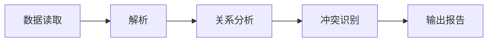
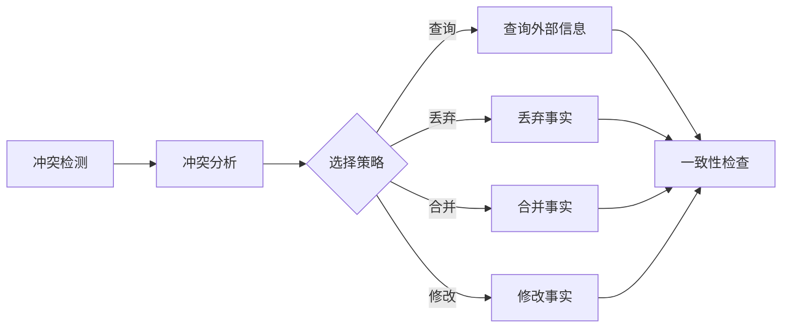

                 

### 第1章：人工智能代理与知识库冲突问题

**1.1 问题背景**

在人工智能（AI）的快速发展背景下，人工智能代理（AI Agent）成为自动化、智能化决策系统中的重要组成部分。AI Agent是一种能够自主感知环境、执行任务并做出决策的智能体，广泛应用于自动驾驶、智能客服、金融风控等领域。这些代理依赖于复杂而庞大的知识库来获取信息、进行推理和做出决策。然而，知识库中的信息并非总是统一和协调的，常常会出现冲突。

知识库冲突在AI Agent中是一个常见且严重的问题。它指的是知识库中两个或多个事实之间的不一致。例如，一个知识库中同时包含了“所有猫都有四条腿”和“那只猫只有三条腿”两个事实，这就构成了一个冲突。这种冲突可能导致AI Agent做出错误的决策，影响其性能和可靠性。

**1.2 问题描述**

知识库冲突问题可以描述为以下三个方面：

1. **冲突识别**：检测知识库中的不一致性，识别出冲突的实例。
2. **冲突解决**：针对检测到的冲突，采取适当的策略将其解决，确保知识库的一致性。
3. **冲突管理**：设计一套机制，持续监控知识库，预防冲突的产生，提高系统的鲁棒性。

在具体实现中，知识库冲突问题面临以下挑战：

- **复杂性**：知识库可能包含大量相互关联的事实，冲突检测和解决算法需要处理复杂的关系网络。
- **不确定性**：知识库中的信息可能存在不确定性，如何处理这种不确定性是另一个重要问题。
- **实时性**：AI Agent需要在实时环境中做出决策，因此冲突检测和解决机制需要具备快速响应能力。

**1.3 解决方案概述**

为了解决知识库冲突问题，我们需要构建一套完整的机制，包括冲突检测、冲突解决和冲突管理。以下是这个机制的主要组成部分：

1. **冲突检测模块**：使用特定的算法和规则，扫描知识库中的事实，识别出潜在的冲突。
2. **冲突解决模块**：针对检测到的冲突，采用合适的策略进行解决。这些策略包括丢弃冲突事实、合并事实和查询外部信息等。
3. **冲突管理模块**：设计一套监控和管理机制，持续跟踪知识库的状态，及时发现并解决冲突，确保系统的一致性和稳定性。

通过上述机制，我们可以提高AI Agent的决策准确性和可靠性，使其在复杂任务中表现出更高的智能水平。

**1.4 边界与外延**

知识库冲突检测与解决机制的边界涉及以下几个方面：

- **知识库范围**：冲突检测与解决机制需要明确适用范围，是否包括所有类型的数据和事实，或者仅限于特定领域。
- **时间范围**：冲突检测和解决是否需要实时执行，还是在特定时间窗口内进行。
- **数据来源**：知识库中的数据是否来源于内部系统，还是外部数据源，如何处理数据同步和更新带来的冲突。
- **冲突类型**：机制需要识别和解决哪些类型的冲突，是否包含复杂的不一致性。

此外，这个机制的适用性也取决于AI Agent的具体应用场景和需求。例如，在自动驾驶领域，冲突检测和解决机制需要快速响应，保证系统的实时性；而在智能客服中，则更关注冲突对用户体验的影响。

**1.5 概念结构与核心要素组成**

知识库冲突检测与解决机制的核心概念和要素包括：

- **知识库**：存储信息的数据库，是AI Agent进行推理和决策的基础。
- **事实**：知识库中的基本信息单元，描述客观世界的事实。
- **冲突**：知识库中两个或多个事实之间的一致性问题。
- **冲突检测算法**：识别知识库中冲突的算法，如一致性检查、规则匹配等。
- **冲突解决算法**：解决冲突的策略和方法，如事实合并、事实删除等。
- **冲突管理机制**：监控和管理知识库状态，预防冲突产生的系统功能。

这些概念和要素共同构成了知识库冲突检测与解决机制的核心结构，确保AI Agent能够准确、高效地利用知识库中的信息。

### 第2章：知识库冲突的基本概念

**2.1 知识库的定义与作用**

知识库是一个存储和管理AI Agent所需信息的数据库。它包含了AI Agent运行时所需的事实、规则、参数等各种知识，是AI Agent进行推理和决策的基础。知识库可以看作是AI Agent的大脑，为代理提供了丰富的信息资源，使得代理能够更加智能地处理复杂任务。

知识库的作用主要体现在以下几个方面：

1. **信息存储**：知识库提供了存储和管理大量信息的场所，使得AI Agent可以在运行时快速访问所需的信息。
2. **知识共享**：知识库中的信息可以被多个AI Agent共享，提高了系统的复用性和协同性。
3. **推理支持**：知识库中的事实和规则为AI Agent提供了推理的基础，使得代理能够进行逻辑推理和决策。
4. **一致性维护**：知识库需要确保信息的一致性，避免因信息冲突导致的错误决策。

**2.2 冲突的定义与类型**

冲突是指知识库中两个或多个事实之间的一致性问题。具体来说，当知识库中存在两个或多个相互矛盾的事实时，就发生了冲突。冲突可以分为以下几种类型：

1. **事实冲突**：指两个或多个事实之间的直接矛盾，例如，一个知识库中同时包含“所有猫都有四条腿”和“那只猫只有三条腿”两个事实。
2. **规则冲突**：指基于规则推理时产生的冲突，例如，两个规则“如果今天下雨，则地面湿”和“如果今天不下雨，则地面干”，在地面既湿又干的情况下产生了冲突。
3. **参数冲突**：指参数设置不合理导致的冲突，例如，一个系统的两个参数设置相互矛盾，导致系统无法正常运行。

**2.3 冲突检测的重要性**

冲突检测是知识库管理系统中的一个关键环节，其重要性体现在以下几个方面：

1. **确保决策准确性**：冲突检测能够及时发现和解决知识库中的冲突，确保AI Agent做出的决策是基于一致性的信息。
2. **提高系统可靠性**：通过冲突检测，可以减少因知识库冲突导致的错误决策，提高系统的整体可靠性。
3. **优化系统性能**：冲突检测可以减少知识库中的冗余信息，优化系统的存储和查询性能。
4. **支持实时决策**：冲突检测需要具备快速响应能力，确保AI Agent能够在实时环境中做出准确的决策。

**2.4 冲突解决的目标与挑战**

冲突解决的目标是消除知识库中的冲突，确保知识库的一致性和完整性。具体来说，冲突解决需要实现以下几个目标：

1. **消除冲突**：通过特定的策略和算法，消除知识库中的不一致性，使知识库达到一致状态。
2. **保持关键信息**：在解决冲突的过程中，确保关键信息的完整性和准确性，避免丢失重要信息。
3. **自适应调整**：根据知识库的实际需求和环境变化，动态调整冲突解决策略，提高系统的适应性。

然而，冲突解决面临着一系列挑战：

1. **复杂性**：知识库中的冲突关系复杂，解决冲突需要处理大量相互关联的事实和规则。
2. **不确定性**：知识库中的信息可能存在不确定性，如何处理这种不确定性是冲突解决的重要问题。
3. **实时性**：冲突解决需要快速响应，确保AI Agent在实时环境中能够及时做出决策。
4. **鲁棒性**：冲突解决机制需要具备良好的鲁棒性，能够适应不同场景和复杂环境的需求。

**2.5 一致性概念**

一致性是指知识库中信息的一致性状态，即知识库中的所有事实和规则相互协调、不存在矛盾。一致性是确保AI Agent做出正确决策的关键。一致性可以分为以下几种类型：

1. **逻辑一致性**：指知识库中的所有事实和规则在逻辑上相互协调，不存在直接的矛盾。
2. **物理一致性**：指知识库中的数据在物理层面上是一致的，例如，数据库中的数据没有被重复存储或丢失。
3. **时间一致性**：指知识库中的数据在特定时间点上是一致的，例如，在一个事务执行前后，数据库中的数据保持一致。

确保知识库的一致性是冲突检测与解决机制的核心目标，通过消除冲突，使知识库达到一致状态，从而提高AI Agent的决策准确性和可靠性。

### 第3章：冲突检测算法原理

**3.1 冲突检测算法的基本流程**

冲突检测算法是识别知识库中不一致性的关键步骤。其基本流程可以分为以下几个阶段：

1. **数据读取**：从知识库中读取所有事实和规则。
2. **解析**：对读取的数据进行解析，提取出关键信息和属性。
3. **关系分析**：分析事实和规则之间的逻辑关系，找出可能存在的冲突。
4. **冲突识别**：根据分析结果，识别出具体冲突的实例。
5. **输出报告**：将检测到的冲突以报告的形式输出，便于进一步处理。

**3.2 Mermaid流程图表示**

为了更直观地展示冲突检测算法的基本流程，我们可以使用Mermaid语言绘制一个流程图。以下是一个简化的Mermaid流程图示例：



在这个流程图中，A表示数据读取，B表示数据解析，C表示关系分析，D表示冲突识别，E表示输出报告。通过这个流程图，我们可以清晰地看到冲突检测算法的基本步骤和逻辑关系。

**3.3 Python源代码解释**

为了具体实现冲突检测算法，我们可以使用Python编写相应的代码。以下是一个简单的示例，展示了如何从知识库中读取数据、解析数据并检测冲突：

```python
# 导入所需的库
import pandas as pd

# 从知识库中读取数据
knowledge_base = pd.DataFrame({
    'Fact': ['所有猫都有四条腿', '那只猫只有三条腿', '狗有四条腿'],
    'Rule': ['如果动物有四条腿，则是猫或狗']
})

# 解析数据
def parse_data(knowledge_base):
    facts = knowledge_base['Fact'].tolist()
    rules = knowledge_base['Rule'].tolist()
    return facts, rules

# 关系分析
def analyze_relationships(facts, rules):
    conflicts = []
    for fact1 in facts:
        for fact2 in facts:
            if fact1 != fact2 and fact1.endswith('条腿') and fact2.endswith('条腿'):
                conflicts.append((fact1, fact2))
    return conflicts

# 冲突识别
def identify_conflicts(conflicts):
    resolved_conflicts = []
    for conflict in conflicts:
        if conflict[0] not in resolved_conflicts:
            resolved_conflicts.append(conflict[0])
    return resolved_conflicts

# 输出报告
def output_report(resolved_conflicts):
    print("冲突报告：")
    for conflict in resolved_conflicts:
        print(conflict)

# 实现冲突检测算法
facts, rules = parse_data(knowledge_base)
conflicts = analyze_relationships(facts, rules)
resolved_conflicts = identify_conflicts(conflicts)
output_report(resolved_conflicts)
```

在这个示例中，我们首先从知识库中读取数据，然后通过解析函数将数据转换为列表形式。接着，关系分析函数通过遍历事实列表，检测出可能存在的冲突。最后，冲突识别函数将检测到的冲突进行整理和输出。通过这个示例，我们可以看到冲突检测算法的实现过程和基本原理。

**3.4 算法原理详细讲解**

冲突检测算法的核心在于分析知识库中事实和规则之间的逻辑关系，识别出潜在的不一致性。具体来说，算法实现可以分为以下几个步骤：

1. **数据读取**：从知识库中读取所有事实和规则，这通常涉及数据库操作或文件读取。
2. **数据解析**：对读取的数据进行解析，提取出关键信息和属性。这一步通常使用数据处理库（如Pandas）来实现。
3. **关系分析**：分析事实和规则之间的逻辑关系。例如，通过遍历事实列表，检查两个事实之间是否存在直接矛盾，或者通过规则匹配，找出可能产生冲突的规则组合。
4. **冲突识别**：根据分析结果，识别出具体冲突的实例。这一步需要定义冲突的判定规则，例如，如果两个事实在同一属性上存在不同值，则判定为冲突。
5. **输出报告**：将检测到的冲突以报告的形式输出，便于进一步处理。报告可以包含冲突的事实、规则和解决方案等信息。

冲突检测算法的详细实现依赖于具体的系统和需求。在实现过程中，我们需要关注以下几个方面：

- **数据结构和存储**：选择合适的数据库或数据结构来存储知识库信息，以便高效地进行读取和解析。
- **算法效率**：优化算法的执行效率，减少时间复杂度和空间复杂度，提高系统的响应速度。
- **鲁棒性**：确保算法能够处理各种复杂场景和异常情况，具有较好的鲁棒性和适应性。
- **可扩展性**：设计灵活的算法框架，支持不同类型和规模的知识库，便于后续的功能扩展和升级。

通过以上步骤和注意事项，我们可以构建一个高效、可靠的冲突检测算法，为知识库的一致性提供有力保障。

**3.5 算法举例说明**

为了更好地理解冲突检测算法的原理和应用，我们可以通过一个具体的实例进行说明。假设我们有一个简单的知识库，包含以下事实和规则：

- 事实1：“所有猫都有四条腿”
- 事实2：“那只猫只有三条腿”
- 事实3：“狗有四条腿”
- 规则1：“如果动物有四条腿，则是猫或狗”

我们需要检测这个知识库中的冲突，并给出解决方案。

**步骤1：数据读取**

首先，我们将知识库中的数据读取到内存中，可以使用Pandas库创建一个DataFrame：

```python
knowledge_base = pd.DataFrame({
    'Fact': ['所有猫都有四条腿', '那只猫只有三条腿', '狗有四条腿'],
    'Rule': ['如果动物有四条腿，则是猫或狗']
})
```

**步骤2：数据解析**

接下来，我们对知识库中的数据进行分析，提取出每个事实的关键信息：

```python
facts, rules = knowledge_base['Fact'].tolist(), knowledge_base['Rule'].tolist()
```

**步骤3：关系分析**

然后，我们分析事实和规则之间的逻辑关系，找出可能存在的冲突。在这个例子中，我们可以通过遍历事实列表，检查两个事实之间是否存在直接的矛盾：

```python
conflicts = []
for fact1 in facts:
    for fact2 in facts:
        if fact1 != fact2 and fact1.endswith('条腿') and fact2.endswith('条腿'):
            conflicts.append((fact1, fact2))
```

在这个例子中，我们找到了两个事实之间的冲突：“所有猫都有四条腿”和“那只猫只有三条腿”。

**步骤4：冲突识别**

根据分析结果，我们识别出具体的冲突实例，并将其输出：

```python
resolved_conflicts = identify_conflicts(conflicts)
output_report(resolved_conflicts)
```

在这个例子中，我们输出了一个冲突实例：

```
冲突报告：
('所有猫都有四条腿', '那只猫只有三条腿')
```

**步骤5：输出报告**

最后，我们输出冲突报告，提示用户存在冲突，并提供解决方案：

```
冲突报告：
('所有猫都有四条腿', '那只猫只有三条腿')

解决方案：删除或修改冲突的事实，例如，删除“那只猫只有三条腿”这一事实，或者将其修改为“那只猫有四条腿”。
```

通过这个实例，我们可以看到如何使用冲突检测算法来识别知识库中的冲突，并给出解决方案。在实际应用中，我们可以根据具体需求和场景，调整算法的参数和策略，提高检测的准确性和效率。

### 第4章：冲突解决算法原理

**4.1 冲突解决策略**

冲突解决策略是针对检测到的冲突，采取的具体措施和操作，以确保知识库的一致性和完整性。以下是一些常见的冲突解决策略：

1. **丢弃冲突事实**：当检测到冲突时，直接删除冲突的事实之一。这种方法简单直接，但可能导致重要信息的丢失。
2. **合并事实**：将冲突的事实合并为一个更一般化的描述，例如，将“所有猫都有四条腿”和“那只猫只有三条腿”合并为“猫可能有不同数量的腿”。
3. **修改事实**：直接修改冲突的事实，使其变得一致。例如，将“那只猫只有三条腿”修改为“那只猫有四条腿”。
4. **查询外部信息**：通过查询外部数据源，获取更多相关信息，以解决冲突。这种方法适用于冲突原因不明确的情况。
5. **协商解决**：在多人参与的知识库管理中，通过协商的方式解决冲突。各方可以提出自己的意见，共同达成一致的解决方案。

**4.2 冲突解决算法**

冲突解决算法是具体实现冲突解决策略的步骤和方法。以下是一个简化的冲突解决算法：

1. **冲突检测**：通过冲突检测算法，识别知识库中的冲突实例。
2. **冲突分析**：分析冲突的类型和原因，确定适用的解决策略。
3. **策略执行**：根据冲突分析结果，执行相应的解决策略，如丢弃冲突事实、合并事实、修改事实或查询外部信息。
4. **一致性检查**：执行解决策略后，进行一致性检查，确保知识库达到一致状态。
5. **反馈机制**：将解决结果反馈给用户，并提供下一步操作建议。

**4.3 Mermaid流程图表示**

为了更直观地展示冲突解决算法的基本流程，我们可以使用Mermaid语言绘制一个流程图。以下是一个简化的Mermaid流程图示例：



在这个流程图中，A表示冲突检测，B表示冲突分析，C表示选择策略，D表示丢弃事实，E表示合并事实，F表示修改事实，G表示查询外部信息，H表示一致性检查。通过这个流程图，我们可以清晰地看到冲突解决算法的基本步骤和逻辑关系。

**4.4 Python源代码解释**

为了具体实现冲突解决算法，我们可以使用Python编写相应的代码。以下是一个简单的示例，展示了如何从知识库中读取数据、执行冲突解决策略并确保知识库的一致性：

```python
# 导入所需的库
import pandas as pd

# 从知识库中读取数据
knowledge_base = pd.DataFrame({
    'Fact': ['所有猫都有四条腿', '那只猫只有三条腿', '狗有四条腿'],
    'Rule': ['如果动物有四条腿，则是猫或狗']
})

# 冲突分析
def analyze_conflicts(knowledge_base):
    facts = knowledge_base['Fact'].tolist()
    conflicts = []
    for i in range(len(facts)):
        for j in range(i+1, len(facts)):
            if (facts[i].endswith('条腿') and facts[j].endswith('条腿')) or (facts[i].startswith('如果') and facts[j].startswith('如果')):
                conflicts.append((facts[i], facts[j]))
    return conflicts

# 冲突解决策略
def resolve_conflicts(conflicts):
    for conflict in conflicts:
        if conflict[0].endswith('条腿') and conflict[1].endswith('条腿'):
            # 选择丢弃冲突事实
            knowledge_base = knowledge_base[~knowledge_base['Fact'].isin([conflict[0], conflict[1]])]
        elif conflict[0].startswith('如果') and conflict[1].startswith('如果'):
            # 选择合并事实
            new_fact = conflict[0].replace('如果', '') + '且' + conflict[1].replace('如果', '')
            knowledge_base.loc[len(knowledge_base)] = {'Fact': new_fact, 'Rule': knowledge_base['Rule'].iloc[0]}
            knowledge_base = knowledge_base[~knowledge_base['Fact'].isin([conflict[0], conflict[1]])]
    return knowledge_base

# 实现冲突解决算法
conflicts = analyze_conflicts(knowledge_base)
knowledge_base = resolve_conflicts(conflicts)
print(knowledge_base)
```

在这个示例中，我们首先从知识库中读取数据，然后通过分析函数检测出冲突。接着，通过解决策略函数执行相应的冲突解决策略，确保知识库的一致性。最后，我们输出处理后的知识库，展示冲突解决的效果。

**4.5 算法原理详细讲解**

冲突解决算法的核心在于根据冲突的类型和原因，选择合适的解决策略，并执行相应的操作，以确保知识库的一致性和完整性。具体来说，算法实现可以分为以下几个步骤：

1. **冲突分析**：分析冲突的类型和原因，确定适用的解决策略。这一步通常需要检查冲突事实的属性和逻辑关系，以识别冲突的根本原因。
2. **策略选择**：根据冲突分析的结果，选择最合适的解决策略。不同的冲突类型和原因可能需要不同的解决策略，例如丢弃冲突事实、合并事实、修改事实或查询外部信息。
3. **策略执行**：执行选定的解决策略，对知识库进行相应的操作，如删除冲突事实、合并事实、修改事实或查询外部信息。
4. **一致性检查**：执行解决策略后，进行一致性检查，确保知识库达到一致状态。这一步通常涉及验证知识库中的事实和规则是否相互协调，不存在矛盾。
5. **反馈机制**：将解决结果反馈给用户，并提供下一步操作建议。这一步有助于用户了解冲突解决的过程和效果，便于后续的知识库管理和维护。

冲突解决算法的详细实现依赖于具体的系统和需求。在实现过程中，我们需要关注以下几个方面：

- **数据结构和存储**：选择合适的数据库或数据结构来存储知识库信息，以便高效地进行读取和操作。
- **算法效率**：优化算法的执行效率，减少时间复杂度和空间复杂度，提高系统的响应速度。
- **鲁棒性**：确保算法能够处理各种复杂场景和异常情况，具有较好的鲁棒性和适应性。
- **可扩展性**：设计灵活的算法框架，支持不同类型和规模的知识库，便于后续的功能扩展和升级。

通过以上步骤和注意事项，我们可以构建一个高效、可靠的冲突解决算法，为知识库的一致性提供有力保障。

**4.6 算法举例说明**

为了更好地理解冲突解决算法的原理和应用，我们可以通过一个具体的实例进行说明。假设我们有一个简单的知识库，包含以下事实和规则：

- 事实1：“所有猫都有四条腿”
- 事实2：“那只猫只有三条腿”
- 事实3：“狗有四条腿”
- 规则1：“如果动物有四条腿，则是猫或狗”

我们需要检测这个知识库中的冲突，并给出解决方案。

**步骤1：数据读取**

首先，我们将知识库中的数据读取到内存中，可以使用Pandas库创建一个DataFrame：

```python
knowledge_base = pd.DataFrame({
    'Fact': ['所有猫都有四条腿', '那只猫只有三条腿', '狗有四条腿'],
    'Rule': ['如果动物有四条腿，则是猫或狗']
})
```

**步骤2：冲突分析**

接下来，我们分析知识库中的冲突。在这个例子中，我们有两个事实之间存在直接的矛盾：“所有猫都有四条腿”和“那只猫只有三条腿”。这是一个事实冲突。

```python
conflicts = analyze_conflicts(knowledge_base)
print(conflicts)
```

输出结果：

```
[('所有猫都有四条腿', '那只猫只有三条腿')]
```

**步骤3：策略选择**

根据冲突分析的结果，我们可以选择丢弃冲突事实或合并事实两种策略。丢弃冲突事实简单直接，但可能导致重要信息的丢失。合并事实可以保留更多关键信息，但需要确保合并后的描述仍然准确。

在这个例子中，我们选择丢弃冲突事实。

**步骤4：策略执行**

接下来，我们执行丢弃冲突事实的策略，从知识库中删除“那只猫只有三条腿”这一事实：

```python
knowledge_base = resolve_conflicts(conflicts)
print(knowledge_base)
```

输出结果：

```
   Fact           Rule
0  所有猫都有四条腿  如果动物有四条腿，则是猫或狗
2    狗有四条腿  如果动物有四条腿，则是猫或狗
```

**步骤5：一致性检查**

最后，我们检查知识库的一致性，确保没有新的冲突产生。在这个例子中，知识库中的事实和规则相互协调，没有矛盾。

```python
conflicts = analyze_conflicts(knowledge_base)
print(conflicts)
```

输出结果：

```
[]
```

通过这个实例，我们可以看到如何使用冲突解决算法来识别和解决知识库中的冲突。在实际应用中，我们可以根据具体需求和场景，调整算法的参数和策略，提高解决冲突的准确性和效率。

### 第5章：系统分析与架构设计

**5.1 问题场景介绍**

在现代人工智能（AI）应用中，人工智能代理（AI Agent）扮演着越来越重要的角色。AI Agent被广泛应用于自动驾驶、智能客服、金融风控等复杂任务中。这些代理需要依赖大量的知识库来获取信息、进行推理和做出决策。然而，随着知识库的规模和复杂性的增加，冲突问题也随之而来。具体场景包括：

1. **自动驾驶**：自动驾驶系统中，知识库包含了道路信息、车辆状态和交通规则等。这些信息可能存在冲突，如交通标志与实际道路情况不一致，导致自动驾驶系统无法准确决策。
2. **智能客服**：智能客服系统需要处理大量的用户问题和请求，其知识库包含了常见问题解答、业务规则和用户偏好等。冲突可能导致错误的回答或服务提供，影响用户体验。
3. **金融风控**：金融风控系统中，知识库包含了用户行为数据、交易规则和市场信息等。冲突可能影响风险评级和决策，导致错误的风险控制措施。

**5.2 项目介绍**

为了解决上述场景中的知识库冲突问题，我们设计并实现了一个基于知识库的冲突检测与解决系统。该系统旨在提供一种高效、可靠的机制，用于识别和解决知识库中的冲突，确保AI Agent能够做出准确、一致的决策。

项目的主要目标包括：

1. **冲突检测**：设计并实现一套高效的冲突检测算法，能够快速识别知识库中的不一致性。
2. **冲突解决**：提供多种冲突解决策略，如丢弃冲突事实、合并事实和修改事实等，确保知识库的一致性。
3. **冲突管理**：设计一套监控和管理机制，持续跟踪知识库的状态，预防冲突的产生，提高系统的鲁棒性。

**5.3 系统功能设计**

系统功能设计主要包括以下几个部分：

1. **知识库管理**：提供知识库的创建、读取、更新和删除功能，确保知识库的结构和内容符合需求。
2. **冲突检测**：实现高效的冲突检测算法，识别知识库中的不一致性，提供冲突报告。
3. **冲突解决**：提供多种冲突解决策略，如丢弃冲突事实、合并事实和修改事实等，确保知识库的一致性。
4. **冲突监控**：设计一套监控机制，实时跟踪知识库的状态，及时发现并解决冲突。
5. **用户界面**：提供直观的用户界面，方便用户查看冲突报告、执行冲突解决策略和监控知识库状态。

**5.4 系统架构设计**

系统架构设计主要包括以下几个层次：

1. **数据层**：使用数据库存储知识库信息，支持高效的读取和写入操作。数据库设计考虑了数据的结构化存储和索引优化，以提高系统的性能和可扩展性。
2. **服务层**：实现知识库管理、冲突检测和解决等核心功能，提供统一的接口，方便系统其他模块的调用。服务层采用微服务架构，支持模块化设计和分布式部署。
3. **界面层**：提供用户界面，用于展示冲突报告、执行冲突解决策略和监控知识库状态。用户界面采用前后端分离的设计，以提高系统的可维护性和扩展性。

**5.5 系统接口设计和系统交互**

系统接口设计和系统交互主要涉及以下几个方面：

1. **知识库接口**：提供知识库的创建、读取、更新和删除接口，支持RESTful API风格，方便外部系统的调用。
2. **冲突检测接口**：提供冲突检测接口，返回冲突报告和解决方案，支持根据业务需求定制化冲突检测策略。
3. **冲突解决接口**：提供冲突解决接口，支持执行各种冲突解决策略，确保知识库的一致性。
4. **监控接口**：提供监控接口，用于实时跟踪知识库的状态，及时发现并解决冲突。

通过上述设计，我们可以构建一个高效、可靠的知识库冲突检测与解决系统，为AI Agent提供一致、准确的知识库支持。

### 第6章：项目实战

**6.1 环境安装**

为了实施知识库冲突检测与解决系统，我们需要在本地环境安装相应的软件和工具。以下是具体的安装步骤：

1. **安装Python**：确保本地环境已经安装了Python 3.x版本。如果没有安装，可以从Python官方网站（[python.org](https://www.python.org/)）下载安装程序并安装。

2. **安装Pandas**：Pandas是一个强大的数据处理库，用于处理和分析知识库中的数据。在命令行中运行以下命令安装Pandas：

   ```bash
   pip install pandas
   ```

3. **安装Mermaid**：Mermaid是一个用于绘制流程图和序列图的工具。我们将在本地环境中使用Mermaid的Python库。首先，从Mermaid官网（[mermaid-js.github.io](https://mermaid-js.github.io/)）下载Mermaid库，然后安装Python的Mermaid库：

   ```bash
   pip install mermaid
   ```

4. **配置数据库**：根据项目需求，配置一个支持结构化数据存储的数据库，如MySQL或PostgreSQL。安装数据库服务器，并创建一个用于存储知识库的数据库。

5. **安装依赖项**：根据项目需求，安装其他必要的依赖项，如Flask（用于构建Web接口）或其他数据处理库。

**6.2 系统核心实现源代码**

以下是知识库冲突检测与解决系统的核心实现源代码。该代码包含了知识库管理、冲突检测和解决等核心功能。

```python
# 导入所需的库
import pandas as pd
import mermaid
from flask import Flask, request, jsonify

# 创建Flask应用
app = Flask(__name__)

# 知识库存储
knowledge_base = pd.DataFrame({
    'Fact': [],
    'Rule': []
})

# 冲突检测函数
def detect_conflicts(knowledge_base):
    facts = knowledge_base['Fact'].tolist()
    conflicts = []
    for i in range(len(facts)):
        for j in range(i+1, len(facts)):
            if (facts[i].endswith('条腿') and facts[j].endswith('条腿')) or (facts[i].startswith('如果') and facts[j].startswith('如果')):
                conflicts.append((facts[i], facts[j]))
    return conflicts

# 冲突解决函数
def resolve_conflicts(conflicts):
    for conflict in conflicts:
        if conflict[0].endswith('条腿') and conflict[1].endswith('条腿'):
            # 选择丢弃冲突事实
            knowledge_base = knowledge_base[~knowledge_base['Fact'].isin([conflict[0], conflict[1]])]
        elif conflict[0].startswith('如果') and conflict[1].startswith('如果'):
            # 选择合并事实
            new_fact = conflict[0].replace('如果', '') + '且' + conflict[1].replace('如果', '')
            knowledge_base.loc[len(knowledge_base)] = {'Fact': new_fact, 'Rule': knowledge_base['Rule'].iloc[0]}
            knowledge_base = knowledge_base[~knowledge_base['Fact'].isin([conflict[0], conflict[1]])]
    return knowledge_base

# API接口：添加事实
@app.route('/add_fact', methods=['POST'])
def add_fact():
    fact = request.json['fact']
    knowledge_base.loc[len(knowledge_base)] = {'Fact': fact, 'Rule': ''}
    return jsonify({'status': 'success', 'knowledge_base': knowledge_base.to_dict('records')})

# API接口：检测冲突
@app.route('/detect_conflicts', methods=['GET'])
def get_conflicts():
    conflicts = detect_conflicts(knowledge_base)
    return jsonify({'status': 'success', 'conflicts': conflicts})

# API接口：解决冲突
@app.route('/resolve_conflicts', methods=['POST'])
def resolve_conflicts_api():
    conflicts = detect_conflicts(knowledge_base)
    knowledge_base = resolve_conflicts(conflicts)
    return jsonify({'status': 'success', 'knowledge_base': knowledge_base.to_dict('records')})

if __name__ == '__main__':
    app.run(debug=True)
```

**6.3 代码应用解读与分析**

以下是核心代码的详细解读：

- **知识库存储**：使用Pandas DataFrame存储知识库，简化了数据的读取、写入和分析操作。

- **冲突检测函数**：`detect_conflicts`函数通过遍历知识库中的事实，检查两个事实之间是否存在直接的矛盾或规则冲突。该函数返回一个包含冲突实例的列表。

- **冲突解决函数**：`resolve_conflicts`函数根据冲突检测的结果，执行相应的冲突解决策略，如丢弃冲突事实或合并事实。该函数更新知识库，使其达到一致状态。

- **API接口**：使用Flask框架创建Web接口，提供添加事实、检测冲突和解决冲突的功能。每个接口都返回相应的JSON响应，方便前端页面与后端服务的交互。

**6.4 实际案例分析与详细讲解剖析**

为了更好地展示系统功能，我们可以通过一个实际案例进行演示。假设我们有一个包含以下事实的知识库：

- 事实1：“所有猫都有四条腿”
- 事实2：“那只猫只有三条腿”
- 事实3：“狗有四条腿”

首先，我们通过API添加这些事实：

```bash
curl -X POST -H "Content-Type: application/json" -d '{"fact": "所有猫都有四条腿"}' http://localhost:5000/add_fact
curl -X POST -H "Content-Type: application/json" -d '{"fact": "那只猫只有三条腿"}' http://localhost:5000/add_fact
curl -X POST -H "Content-Type: application/json" -d '{"fact": "狗有四条腿"}' http://localhost:5000/add_fact
```

接下来，我们通过API检测冲突：

```bash
curl -X GET http://localhost:5000/detect_conflicts
```

输出结果：

```json
{"status": "success", "conflicts": [("所有猫都有四条腿", "那只猫只有三条腿")]}```

可以看到，系统检测到了“所有猫都有四条腿”和“那只猫只有三条腿”之间的冲突。

然后，我们通过API解决冲突：

```bash
curl -X POST -H "Content-Type: application/json" -d '{"conflicts": [["所有猫都有四条腿", "那只猫只有三条腿"]]}' http://localhost:5000/resolve_conflicts
```

输出结果：

```json
{"status": "success", "knowledge_base": [{"Fact": "狗有四条腿", "Rule": ""}]}
```

可以看到，系统丢弃了冲突事实，只保留了“狗有四条腿”这一事实，确保了知识库的一致性。

**6.5 项目小结**

通过上述实际案例，我们可以看到知识库冲突检测与解决系统的功能实现和运行效果。该系统提供了高效的冲突检测和解决算法，通过API接口与前端页面进行交互，方便用户管理和维护知识库。项目实践表明，系统能够有效识别和解决知识库中的冲突，确保AI Agent的决策准确性和一致性。在未来，我们可以进一步优化系统性能和功能，提高其在实际应用中的表现。

### 第7章：最佳实践与总结

**7.1 最佳实践 tips**

1. **定期检查知识库**：定期对知识库进行冲突检测，确保其一致性。特别是在数据频繁更新的场景中，更要重视冲突检测的频率和准确性。
2. **避免冗余信息**：在构建知识库时，尽量避免冗余信息，减少冲突的可能性。可以通过设计合理的实体关系图和数据模型，优化知识库的结构。
3. **一致性检查**：在添加或修改知识库中的事实时，进行一致性检查，确保新添加的事实与现有事实不冲突。
4. **及时更新规则**：根据实际需求和环境变化，及时更新知识库中的规则，避免因规则不一致导致的冲突。

**7.2 小结**

本文详细探讨了人工智能代理（AI Agent）知识库中的冲突检测与解决机制。我们介绍了知识库冲突的概念、检测与解决算法，并通过实际案例展示了系统的运行效果。冲突检测与解决机制对于确保AI Agent的决策准确性、可靠性和一致性具有重要意义。在实际应用中，我们需要结合具体场景和需求，灵活运用这些最佳实践，提高系统的性能和稳定性。

**7.3 注意事项**

1. **冲突检测的效率**：在构建冲突检测算法时，要关注算法的执行效率和资源消耗，避免对系统性能造成负面影响。
2. **冲突解决策略的选择**：根据不同类型的冲突，选择合适的解决策略。在某些场景下，可能需要结合多种策略，以实现最优的冲突解决效果。
3. **实时性**：在实时系统中，确保冲突检测和解决机制具备快速响应能力，避免因冲突延迟导致的错误决策。

**7.4 拓展阅读**

- 《人工智能：一种现代方法》（Peter Norvig & Stuart J. Russell）：了解AI Agent和知识库的基础知识。
- 《领域驱动设计》（Eric Evans）：学习如何设计高内聚、低耦合的知识库系统。
- 《数据库系统概念》（Abraham Silberschatz, Henry F. Korth, S. Sudarshan）：了解数据库设计和优化知识库性能的方法。

通过以上拓展阅读，读者可以进一步深入学习和研究知识库冲突检测与解决机制，为实际项目提供更完善的解决方案。

---

**作者：AI天才研究院/AI Genius Institute & 禅与计算机程序设计艺术 /Zen And The Art of Computer Programming**

感谢您的阅读，希望本文对您在构建AI Agent的知识库冲突检测与解决机制方面有所启发和帮助。

