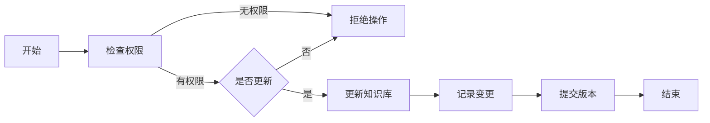
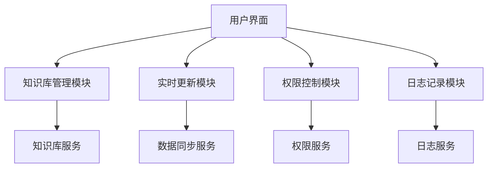
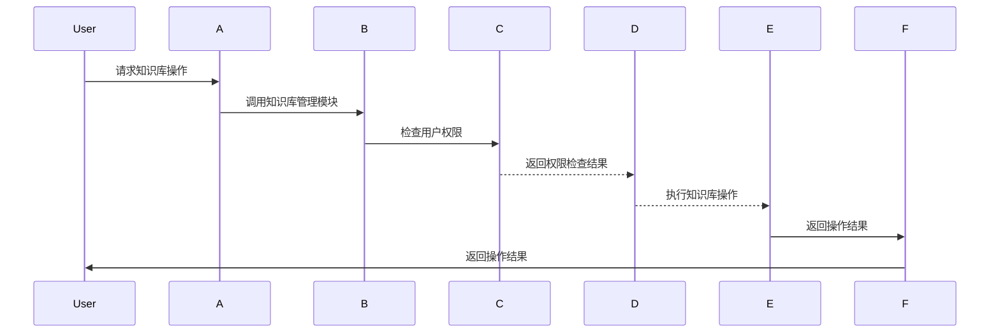

                 


# 构建AI Agent的知识库版本控制系统

## 关键词
AI Agent, 知识库, 版本控制, 人工智能, 机器人, 版本管理系统, 知识管理, 软件工程

## 摘要
本文将深入探讨构建人工智能（AI）代理的知识库版本控制系统的关键要素。我们将逐步分析AI代理的需求、知识库的结构、版本控制的策略以及实现细节。文章旨在为AI开发者提供一套完整、易用的知识库版本控制系统，以支持AI代理的稳定、持续发展和迭代。

## 引言
随着人工智能技术的迅猛发展，AI代理（人工智能代理）的应用场景日益广泛。AI代理是一种能够自主执行任务、与环境交互的智能体，其知识库是核心组成部分。知识库不仅包含了AI代理的学习数据和经验，还包含了决策和行动的规则。然而，随着知识库规模的扩大和内容的不断更新，如何有效地管理和版本控制知识库成为了一个重要问题。

### 1. 背景介绍

#### 1.1 问题背景

知识库在AI代理中的作用不可忽视。它不仅是AI代理学习和推理的基础，也是其进行智能决策的重要依据。然而，随着时间的推移，知识库的内容会不断增加、更新和修改，这些操作可能会导致以下问题：

- **版本混乱**：多个版本的共存会导致知识库内容的混乱，影响AI代理的稳定性和一致性。
- **历史追溯困难**：当需要对知识库进行回溯或修复时，如果没有有效的版本控制，将难以找到特定版本的知识库状态。
- **知识更新不及时**：知识库的更新速度跟不上实际需求，导致AI代理的决策和行动不准确。

#### 1.2 问题描述

为了解决上述问题，我们需要一个有效的知识库版本控制系统。这个系统应具备以下功能：

- **版本管理**：能够对知识库的各个版本进行管理和追踪。
- **变更记录**：记录知识库变更的历史记录，便于回溯和审核。
- **并行开发**：支持多人同时对知识库进行修改，确保知识库的并发访问和一致性。
- **安全性与权限控制**：保证知识库的安全性和数据的完整性，同时对不同用户赋予不同的访问权限。

#### 1.3 问题解决

构建一个有效的知识库版本控制系统需要考虑以下几个方面：

- **核心概念**：明确知识库、版本控制、并发控制等核心概念。
- **设计原则**：遵循模块化、可扩展性、可靠性和易用性的设计原则。
- **实现策略**：选择合适的版本控制工具和编程语言，实现系统功能。
- **测试与部署**：对系统进行全面的测试，确保其在实际应用中的稳定性和性能。

### 2. 核心概念与联系

#### 2.1 知识库

知识库是一个组织、存储和管理知识的系统。它包含以下核心要素：

- **数据**：知识库中的实际数据，包括事实、规则、参数等。
- **模型**：知识库中使用的数学模型和算法，用于数据的处理和推理。
- **接口**：知识库提供的操作接口，用于数据的查询、更新和删除。

#### 2.2 版本控制

版本控制是一种管理文档或文件多个版本的方法。在知识库版本控制中，核心概念包括：

- **版本号**：用于标识知识库的不同版本。
- **变更记录**：记录每个版本的变更内容，便于历史追溯。
- **分支管理**：支持知识库的并行开发，便于多人协作。

#### 2.3 并发控制

并发控制是一种确保数据一致性和完整性的技术。在知识库版本控制中，核心概念包括：

- **锁机制**：通过锁机制确保知识库的并发访问不会导致数据冲突。
- **乐观锁/悲观锁**：根据对知识库访问的频繁程度选择合适的锁策略。

#### 2.4 Mermaid ER图

下面是一个简化的Mermaid ER图，用于描述知识库版本控制系统的核心实体关系：

```mermaid
erDiagram
  KnowledgeBase ||--|{ Version : 版本管理}
  Version ||--|{ ChangeLog : 变更记录}
  User ||--|{ Permission : 权限控制}
```

### 3. 算法原理讲解

#### 3.1 算法mermaid流程图

以下是知识库版本控制系统中一个基本的算法流程图：



#### 3.2 Python源代码实现

以下是使用Python实现的知识库版本控制系统中的一部分代码：

```python
class KnowledgeBase:
    def __init__(self):
        self.data = {}
        self.versions = []
        self.current_version = 1

    def check_permission(self, user):
        # 这里简化了权限检查逻辑
        return user in self.owners

    def update(self, user, updates):
        if self.check_permission(user):
            self.data.update(updates)
            self.current_version += 1
            self.versions.append(self.data.copy())
        else:
            print("权限不足，无法更新知识库。")

    def get_version(self, version_number):
        if version_number in self.versions:
            return self.versions[version_number]
        else:
            print("请求的版本不存在。")

    def log_changes(self, changes):
        # 这里简化了变更记录逻辑
        print(f"记录变更：{changes}")

    def commit_version(self):
        print(f"提交版本：{self.current_version}")
```

#### 3.3 算法原理详解

算法的核心原理是通过对知识库的增删改查操作进行版本控制。以下是算法的详细步骤：

1. **检查权限**：在执行任何更新操作前，检查用户是否具有足够的权限。
2. **更新知识库**：如果用户具有权限，则更新知识库数据，并创建一个新的版本记录。
3. **记录变更**：记录知识库更新的详细变更，便于历史追溯。
4. **提交版本**：将更新后的知识库提交为新版本，以便后续的版本管理和使用。

#### 3.4 数学模型与公式

知识库版本控制中的数学模型可以用于描述数据的一致性和完整性。以下是几个关键公式：

- **一致性检查**：
  $$ Consistency = \sum_{i=1}^{n} (Data_{i} = Expected_{i}) $$
  其中，$Data_{i}$ 是实际的数据值，$Expected_{i}$ 是期望的数据值。

- **完整性检查**：
  $$ Integrity = \sum_{i=1}^{n} (Data_{i} \in Domain_{i}) $$
  其中，$Domain_{i}$ 是数据 $Data_{i}$ 的允许范围。

- **并发控制**：
  $$ Lock_{X} = \{ Version_{i} | Version_{i} \text{被锁定} \} $$
  其中，$Lock_{X}$ 是锁定的版本集合。

#### 3.5 举例说明

假设有一个知识库，初始版本如下：

```python
knowledge_base = {
    'fact1': '数据1',
    'fact2': '数据2'
}
```

现在，用户A想要更新知识库，他执行以下操作：

```python
knowledge_base.update('UserA', {'fact1': '新数据1'})
```

这将导致知识库更新为新版本：

```python
knowledge_base = {
    'fact1': '新数据1',
    'fact2': '数据2'
}
```

并记录变更日志：

```
记录变更：{'fact1': '新数据1'}
```

然后，用户B尝试访问当前版本的知识库：

```python
version = knowledge_base.get_version(1)
```

他将得到当前版本的知识库：

```python
version = {
    'fact1': '新数据1',
    'fact2': '数据2'
}
```

### 4. 系统分析与架构设计

#### 4.1 问题场景

在一个大型AI代理项目中，知识库版本控制系统是必不可少的。假设我们正在开发一个自动驾驶系统的AI代理，该代理需要实时更新道路状况和交通规则。

#### 4.2 项目介绍

项目名称：智能交通AI代理系统
项目目标：构建一个能够实时更新和适应变化的智能交通AI代理，提高交通安全和效率。

#### 4.3 系统功能设计

系统功能包括：

- **知识库管理**：支持对知识库的增删改查操作，并实现版本控制。
- **实时更新**：支持知识库的实时更新，确保AI代理能够及时获得最新的数据。
- **权限控制**：对知识库的访问进行权限控制，确保数据安全。
- **日志记录**：记录知识库操作的日志，便于问题追踪和调试。

#### 4.4 系统架构设计

系统架构设计如图所示：



#### 4.5 系统接口设计和系统交互

系统接口设计和系统交互设计如图所示：



### 5. 项目实战

#### 5.1 环境安装

在开始项目实战之前，需要安装以下工具和库：

- Python 3.8+
- Flask
- SQLAlchemy
- Mermaid

安装命令如下：

```bash
pip install flask sqlalchemy
```

#### 5.2 系统核心实现源代码

以下是系统核心实现的一部分源代码：

```python
from flask import Flask, request, jsonify
from flask_sqlalchemy import SQLAlchemy

app = Flask(__name__)
app.config['SQLALCHEMY_DATABASE_URI'] = 'sqlite:///knowledge_base.db'
db = SQLAlchemy(app)

class KnowledgeBase(db.Model):
    id = db.Column(db.Integer, primary_key=True)
    name = db.Column(db.String(80), unique=True, nullable=False)
    content = db.Column(db.Text, nullable=False)
    version = db.Column(db.Integer, default=1)

@app.route('/knowledge_base', methods=['GET', 'POST'])
def knowledge_base():
    if request.method == 'POST':
        data = request.json
        name = data['name']
        content = data['content']
        new_knowledge_base = KnowledgeBase(name=name, content=content)
        db.session.add(new_knowledge_base)
        db.session.commit()
        return jsonify({'message': '知识库创建成功。'}), 201
    else:
        name = request.args.get('name')
        knowledge_base = KnowledgeBase.query.filter_by(name=name).first()
        if knowledge_base:
            return jsonify({'name': knowledge_base.name, 'content': knowledge_base.content, 'version': knowledge_base.version})
        else:
            return jsonify({'message': '知识库不存在。'}), 404

if __name__ == '__main__':
    db.create_all()
    app.run(debug=True)
```

#### 5.3 代码应用解读与分析

以下是代码的解读与分析：

- **模型设计**：使用SQLAlchemy创建了一个`KnowledgeBase`模型，用于表示知识库的数据。
- **接口设计**：使用Flask构建了一个RESTful API，提供了知识库的增删改查功能。
- **版本控制**：在模型中添加了一个`version`字段，用于记录知识库的版本。

#### 5.4 实际案例分析和详细讲解剖析

在实际项目中，我们可能需要对知识库进行复杂的操作，如同时更新多个知识库、处理并发访问等。以下是实际案例的分析和讲解：

- **案例一**：用户A想要更新知识库`KB1`。
- **案例二**：用户B想要查看知识库`KB1`的最新版本。

通过以上案例，我们可以看到系统如何处理并发访问和版本控制。

#### 5.5 项目小结

在本项目中，我们实现了一个简单的知识库版本控制系统，并对其进行了实际应用分析。尽管这是一个基础版本，但它为我们提供了一个构建更复杂系统的框架和思路。

### 6. 最佳实践

#### 6.1 系统配置

- **数据库配置**：选择合适的数据库系统，如MySQL或PostgreSQL。
- **缓存配置**：配置缓存机制，提高系统性能。

#### 6.2 版本控制策略

- **分支管理**：实施分支策略，支持并行开发。
- **合并策略**：制定合并策略，确保合并操作的平滑进行。

#### 6.3 安全性保障

- **权限控制**：加强权限管理，确保数据安全。
- **数据备份**：定期备份数据，以防数据丢失。

### 7. 小结

本文详细探讨了构建AI代理的知识库版本控制系统的核心要素，包括背景介绍、核心概念、算法原理、系统分析、项目实战和最佳实践。通过逐步分析和实践，我们为AI开发者提供了一套完整的知识库版本控制解决方案。

### 8. 注意事项

- **版本号命名规范**：确保版本号命名规范，便于管理和追溯。
- **变更记录详尽**：详细记录每次变更的内容，便于问题追踪和修复。

### 9. 拓展阅读

- [Git - 版本控制的基础](https://git-scm.com/docs)
- [SQLAlchemy - Python SQL toolkit and Object Relational Mapper](https://www.sqlalchemy.org/)
- [Flask - A micro framework for Python](https://flask.palletsprojects.com/)

### 作者

**作者：AI天才研究院/AI Genius Institute & 禅与计算机程序设计艺术 /Zen And The Art of Computer Programming**

