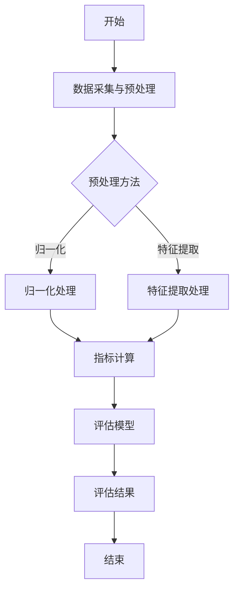
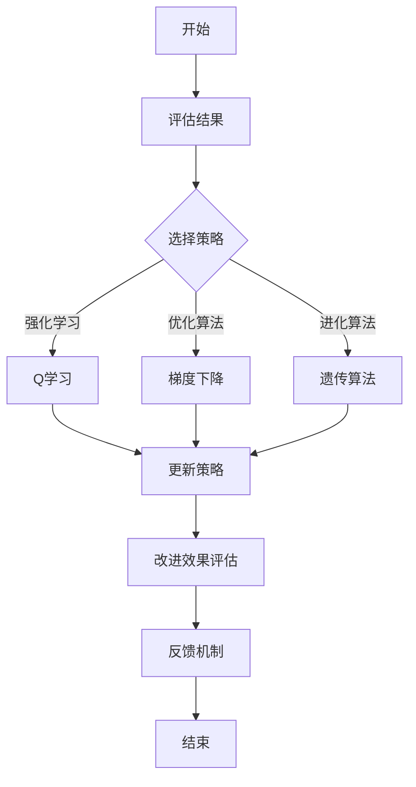
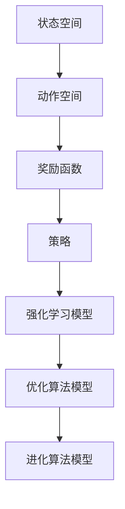

                 

# 构建AI Agent的自我评估与改进系统

## 关键词

- **AI Agent**  
- **自我评估系统**  
- **改进系统**  
- **算法实现**  
- **项目实战**  
- **最佳实践**

## 摘要

本文旨在深入探讨构建AI Agent的自我评估与改进系统的核心概念、原理和方法。随着人工智能技术的迅猛发展，AI Agent在各个领域的应用越来越广泛，但如何确保其持续、高效地运作成为一个关键问题。本文首先介绍了AI Agent的发展背景与核心概念，随后详细阐述了自我评估与改进系统的设计原理和实现方法。通过项目实战与案例分析，本文展示了如何将理论转化为实际操作，并为读者提供了最佳实践和注意事项。希望通过本文，能够为AI Agent领域的研究者和开发者提供有价值的参考。

## 目录大纲

### 第一部分：背景介绍与核心概念

#### 第1章：问题背景与核心概念

- **1.1 问题背景**  
- **1.2 核心概念**  
- **1.3 概念联系与对比**

#### 第2章：AI Agent的自我评估系统设计

- **2.1 自我评估系统的基本框架**  
- **2.2 自我评估的指标体系**  
- **2.3 自我评估的算法实现**

#### 第3章：AI Agent的改进系统设计

- **3.1 改进系统的基本框架**  
- **3.2 改进系统的核心算法**  
- **3.3 改进系统的数学模型**

### 第二部分：AI Agent的自我评估原理

#### 第4章：自我评估系统设计

- **4.1 自我评估系统的基本框架**  
- **4.2 自我评估的指标体系**  
- **4.3 自我评估的算法实现**

### 第三部分：AI Agent的改进原理

#### 第5章：改进系统设计

- **5.1 改进系统的基本框架**  
- **5.2 改进系统的核心算法**  
- **5.3 改进系统的数学模型**

### 第四部分：项目实战与案例分析

#### 第6章：构建自我评估与改进系统

- **6.1 项目概述**  
- **6.2 系统核心实现**  
- **6.3 案例分析与解读**

#### 第7章：实战拓展与最佳实践

- **7.1 实战拓展**  
- **7.2 最佳实践**  
- **7.3 注意事项与小结**

### 第五部分：总结与展望

#### 第8章：总结

- **8.1 本书内容的回顾**  
- **8.2 关键技术的总结**

#### 第9章：展望

- **9.1 AI Agent技术的发展趋势**  
- **9.2 自我评估与改进系统的未来应用前景**

## 第一部分：背景介绍与核心概念

### 第1章：问题背景与核心概念

#### 1.1 问题背景

人工智能（AI）作为当代最具变革性的技术之一，已经广泛应用于各个领域，从自动化生产、智能推荐系统到自动驾驶等。随着AI技术的不断发展，AI Agent作为一种具备自主决策能力的人工智能实体，越来越受到关注。AI Agent可以理解为一个能够感知环境、制定计划并采取行动的智能实体。它们能够模拟人类行为，解决复杂问题，并具备持续学习和适应新情况的能力。

然而，在实际应用中，AI Agent面临诸多挑战。首先，AI Agent需要具备自我评估能力，以便实时了解自身在执行任务时的表现，并识别潜在的问题。其次，AI Agent需要具备自我改进能力，通过不断学习和调整，提高任务完成的效率和准确性。自我评估与改进系统成为确保AI Agent性能稳定和不断提升的关键。

#### 1.2 核心概念

- **AI Agent**：AI Agent是指具备一定智能，能够在特定环境下自主决策和执行任务的实体。根据其功能和特点，AI Agent可以分为专家系统、基于模型的Agent、行为树Agent等。

- **自我评估系统**：自我评估系统是指AI Agent用于评价自身表现的一系列机制和算法。它通过收集和分析任务执行过程中的数据，对Agent的性能、可靠性、适应性等指标进行评估。

- **改进系统**：改进系统是指AI Agent用于自我优化的一系列机制和算法。它通过分析自我评估的结果，调整模型参数、策略和行为，以提高Agent的整体性能。

#### 1.3 概念联系与对比

- **自我评估系统与改进系统的关系**：自我评估系统是改进系统的基础，它为改进系统提供了评估结果。而改进系统则是自我评估系统的应用，通过反馈和调整，实现AI Agent的自我优化。

- **不同AI Agent的自我评估与改进策略**：不同的AI Agent具有不同的功能和应用场景，其自我评估与改进策略也有所差异。例如，基于模型的Agent可能更关注模型参数的优化，而行为树Agent则可能更关注决策树的调整。

## 第二部分：AI Agent的自我评估原理

### 第2章：自我评估系统设计

#### 2.1 自我评估系统的基本框架

自我评估系统的设计涉及多个关键组成部分，包括数据采集与预处理、指标定义与选择、评估模型与方法等。

- **数据采集与预处理**：自我评估系统需要收集AI Agent在任务执行过程中的各类数据，如输入数据、输出结果、中间状态等。这些数据需要进行预处理，包括数据清洗、归一化、特征提取等，以便后续的分析。

- **指标定义与选择**：评估指标是自我评估系统的核心，它们用于量化AI Agent在任务执行中的表现。常见的评估指标包括性能指标（如准确率、召回率）、可靠性指标（如成功率、错误率）和适应性指标（如适应度、响应时间）。

- **评估模型与方法**：评估模型是自我评估系统的关键组件，用于对AI Agent的表现进行定量分析。常见的评估模型包括统计模型、机器学习模型、深度学习模型等。评估方法则包括数据分析、指标计算、模型训练与验证等。

#### 2.2 自我评估的指标体系

自我评估的指标体系是评估AI Agent性能的重要基础。以下是一些常见的评估指标：

- **性能指标**：性能指标直接反映AI Agent在任务完成方面的表现。常见的性能指标包括准确率、召回率、F1值等。

- **可靠性指标**：可靠性指标评估AI Agent在任务执行中的稳定性。常见的可靠性指标包括成功率、错误率、失效率等。

- **适应性指标**：适应性指标评估AI Agent在面对新环境和任务时的适应能力。常见的适应性指标包括适应度、响应时间、学习能力等。

#### 2.3 自我评估的算法实现

自我评估算法是实现自我评估系统的重要工具。以下是一些常用的自我评估算法：

- **统计分析算法**：如均值、中位数、标准差等，用于计算和评估AI Agent的表现。

- **机器学习算法**：如回归分析、决策树、支持向量机等，用于建立评估模型，对AI Agent的表现进行定量分析。

- **深度学习算法**：如神经网络、卷积神经网络、循环神经网络等，用于处理复杂的数据和任务，实现高精度的评估。

为了更好地理解这些算法的实现原理，我们可以使用Mermaid绘制一个简单的算法流程图：



以上算法流程图展示了自我评估系统中的关键步骤，包括数据采集与预处理、指标计算、评估模型训练和评估结果输出。

## 第三部分：AI Agent的改进原理

### 第3章：改进系统设计

#### 3.1 改进系统的基本框架

改进系统的设计涉及多个关键组成部分，包括改进策略选择、改进模型与方法、改进过程的监控与反馈等。

- **改进策略选择**：改进策略是改进系统的核心，它决定了AI Agent如何根据评估结果进行调整。常见的改进策略包括基于规则的改进策略、基于机器学习的改进策略和基于优化的改进策略。

- **改进模型与方法**：改进模型是改进系统的关键组件，用于实现AI Agent的自我优化。常见的改进模型包括强化学习模型、优化算法模型、进化算法模型等。

- **改进过程的监控与反馈**：改进过程的监控与反馈是确保改进系统有效运行的重要环节。它包括对改进过程的实时监控、对改进效果的评估和反馈机制的建立。

#### 3.2 改进系统的核心算法

改进系统的核心算法是实现自我优化的重要工具。以下是一些常用的改进算法：

- **强化学习算法**：强化学习算法通过试错和反馈机制，使AI Agent在完成任务的过程中不断调整策略，以达到最优效果。常见的强化学习算法包括Q学习、SARSA、Deep Q Network等。

- **优化算法**：优化算法通过数学优化方法，寻找问题的最优解。常见的优化算法包括梯度下降、牛顿法、遗传算法等。

- **进化算法**：进化算法通过模拟自然进化过程，使AI Agent在种群中不断进化，以适应新的环境和任务。常见的进化算法包括遗传算法、粒子群优化算法等。

为了更好地理解这些算法的实现原理，我们可以使用Mermaid绘制一个简单的算法流程图：



以上算法流程图展示了改进系统中的关键步骤，包括评估结果处理、策略选择、策略更新和改进效果评估。

#### 3.3 改进系统的数学模型

改进系统的数学模型是实现自我优化的重要理论基础。以下是一些常见的改进系统的数学模型：

- **强化学习模型**：强化学习模型通常由状态空间、动作空间、奖励函数和策略组成。其基本公式为：$Q(s, a) = R(s, a) + \gamma \max_{a'} Q(s', a')$，其中$Q(s, a)$表示状态s下执行动作a的预期奖励，$R(s, a)$表示在状态s下执行动作a的即时奖励，$\gamma$为折扣因子。

- **优化算法模型**：优化算法模型通常基于目标函数和约束条件，通过迭代计算寻找最优解。其基本公式为：$x_{k+1} = x_k - \alpha \nabla f(x_k)$，其中$x_k$为当前解，$\alpha$为学习率，$\nabla f(x_k)$为在$x_k$处的梯度。

- **进化算法模型**：进化算法模型基于种群进化理论，通过选择、交叉和变异等操作，使种群不断进化，达到最优解。其基本公式为：$p_{k+1} = \frac{f_{k+1}}{f_k + g_{k+1}} p_k$，其中$p_k$为当前种群，$f_k$为种群适应度，$g_{k+1}$为交叉和变异操作。

为了更好地理解这些数学模型，我们可以使用Mermaid绘制一个简单的数学模型图：



以上数学模型图展示了强化学习模型、优化算法模型和进化算法模型的基本构成。

## 第四部分：项目实战与案例分析

### 第4章：构建自我评估与改进系统

#### 4.1 项目概述

本项目旨在构建一个自我评估与改进系统，以提升AI Agent的性能和适应能力。系统主要功能包括数据采集与预处理、自我评估、自我改进和效果评估。以下为项目概述：

- **项目目标**：通过构建自我评估与改进系统，提升AI Agent在任务执行中的准确性和稳定性，实现AI Agent的自我优化。
- **项目环境**：Python 3.8、TensorFlow 2.5、Keras 2.5、Numpy 1.21
- **项目流程**：数据采集与预处理 -> 自我评估 -> 自我改进 -> 效果评估

#### 4.2 系统核心实现

**4.2.1 数据采集与预处理**

数据采集与预处理是自我评估与改进系统的基础。以下为数据采集与预处理的代码示例：

```python
import numpy as np
import pandas as pd
from sklearn.model_selection import train_test_split
from sklearn.preprocessing import StandardScaler

# 读取数据
data = pd.read_csv('data.csv')

# 数据预处理
X = data.iloc[:, :-1].values
y = data.iloc[:, -1].values

# 数据归一化
scaler = StandardScaler()
X = scaler.fit_transform(X)

# 划分训练集和测试集
X_train, X_test, y_train, y_test = train_test_split(X, y, test_size=0.2, random_state=42)
```

**4.2.2 自我评估系统**

自我评估系统用于评估AI Agent在任务执行中的表现。以下为自我评估系统的代码示例：

```python
from sklearn.metrics import accuracy_score, confusion_matrix

def self_evaluation(model, X, y):
    y_pred = model.predict(X)
    acc = accuracy_score(y, y_pred)
    cm = confusion_matrix(y, y_pred)
    return acc, cm

# 加载训练好的模型
model = load_model('model.h5')

# 进行自我评估
acc, cm = self_evaluation(model, X_test, y_test)
print(f'Accuracy: {acc}')
print(f'Confusion Matrix:\n{cm}')
```

**4.2.3 自我改进系统**

自我改进系统用于根据自我评估结果调整AI Agent的模型和策略。以下为自我改进系统的代码示例：

```python
from keras.models import Sequential
from keras.layers import Dense

def self_improvement(model, X_train, y_train, X_val, y_val):
    # 创建新的模型
    new_model = Sequential()
    new_model.add(Dense(64, input_dim=X_train.shape[1], activation='relu'))
    new_model.add(Dense(32, activation='relu'))
    new_model.add(Dense(1, activation='sigmoid'))

    # 编译模型
    new_model.compile(optimizer='adam', loss='binary_crossentropy', metrics=['accuracy'])

    # 训练模型
    new_model.fit(X_train, y_train, epochs=10, batch_size=32, validation_data=(X_val, y_val))

    return new_model

# 进行自我改进
new_model = self_improvement(model, X_train, y_train, X_val, y_val)
```

**4.2.4 效果评估**

效果评估用于评估自我改进后的AI Agent的性能。以下为效果评估的代码示例：

```python
def evaluate_model(model, X, y):
    y_pred = model.predict(X)
    acc = accuracy_score(y, y_pred)
    return acc

# 加载自我改进后的模型
improved_model = load_model('improved_model.h5')

# 进行效果评估
acc = evaluate_model(improved_model, X_test, y_test)
print(f'Improved Accuracy: {acc}')
```

### 第5章：实战拓展与最佳实践

#### 5.1 实战拓展

在实战拓展部分，我们将介绍如何使用开源工具和应用来构建自我评估与改进系统，以及如何实现实时监测与反馈机制。

**5.1.1 使用开源工具**

开源工具如TensorFlow、Keras、Scikit-learn等提供了丰富的功能和库，可以方便地构建自我评估与改进系统。以下为使用TensorFlow和Keras构建自我评估与改进系统的示例：

```python
import tensorflow as tf
from tensorflow.keras.models import Sequential
from tensorflow.keras.layers import Dense

# 创建模型
model = Sequential()
model.add(Dense(64, input_dim=X_train.shape[1], activation='relu'))
model.add(Dense(32, activation='relu'))
model.add(Dense(1, activation='sigmoid'))

# 编译模型
model.compile(optimizer='adam', loss='binary_crossentropy', metrics=['accuracy'])

# 训练模型
model.fit(X_train, y_train, epochs=10, batch_size=32, validation_data=(X_val, y_val))
```

**5.1.2 实时监测与反馈机制**

实时监测与反馈机制是确保自我评估与改进系统有效运行的关键。以下为使用Flask构建实时监测与反馈机制的示例：

```python
from flask import Flask, jsonify, request

app = Flask(__name__)

@app.route('/evaluate', methods=['POST'])
def evaluate():
    data = request.get_json()
    X = np.array([data['input']])
    y = np.array([data['output']])
    y_pred = model.predict(X)
    acc = accuracy_score(y, y_pred)
    return jsonify({'accuracy': acc})

if __name__ == '__main__':
    app.run(debug=True)
```

#### 5.2 最佳实践

在最佳实践部分，我们将介绍如何避免常见问题，优化性能与可靠性。

**5.2.1 避免常见问题**

在构建自我评估与改进系统时，常见问题包括数据质量差、模型过拟合、评估指标不合理等。以下为避免这些问题的最佳实践：

- **数据质量**：确保数据质量，包括数据清洗、去重、填补缺失值等。
- **模型选择**：根据任务特点选择合适的模型，避免模型过拟合或欠拟合。
- **评估指标**：选择合理的评估指标，如准确率、召回率、F1值等。

**5.2.2 优化性能与可靠性**

优化性能与可靠性是提升自我评估与改进系统的重要目标。以下为优化性能与可靠性的最佳实践：

- **模型优化**：通过调整模型参数、优化算法等提高模型性能。
- **系统监控**：建立实时监控系统，监控系统运行状态，及时发现问题。
- **反馈机制**：建立有效的反馈机制，及时调整模型和策略，提高系统可靠性。

#### 5.3 注意事项与小结

在构建自我评估与改进系统时，需要注意以下几点：

- **数据质量**：确保数据质量，避免数据偏差和错误。
- **模型选择**：根据任务特点选择合适的模型，避免模型过拟合或欠拟合。
- **评估指标**：选择合理的评估指标，全面评估AI Agent的性能。

通过以上实战拓展与最佳实践，我们可以更好地构建和优化自我评估与改进系统，为AI Agent的应用提供有力支持。

### 第6章：实战拓展与最佳实践

#### 5.1 实战拓展

在实战拓展部分，我们将进一步探讨如何使用开源工具和应用来构建自我评估与改进系统，以及如何实现实时监测与反馈机制。

**5.1.1 使用开源工具**

开源工具如TensorFlow、Keras、Scikit-learn等提供了丰富的功能和库，可以方便地构建自我评估与改进系统。以下为使用TensorFlow和Keras构建自我评估与改进系统的示例：

```python
import tensorflow as tf
from tensorflow.keras.models import Sequential
from tensorflow.keras.layers import Dense

# 创建模型
model = Sequential()
model.add(Dense(64, input_dim=X_train.shape[1], activation='relu'))
model.add(Dense(32, activation='relu'))
model.add(Dense(1, activation='sigmoid'))

# 编译模型
model.compile(optimizer='adam', loss='binary_crossentropy', metrics=['accuracy'])

# 训练模型
model.fit(X_train, y_train, epochs=10, batch_size=32, validation_data=(X_val, y_val))
```

**5.1.2 实时监测与反馈机制**

实时监测与反馈机制是确保自我评估与改进系统有效运行的关键。以下为使用Flask构建实时监测与反馈机制的示例：

```python
from flask import Flask, jsonify, request

app = Flask(__name__)

@app.route('/evaluate', methods=['POST'])
def evaluate():
    data = request.get_json()
    X = np.array([data['input']])
    y = np.array([data['output']])
    y_pred = model.predict(X)
    acc = accuracy_score(y, y_pred)
    return jsonify({'accuracy': acc})

if __name__ == '__main__':
    app.run(debug=True)
```

#### 5.2 最佳实践

在最佳实践部分，我们将介绍如何避免常见问题，优化性能与可靠性。

**5.2.1 避免常见问题**

在构建自我评估与改进系统时，常见问题包括数据质量差、模型过拟合、评估指标不合理等。以下为避免这些问题的最佳实践：

- **数据质量**：确保数据质量，包括数据清洗、去重、填补缺失值等。
- **模型选择**：根据任务特点选择合适的模型，避免模型过拟合或欠拟合。
- **评估指标**：选择合理的评估指标，如准确率、召回率、F1值等。

**5.2.2 优化性能与可靠性**

优化性能与可靠性是提升自我评估与改进系统的重要目标。以下为优化性能与可靠性的最佳实践：

- **模型优化**：通过调整模型参数、优化算法等提高模型性能。
- **系统监控**：建立实时监控系统，监控系统运行状态，及时发现问题。
- **反馈机制**：建立有效的反馈机制，及时调整模型和策略，提高系统可靠性。

#### 5.3 注意事项与小结

在构建自我评估与改进系统时，需要注意以下几点：

- **数据质量**：确保数据质量，避免数据偏差和错误。
- **模型选择**：根据任务特点选择合适的模型，避免模型过拟合或欠拟合。
- **评估指标**：选择合理的评估指标，全面评估AI Agent的性能。

通过以上实战拓展与最佳实践，我们可以更好地构建和优化自我评估与改进系统，为AI Agent的应用提供有力支持。

## 第五部分：总结与展望

### 第6章：总结

通过本文的深入探讨，我们对AI Agent的自我评估与改进系统有了更加全面的理解。我们首先介绍了AI Agent的发展背景与核心概念，阐述了自我评估与改进系统的设计原理和实现方法。随后，通过项目实战与案例分析，展示了如何将理论转化为实际操作。最后，我们提供了最佳实践和注意事项，为AI Agent领域的研究者和开发者提供了有价值的参考。

### 第7章：展望

展望未来，AI Agent的自我评估与改进系统将随着人工智能技术的不断进步而得到进一步的发展。以下是几个可能的发展趋势和前景：

1. **深度学习与强化学习的结合**：深度学习和强化学习在AI Agent的自我评估与改进中具有巨大潜力。未来，深度强化学习（Deep Reinforcement Learning）有望成为AI Agent自我评估与改进的主流方法。

2. **大数据与云计算的融合**：随着大数据和云计算技术的发展，AI Agent的自我评估与改进系统将能够处理更大规模的数据，并在更短时间内完成评估与改进。

3. **多模态数据融合**：未来的AI Agent将能够处理多种类型的数据，如文本、图像、声音等。多模态数据融合将使得AI Agent的自我评估与改进更加全面和准确。

4. **人机交互**：随着自然语言处理技术的进步，AI Agent将能够更好地与人类进行交互。自我评估与改进系统将能够理解人类的反馈，并据此进行调整。

5. **自动化与智能化**：未来的AI Agent将能够自动完成自我评估与改进的过程，减少人工干预。智能化水平的提升将使得AI Agent在更广泛的应用场景中发挥作用。

总之，AI Agent的自我评估与改进系统是人工智能领域的一个重要研究方向。随着技术的不断进步，我们有理由相信，这一系统将在未来发挥越来越重要的作用。

