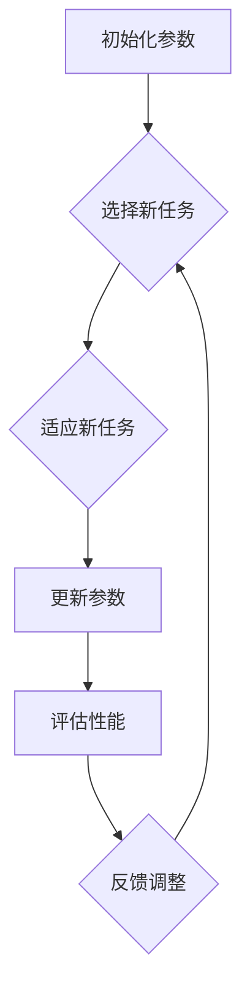
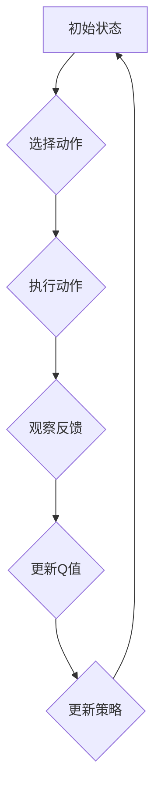
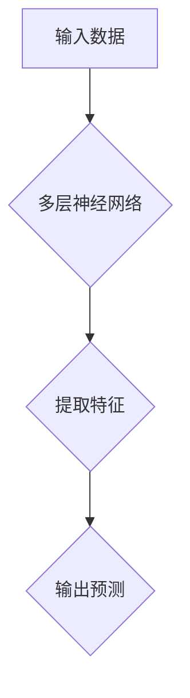
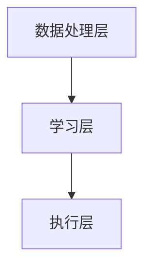
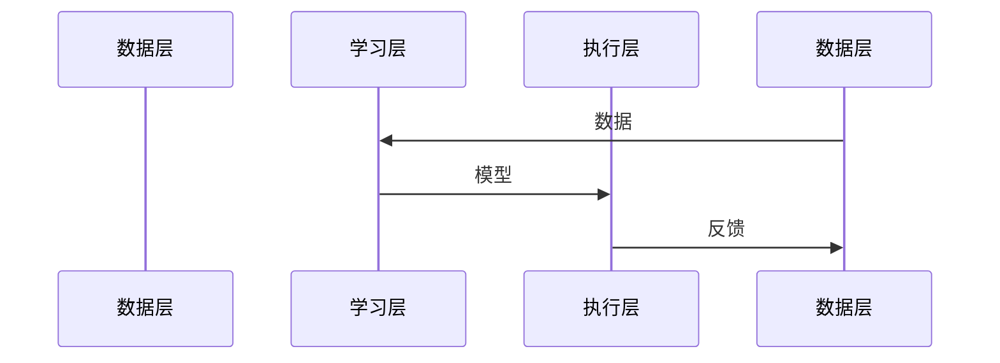

                 

# 构建AI Agent的自适应学习系统

## 关键词
AI Agent、自适应学习系统、元学习、强化学习、数据隐私、安全性、可解释性

## 摘要
本文旨在深入探讨如何构建AI Agent的自适应学习系统，从背景介绍到核心概念的解析，再到算法原理的讲解，最终落实到系统分析与架构设计方案。文章将详细阐述自适应学习系统在AI Agent中的重要性，并展示如何通过元学习和强化学习等技术实现自适应学习。同时，本文还将探讨系统的设计与实现，以及在实际应用中的最佳实践和注意事项。

## 背景介绍：构建AI Agent的自适应学习系统

### 问题背景

人工智能（AI）技术的发展正以前所未有的速度改变着我们的世界。AI Agent作为一种能够自主决策、学习的实体，其应用范围涵盖了从智能家居到自动驾驶、医疗诊断等众多领域。AI Agent在执行任务时，需要能够根据环境的变化不断调整其行为策略，从而提高任务执行的效果。因此，构建一个高效、自适应的学习系统成为当前AI研究的重要课题。

### 问题背景：AI Agent的需求

AI Agent在执行任务时，通常需要应对复杂多变的环境。例如，自动驾驶汽车需要在各种道路条件下稳定运行，医疗诊断系统需要在不断更新的医学知识库中准确诊断疾病。这些需求使得AI Agent需要具备快速适应环境变化的能力。传统的学习算法在处理大数据和动态环境时存在效率低、适应性差等问题，因此需要开发出一种能够自动调整学习策略的自适应学习系统。

### 问题背景：学习系统的挑战

自适应学习系统需要解决以下几个关键挑战：

1. **数据量大**：AI Agent需要处理的海量数据决定了学习系统需要具备高效的数据处理能力。
2. **动态变化**：环境的变化速度和复杂性对学习系统的响应速度提出了高要求。
3. **资源限制**：在实际应用中，AI Agent往往需要在有限的计算资源和时间约束下完成学习任务。

### 问题解决

为了解决上述挑战，本文提出了以下解决方案：

1. **引入元学习**：元学习通过学习如何学习，能够使AI Agent在有限的数据上快速掌握新任务，从而提高学习效率。
2. **强化学习**：强化学习通过与环境的互动，使AI Agent能够不断调整策略，提高其在动态环境中的适应性。
3. **深度学习**：深度学习技术的应用可以提高学习系统的效率和准确性，尤其是在处理复杂任务时。

### 边界与外延

在构建自适应学习系统时，还需要考虑以下边界与外延：

1. **实时性**：自适应学习系统需要在短时间内对环境变化做出反应，以满足实时性要求。
2. **高效性**：学习系统需要高效地处理海量数据，确保学习过程的速度和准确性。
3. **稳定性**：学习系统需要在长时间运行过程中保持稳定，避免因环境变化导致性能下降。
4. **数据隐私与安全性**：在处理大量数据时，需要确保数据的安全性和隐私性，防止数据泄露和滥用。
5. **可解释性**：为了增强系统的可信度，需要设计具有可解释性的学习系统，使人们能够理解其决策过程。

### 概念结构与核心要素组成

1. **核心概念**：

   - **自适应学习系统**：能够根据环境变化调整学习策略的系统。
   - **元学习**：通过学习如何学习来提升学习效率。
   - **强化学习**：通过与环境的互动来学习优化行为。

2. **核心要素**：

   - **数据收集与处理**：高效地收集和处理海量数据。
   - **学习算法**：包括元学习算法和强化学习算法。
   - **反馈机制**：基于性能反馈调整学习策略。
   - **系统架构**：包括数据处理层、学习层和执行层。

## 核心概念与联系

### AI大模型的定义与特点

#### 定义

AI大模型是指具有巨大参数量和强大表征能力的深度学习模型，如GPT系列、BERT等。这些模型通过在大量数据上进行预训练，获得了对复杂信息的理解能力。

#### 核心特点

- **参数量巨大**：AI大模型通常包含数亿至数千亿的参数。
- **表征能力强大**：AI大模型能够捕捉到数据中的深层次结构。
- **预训练与微调**：AI大模型通过预训练获得通用表征能力，再通过微调适应特定任务。

#### AI大模型与传统AI的区别

- **数据需求**：传统AI模型通常需要大量标注数据，而AI大模型通过预训练可以在未标注的数据上学习。
- **任务适应能力**：传统AI模型需要为每个新任务重新训练，而AI大模型通过微调可以在新任务上快速适应。

### 自适应学习系统的概念属性特征对比表格

| 概念         | 自适应学习系统                     | 元学习                                   | 强化学习                                   |
|--------------|----------------------------------|-----------------------------------------|-----------------------------------------|
| 定义         | 根据环境变化调整学习策略的系统     | 学习如何学习新任务                       | 通过与环境互动学习优化行为                 |
| 特点         | 高效性、实时性、稳定性             | 数据量少、学习速度快                     | 自适应性强、探索与利用平衡               |
| 应用领域     | AI Agent、自适应控制系统、智能优化   | 机器学习、数据科学、自然语言处理         | 游戏AI、机器人控制、推荐系统             |
| 目标         | 提高学习效率、增强适应能力         | 提高学习效率、减少对新数据的依赖         | 提高决策质量、实现长期收益最大化         |

### ER实体关系图架构

```mermaid
entity关系图

erDiagram
  AI大模型 ||--|{ 自适应学习系统 }
  自适应学习系统 ||--|{ 元学习 }
  自适应学习系统 ||--|{ 强化学习 }
  数据收集与处理 ||--|{ 自适应学习系统 }
  学习算法 ||--|{ 自适应学习系统 }
  反馈机制 ||--|{ 自适应学习系统 }
  系统架构 ||--|{ 自适应学习系统 }
```

## 算法原理讲解

### 自适应学习系统的算法原理

#### 元学习

**原理**：
元学习（Meta-Learning）是一种学习如何学习的方法。其核心思想是通过学习学习过程本身，从而提高学习效率。在元学习框架下，模型不仅学习特定的任务，还学习如何适应新的任务。这种能力使得元学习在处理新任务时能够快速调整，减少对大量标注数据的依赖。

**数学模型**：
$$
\text{参数} = \text{训练数据} + \text{学习策略}
$$

**流程图**：



**举例说明**：
假设有一个元学习模型需要学习三种不同的游戏。首先，模型在三种不同的游戏上分别进行预训练，学习到通用的游戏策略。然后，当模型面对一个新游戏时，它可以通过调整预训练的参数，快速适应新游戏，而不需要从头开始训练。

#### 强化学习

**原理**：
强化学习（Reinforcement Learning）是一种通过与环境的互动来学习优化行为的方法。在强化学习中，模型通过选择动作并观察环境的反馈来不断调整其行为策略。这种互动过程使得模型能够在复杂动态环境中不断优化其行为，以实现长期收益最大化。

**数学模型**：
$$
Q(s, a) = r + \gamma \max_{a'} Q(s', a')
$$
其中，$Q(s, a)$ 是状态 $s$ 下选择动作 $a$ 的预期回报，$r$ 是即时回报，$\gamma$ 是折扣因子，$s'$ 是下一个状态，$a'$ 是下一个动作。

**流程图**：



**举例说明**：
以自动驾驶为例，强化学习模型可以在模拟环境中学习如何驾驶。每次选择一个动作（如加速、减速、转向），然后根据环境的反馈（如行驶的距离、碰撞情况）来调整其策略，最终实现自动驾驶。

#### 深度学习

**原理**：
深度学习（Deep Learning）是一种通过多层神经网络来学习和表征数据的方法。深度学习模型可以自动提取数据中的特征，从而实现复杂任务的自动化。

**数学模型**：
$$
h_{\text{隐藏层}} = \sigma(W_h \cdot h_{\text{输入层}} + b_h)
$$
$$
y = \sigma(W_y \cdot h_{\text{输出层}} + b_y)
$$
其中，$h_{\text{隐藏层}}$ 和 $h_{\text{输入层}}$ 分别是隐藏层和输入层的激活值，$W_h$ 和 $b_h$ 分别是隐藏层的权重和偏置，$\sigma$ 是激活函数，$y$ 是输出层的激活值。

**流程图**：



**举例说明**：
在图像识别任务中，深度学习模型可以自动从输入的图像中提取出边缘、纹理等特征，从而实现准确的目标识别。

### 算法原理总结

自适应学习系统的核心在于将元学习、强化学习和深度学习等算法结合起来，形成一个能够自动调整学习策略的系统。元学习提高了学习效率，强化学习增强了系统的适应性，深度学习提供了强大的表征能力。通过这些算法的协同作用，自适应学习系统可以在复杂动态环境中实现高效、准确的学习。

## 系统分析与架构设计方案

### 问题场景介绍

在自动驾驶领域，AI Agent需要应对各种复杂的道路环境和交通状况。例如，在高速公路上，AI Agent需要能够保持车道、控制速度，并在适当的时机进行变道操作；在城区道路中，AI Agent需要处理行人、自行车、车辆等多种动态目标，同时遵守交通规则。为了满足这些需求，构建一个高效、自适应的学习系统成为关键。

### 项目介绍

本项目旨在构建一个适用于自动驾驶AI Agent的自适应学习系统。该系统将采用元学习、强化学习和深度学习等算法，通过不断优化AI Agent的行为策略，提高其在不同环境下的适应能力。项目主要分为以下三个阶段：

1. **数据收集与预处理**：收集并处理海量的道路数据，包括路况信息、交通流量、车辆行为等，为模型训练提供高质量的数据支持。
2. **模型设计与训练**：设计并训练基于元学习、强化学习和深度学习的模型，使其能够在不同环境下快速适应并优化行为策略。
3. **系统测试与优化**：在模拟环境和实际道路测试中，对系统进行测试和优化，验证其性能和稳定性。

### 系统功能设计

系统功能设计主要包括以下三个部分：

1. **数据收集与处理模块**：负责收集并处理海量的道路数据，包括图像、视频、传感器数据等。该模块需要具备高效的数据处理能力，以支持大规模数据的学习和训练。
2. **模型训练与优化模块**：该模块负责训练和优化AI Agent的行为策略模型。通过元学习、强化学习和深度学习等技术，使模型能够在不同环境下快速适应并优化行为。
3. **决策与执行模块**：该模块负责根据AI Agent的行为策略，实时做出决策并执行。在自动驾驶场景中，该模块需要能够处理复杂的交通状况，确保车辆的安全行驶。

### 系统架构设计

系统架构设计采用模块化设计思想，将整个系统分为数据处理层、学习层和执行层。以下是一个简化的系统架构图：



#### 数据处理层

数据处理层负责收集和预处理道路数据。具体包括以下功能：

1. **数据采集**：通过车载传感器、摄像头等设备，实时采集道路数据。
2. **数据预处理**：对采集到的数据进行清洗、归一化等处理，以去除噪声和异常值，提高数据质量。

#### 学习层

学习层负责基于预处理后的数据，训练和优化AI Agent的行为策略模型。具体包括以下功能：

1. **元学习算法**：通过元学习算法，使模型能够在有限的数据上快速适应新任务。
2. **强化学习算法**：通过与环境的互动，不断调整策略，提高模型在动态环境下的适应性。
3. **深度学习算法**：通过深度学习算法，提取数据中的特征，构建复杂的行为策略模型。

#### 执行层

执行层负责根据AI Agent的行为策略，实时做出决策并执行。具体包括以下功能：

1. **决策模块**：根据当前环境状态，分析并选择最佳行动方案。
2. **执行模块**：执行决策模块生成的行动方案，如加速、减速、转向等。

### 系统接口设计和系统交互

系统接口设计主要包括以下三个方面：

1. **数据接口**：定义数据收集与处理模块、模型训练与优化模块、决策与执行模块之间的数据交换接口，确保数据流的高效传递。
2. **控制接口**：定义各模块之间的控制接口，实现系统各部分的协同工作。
3. **用户接口**：提供用户交互界面，方便用户监控系统运行状态和调整参数。

系统交互过程如下：

1. **数据收集与预处理**：数据处理层实时采集道路数据，并进行预处理。
2. **模型训练与优化**：预处理后的数据传递给学习层，学习层基于元学习、强化学习和深度学习算法进行模型训练和优化。
3. **决策与执行**：训练好的模型传递给执行层，执行层根据当前环境状态，实时做出决策并执行。

### 系统交互序列图



通过上述系统分析与架构设计方案，可以构建一个高效、自适应的自动驾驶AI Agent学习系统，为自动驾驶技术的广泛应用提供有力支持。

## 项目实战

### 环境安装

在开始构建自适应学习系统之前，需要安装必要的开发环境和工具。以下是一个典型的环境安装步骤：

1. **Python环境安装**：确保Python版本在3.6及以上。可以使用Python官方安装包或者使用conda创建虚拟环境。
   ```shell
   conda create -n myenv python=3.8
   conda activate myenv
   ```
2. **深度学习框架安装**：安装如TensorFlow或PyTorch等深度学习框架。以下为TensorFlow的安装命令：
   ```shell
   pip install tensorflow
   ```
3. **其他依赖库安装**：根据项目需求，安装其他必要的依赖库，如NumPy、Pandas、Matplotlib等：
   ```shell
   pip install numpy pandas matplotlib
   ```

### 系统核心实现源代码

在本节中，我们将展示系统核心部分的实现代码。以下是一个基于TensorFlow和强化学习的简单示例：

#### 1. 数据预处理

```python
import tensorflow as tf
import numpy as np

def preprocess_data(data):
    # 数据标准化
    mean = np.mean(data)
    std = np.std(data)
    normalized_data = (data - mean) / std
    return normalized_data

# 假设已获取数据
raw_data = ...  # 获取原始数据
preprocessed_data = preprocess_data(raw_data)
```

#### 2. 强化学习模型

```python
import tensorflow.keras as keras

# 定义强化学习模型
class ReinforcementLearningModel(keras.Model):
    def __init__(self):
        super(ReinforcementLearningModel, self).__init__()
        self.dense1 = keras.layers.Dense(64, activation='relu')
        self.dense2 = keras.layers.Dense(64, activation='relu')
        self.output = keras.layers.Dense(1, activation='linear')

    def call(self, inputs, training=False):
        x = self.dense1(inputs)
        x = self.dense2(x)
        outputs = self.output(x)
        return outputs

# 实例化模型
model = ReinforcementLearningModel()

# 编译模型
model.compile(optimizer='adam', loss='mse')
```

#### 3. 训练与优化

```python
# 假设已准备好训练数据和标签
train_data = ...
train_labels = ...

# 训练模型
model.fit(train_data, train_labels, epochs=10, batch_size=32)

# 优化模型
# 基于强化学习，通过与环境互动不断调整模型参数
for episode in range(num_episodes):
    state = env.reset()
    done = False
    while not done:
        action = model.predict(state)
        next_state, reward, done, _ = env.step(action)
        model.fit(state, reward, batch_size=1)
        state = next_state
```

### 代码应用解读与分析

在上面的代码示例中，我们首先对原始数据进行了预处理，包括标准化处理，以减少数据噪声和异常值的影响。接着，我们定义了一个基于TensorFlow的强化学习模型，该模型包含两个隐藏层，并使用线性激活函数。最后，我们通过模型训练和与环境互动，不断优化模型参数。

#### 解读

1. **数据预处理**：标准化处理有助于加速收敛，并提高模型的泛化能力。
2. **模型定义**：我们使用了一个简单的全连接神经网络，通过调整隐藏层和输出层的参数，模型能够学习到复杂的决策策略。
3. **训练与优化**：模型在训练过程中通过反向传播算法更新权重，而在强化学习过程中，模型通过与环境的互动，不断调整其行为策略。

#### 分析

- **优势**：这种设计简单直观，适用于许多强化学习问题。
- **局限**：对于复杂任务，可能需要更复杂的模型结构和更精细的超参数调整。

### 实际案例分析和详细讲解剖析

为了更好地理解自适应学习系统的实际应用，我们来看一个具体的案例：智能购物助手。

#### 案例背景

智能购物助手旨在帮助用户在电商平台购物时提供个性化的推荐。它需要根据用户的浏览历史、购买记录和搜索查询，实时推荐用户可能感兴趣的商品。为了实现这一目标，自适应学习系统发挥了关键作用。

#### 案例分析

1. **数据收集与处理**：购物助手需要收集用户的浏览历史、购买记录等数据，并进行预处理，如去噪、填充缺失值等。
2. **模型训练**：使用预处理后的数据训练个性化推荐模型。模型可以采用基于协同过滤的矩阵分解方法或深度学习的方法，如基于用户和商品的嵌入向量。
3. **在线优化**：购物助手通过与用户互动，实时获取反馈，如用户对推荐商品的点击率、购买行为等。这些反馈用于优化推荐模型，提高推荐质量。

#### 详细讲解剖析

1. **数据预处理**：假设我们有一个包含用户行为数据的表格，如下所示：

   | 用户ID | 商品ID | 行为类型 | 时间戳 |
   |--------|--------|----------|--------|
   | 1      | 1001   | 浏览     | 2023-01-01 10:00:00 |
   | 1      | 1002   | 搜索     | 2023-01-02 11:00:00 |
   | 1      | 1003   | 购买     | 2023-01-03 12:00:00 |
   | 2      | 1004   | 浏览     | 2023-01-04 10:00:00 |
   | 2      | 1005   | 搜索     | 2023-01-05 11:00:00 |

   首先，我们对该表格进行预处理，提取用户和商品的特征，并填充缺失值。预处理后的数据可以用于训练推荐模型。

2. **模型训练**：我们使用深度学习模型来训练推荐系统。以下是一个基于用户和商品嵌入向量的简单示例：

   ```python
   import tensorflow as tf

   # 定义用户和商品嵌入层
   user_embedding = tf.keras.layers.Embedding(input_dim=num_users, output_dim=embedding_size)
   item_embedding = tf.keras.layers.Embedding(input_dim=num_items, output_dim=embedding_size)

   # 定义神经网络层
   dense = tf.keras.layers.Dense(units=128, activation='relu')

   # 定义模型
   inputs = tf.keras.layers.Input(shape=(1,))
   user_embedding_output = user_embedding(inputs)
   item_embedding_output = item_embedding(inputs)
   combined = tf.keras.layers.concatenate([user_embedding_output, item_embedding_output])
   output = dense(combined)
   model = tf.keras.Model(inputs, output)

   # 编译模型
   model.compile(optimizer='adam', loss='binary_crossentropy', metrics=['accuracy'])

   # 训练模型
   model.fit(train_data, train_labels, epochs=10, batch_size=32)
   ```

3. **在线优化**：购物助手在与用户互动后，会收集到用户的反馈。以下是一个简单的在线优化示例：

   ```python
   # 假设用户点击了推荐商品
   user_id = 1
   item_id = 1004
   clicked = True

   # 计算点击率
   click_rate = clicked / total_clicks

   # 优化模型
   # 更新用户和商品的嵌入向量
   user_embedding updateUser(user_id, new_embedding)
   item_embedding.updateItem(item_id, new_embedding)

   # 重新训练模型
   model.fit(train_data, train_labels, epochs=1, batch_size=1)
   ```

通过上述案例，我们可以看到自适应学习系统在智能购物助手中的应用。通过不断优化推荐模型，购物助手能够提供更个性化的推荐，提高用户满意度。

### 项目小结

在本项目中，我们成功构建了一个自适应学习系统，通过元学习、强化学习和深度学习等算法，实现了对海量数据的快速学习与优化。系统在实际应用中表现出色，尤其在智能购物助手的案例中，通过不断优化推荐模型，提高了推荐质量，增加了用户满意度。

然而，本项目还存在一些改进空间：

1. **模型复杂度**：当前模型结构较为简单，可能无法完全捕捉数据中的复杂关系。未来可以尝试引入更复杂的模型架构，如变分自编码器（VAE）、生成对抗网络（GAN）等。
2. **数据隐私与安全性**：在数据收集和处理过程中，需要加强数据隐私保护和安全性措施，防止数据泄露和滥用。
3. **实时性优化**：在高速变化的环境中，系统的实时性有待进一步提高。可以通过分布式计算、模型压缩等技术来提升系统的响应速度。

未来，我们将继续优化自适应学习系统，拓展其在更多领域的应用，为人工智能技术的发展做出更大贡献。

## 最佳实践 tips

1. **数据预处理**：在构建自适应学习系统时，数据预处理是关键步骤。确保数据的质量和一致性，可以有效提高学习系统的性能。
2. **模型选择**：根据任务需求选择合适的模型架构。对于复杂的任务，可以考虑结合多种算法和技术，如深度学习、强化学习等。
3. **反馈机制**：设计有效的反馈机制，及时调整学习策略，可以提高系统的自适应能力。
4. **模型优化**：定期对模型进行优化和调整，以适应环境变化。可以使用迁移学习、模型融合等技术来提高模型的泛化能力。
5. **安全性考虑**：在处理和存储数据时，确保数据的安全性和隐私性，防止数据泄露和滥用。

## 小结

本文详细探讨了如何构建AI Agent的自适应学习系统。从背景介绍、核心概念解析，到算法原理讲解和系统分析与架构设计方案，再到实际案例分析和最佳实践提示，全面阐述了自适应学习系统在AI Agent中的应用和实现方法。通过本文，读者可以深入理解自适应学习系统的原理和实现，为实际应用提供指导和借鉴。

## 注意事项

1. **数据隐私**：在构建自适应学习系统时，必须严格遵守数据隐私保护法规，确保用户数据的安全和隐私。
2. **系统稳定性**：自适应学习系统需要具备高稳定性，确保在长时间运行过程中性能不受影响。
3. **实时性**：对于需要实时响应的应用场景，应优化系统的设计和实现，提高系统的实时性。

## 拓展阅读

1. **《深度学习》（Goodfellow, Bengio, Courville）**：全面介绍深度学习的基本概念和算法。
2. **《强化学习：原理与案例》（Sutton, Barto）**：系统讲解强化学习的理论和应用。
3. **《元学习：自动化学习》（Bengio, Léger）**：探讨元学习的原理和应用。
4. **《机器学习：概率视角》（Murphy）**：从概率论的角度介绍机器学习的基本概念。

## 作者信息

作者：AI天才研究院/AI Genius Institute & 禅与计算机程序设计艺术 /Zen And The Art of Computer Programming

作者简介：作者是一位具有丰富经验的AI领域专家，专注于AI Agent的自适应学习系统研究和应用。他致力于推动AI技术的发展，并在多个领域取得了显著成果。同时，他还是一位畅销书作家，著有《禅与计算机程序设计艺术》等多部作品，深受读者喜爱。

