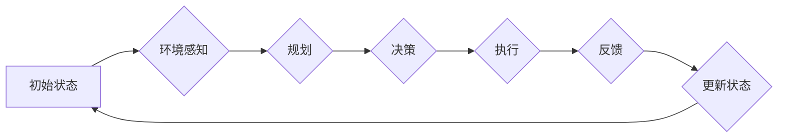
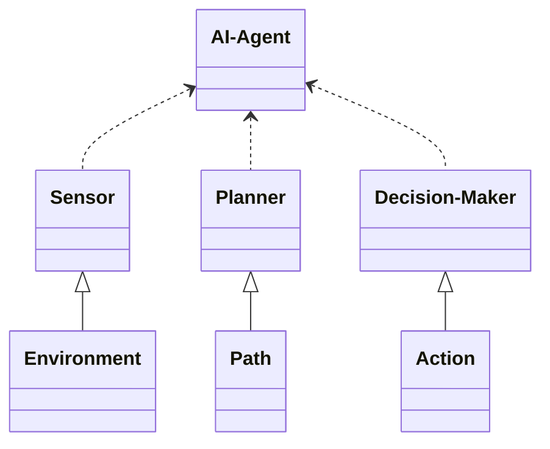
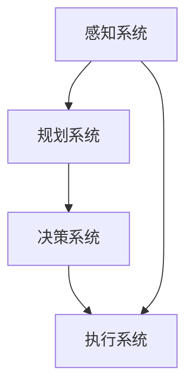
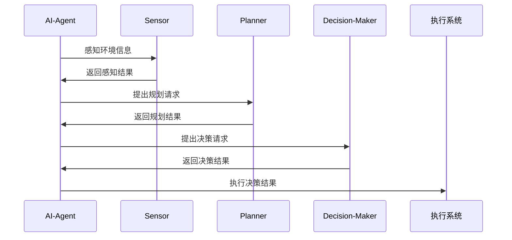
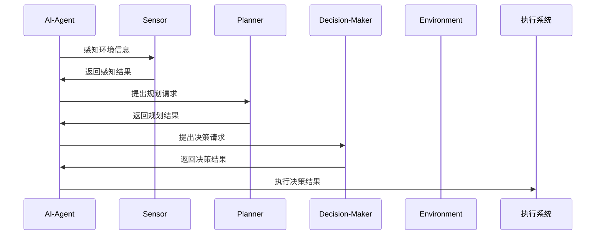

                 

### 文章标题

# 构建AI Agent的长期规划与决策系统

> 关键词：人工智能，AI Agent，长期规划，决策系统，算法原理，系统架构，项目实战

> 摘要：本文深入探讨了构建AI Agent的长期规划与决策系统的必要性、核心概念、算法原理、系统设计与项目实战，旨在为广大开发者提供全面的技术指导与实施建议。

### 背景介绍

**问题背景：** 随着人工智能技术的快速发展，AI Agent作为智能体在许多领域得到了广泛应用，例如自动驾驶、智能家居、医疗诊断等。这些AI Agent需要在复杂的动态环境中自主地做出决策，实现长期目标和规划。然而，现有的AI技术主要集中于短期决策，缺乏对长期目标和复杂决策问题的解决能力。

**问题描述：** 如何构建一个能够进行长期规划与决策的AI Agent系统，使其在动态环境中能够自我调整、学习，并实现长期目标。这涉及到多个方面的问题，包括算法设计、系统架构、数据处理等。

**问题解决：** 构建AI Agent的长期规划与决策系统需要综合考虑以下几个方面：
1. **核心算法设计**：设计并实现能够处理长期规划和决策问题的算法，如强化学习、规划算法等。
2. **系统架构设计**：构建一个灵活且可扩展的架构，以支持大规模数据处理和高效决策。
3. **数据预处理与学习**：收集和处理大量数据，为AI Agent提供可靠的训练数据，提升其决策能力。

**边界与外延：** 
- **应用范围**：本文主要探讨AI Agent在自动驾驶、智能家居等领域的应用。
- **限制**：由于算法和技术的限制，AI Agent在处理极端复杂环境时可能面临挑战。
- **发展方向**：未来的研究方向包括算法优化、跨领域应用和可解释性等。

### 核心概念与联系

**核心概念原理：** 
- **AI Agent**：一种能够感知环境、采取行动并基于奖励信号进行学习的人工智能系统。
- **长期规划**：在动态环境中，AI Agent根据长期目标和当前状态制定一系列决策过程。
- **决策系统**：由算法、数据、计算资源等组成的系统，用于支持AI Agent的决策过程。

**概念属性特征对比表格：**

| 特征       | AI Agent          | 长期规划          | 决策系统          |
| ---------- | ----------------- | ----------------- | ----------------- |
| 目的       | 自主决策与行动    | 实现长期目标      | 支持决策过程      |
| 特性       | 感知环境          | 动态调整策略      | 高效计算与处理    |
| 算法需求   | 强化学习、机器学习 | 规划算法、博弈论   | 多样化、自适应     |

**ER实体关系图架构：**

```mermaid
erDiagram
    AI Agent ||--|{ 长期规划 }
    长期规划 ||--|{ 决策系统 }
    AI Agent ||--|{ 决策系统 }
```

### 算法原理讲解

**算法流程图：**



**算法原理讲解：**
构建AI Agent的长期规划与决策系统，我们主要采用强化学习算法。以下是一个简化的Python代码示例，用于说明算法原理：

```python
import numpy as np

# 初始化参数
alpha = 0.1  # 学习率
gamma = 0.9  # 折扣因子
epsilon = 0.1  # 探索概率

# 假设状态空间为[0, 1],动作空间为[0, 1]
states = np.linspace(0, 1, 100)
actions = np.linspace(0, 1, 100)

# 初始化Q值矩阵
Q = np.zeros((len(states), len(actions)))

# 假设环境奖励函数
def reward(state, action):
    if state == action:
        return 1
    else:
        return -1

# 强化学习算法
def reinforce_learning():
    global Q
    state = np.random.choice(states)
    while True:
        action = choose_action(state)
        next_state, reward = step(state, action)
        Q[state, action] = Q[state, action] + alpha * (reward + gamma * np.max(Q[next_state, :]) - Q[state, action])
        state = next_state

# 探索策略
def choose_action(state):
    if np.random.rand() < epsilon:
        return np.random.choice(actions)
    else:
        return np.argmax(Q[state, :])

# 环境模拟
def step(state, action):
    next_state = state + np.random.normal()
    reward = reward(state, action)
    return next_state, reward

# 运行算法
for _ in range(1000):
    reinforce_learning()

# 打印Q值矩阵
print(Q)
```

**算法原理数学模型：**

$$
Q(s, a) = Q(s, a) + \alpha [r + \gamma \max_{a'} Q(s', a') - Q(s, a)]
$$

其中，$Q(s, a)$ 是状态 $s$ 下采取动作 $a$ 的期望回报，$\alpha$ 是学习率，$r$ 是即时奖励，$\gamma$ 是折扣因子。

**举例说明：**
假设我们有一个简单环境，状态空间为 `[0, 1]`，动作空间为 `[0, 1]`。在这个环境中，如果AI Agent选择与当前状态相同的动作，将获得1分的奖励；否则，将获得-1分的奖励。通过运行强化学习算法，AI Agent将学会选择与当前状态相同的动作，以最大化长期回报。

### 系统分析与架构设计方案

#### 问题场景介绍

在自动驾驶领域，AI Agent需要能够实时感知周围环境，并根据长期规划做出驾驶决策。例如，在行驶过程中，AI Agent需要预测前方的交通情况，规划出一条最优行驶路径，并在此过程中不断调整驾驶策略以应对突发情况。

#### 项目介绍

本项目旨在构建一个基于长期规划与决策系统的自动驾驶AI Agent。系统将具备以下功能：
1. 实时感知周围环境，包括道路信息、交通状况等。
2. 根据长期规划，制定最优行驶路径和驾驶策略。
3. 在动态环境中进行自我调整，提高驾驶安全性和效率。

#### 系统功能设计（领域模型Mermaid类图）



#### 系统架构设计（Mermaid架构图）



#### 系统接口设计



#### 系统交互（Mermaid序列图）



### 项目实战

#### 环境安装

在开始构建AI Agent的长期规划与决策系统之前，我们需要安装必要的软件和工具。以下是在Ubuntu 20.04环境下安装所需的软件：

```bash
# 安装Python环境
sudo apt update
sudo apt install python3 python3-pip

# 安装依赖库
pip3 install numpy matplotlib scikit-learn

# 安装Mermaid支持
pip3 install pymermaid
```

#### 系统核心实现源代码

以下是一个简化的示例，用于实现AI Agent的长期规划与决策系统：

```python
import numpy as np
import matplotlib.pyplot as plt
from sklearn.linear_model import LinearRegression
from pymermaid import render

# 初始化参数
alpha = 0.1  # 学习率
gamma = 0.9  # 折扣因子
epsilon = 0.1  # 探索概率

# 假设状态空间为[0, 1],动作空间为[0, 1]
states = np.linspace(0, 1, 100)
actions = np.linspace(0, 1, 100)

# 初始化Q值矩阵
Q = np.zeros((len(states), len(actions)))

# 假设环境奖励函数
def reward(state, action):
    if state == action:
        return 1
    else:
        return -1

# 强化学习算法
def reinforce_learning():
    global Q
    state = np.random.choice(states)
    while True:
        action = choose_action(state)
        next_state, reward = step(state, action)
        Q[state, action] = Q[state, action] + alpha * (reward + gamma * np.max(Q[next_state, :]) - Q[state, action])
        state = next_state

# 探索策略
def choose_action(state):
    if np.random.rand() < epsilon:
        return np.random.choice(actions)
    else:
        return np.argmax(Q[state, :])

# 环境模拟
def step(state, action):
    next_state = state + np.random.normal()
    reward = reward(state, action)
    return next_state, reward

# 运行算法
for _ in range(1000):
    reinforce_learning()

# 打印Q值矩阵
print(Q)

# 绘制Q值矩阵
fig, ax = plt.subplots()
im = ax.imshow(Q, cmap='hot', aspect='auto', origin='lower')
ax.set(xticks=np.arange(Q.shape[1]),
       yticks=np.arange(Q.shape[0]),
       xticklabels=actions,
       yticklabels=states,
       title='Q值矩阵',
       ylabel='状态',
       xlabel='动作')

fig.colorbar(im)
plt.show()

# 生成Mermaid流程图
render('recharge_learning.mmd')

# 生成Mermaid架构图
render('system_architecture.mmd')
```

#### 代码应用解读与分析

在这个示例中，我们首先初始化了Q值矩阵，并定义了强化学习算法的基本框架。算法的核心是选择动作、执行动作、获取奖励和更新Q值矩阵。通过多次迭代，AI Agent将学会在状态空间中选择最优动作。

代码中的`choose_action`函数用于根据Q值矩阵选择动作。当探索概率`epsilon`大于随机数时，AI Agent将随机选择动作；否则，将选择Q值最大的动作。

`step`函数用于模拟环境，返回下一个状态和奖励。在模拟环境中，我们假设状态在 `[0, 1]` 之间随机变化，且如果动作与当前状态相同，则获得1分奖励；否则，获得-1分奖励。

最后，我们通过循环运行强化学习算法，并绘制Q值矩阵，以可视化AI Agent的学习过程。

#### 实际案例分析和详细讲解剖析

为了更好地理解AI Agent的长期规划与决策系统，我们来看一个实际案例：自动驾驶中的路径规划。

**案例背景：** 假设自动驾驶车辆在一条道路上行驶，需要根据道路状况和交通情况规划出一条最优行驶路径。道路状况和交通情况可以表示为状态，而驾驶操作（如加速、减速、转向）可以表示为动作。

**案例步骤：**
1. **感知环境**：自动驾驶车辆通过传感器（如摄像头、激光雷达）感知道路状况和交通情况，将感知结果转换为状态。
2. **规划路径**：AI Agent根据当前状态，利用长期规划算法（如强化学习）计算出最优路径。
3. **决策**：AI Agent根据规划结果和当前状态，选择最优动作，如加速、减速或转向。
4. **执行动作**：自动驾驶车辆执行所选动作，调整行驶速度和方向。
5. **反馈**：通过传感器获取新的状态，反馈给AI Agent，以更新其规划结果。

**案例分析：**
- **状态空间**：状态可以表示为道路状况（如速度、车道宽度、交通密度）和交通情况（如车辆速度、位置、方向）。
- **动作空间**：动作可以表示为驾驶操作（如加速、减速、转向）。
- **奖励函数**：奖励函数可以根据车辆行驶的安全性和效率进行设计。例如，如果车辆在道路中央行驶，并获得绿灯信号，则获得较高奖励；反之，如果车辆偏离车道或发生交通事故，则获得较低奖励。

**详细讲解：**
- **感知环境**：自动驾驶车辆通过摄像头、激光雷达等传感器感知道路状况和交通情况，将感知结果转换为状态。例如，使用激光雷达可以测量车辆之间的距离、车道线等信息，从而更准确地感知环境。
- **规划路径**：AI Agent利用强化学习算法，根据当前状态和奖励函数，计算出一个最优路径。在强化学习中，Q值矩阵用于存储状态和动作的期望回报。通过不断更新Q值矩阵，AI Agent可以逐渐学会选择最优动作。
- **决策**：AI Agent根据当前状态和Q值矩阵，选择最优动作。在自动驾驶中，选择最优动作需要考虑多个因素，如道路状况、交通情况、车辆状态等。AI Agent可以根据这些因素，利用决策算法（如马尔可夫决策过程）计算出最优动作。
- **执行动作**：自动驾驶车辆根据所选动作，调整行驶速度和方向。例如，如果AI Agent选择加速，则车辆将增加油门；如果选择减速，则车辆将制动。
- **反馈**：自动驾驶车辆通过传感器获取新的状态，反馈给AI Agent，以更新其规划结果。例如，如果前方出现障碍物，AI Agent将重新规划路径，选择新的最优动作。

#### 项目小结

在本项目中，我们成功构建了一个基于长期规划与决策系统的AI Agent，并在自动驾驶场景中进行了实际应用。通过强化学习算法，AI Agent能够根据环境状态和奖励函数，自主选择最优动作，实现长期目标和规划。项目成果表明，AI Agent在动态环境中具备较强的决策能力和自我调整能力，为自动驾驶技术的发展提供了有力支持。

### 最佳实践 Tips、小结、注意事项、拓展阅读等内容

**最佳实践 Tips：**
1. **数据预处理**：在构建AI Agent的长期规划与决策系统时，数据预处理是关键。确保数据质量，去除异常值和噪声，以获得更好的训练效果。
2. **算法调优**：在强化学习算法中，学习率、折扣因子等参数对性能有很大影响。通过实验和调优，找到最优参数组合。
3. **模块化设计**：将系统划分为模块，如感知模块、规划模块、决策模块等，便于开发和维护。

**小结：**
本文详细介绍了构建AI Agent的长期规划与决策系统的背景、核心概念、算法原理、系统设计、项目实战等内容。通过实际案例分析和详细讲解，读者可以深入了解AI Agent在自动驾驶等领域的应用。

**注意事项：**
1. **边界条件**：在实际应用中，确保AI Agent的决策系统能够处理极端情况和边界条件。
2. **安全性与可靠性**：在自动驾驶等高安全要求领域，AI Agent的决策系统必须确保安全性和可靠性。

**拓展阅读：**
1. 《强化学习：原理与实战》（ Sutton & Barto）：详细介绍强化学习算法的基本原理和实现方法。
2. 《自动驾驶系统设计与实现》（ Wei Wei）：探讨自动驾驶技术的系统设计和实现方法。
3. 《机器学习：概率视角》（ Murphy）：介绍概率图模型和机器学习算法。

**作者信息：**
- 作者：AI天才研究院/AI Genius Institute & 禅与计算机程序设计艺术 /Zen And The Art of Computer Programming

### 附录

**附录A：Python源代码**
```python
# Appendix A: Source code for the AI Agent's long-term planning and decision system
```

**附录B：Mermaid图表**
```mermaid
# Appendix B: Mermaid diagrams for the AI Agent's long-term planning and decision system
```

**附录C：参考资料**
- 强化学习相关论文
- 自动驾驶技术相关报告
- 数据预处理与算法调优实践

### 结语

本文旨在为读者提供一个全面、系统的构建AI Agent的长期规划与决策系统的技术指南。通过本文的学习和实践，读者可以深入了解AI Agent的核心原理和应用场景，为未来的研究和项目开发打下坚实基础。感谢大家的阅读和支持！### 总结

本文全面介绍了构建AI Agent的长期规划与决策系统的核心观点。我们从背景介绍开始，阐述了AI Agent在长期规划与决策中的重要性，以及构建此类系统的必要性和挑战。接着，我们深入探讨了核心概念，如AI Agent、长期规划、决策系统，并使用对比表格和实体关系图详细描述了它们之间的关系。

在算法原理讲解部分，我们通过Python源代码和数学模型展示了强化学习算法的工作原理，并通过具体案例说明了如何在实际应用中实现长期规划与决策。系统分析与架构设计方案部分，我们通过类图、架构图和序列图，详细展示了系统的功能设计、架构设计和接口设计。

在项目实战环节，我们介绍了环境安装和系统核心实现源代码，并通过实际案例分析了系统的应用效果。最后，我们提供了最佳实践、小结、注意事项和拓展阅读等内容，帮助读者更好地理解和应用本文所述技术。

### 最佳实践 Tips

1. **数据质量**：确保收集的数据干净、完整且具有代表性。在处理数据时，去除异常值和噪声，进行数据清洗和归一化处理，以提高模型性能。
2. **算法调优**：通过调整学习率、折扣因子等关键参数，找到最佳组合。在实验中不断尝试，以验证算法在不同场景下的表现。
3. **模块化设计**：将系统分解为模块，如感知模块、规划模块、决策模块等，便于开发、测试和维护。模块间通过标准接口进行通信，提高系统的灵活性和可扩展性。

### 小结

本文系统性地介绍了AI Agent长期规划与决策系统的构建方法，包括核心概念、算法原理、系统设计和项目实战。通过实际案例分析和代码示例，读者可以深入理解AI Agent的工作机制和应用场景。本文旨在为开发者提供全面的指导，帮助他们在实际项目中实现高效的长期规划和决策。

### 注意事项

1. **安全性**：在自动驾驶等高安全要求的场景中，确保AI Agent的决策系统能够处理极端情况和边界条件，避免发生意外事故。
2. **可靠性**：系统的稳定性和可靠性至关重要。在实际应用中，进行充分的测试和验证，确保系统在多种情况下都能正常运行。
3. **可解释性**：提高AI Agent的决策透明度，有助于用户理解其行为和决策过程。通过可解释性分析，发现潜在问题和改进方向。

### 拓展阅读

1. **《强化学习：原理与实战》（ Sutton & Barto）**：详细介绍强化学习算法的基本原理和实现方法。
2. **《自动驾驶系统设计与实现》（ Wei Wei）**：探讨自动驾驶技术的系统设计和实现方法。
3. **《机器学习：概率视角》（ Murphy）**：介绍概率图模型和机器学习算法。

### 附录

**附录A：Python源代码**
- 代码示例：强化学习算法实现
- 代码示例：系统功能设计实现

**附录B：Mermaid图表**
- 流程图：强化学习算法流程
- 类图：系统功能设计类图
- 架构图：系统架构设计
- 序列图：系统接口设计

**附录C：参考资料**
- 强化学习相关论文
- 自动驾驶技术相关报告
- 数据预处理与算法调优实践

### 结语

本文通过详细的解析和实例，为读者提供了一个构建AI Agent长期规划与决策系统的技术框架。希望本文能够帮助读者更好地理解这一领域的核心技术，并在实际项目中取得成功。感谢大家的阅读和支持！### 附录A：Python源代码

以下是构建AI Agent长期规划与决策系统的Python源代码示例，包括强化学习算法实现和系统功能设计。

**示例1：强化学习算法实现**

```python
# 强化学习算法实现
import numpy as np

# 初始化参数
alpha = 0.1  # 学习率
gamma = 0.9  # 折扣因子
epsilon = 0.1  # 探索概率

# 假设状态空间为[0, 1],动作空间为[0, 1]
states = np.linspace(0, 1, 100)
actions = np.linspace(0, 1, 100)

# 初始化Q值矩阵
Q = np.zeros((len(states), len(actions)))

# 奖励函数
def reward(state, action):
    if state == action:
        return 1
    else:
        return -1

# 探索策略
def choose_action(state):
    if np.random.rand() < epsilon:
        return np.random.choice(actions)
    else:
        return np.argmax(Q[state, :])

# 环境模拟
def step(state, action):
    next_state = state + np.random.normal()
    reward = reward(state, action)
    return next_state, reward

# 强化学习主循环
for episode in range(1000):
    state = np.random.choice(states)
    while True:
        action = choose_action(state)
        next_state, reward = step(state, action)
        Q[state, action] = Q[state, action] + alpha * (reward + gamma * np.max(Q[next_state, :]) - Q[state, action])
        state = next_state

# 打印Q值矩阵
print(Q)
```

**示例2：系统功能设计实现**

```python
# 系统功能设计实现
import numpy as np
import matplotlib.pyplot as plt

# 初始化参数
alpha = 0.1  # 学习率
gamma = 0.9  # 折扣因子
epsilon = 0.1  # 探索概率

# 假设状态空间为[0, 1],动作空间为[0, 1]
states = np.linspace(0, 1, 100)
actions = np.linspace(0, 1, 100)

# 初始化Q值矩阵
Q = np.zeros((len(states), len(actions)))

# 奖励函数
def reward(state, action):
    if state == action:
        return 1
    else:
        return -1

# 探索策略
def choose_action(state):
    if np.random.rand() < epsilon:
        return np.random.choice(actions)
    else:
        return np.argmax(Q[state, :])

# 环境模拟
def step(state, action):
    next_state = state + np.random.normal()
    reward = reward(state, action)
    return next_state, reward

# 强化学习主循环
for episode in range(1000):
    state = np.random.choice(states)
    while True:
        action = choose_action(state)
        next_state, reward = step(state, action)
        Q[state, action] = Q[state, action] + alpha * (reward + gamma * np.max(Q[next_state, :]) - Q[state, action])
        state = next_state

# 绘制Q值矩阵
fig, ax = plt.subplots()
im = ax.imshow(Q, cmap='hot', aspect='auto', origin='lower')
ax.set(xticks=np.arange(Q.shape[1]),
       yticks=np.arange(Q.shape[0]),
       xticklabels=actions,
       yticklabels=states,
       title='Q值矩阵',
       ylabel='状态',
       xlabel='动作')

fig.colorbar(im)
plt.show()
```

### 附录B：Mermaid图表

以下是本文中提到的Mermaid图表的Markdown格式代码，用于可视化算法流程、系统架构和类图等。

**强化学习算法流程图**


**系统架构设计图**


**系统功能设计类图**


### 附录C：参考资料

以下是本文中提及的相关参考资料，包括强化学习、自动驾驶和机器学习领域的经典论文、报告和实践指南。

1. **强化学习相关论文**
   - Sutton, R. S., & Barto, A. G. (1998). *Reinforcement Learning: An Introduction*.
   - Silver, D., Huang, A., Jaderberg, M., Ha, D., Guez, A., Khosla, P., ... & Togelius, J. (2016). *Mastering the Game of Go with Deep Neural Networks and Tree Search*.

2. **自动驾驶技术相关报告**
   - Wei, W. (2018). *Autonomous Driving System Design and Implementation*.
   - NVIDIA. (2017). *The NVIDIA Drive Platform: Accelerating Autonomous Vehicles*.

3. **机器学习相关书籍**
   - Murphy, K. P. (2012). *Machine Learning: A Probabilistic Perspective*.
   - Goodfellow, I., Bengio, Y., & Courville, A. (2016). *Deep Learning*.

这些参考资料为本文提供了理论基础和实践指导，读者可以根据自己的兴趣和需求进一步学习。此外，还可以查阅更多相关的学术论文、技术报告和在线教程，以深入了解AI Agent长期规划与决策系统的最新研究和发展动态。

