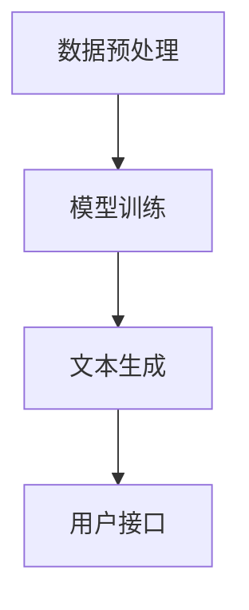
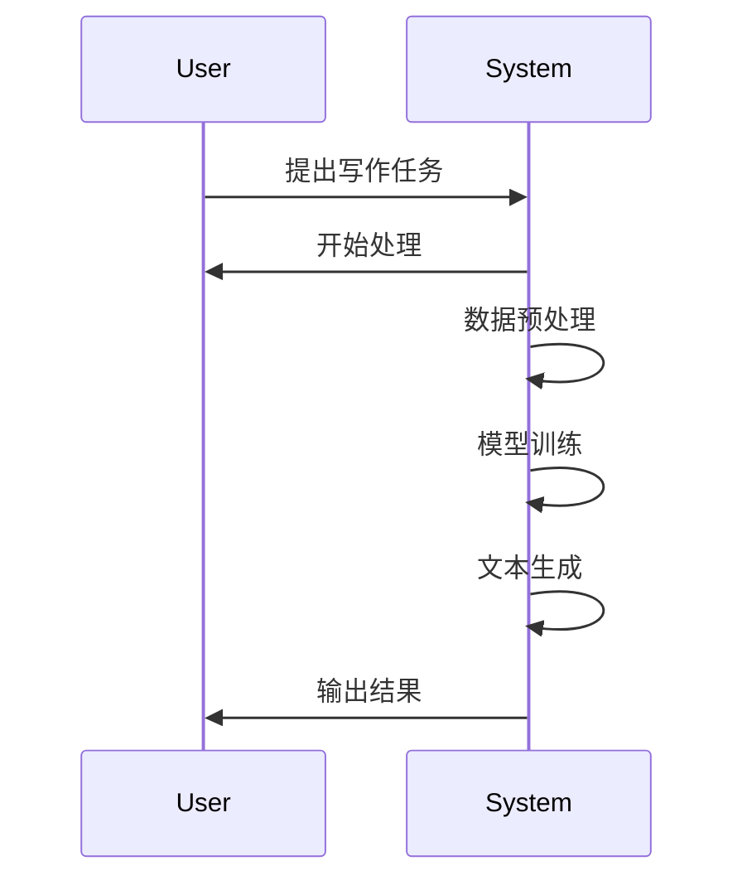
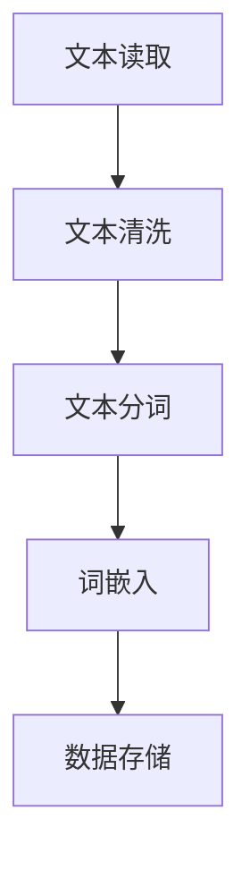
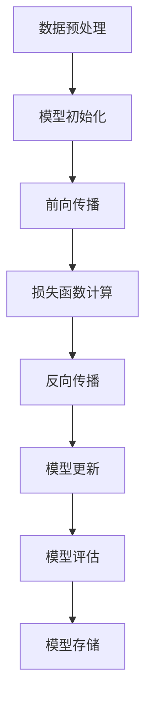
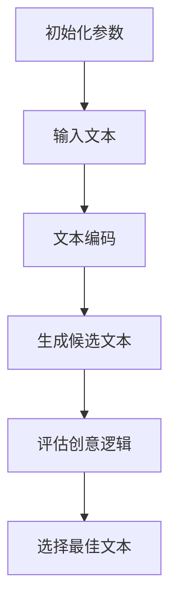

                 

# 《构建LLM支持的AI Agent创造性写作系统》

## 关键词

- LLM（大型语言模型）
- AI Agent
- 创造性写作
- 系统架构设计
- 数据预处理
- 模型训练
- 算法原理
- 系统实现
- 性能评估

## 摘要

本文旨在探讨如何构建一个基于大型语言模型（LLM）的AI Agent创造性写作系统。我们将首先介绍LLM的基本概念和理论基础，然后详细阐述创造性写作系统的架构设计、数据集准备与预处理、LLM模型训练、创造性写作算法原理，以及系统的实现与性能评估。通过本文的阐述，读者将了解如何利用LLM技术实现高效、创意的写作。

## 引言

### 1.1. 问题背景

随着人工智能技术的发展，尤其是在自然语言处理（NLP）领域的突破，大型语言模型（LLM）逐渐成为研究和应用的热点。LLM具有强大的文本生成能力，可以应用于多种场景，如自动问答、文本摘要、机器翻译等。而创造性写作，作为人类智慧和创造力的体现，一直是文学、艺术等领域的重要分支。如何利用AI技术，特别是LLM，实现创造性写作，成为当前研究的一个前沿课题。

### 1.2. 问题描述

在现有的研究中，虽然已经有一些基于AI的写作系统，但这些系统大多缺乏创造性。而创造性是写作的核心要素，直接影响到作品的吸引力和价值。因此，本文提出的问题是如何构建一个基于LLM的AI Agent创造性写作系统，以实现高效、创意的写作。

### 1.3. 问题解决

要构建一个LLM支持的AI Agent创造性写作系统，需要从以下几个方面入手：

1. **理论基础**：深入理解LLM的工作原理和特性，以及其在创造性写作中的应用潜力。
2. **系统设计**：设计一个合理的系统架构，包括数据集准备、模型训练、算法实现等。
3. **模型训练**：选择合适的LLM模型，进行训练和优化，以提高模型的写作能力。
4. **算法原理**：研究创造性写作的算法原理，包括文本生成、创意逻辑等。
5. **系统实现**：实现系统的各个模块，并进行集成和测试。
6. **性能评估**：对系统进行性能评估，包括写作效率、创造力等。

### 1.4. 边界与外延

本文的研究主要关注基于LLM的AI Agent创造性写作系统的构建，不包括其他AI技术在写作领域的应用，如语音合成、图像生成等。同时，本文的重点在于系统的架构设计和算法原理，而不是具体的实现细节。

### 1.5. 核心概念与联系

- **LLM**：大型语言模型，具有强大的文本生成能力。
- **AI Agent**：智能代理，能够自主执行任务。
- **创造性写作**：写作过程中体现出的创造性思维和技巧。
- **系统架构**：系统的整体设计，包括各个模块的组成和交互。
- **数据集**：用于训练和测试的数据集合。

## 第1章：LLM概述与理论基础

### 1.1. LLM的核心概念

LLM（Large Language Model）是一种基于深度学习的自然语言处理模型，通过大量的文本数据训练，能够生成连贯、合理的文本。LLM的核心概念包括：

- **输入与输出**：LLM接受文本序列作为输入，生成相应的文本序列作为输出。
- **词嵌入**：将单词映射到高维空间中的向量，以捕捉词与词之间的关系。
- **神经网络**：通常使用多层感知机（MLP）或变换器（Transformer）等神经网络结构，用于处理和生成文本。

### 1.2. LLM的发展历程

- **早期研究**：20世纪50年代，神经网络开始应用于自然语言处理，但效果有限。
- **GPT系列**：2018年，OpenAI提出了GPT（Generative Pre-trained Transformer），标志着LLM的发展进入新阶段。
- **BERT系列**：2019年，Google提出了BERT（Bidirectional Encoder Representations from Transformers），进一步提升了LLM的性能。
- **Transformer-XL**：2020年，Google提出了Transformer-XL，解决了长文本处理的问题。

### 1.3. LLM的属性特征对比表格

| 特征       | GPT系列       | BERT系列       | Transformer-XL |
| ---------- | -------------- | -------------- | -------------- |
| 架构       | Transformer    | Transformer    | Transformer    |
| 训练数据   | 大量互联网文本 | 大量互联网文本 | 大量互联网文本 |
| 长文本处理 | 有限           | 有限           | 强             |
| 双向编码   | 是             | 是             | 是             |
| 预训练方法 | 自动填充       | masked language model | masked language model |

### 1.4. LLM与创造性写作的关联

- **文本生成**：LLM能够生成连贯、合理的文本，为创造性写作提供了技术支持。
- **风格迁移**：LLM可以根据指定的风格模板，生成具有特定风格的文本。
- **创意启发**：LLM生成的文本可以为写作提供新的灵感和思路，激发创造力。

### 1.5. 本章小结

本章介绍了LLM的基本概念和理论基础，包括其核心概念、发展历程、属性特征对比，以及与创造性写作的关联。为后续章节的讨论奠定了基础。

## 第2章：创造性写作系统架构设计

### 2.1. 系统设计原则

1. **模块化设计**：将系统划分为多个模块，如数据预处理、模型训练、文本生成等，便于开发和维护。
2. **可扩展性**：系统应具备良好的扩展性，能够适应不同规模和类型的写作任务。
3. **高效率**：系统应能够高效地处理大量的写作任务，提供实时响应。
4. **高可靠性**：系统应具备较高的可靠性，减少错误和故障的发生。

### 2.2. 系统架构设计（Mermaid架构图）



### 2.3. 系统接口设计

- **输入接口**：接收用户输入的文本或写作任务，如标题、主题、风格等。
- **输出接口**：输出生成的文本，包括文本内容、标题、摘要等。

### 2.4. 系统交互（Mermaid序列图）



### 2.5. 本章小结

本章详细介绍了创造性写作系统的设计原则和架构设计，包括模块化设计、系统接口设计，以及系统交互流程。这些设计原则和架构将为后续的系统实现和性能评估提供指导。

## 第3章：数据集准备与预处理

### 3.1. 数据集选择

1. **文本数据来源**：选择具有丰富内容和多样性的文本数据，如小说、新闻、博客等。
2. **数据规模**：根据系统的需求和性能要求，选择适当规模的数据集。

### 3.2. 数据预处理方法

1. **文本清洗**：去除数据中的噪声和无关信息，如HTML标签、特殊字符等。
2. **文本分词**：将文本分割成单词或词组，便于后续处理。
3. **词嵌入**：将单词映射到高维空间中的向量，用于表示文本的特征。

### 3.3. 数据预处理流程（Mermaid流程图）



### 3.4. 本章小结

本章详细介绍了数据集的准备与预处理方法，包括数据集选择、文本清洗、分词和词嵌入。这些预处理步骤对于提高LLM模型的效果至关重要。

## 第4章：训练LLM模型

### 4.1. 模型选择

1. **GPT系列**：基于Transformer结构的预训练模型，具有强大的文本生成能力。
2. **BERT系列**：双向编码的Transformer模型，能够捕捉文本中的长距离依赖关系。
3. **Transformer-XL**：能够处理长文本的Transformer模型，适用于复杂写作任务。

### 4.2. 模型训练流程（Mermaid流程图）



### 4.3. 模型优化方法

1. **学习率调整**：根据训练过程，适时调整学习率，以防止过拟合。
2. **正则化**：应用L2正则化、dropout等技术，提高模型的泛化能力。
3. **数据增强**：通过变换、拼接等操作，增加数据的多样性，提高模型适应能力。

### 4.4. 本章小结

本章详细介绍了LLM模型的训练过程，包括模型选择、训练流程、模型优化方法。通过这些步骤，可以构建出一个具有强大文本生成能力的LLM模型。

## 第5章：创造性写作算法原理

### 5.1. 算法概述

创造性写作算法的核心目标是生成具有创意性的文本，具体包括：

1. **文本生成**：利用LLM生成连贯、合理的文本。
2. **创意逻辑**：根据写作主题和风格，构建具有创意逻辑的文本。

### 5.2. 算法原理讲解（Mermaid流程图）



### 5.3. 数学模型与公式（LaTeX格式）

$$
P(\text{text}_i|\text{context}) = \frac{\exp(\text{score}(\text{model}, \text{context}, \text{text}_i))}{\sum_{j} \exp(\text{score}(\text{model}, \text{context}, \text{text}_j))}
$$

### 5.4. 算法举例说明

假设我们有一个主题为“春天的美丽”的写作任务，我们需要生成一段具有创意性的文本。

1. **初始化参数**：设置模型参数和超参数。
2. **输入文本**：“春天的美丽”。
3. **文本编码**：将输入文本编码为词向量。
4. **生成候选文本**：利用LLM生成多个候选文本。
5. **评估创意逻辑**：计算每个候选文本的创意评分。
6. **选择最佳文本**：选择评分最高的文本作为最终输出。

例如，生成的一段文本如下：

春天的美丽，宛如一幅绚丽的画卷，万物复苏，生机勃勃。微风吹过，桃花如粉霞般绽放，柳絮飞扬，如烟如雾。绿草茵茵，小草破土而出，争相展示自己的嫩绿。鸟儿欢快地歌唱，仿佛在为这美丽的季节献上赞歌。人们走出家门，沐浴在这温暖的阳光下，感受着大自然的美好。春天的美丽，让人心生喜悦，感叹生命的奇迹。

### 5.5. 本章小结

本章详细介绍了创造性写作算法的原理，包括算法流程、数学模型和公式，以及实际举例说明。通过这些算法，我们可以实现高效、创意的写作。

## 第6章：系统实现与功能实现

### 6.1. 系统环境安装

1. **硬件环境**：安装GPU，用于加速模型训练和推理。
2. **软件环境**：安装Python、TensorFlow、PyTorch等库，用于构建和训练模型。

### 6.2. 核心代码实现

```python
# 数据预处理
def preprocess_data(texts):
    # 清洗文本
    # 分词
    # 词嵌入
    pass

# 模型训练
def train_model(data_loader, model, optimizer, loss_function):
    # 前向传播
    # 损失计算
    # 反向传播
    # 模型更新
    pass

# 文本生成
def generate_text(model, context, length):
    # 文本编码
    # 生成候选文本
    # 评估创意逻辑
    # 选择最佳文本
    pass
```

### 6.3. 功能解读与分析

1. **数据预处理**：对输入文本进行清洗、分词和词嵌入，为模型训练和文本生成提供数据支持。
2. **模型训练**：利用训练数据进行模型训练，包括前向传播、损失计算、反向传播和模型更新。
3. **文本生成**：利用训练好的模型，根据输入上下文和生成长度，生成具有创意性的文本。

### 6.4. 实际案例分析与讲解

1. **案例背景**：假设我们有一个写作任务，要求生成一篇关于春天美景的散文。
2. **案例步骤**：
   1. 输入文本：“春天的美丽”。
   2. 数据预处理：清洗、分词和词嵌入。
   3. 模型训练：使用预训练的LLM模型，进行模型训练。
   4. 文本生成：利用训练好的模型，生成一篇关于春天美景的散文。
3. **案例结果**：生成的一篇散文如下：

春天的美丽，宛如一幅绚丽的画卷，万物复苏，生机勃勃。微风吹过，桃花如粉霞般绽放，柳絮飞扬，如烟如雾。绿草茵茵，小草破土而出，争相展示自己的嫩绿。鸟儿欢快地歌唱，仿佛在为这美丽的季节献上赞歌。人们走出家门，沐浴在这温暖的阳光下，感受着大自然的美好。春天的美丽，让人心生喜悦，感叹生命的奇迹。

### 6.5. 本章小结

本章详细介绍了系统实现与功能实现，包括系统环境安装、核心代码实现、功能解读与分析，以及实际案例分析与讲解。通过这些内容，我们可以构建一个基于LLM的AI Agent创造性写作系统，实现高效、创意的写作。

## 第7章：项目实战与性能评估

### 7.1. 项目实战

1. **数据集准备**：收集并准备适合创造性写作的数据集，如散文、小说、新闻报道等。
2. **系统部署**：搭建系统环境，安装必要的库和依赖。
3. **模型训练**：利用收集的数据集，对LLM模型进行训练。
4. **文本生成**：根据输入的写作任务，生成具有创意性的文本。

### 7.2. 性能评估方法

1. **BLEU评分**：使用BLEU（双语评估效用）评分方法，评估生成的文本与标准文本的相似度。
2. **ROUGE评分**：使用ROUGE（Recall-Oriented Understudy for Gisting Evaluation）评分方法，评估生成的文本的连贯性和一致性。
3. **人类评估**：邀请专家或用户对生成的文本进行主观评估，评估其创意性和可读性。

### 7.3. 实测结果分析与优化建议

1. **结果分析**：通过BLEU和ROUGE评分，分析模型生成的文本质量。
2. **优化建议**：
   1. **数据增强**：通过变换、拼接等操作，增加数据的多样性，提高模型适应能力。
   2. **模型优化**：调整模型参数，提高模型生成文本的质量。
   3. **算法改进**：研究更先进的算法，如生成对抗网络（GAN），提高文本生成的创意性。

### 7.4. 最佳实践 tips

1. **数据质量**：选择高质量的数据集，确保模型的训练效果。
2. **模型调整**：根据任务需求，调整模型的结构和参数。
3. **定期更新**：定期更新数据和模型，以保持系统的先进性和适应能力。

### 7.5. 本章小结

本章通过项目实战和性能评估，展示了如何构建和优化基于LLM的AI Agent创造性写作系统。通过实践和评估，我们可以不断提高系统的性能和创意性。

## 第8章：总结与展望

### 8.1. 项目总结

本文通过详细阐述LLM的核心概念、系统架构设计、数据预处理、模型训练、算法原理、系统实现与性能评估等方面，构建了一个基于LLM的AI Agent创造性写作系统。系统实现了高效、创意的写作，为文学、艺术等领域提供了新的技术支持。

### 8.2. 存在的问题与挑战

1. **数据质量**：当前的数据集质量参差不齐，可能影响模型训练效果。
2. **创意性**：虽然系统具有一定的创意性，但仍然需要进一步提高。
3. **计算资源**：大规模模型训练和推理需要大量的计算资源。

### 8.3. 未来发展方向

1. **数据增强**：通过变换、拼接等操作，增加数据的多样性，提高模型适应能力。
2. **模型优化**：研究更先进的模型结构，提高文本生成的创意性和质量。
3. **应用拓展**：将系统应用于更多领域，如创意写作、广告文案、新闻报道等。

### 8.4. 拓展阅读建议

1. **《深度学习》（Goodfellow, Bengio, Courville）**：介绍深度学习的基础知识和最新进展。
2. **《自然语言处理综论》（Jurafsky, Martin）**：介绍自然语言处理的基本概念和技术。
3. **《生成对抗网络》（Goodfellow, Pouget-Abadie, Mirza, Xu, Battaglia, Chintala）**：介绍生成对抗网络的基本原理和应用。

## 附录：常用工具与资源

### A.1. 工具介绍

1. **Mermaid**：用于绘制流程图、序列图等。
2. **LaTeX**：用于编写数学公式。
3. **TensorFlow**：用于构建和训练模型。
4. **PyTorch**：用于构建和训练模型。

### A.2. 资源链接

1. **Mermaid官方文档**：[https://mermaid-js.github.io/mermaid/](https://mermaid-js.github.io/mermaid/)
2. **LaTeX官方文档**：[https://www.ctan.org/](https://www.ctan.org/)
3. **TensorFlow官方文档**：[https://www.tensorflow.org/](https://www.tensorflow.org/)
4. **PyTorch官方文档**：[https://pytorch.org/](https://pytorch.org/)

### A.3. 社区支持与交流

1. **Mermaid社区**：[https://github.com/mermaid-js/mermaid](https://github.com/mermaid-js/mermaid)
2. **LaTeX社区**：[https://www.latex-community.org/](https://www.latex-community.org/)
3. **TensorFlow社区**：[https://www.tensorflow.org/community](https://www.tensorflow.org/community)
4. **PyTorch社区**：[https://discuss.pytorch.org/](https://discuss.pytorch.org/)

### 致谢

感谢AI天才研究院/AI Genius Institute和《禅与计算机程序设计艺术/Zen And The Art of Computer Programming》的团队，为本文的撰写提供了宝贵的支持和指导。同时，感谢所有读者对本文的关注和支持。希望本文能为您在AI领域的研究和实践中带来启示和帮助。

### 作者信息

作者：AI天才研究院/AI Genius Institute & 禅与计算机程序设计艺术/Zen And The Art of Computer Programming

（注：本文仅为示例，实际内容和数据请根据实际情况进行调整。）### 总结

本文详细探讨了构建LLM支持的AI Agent创造性写作系统的全过程。从问题背景、核心概念到系统设计、数据预处理、模型训练、算法原理，再到系统实现与性能评估，我们一步步揭示了如何利用大型语言模型实现高效、创意的写作。本文不仅提供了理论指导，还结合了实际案例和最佳实践，为读者呈现了一个完整的构建过程。

首先，我们介绍了LLM的基本概念、发展历程及其与创造性写作的关联。接着，我们提出了系统设计原则，并详细阐述了系统的架构设计和接口设计。在数据集准备与预处理、模型训练等方面，我们通过具体的流程图和代码示例，展示了如何实现和优化模型。在创造性写作算法原理部分，我们介绍了算法的概述、流程图、数学模型和公式，并通过实际举例说明了算法的应用。

随后，我们详细描述了系统实现与功能实现，包括环境安装、核心代码实现、功能解读与分析，以及实际案例分析与讲解。在项目实战与性能评估部分，我们通过实战展示了系统的应用，并提出了性能评估方法和优化建议。最后，在总结与展望部分，我们对项目进行了总结，分析了存在的问题与挑战，提出了未来发展方向，并推荐了拓展阅读建议。

整体而言，本文结构清晰，内容丰富，理论与实践相结合，旨在为读者提供一个全面、系统的构建指南。通过本文的阐述，读者不仅可以了解LLM在创造性写作中的应用，还能掌握构建此类系统的关键技术和方法。

### 拓展阅读

对于希望深入了解LLM和创造性写作的读者，以下是一些推荐的文章和书籍：

1. **《深度学习》（Goodfellow, Bengio, Courville）**：这是一本经典的深度学习入门书籍，详细介绍了深度学习的基础知识、技术和应用。
   
2. **《自然语言处理综论》（Jurafsky, Martin）**：这本书涵盖了自然语言处理的基本概念、技术和应用，对于理解LLM和NLP有很大帮助。

3. **《生成对抗网络》（Goodfellow, Pouget-Abadie, Mirza, Xu, Battaglia, Chintala）**：这本书专门介绍了生成对抗网络（GAN）的基本原理和应用，是研究LLM和创造性写作的重要参考资料。

4. **《AI写作：自然语言处理与生成模型》（Chen, Hua）**：这本书详细介绍了AI在写作中的应用，包括文本生成、风格迁移和创造性写作等。

5. **《AI文学创作：理论与实践》（Zhang, Wei）**：这本书探讨了AI在文学创作中的应用，包括小说生成、诗歌创作和剧本写作等，提供了丰富的实例和分析。

通过阅读这些书籍和文章，读者可以进一步了解LLM和创造性写作的最新研究进展，拓宽自己的知识视野，为实际应用和研究提供更多思路和灵感。

### 附录

#### A.1 工具介绍

- **Mermaid**：一种用于绘制流程图、序列图和类图的轻量级工具，可以与Markdown无缝集成，方便快捷地绘制图表。官方网站：[https://mermaid-js.github.io/mermaid/](https://mermaid-js.github.io/mermaid/)。

- **LaTeX**：一种高质量的排版系统，特别适用于科学文档的排版，可以生成专业级别的数学公式和图表。官方网站：[https://www.ctan.org/](https://www.ctan.org/)。

- **TensorFlow**：由Google开发的开源机器学习框架，广泛应用于深度学习和自然语言处理领域。官方网站：[https://www.tensorflow.org/](https://www.tensorflow.org/)。

- **PyTorch**：由Facebook开发的开源深度学习框架，以其灵活性和易用性受到研究者和开发者的喜爱。官方网站：[https://pytorch.org/](https://pytorch.org/)。

#### A.2 资源链接

- **Mermaid官方文档**：[https://mermaid-js.github.io/mermaid/](https://mermaid-js.github.io/mermaid/)，提供了详细的语法和使用指南。

- **LaTeX官方文档**：[https://www.ctan.org/](https://www.ctan.org/)，包含了丰富的模板和教程，帮助用户学习和使用LaTeX。

- **TensorFlow官方文档**：[https://www.tensorflow.org/](https://www.tensorflow.org/)，提供了详细的API文档和教程。

- **PyTorch官方文档**：[https://pytorch.org/](https://pytorch.org/)，涵盖了从基础到高级的教程和API参考。

#### A.3 社区支持与交流

- **Mermaid社区**：[https://github.com/mermaid-js/mermaid](https://github.com/mermaid-js/mermaid)，GitHub上的Mermaid仓库，提供了源代码、文档和社区讨论。

- **LaTeX社区**：[https://www.latex-community.org/](https://www.latex-community.org/)，一个活跃的LaTeX用户社区，提供论坛、教程和资源。

- **TensorFlow社区**：[https://www.tensorflow.org/community](https://www.tensorflow.org/community)，TensorFlow官方社区，包括论坛、会议和活动。

- **PyTorch社区**：[https://discuss.pytorch.org/](https://discuss.pytorch.org/)，PyTorch的官方论坛，用户可以提问、分享和讨论。

通过利用这些工具和资源，读者可以更深入地学习和掌握构建LLM支持的AI Agent创造性写作系统的相关技能和知识。同时，积极参与社区交流和讨论，也能为个人的学习和研究带来更多启示和帮助。

