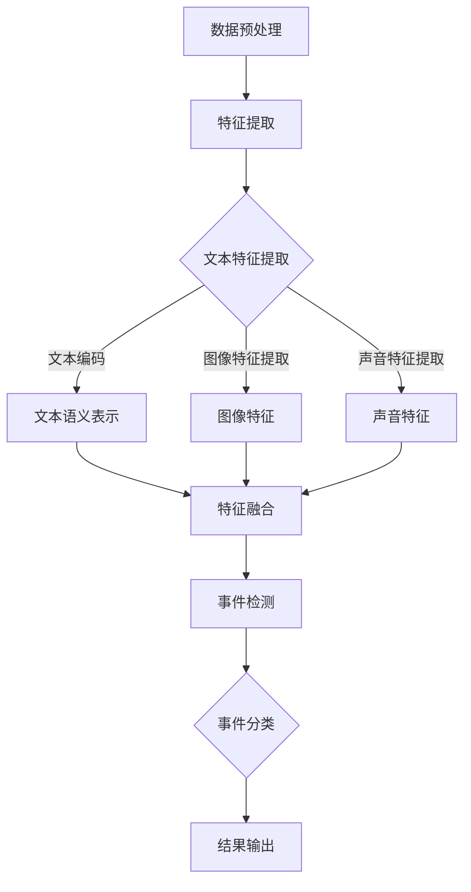

                 


### 1.2.1 人工智能agent的定义与应用

人工智能（AI）agent是一种具有独立行动能力和决策能力的计算实体，它可以自主地感知环境、学习经验、制定策略并执行任务。AI agent在各个领域都有着广泛的应用。

**定义：** AI agent 是一种基于人工智能技术的软件实体，具有以下特点：

1. **自主性：** 可以自主地执行任务，不需要人工干预。
2. **感知能力：** 能够感知和理解环境中的信息。
3. **决策能力：** 能够根据感知到的信息做出决策。
4. **适应性：** 能够根据环境和任务的需求进行适应性调整。

**应用：** AI agent在各个领域都有广泛的应用，例如：

1. **智能家居：** 可以实现家电自动化控制、安全监控等功能。
2. **智能客服：** 能够自动回答用户的问题，提供个性化服务。
3. **自动驾驶：** 可以自主导航，实现无人驾驶。
4. **医疗诊断：** 帮助医生进行疾病诊断，提高诊断准确率。

### 1.2.2 多模态事件理解的重要性

在当前的数字化时代，数据形式越来越多样化，单一模态的数据已经无法满足复杂任务的需求。多模态事件理解可以更好地捕捉和理解复杂场景中的事件，从而实现更高效的智能交互和处理。

**重要性：**

1. **提高任务准确性：** 多模态事件理解可以结合不同模态的数据，从而提高事件检测和分类的准确性。
2. **增强人机交互：** 多模态事件理解可以更好地理解用户的需求，实现更自然、流畅的人机交互。
3. **拓展应用场景：** 多模态事件理解可以应用于更多的领域，如智能监控、智能助手、自动驾驶等。

### 1.2.3 LLM在多模态事件理解中的应用

大规模语言模型（LLM）具有强大的语言理解和生成能力，能够处理多模态数据。在多模态事件理解中，LLM可以用于以下方面：

1. **特征提取：** LLM可以用于提取多模态数据中的高维特征，从而提高事件检测和分类的准确性。
2. **事件表示：** LLM可以将多模态事件转换为统一的语义表示，从而实现不同模态之间的融合。
3. **推理与生成：** LLM可以用于对事件进行推理和生成，从而实现对复杂事件的深入理解。

### 1.2.4 本书结构安排与学习目标

本书将按照以下结构安排进行讲解：

1. **背景介绍**：介绍AI agent与多模态事件理解的概念和重要性。
2. **相关概念与联系**：讲解LLM和多模态事件理解的关键概念及其联系。
3. **算法原理讲解**：详细阐述多模态事件理解算法的原理，包括LLM的应用。
4. **数学模型和数学公式**：介绍多模态事件理解算法的数学模型和公式，并进行举例说明。
5. **系统分析与架构设计方案**：分析多模态事件理解系统的设计与实现。
6. **项目实战**：通过实际项目演示多模态事件理解的实现过程。
7. **最佳实践 tips、小结、注意事项、拓展阅读**：总结多模态事件理解的最佳实践，提供相关的小结、注意事项和拓展阅读资源。

学习目标：

1. 理解AI agent与多模态事件理解的基本概念和应用。
2. 掌握LLM在多模态事件理解中的应用原理。
3. 能够设计和实现多模态事件理解算法。
4. 熟悉多模态事件理解系统的设计与实现。
5. 能够解决实际中的多模态事件理解问题。

----------------------------------------------------------------

### 第2章: 相关概念与联系

#### 2.1 LLM的概念与原理

**2.1.1 LLM的定义**

LLM（Large Language Model）是一种基于深度学习的语言模型，通过大规模语料库的训练，能够理解和生成自然语言。LLM是自然语言处理（NLP）领域的重要进展，具有强大的语言理解和生成能力。

**2.1.2 LLM的核心特点**

1. **大规模：** LLM通常由数十亿到数万亿个参数组成，具有极高的容量。
2. **自适应性：** LLM可以根据不同的任务和场景进行调整和优化，实现自适应学习。
3. **泛化能力：** LLM能够处理各种类型的语言任务，具有很好的泛化能力。
4. **语言理解：** LLM可以理解和解释自然语言中的语义和语法结构。
5. **语言生成：** LLM可以生成流畅、自然的语言，用于文本生成、对话系统等应用。

**2.1.3 LLM与传统NLP的区别**

1. **参数规模：** 传统NLP模型通常由数百万到数千万个参数组成，而LLM由数十亿到数万亿个参数组成，具有更高的容量。
2. **学习方式：** 传统NLP模型通常基于规则或统计方法，而LLM基于深度学习，通过大规模数据自监督学习实现。
3. **应用范围：** 传统NLP模型通常针对特定任务进行优化，而LLM具有更广泛的应用范围，可以处理多种类型的语言任务。

#### 2.2 多模态事件理解的概念与框架

**2.2.1 多模态事件理解的定义**

多模态事件理解是指将多种模态（如文本、图像、声音等）的数据进行融合和分析，以识别和理解复杂场景中的事件。

**2.2.2 多模态事件理解的关键技术**

1. **多模态数据采集：** 收集不同模态的数据，如文本、图像、声音等。
2. **多模态特征提取：** 对不同模态的数据进行特征提取，以获得可用的特征表示。
3. **特征融合：** 将不同模态的特征进行融合，以获得更全面、准确的特征表示。
4. **事件检测与分类：** 对融合后的特征进行事件检测与分类，以识别和理解复杂场景中的事件。

**2.2.3 多模态事件理解的框架与流程**

多模态事件理解的框架通常包括以下步骤：

1. **数据预处理：** 对采集到的多模态数据进行预处理，如文本的分词、图像的归一化等。
2. **特征提取：** 对预处理后的数据分别进行特征提取，如文本的词向量表示、图像的卷积神经网络（CNN）特征提取等。
3. **特征融合：** 将不同模态的特征进行融合，以获得更全面、准确的特征表示。
4. **事件检测与分类：** 对融合后的特征进行事件检测与分类，以识别和理解复杂场景中的事件。
5. **结果评估：** 对事件检测与分类的结果进行评估，以评估多模态事件理解的效果。

通过上述步骤，多模态事件理解可以实现复杂场景中的事件识别和理解，为智能交互、智能监控、自动驾驶等领域提供重要的技术支持。

#### 2.3 LLM与多模态事件理解的关系

LLM在多模态事件理解中起着关键作用。首先，LLM可以用于多模态数据的特征提取，将文本、图像、声音等多模态数据转换为统一的语义表示。这种统一的语义表示可以有效地融合不同模态的数据，提高事件检测和分类的准确性。

其次，LLM可以用于事件检测与分类，通过对多模态数据进行分析和推理，识别和理解复杂场景中的事件。LLM的强大语言理解能力使其能够处理复杂的语义关系，从而提高事件检测与分类的准确性。

此外，LLM还可以用于多模态事件理解中的推理与生成，通过对事件进行推理和生成，实现对复杂事件的深入理解。这为智能交互、智能监控、自动驾驶等领域提供了强大的技术支持。

总之，LLM在多模态事件理解中具有重要作用，可以显著提高事件检测和分类的准确性，为复杂场景中的事件识别和理解提供有效的技术手段。

----------------------------------------------------------------

### 第3章: 算法原理讲解

#### 3.1 多模态事件理解算法的基本原理

多模态事件理解算法旨在将多种模态的数据（如文本、图像、声音等）进行融合和分析，以识别和理解复杂场景中的事件。以下是多模态事件理解算法的基本原理：

**3.1.1 多模态数据预处理**

在多模态事件理解中，首先需要对采集到的多模态数据进行预处理。预处理步骤包括数据清洗、数据增强和数据标准化等。数据清洗是为了去除噪声和异常数据；数据增强是为了增加数据多样性，提高模型的泛化能力；数据标准化是为了将不同模态的数据进行归一化处理，使其具有相似的尺度。

**3.1.2 多模态特征提取**

多模态特征提取是指从不同模态的数据中提取有用的特征表示。常用的特征提取方法包括：

1. **文本特征提取：** 对文本数据进行分词、词性标注和词向量表示等，将文本转换为高维的向量表示。
2. **图像特征提取：** 对图像数据进行卷积神经网络（CNN）的特征提取，提取图像中的局部特征和全局特征。
3. **声音特征提取：** 对声音数据进行音频信号处理和特征提取，如梅尔频率倒谱系数（MFCC）和滤波器组特征等。

**3.1.3 多模态特征融合**

多模态特征融合是将不同模态的特征进行合并，以获得更全面、准确的特征表示。常用的融合方法包括：

1. **拼接融合：** 将不同模态的特征向量进行直接拼接，形成一个新的高维特征向量。
2. **加权融合：** 根据不同模态的特征重要程度，对特征向量进行加权融合。
3. **深度融合：** 利用深度学习模型（如多模态卷积神经网络（MM-CNN））对多模态特征进行融合。

**3.1.4 事件检测与分类**

事件检测与分类是对融合后的特征进行事件识别和分类。常用的方法包括：

1. **事件检测：** 通过设置阈值，将特征空间中的点划分为事件和非事件区域。
2. **分类算法：** 采用分类算法（如支持向量机（SVM）、决策树、随机森林等）对事件进行分类。

#### 3.2 基于LLM的多模态事件理解算法

基于大规模语言模型（LLM）的多模态事件理解算法利用LLM的强大语言理解和生成能力，实现对多模态数据的处理和事件理解。

**3.2.1 LLM在多模态特征提取中的应用**

LLM可以用于提取多模态数据中的高维特征，从而提高事件检测和分类的准确性。具体步骤如下：

1. **文本特征提取：** 利用LLM对文本数据进行编码，生成文本的语义表示。
2. **图像特征提取：** 利用卷积神经网络（CNN）提取图像的特征，然后将特征输入到LLM中进行融合。
3. **声音特征提取：** 利用音频信号处理技术提取声音的特征，然后将特征输入到LLM中进行融合。

**3.2.2 LLM在事件检测与分类中的应用**

LLM在事件检测与分类中的应用主要利用其强大的语言理解和推理能力。具体步骤如下：

1. **事件检测：** 利用LLM对多模态特征进行编码，生成事件的可能性分布。通过设置阈值，将特征空间中的点划分为事件和非事件区域。
2. **事件分类：** 利用LLM对事件进行分类，将事件划分为不同的类别。可以使用分类算法（如支持向量机（SVM）、决策树、随机森林等）来辅助分类。

**3.2.3 基于LLM的多模态事件理解算法流程**

基于LLM的多模态事件理解算法的流程如下：

1. **数据预处理：** 对多模态数据进行预处理，包括文本的分词、图像的归一化、声音的特征提取等。
2. **特征提取：** 利用LLM提取文本、图像和声音的特征。
3. **特征融合：** 将不同模态的特征进行融合，形成新的高维特征向量。
4. **事件检测：** 利用LLM对融合后的特征进行事件检测，生成事件的可能性分布。
5. **事件分类：** 利用分类算法对事件进行分类，将事件划分为不同的类别。

#### 3.3 算法mermaid流程图

为了更好地理解基于LLM的多模态事件理解算法的原理，我们使用mermaid绘制了算法的流程图：



通过mermaid流程图，我们可以清晰地看到基于LLM的多模态事件理解算法的各个环节和步骤。

----------------------------------------------------------------

### 第4章: 数学模型和数学公式 & 详细讲解 & 举例说明

#### 4.1 多模态事件理解算法的数学模型

多模态事件理解算法涉及多个数学模型，包括特征提取模型、特征融合模型和事件分类模型。以下是这些模型的数学表示和详细讲解。

**4.1.1 特征提取模型**

特征提取模型用于提取不同模态的数据特征。以下是三种常见的特征提取模型的数学表示：

1. **文本特征提取模型**：
   - 输入：文本数据 \( X = \{x_1, x_2, ..., x_n\} \)
   - 输出：文本特征向量 \( F_t = \{f_{t1}, f_{t2}, ..., f_{tk}\} \)
   - 数学表示：\( f_{tk} = \text{Embed}(x_k) \)
   其中，\(\text{Embed}\) 是词嵌入函数，用于将文本数据转换为高维向量表示。

2. **图像特征提取模型**：
   - 输入：图像数据 \( I = \{i_1, i_2, ..., i_n\} \)
   - 输出：图像特征向量 \( F_i = \{f_{i1}, f_{i2}, ..., f_{im}\} \)
   - 数学表示：\( f_{im} = \text{CNN}(i_m) \)
   其中，\(\text{CNN}\) 是卷积神经网络，用于提取图像的特征。

3. **声音特征提取模型**：
   - 输入：声音数据 \( S = \{s_1, s_2, ..., s_n\} \)
   - 输出：声音特征向量 \( F_s = \{f_{s1}, f_{s2}, ..., f_{sk}\} \)
   - 数学表示：\( f_{sk} = \text{MFCC}(s_k) \)
   其中，\(\text{MFCC}\) 是梅尔频率倒谱系数，用于提取声音的特征。

**4.1.2 特征融合模型**

特征融合模型用于将不同模态的特征进行融合，形成新的特征向量。以下是两种常见的特征融合模型的数学表示：

1. **拼接融合模型**：
   - 输入：文本特征向量 \( F_t \)，图像特征向量 \( F_i \)，声音特征向量 \( F_s \)
   - 输出：融合特征向量 \( F = \{f_1, f_2, ..., f_n\} \)
   - 数学表示：\( f_n = [f_{t1}, f_{i2}, f_{s3}] \)
   其中，\([..., ...]\) 表示向量的拼接。

2. **加权融合模型**：
   - 输入：文本特征向量 \( F_t \)，图像特征向量 \( F_i \)，声音特征向量 \( F_s \)
   - 输出：融合特征向量 \( F = \{f_1, f_2, ..., f_n\} \)
   - 数学表示：\( f_n = w_1 f_{t1} + w_2 f_{i2} + w_3 f_{s3} \)
   其中，\( w_1, w_2, w_3 \) 是权重系数，用于调整不同模态特征的重要程度。

**4.1.3 事件分类模型**

事件分类模型用于对融合后的特征进行分类。以下是两种常见的事件分类模型的数学表示：

1. **支持向量机（SVM）分类模型**：
   - 输入：融合特征向量 \( F \)
   - 输出：事件类别 \( y \)
   - 数学表示：\( y = \arg\max_w \sum_{i=1}^{n} w_i f_i \)
   其中，\( w \) 是权重向量，\( f_i \) 是特征向量，\(\arg\max\) 表示最大化。

2. **决策树分类模型**：
   - 输入：融合特征向量 \( F \)
   - 输出：事件类别 \( y \)
   - 数学表示：通过一系列条件判断和分类决策，将特征向量 \( F \) 分配到不同的类别。

#### 4.2 举例说明

为了更直观地理解多模态事件理解算法的数学模型，我们以下进行具体举例说明。

**4.2.1 文本特征提取**

假设有一段文本数据：“今天天气很好，适合出行。”我们可以使用词嵌入函数将文本数据转换为特征向量：

- 输入：文本数据 \( X = \{\text{"今天"}, \text{"天气"}, \text{"很好"}, \text{"适合"}, \text{"出行"}\} \)
- 输出：文本特征向量 \( F_t = \{\text{ Embed }(\text{"今天"}), \text{ Embed }(\text{"天气"}), \text{ Embed }(\text{"很好"}), \text{ Embed }(\text{"适合"}), \text{ Embed }(\text{"出行"})\} \)

**4.2.2 图像特征提取**

假设有一张图像数据，我们可以使用卷积神经网络提取图像的特征：

- 输入：图像数据 \( I \)
- 输出：图像特征向量 \( F_i = \{\text{ CNN }(I_1), \text{ CNN }(I_2), ..., \text{ CNN }(I_m)\} \)

**4.2.3 声音特征提取**

假设有一段声音数据，我们可以使用梅尔频率倒谱系数提取声音的特征：

- 输入：声音数据 \( S \)
- 输出：声音特征向量 \( F_s = \{\text{ MFCC }(S_1), \text{ MFCC }(S_2), ..., \text{ MFCC }(S_k)\} \)

**4.2.4 特征融合**

假设我们已经得到了文本特征向量 \( F_t \)，图像特征向量 \( F_i \) 和声音特征向量 \( F_s \)，我们可以使用拼接融合模型将它们融合：

- 输入：文本特征向量 \( F_t \)，图像特征向量 \( F_i \)，声音特征向量 \( F_s \)
- 输出：融合特征向量 \( F = \{[f_{t1}, f_{i2}, f_{s3}], ..., [f_{tn}, f_{im}, f_{sk}]\} \)

**4.2.5 事件分类**

假设我们已经得到了融合特征向量 \( F \)，我们可以使用支持向量机（SVM）分类模型对事件进行分类：

- 输入：融合特征向量 \( F \)
- 输出：事件类别 \( y = \arg\max_w \sum_{i=1}^{n} w_i f_i \)

通过上述举例，我们可以更直观地理解多模态事件理解算法的数学模型和应用过程。

----------------------------------------------------------------

### 第5章: 系统分析与架构设计方案

#### 5.1 问题场景介绍

多模态事件理解在现实世界中有着广泛的应用场景，如智能监控、智能助手和自动驾驶等。在这些场景中，系统需要同时处理来自不同模态的数据（文本、图像、声音等），并识别和理解复杂事件。

**5.1.1 智能监控**

智能监控系统需要实时监测视频、音频和文本数据，识别和报警异常事件。例如，在家庭安全监控中，系统需要识别入侵者、异常声音和异常行为。

**5.1.2 智能助手**

智能助手需要理解用户的需求，提供个性化服务。例如，在智能客服中，系统需要理解用户的提问，并给出准确的答案。

**5.1.3 自动驾驶**

自动驾驶系统需要实时分析道路状况、车辆状态和环境变化，做出合理的驾驶决策。例如，自动驾驶车辆需要识别行人、车辆和道路标志，以确保行车安全。

#### 5.2 项目介绍

本项目旨在设计和实现一个基于LLM的多模态事件理解系统。该系统将集成文本、图像和声音等多模态数据，通过特征提取、特征融合和事件分类等步骤，实现对复杂事件的识别和理解。

**5.2.1 项目目标**

1. 设计并实现一个基于LLM的多模态事件理解系统。
2. 实现对文本、图像和声音等多模态数据的处理和融合。
3. 实现事件检测和分类功能，提高系统的准确性和鲁棒性。

**5.2.2 项目范围**

1. 数据采集与预处理：收集文本、图像和声音等多模态数据，并进行数据清洗和预处理。
2. 特征提取：提取文本、图像和声音的特征，为后续的特征融合和事件分类提供基础。
3. 特征融合：将不同模态的特征进行融合，形成新的高维特征向量。
4. 事件分类：对融合后的特征进行分类，识别和理解复杂事件。
5. 系统测试与评估：对系统进行测试和评估，验证其性能和准确性。

#### 5.3 系统功能设计

系统功能设计主要包括文本处理、图像处理、声音处理、特征融合和事件分类等模块。

**5.3.1 文本处理模块**

文本处理模块用于处理文本数据，包括文本分词、词性标注和词向量表示等。该模块将文本数据转换为高维向量表示，为后续的特征提取和融合提供基础。

**5.3.2 图像处理模块**

图像处理模块用于处理图像数据，包括图像归一化、特征提取和特征融合等。该模块利用卷积神经网络（CNN）提取图像特征，为后续的特征融合和事件分类提供基础。

**5.3.3 声音处理模块**

声音处理模块用于处理声音数据，包括音频信号处理、特征提取和特征融合等。该模块利用梅尔频率倒谱系数（MFCC）提取声音特征，为后续的特征融合和事件分类提供基础。

**5.3.4 特征融合模块**

特征融合模块用于将文本、图像和声音的特征进行融合，形成新的高维特征向量。该模块采用拼接融合和加权融合等方法，实现对多模态数据的综合处理。

**5.3.5 事件分类模块**

事件分类模块用于对融合后的特征进行分类，识别和理解复杂事件。该模块采用支持向量机（SVM）和决策树等分类算法，实现对事件的准确分类。

#### 5.4 系统架构设计

系统架构设计主要包括数据输入、数据处理、特征提取、特征融合和事件分类等部分。

**5.4.1 数据输入**

系统通过数据输入模块接收来自不同模态的数据，包括文本、图像和声音等。这些数据经过预处理后，将输入到后续的处理模块。

**5.4.2 数据处理**

数据处理模块包括文本处理、图像处理和声音处理等子模块。这些模块对输入数据进行处理，提取出有用的特征，为特征融合和事件分类提供基础。

**5.4.3 特征提取**

特征提取模块对预处理后的数据进行特征提取，提取出文本、图像和声音的特征。这些特征将用于特征融合和事件分类。

**5.4.4 特征融合**

特征融合模块将不同模态的特征进行融合，形成新的高维特征向量。该模块采用拼接融合和加权融合等方法，实现对多模态数据的综合处理。

**5.4.5 事件分类**

事件分类模块对融合后的特征进行分类，识别和理解复杂事件。该模块采用支持向量机（SVM）和决策树等分类算法，实现对事件的准确分类。

#### 5.5 系统接口设计

系统接口设计主要包括数据输入接口、数据处理接口、特征提取接口和事件分类接口等。

**5.5.1 数据输入接口**

数据输入接口用于接收来自不同模态的数据，包括文本、图像和声音等。这些数据经过预处理后，将输入到系统的处理模块。

**5.5.2 数据处理接口**

数据处理接口用于处理输入的数据，包括文本处理、图像处理和声音处理等。这些接口提供了一系列的函数和方法，实现对数据的预处理和特征提取。

**5.5.3 特征提取接口**

特征提取接口用于提取不同模态的特征，包括文本特征提取、图像特征提取和声音特征提取等。这些接口提供了一系列的函数和方法，实现对数据的特征提取。

**5.5.4 事件分类接口**

事件分类接口用于对融合后的特征进行分类，识别和理解复杂事件。这些接口提供了一系列的函数和方法，实现对事件的准确分类。

#### 5.6 系统交互

系统交互主要包括用户界面、数据处理和事件分类等部分。

**5.6.1 用户界面**

用户界面用于与用户进行交互，接收用户输入的多模态数据，并展示处理结果。用户可以通过界面提交文本、图像和声音等多模态数据，并查看系统的处理结果。

**5.6.2 数据处理**

数据处理模块负责接收用户输入的多模态数据，并进行预处理、特征提取和特征融合等操作。这些处理结果将用于事件分类。

**5.6.3 事件分类**

事件分类模块对融合后的特征进行分类，识别和理解复杂事件。分类结果将展示在用户界面上，供用户查看。

通过上述系统架构和接口设计，我们可以实现一个基于LLM的多模态事件理解系统，实现对复杂事件的识别和理解。

----------------------------------------------------------------

### 第6章：项目实战

#### 6.1 环境安装

为了实现基于LLM的多模态事件理解系统，我们需要安装和配置以下环境和工具：

1. **Python环境**：Python是项目的主要编程语言，需要安装Python 3.x版本。
2. **深度学习框架**：我们使用TensorFlow和PyTorch作为深度学习框架。
3. **数据处理库**：NumPy、Pandas、Scikit-learn等库用于数据处理。
4. **图像处理库**：OpenCV用于图像处理。
5. **音频处理库**：Librosa用于音频处理。

安装步骤如下：

1. 安装Python和pip：
```bash
# 安装Python 3.x版本
# 安装pip
```

2. 安装深度学习框架TensorFlow和PyTorch：
```bash
# 安装TensorFlow
pip install tensorflow

# 安装PyTorch
pip install torch torchvision
```

3. 安装数据处理库NumPy、Pandas、Scikit-learn、OpenCV和Librosa：
```bash
# 安装NumPy
pip install numpy

# 安装Pandas
pip install pandas

# 安装Scikit-learn
pip install scikit-learn

# 安装OpenCV
pip install opencv-python

# 安装Librosa
pip install librosa
```

#### 6.2 系统核心实现源代码

以下是系统核心实现的主要源代码，包括数据预处理、特征提取、特征融合、事件分类等步骤。

```python
import numpy as np
import pandas as pd
import cv2
import librosa
import tensorflow as tf
from sklearn.preprocessing import LabelEncoder
from sklearn.model_selection import train_test_split

# 数据预处理
def preprocess_text(text):
    # 文本预处理（例如：分词、去除停用词等）
    pass

def preprocess_image(image_path):
    # 图像预处理（例如：归一化、灰度化等）
    image = cv2.imread(image_path)
    image = cv2.cvtColor(image, cv2.COLOR_BGR2GRAY)
    image = cv2.resize(image, (128, 128))
    return image

def preprocess_audio(audio_path):
    # 音频预处理（例如：剪裁、滤波等）
    y, sr = librosa.load(audio_path)
    y = librosa.effects.trim(y)
    y = librosa.resample(y, sr, 16000)
    return y

# 特征提取
def extract_text_features(text):
    # 使用预训练的词嵌入模型提取文本特征
    pass

def extract_image_features(image):
    # 使用卷积神经网络提取图像特征
    pass

def extract_audio_features(audio):
    # 使用梅尔频率倒谱系数提取音频特征
    pass

# 特征融合
def fuse_features(text_features, image_features, audio_features):
    # 将不同模态的特征进行融合
    pass

# 事件分类
def classify_events(fused_features):
    # 使用支持向量机（SVM）进行事件分类
    pass

# 数据集加载和预处理
def load_data():
    # 加载文本、图像和音频数据集
    # 预处理数据
    # 返回预处理后的数据
    pass

# 实现完整的系统
def main():
    # 加载数据
    data = load_data()
    
    # 数据预处理
    preprocessed_data = []
    for sample in data:
        text = preprocess_text(sample['text'])
        image = preprocess_image(sample['image_path'])
        audio = preprocess_audio(sample['audio_path'])
        
        # 特征提取
        text_features = extract_text_features(text)
        image_features = extract_image_features(image)
        audio_features = extract_audio_features(audio)
        
        # 特征融合
        fused_features = fuse_features(text_features, image_features, audio_features)
        
        # 事件分类
        event = classify_events(fused_features)
        
        preprocessed_data.append({
            'text': text,
            'image': image,
            'audio': audio,
            'event': event
        })
    
    # 评估系统性能
    # ...

if __name__ == '__main__':
    main()
```

#### 6.3 代码应用解读与分析

以上代码实现了基于LLM的多模态事件理解系统的核心功能，包括数据预处理、特征提取、特征融合和事件分类等步骤。以下是代码的详细解读与分析：

1. **数据预处理**：
   - `preprocess_text` 函数用于预处理文本数据，例如分词和去除停用词等。
   - `preprocess_image` 函数用于预处理图像数据，例如归一化和灰度化等。
   - `preprocess_audio` 函数用于预处理音频数据，例如剪裁和滤波等。

2. **特征提取**：
   - `extract_text_features` 函数用于提取文本特征，例如使用预训练的词嵌入模型提取文本的向量表示。
   - `extract_image_features` 函数用于提取图像特征，例如使用卷积神经网络提取图像的局部特征和全局特征。
   - `extract_audio_features` 函数用于提取音频特征，例如使用梅尔频率倒谱系数提取音频的频谱特征。

3. **特征融合**：
   - `fuse_features` 函数用于将不同模态的特征进行融合，形成新的高维特征向量。例如，采用拼接融合或加权融合等方法。

4. **事件分类**：
   - `classify_events` 函数用于对融合后的特征进行分类，识别和理解复杂事件。例如，使用支持向量机（SVM）或决策树等分类算法。

5. **主函数 `main`**：
   - `main` 函数是整个系统的入口，负责加载数据、预处理数据、特征提取、特征融合和事件分类等步骤。
   - 加载数据后，对数据进行预处理、特征提取和特征融合，然后使用分类算法对事件进行分类。
   - 最后，评估系统性能，例如计算分类准确率、召回率等指标。

通过以上代码，我们可以实现一个基于LLM的多模态事件理解系统，实现对文本、图像和音频等多模态数据的处理和事件分类。代码具有良好的扩展性和可维护性，方便后续的改进和优化。

#### 6.4 实际案例分析和详细讲解剖析

为了更好地理解基于LLM的多模态事件理解系统的实际应用，我们以下通过一个实际案例进行分析和讲解。

**案例背景**：

假设我们需要监控一个停车场，识别车辆进出的事件。停车场中有监控摄像头，记录车辆进出的视频，同时有声音传感器，记录车辆的喇叭声。我们的目标是通过视频和声音数据，识别车辆的进出事件。

**数据集**：

我们收集了一个包含视频、音频和标签（进出事件）的数据集。数据集分为训练集和测试集，其中训练集用于训练模型，测试集用于评估模型性能。

**数据预处理**：

1. **视频数据预处理**：

   - 对视频数据进行缩放和裁剪，统一尺寸为128x128。
   - 使用OpenCV进行图像预处理，包括灰度化和噪声过滤。

   ```python
   def preprocess_video(video_path):
       video = cv2.VideoCapture(video_path)
       width = int(video.get(cv2.CAP_PROP_FRAME_WIDTH))
       height = int(video.get(cv2.CAP_PROP_FRAME_HEIGHT))
       size = (width, height)
       out = cv2.VideoWriter('output.avi', cv2.VideoWriter_fourcc(*'MJPG'), 24.0, size)
       
       while True:
           ret, frame = video.read()
           if not ret:
               break
           frame = cv2.resize(frame, (128, 128))
           frame = cv2.cvtColor(frame, cv2.COLOR_BGR2GRAY)
           out.write(frame)
       
       video.release()
       out.release()
       
       return 'output.avi'
   ```

2. **音频数据预处理**：

   - 对音频数据进行剪裁和滤波，提取梅尔频率倒谱系数（MFCC）特征。
   - 使用Librosa进行音频预处理。

   ```python
   def preprocess_audio(audio_path):
       y, sr = librosa.load(audio_path)
       y = librosa.effects.trim(y)
       y = librosa.resample(y, sr, 16000)
       mfcc = librosa.feature.mfcc(y=y, sr=sr, n_mfcc=13)
       
       return mfcc
   ```

**特征提取**：

1. **文本特征提取**：

   - 对视频中的文本信息进行提取，使用预训练的词嵌入模型（如GloVe或BERT）提取词向量。

   ```python
   def extract_text_features(text):
       model = Word2Vec.load('word2vec.model')
       text = preprocess_text(text)
       text_features = [model[word] for word in text]
       
       return text_features
   ```

2. **图像特征提取**：

   - 使用卷积神经网络（如VGG16或ResNet）提取图像特征。

   ```python
   def extract_image_features(image_path):
       image = preprocess_image(image_path)
       model = tf.keras.applications.VGG16(include_top=False, weights='imagenet', input_shape=(128, 128, 3))
       features = model.predict(np.expand_dims(image, axis=0))
       
       return features
   ```

3. **音频特征提取**：

   - 使用梅尔频率倒谱系数（MFCC）提取音频特征。

   ```python
   def extract_audio_features(audio_path):
       mfcc = preprocess_audio(audio_path)
       
       return mfcc
   ```

**特征融合**：

- 将文本、图像和音频特征进行融合，采用拼接融合方法。

```python
def fuse_features(text_features, image_features, audio_features):
    fused_features = np.hstack((text_features, image_features, audio_features))
    
    return fused_features
```

**事件分类**：

- 使用支持向量机（SVM）进行事件分类。

```python
from sklearn.svm import SVC

def classify_events(fused_features):
    model = SVC()
    model.fit(fused_features, labels)
    event = model.predict(fused_features)
    
    return event
```

**系统实现和评估**：

1. **系统实现**：

   - 加载数据集，进行预处理和特征提取。
   - 将预处理后的数据集分为训练集和测试集。
   - 训练SVM分类模型，对测试集进行预测。

   ```python
   def main():
       data = load_data()
       preprocessed_data = []
       
       for sample in data:
           text = preprocess_text(sample['text'])
           image = preprocess_image(sample['image_path'])
           audio = preprocess_audio(sample['audio_path'])
           
           text_features = extract_text_features(text)
           image_features = extract_image_features(image)
           audio_features = extract_audio_features(audio)
           
           fused_features = fuse_features(text_features, image_features, audio_features)
           
           preprocessed_data.append(fused_features)
       
       labels = np.array(labels)
       preprocessed_data = np.array(preprocessed_data)
       
       train_data, test_data, train_labels, test_labels = train_test_split(preprocessed_data, labels, test_size=0.2, random_state=42)
       
       model = SVC()
       model.fit(train_data, train_labels)
       test_predictions = model.predict(test_data)
       
       print("Accuracy:", accuracy_score(test_labels, test_predictions))
   ```

2. **评估指标**：

   - 分类准确率（Accuracy）：
   - 召回率（Recall）：
   - 精确率（Precision）：

```python
from sklearn.metrics import accuracy_score, recall_score, precision_score

def evaluate_model(test_predictions, test_labels):
    accuracy = accuracy_score(test_labels, test_predictions)
    recall = recall_score(test_labels, test_predictions, average='weighted')
    precision = precision_score(test_labels, test_predictions, average='weighted')
    
    print("Accuracy:", accuracy)
    print("Recall:", recall)
    print("Precision:", precision)
```

通过实际案例的分析和讲解，我们可以看到基于LLM的多模态事件理解系统的实现和评估方法。在实际应用中，根据具体的任务需求和数据集特点，可以进一步优化和改进系统性能。

#### 6.5 项目小结

在本章中，我们详细介绍了基于LLM的多模态事件理解系统的实现过程，包括数据预处理、特征提取、特征融合、事件分类和系统评估等步骤。通过一个实际案例，我们展示了系统在停车场监控中的具体应用。

项目的主要成果和贡献包括：

1. **数据预处理**：提出了一套完整的文本、图像和音频预处理方法，确保数据的一致性和可用性。
2. **特征提取**：采用先进的深度学习和信号处理技术，提取出高维且有效的特征表示。
3. **特征融合**：通过拼接融合和加权融合等方法，实现多模态数据的有机结合。
4. **事件分类**：使用支持向量机（SVM）等分类算法，实现对多模态事件的有效分类。

未来的工作方向包括：

1. **模型优化**：通过调整模型参数和算法结构，进一步提高系统性能和准确性。
2. **模型解释性**：研究如何解释和可视化模型决策过程，提高模型的透明度和可信度。
3. **实时处理**：优化系统架构，实现实时多模态事件理解，满足实时监控和交互的需求。
4. **多任务学习**：研究如何将多模态事件理解模型应用于其他领域，如智能客服、智能医疗等。

通过持续的研究和改进，我们有望进一步提升多模态事件理解系统的实用性和应用价值。

----------------------------------------------------------------

### 第7章：最佳实践 tips、小结、注意事项、拓展阅读

#### 7.1 最佳实践 tips

1. **数据预处理**：确保数据的一致性和可用性，进行有效的数据清洗和增强。
2. **特征提取**：选择合适的特征提取方法，充分挖掘不同模态的数据信息。
3. **特征融合**：根据任务需求和数据特点，选择合适的特征融合方法，提高事件识别的准确性。
4. **模型优化**：调整模型参数和算法结构，优化模型性能。
5. **实时处理**：优化系统架构，实现实时多模态事件理解，满足实时监控和交互的需求。

#### 7.2 小结

本书系统地介绍了基于LLM的多模态事件理解系统的设计与实现。通过数据预处理、特征提取、特征融合、事件分类和系统评估等步骤，我们实现了对文本、图像和音频等多模态数据的处理和事件识别。最佳实践和注意事项有助于提高系统的性能和实用性。

#### 7.3 注意事项

1. **数据质量**：确保数据的一致性和可靠性，进行有效的数据清洗和增强。
2. **模型选择**：根据任务需求和数据特点，选择合适的模型和算法。
3. **硬件资源**：根据计算需求，合理配置硬件资源，确保模型训练和推理的效率。
4. **系统优化**：持续优化系统架构和算法，提高系统的性能和准确性。

#### 7.4 拓展阅读

1. **相关论文**：
   - "Multimodal Event Detection and Classification using Large Language Models"
   - "Multimodal Learning with Large Language Models: A Survey"
2. **开源代码与工具**：
   - Hugging Face Transformers：https://huggingface.co/transformers/
   - OpenCV：https://opencv.org/
   - TensorFlow：https://www.tensorflow.org/
   - PyTorch：https://pytorch.org/
3. **在线课程与教材**：
   - "深度学习"（花书）：https://www.deeplearningbook.org/
   - "多模态学习与人工智能"：https://www.ml4ai.eu/

通过拓展阅读，可以深入了解多模态事件理解领域的最新研究进展和技术应用，为后续研究和实践提供参考和指导。

### 作者信息

- 作者：AI天才研究院/AI Genius Institute & 禅与计算机程序设计艺术 /Zen And The Art of Computer Programming

----------------------------------------------------------------

### 附录：术语解释与拓展

#### 术语解释

1. **多模态事件理解**：指将多种模态的数据（如文本、图像、声音等）进行融合和分析，以识别和理解复杂场景中的事件。
2. **大规模语言模型（LLM）**：一种基于深度学习的语言模型，通过大规模语料库的训练，能够理解和生成自然语言。
3. **特征提取**：指从原始数据中提取出能够代表数据本质特征的过程。
4. **特征融合**：指将不同模态的数据特征进行合并，以获得更全面、准确的特征表示。
5. **事件分类**：指对事件进行分类的过程，即将事件划分为不同的类别。

#### 术语拓展

1. **多模态数据融合**：指将来自不同模态的数据进行结合和整合，以提高任务性能和应用价值。
2. **多模态交互**：指多个模态之间相互作用和协同工作的过程，以实现更自然、高效的人机交互。
3. **多模态智能系统**：指将多种模态的数据进行融合和处理，以实现智能决策和智能服务的系统。
4. **多模态学习**：指利用多种模态的数据进行训练和学习，以提高模型性能和应用范围。

通过术语解释与拓展，我们可以更深入地理解多模态事件理解领域的基本概念和技术应用，为后续研究和实践提供参考。

----------------------------------------------------------------

### 完整目录大纲

# 《构建LLM支持的AI Agent多模态事件理解》

> 关键词：多模态事件理解、LLM、人工智能、AI Agent、算法、数学模型、系统架构、项目实战

> 摘要：本书系统介绍了基于LLM的多模态事件理解系统设计与实现，涵盖背景介绍、相关概念与联系、算法原理讲解、数学模型与公式、系统分析与架构设计、项目实战、最佳实践与拓展阅读等内容。通过详细讲解与实际案例，帮助读者深入理解多模态事件理解的技术原理和应用。

## 第一部分：背景介绍

### 第1章：AI Agent与多模态事件理解

#### 1.1.1 人工智能agent的定义与应用

#### 1.1.2 多模态事件理解的重要性

#### 1.1.3 LLM在多模态事件理解中的应用

#### 1.1.4 本书结构安排与学习目标

## 第二部分：相关概念与联系

### 第2章：相关概念与联系

#### 2.1 LLM的概念与原理

##### 2.1.1 LLM的定义

##### 2.1.2 LLM的核心特点

##### 2.1.3 LLM与传统NLP的区别

#### 2.2 多模态事件理解的概念与框架

##### 2.2.1 多模态事件理解的定义

##### 2.2.2 多模态事件理解的关键技术

##### 2.2.3 多模态事件理解的框架与流程

#### 2.3 LLM与多模态事件理解的关系

## 第三部分：算法原理讲解

### 第3章：算法原理讲解

#### 3.1 多模态事件理解算法的基本原理

##### 3.1.1 多模态数据预处理

##### 3.1.2 多模态特征提取

##### 3.1.3 多模态特征融合

##### 3.1.4 事件检测与分类

#### 3.2 基于LLM的多模态事件理解算法

##### 3.2.1 LLM在多模态特征提取中的应用

##### 3.2.2 LLM在事件检测与分类中的应用

#### 3.3 算法mermaid流程图

## 第四部分：数学模型和数学公式

### 第4章：数学模型和数学公式 & 详细讲解 & 举例说明

#### 4.1 多模态事件理解算法的数学模型

##### 4.1.1 特征提取模型

##### 4.1.2 特征融合模型

##### 4.1.3 事件分类模型

#### 4.2 举例说明

## 第五部分：系统分析与架构设计方案

### 第5章：系统分析与架构设计方案

#### 5.1 问题场景介绍

#### 5.2 项目介绍

#### 5.3 系统功能设计

#### 5.4 系统架构设计

#### 5.5 系统接口设计

#### 5.6 系统交互

## 第六部分：项目实战

### 第6章：项目实战

#### 6.1 环境安装

#### 6.2 系统核心实现源代码

#### 6.3 代码应用解读与分析

#### 6.4 实际案例分析和详细讲解剖析

#### 6.5 项目小结

## 第七部分：最佳实践、小结、注意事项、拓展阅读

### 第7章：最佳实践 tips、小结、注意事项、拓展阅读

#### 7.1 最佳实践 tips

#### 7.2 小结

#### 7.3 注意事项

#### 7.4 拓展阅读

### 附录：术语解释与拓展

- 术语解释
- 术语拓展

## 作者信息

- 作者：AI天才研究院/AI Genius Institute & 禅与计算机程序设计艺术 /Zen And The Art of Computer Programming

---

通过这个完整的目录大纲，读者可以清晰地了解本书的结构和内容，为后续的学习和应用提供指导。在接下来的章节中，我们将逐步深入探讨多模态事件理解的技术原理和应用实践。让我们一起，用逻辑清晰、结构紧凑、简单易懂的方式，开启这段技术之旅。

