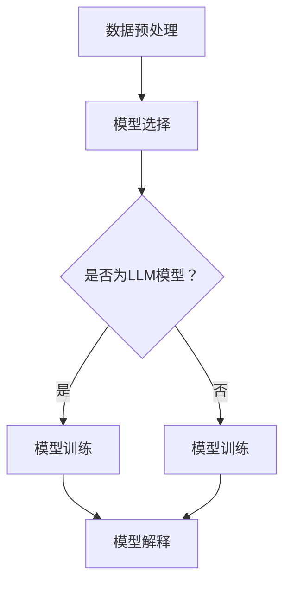
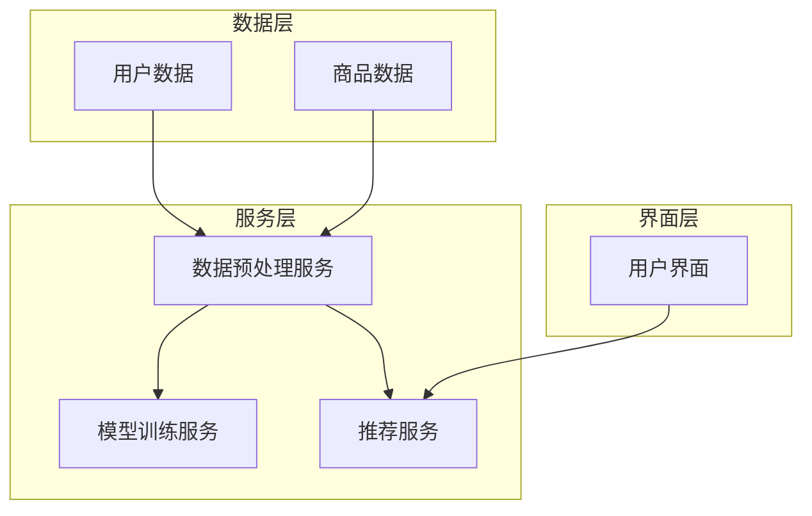
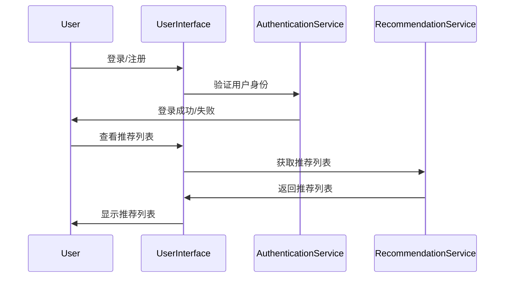

                 

### 构建LLM驱动的AI Agent可解释推荐系统

#### 关键词：
- LLM（大型语言模型）
- AI Agent
- 可解释推荐系统
- 数据预处理
- 模型选择
- 模型训练
- 模型解释

#### 摘要：
本文将探讨如何构建一个基于大型语言模型（LLM）的AI Agent可解释推荐系统。首先，我们介绍LLM、AI Agent以及可解释推荐系统的核心概念，并分析它们之间的联系。接着，我们将详细讲解数据预处理、模型选择与训练、模型解释等关键步骤。通过本文的深入分析，读者将掌握构建此类推荐系统的方法和技巧，为未来的研究和应用打下基础。

---

### 第一部分：背景介绍

#### 核心概念

**问题背景**：
随着人工智能技术的迅速发展，大模型（如LLM、BERT、GPT等）在推荐系统中的应用变得越来越广泛。这些模型凭借其强大的语言理解和生成能力，能够处理复杂的文本数据，从而在推荐系统中表现出色。

然而，如何构建一个可解释的推荐系统，使得AI agent能够提供准确且透明的推荐，成为当前研究的热点和挑战。可解释性对于提高用户信任度和系统可靠性至关重要。

**问题描述**：
构建一个LLM驱动的AI agent可解释推荐系统，涉及到多个技术环节，包括数据预处理、模型选择、模型训练、模型解释等。每个环节都需要深入分析和优化，以确保推荐系统的性能和可解释性。

**问题解决**：
为了系统地介绍构建LLM驱动的AI agent可解释推荐系统的方法，本文将采用以下结构：

1. **背景介绍**：介绍核心概念和问题描述。
2. **核心概念与联系**：详细阐述LLM、AI agent和可解释推荐系统的核心概念，并分析它们之间的联系。
3. **算法原理讲解**：讲解数据预处理、模型选择与训练、模型解释等关键步骤。
4. **系统分析与架构设计方案**：介绍推荐系统的架构设计和接口设计。
5. **项目实战**：通过一个实际项目展示如何构建和实现LLM驱动的AI agent可解释推荐系统。
6. **最佳实践与小结**：总结最佳实践和注意事项，并提出未来研究方向。

**边界与外延**：
本文主要关注于LLM驱动的AI agent可解释推荐系统的构建，不涉及其他类型的推荐系统。同时，本文将围绕可解释性这一核心概念，探讨如何提高推荐系统的透明度和可信度。

**概念结构与核心要素组成**：

1. **LLM（大型语言模型）**：如BERT、GPT等，具有强大的语言理解和生成能力。
2. **AI agent**：具有自主决策能力的智能体，能够根据用户行为和偏好生成个性化推荐。
3. **可解释推荐系统**：不仅能提供推荐结果，还能解释推荐原因，提高用户信任度和满意度。
4. **数据预处理**：包括数据清洗、特征提取等，为模型训练提供高质量的数据。
5. **模型选择与训练**：选择适合的LLM模型，并进行训练，以生成高质量的推荐结果。
6. **模型解释**：通过模型解释技术，解释推荐结果的原因，提高推荐系统的可解释性。

### 第二部分：核心概念与联系

#### 核心概念原理

**LLM模型**：
LLM（Large Language Model）是一种预训练模型，通过在大规模语料库上进行预训练，能够捕捉到语言的复杂结构和语义信息。常见的LLM模型包括BERT、GPT、RoBERTa等。

- **预训练过程**：LLM模型首先在大规模语料库上进行预训练，学习到语言的统计特征和语义信息。
- **任务适应性**：通过微调（Fine-tuning），LLM模型可以适应各种自然语言处理任务，如文本分类、问答系统、机器翻译等。

**AI agent**：
AI agent（Artificial Intelligence Agent）是一种具有自主决策能力的智能体，能够在复杂环境中执行任务。在推荐系统中，AI agent根据用户的行为和偏好生成个性化推荐。

- **自主决策**：AI agent能够根据环境变化和用户反馈自主调整推荐策略。
- **交互性**：AI agent与用户进行交互，收集用户反馈，不断优化推荐结果。

**可解释推荐系统**：
可解释推荐系统（Explainable Recommendation System）不仅能提供推荐结果，还能解释推荐原因，帮助用户理解推荐背后的逻辑。可解释性对于提高用户信任度和系统可靠性至关重要。

- **解释技术**：使用可视化、文本解释、逻辑推理等方法，解释推荐结果的原因。
- **用户反馈**：收集用户对推荐结果的反馈，进一步优化推荐策略。

#### 概念属性特征对比表格

| 概念         | 特征             | 对比                      |
| ------------ | ---------------- | ------------------------- |
| LLM模型      | 强大的语言理解   | 与传统模型相比，更擅长处理文本 |
| AI agent     | 自主决策能力     | 能够根据环境变化进行调整     |
| 可解释推荐系统 | 提供解释         | 提升用户信任度和满意度       |

#### ER实体关系图架构

```mermaid
erDiagram
  User ||--|{ AI_agent : generates_recommendations }
  Item ||--|{ AI_agent : recommends_items }
  User --||> Item : has_preferences
```

### 第三部分：算法原理讲解

#### 算法mermaid流程图



#### 算法原理

**数据预处理**：
数据预处理是构建推荐系统的第一步，主要包括数据清洗、特征提取和数据规范化等。

- **数据清洗**：去除无效数据、缺失值填充、去除噪声等，确保数据质量。
- **特征提取**：提取用户行为、偏好和物品特征，为模型训练提供输入。
- **数据规范化**：将不同特征进行规范化处理，使其具有相似的数值范围。

**模型选择与训练**：
模型选择与训练是构建推荐系统的核心步骤。选择适合的LLM模型，并进行训练，以生成高质量的推荐结果。

- **模型选择**：根据推荐任务的特点，选择适合的LLM模型。例如，对于文本数据，可以选择BERT、GPT等模型。
- **模型训练**：使用预处理后的数据对模型进行训练。在训练过程中，模型会学习到数据的特征和规律，从而能够生成个性化的推荐结果。

**模型解释**：
模型解释是提高推荐系统可解释性的关键步骤。通过模型解释技术，解释推荐结果的原因，帮助用户理解推荐背后的逻辑。

- **解释方法**：使用可视化、文本解释、逻辑推理等方法，解释推荐结果的原因。
- **用户反馈**：收集用户对推荐结果的反馈，进一步优化推荐策略和解释方法。

#### 数学模型和数学公式

**数学模型**：

$$
\text{推荐结果} = f(\text{用户特征}, \text{物品特征}, \text{模型参数})
$$

**详细讲解**：

1. **用户特征**：包括用户的行为、偏好、历史数据等。
2. **物品特征**：包括物品的属性、标签、分类等。
3. **模型参数**：包括模型的权重、阈值等。

通过以上三者的结合，模型能够生成个性化的推荐结果。

#### 举例说明

**示例1**：假设用户A喜欢阅读科幻小说，而推荐系统推荐了一本历史小说。通过模型解释，可以发现模型推荐历史小说的原因是用户A的历史阅读数据中包含了大量历史题材的小说。

### 第四部分：系统分析与架构设计方案

#### 问题场景介绍

一个电商网站希望构建一个基于LLM驱动的AI Agent可解释推荐系统，以提升用户体验和满意度。该系统需要能够根据用户的历史行为和偏好，生成个性化的商品推荐，并能够解释推荐的原因。

#### 项目介绍

**项目名称**：基于LLM驱动的AI Agent可解释推荐系统

**项目目标**：
1. 构建一个高效的推荐系统，能够根据用户行为和偏好生成个性化的商品推荐。
2. 提高推荐系统的可解释性，帮助用户理解推荐结果的原因。

**项目特点**：
1. 使用LLM模型进行文本数据的处理，提高推荐系统的准确性和效率。
2. 采用可解释性技术，提升用户对推荐系统的信任度和满意度。

#### 系统功能设计（领域模型mermaid类图）

```mermaid
classDiagram
  User <<Class>>
  Item <<Class>>
  AI_agent <<Class>>
  User o--*1..* AI_agent : receives_recommendations
  Item o--*1..* AI_agent : has_recommendations
  AI_agent o--*1..* User : recommends_to
  AI_agent o--*1..* Item : recommends_for
```

#### 系统架构设计（mermaid架构图）



#### 系统接口设计

- **用户接口**：提供用户注册、登录、查看推荐列表等功能。
- **数据接口**：提供用户数据、商品数据的查询和更新接口。
- **推荐接口**：提供根据用户行为和偏好生成个性化推荐的功能。

#### 系统交互（mermaid序列图）



### 第五部分：项目实战

#### 环境安装

1. 安装Python环境（建议使用Python 3.8及以上版本）。
2. 安装必要的依赖库，如TensorFlow、transformers、scikit-learn等。

#### 系统核心实现源代码

```python
# 数据预处理
from sklearn.preprocessing import StandardScaler
from sklearn.model_selection import train_test_split

# 模型训练
from transformers import BertTokenizer, BertForSequenceClassification
from torch.utils.data import DataLoader, TensorDataset

# 模型解释
from explainer_bert import BertExplain

# 用户数据
user_data = [
    ["喜欢阅读科幻小说", "喜欢观看科幻电影", "经常浏览科幻论坛"],
    # ...
]

# 商品数据
item_data = [
    ["科幻小说", "科幻电影", "科幻论坛"],
    # ...
]

# 数据预处理
tokenizer = BertTokenizer.from_pretrained('bert-base-uncased')
scaler = StandardScaler()

user_data_processed = []
for user in user_data:
    user_text = tokenizer.batch_encode_plus(user, add_special_tokens=True, padding='max_length', max_length=512)
    user_text_embedding = scaler.fit_transform(user_text['input_ids'])
    user_data_processed.append(user_text_embedding)

item_data_processed = []
for item in item_data:
    item_text = tokenizer.batch_encode_plus(item, add_special_tokens=True, padding='max_length', max_length=512)
    item_text_embedding = scaler.transform(item_text['input_ids'])
    item_data_processed.append(item_text_embedding)

# 模型训练
model = BertForSequenceClassification.from_pretrained('bert-base-uncased', num_labels=1)
optimizer = torch.optim.AdamW(model.parameters(), lr=5e-5)

for epoch in range(3):
    for user_embedding, item_embedding in zip(user_data_processed, item_data_processed):
        user_input = torch.tensor(user_embedding).unsqueeze(0)
        item_input = torch.tensor(item_embedding).unsqueeze(0)
        labels = torch.tensor([[1]])  # 假设推荐结果为1

        outputs = model(user_input, item_input, labels=labels)
        loss = outputs.loss
        loss.backward()
        optimizer.step()
        optimizer.zero_grad()

# 模型解释
explanation = BertExplain(model)
explanation.explain(user_embedding, item_embedding)

# 输出解释结果
print(explanation.text_explanation)
```

#### 代码应用解读与分析

1. **数据预处理**：使用BERT分词器和标准化处理，将用户和商品数据转化为嵌入向量。
2. **模型训练**：使用BERT模型进行序列分类任务，训练过程采用AdamW优化器和交叉熵损失函数。
3. **模型解释**：使用自定义的BERT解释器，对模型推荐结果进行解释。

#### 实际案例分析和详细讲解剖析

**案例**：用户A喜欢阅读科幻小说，推荐系统推荐了一本历史小说。通过模型解释，分析推荐原因。

**分析**：

1. **用户特征**：用户A的历史行为表明他喜欢阅读科幻小说。
2. **商品特征**：推荐的历史小说具有一定的科幻元素。
3. **模型解释**：模型通过分析用户特征和商品特征，推断用户可能对这本历史小说感兴趣。

**详细讲解**：

1. **用户特征提取**：使用BERT分词器，将用户行为文本转化为嵌入向量。
2. **商品特征提取**：使用BERT分词器，将商品标题转化为嵌入向量。
3. **模型推理**：将用户特征和商品特征输入模型，得到推荐结果。
4. **模型解释**：使用BERT解释器，分析推荐结果的原因。

#### 项目小结

本文通过一个实际案例，展示了如何构建一个基于LLM驱动的AI Agent可解释推荐系统。项目主要分为数据预处理、模型训练和模型解释三个阶段。通过数据预处理，将用户和商品数据转化为嵌入向量；通过模型训练，生成个性化的推荐结果；通过模型解释，提高推荐系统的可解释性。

### 第六部分：最佳实践、小结与注意事项

#### 最佳实践

1. **数据质量**：确保数据质量是构建高效推荐系统的关键。在数据预处理阶段，要进行充分的清洗和规范化处理，去除无效数据和噪声。
2. **模型选择**：根据任务特点选择合适的LLM模型。BERT、GPT等模型在处理文本数据方面具有优势，但对于不同的任务，可能需要不同的模型。
3. **模型解释**：选择合适的解释方法，如可视化、文本解释、逻辑推理等，以提高推荐系统的可解释性。
4. **用户反馈**：收集用户对推荐结果的反馈，不断优化推荐系统和解释方法。

#### 小结

本文详细介绍了构建LLM驱动的AI Agent可解释推荐系统的方法和步骤。通过数据预处理、模型选择与训练、模型解释等环节，构建了一个高效、透明的推荐系统。本文的案例分析和实际应用展示了如何将理论应用于实际场景。

#### 注意事项

1. **计算资源**：构建和训练LLM驱动的推荐系统需要大量的计算资源，特别是在处理大规模数据时。确保有足够的计算资源和时间。
2. **模型调优**：模型训练过程中需要进行充分的调优，包括学习率、批次大小、训练次数等参数。
3. **解释方法**：不同的解释方法适用于不同的场景和任务。在实际应用中，需要根据任务特点和用户需求选择合适的解释方法。

#### 拓展阅读

1. **大型语言模型**：
   - BERT: https://arxiv.org/abs/1810.04805
   - GPT: https://arxiv.org/abs/1810.03952
2. **推荐系统**：
   - collaborative filtering: https://www.kdnuggets.com/2017/06/typical-recommender-systems-systems-components-methods.html
   - content-based filtering: https://www.kdnuggets.com/2017/06/typical-recommender-systems-systems-components-methods.html
3. **模型解释**：
   - LIME: https://arxiv.org/abs/1610.07528
   - SHAP: https://arxiv.org/abs/1802.03888

### 作者信息

作者：AI天才研究院/AI Genius Institute & 禅与计算机程序设计艺术 /Zen And The Art of Computer Programming

