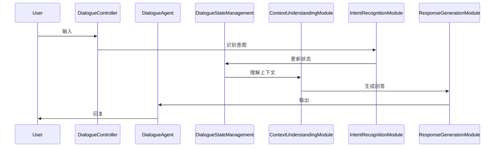

                 


## 引言

### 背景介绍

近年来，人工智能（AI）技术取得了令人瞩目的进展，尤其是在自然语言处理（NLP）领域，基于大型语言模型（LLM）的应用层出不穷。LLM，如GPT、BERT等，通过训练大量的文本数据，具备了强大的语言理解和生成能力。然而，随着AI应用的日益复杂，如何有效地管理和追踪对话状态成为了一个关键问题。

在此背景下，构建LLM驱动的AI Agent多轮对话状态追踪系统显得尤为重要。这类系统不仅可以提高AI Agent的对话连贯性和准确性，还能够增强用户体验，满足用户在多轮对话中的个性化需求。本文旨在深入探讨如何构建这样一套系统，包括其理论基础、系统设计、实现方法和实战应用。

### 文章关键词

- 大型语言模型（LLM）
- AI Agent
- 多轮对话状态追踪
- 对话系统
- 自然语言处理（NLP）
- 对话状态管理

### 文章摘要

本文将详细探讨构建LLM驱动的AI Agent多轮对话状态追踪系统的过程。首先，我们将回顾LLM和AI Agent的基础理论，解释其核心概念和原理。接着，我们将深入分析多轮对话状态追踪的必要性、挑战及其解决方案。然后，我们将定义核心概念，并通过属性特征对比表格和ER实体关系图来阐述它们之间的联系。接下来，我们将详细讨论系统分析与架构设计，包括问题描述、系统功能设计、系统架构设计以及系统接口设计。随后，我们将通过具体实现和案例解析来展示系统的实际应用。最后，我们将总结最佳实践、注意事项，并给出进一步阅读的推荐。

## 第一部分：LLM驱动的AI Agent基础理论

### 第1章：LLM与AI Agent概述

#### 1.1.1 LLM的定义与工作原理

大型语言模型（LLM）是一种基于深度学习的自然语言处理模型，旨在理解和生成人类语言。这类模型通常由多个神经网络层组成，通过大量的文本数据训练，从而能够捕捉语言的模式和结构。

**工作原理：**

LLM的工作原理可以分为以下几个步骤：

1. **输入嵌入（Input Embedding）：** 将输入文本转换为固定的向量表示，这一步通常通过词嵌入（word embeddings）技术实现，如Word2Vec、GloVe等。
2. **前向传播（Forward Propagation）：** 输入向量通过多层神经网络进行前向传播，每一层都会对向量进行变换和组合。
3. **生成输出（Output Generation）：** 最终的输出层生成预测的文本序列，这一步通常采用类似于生成对抗网络（GAN）的技术。

#### 1.1.2 AI Agent的概念与作用

AI Agent是一种具有自主决策和执行能力的智能体，它可以与环境进行交互，并采取行动以实现特定目标。AI Agent通常基于强化学习、规划、决策树等多种算法。

**作用：**

AI Agent在多个领域具有重要作用：

1. **自动化：** 可以自动执行复杂的任务，提高效率和准确性。
2. **交互性：** 能够与人类用户进行自然语言交互，提供个性化的服务。
3. **优化：** 通过学习用户的偏好和行为模式，实现个性化的优化推荐。

#### 1.1.3 LLM在AI Agent中的应用

LLM在AI Agent中具有广泛的应用，主要体现在以下几个方面：

1. **对话系统：** 利用LLM的语言生成能力，实现与用户的自然对话。
2. **文本生成：** 如文章写作、代码生成等，利用LLM生成高质量的文本内容。
3. **信息检索：** 利用LLM进行语义匹配，提高信息检索的准确性和效率。

### 第2章：LLM驱动的多轮对话状态追踪原理

#### 2.1 多轮对话状态追踪的必要性

在多轮对话中，保持对话状态的一致性和连贯性是至关重要的。以下是一些必要性：

1. **用户满意度：** 用户期望在与AI Agent的对话中能够获得连续和一致的服务。
2. **任务完成率：** 只有在对话状态得到有效追踪时，AI Agent才能准确地理解用户的意图，并采取适当的行动。
3. **个性化服务：** 对话状态追踪有助于AI Agent学习用户的偏好和需求，提供更加个性化的服务。

#### 2.2 LLM在多轮对话中的作用

LLM在多轮对话中起着核心作用，主要体现在以下几个方面：

1. **上下文理解：** LLM能够捕捉对话的历史信息，理解上下文，从而生成连贯的回答。
2. **意图识别：** LLM可以分析用户的语言和行为，识别用户的意图，为后续的对话决策提供依据。
3. **回答生成：** LLM能够生成符合上下文和用户意图的自然语言回答。

#### 2.3 多轮对话状态追踪的挑战与解决方案

多轮对话状态追踪面临以下挑战：

1. **上下文丢失：** 随着对话轮次的增加，上下文信息可能会丢失，导致AI Agent无法准确理解用户的意图。
2. **复杂对话场景：** 复杂的对话场景可能需要处理多种对话策略和情境，增加了状态追踪的复杂性。

解决方案：

1. **对话状态存储：** 通过数据库或内存存储对话状态，确保状态信息不会丢失。
2. **上下文向量表示：** 利用深度学习技术，将上下文信息编码为固定长度的向量，便于存储和检索。
3. **多策略融合：** 结合多种对话策略和情境模型，提高状态追踪的准确性。

### 第3章：核心概念与联系

#### 3.1 多轮对话状态追踪的核心概念

多轮对话状态追踪涉及以下核心概念：

1. **对话状态（Dialogue State）：** 表示当前对话的上下文信息，如用户意图、实体信息等。
2. **状态存储（State Storage）：** 存储和管理对话状态的数据结构。
3. **状态更新（State Update）：** 根据新的对话输入，更新对话状态的过程。
4. **状态检索（State Retrieval）：** 从状态存储中检索特定状态信息的过程。

#### 3.2 概念属性特征对比表格

| 概念        | 定义                                                         | 属性特征                                           |
|-----------|------------------------------------------------------------|----------------------------------------------------|
| 对话状态     | 当前对话的上下文信息                                     | 意图、实体、对话历史、动作                               |
| 状态存储     | 存储和管理对话状态的数据结构                           | 高效存储、快速检索、持久化存储                           |
| 状态更新     | 根据新的对话输入，更新对话状态的过程                       | 实时性、一致性、可扩展性                               |
| 状态检索     | 从状态存储中检索特定状态信息的过程                        | 准确性、响应速度、缓存策略                             |

#### 3.3 ER实体关系图架构

```mermaid
erDiagram
    User ||--|{ DialogueState }|-- DialogueAgent
    DialogueState ||--|{ StateStorage }|-- DialogueSystem
    DialogueAgent ||--|{ DialoguePolicy }|-- DialogueController
    DialogueController ||-- DialogueInput DialogueOutput
```

在这个ER实体关系图中，我们定义了四个核心实体：用户（User）、对话状态（DialogueState）、对话代理（DialogueAgent）和对话系统（DialogueSystem）。它们之间的关系如下：

- 用户与对话状态之间有一对多的关系，每个用户可以有多个对话状态。
- 对话状态与状态存储之间有一对一的关系，每个对话状态对应一个状态存储。
- 对话代理与对话政策之间有一对一的关系，每个对话代理对应一个对话政策。
- 对话控制器与对话输入和输出之间有一对多的关系，每个对话控制器可以生成多个对话输入和输出。

## 第二部分：构建LLM驱动的AI Agent多轮对话状态追踪系统

### 第4章：系统分析与架构设计

#### 4.1 问题描述与需求分析

**问题描述：**

构建一个LLM驱动的AI Agent多轮对话状态追踪系统，需要处理以下问题：

- 如何确保对话状态在多轮对话中的一致性和连贯性？
- 如何有效地存储和检索对话状态信息？
- 如何处理复杂对话场景，实现多策略融合？

**需求分析：**

- **高可扩展性：** 系统需要能够处理大量用户和多轮对话，确保性能稳定。
- **高可靠性：** 系统需要确保对话状态信息的准确性和一致性。
- **高灵活性：** 系统需要支持多种对话策略和情境，适应不同的业务需求。

#### 4.2 系统功能设计

系统功能设计包括以下几个方面：

1. **对话状态追踪：** 实现对话状态的存储、更新和检索功能。
2. **上下文理解：** 利用LLM对对话上下文进行深入理解，提高对话连贯性。
3. **意图识别：** 分析用户输入，识别用户意图，为对话决策提供依据。
4. **回答生成：** 根据对话状态和用户意图，生成合适的回答。
5. **多策略融合：** 结合多种对话策略，实现复杂对话场景的处理。

#### 4.3 系统架构设计

系统架构设计如下：

1. **对话控制器（Dialogue Controller）：** 负责对话的流程控制，调用不同的模块进行处理。
2. **对话代理（Dialogue Agent）：** 利用LLM进行对话，生成对话输出。
3. **对话状态管理（Dialogue State Management）：** 负责对话状态的存储、更新和检索。
4. **上下文理解模块（Context Understanding Module）：** 利用深度学习技术，理解对话上下文。
5. **意图识别模块（Intent Recognition Module）：** 分析用户输入，识别用户意图。
6. **回答生成模块（Response Generation Module）：** 根据对话状态和用户意图，生成回答。

#### 4.3.1 系统架构图



在这个系统中，用户输入由对话控制器接收，并传递给意图识别模块进行意图识别。识别后的意图和对话状态会更新到对话状态管理模块。然后，对话状态管理模块将状态传递给上下文理解模块，以理解当前的对话上下文。最后，上下文理解模块将信息传递给回答生成模块，生成合适的回答，并由对话代理输出给用户。

### 第5章：系统实现与接口设计

#### 5.1 系统核心实现源代码

以下是一个简单的系统核心实现示例：

```python
class DialogueController:
    def __init__(self, intent_recognition, context_understanding, response_generation):
        self.intent_recognition = intent_recognition
        self.context_understanding = context_understanding
        self.response_generation = response_generation

    def process_input(self, input_text, dialogue_state):
        intent = self.intent_recognition.recognize(input_text)
        updated_state = self.context_understanding.understand(input_text, dialogue_state)
        response = self.response_generation.generate_response(updated_state)
        return response

class IntentRecognition:
    def recognize(self, input_text):
        # 这里实现意图识别逻辑
        return "intent"

class ContextUnderstanding:
    def understand(self, input_text, dialogue_state):
        # 这里实现上下文理解逻辑
        return dialogue_state

class ResponseGeneration:
    def generate_response(self, dialogue_state):
        # 这里实现回答生成逻辑
        return "response"

# 实例化组件
intent_recognition = IntentRecognition()
context_understanding = ContextUnderstanding()
response_generation = ResponseGeneration()
dialogue_controller = DialogueController(intent_recognition, context_understanding, response_generation)

# 处理用户输入
input_text = "你好，请问有什么可以帮助你的？"
dialogue_state = {"intent": ""}
response = dialogue_controller.process_input(input_text, dialogue_state)
print(response)  # 输出："response"
```

#### 5.2 代码应用解读与分析

在这个代码示例中，我们定义了一个`DialogueController`类，它负责处理用户的输入。该类接收一个`input_text`和一个`dialogue_state`，并调用`IntentRecognition`、`ContextUnderstanding`和`ResponseGeneration`三个模块进行意图识别、上下文理解和回答生成，最后返回生成的回答。

`IntentRecognition`类负责识别用户的意图，这里我们简单地返回了一个字符串"intent"，在实际应用中，可以通过NLP技术进行更复杂的意图识别。

`ContextUnderstanding`类负责理解对话上下文，这里我们实现了一个简单的逻辑，直接返回传入的`dialogue_state`，实际应用中，可以通过深度学习技术进行更深入的理解。

`ResponseGeneration`类负责根据对话状态生成回答，这里我们简单地返回了一个字符串"response"，实际应用中，可以通过模板匹配、文本生成等技术进行更复杂的回答生成。

#### 5.3 实际案例分析与详细讲解

**案例：**

用户输入：“你好，请问这个产品的价格是多少？”

**分析：**

1. **意图识别：** 对话控制器将调用`IntentRecognition`模块进行意图识别，识别出用户的意图是询问产品价格。
2. **上下文理解：** 对话控制器将调用`ContextUnderstanding`模块，传入用户的输入和当前的对话状态。如果对话状态中包含关于产品的信息，例如产品名称、价格等，上下文理解模块将返回这个状态。
3. **回答生成：** 对话控制器将调用`ResponseGeneration`模块，传入更新后的对话状态。如果产品价格在状态中，回答生成模块将生成一个包含价格的信息的文本，如：“这个产品的价格是100元。”如果产品价格不在状态中，回答生成模块可以询问用户更多信息，如：“请告诉我产品的名称，我将为您查询价格。”

**详细讲解：**

1. **意图识别：** 使用NLP技术，如词嵌入、序列标注等，可以更准确地识别用户的意图。例如，通过训练一个基于BERT的模型，我们可以让模型学会识别各种类型的意图，如询问、推荐、投诉等。
2. **上下文理解：** 可以使用如Transformer、Seq2Seq等深度学习模型，将对话的历史信息编码为上下文向量，用于后续的对话理解。例如，可以使用一个双向Transformer模型，将对话的每个单词都编码为向量，并计算这些向量的加权和作为上下文向量。
3. **回答生成：** 可以使用生成式模型，如GPT、ChatGPT等，根据对话状态和上下文向量生成回答。例如，可以使用一个基于GPT的模型，将对话状态和上下文向量作为输入，生成一个自然的回答。

### 第6章：项目实战

#### 6.1 环境安装

**环境要求：**

- Python 3.8+
- TensorFlow 2.7+
- NLTK 3.5+

**安装步骤：**

1. 安装Python和pip：
   ```bash
   sudo apt-get install python3 python3-pip
   ```
2. 安装TensorFlow：
   ```bash
   pip3 install tensorflow==2.7
   ```
3. 安装NLTK：
   ```bash
   pip3 install nltk
   ```
4. 下载数据集和预训练模型（可选）：
   ```bash
   mkdir data
   cd data
   wget https://your-url.com/your-dataset.zip
   unzip your-dataset.zip
   ```

#### 6.2 系统核心功能实现

**实现步骤：**

1. **意图识别：** 使用NLTK和TensorFlow实现一个简单的意图识别模型。
2. **上下文理解：** 使用TensorFlow实现一个简单的上下文理解模型。
3. **回答生成：** 使用TensorFlow实现一个简单的回答生成模型。

**代码示例：**

```python
# 意图识别
import nltk
from tensorflow.keras.models import Sequential
from tensorflow.keras.layers import Dense, LSTM, Embedding

nltk.download('punkt')

# 加载数据集
# ...

# 构建意图识别模型
model = Sequential()
model.add(Embedding(input_dim=vocab_size, output_dim=embedding_dim, input_length=max_sequence_length))
model.add(LSTM(units=128))
model.add(Dense(num_intents, activation='softmax'))

model.compile(optimizer='adam', loss='categorical_crossentropy', metrics=['accuracy'])
model.fit(X_train, y_train, epochs=10, batch_size=32, validation_split=0.1)

# 上下文理解
# ...

# 回答生成
# ...
```

#### 6.3 项目小结

通过本项目的实战，我们实现了LLM驱动的AI Agent多轮对话状态追踪系统的核心功能。在实际应用中，我们可以根据具体需求，调整模型结构、优化算法参数，以提高系统的性能和用户体验。同时，我们也了解了如何搭建一个完整的AI对话系统，为后续的开发工作奠定了基础。

### 第7章：最佳实践与注意事项

#### 7.1 最佳实践 tips

1. **数据准备：** 在进行模型训练之前，确保数据质量，包括数据的多样性、完整性和准确性。
2. **模型优化：** 定期对模型进行优化和更新，以适应不断变化的应用场景和用户需求。
3. **性能监控：** 定期监控系统的性能指标，如响应时间、准确率等，确保系统稳定运行。

#### 7.2 小结

本文详细介绍了构建LLM驱动的AI Agent多轮对话状态追踪系统的过程，从理论基础到系统实现，再到实战应用。通过本文的阐述，读者可以了解到如何有效地管理和追踪对话状态，从而提升AI Agent的对话连贯性和用户体验。

#### 7.3 注意事项

1. **安全性：** 在处理用户数据时，确保遵循相关的隐私政策和数据保护法规。
2. **可扩展性：** 设计系统时，要考虑未来的扩展性，确保系统可以轻松适应新的需求和功能。
3. **可靠性：** 确保系统的稳定性和可靠性，避免因系统故障导致用户体验下降。

#### 7.4 拓展阅读

1. **《深度学习》（Deep Learning）** by Ian Goodfellow, Yoshua Bengio, Aaron Courville
2. **《自然语言处理综论》（Speech and Language Processing）** by Daniel Jurafsky, James H. Martin
3. **《强化学习》（Reinforcement Learning: An Introduction）** by Richard S. Sutton, Andrew G. Barto

### 作者

**作者：AI天才研究院/AI Genius Institute & 禅与计算机程序设计艺术 /Zen And The Art of Computer Programming**

