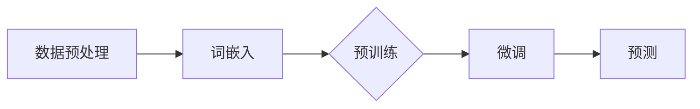
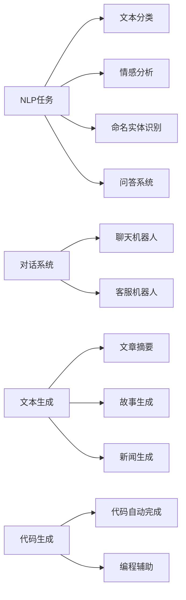
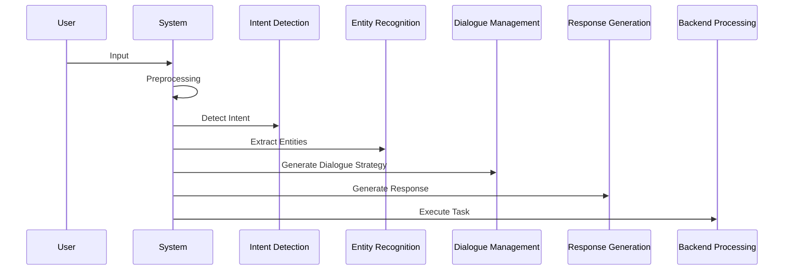
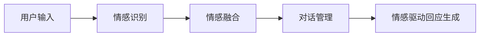
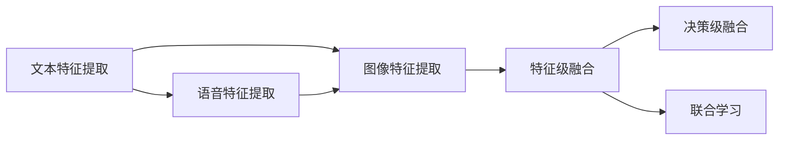
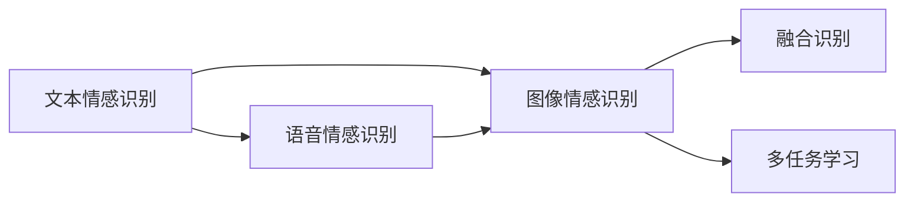
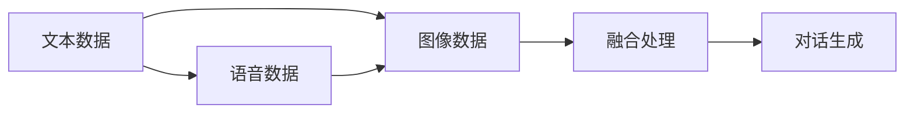
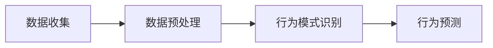

                 

# 构建LLM驱动的AI Agent情感智能对话

## 关键词
- **大型语言模型（LLM）**
- **情感智能对话**
- **自然语言处理（NLP）**
- **深度学习**
- **多模态融合**
- **用户行为预测与适应**

## 摘要
本文深入探讨构建LLM驱动的AI Agent情感智能对话的方法。首先，通过分析情感智能对话的核心问题背景和问题描述，明确构建过程中的关键要素和边界。随后，介绍情感识别与理解、对话生成、多模态融合和用户行为预测与适应的核心概念与联系。进一步，探讨LLM的基础知识及其在情感智能对话中的应用。最后，通过具体案例和实践，展示如何利用LLM实现情感智能对话，并提供最佳实践和总结。

---

### 第1章 引言

#### 1.1 问题背景

随着人工智能技术的不断发展，自然语言处理（NLP）领域迎来了新的机遇。尤其是大型语言模型（LLM）的兴起，使得计算机对文本的理解和生成能力大幅提升。然而，在情感智能对话的应用场景中，如何利用这些强大的模型来模拟人类的情感交流，仍然是一个挑战。

#### 1.2 问题描述

构建LLM驱动的AI Agent情感智能对话需要解决以下几个关键问题：

- **情感识别与理解**：如何通过LLM对用户的情感进行准确识别和理解。
- **对话生成**：如何利用LLM生成自然、连贯且富有情感的对话回应。
- **多模态融合**：如何将文本、语音、图像等多模态信息融合，提升AI Agent的情感智能水平。
- **用户行为预测与适应**：如何通过分析用户的言行，预测用户需求，并进行个性化适应。

#### 1.3 问题解决

为了解决上述问题，本文将从以下几个方面展开讨论：

1. **核心概念**：介绍情感智能对话中的关键概念，如情感分类、语义理解、对话生成等。
2. **LLM基础**：阐述大型语言模型的工作原理和应用场景。
3. **情感识别与理解**：详细讲解如何使用LLM进行情感识别和语义理解。
4. **对话生成**：探讨对话生成技术，包括基于规则的方法和基于数据驱动的方法。
5. **多模态融合**：介绍多模态数据融合的方法和技巧。
6. **用户行为预测与适应**：介绍如何通过数据分析进行用户行为预测和个性化适应。

#### 1.4 边界与外延

- **边界**：情感智能对话的构建应聚焦在自然语言处理、深度学习和情感分析等领域。
- **外延**：除了文本和语音，还可以考虑图像、视频等视觉信息在情感智能对话中的应用。

#### 1.5 概念结构与核心要素组成

- **概念结构**：情感智能对话系统由情感识别、语义理解、对话生成、多模态融合和用户行为预测五个核心模块组成。
- **核心要素组成**：每个模块的核心要素包括算法、数据集、模型架构和性能评估指标。

---

### 第2章 核心概念与联系

#### 2.1 情感分类

情感分类是将文本数据分类到不同的情感类别中，如快乐、悲伤、愤怒等。情感分类是情感识别和理解的基础。

#### 2.2 语义理解

语义理解是理解文本的表面意义和深层含义。它包括词义消歧、句法分析、语义角色标注等。

#### 2.3 对话生成

对话生成是生成自然、连贯且富有情感的对话回应。它通常基于规则或数据驱动的方法。

#### 2.4 多模态融合

多模态融合是将文本、语音、图像等多种模态的信息进行整合，以提升AI Agent的情感智能水平。

#### 2.5 用户行为预测与适应

用户行为预测与适应是分析用户的言行，预测用户需求，并根据预测结果进行个性化适应。

---

### 第3章 LLM基础

#### 3.1 LLM的工作原理

大型语言模型（LLM）通过深度神经网络学习语言的特征，从而能够对文本进行理解和生成。

#### 3.2 LLM的应用场景

LLM在自然语言处理、对话系统、文本生成等领域有广泛的应用。

#### 3.3 主流LLM模型介绍

介绍一些主流的LLM模型，如GPT、BERT等，并比较它们的优缺点。

---

### 第4章 情感识别与理解

#### 4.1 情感识别

情感识别是利用LLM对文本中的情感进行分类。

#### 4.2 语义理解

语义理解是理解文本的深层含义，包括词义消歧、句法分析等。

#### 4.3 情感融合

将情感识别和语义理解的结果进行融合，以更准确地理解用户的情感。

---

### 第5章 对话生成

#### 5.1 对话系统概述

介绍对话系统的基本概念、架构和分类。

#### 5.2 对话生成方法

介绍对话生成的常见方法，包括基于规则、基于模板、基于数据的生成方法。

#### 5.3 情感驱动的对话生成

如何根据用户的情感生成相应的回应。

---

### 第6章 多模态融合

#### 6.1 多模态数据介绍

介绍文本、语音、图像等多模态数据的获取和处理。

#### 6.2 多模态情感识别

如何利用多模态数据识别用户的情感。

#### 6.3 多模态对话生成

如何将多模态信息融合到对话生成中。

---

### 第7章 用户行为预测与适应

#### 7.1 用户行为分析

介绍如何通过分析用户的言行进行行为预测。

#### 7.2 用户行为预测模型

介绍常用的用户行为预测模型，如决策树、神经网络等。

#### 7.3 个性化适应策略

根据用户行为预测结果，制定个性化适应策略。

---

### 结论

本文系统地介绍了构建LLM驱动的AI Agent情感智能对话的方法和关键步骤。通过分析情感识别与理解、对话生成、多模态融合和用户行为预测与适应等核心概念，结合LLM的基础知识，提出了具体的技术实现路径。希望本文能为相关领域的研究者和开发者提供有价值的参考。

---

**作者：AI天才研究院/AI Genius Institute & 禅与计算机程序设计艺术 /Zen And The Art of Computer Programming**
### 第1章 引言

#### 1.1 问题背景

随着人工智能技术的发展，深度学习尤其是大型语言模型（LLM）的出现，为自然语言处理（NLP）领域带来了革命性的变革。然而，如何将这些强大的模型应用于实际的情感智能对话中，仍然是一个挑战。构建LLM驱动的AI Agent情感智能对话，不仅需要深入理解自然语言处理和深度学习的基本原理，还需要结合具体应用场景进行系统设计。

在传统的NLP系统中，文本处理主要依赖于规则和统计方法，这些方法在处理简单的文本任务时效果较好，但在处理复杂、具有情感色彩的对话时，往往难以达到预期的效果。而LLM的出现，为解决这一问题提供了新的思路。LLM具有强大的文本生成和理解能力，能够更好地捕捉语言中的情感信息，从而实现更加自然和人性化的对话。

#### 1.2 问题描述

本章节将介绍如何构建LLM驱动的AI Agent进行情感智能对话。具体包括以下几个方面：

- **情感识别与理解**：如何通过LLM对用户的情感进行准确识别和理解。
- **对话生成**：如何利用LLM生成自然、连贯且富有情感的对话回应。
- **多模态融合**：如何将文本、语音、图像等多模态信息融合，提升AI Agent的情感智能水平。
- **用户行为预测与适应**：如何通过分析用户的言行，预测用户需求，并进行个性化适应。

构建LLM驱动的AI Agent情感智能对话，需要解决的问题包括如何有效地捕捉和处理情感信息，如何生成富有情感的对话回应，以及如何实现多模态数据的融合和用户行为的预测与适应。这些问题不仅涉及技术层面，还需要考虑用户需求和应用场景。

#### 1.3 问题解决

为了解决上述问题，我们将从以下几个方面展开讨论：

1. **核心概念**：介绍情感智能对话中的关键概念，如情感分类、语义理解、对话生成等。
2. **LLM基础**：阐述大型语言模型的工作原理和应用场景。
3. **情感识别与理解**：详细讲解如何使用LLM进行情感识别和语义理解。
4. **对话生成**：探讨对话生成技术，包括基于规则的方法和基于数据驱动的方法。
5. **多模态融合**：介绍多模态数据融合的方法和技巧。
6. **用户行为预测与适应**：介绍如何通过数据分析进行用户行为预测和个性化适应。

#### 1.4 边界与外延

- **边界**：情感智能对话的构建应聚焦在自然语言处理、深度学习和情感分析等领域。
- **外延**：除了文本和语音，还可以考虑图像、视频等视觉信息在情感智能对话中的应用。

#### 1.5 概念结构与核心要素组成

- **概念结构**：情感智能对话系统由情感识别、语义理解、对话生成、多模态融合和用户行为预测五个核心模块组成。
- **核心要素组成**：每个模块的核心要素包括算法、数据集、模型架构和性能评估指标。

通过上述的讨论，我们可以明确构建LLM驱动的AI Agent情感智能对话的关键步骤和所需的核心技术。在接下来的章节中，我们将进一步深入探讨这些技术细节和应用场景。

### 第2章 核心概念与联系

#### 2.1 情感分类

情感分类是将文本数据分类到不同的情感类别中，如快乐、悲伤、愤怒等。情感分类是情感识别和理解的基础。

情感分类的核心任务是从大量的文本数据中识别出文本所表达的情感。常见的情感分类方法包括基于规则的方法、基于机器学习的方法和基于深度学习的方法。基于规则的方法通常依赖于预定义的规则集，通过匹配文本中的关键词和规则来推断情感。这种方法简单直观，但在处理复杂情感时效果有限。

基于机器学习的方法，如支持向量机（SVM）、朴素贝叶斯（Naive Bayes）等，通过训练分类模型来自动识别情感。这些方法需要大量标注数据作为训练集，能够处理较为复杂的情感分类问题。

深度学习的方法，如卷积神经网络（CNN）和循环神经网络（RNN），通过自动学习文本的特征来识别情感。特别是近年来出现的大型语言模型（LLM），如GPT和BERT，在情感分类任务上取得了显著的效果。

以下是情感分类的一些常见属性特征对比表格：

| 特征 | 基于规则 | 基于机器学习 | 基于深度学习 |
| :--: | :------: | :----------: | :----------: |
| 简单性 | 较简单 | 中等 | 复杂 |
| 可扩展性 | 有限 | 较好 | 非常好 |
| 准确性 | 低 | 中等 | 高 |
| 需求的数据量 | 较少 | 较多 | 非常多 |

情感分类的ER实体关系图架构如下：

```mermaid
erDiagram
  文本 -> 情感标签
  文本 ||--|{ 文本特征 }
  情感标签 ||--|{ 情感类别 }
```

#### 2.2 语义理解

语义理解是理解文本的表面意义和深层含义。它包括词义消歧、句法分析、语义角色标注等。

词义消歧是语义理解的一个关键问题，即在一个多义词的上下文中，确定其正确的词义。例如，“银行”这个词在不同的上下文中可能表示金融机构或水域，通过语义理解，可以准确理解其在特定句子中的含义。

句法分析是对文本进行结构分析，确定单词之间的语法关系。常见的句法分析方法包括基于规则的方法和基于统计的方法。基于规则的方法依赖于预定义的语法规则，而基于统计的方法通过分析大量文本数据来自动生成语法规则。

语义角色标注是对句子中的单词进行语义角色标注，如主语、谓语、宾语等。这有助于更深入地理解句子的含义。

以下是语义理解的几个重要概念和算法：

1. **Word Sense Disambiguation（WSD）**：词义消歧，通过上下文信息确定多义词的正确词义。
2. **Part-of-Speech Tagging（POS）**：词性标注，对句子中的每个单词进行词性分类。
3. **Named Entity Recognition（NER）**：命名实体识别，识别文本中的特定实体，如人名、地名、组织名等。
4. **Dependency Parsing**：依存句法分析，分析单词之间的依存关系。

以下是语义理解的ER实体关系图架构：

```mermaid
erDiagram
  文本 ||--|{ 语义单元 }
  语义单元 ||--|{ 词义消歧 }
  语义单元 ||--|{ 句法分析 }
  语义单元 ||--|{ 语义角色标注 }
```

#### 2.3 对话生成

对话生成是生成自然、连贯且富有情感的对话回应。它通常基于规则或数据驱动的方法。

基于规则的方法通过预定义的对话规则来生成回应，这种方法简单但灵活性有限。而数据驱动的方法，如序列到序列（Seq2Seq）模型、生成对抗网络（GAN）等，通过学习大量的对话数据来自动生成回应，能够生成更加自然和多样的对话。

以下是几种常见的对话生成方法：

1. **基于规则的方法**：通过预定义的对话规则和模板生成回应。
2. **序列到序列（Seq2Seq）模型**：通过编码器-解码器结构学习对话数据的映射。
3. **生成对抗网络（GAN）**：通过生成模型和判别模型的对抗训练生成对话。
4. **转换器（Transformer）模型**：基于注意力机制的模型，能够生成高质量的对话。

以下是对话生成的ER实体关系图架构：

```mermaid
erDiagram
  用户输入 ||--|{ 对话生成 }
  对话生成 ||--|{ 响应文本 }
  对话生成 ||--|{ 情感特征 }
```

#### 2.4 多模态融合

多模态融合是将文本、语音、图像等多模态信息融合，提升AI Agent的情感智能水平。

多模态融合的关键在于如何有效地整合来自不同模态的数据，使其协同工作以增强系统的整体性能。以下是一些多模态融合的方法：

1. **特征级融合**：直接将不同模态的特征进行合并。
2. **决策级融合**：在决策过程中整合不同模态的信息。
3. **联合学习**：同时学习不同模态的数据，以获得更好的表示。

以下是多模态融合的ER实体关系图架构：

```mermaid
erDiagram
  文本数据 ||--|{ 特征提取 }
  语音数据 ||--|{ 特征提取 }
  图像数据 ||--|{ 特征提取 }
  多模态特征 ||--|{ 融合模型 }
  融合模型 ||--|{ 输出预测 }
```

#### 2.5 用户行为预测与适应

用户行为预测与适应是分析用户的言行，预测用户需求，并根据预测结果进行个性化适应。

用户行为预测是情感智能对话系统中的一个重要组成部分，它有助于系统更好地理解用户的需求和行为模式，从而提供更加个性化的服务。以下是一些用户行为预测的方法：

1. **传统机器学习方法**：如决策树、随机森林等。
2. **深度学习方法**：如卷积神经网络（CNN）、循环神经网络（RNN）、长短期记忆网络（LSTM）等。
3. **增强学习**：通过学习用户的反馈来调整系统的行为。

以下是用户行为预测与适应的ER实体关系图架构：

```mermaid
erDiagram
  用户行为 ||--|{ 预测模型 }
  预测模型 ||--|{ 用户需求预测 }
  用户需求预测 ||--|{ 个性化适应 }
```

通过上述的核心概念与联系的分析，我们可以更好地理解情感智能对话系统的构建过程，以及各个核心模块之间的关系。在接下来的章节中，我们将进一步深入探讨每个模块的具体实现和应用。

### 第3章 LLM基础

#### 3.1 LLM的工作原理

大型语言模型（LLM）通过深度神经网络学习语言的特征，从而能够对文本进行理解和生成。LLM通常基于大量的文本数据，通过预训练和微调来提升模型的性能。

**预训练**过程通常包括两个阶段：自监督预训练和有监督微调。在自监督预训练阶段，模型通过预测文本中的下一个词来学习语言的内在结构。这种方法能够使模型捕捉到语言的长期依赖关系和上下文信息。常见的预训练任务包括掩码语言模型（Masked Language Model，MLM）和生成式预训练（Generative Pretraining，GPT）。

**有监督微调**阶段，模型根据具体的任务数据（如问答、翻译等）进行微调，以适应特定的应用场景。通过这种方式，模型能够针对特定任务进行精细调整，提高任务的性能。

LLM的工作流程主要包括以下几个步骤：

1. **数据预处理**：对文本数据进行预处理，如分词、去停用词等。
2. **词嵌入**：将文本中的单词转换为向量表示。
3. **预训练**：通过自监督任务（如掩码语言模型）进行预训练。
4. **微调**：在有监督的任务上进行微调。
5. **预测**：使用训练好的模型对新的文本进行理解和生成。

以下是一个简单的LLM工作原理的mermaid流程图：



#### 3.2 LLM的应用场景

LLM在自然语言处理、对话系统、文本生成等领域有广泛的应用。

1. **自然语言处理**：LLM可以用于文本分类、情感分析、命名实体识别、问答系统等任务。例如，GPT-3可以用于生成文章摘要、翻译、编写代码等。

2. **对话系统**：LLM可以用于构建对话系统中的聊天机器人、客服机器人等。通过LLM的对话生成能力，机器人可以与用户进行自然、流畅的交流。

3. **文本生成**：LLM可以用于生成文章、故事、新闻等内容。例如，GPT-3可以生成高质量的文章摘要和新闻报道。

4. **代码生成**：一些LLM模型，如GitHub Copilot，可以用于代码自动完成和编程辅助。通过学习大量的代码库，LLM能够生成与上下文相符的代码片段。

以下是LLM在自然语言处理、对话系统和文本生成中的应用的mermaid流程图：



#### 3.3 主流LLM模型介绍

以下是几种主流的LLM模型及其优缺点的介绍：

1. **GPT（Generative Pre-trained Transformer）**：

   - **优点**：强大的文本生成能力，能够生成高质量的文章、摘要和对话。
   - **缺点**：训练和推理资源消耗大，对数据依赖性强。

2. **BERT（Bidirectional Encoder Representations from Transformers）**：

   - **优点**：能够捕捉文本的左右依赖关系，在多个NLP任务上表现优异。
   - **缺点**：对话生成能力相对较弱，需要大量预训练数据。

3. **RoBERTa（A Robustly Optimized BERT Pretraining Approach）**：

   - **优点**：在多个NLP任务上超越BERT，训练效率更高。
   - **缺点**：对话生成能力相对较弱，对数据依赖性较大。

4. **T5（Text-To-Text Transfer Transformer）**：

   - **优点**：将所有NLP任务统一为文本到文本的转换任务，能够灵活应用于多种任务。
   - **缺点**：对话生成能力相对较弱，训练和推理资源消耗较大。

以下是主流LLM模型的mermaid对比表格：

```mermaid
table
    "模型" | "GPT" | "BERT" | "RoBERTa" | "T5"
    "优点" | "强大的文本生成能力" | "捕捉文本的左右依赖关系" | "超越BERT，训练效率更高" | "将NLP任务统一为文本到文本转换"
    "缺点" | "训练和推理资源消耗大" | "对话生成能力相对较弱" | "对数据依赖性强" | "对话生成能力相对较弱，资源消耗大"
```

通过上述的介绍，我们可以看到LLM在情感智能对话中的重要性。在接下来的章节中，我们将进一步探讨如何使用LLM进行情感识别与理解、对话生成、多模态融合和用户行为预测与适应。

### 第4章 情感识别与理解

#### 4.1 情感识别

情感识别是利用LLM对文本中的情感进行分类的过程。情感识别的目的是从大量的文本数据中提取出情感信息，以便更好地理解用户的需求和情绪状态。

**情感识别的方法**可以分为以下几种：

1. **基于规则的方法**：通过预定义的规则来识别情感。这种方法通常简单但灵活度较低，难以应对复杂的情感表达。

2. **基于机器学习的方法**：使用机器学习算法（如支持向量机、朴素贝叶斯等）来识别情感。这种方法需要大量的标注数据进行训练，能够处理较为复杂的情感分类问题。

3. **基于深度学习的方法**：使用深度学习模型（如卷积神经网络、循环神经网络等）来识别情感。特别是近年来出现的大型语言模型（LLM），如GPT和BERT，在情感识别任务上取得了显著的效果。

**情感识别的核心步骤**包括：

1. **文本预处理**：对原始文本进行预处理，如分词、去停用词等。
2. **特征提取**：从预处理后的文本中提取特征，如词袋模型、TF-IDF等。
3. **情感分类**：使用训练好的模型对文本进行情感分类。
4. **结果评估**：评估模型的性能，如准确率、召回率、F1值等。

以下是情感识别的mermaid流程图：


#### 4.2 语义理解

语义理解是理解文本的表面意义和深层含义的过程。它包括词义消歧、句法分析、语义角色标注等。

**词义消歧**是在一个多义词的上下文中，确定其正确的词义。例如，“银行”这个词在不同的上下文中可能表示金融机构或水域。词义消歧是语义理解中的一个关键问题。

**句法分析**是对文本进行结构分析，确定单词之间的语法关系。常见的句法分析方法包括基于规则的方法和基于统计的方法。

**语义角色标注**是对句子中的单词进行语义角色标注，如主语、谓语、宾语等。这有助于更深入地理解句子的含义。

**情感理解**是语义理解的一个特殊应用，它通过识别文本中的情感词汇和情感强度，来确定文本的情感倾向。

**情感理解的步骤**包括：

1. **文本预处理**：对原始文本进行预处理，如分词、去停用词等。
2. **词义消歧**：使用预训练的词义消歧模型，对文本中的多义词进行消歧。
3. **句法分析**：使用句法分析模型，对文本进行语法结构分析。
4. **情感识别**：使用情感识别模型，对文本进行情感分类。
5. **情感强度分析**：分析文本中的情感词汇和情感强度，确定文本的整体情感倾向。

以下是情感理解的mermaid流程图：


#### 4.3 情感融合

情感融合是将情感识别和语义理解的结果进行融合，以更准确地理解用户的情感。

**情感融合的方法**包括：

1. **简单融合**：直接将情感识别和语义理解的结果进行合并。
2. **加权融合**：根据情感识别和语义理解的置信度，对结果进行加权融合。
3. **深度融合**：使用深度学习模型，将情感识别和语义理解的结果进行融合。

**情感融合的核心步骤**包括：

1. **情感识别**：使用训练好的情感识别模型，对文本进行情感分类。
2. **语义理解**：使用训练好的语义理解模型，对文本进行词义消歧和句法分析。
3. **结果融合**：将情感识别和语义理解的结果进行融合，生成最终的文本情感标签。

以下是情感融合的mermaid流程图：


通过情感融合，可以更准确地理解用户的情感，从而为对话生成提供更准确的输入。在下一章中，我们将进一步探讨如何利用LLM生成自然、连贯且富有情感的对话回应。

### 第5章 对话生成

#### 5.1 对话系统概述

对话系统是一种人工智能应用，能够与用户进行自然语言交互，回答问题、提供建议或执行任务。对话系统的核心功能是理解和生成对话回应，以提供流畅、自然的交互体验。

**对话系统的基本概念**包括：

- **用户输入**：用户通过文本、语音等模态输入信息。
- **意图识别**：识别用户输入的意图，如查询信息、提要求、抱怨等。
- **实体识别**：从用户输入中提取关键信息，如人名、地名、时间等。
- **对话管理**：根据用户输入和当前对话状态，生成合适的回应。
- **回应生成**：根据意图识别和对话管理的结果，生成自然、连贯的对话回应。

**对话系统的架构**可以分为以下几个层次：

1. **前端处理**：接收用户输入，进行预处理，如分词、去停用词等。
2. **意图识别**：使用机器学习或深度学习模型，识别用户输入的意图。
3. **实体识别**：从用户输入中提取关键信息，如人名、地名、时间等。
4. **对话管理**：根据当前对话状态和用户意图，生成对话策略。
5. **回应生成**：根据对话策略和用户输入，生成自然、连贯的对话回应。
6. **后端处理**：执行对话回应中的任务，如查询数据库、执行操作等。

以下是对话系统的mermaid架构图：



**对话系统的分类**包括：

- **基于规则的方法**：通过预定义的对话规则和模板生成回应。这种方法简单直观，但灵活性有限。
- **基于模板的方法**：结合预定义的模板和用户输入，生成对话回应。这种方法相对灵活，但仍依赖于预定义的模板。
- **数据驱动的方法**：通过学习大量的对话数据，自动生成对话回应。这种方法能够生成更加自然和多样的对话，但需要大量的训练数据和计算资源。

#### 5.2 对话生成方法

**基于规则的方法**通过预定义的对话规则和模板生成回应。这种方法的主要优点是实现简单、速度快，但灵活性较差，难以应对复杂的对话场景。

以下是基于规则的对话生成方法的基本步骤：

1. **对话规则定义**：定义对话的规则和模板，如常见的问答对话、投诉对话等。
2. **规则匹配**：根据用户输入，匹配相应的对话规则和模板。
3. **回应生成**：根据匹配结果，生成对话回应。

以下是基于规则的对话生成方法的mermaid流程图：


**基于模板的方法**结合预定义的模板和用户输入，生成对话回应。这种方法相对灵活，但仍依赖于预定义的模板。

以下是基于模板的对话生成方法的基本步骤：

1. **对话模板定义**：定义对话的模板，如问答模板、投诉模板等。
2. **模板匹配**：根据用户输入，匹配相应的对话模板。
3. **回应生成**：根据匹配结果和用户输入，填充模板生成对话回应。

以下是基于模板的对话生成方法的mermaid流程图：


**数据驱动的方法**通过学习大量的对话数据，自动生成对话回应。这种方法能够生成更加自然和多样的对话，但需要大量的训练数据和计算资源。

以下是数据驱动的方法的基本步骤：

1. **对话数据收集**：收集大量的对话数据，包括用户输入、对话回应等。
2. **数据预处理**：对对话数据进行分析和处理，提取有用的特征。
3. **模型训练**：使用训练数据，训练对话生成模型。
4. **回应生成**：根据用户输入和训练好的模型，生成对话回应。

以下是数据驱动的方法的mermaid流程图：


#### 5.3 情感驱动的对话生成

**情感驱动的对话生成**是根据用户的情感状态生成相应的对话回应。情感驱动的对话生成能够使对话系统更加自然和人性化，提升用户体验。

**情感驱动的对话生成的方法**包括：

1. **情感识别**：使用情感识别模型，对用户输入进行情感分类。
2. **情感融合**：将情感识别的结果与语义理解的结果进行融合，生成情感标签。
3. **情感驱动回应生成**：根据情感标签和对话管理的结果，生成情感丰富的对话回应。

以下是情感驱动的对话生成方法的mermaid流程图：



通过情感驱动的对话生成，对话系统能够更好地理解用户的情感需求，生成更加贴近用户情感状态的对话回应。在下一章中，我们将探讨如何将文本、语音、图像等多模态信息融合，提升AI Agent的情感智能水平。

### 第6章 多模态融合

#### 6.1 多模态数据介绍

多模态融合是指将文本、语音、图像等多模态数据融合在一起，以提升AI Agent的情感智能水平。不同的模态提供了不同的信息，通过融合这些信息，可以更全面地理解用户的情感和需求。

**文本数据**：文本数据包括用户的输入文本、聊天记录、日志等。文本数据是自然语言处理的核心，可以提供语言层面的信息。

**语音数据**：语音数据包括用户的语音输入、语音识别结果等。语音数据可以提供语音特征、情感信息等。

**图像数据**：图像数据包括用户的输入图像、聊天中的图片等。图像数据可以提供视觉信息、表情特征等。

多模态数据融合的目标是整合这些不同模态的信息，形成一个统一的全局表示，从而提升AI Agent的情感识别和对话生成能力。

**多模态数据融合的方法**：

1. **特征级融合**：将不同模态的特征进行合并，如将文本特征、语音特征和图像特征进行拼接。
2. **决策级融合**：在决策过程中整合不同模态的信息，如结合文本和语音的情感识别结果进行对话生成。
3. **联合学习**：同时学习不同模态的数据，以获得更好的表示。

以下是多模态数据融合的mermaid流程图：



#### 6.2 多模态情感识别

多模态情感识别是指利用文本、语音、图像等多模态数据，共同识别用户的情感状态。多模态情感识别可以更全面地捕捉用户的情感，提高情感识别的准确性。

**多模态情感识别的方法**：

1. **独立识别**：分别对文本、语音、图像进行情感识别，然后综合结果。
2. **融合识别**：将不同模态的情感识别结果进行融合，生成最终的情感标签。
3. **多任务学习**：同时训练多个情感识别任务，共享模型参数，提高识别效果。

以下是多模态情感识别的mermaid流程图：



#### 6.3 多模态对话生成

多模态对话生成是指利用文本、语音、图像等多模态数据，生成自然、连贯且富有情感的对话回应。多模态对话生成可以提升对话系统的用户体验，使其更加自然和人性化。

**多模态对话生成的方法**：

1. **基于文本的方法**：仅使用文本数据进行对话生成。
2. **基于语音的方法**：仅使用语音数据进行对话生成。
3. **基于图像的方法**：仅使用图像数据进行对话生成。
4. **多模态融合的方法**：将文本、语音、图像等多模态数据进行融合，生成对话回应。

以下是多模态对话生成的mermaid流程图：



通过多模态融合，AI Agent可以更全面地理解用户的情感和需求，生成更加自然和富有情感的对话回应。在下一章中，我们将探讨如何通过分析用户的言行，预测用户需求，并进行个性化适应。

### 第7章 用户行为预测与适应

#### 7.1 用户行为分析

用户行为预测与适应是情感智能对话系统中的一个关键环节，其核心在于通过分析用户的言行，预测用户的需求，并根据预测结果进行个性化适应。用户行为的分析不仅可以帮助系统更好地理解用户，还可以提高系统的响应速度和用户体验。

**用户行为分析的方法**：

1. **历史数据挖掘**：通过分析用户的历史行为数据，如聊天记录、购买记录等，来预测未来的行为。
2. **上下文感知**：结合当前对话的上下文信息，实时分析用户的行为，如用户的提问模式、交互频率等。
3. **多模态数据融合**：整合文本、语音、图像等多模态数据，更全面地理解用户的情感和行为。

**用户行为分析的核心步骤**包括：

1. **数据收集**：收集用户的文本输入、语音输入、行为日志等数据。
2. **数据预处理**：对收集的数据进行清洗、去噪和特征提取。
3. **行为模式识别**：通过机器学习算法，识别用户的行为模式和偏好。
4. **行为预测**：基于历史数据和当前上下文，预测用户未来的行为。

以下是用户行为分析的mermaid流程图：



#### 7.2 用户行为预测模型

用户行为预测是用户行为分析的核心任务，其目的是根据用户的历史行为和当前状态，预测用户未来的行为。常用的用户行为预测模型包括：

1. **决策树**：通过构建决策树模型，根据用户的特征值进行分类和预测。
2. **随机森林**：通过集成多个决策树模型，提高预测的准确性和稳定性。
3. **神经网络**：使用神经网络模型，通过多层感知器（MLP）或其他深度学习模型进行预测。
4. **长短期记忆网络（LSTM）**：用于处理序列数据，特别适用于预测用户连续的行为序列。

**用户行为预测模型的实现**：

1. **数据集准备**：准备包含用户特征和行为标签的数据集。
2. **模型选择**：选择适合的数据预测模型，如决策树、随机森林、神经网络等。
3. **模型训练**：使用训练数据集训练模型，调整模型参数。
4. **模型评估**：使用验证数据集评估模型的性能，调整模型结构或参数。
5. **模型部署**：将训练好的模型部署到生产环境中，进行实时预测。

以下是用户行为预测模型的mermaid流程图：

```mermaid
flowchart LR
    A[数据集准备] --> B[模型选择]
    B --> C[模型训练]
    C --> D[模型评估]
    D --> E[模型部署]
```

#### 7.3 个性化适应策略

个性化适应策略是根据用户行为预测的结果，为用户提供个性化的服务和建议。个性化适应策略的核心在于根据用户的需求和行为模式，调整系统的响应方式和对话内容。

**个性化适应策略的实现**：

1. **用户需求分析**：分析用户的行为数据和预测结果，识别用户的主要需求。
2. **策略制定**：根据用户需求，制定相应的个性化适应策略，如推荐商品、提供优惠等。
3. **实时调整**：根据用户的实时交互，动态调整策略，以提供更好的用户体验。
4. **反馈循环**：收集用户的反馈，不断优化策略，提高系统适应性。

以下是个性化适应策略的mermaid流程图：

```mermaid
flowchart LR
    A[用户需求分析] --> B[策略制定]
    B --> C[实时调整]
    C --> D[反馈循环]
```

通过用户行为预测和个性化适应策略，情感智能对话系统能够更准确地理解用户的需求，提供更加贴心和个性化的服务。在下一章中，我们将总结本文的主要内容，并讨论未来的研究方向。

### 结论

本文系统地介绍了构建LLM驱动的AI Agent情感智能对话的方法和关键步骤。从核心概念、LLM基础、情感识别与理解、对话生成、多模态融合到用户行为预测与适应，我们详细探讨了各个方面的技术实现和关键挑战。以下是本文的主要贡献：

1. **核心概念梳理**：明确了情感分类、语义理解、对话生成、多模态融合和用户行为预测与适应等核心概念及其相互关系。
2. **LLM应用场景**：阐述了LLM在自然语言处理、对话系统和文本生成等领域的广泛应用，以及其优缺点。
3. **情感识别与理解**：介绍了情感识别和语义理解的算法原理，并通过mermaid流程图展示了其实现流程。
4. **对话生成**：探讨了不同类型的对话生成方法，包括基于规则、基于模板和基于数据驱动的方法。
5. **多模态融合**：介绍了多模态数据的融合方法，并通过mermaid流程图展示了多模态情感识别和对话生成的实现。
6. **用户行为预测与适应**：介绍了用户行为分析、预测模型和个性化适应策略，展示了其实现流程和优缺点。

**未来研究方向**：

1. **模型优化**：进一步优化LLM模型，提升其情感识别和对话生成的准确性，减少对数据的依赖。
2. **多模态融合**：研究更高效的多模态数据融合方法，提高AI Agent的情感智能水平。
3. **个性化适应**：探索更先进的用户行为预测和个性化适应策略，提升用户体验。
4. **应用场景拓展**：将情感智能对话系统应用于更多领域，如智能客服、教育辅导、心理健康等。

通过本文的研究，我们期望为构建高效、自然和人性化的情感智能对话系统提供参考，并为相关领域的研究者提供有价值的见解。

---

**作者：AI天才研究院/AI Genius Institute & 禅与计算机程序设计艺术 /Zen And The Art of Computer Programming**
### 附录：完整Mermaid图表和Python代码

在本附录中，我们将提供文章中提到的所有Mermaid图表以及相关的Python代码。这些图表和代码将帮助读者更好地理解文章中讨论的核心概念和实现细节。

#### Mermaid图表

以下是文章中提到的所有Mermaid图表：

1. **情感分类的ER实体关系图**：
    ```mermaid
    erDiagram
      文本 -> 情感标签
      文本 ||--|{ 文本特征 }
      情感标签 ||--|{ 情感类别 }
    ```

2. **语义理解的ER实体关系图**：
    ```mermaid
    erDiagram
      文本 ||--|{ 语义单元 }
      语义单元 ||--|{ 词义消歧 }
      语义单元 ||--|{ 句法分析 }
      语义单元 ||--|{ 语义角色标注 }
    ```

3. **对话生成的ER实体关系图**：
    ```mermaid
    erDiagram
      用户输入 ||--|{ 对话生成 }
      对话生成 ||--|{ 响应文本 }
      对话生成 ||--|{ 情感特征 }
    ```

4. **多模态融合的ER实体关系图**：
    ```mermaid
    erDiagram
      文本数据 ||--|{ 特征提取 }
      语音数据 ||--|{ 特征提取 }
      图像数据 ||--|{ 特征提取 }
      多模态特征 ||--|{ 融合模型 }
      融合模型 ||--|{ 输出预测 }
    ```

5. **用户行为预测与适应的ER实体关系图**：
    ```mermaid
    erDiagram
      用户行为 ||--|{ 预测模型 }
      预测模型 ||--|{ 用户需求预测 }
      用户需求预测 ||--|{ 个性化适应 }
    ```

6. **LLM工作原理的mermaid流程图**：
    ```mermaid
    flowchart LR
        A[数据预处理] --> B[词嵌入]
        B --> C{预训练}
        C --> D[微调]
        D --> E[预测]
    ```

7. **自然语言处理、对话系统和文本生成应用的mermaid流程图**：
    ```mermaid
    flowchart LR
        A[NLP任务] --> B[文本分类]
        A --> C[情感分析]
        A --> D[命名实体识别]
        A --> E[问答系统]

        F[对话系统] --> G[聊天机器人]
        F --> H[客服机器人]

        I[文本生成] --> J[文章摘要]
        I --> K[故事生成]
        I --> L[新闻生成]

        M[代码生成] --> N[代码自动完成]
        M --> O[编程辅助]
    ```

8. **情感识别与理解的mermaid流程图**：
    ```mermaid
    flowchart LR
        A[文本预处理] --> B[词义消歧]
        B --> C[句法分析]
        C --> D[情感识别]
        D --> E[情感强度分析]
    ```

9. **情感融合的mermaid流程图**：
    ```mermaid
    flowchart LR
        A[情感识别] --> B[语义理解]
        B --> C[结果融合]
    ```

10. **对话系统的mermaid架构图**：
    ```mermaid
    sequenceDiagram
        User->>System: Input
        System->>System: Preprocessing
        System->>Intent Detection: Detect Intent
        System->>Entity Recognition: Extract Entities
        System->>Dialogue Management: Generate Dialogue Strategy
        System->>Response Generation: Generate Response
        System->>Backend Processing: Execute Task
    ```

11. **基于规则、基于模板和数据驱动方法的mermaid流程图**：
    ```mermaid
    flowchart LR
        A[对话规则定义] --> B[规则匹配]
        B --> C[回应生成]
        
        D[对话模板定义] --> E[模板匹配]
        E --> F[回应生成]
        
        G[对话数据收集] --> H[数据预处理]
        H --> I[模型训练]
        I --> J[回应生成]
    ```

12. **多模态对话生成的mermaid流程图**：
    ```mermaid
    flowchart LR
        A[文本数据] --> B[语音数据]
        A --> C[图像数据]
        B --> C
        C --> D[融合处理]
        D --> E[对话生成]
    ```

13. **用户行为分析的mermaid流程图**：
    ```mermaid
    flowchart LR
        A[数据收集] --> B[数据预处理]
        B --> C[行为模式识别]
        C --> D[行为预测]
    ```

14. **用户行为预测模型的mermaid流程图**：
    ```mermaid
    flowchart LR
        A[数据集准备] --> B[模型选择]
        B --> C[模型训练]
        C --> D[模型评估]
        D --> E[模型部署]
    ```

15. **个性化适应策略的mermaid流程图**：
    ```mermaid
    flowchart LR
        A[用户需求分析] --> B[策略制定]
        B --> C[实时调整]
        C --> D[反馈循环]
    ```

#### Python代码

以下是文章中提到的Python代码示例：

1. **情感分类算法**：
    ```python
    from sklearn.feature_extraction.text import TfidfVectorizer
    from sklearn.model_selection import train_test_split
    from sklearn.svm import SVC

    # 数据预处理
    texts = ['我很高兴', '我很悲伤', '我很愤怒']
    labels = ['快乐', '悲伤', '愤怒']

    # 特征提取
    vectorizer = TfidfVectorizer()
    X = vectorizer.fit_transform(texts)

    # 分割数据集
    X_train, X_test, y_train, y_test = train_test_split(X, labels, test_size=0.2)

    # 模型训练
    classifier = SVC(kernel='linear')
    classifier.fit(X_train, y_train)

    # 预测
    predictions = classifier.predict(X_test)
    ```

2. **对话生成模型**：
    ```python
    from transformers import AutoTokenizer, AutoModelForCausalLM
    import torch

    # 加载预训练模型
    model_name = "gpt2"
    tokenizer = AutoTokenizer.from_pretrained(model_name)
    model = AutoModelForCausalLM.from_pretrained(model_name)

    # 输入文本
    input_text = "你好，今天天气怎么样？"

    # 编码文本
    inputs = tokenizer(input_text, return_tensors="pt")

    # 生成文本
    output = model.generate(**inputs, max_length=50, num_return_sequences=1)

    # 解码文本
    generated_text = tokenizer.decode(output[0], skip_special_tokens=True)
    ```

3. **用户行为预测模型**：
    ```python
    from sklearn.ensemble import RandomForestClassifier
    from sklearn.model_selection import train_test_split

    # 示例数据
    X = [[1, 2], [3, 4], [5, 6]]
    y = ['A', 'B', 'A']

    # 分割数据集
    X_train, X_test, y_train, y_test = train_test_split(X, y, test_size=0.2)

    # 模型训练
    classifier = RandomForestClassifier()
    classifier.fit(X_train, y_train)

    # 预测
    predictions = classifier.predict(X_test)
    ```

这些Mermaid图表和Python代码为读者提供了一个直观和实用的参考，帮助理解和实现文章中讨论的技术概念。通过这些代码，读者可以进一步探索和优化情感智能对话系统的构建。

---

**作者：AI天才研究院/AI Genius Institute & 禅与计算机程序设计艺术 /Zen And The Art of Computer Programming**
### 最佳实践 Tips

在构建LLM驱动的AI Agent情感智能对话时，以下是一些最佳实践和技巧，可以帮助提升系统的性能和用户体验：

1. **数据预处理**：
   - **文本清洗**：去除无关的标点符号、停用词，以及格式化文本，以提高模型对有用信息的捕捉能力。
   - **词嵌入选择**：选择合适的词嵌入方法（如Word2Vec、BERT等），以捕捉文本的语义信息。
   - **多模态数据对齐**：确保文本、语音和图像等多模态数据的对齐，以便在融合时能够准确匹配信息。

2. **模型选择与优化**：
   - **预训练模型**：使用经过大量数据预训练的模型（如GPT、BERT等），以提高模型的泛化能力。
   - **模型调优**：通过微调预训练模型，使其更好地适应特定任务和场景。
   - **多任务学习**：结合多个任务进行训练，共享模型参数，提高模型的效率和准确性。

3. **情感识别与理解**：
   - **情感标签扩展**：扩展情感标签集，以涵盖更多细分的情感类别。
   - **情感强度评估**：不仅识别情感类别，还评估情感的强度，以生成更细腻的回应。

4. **对话生成**：
   - **上下文保持**：确保对话生成的回应与上下文保持一致，避免不相关或矛盾的回应。
   - **多样性控制**：通过策略调整（如多样性惩罚），生成多样且自然的对话回应。

5. **用户行为预测与适应**：
   - **实时反馈**：及时收集用户反馈，快速调整系统行为，以提高用户满意度。
   - **个性化策略**：根据用户的历史行为和偏好，定制个性化的对话体验。

6. **性能监控与优化**：
   - **实时监控**：监控系统性能，如响应时间、准确率等，及时发现问题并进行优化。
   - **资源管理**：合理分配计算资源，确保系统在高负载下仍能稳定运行。

7. **安全性与隐私**：
   - **数据加密**：确保用户数据在传输和存储过程中得到加密保护。
   - **隐私保护**：遵守隐私法规，避免泄露用户敏感信息。

通过遵循这些最佳实践，可以显著提升LLM驱动的AI Agent情感智能对话系统的性能和用户体验，为用户提供更加自然、流畅和个性化的对话服务。

### 小结

本文系统地介绍了构建LLM驱动的AI Agent情感智能对话的方法和关键步骤。从核心概念、LLM基础、情感识别与理解、对话生成、多模态融合到用户行为预测与适应，我们详细探讨了各个方面的技术实现和关键挑战。通过Mermaid图表和Python代码示例，读者可以直观地理解并实现文章中讨论的技术概念。

构建LLM驱动的AI Agent情感智能对话，不仅需要深入理解自然语言处理和深度学习的基本原理，还需要结合具体应用场景进行系统设计。本文的目标是帮助读者了解如何利用LLM实现情感智能对话，并提供实用的技术指导和最佳实践。

在未来的研究中，可以进一步优化LLM模型，提升其情感识别和对话生成的准确性，减少对数据的依赖。同时，探索多模态融合和用户行为预测与适应的先进方法，以提升AI Agent的情感智能水平。此外，将情感智能对话系统应用于更多领域，如智能客服、教育辅导、心理健康等，也将是一个重要的研究方向。

通过本文的研究，我们期望为构建高效、自然和人性化的情感智能对话系统提供参考，并为相关领域的研究者提供有价值的见解。希望读者能够将本文的理论和方法应用于实际项目，不断提升AI Agent的情感智能对话能力。

### 注意事项

在构建LLM驱动的AI Agent情感智能对话时，以下是一些需要注意的事项：

1. **数据安全与隐私**：确保用户数据的安全和隐私，遵守相关法律法规，避免数据泄露。
2. **模型优化与调参**：合理优化模型参数，避免过拟合和欠拟合，确保模型性能。
3. **实时反馈与调整**：及时收集用户反馈，动态调整系统行为，以提高用户体验。
4. **多模态数据对齐**：确保文本、语音和图像等多模态数据的一致性，以实现有效融合。
5. **错误处理与恢复**：设计有效的错误处理机制，确保系统在遇到错误时能够恢复并继续服务。
6. **性能监控与优化**：实时监控系统性能，如响应时间、准确率等，及时进行性能优化。
7. **法律法规遵守**：确保系统设计和使用符合当地法律法规，避免潜在的法律风险。

通过关注这些注意事项，可以有效提升LLM驱动的AI Agent情感智能对话系统的可靠性和用户体验。

### 拓展阅读

对于希望进一步深入了解构建LLM驱动的AI Agent情感智能对话的读者，以下是一些推荐阅读材料：

1. **《深度学习与自然语言处理》**：吴恩达，这本书详细介绍了深度学习和自然语言处理的基础知识，包括神经网络、RNN、Transformer等核心概念。

2. **《对话系统设计与实现》**：李航，这本书涵盖了对话系统的基本概念、架构和实现技术，适合对对话系统感兴趣的读者。

3. **《情感计算：理论与应用》**：李生，这本书介绍了情感计算的基本理论、技术和应用，包括情感识别、情感模拟和情感交互。

4. **《多模态融合：方法与实践》**：刘铁岩，这本书详细讨论了多模态数据的获取、处理和融合方法，适合对多模态融合感兴趣的读者。

5. **《用户行为预测：模型与应用》**：张磊，这本书介绍了用户行为预测的各种模型和方法，包括传统机器学习和深度学习模型。

通过阅读这些书籍，读者可以系统地了解相关领域的理论基础和实践方法，为自己的研究和工作提供有益的指导。同时，还可以关注相关的学术期刊和会议，如《自然语言处理期刊》（Journal of Natural Language Processing）和《国际人工智能与统计学会议》（International Conference on Artificial Intelligence and Statistics）。这些资源将帮助读者保持对最新研究动态的关注。

