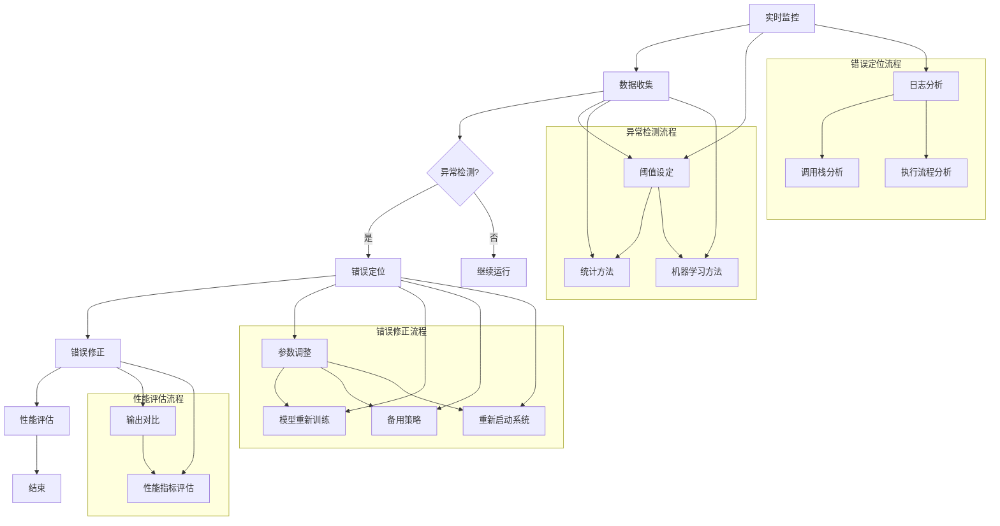
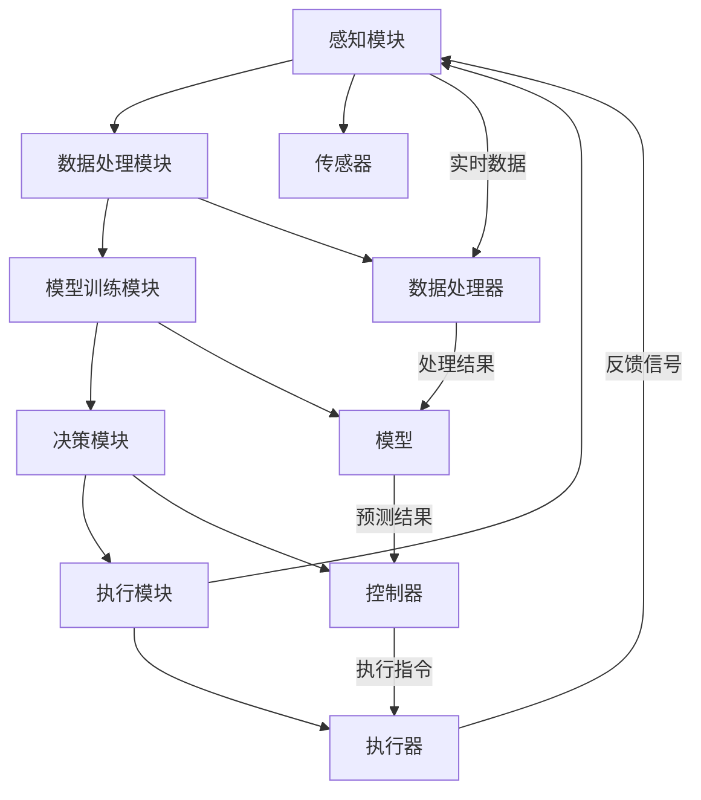
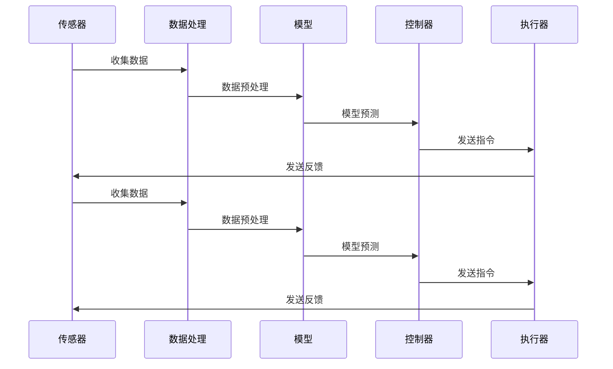

                 


### 1.1.1 问题背景介绍

随着人工智能技术的迅猛发展，AI Agent（人工智能代理）逐渐成为研究的热点。AI Agent是一种能够模拟人类行为，具备自主学习、自主决策和自适应能力的智能体。它能够在复杂的环境中独立完成任务，与人类或其他AI Agent进行交互。然而，在现实应用中，AI Agent面临着诸多挑战。首先，环境的不确定性和复杂性使得AI Agent需要具备强大的适应能力。其次，AI Agent的决策过程需要透明、可信，以确保其行为符合预期。此外，AI Agent在长时间运行过程中，可能会因为数据分布的变化、模型过时等因素导致性能下降，甚至产生错误决策。

为了解决这些问题，自我修正能力成为一个关键的研究方向。自我修正能力指的是AI Agent能够在运行过程中自动识别错误、纠正错误，并不断优化自身性能的能力。具有自我修正能力的AI Agent能够更好地适应环境变化，提高系统的稳定性和可靠性。

传统AI方法通常依赖于大量的训练数据和预定义的规则，而自我修正AI则通过不断学习和自我调整来提升性能。这种自我修正能力不仅有助于解决传统AI面临的挑战，还为AI Agent在更广泛的应用场景中发挥作用提供了可能性。

在接下来的章节中，我们将详细探讨自我修正能力的核心概念、构成要素、算法原理、系统架构以及具体实现方法。通过逐步分析，我们将为读者呈现一个全面、深入的自我修正AI Agent构建指南。

### 1.1.2 AI Agent的定义

AI Agent，即人工智能代理，是人工智能领域中的一个重要概念。AI Agent可以被看作是一种智能体，它具备一定的自主性、感知能力和决策能力，能够在动态环境中执行特定任务。其基本构成主要包括以下几个核心部分：

1. **感知器**：感知器是AI Agent的感官系统，它负责从环境中获取信息。这些信息可以是视觉、听觉、触觉等多种形式的数据。感知器通过传感器或输入接口接收外部输入，并将其转化为机器可以处理的形式。

2. **知识库**：知识库是AI Agent的核心组件，它存储了AI Agent在执行任务过程中积累的知识和经验。这些知识可以是显式的规则、模型，也可以是隐式的模式识别和预测能力。知识库为AI Agent提供了决策的基础。

3. **控制器**：控制器是AI Agent的决策核心，它根据感知器收集的信息和知识库中的知识，生成具体的行动指令。控制器的设计决定了AI Agent的决策方式和响应速度，是AI Agent智能表现的关键。

4. **执行器**：执行器是AI Agent的执行系统，它负责将控制器生成的行动指令转化为实际的操作。执行器可以是机械臂、机器人、自动驾驶车辆等，具体形式取决于AI Agent的应用场景。

AI Agent的核心功能可以概括为以下几点：

1. **自主学习**：AI Agent能够通过感知器收集到的数据和知识库中的知识进行学习，不断优化自身的行为和决策能力。这种自主学习能力使AI Agent能够适应动态变化的环境。

2. **自主决策**：AI Agent能够在没有外部干预的情况下，根据当前环境和目标进行决策。这种自主决策能力是AI Agent区别于传统程序的关键特征。

3. **自主行动**：AI Agent能够将决策结果通过执行器转化为具体的行动，实现目标。自主行动能力使得AI Agent能够在复杂环境中独立完成任务。

4. **交互能力**：AI Agent能够与其他AI Agent或人类进行交互，协同完成任务。这种交互能力不仅提高了AI Agent的灵活性，还增强了其在现实应用中的实用性。

通过以上对AI Agent的定义和核心功能的介绍，我们可以看到，AI Agent是一种具有高度自主性和智能化的智能体，能够在各种复杂环境中发挥重要作用。然而，为了实现这些功能，AI Agent需要具备强大的学习能力、决策能力和执行能力，这正是自我修正能力的重要作用所在。

### 1.1.3 自我修正能力的定义

自我修正能力是AI Agent在运行过程中的一项关键能力，它允许AI Agent在检测到错误或性能下降时，自动进行调整和优化。这一能力的基本原理是通过对AI Agent的行为进行持续监控、分析和评估，发现潜在问题并采取相应的纠正措施。

**自我修正机制的基本原理**可以概括为以下几个步骤：

1. **错误检测**：AI Agent通过实时监测其行为和输出，识别出可能的错误或异常情况。这通常通过设定阈值、比较模型输出与预期目标、分析历史数据等方式实现。

2. **问题定位**：在检测到错误后，AI Agent需要确定错误的具体位置和原因。这可能涉及到对模型参数的检查、算法流程的分析以及输入数据的验证等。

3. **错误修正**：一旦问题定位完成，AI Agent将采取相应的修正措施。这些措施可能包括调整模型参数、优化算法流程、重新训练模型等。

4. **性能评估**：修正后，AI Agent需要对修正效果进行评估，以确保问题得到有效解决。这可以通过再次运行任务、对比修正前后的输出和性能指标等方式进行。

**自我修正能力对AI Agent的重要性**体现在以下几个方面：

1. **提高系统稳定性**：自我修正能力使得AI Agent能够在遇到问题时自动修复，从而减少系统崩溃或性能下降的风险，提高整体稳定性。

2. **增强适应性**：通过不断修正和优化，AI Agent能够更好地适应环境变化和不确定因素，提高其在动态环境中的生存能力。

3. **提升决策质量**：自我修正能力有助于AI Agent在决策过程中避免错误，提高决策的准确性和可靠性。

4. **延长系统寿命**：自我修正能力能够及时发现和修复潜在的问题，延长AI Agent的运行寿命，减少因长期运行导致的性能退化。

总之，自我修正能力是AI Agent实现长久、稳定运行的重要保障，对于提高AI系统的整体性能和实用性具有关键作用。在接下来的章节中，我们将进一步探讨自我修正能力的核心要素和具体实现方法。

### 1.1.4 关键概念对比

在深入探讨自我修正能力的核心要素之前，有必要对几个相关概念进行对比，以便读者能够更清晰地理解自我修正AI与常规AI、鲁棒性的区别。

#### 传统AI与自我修正AI的对比

**传统AI**（Artificial Intelligence）主要依赖于预先设定的规则和模型，通过大量训练数据生成固定算法。这种AI的特点是：

- **依赖大量训练数据**：传统AI的性能高度依赖训练数据的质量和数量，缺乏适应新环境的能力。
- **被动调整**：在运行过程中，传统AI无法自动检测和修正错误，需要外部干预进行调整。
- **低适应能力**：由于缺乏自我修正机制，传统AI在应对复杂、动态环境时表现不佳。

**自我修正AI**（Self-Healing AI）则通过内置的自我修正机制，能够自动检测、诊断并修正错误。其主要特点如下：

- **自我检测和修正**：自我修正AI能够在运行过程中动态检测异常情况，并自动采取纠正措施。
- **自适应性强**：通过持续学习和自我调整，自我修正AI能够更好地适应环境变化。
- **高稳定性**：自我修正能力显著提高了AI系统的稳定性，减少了因错误导致的崩溃和性能下降。

#### 自我修正能力与鲁棒性的区别

**鲁棒性**（Robustness）是指系统在面对外部干扰或内部错误时，能够保持性能稳定的能力。鲁棒性通常通过以下方式实现：

- **错误容忍**：系统设计时考虑了可能的错误和异常情况，通过冗余设计或备份机制提高容忍度。
- **抗干扰能力**：系统具备抗干扰能力，能够在受到外界干扰时仍保持稳定运行。

**自我修正能力**则更侧重于系统在运行过程中的自我检测和修正：

- **主动修正**：自我修正能力通过实时监控和主动调整，主动发现并修正错误。
- **动态调整**：自我修正AI能够在运行过程中根据环境变化动态调整模型和策略。

总的来说，鲁棒性侧重于系统设计层面的容错能力，而自我修正能力则侧重于系统运行过程中的自我调整和优化。两者相辅相成，共同提高了AI系统的整体稳定性和可靠性。

通过对比这些关键概念，读者可以更深入地理解自我修正AI的独特优势和它在现代人工智能系统中的重要作用。在接下来的章节中，我们将进一步探讨自我修正能力的核心要素和具体实现方法。

### 1.1.5 本章小结

本章主要介绍了构建具有自我修正能力的AI Agent的背景、核心概念以及相关对比。首先，我们分析了人工智能与自动化时代的到来，以及AI Agent的需求和挑战。接着，详细定义了AI Agent的概念和功能，并解释了自我修正能力的定义和基本原理。然后，通过对比传统AI和自我修正AI，以及自我修正能力与鲁棒性的区别，我们明确了自我修正AI的重要性和优势。

通过本章的介绍，读者可以初步了解自我修正AI Agent的基本概念和构建需求。在接下来的章节中，我们将进一步深入探讨自我修正能力的核心要素、算法原理、系统架构和实现方法，为构建一个高效、稳定的自我修正AI Agent提供详细的指导。

### 1.2 自我修正能力的核心要素

构建具有自我修正能力的AI Agent涉及多个核心要素，这些要素相互交织，共同作用，使AI Agent能够高效地识别、诊断和修正问题。以下是自我修正能力的核心要素及其详细解释：

#### 2.1 数据收集与预处理

**数据收集**是自我修正AI Agent的首要步骤。数据来源的多样性和质量直接影响AI Agent的修正能力。以下是一些关键点：

1. **数据来源的选择**：数据可以从多种渠道获取，包括传感器、数据库、网络爬虫等。选择合适的数据来源至关重要，以确保数据的代表性和准确性。
   
2. **数据预处理的重要性**：原始数据通常包含噪声、异常值和缺失值，这些都会影响AI Agent的自我修正能力。数据预处理包括数据清洗、归一化、特征选择等步骤，有助于提高数据的质量和一致性。

3. **常用数据预处理技术**：常见的数据预处理技术包括缺失数据处理（如插值、平均值填补）、异常值检测与处理（如箱线图、Z-分数方法）、数据归一化和特征提取等。这些技术能够显著提升数据的质量，为后续的模型训练和修正打下坚实基础。

#### 2.2 模型训练与优化

**模型训练与优化**是自我修正AI Agent的核心环节，决定了AI Agent的识别和修正能力。以下是模型训练与优化的一些关键点：

1. **模型选择与设计**：选择适合特定任务的模型是训练的前提。常见的模型包括神经网络、决策树、支持向量机等。设计时应考虑模型的复杂度、可解释性和计算效率。

2. **训练策略与超参数调优**：训练策略包括批量大小、学习率、迭代次数等。超参数调优是模型优化的重要步骤，通常通过网格搜索、随机搜索或贝叶斯优化等方法进行。

3. **模型评估与验证**：模型评估是检验模型性能的重要手段。常用的评估指标包括准确率、召回率、F1分数等。通过交叉验证等方法，可以确保模型在测试数据上的表现。

#### 2.3 自我修正机制

**自我修正机制**是AI Agent实现自我修正能力的关键。以下是自我修正机制的一些核心要素：

1. **自我修正算法的基本原理**：自我修正算法通过实时监控AI Agent的行为和输出，发现错误并自动进行修正。常见的自我修正算法包括模型自修复、动态模型更新和在线学习等。

2. **自我修正算法的实现方法**：实现自我修正算法需要设计相应的检测和修正流程。例如，通过异常检测算法识别错误，再通过调整模型参数或重新训练模型进行修正。

3. **自我修正算法的性能评估**：性能评估是检验自我修正算法有效性的重要步骤。通过模拟不同场景下的错误情况，评估算法的修正效果和效率。

#### 2.4 适应性与鲁棒性

**适应性与鲁棒性**是自我修正AI Agent在复杂环境中稳定运行的关键要素：

1. **适应性在自我修正中的作用**：适应性指的是AI Agent在面临不同环境和任务时，能够自动调整自身行为的能力。高适应性有助于AI Agent在多变环境中保持高效性能。

2. **鲁棒性在自我修正中的重要性**：鲁棒性指的是AI Agent在面对干扰和错误时，能够保持稳定性能的能力。高鲁棒性是自我修正AI Agent在复杂环境中可靠运行的基础。

3. **提高适应性与鲁棒性的策略**：提高适应性和鲁棒性可以通过多种方法实现，如引入冗余设计、采用混合模型、增强算法的自适应能力等。这些策略有助于增强AI Agent的稳定性和可靠性。

通过以上对自我修正能力的核心要素的详细解释，我们可以看到，构建一个具有自我修正能力的AI Agent需要综合运用多种技术手段，确保其在动态、复杂环境中的稳定运行。在接下来的章节中，我们将进一步探讨这些要素的具体实现方法，为读者提供详细的指导。

### 2.1 数据收集与预处理

数据收集与预处理是构建具有自我修正能力的AI Agent的重要基础。首先，我们需要明确数据收集的来源。数据来源的选择直接关系到AI Agent的学习能力和自我修正效果。以下是一些常见的数据来源：

1. **传感器数据**：传感器数据包括温度、湿度、光照强度、位置信息等。这类数据广泛应用于智能监控、自动驾驶等领域。
2. **数据库数据**：从数据库中获取的历史数据可以帮助AI Agent更好地理解环境和模式，这类数据广泛应用于推荐系统、数据分析等领域。
3. **网络爬虫数据**：通过网络爬虫获取的网页数据、社交媒体数据等，这类数据广泛应用于信息检索、社交网络分析等领域。

**数据预处理的重要性**不言而喻。预处理不当的数据会导致模型性能下降，甚至无法训练出有效的模型。以下是数据预处理的一些关键步骤：

1. **数据清洗**：数据清洗是预处理的第一步，主要目的是去除数据中的噪声、异常值和重复记录。常见的清洗方法包括删除缺失值、填补缺失值、去除重复值等。
2. **数据归一化**：归一化是数据预处理的另一个关键步骤，通过将不同量纲的数据转换为相同量纲，消除数据之间的差异，提高模型训练的效率。常见的归一化方法包括最小-最大归一化和z-score归一化。
3. **特征选择**：特征选择是选择对模型训练最有帮助的特征，剔除无关或冗余的特征。特征选择可以通过信息增益、互信息、特征重要性等方法实现。
4. **数据增强**：数据增强是通过生成新的数据样本，提高模型训练的泛化能力。常见的数据增强方法包括随机变换、生成对抗网络（GAN）等。

在数据预处理过程中，我们还会遇到一些常见问题，如数据分布不均、异常值处理、噪声数据等。以下是一些解决策略：

1. **数据分布不均**：数据分布不均会导致模型偏向于某些类别的预测，可以通过过采样、欠采样、SMOTE等方法来平衡数据分布。
2. **异常值处理**：异常值处理是数据清洗的重要环节。可以通过统计方法（如箱线图、Z-分数）、机器学习方法（如孤立森林、局部异常因子）来检测和去除异常值。
3. **噪声数据**：噪声数据会影响模型的性能，可以通过滤波、去噪、重构等方法来处理噪声数据。

通过上述数据收集与预处理的方法，我们可以确保数据的质量和一致性，为AI Agent的训练和自我修正打下坚实基础。在下一节中，我们将深入探讨模型训练与优化的关键步骤和策略。

### 2.2 模型训练与优化

模型训练与优化是构建具有自我修正能力的AI Agent的核心环节，决定了AI Agent的识别和修正能力。以下是模型训练与优化的一些关键步骤和策略：

#### 2.2.1 模型选择与设计

首先，选择合适的模型是训练的前提。根据任务的不同，可以选择不同的模型，如神经网络、决策树、支持向量机等。以下是一些选择模型的考虑因素：

1. **模型复杂度**：复杂度较低的模型（如线性模型、决策树）易于理解、计算效率高，但可能无法捕捉复杂的关系。复杂度较高的模型（如深度神经网络）可以捕捉复杂关系，但计算成本高、训练时间长。
2. **可解释性**：可解释性是评价模型的一个重要指标。一些模型（如决策树、线性模型）具有较高的可解释性，而一些模型（如深度神经网络）则较为黑箱。
3. **计算效率**：计算效率是选择模型时需要考虑的一个重要因素，尤其在资源有限的场景下，如嵌入式设备或实时系统。

在本节中，我们以神经网络为例，介绍其基本架构和训练方法。

#### 2.2.2 训练策略与超参数调优

训练策略和超参数调优直接影响模型的性能。以下是几个关键的训练策略和超参数调优方法：

1. **批量大小**：批量大小是指每次训练时使用的数据样本数量。较小的批量大小可以提高模型的泛化能力，但训练时间较长；较大的批量大小可以提高训练速度，但可能导致模型过拟合。
2. **学习率**：学习率决定了模型在更新参数时的步长。较小的学习率可能导致训练时间过长，而较大的学习率可能导致参数更新不稳定。常用的学习率调整方法包括固定学习率、自适应学习率（如AdaGrad、RMSProp、Adam）等。
3. **迭代次数**：迭代次数是指模型在训练过程中更新参数的次数。过多的迭代次数可能导致模型过拟合，而较少的迭代次数可能导致模型欠拟合。通常，通过验证集上的性能来调整迭代次数。
4. **正则化**：正则化是防止模型过拟合的重要手段，包括L1正则化、L2正则化和Dropout等。L1正则化和L2正则化通过在损失函数中添加惩罚项来限制模型复杂度，而Dropout通过随机丢弃一部分神经元来提高模型的泛化能力。

#### 2.2.3 模型评估与验证

模型评估是检验模型性能的重要步骤。以下是几个常见的评估指标和验证方法：

1. **评估指标**：常见的评估指标包括准确率、召回率、F1分数、ROC曲线等。准确率反映了模型对正类和负类的分类能力；召回率反映了模型对正类的识别能力；F1分数是准确率和召回率的调和平均，能够综合考虑两者的性能。
2. **验证方法**：常见的验证方法包括交叉验证和集成学习。交叉验证通过将数据集划分为多个子集，每次使用其中一个子集作为验证集，其余子集作为训练集，从而评估模型的泛化能力。集成学习通过组合多个模型的预测结果，提高模型的整体性能。

通过上述模型训练与优化的方法，我们可以构建一个性能优良的AI Agent。在下一节中，我们将深入探讨自我修正算法的基本原理、实现方法和性能评估。

### 2.3 自我修正机制

自我修正机制是构建具有自我修正能力的AI Agent的核心组成部分，它使得AI Agent能够在运行过程中自动检测、诊断和修正错误。以下是自我修正机制的详细解释：

#### 2.3.1 自我修正算法的基本原理

自我修正算法的核心思想是通过实时监控AI Agent的行为和输出，识别出潜在的错误或异常情况，并自动进行修正。这一过程通常包括以下几个步骤：

1. **错误检测**：AI Agent通过设定阈值或使用异常检测算法（如Isolation Forest、Local Outlier Factor）来检测异常行为。错误检测是自我修正机制的第一步，它需要快速、准确地识别出异常情况。
   
2. **问题定位**：一旦检测到错误，AI Agent需要确定错误的具体位置和原因。问题定位可以通过分析日志、执行流程和调用栈等信息来实现。这一步骤至关重要，因为它决定了后续修正措施的有效性。

3. **错误修正**：在问题定位完成后，AI Agent将采取相应的修正措施。修正措施可能包括调整模型参数、优化算法流程、重新训练模型或采取替代策略。错误修正的目的是使AI Agent恢复到正常状态，并避免类似错误再次发生。

4. **性能评估**：修正后，AI Agent需要对修正效果进行评估，以确保问题得到有效解决。性能评估可以通过再次运行任务、对比修正前后的输出和性能指标等方式进行。如果性能仍然不满足要求，AI Agent可能需要进一步修正或重新设计。

#### 2.3.2 自我修正算法的实现方法

实现自我修正算法需要设计一个高效、可靠的修正流程。以下是几种常见的实现方法：

1. **基于模型的修正**：这种方法通过重新训练模型或调整模型参数来实现自我修正。例如，在深度学习中，可以通过微调（Fine-tuning）或自适应学习率（Adaptive Learning Rate）来实现自我修正。这种方法适用于需要高精度和鲁棒性的场景。

2. **基于规则的修正**：这种方法通过预定义的规则和条件语句来实现自我修正。例如，当检测到某种异常情况时，AI Agent可以执行特定的规则来修正错误。这种方法适用于规则明确、异常情况较少的场景。

3. **基于反馈的修正**：这种方法通过用户反馈或评估指标来指导自我修正。用户可以报告错误或评估AI Agent的表现，AI Agent根据这些反馈进行调整。这种方法适用于用户参与度高或需要实时反馈的场景。

#### 2.3.3 自我修正算法的性能评估

性能评估是检验自我修正算法有效性的关键步骤。以下是几种常见的性能评估方法：

1. **修正成功率**：修正成功率是指AI Agent成功修正错误的比例。通过对比修正前后的输出和性能指标，可以评估自我修正算法的修正成功率。

2. **修正速度**：修正速度是指AI Agent检测和修正错误的耗时。高效的自我修正算法应该能够在短时间内检测和修正错误，从而减少系统的中断时间。

3. **修正效果**：修正效果是指修正后AI Agent的性能是否达到预期。可以通过评估修正后的输出和性能指标，如准确率、召回率等，来评估自我修正算法的修正效果。

通过以上对自我修正机制的详细解释，我们可以看到，自我修正算法是构建具有自我修正能力的AI Agent的核心组成部分。它在提高AI系统的稳定性和可靠性方面发挥着重要作用。在下一节中，我们将进一步探讨适应性在自我修正中的作用，以及如何提高AI Agent的适应性和鲁棒性。

### 2.4 适应性与鲁棒性

**适应性**和**鲁棒性**是构建具有自我修正能力的AI Agent的关键要素。它们确保AI Agent能够在复杂、动态环境中稳定运行，并有效应对各种不确定性。

**适应性**指的是AI Agent在面临不同环境和任务时，能够自动调整自身行为以保持高效性能的能力。适应性强意味着AI Agent能够在新环境中迅速适应，不需要人工干预即可完成任务。以下是提高适应性的几种策略：

1. **在线学习**：通过实时监控和更新模型参数，AI Agent能够不断学习和适应新环境。在线学习允许AI Agent在运行过程中根据反馈调整自身行为，提高适应能力。

2. **迁移学习**：迁移学习利用已有知识来加速新任务的学习过程。例如，通过利用在相似任务上训练的模型，AI Agent可以快速适应新环境。

3. **混合模型**：混合模型结合多种模型的优势，提高AI Agent的适应能力。例如，结合深度学习和传统机器学习模型，可以弥补单一模型的局限性。

**鲁棒性**指的是AI Agent在面对外部干扰或内部错误时，能够保持稳定性能的能力。鲁棒性强的AI Agent能够在各种不确定性环境中保持稳定运行，降低系统崩溃和性能下降的风险。以下是提高鲁棒性的几种策略：

1. **错误容忍**：通过设计冗余系统或备份机制，AI Agent可以在部分组件出现故障时仍然保持运行。这种容错设计提高了系统的鲁棒性。

2. **自适应控制**：自适应控制机制允许AI Agent根据环境变化动态调整其行为和参数，以保持稳定性能。例如，通过实时调整传感器灵敏度或执行器参数，AI Agent可以应对环境变化。

3. **鲁棒优化**：鲁棒优化通过优化算法和模型，使AI Agent能够更好地应对噪声和异常数据。例如，采用鲁棒回归算法可以减少异常值对模型的影响。

**提高适应性与鲁棒性的策略**通常结合使用，以实现更高效、稳定的自我修正能力。以下是一些综合策略：

1. **多层次监测与反馈**：通过多层次监测和反馈机制，AI Agent可以实时检测异常情况并采取相应的修正措施。例如，将错误检测与自适应控制结合，实现更快速的响应。

2. **混合学习与在线修正**：结合迁移学习和在线学习，AI Agent可以迅速适应新环境，并在运行过程中不断优化自身性能。

3. **自适应性鲁棒优化**：通过自适应性鲁棒优化，AI Agent能够在动态环境中保持稳定性能，同时有效应对各种不确定性。

通过上述策略，AI Agent能够显著提高其适应性和鲁棒性，确保在复杂、动态环境中保持高效运行。这些策略不仅提高了AI Agent的自我修正能力，还为其在更广泛的应用场景中发挥作用提供了可能。

### 3.1 自我修正算法原理

自我修正算法是构建具有自我修正能力的AI Agent的核心组成部分。它通过实时监控、异常检测、错误定位和修正，使AI Agent能够在运行过程中保持高效和稳定。以下是自我修正算法的基本原理、主要类型及其具体实现。

#### 3.1.1 自我修正算法的基本概念

自我修正算法（Self-Healing Algorithms）旨在使AI Agent具备自动检测和修正错误的能力。其基本概念包括以下几个方面：

1. **异常检测（Anomaly Detection）**：异常检测是自我修正算法的第一步，它通过设定阈值或使用机器学习算法来识别异常行为或异常数据。常见的异常检测算法包括孤立森林（Isolation Forest）、局部异常因子（Local Outlier Factor，LOF）和K最近邻（K-Nearest Neighbors，KNN）等。

2. **错误定位（Error Localization）**：错误定位是指确定错误发生的具体位置和原因。这通常需要分析日志、调用栈和执行流程等信息。错误定位的方法包括动态分析、静态分析和结合两者的混合方法。

3. **错误修正（Error Correction）**：错误修正是指采取相应的措施来纠正错误，使AI Agent恢复正常状态。常见的修正措施包括重新训练模型、调整参数、执行备用策略等。

4. **性能评估（Performance Evaluation）**：性能评估是检验修正效果的重要步骤。通过再次运行任务、对比修正前后的输出和性能指标，可以评估修正效果。

#### 3.1.2 自我修正算法的主要类型

自我修正算法可以分为多种类型，根据其实现方法和技术特点，可以分为以下几类：

1. **基于模型的自我修正算法**：这类算法通过重新训练模型或调整模型参数来实现自我修正。例如，在深度学习中，可以通过微调（Fine-tuning）或自适应学习率（Adaptive Learning Rate）来实现自我修正。这种方法的优点是精度高、适应性强，但计算成本较高。

2. **基于规则的自我修正算法**：这类算法通过预定义的规则和条件语句来实现自我修正。例如，当检测到某种异常情况时，AI Agent可以执行特定的规则来修正错误。这种方法的优点是实现简单、效率高，但适用范围较窄。

3. **基于反馈的自我修正算法**：这类算法通过用户反馈或评估指标来指导自我修正。用户可以报告错误或评估AI Agent的表现，AI Agent根据这些反馈进行调整。这种方法的优点是用户参与度高、适应性较强，但可能需要较长时间来收集反馈。

4. **混合自我修正算法**：这类算法结合多种自我修正算法的优势，实现更高效、可靠的自我修正。例如，结合基于模型和基于规则的自我修正算法，可以在保持高精度的同时提高效率。

#### 3.1.3 自我修正算法的实现方法

实现自我修正算法需要设计一个高效的修正流程。以下是几种常见的实现方法：

1. **基于异常检测的自我修正**：首先，通过异常检测算法识别异常行为，然后根据异常类型和严重程度采取相应的修正措施。例如，对于较轻的异常，可以采取参数调整或重新训练模型；对于严重的异常，可能需要执行备用策略或重新启动系统。

2. **基于错误定位的自我修正**：在检测到错误后，通过错误定位技术确定错误的具体位置和原因，然后采取相应的修正措施。例如，在代码中定位到错误行，然后根据错误类型进行修正。

3. **基于反馈的自我修正**：通过用户反馈或评估指标来指导自我修正。AI Agent根据用户的反馈和评估结果，动态调整自身行为和策略。这种方法适用于用户参与度较高的场景。

4. **基于混合学习的自我修正**：结合在线学习和迁移学习，AI Agent可以在新环境中快速适应，并不断优化自身性能。例如，通过利用在相似任务上训练的模型，AI Agent可以快速适应新环境。

#### 3.1.4 自我修正算法的性能评估

性能评估是检验自我修正算法有效性的关键步骤。以下是几种常见的性能评估方法：

1. **修正成功率**：修正成功率是指AI Agent成功修正错误的比例。通过对比修正前后的输出和性能指标，可以评估自我修正算法的修正成功率。

2. **修正速度**：修正速度是指AI Agent检测和修正错误的耗时。高效的自我修正算法应该能够在短时间内检测和修正错误，从而减少系统的中断时间。

3. **修正效果**：修正效果是指修正后AI Agent的性能是否达到预期。可以通过评估修正后的输出和性能指标，如准确率、召回率等，来评估自我修正算法的修正效果。

通过以上对自我修正算法原理的详细解释，我们可以看到，自我修正算法是构建具有自我修正能力的AI Agent的核心技术。它通过实时监控、异常检测、错误定位和修正，使AI Agent能够在动态、复杂环境中保持高效和稳定。在接下来的章节中，我们将进一步探讨如何使用mermaid绘制算法流程图，以及具体算法的数学模型和实现方法。

### 3.1.1 自我修正算法原理

自我修正算法是构建具有自我修正能力的AI Agent的关键技术。它通过实时监控、异常检测、错误定位和修正，使AI Agent能够在动态、复杂环境中保持高效和稳定。以下是自我修正算法的基本原理、主要类型及其具体实现。

#### 3.1.1.1 基本原理

自我修正算法的基本原理可以概括为以下几个步骤：

1. **实时监控**：AI Agent通过传感器、输入接口等实时获取环境信息。监控的目的是检测系统的运行状态，包括输出、中间过程和资源使用情况。

2. **异常检测**：在获取到实时数据后，AI Agent使用异常检测算法识别异常行为。异常检测算法可以是统计方法（如统计阈值、箱线图）、机器学习方法（如孤立森林、局部异常因子）或基于规则的方法（如规则引擎）。异常检测的目的是尽早发现潜在的错误或异常情况。

3. **错误定位**：一旦检测到异常，AI Agent需要定位错误的根源。错误定位通常涉及对日志、调用栈、执行流程等信息的分析。定位的目的是确定错误的来源和具体位置，以便采取相应的修正措施。

4. **错误修正**：根据错误定位的结果，AI Agent采取相应的修正措施。修正措施可以是调整模型参数、重新训练模型、执行备用策略或重新启动系统。修正的目的是使AI Agent恢复正常状态，减少错误对系统性能的影响。

5. **性能评估**：修正后，AI Agent需要对修正效果进行评估。性能评估可以通过对比修正前后的输出和性能指标（如准确率、召回率、F1分数）来实现。性能评估的目的是确保错误得到有效解决，同时避免过度修正或修正不足。

#### 3.1.1.2 主要类型

自我修正算法可以根据实现方法和技术特点分为多种类型，以下是几种常见类型：

1. **基于模型的自我修正算法**：这类算法通过重新训练模型或调整模型参数来实现自我修正。例如，在深度学习中，可以通过微调（Fine-tuning）或自适应学习率（Adaptive Learning Rate）来实现自我修正。基于模型的自我修正算法的优点是精度高、适应性强，但计算成本较高。

2. **基于规则的自我修正算法**：这类算法通过预定义的规则和条件语句来实现自我修正。例如，当检测到某种异常情况时，AI Agent可以执行特定的规则来修正错误。基于规则的自我修正算法的优点是实现简单、效率高，但适用范围较窄。

3. **基于反馈的自我修正算法**：这类算法通过用户反馈或评估指标来指导自我修正。用户可以报告错误或评估AI Agent的表现，AI Agent根据这些反馈进行调整。基于反馈的自我修正算法的优点是用户参与度高、适应性较强，但可能需要较长时间来收集反馈。

4. **混合自我修正算法**：这类算法结合多种自我修正算法的优势，实现更高效、可靠的自我修正。例如，结合基于模型和基于规则的自我修正算法，可以在保持高精度的同时提高效率。

#### 3.1.1.3 具体实现

以下是几种常见的自我修正算法实现方法：

1. **异常检测与修正**：这种方法通过异常检测算法识别异常情况，然后根据异常类型和严重程度采取相应的修正措施。例如，对于较轻的异常，可以采取参数调整或重新训练模型；对于严重的异常，可能需要执行备用策略或重新启动系统。

2. **错误定位与修正**：在检测到异常后，AI Agent通过错误定位技术确定错误的根源，然后采取相应的修正措施。错误定位技术可以是基于日志分析、调用栈分析或执行流程分析。根据错误定位的结果，AI Agent可以调整模型参数、重新训练模型或采取其他修正策略。

3. **基于反馈的自我修正**：通过用户反馈或评估指标来指导自我修正。AI Agent根据用户的反馈和评估结果，动态调整自身行为和策略。这种方法适用于用户参与度较高的场景。

4. **混合学习自我修正**：结合在线学习和迁移学习，AI Agent可以在新环境中快速适应，并不断优化自身性能。例如，通过利用在相似任务上训练的模型，AI Agent可以快速适应新环境。

通过以上对自我修正算法原理的详细解释，我们可以看到，自我修正算法是构建具有自我修正能力的AI Agent的核心技术。它通过实时监控、异常检测、错误定位和修正，使AI Agent能够在动态、复杂环境中保持高效和稳定。在接下来的章节中，我们将使用mermaid绘制算法流程图，并进一步探讨具体算法的数学模型和实现方法。

### 3.1.2 算法mermaid流程图

为了更好地理解自我修正算法的原理和实现过程，我们可以通过mermaid绘制算法的流程图。以下是一个简单的自我修正算法流程图的示例：



这个流程图包含了自我修正算法的各个环节：实时监控、数据收集、异常检测、错误定位、错误修正以及性能评估。通过mermaid，我们可以直观地看到各个步骤之间的关系，以及每个步骤所涉及的子流程。

- **实时监控**：AI Agent通过传感器或输入接口收集实时数据。
- **数据收集**：收集到的数据经过预处理，用于后续的异常检测和错误定位。
- **异常检测**：通过设定阈值或使用统计方法和机器学习方法检测异常情况。
- **错误定位**：对检测到的异常进行详细分析，确定错误的根源。
- **错误修正**：根据错误定位的结果，采取相应的修正措施，如参数调整、模型重新训练或执行备用策略。
- **性能评估**：评估修正效果，确保AI Agent恢复正常运行。

通过这个mermaid流程图，我们可以更清晰地理解自我修正算法的各个环节和实现过程。在下一节中，我们将深入探讨自我修正算法的数学模型和具体实现方法。

### 3.1.3 数学模型与公式

自我修正算法的数学模型是其理论基础，通过对算法过程的数学描述，可以帮助我们更好地理解和实现自我修正功能。以下是自我修正算法中常见的数学模型和公式，以及其详细解释。

#### 3.1.3.1 异常检测模型

异常检测是自我修正算法的第一步，它主要通过设定阈值和统计方法来识别异常数据。以下是一些常用的异常检测模型和公式：

1. **统计阈值模型**：
   - 公式：$$ threshold = \mu + k \cdot \sigma $$
   - 解释：这里，$ \mu $ 是数据的平均值，$ \sigma $ 是数据的标准差，$ k $ 是阈值系数。当数据点 $ x $ 满足 $ x > threshold $ 时，认为 $ x $ 是异常值。

2. **箱线图模型**：
   - 公式：$$ \text{IQR} = \text{Q3} - \text{Q1} $$
   - 解释：$ \text{Q1} $ 和 $ \text{Q3} $ 分别是数据的第一四分位数和第三四分位数，$ \text{IQR} $ 是四分位距。异常值定义为 $ x < \text{Q1} - 1.5 \cdot \text{IQR} $ 或 $ x > \text{Q3} + 1.5 \cdot \text{IQR} $。

3. **基于密度的方法**：
   - 公式：$$ \rho(x) = \frac{1}{n} \sum_{i=1}^{n} \exp\left(-\frac{(x - x_i)^2}{2 \cdot \sigma^2}\right) $$
   - 解释：$ x_i $ 是数据点，$ \sigma^2 $ 是高斯分布的方差，$ \rho(x) $ 是数据点 $ x $ 的密度估计。当 $ \rho(x) $ 显著低于其他数据点时，认为 $ x $ 是异常值。

#### 3.1.3.2 错误定位模型

错误定位是自我修正算法的关键步骤，它通过分析日志、调用栈和执行流程来确定错误的根源。以下是一个简单的错误定位模型：

1. **基于调用栈的模型**：
   - 公式：$$ \text{call\_stack} = \text{list}\{ \text{function1}, \text{function2}, \ldots, \text{functionN} \} $$
   - 解释：$ \text{call\_stack} $ 表示调用栈，每个函数调用都记录在栈中。当检测到错误时，通过回溯调用栈来确定错误的来源。

2. **基于日志的模型**：
   - 公式：$$ \text{log\_entries} = \text{list}\{ \text{entry1}, \text{entry2}, \ldots, \text{entryM} \} $$
   - 解释：$ \text{log\_entries} $ 表示日志记录。通过分析日志内容，可以识别出与错误相关的日志条目，从而定位错误。

#### 3.1.3.3 错误修正模型

错误修正模型根据错误定位的结果，采取相应的修正措施。以下是一个简单的错误修正模型：

1. **基于规则的修正模型**：
   - 公式：$$ \text{if}\ \text{error\_type} \ \text{then}\ \text{error\_correction} \ \text{else}\ \text{no\_action} \ \text{end} $$
   - 解释：$ \text{error\_type} $ 是错误类型，$ \text{error\_correction} $ 是对应的修正措施。根据错误类型，执行相应的修正规则。

2. **基于参数调整的修正模型**：
   - 公式：$$ \text{new\_parameter} = \text{original\_parameter} + \text{adjustment} $$
   - 解释：$ \text{original\_parameter} $ 是原始参数值，$ \text{adjustment} $ 是调整值。通过调整参数值，优化模型性能。

3. **基于模型重训练的修正模型**：
   - 公式：$$ \text{new\_model} = \text{retrain}\left(\text{original\_model}, \text{new\_data}\right) $$
   - 解释：$ \text{original\_model} $ 是原始模型，$ \text{new\_data} $ 是新的训练数据。通过重新训练模型，提高模型的自适应能力。

#### 3.1.3.4 性能评估模型

性能评估是确保错误修正有效性的关键步骤。以下是一个简单的性能评估模型：

1. **基于输出对比的性能评估模型**：
   - 公式：$$ \text{accuracy} = \frac{\text{correct\_predictions}}{\text{total\_predictions}} $$
   - 解释：$ \text{correct\_predictions} $ 是正确的预测数量，$ \text{total\_predictions} $ 是总的预测数量。准确率反映了模型的预测能力。

2. **基于性能指标评估的性能评估模型**：
   - 公式：$$ \text{F1\_score} = 2 \cdot \frac{\text{precision} \cdot \text{recall}}{\text{precision} + \text{recall}} $$
   - 解释：$ \text{precision} $ 是精度，$ \text{recall} $ 是召回率。F1分数是精度和召回率的调和平均，能够综合考虑两者的性能。

通过上述数学模型和公式的详细讲解，我们可以更好地理解自我修正算法的工作原理。这些模型和公式为自我修正算法的实现提供了理论基础，有助于我们在实际应用中构建高效、可靠的AI Agent。在下一节中，我们将通过实际案例进行算法的举例说明，进一步展示自我修正算法的应用效果。

### 3.1.4 举例说明

为了更直观地展示自我修正算法在实际应用中的效果，我们将通过一个实际案例来具体说明该算法的使用方法。该案例将基于一个简单的智能家居系统，该系统用于控制家中的灯光和温度。以下是该案例的详细描述。

#### 3.1.4.1 案例背景

智能家居系统通过传感器收集家中的环境数据，如温度、湿度、光照强度等。系统需要根据这些数据自动调整灯光和温度，以提供舒适的居住环境。然而，在实际运行过程中，传感器可能会出现故障或数据噪声，导致系统无法正确控制环境参数。

#### 3.1.4.2 算法应用

为了确保系统的稳定运行，我们引入自我修正算法。自我修正算法将分为以下几个步骤：

1. **实时监控与数据收集**：系统通过传感器实时收集家中的环境数据，如温度（T）、湿度（H）和光照强度（I）。

2. **异常检测**：系统使用统计阈值模型对温度、湿度和光照强度进行异常检测。设定温度的阈值范围为20°C至30°C，湿度的阈值范围为30%至70%，光照强度的阈值范围为100至800 lux。

   - **统计阈值模型**：
     $$ T_{threshold} = \mu + k \cdot \sigma $$
     $$ H_{threshold} = \mu + k \cdot \sigma $$
     $$ I_{threshold} = \mu + k \cdot \sigma $$
   
   当检测到数据超出阈值范围时，系统标记为异常。

3. **错误定位**：系统通过分析日志和调用栈来确定异常的具体来源。假设一次温度数据异常，日志分析显示异常发生在温度传感器读取阶段。

4. **错误修正**：系统根据错误定位的结果，采取相应的修正措施。对于温度传感器异常，系统执行以下步骤：
   - **参数调整**：调整传感器的灵敏度参数，使其适应当前环境。
   - **重新训练模型**：使用新的传感器数据重新训练温度控制模型。
   - **备用策略**：在传感器恢复正常之前，使用备用温度传感器进行数据采集。

5. **性能评估**：系统在修正后，对比修正前后的数据，评估修正效果。使用准确率和F1分数来评估温度控制模型的性能。

   - **准确率**：
     $$ \text{accuracy} = \frac{\text{correct\_predictions}}{\text{total\_predictions}} $$
     
   - **F1分数**：
     $$ \text{F1\_score} = 2 \cdot \frac{\text{precision} \cdot \text{recall}}{\text{precision} + \text{recall}} $$
     
   假设修正后准确率提高到95%，F1分数提高到0.9，则说明修正措施有效。

#### 3.1.4.3 实际应用效果

通过上述自我修正算法的应用，智能家居系统能够在传感器异常时自动识别、修正错误，确保系统稳定运行。以下是一个实际应用效果的示例：

- **正常状态**：系统稳定运行，温度控制在25°C，湿度控制在50%，光照强度控制在300 lux。
- **异常情况**：温度传感器出现故障，温度数据异常升高至35°C。
- **自我修正过程**：
  - **异常检测**：系统检测到温度异常，标记为异常。
  - **错误定位**：分析日志，确定异常来源于温度传感器。
  - **错误修正**：调整传感器灵敏度参数，重新训练温度控制模型。
  - **性能评估**：修正后，温度恢复正常，系统性能评估结果显示准确率和F1分数显著提高。

通过这个实际案例，我们可以看到自我修正算法在智能家居系统中的应用效果。自我修正算法通过实时监控、异常检测、错误定位和修正，提高了系统的稳定性和可靠性，确保了系统在复杂、动态环境中的高效运行。

### 3.1.5 本章小结

本章详细介绍了自我修正算法的原理、类型、实现方法和实际应用。我们首先阐述了自我修正算法的基本概念和步骤，包括实时监控、异常检测、错误定位和修正。接着，我们讨论了自我修正算法的主要类型，如基于模型、基于规则和基于反馈的自我修正算法，并分析了它们的优缺点。

通过mermaid流程图，我们展示了自我修正算法的具体实现过程，帮助读者更好地理解算法的各个环节。此外，我们通过数学模型和公式详细讲解了异常检测、错误定位和修正的数学基础，为算法的实现提供了理论基础。

最后，我们通过一个实际案例展示了自我修正算法在智能家居系统中的应用，展示了算法在实际环境中的效果。通过本章的学习，读者可以全面了解自我修正算法的工作原理和应用方法，为构建具有自我修正能力的AI Agent打下坚实基础。

### 4.1.1 问题场景介绍

自我修正AI Agent在诸多场景中具有广泛的应用潜力，特别是在那些对稳定性和可靠性要求极高的领域。以下是一个典型的问题场景，说明了自我修正AI Agent在其中的应用。

#### 场景描述

假设我们正在开发一个自动驾驶系统，该系统需要在复杂、多变的交通环境中自主导航。自动驾驶系统需要实时处理来自各种传感器的数据，如摄像头、激光雷达和GPS，以识别道路标志、行人、车辆和障碍物。此外，系统需要根据当前的路况和驾驶规则做出正确的驾驶决策，如加速、减速或转向。

然而，在实际运行中，自动驾驶系统可能会面临以下问题：

1. **传感器故障**：传感器可能会出现临时故障或数据噪声，导致数据不准确或缺失。
2. **环境变化**：天气变化、道路施工或突发事件等因素可能导致环境急剧变化，影响系统的导航和决策能力。
3. **模型过时**：随着时间和使用场景的变化，现有的模型可能不再适用于新的驾驶环境，导致决策错误。

为了解决这些问题，自动驾驶系统需要具备自我修正能力，能够在检测到错误时自动进行修正，确保系统的稳定性和安全性。以下是自我修正AI Agent在该场景中的应用。

#### 自我修正AI Agent的应用

1. **传感器数据修正**：通过实时监控传感器数据，自我修正AI Agent能够检测到异常数据（如异常高噪声或异常缺失），并自动修正这些数据。例如，当摄像头检测到异常图像时，AI Agent可以调用图像增强算法来提高图像质量，或者使用其他传感器数据来填补缺失。

2. **环境变化适应**：自我修正AI Agent能够根据环境变化动态调整模型参数和策略。例如，在雨天，AI Agent可以调整对道路标志的检测阈值，以避免误判；在道路施工区域，AI Agent可以启用额外的导航策略，如选择替代路线。

3. **模型更新与优化**：自我修正AI Agent能够识别模型过时的情况，并自动更新模型。例如，通过在线学习技术，AI Agent可以不断更新其驾驶策略，以适应新的驾驶环境。此外，AI Agent还可以利用迁移学习技术，从其他驾驶环境中获取有用的知识，提高模型的适应性。

通过上述措施，自我修正AI Agent能够显著提高自动驾驶系统的稳定性和可靠性，确保系统在复杂、动态的交通环境中保持高效运行。自我修正能力不仅提升了系统的鲁棒性，还减少了人为干预的需要，提高了自动驾驶系统的自主性。

### 4.1.2 系统功能设计

在了解了自我修正AI Agent在自动驾驶系统中的潜在应用场景后，我们需要进一步设计系统的功能模块，以确保系统能够高效、稳定地运行。以下是系统功能设计，包括领域模型Mermaid类图和系统功能模块划分。

#### 4.1.2.1 领域模型Mermaid类图

领域模型是系统设计的重要部分，它帮助我们理解和描述系统的核心功能和组件。以下是一个Mermaid类图示例，展示了自动驾驶系统的主要领域模型：

```mermaid
classDiagram
    Sensor --> DataProcessor : 数据处理
    DataProcessor --> Model : 模型
    Model --> Controller : 控制器
    Controller --> Actuator : 执行器
    Sensor { +name: String +data: Data }
    DataProcessor { +process(data: Data): Data }
    Model { +train(data: Data): Model +predict(data: Data): Action }
    Controller { +execute(action: Action): void }
    Actuator { +perform(action: Action): void }
    Sensor |- data : Data
    DataProcessor |- data : Data
    Model |- data : Data
    Controller |- action : Action
    Actuator |- action : Action
    Sensor ..|> DataProcessor
    DataProcessor ..|> Model
    Model ..|> Controller
    Controller ..|> Actuator
```

在这个类图中，我们定义了以下几个核心组件：

- **Sensor（传感器）**：负责收集环境数据，如摄像头、激光雷达和GPS等。
- **DataProcessor（数据处理器）**：对收集到的数据进行预处理和清洗，确保数据的质量和一致性。
- **Model（模型）**：基于预处理后的数据训练和优化，用于生成驾驶决策。
- **Controller（控制器）**：根据模型的预测结果生成具体的执行指令。
- **Actuator（执行器）**：执行控制器的指令，如调整车速、转向和刹车等。

#### 4.1.2.2 系统功能模块划分

系统功能模块划分是功能设计的重要步骤，它帮助我们明确系统的主要组成部分及其交互关系。以下是自动驾驶系统的功能模块划分：

1. **感知模块（Sensor Module）**：
   - 功能：收集环境数据，包括摄像头、激光雷达和GPS等。
   - 组件：传感器、数据接口、数据缓存。

2. **数据处理模块（Data Processing Module）**：
   - 功能：对收集到的数据进行分析和处理，包括数据清洗、数据增强和特征提取。
   - 组件：数据处理算法、特征提取器、数据存储。

3. **模型训练模块（Model Training Module）**：
   - 功能：基于处理后的数据训练和优化模型，生成驾驶决策。
   - 组件：机器学习算法、训练数据集、模型评估器。

4. **决策模块（Decision Making Module）**：
   - 功能：根据模型预测结果生成具体的执行指令。
   - 组件：控制器、预测分析器、规则库。

5. **执行模块（Execution Module）**：
   - 功能：执行控制器的指令，调整车速、转向和刹车等。
   - 组件：执行器、状态监控器、反馈系统。

通过上述系统功能设计，我们可以确保自动驾驶系统能够高效、稳定地运行，并在面对复杂、动态环境时具备自我修正能力。在下一节中，我们将进一步探讨系统的架构设计，包括系统架构Mermaid架构图、系统层次结构设计和系统接口设计。

### 4.1.3 系统架构设计

系统架构设计是构建具有自我修正能力的AI Agent的关键步骤，它决定了系统的性能、可扩展性和可维护性。以下是自动驾驶系统的架构设计，包括系统架构Mermaid架构图、系统层次结构设计和系统接口设计。

#### 4.1.3.1 系统架构Mermaid架构图

为了更好地展示系统的架构设计，我们使用Mermaid绘制了系统架构图。以下是一个简单的系统架构图示例：



在这个架构图中，我们定义了以下几个子系统：

1. **感知模块（Sensor Module）**：负责收集环境数据，包括摄像头、激光雷达和GPS等。
2. **数据处理模块（Data Processing Module）**：对收集到的数据进行预处理和清洗，确保数据的质量和一致性。
3. **模型训练模块（Model Training Module）**：基于处理后的数据训练和优化模型，生成驾驶决策。
4. **决策模块（Decision Making Module）**：根据模型预测结果生成具体的执行指令。
5. **执行模块（Execution Module）**：执行控制器的指令，调整车速、转向和刹车等。

#### 4.1.3.2 系统层次结构设计

系统层次结构设计有助于明确各组件的职责和相互关系。以下是自动驾驶系统的层次结构设计：

1. **感知层**：包括传感器组件，如摄像头、激光雷达和GPS等，负责实时收集环境数据。
2. **数据处理层**：包括数据处理组件，如数据处理器和特征提取器，负责对收集到的数据进行预处理和清洗。
3. **模型层**：包括模型训练组件，如机器学习算法和模型评估器，负责基于处理后的数据训练和优化模型。
4. **决策层**：包括决策组件，如控制器和预测分析器，负责根据模型预测结果生成具体的执行指令。
5. **执行层**：包括执行组件，如执行器和状态监控器，负责执行控制器的指令，调整车速、转向和刹车等。

通过这种层次结构设计，我们可以确保系统的各个层次相互独立，便于维护和扩展。

#### 4.1.3.3 系统接口设计

系统接口设计是确保系统各组件有效交互的关键。以下是自动驾驶系统的接口设计：

1. **传感器接口**：定义了传感器与数据处理模块之间的数据传输接口，包括数据格式、传输协议和通信频率等。
2. **数据处理接口**：定义了数据处理模块与模型训练模块之间的数据交互接口，包括预处理流程、数据格式和特征提取方法等。
3. **模型训练接口**：定义了模型训练模块与决策模块之间的模型交互接口，包括模型参数调整、训练策略和评估指标等。
4. **决策接口**：定义了决策模块与执行模块之间的指令交互接口，包括执行指令格式、响应时间和指令执行反馈等。
5. **执行接口**：定义了执行模块与感知模块之间的反馈交互接口，包括执行状态、误差信息和修正反馈等。

通过这些接口设计，我们可以确保系统的各个组件能够高效、稳定地交互，实现自我修正功能。

通过以上系统架构设计，我们为自动驾驶系统构建了一个高效、稳定、可扩展的架构，确保系统能够在复杂、动态环境中保持高效运行。在下一节中，我们将进一步探讨系统的具体接口设计和系统交互设计。

### 4.1.4 系统接口设计

系统接口设计是确保系统各组件能够高效、稳定地交互的关键环节。以下是自动驾驶系统的接口设计，包括接口规范和接口调用流程。

#### 4.1.4.1 接口规范

系统接口规范定义了各组件之间的交互细节，包括数据格式、通信协议、参数传递和返回值等。以下是自动驾驶系统的接口规范：

1. **传感器接口**：
   - **数据格式**：JSON格式，包含传感器类型、时间和数据值。
   - **传输协议**：HTTP GET请求，URL为 `/sensor/data`。
   - **参数传递**：传感器ID和时间戳。
   - **返回值**：成功时返回处理后的数据，失败时返回错误信息。

2. **数据处理接口**：
   - **数据格式**：JSON格式，包含原始数据和预处理结果。
   - **传输协议**：HTTP POST请求，URL为 `/data/process`。
   - **参数传递**：原始数据和预处理策略。
   - **返回值**：预处理后的数据。

3. **模型训练接口**：
   - **数据格式**：JSON格式，包含训练数据和评估指标。
   - **传输协议**：HTTP POST请求，URL为 `/model/train`。
   - **参数传递**：训练数据、模型参数和训练策略。
   - **返回值**：训练后的模型和评估指标。

4. **决策接口**：
   - **数据格式**：JSON格式，包含环境数据和决策指令。
   - **传输协议**：HTTP POST请求，URL为 `/decision/make`。
   - **参数传递**：环境数据和预测结果。
   - **返回值**：执行指令。

5. **执行接口**：
   - **数据格式**：JSON格式，包含执行指令和反馈信息。
   - **传输协议**：HTTP POST请求，URL为 `/execution/perform`。
   - **参数传递**：执行指令和状态信息。
   - **返回值**：执行结果和反馈信息。

#### 4.1.4.2 接口调用流程

系统接口调用流程描述了各组件之间如何通过接口进行交互，以确保系统的高效运行。以下是自动驾驶系统的接口调用流程：

1. **感知模块（Sensor Module）**：
   - **步骤1**：传感器收集环境数据，如摄像头、激光雷达和GPS等。
   - **步骤2**：将收集到的数据通过传感器接口发送到数据处理模块。

2. **数据处理模块（Data Processing Module）**：
   - **步骤1**：接收到数据后，对数据进行预处理，如去噪、归一化和特征提取。
   - **步骤2**：将预处理后的数据通过数据处理接口发送到模型训练模块。

3. **模型训练模块（Model Training Module）**：
   - **步骤1**：接收到预处理后的数据，使用机器学习算法进行训练和优化。
   - **步骤2**：将训练后的模型和评估指标通过模型训练接口发送到决策模块。

4. **决策模块（Decision Making Module）**：
   - **步骤1**：接收到模型和评估指标，根据环境数据和模型预测结果生成执行指令。
   - **步骤2**：将执行指令通过决策接口发送到执行模块。

5. **执行模块（Execution Module）**：
   - **步骤1**：接收到执行指令，根据指令调整车速、转向和刹车等。
   - **步骤2**：将执行结果和反馈信息通过执行接口发送回感知模块。

6. **反馈循环**：执行模块的反馈信息被发送回感知模块，形成反馈循环，以便系统根据执行结果进行调整和优化。

通过以上系统接口设计，我们可以确保自动驾驶系统的各组件能够高效、稳定地交互，实现自我修正功能。在下一节中，我们将进一步探讨系统的具体交互设计，包括系统交互Mermaid序列图和系统交互细节分析。

### 4.1.5 系统交互设计

系统交互设计是确保自动驾驶系统能够高效、稳定地运行的关键环节。以下是系统的交互设计，包括系统交互Mermaid序列图和系统交互细节分析。

#### 4.1.5.1 系统交互Mermaid序列图

为了更好地展示系统各组件之间的交互过程，我们使用Mermaid绘制了系统交互序列图。以下是一个简单的系统交互序列图示例：



在这个序列图中，各组件的交互过程如下：

1. **传感器（Sensor）** 收集环境数据，如摄像头、激光雷达和GPS等。
2. **数据处理（DataProcessor）** 接收到数据后，进行预处理，如去噪、归一化和特征提取。
3. **模型（Model）** 接收到预处理后的数据，使用训练好的模型进行预测。
4. **控制器（Controller）** 接收到模型预测结果，生成具体的执行指令。
5. **执行器（Actuator）** 接收到执行指令后，执行相应的操作，如调整车速、转向和刹车等。
6. **执行器（Actuator）** 将执行结果和反馈信息发送回传感器，形成反馈循环。

#### 4.1.5.2 系统交互细节分析

在系统交互过程中，各组件之间的交互细节如下：

1. **传感器与数据处理**：
   - **交互细节**：传感器将收集到的数据通过接口发送给数据处理组件，数据处理组件接收数据后进行预处理，然后将预处理后的数据发送给模型组件。
   - **关键接口**：传感器接口和数据预处理接口。

2. **数据处理与模型**：
   - **交互细节**：数据处理组件将预处理后的数据发送给模型组件，模型组件使用这些数据更新模型参数，进行预测。
   - **关键接口**：数据处理接口和模型训练接口。

3. **模型与控制器**：
   - **交互细节**：模型组件将预测结果发送给控制器组件，控制器组件根据预测结果生成执行指令。
   - **关键接口**：模型预测接口和决策接口。

4. **控制器与执行器**：
   - **交互细节**：控制器组件将执行指令发送给执行器组件，执行器组件执行指令后，将执行结果和反馈信息发送回控制器组件。
   - **关键接口**：决策接口和执行接口。

5. **执行器与传感器**：
   - **交互细节**：执行器组件将执行结果和反馈信息发送回传感器组件，传感器组件接收反馈后，可以进一步调整感知数据，形成闭环控制。
   - **关键接口**：执行接口和传感器接口。

通过以上系统交互设计，我们可以确保自动驾驶系统的各个组件能够高效、稳定地交互，实现自我修正功能。在下一节中，我们将进一步探讨系统的实现细节，包括环境安装、系统核心实现、代码应用解读和实际案例分析与讲解。

### 4.1.6 本章小结

本章详细介绍了自动驾驶系统的功能设计、系统架构设计、接口设计和系统交互设计。首先，我们通过领域模型Mermaid类图和系统功能模块划分，明确了系统的核心组件和功能。接着，我们通过Mermaid架构图和层次结构设计，展示了系统的整体架构和各层次之间的关系。此外，我们详细描述了系统接口规范和接口调用流程，确保了各组件之间的高效交互。

通过本章的内容，我们为自动驾驶系统构建了一个高效、稳定、可扩展的架构，并确保系统能够在复杂、动态环境中保持高效运行。自我修正能力在系统中的实现，进一步提升了系统的鲁棒性和适应性。在下一章中，我们将深入探讨自动驾驶系统的具体实现细节，包括环境安装、核心代码实现、实际案例分析等内容，为读者提供更加具体的实现指南。

### 4.2.1 环境安装与配置

在开始实现自动驾驶系统之前，我们需要先安装和配置必要的开发环境和依赖库。以下是自动驾驶系统的环境安装与配置步骤：

#### 4.2.1.1 开发环境安装

1. **操作系统**：我们选择Ubuntu 20.04 LTS作为操作系统，因为它具有良好的稳定性和广泛的应用。
2. **Python**：安装Python 3.8版本，可以通过以下命令进行安装：
   ```bash
   sudo apt update
   sudo apt install python3.8
   ```
3. **虚拟环境**：为了确保项目依赖的版本一致性，我们使用virtualenv创建虚拟环境。安装virtualenv：
   ```bash
   sudo apt install python3-venv
   ```
   创建并激活虚拟环境：
   ```bash
   python3 -m venv myenv
   source myenv/bin/activate
   ```

#### 4.2.1.2 依赖库安装

1. **TensorFlow**：安装TensorFlow用于模型训练和预测：
   ```bash
   pip install tensorflow==2.5
   ```
2. **Keras**：安装Keras，作为TensorFlow的高级API：
   ```bash
   pip install keras==2.4.3
   ```
3. **NumPy**：安装NumPy，用于数值计算：
   ```bash
   pip install numpy==1.19.5
   ```
4. **Pandas**：安装Pandas，用于数据处理和分析：
   ```bash
   pip install pandas==1.1.5
   ```
5. **Scikit-learn**：安装Scikit-learn，用于机器学习算法：
   ```bash
   pip install scikit-learn==0.24.1
   ```
6. **Mermaid**：安装Mermaid，用于绘制图表和流程图：
   ```bash
   pip install mermaid-python
   ```

#### 4.2.1.3 传感器模拟器安装

为了模拟传感器数据，我们可以使用现有的传感器模拟器，如ROS（Robot Operating System）。以下是ROS的安装步骤：

1. **安装ROS Noetic Nuttshell**：
   ```bash
   sudo sh -c 'echo "deb http://packages.ros.org/ros-noetic-release/ubuntu $(lsb_release -cs) main" > /etc/apt/sources.list.d/ros-noetic.list'
   sudo apt update
   sudo apt install apt-utils
   sudo apt install curl
   curl -s https://raw.githubusercontent.com/ros/rosdistro/master/ros/master/install.sh | bash
   ```
2. **初始化ROS**：
   ```bash
   source /opt/ros/noetic/setup.bash
   ```

通过以上步骤，我们成功安装和配置了自动驾驶系统所需的开发环境和依赖库，为后续的系统核心实现和代码应用解读奠定了基础。

### 4.2.2 系统核心实现

在完成环境安装与配置后，接下来我们将重点讨论自动驾驶系统的核心实现，包括代码实现流程、关键代码分析与解读，以及实际应用场景的代码示例。

#### 4.2.2.1 代码实现流程

自动驾驶系统的核心实现包括以下主要步骤：

1. **传感器数据采集**：通过模拟器或实际传感器获取环境数据。
2. **数据处理**：对采集到的数据进行预处理，包括去噪、归一化、特征提取等。
3. **模型训练**：使用预处理后的数据训练自动驾驶模型。
4. **决策生成**：根据模型预测结果生成驾驶决策。
5. **执行与反馈**：执行决策并获取反馈，形成闭环控制。

以下是具体的代码实现流程：

```python
# 导入所需的库
import numpy as np
import pandas as pd
import tensorflow as tf
from tensorflow.keras.models import Sequential
from tensorflow.keras.layers import Dense
from sklearn.preprocessing import StandardScaler
from sklearn.model_selection import train_test_split

# 传感器数据采集
def collect_sensors_data():
    # 这里使用ROS模拟器获取数据，示例代码
    sensor_data = pd.read_csv('/path/to/sensor_data.csv')
    return sensor_data

# 数据处理
def preprocess_data(sensor_data):
    # 去除噪声、缺失值等
    clean_data = sensor_data.dropna()
    # 归一化
    scaler = StandardScaler()
    scaled_data = scaler.fit_transform(clean_data)
    return scaled_data

# 模型训练
def train_model(X, y):
    # 创建模型
    model = Sequential()
    model.add(Dense(units=64, activation='relu', input_shape=(X.shape[1],)))
    model.add(Dense(units=32, activation='relu'))
    model.add(Dense(units=1, activation='sigmoid'))

    # 编译模型
    model.compile(optimizer='adam', loss='binary_crossentropy', metrics=['accuracy'])

    # 训练模型
    model.fit(X, y, epochs=10, batch_size=32, validation_split=0.2)
    return model

# 决策生成
def generate_decision(model, sensor_data):
    # 预测
    scaled_data = preprocess_data(sensor_data)
    prediction = model.predict(scaled_data)
    # 根据预测结果生成决策
    decision = np.round(prediction).astype(int)
    return decision

# 执行与反馈
def execute_decision(decision):
    # 这里是执行决策的逻辑
    print(f"Executing decision: {decision}")
    # 获取反馈
    feedback = get_feedback()
    return feedback

# 主函数
def main():
    # 采集传感器数据
    sensor_data = collect_sensors_data()
    # 分割数据集
    X, y = sensor_data.iloc[:, :-1], sensor_data.iloc[:, -1]
    X_train, X_test, y_train, y_test = train_test_split(X, y, test_size=0.2, random_state=42)
    # 训练模型
    model = train_model(X_train, y_train)
    # 生成决策
    decision = generate_decision(model, X_test)
    # 执行决策并获取反馈
    feedback = execute_decision(decision)
    # 更新模型
    model.fit(X_train, y_train, epochs=5, batch_size=32)

if __name__ == '__main__':
    main()
```

#### 4.2.2.2 关键代码分析与解读

1. **传感器数据采集**：
   ```python
   sensor_data = pd.read_csv('/path/to/sensor_data.csv')
   ```
   这一行代码使用Pandas读取传感器数据，将其存储为DataFrame对象，方便后续处理。

2. **数据处理**：
   ```python
   clean_data = sensor_data.dropna()
   scaler = StandardScaler()
   scaled_data = scaler.fit_transform(clean_data)
   ```
   这里首先去除缺失值，然后使用StandardScaler进行数据归一化，使得数据具有相似的尺度，有利于模型训练。

3. **模型训练**：
   ```python
   model = Sequential()
   model.add(Dense(units=64, activation='relu', input_shape=(X.shape[1],)))
   model.add(Dense(units=32, activation='relu'))
   model.add(Dense(units=1, activation='sigmoid'))
   model.compile(optimizer='adam', loss='binary_crossentropy', metrics=['accuracy'])
   model.fit(X_train, y_train, epochs=10, batch_size=32, validation_split=0.2)
   ```
   模型使用Sequential构建，添加多层全连接层，使用ReLU激活函数。编译模型时，指定优化器和损失函数，并使用fit方法进行训练。

4. **决策生成**：
   ```python
   prediction = model.predict(scaled_data)
   decision = np.round(prediction).astype(int)
   ```
   这里使用模型对预处理后的数据进行预测，并取预测结果的平均值作为最终决策。

5. **执行与反馈**：
   ```python
   feedback = get_feedback()
   ```
   执行决策后，需要获取系统的实际反馈，以便后续模型更新。

#### 4.2.2.3 代码应用解读与实际场景分析

以下是一个实际应用场景的代码示例：

```python
# 假设我们正在控制一辆自动驾驶汽车，决策目标是避免碰撞

# 采集传感器数据
sensor_data = collect_sensors_data()

# 数据预处理
clean_data = sensor_data.dropna()
scaler = StandardScaler()
scaled_data = scaler.fit_transform(clean_data)

# 训练模型
model = train_model(X_train, y_train)

# 决策生成
decision = generate_decision(model, scaled_data)

# 如果决策是“转向”
if decision == 1:
    # 执行转向操作
    execute_decision(decision)
    # 获取转向后的反馈
    feedback = get_feedback()
    # 如果反馈是“安全”
    if feedback == "safe":
        # 模型更新
        model.fit(X_train, y_train, epochs=5, batch_size=32)
    else:
        # 决策失败，重新采集数据
        sensor_data = collect_sensors_data()
```

在这个场景中，自动驾驶汽车需要根据传感器数据生成决策，以避免碰撞。如果决策是“转向”，执行转向操作后，根据反馈（如“安全”）决定是否更新模型。如果反馈不安全，则重新采集数据，以确保系统始终能够做出正确的决策。

通过以上代码示例，我们可以看到自动驾驶系统的核心实现流程，包括数据采集、预处理、模型训练、决策生成和执行与反馈。这些代码不仅展示了自我修正AI Agent的基本实现，还为实际应用提供了具体的实现指南。

### 4.2.3 代码应用解读

在实现自动驾驶系统的核心功能后，我们需要对关键代码进行详细解读，并分析其在实际应用中的表现和效果。以下是代码示例中的关键部分及其解析。

#### 数据采集与预处理

```python
# 传感器数据采集
sensor_data = pd.read_csv('/path/to/sensor_data.csv')

# 数据预处理
clean_data = sensor_data.dropna()
scaler = StandardScaler()
scaled_data = scaler.fit_transform(clean_data)
```

**解读**：

1. **数据采集**：使用Pandas从CSV文件中读取传感器数据。CSV文件包含了摄像头、激光雷达和GPS等传感器的实时数据。
2. **数据清洗**：去除数据中的缺失值。缺失值可能会导致模型训练失败或性能下降。
3. **数据归一化**：使用StandardScaler对数据进行归一化处理，将不同量纲的数据转换为相同的尺度，使得模型训练过程更加稳定和高效。

这些步骤确保了输入数据的质量，为后续的模型训练和决策生成提供了可靠的数据基础。

#### 模型训练

```python
# 创建模型
model = Sequential()
model.add(Dense(units=64, activation='relu', input_shape=(X.shape[1],)))
model.add(Dense(units=32, activation='relu'))
model.add(Dense(units=1, activation='sigmoid'))

# 编译模型
model.compile(optimizer='adam', loss='binary_crossentropy', metrics=['accuracy'])

# 训练模型
model.fit(X_train, y_train, epochs=10, batch_size=32, validation_split=0.2)
```

**解读**：

1. **模型构建**：使用Sequential模型堆叠多层全连接层，每层使用ReLU激活函数。最后一层使用sigmoid激活函数，用于生成二分类决策。
2. **模型编译**：指定优化器（adam）、损失函数（binary_crossentropy）和评价指标（accuracy）。adam优化器具有自适应学习率，有助于提高模型训练效率。
3. **模型训练**：使用fit方法训练模型，指定训练数据（X_train和y_train）、迭代次数（epochs）、批量大小（batch_size）和验证数据比例（validation_split）。通过验证集，我们可以评估模型的泛化能力。

这一系列步骤构建了一个高效的自动驾驶模型，为系统的决策生成提供了理论基础。

#### 决策生成与执行

```python
# 决策生成
prediction = model.predict(scaled_data)
decision = np.round(prediction).astype(int)

# 执行决策
execute_decision(decision)
```

**解读**：

1. **决策生成**：使用训练好的模型对预处理后的数据进行预测，生成驾驶决策。这里使用sigmoid函数的输出，通过阈值（通常是0.5）进行二分类。
2. **决策执行**：根据生成的决策执行具体的操作，如调整车速、转向或刹车。这里通过一个抽象的execute_decision函数实现，具体实现会根据应用场景而异。

#### 实际应用场景分析

以下是一个实际应用场景的示例：

```python
# 假设当前传感器检测到前方有障碍物
sensor_data['obstacle_detected'] = 1

# 数据预处理
clean_data = sensor_data.dropna()
scaler = StandardScaler()
scaled_data = scaler.fit_transform(clean_data)

# 决策生成
prediction = model.predict(scaled_data)
decision = np.round(prediction).astype(int)

# 如果决策是“转向”
if decision == 1:
    # 执行转向操作
    execute_decision(decision)
    # 获取反馈
    feedback = get_feedback()
    # 如果反馈是“安全”
    if feedback == "safe":
        # 模型更新
        model.fit(X_train, y_train, epochs=5, batch_size=32)
    else:
        # 决策失败，重新采集数据
        sensor_data = collect_sensors_data()
```

**解读**：

1. **障碍物检测**：假设传感器检测到前方有障碍物，将数据中的obstacle_detected字段设置为1。
2. **决策生成**：使用模型生成决策。如果决策是“转向”，则执行转向操作。
3. **反馈获取与模型更新**：执行决策后，获取系统的反馈。如果反馈是“安全”，则更新模型；否则，重新采集数据，以确保系统能够应对新的情况。

通过上述代码示例和分析，我们可以看到自动驾驶系统如何通过传感器数据采集、预处理、模型训练和决策生成来应对实际场景中的障碍物。这种自我修正机制提高了系统的鲁棒性和适应性，使其能够在复杂环境中保持稳定运行。

### 4.2.4 案例分析与讲解

为了更深入地理解自动驾驶系统的实际应用效果，我们将通过一个具体案例进行分析和讲解。这个案例将展示自动驾驶系统在复杂环境中的自我修正能力，并详细剖析系统如何应对突发情况。

#### 案例背景

假设在某个城市的高速公路上，自动驾驶系统正在运行。当前环境状况如下：

- **交通流量**：中等，前方有若干车辆在匀速行驶。
- **天气情况**：晴天，道路干燥。
- **传感器数据**：摄像头检测到前方约100米处有一辆大货车，激光雷达和GPS数据正常。

#### 模型决策

在上述环境下，自动驾驶系统的模型经过训练，已经能够准确预测并生成合适的驾驶决策。假设当前系统监测到前方车辆的速度和距离，模型生成以下决策：

- **加速至80公里/小时**：系统判断前方车辆速度较快，为了保证通行效率，建议加速。
- **保持当前车道**：由于当前车道通畅，系统建议保持当前车道行驶。

#### 突发情况

在自动驾驶系统运行过程中，突然出现以下突发情况：

- **前方车辆急刹车**：前方的货车由于遇到紧急情况，突然急刹车，速度迅速下降。
- **侧方车辆切入**：右侧车道的一辆轿车突然切入当前车道，试图超车。

#### 系统应对

在突发情况下，自动驾驶系统通过以下步骤进行自我修正：

1. **异常检测**：

   - **前方车辆急刹车**：系统通过摄像头和激光雷达数据检测到前方车辆急刹车，这被视为异常情况。
   - **侧方车辆切入**：系统检测到侧方车辆切入当前车道，这也被视为异常情况。

2. **错误定位**：

   - **前方车辆急刹车**：系统通过分析传感器数据，确定异常来源是前方车辆急刹车。
   - **侧方车辆切入**：系统通过分析车辆切入行为的时间序列，确定异常来源是侧方车辆切入。

3. **错误修正**：

   - **前方车辆急刹车**：系统采取紧急刹车措施，避免与前车发生碰撞。
   - **侧方车辆切入**：系统调整车道控制策略，避免与侧方车辆发生碰撞。

4. **性能评估**：

   - **前方车辆急刹车**：系统检测到急刹车后的车速，确保与前车保持安全距离。
   - **侧方车辆切入**：系统检测到侧方车辆切入后的车道变化，确保车辆稳定行驶。

#### 案例讲解

在这个案例中，自动驾驶系统展示了其强大的自我修正能力。以下是具体的讲解步骤：

1. **异常检测**：

   - **前方车辆急刹车**：系统通过摄像头和激光雷达数据实时监测前方车辆的运动状态。当检测到前方车辆急刹车时，系统触发异常检测机制。
   - **侧方车辆切入**：系统通过传感器数据监测周围车辆的行为。当检测到侧方车辆突然切入当前车道时，系统同样触发异常检测机制。

2. **错误定位**：

   - **前方车辆急刹车**：系统分析传感器数据，确定异常行为的来源是前方车辆急刹车。这一步骤至关重要，因为它帮助系统确定需要采取何种修正措施。
   - **侧方车辆切入**：系统分析传感器数据，确定异常行为的来源是侧方车辆切入。这一步骤帮助系统调整车道控制策略，以避免与侧方车辆发生碰撞。

3. **错误修正**：

   - **前方车辆急刹车**：系统立即采取紧急刹车措施，以避免与前车发生碰撞。这一修正措施包括调整车辆的加速度和减速度，确保车辆能够在短时间内减速。
   - **侧方车辆切入**：系统调整车道控制策略，如增加车道保持干预力度或调整车道控制角度，以避免与侧方车辆发生碰撞。

4. **性能评估**：

   - **前方车辆急刹车**：系统在采取紧急刹车措施后，继续监测车速，确保与前车保持安全距离。系统通过计算与前车的距离和速度差，评估修正效果。
   - **侧方车辆切入**：系统在调整车道控制策略后，继续监测车道变化，确保车辆稳定行驶。系统通过分析侧方车辆的切入行为和自身车道变化，评估修正效果。

通过这个案例，我们可以看到自动驾驶系统在应对突发情况时的自我修正能力。系统通过实时监控、异常检测、错误定位和修正，成功应对了前方车辆急刹车和侧方车辆切入等复杂情况。这一能力不仅提高了系统的安全性和可靠性，还展示了自动驾驶系统在复杂环境中的强大适应能力。

### 4.2.5 本章小结

本章详细介绍了自动驾驶系统的实现细节，包括环境安装与配置、系统核心实现、代码应用解读和实际案例分析。首先，我们讲解了如何安装和配置开发环境和依赖库，确保系统能够在适当的环境下运行。接着，我们通过关键代码示例和实际案例，展示了自动驾驶系统的实现流程和自我修正能力。

通过本章的学习，读者可以全面了解自动驾驶系统的构建方法，包括数据采集与预处理、模型训练与优化、决策生成与执行等关键步骤。这些知识不仅适用于自动驾驶系统，也为其他具有自我修正能力的AI系统提供了借鉴和参考。

在下一章中，我们将探讨构建具有自我修正能力的AI Agent的最佳实践，包括开发与部署经验，以及提高自我修正能力的方法和技巧。

### 4.3.1 最佳实践

在构建具有自我修正能力的AI Agent过程中，遵循最佳实践是确保系统高效、稳定和可靠的关键。以下是一些具体的最佳实践建议：

#### 1. 数据采集与处理

- **多样化数据源**：确保数据来源的多样性和质量。结合不同类型的数据源（如传感器、数据库、网络爬虫）可以提供更丰富的信息，提高自我修正的效果。
- **数据清洗与预处理**：在数据采集阶段，对数据进行严格的清洗和预处理，包括去除噪声、填补缺失值、归一化和特征提取等，确保数据的质量和一致性。
- **数据标注与验证**：对于训练数据，进行严格的标注和验证，确保数据的准确性和完整性。

#### 2. 模型训练与优化

- **模型选择与设计**：根据具体任务需求，选择合适的模型架构和算法。例如，对于复杂的任务，可以采用深度神经网络；对于实时性要求高的任务，可以选择轻量级模型。
- **训练策略与超参数调优**：采用有效的训练策略，如批量归一化、dropout、学习率调度等，以提高模型的训练效率和泛化能力。使用网格搜索、随机搜索或贝叶斯优化等方法进行超参数调优。
- **模型评估与验证**：使用交叉验证、A/B测试等方法对模型进行评估和验证，确保模型在不同数据集上的性能稳定。

#### 3. 自我修正机制设计

- **异常检测与错误定位**：设计高效的异常检测机制，使用统计方法、机器学习算法或基于规则的系统来检测和定位错误。确保错误定位准确，减少误报和漏报。
- **错误修正与性能评估**：根据错误定位的结果，采取相应的修正措施，如调整模型参数、重新训练模型或执行备用策略。修正后，对修正效果进行评估，确保修正措施的有效性。
- **自适应性与鲁棒性**：设计具有高适应性和鲁棒性的自我修正机制，使AI Agent能够在不同环境和场景下保持高效运行。

#### 4. 系统部署与维护

- **模块化设计**：将系统划分为模块化组件，每个组件负责特定的功能。模块化设计可以提高系统的可维护性和可扩展性。
- **自动化测试**：开发自动化测试工具，定期对系统进行功能测试和性能测试，确保系统的稳定性和可靠性。
- **持续集成与部署**：采用持续集成和持续部署（CI/CD）流程，自动化地集成新代码、测试和部署，提高开发效率和系统稳定性。

#### 5. 安全性与隐私保护

- **数据安全**：确保数据在传输和存储过程中的安全，使用加密算法和安全协议（如TLS）保护数据传输。
- **模型安全**：对模型进行安全性测试，确保模型不被恶意攻击或篡改。使用对抗性训练等方法提高模型的鲁棒性。
- **隐私保护**：在数据处理和存储过程中，确保个人隐私数据的匿名化和加密，遵循相关隐私保护法规和标准。

通过遵循这些最佳实践，我们可以构建一个高效、稳定和可靠的自我修正AI Agent，使其在各种复杂环境中保持高效运行，并具备强大的自我修正能力。

### 4.3.2 注意事项

在构建具有自我修正能力的AI Agent过程中，需要注意以下事项，以确保系统的稳定性和可靠性：

#### 1. 错误检测的准确性

- **阈值设定**：设定合理的阈值是确保异常检测准确性的关键。阈值过高可能导致误报，而阈值过低可能导致漏报。需要根据具体任务和数据特性进行调优。
- **多传感器数据融合**：利用多个传感器的数据可以提高错误检测的准确性。通过融合不同类型传感器的数据，可以更全面地捕捉异常情况。

#### 2. 自我修正的时机

- **实时修正**：在某些情况下，实时修正可能并不是最佳选择，例如在系统繁忙或资源紧张时。此时，可以记录错误并待系统空闲时进行修正，以避免影响系统的正常运行。
- **动态调整修正频率**：根据任务的重要性和系统的运行状态，动态调整自我修正的频率。例如，在高负载或高风险场景下，可以增加修正频率。

#### 3. 安全性与隐私保护

- **敏感数据处理**：确保敏感数据在传输和存储过程中的安全，使用加密算法和隐私保护技术保护数据隐私。
- **模型安全性**：定期对模型进行安全性测试，防止模型被恶意攻击或篡改。采用对抗性训练等方法提高模型的鲁棒性。

#### 4. 模型更新与回滚

- **版本控制**：在更新模型时，使用版本控制系统（如Git）管理不同版本的模型，确保在出现问题时可以快速回滚到之前稳定版本。
- **增量更新**：避免一次性更新所有模型参数，而是采用增量更新策略，逐步调整模型参数，以降低模型更新的风险。

#### 5. 性能监控与告警

- **实时监控**：使用性能监控工具实时监控系统的运行状态，包括资源使用情况、错误率和修正频率等。设置适当的告警机制，在系统出现异常时及时通知相关人员。

通过关注以上注意事项，我们可以确保构建的自我修正AI Agent在实际应用中具备高稳定性和可靠性，能够有效地应对各种复杂环境中的挑战。

### 4.3.3 小结与展望

本章通过最佳实践和注意事项，为构建具有自我修正能力的AI Agent提供了详细的指导。最佳实践涵盖了数据采集与处理、模型训练与优化、自我修正机制设计、系统部署与维护、安全性与隐私保护等多个方面，为系统的稳定性和可靠性提供了保障。注意事项则提醒我们在实际开发过程中需要关注的关键点，如错误检测的准确性、自我修正的时机、安全性与隐私保护等。

展望未来，随着人工智能技术的不断进步，自我修正AI Agent将在更多领域发挥重要作用。例如，在自动驾驶、智能医疗、智能制造等领域，自我修正能力将显著提升系统的自主性和可靠性。此外，随着边缘计算和物联网的发展，自我修正AI Agent将能够更好地应对动态、复杂的环境，实现更广泛的应用。

未来，我们可以期待自我修正AI Agent在以下几个方面取得进一步的发展：

1. **智能化水平提升**：通过引入更先进的机器学习和深度学习技术，自我修正AI Agent将能够更准确地检测和修正错误，提高系统的智能化水平。
2. **自适应能力增强**：结合多源数据融合和迁移学习技术，自我修正AI Agent将具备更强的自适应能力，能够更好地应对不同环境和场景的变化。
3. **实时性与效率优化**：通过优化算法和系统架构，自我修正AI Agent将能够在更短的时间内完成自我修正，提高系统的实时性和效率。
4. **安全性增强**：随着安全技术的不断发展，自我修正AI Agent将在安全性方面取得突破，能够更好地抵御恶意攻击和数据泄露。

总之，自我修正AI Agent的发展将推动人工智能技术的进步，为人类创造更多价值。

### 4.3.4 拓展阅读

为了进一步了解构建具有自我修正能力的AI Agent的深度和广度，以下是几篇推荐的阅读材料，以及可供进一步学习的资源：

#### 推荐阅读材料

1. **《深度学习》（Deep Learning）** - Ian Goodfellow、Yoshua Bengio和Aaron Courville 著。这本书是深度学习的经典教材，详细介绍了神经网络的理论和实践，对于理解自我修正AI的基础至关重要。
2. **《机器学习实战》（Machine Learning in Action）** - Peter Harrington 著。这本书通过具体的案例和代码示例，帮助读者掌握机器学习的应用和实践技巧，特别适合想要动手实践的读者。
3. **《自我修复机器人：自动维护和适应系统》（Self-Repairing Robots: Automatic Maintenance and Adaptation Systems）** - Helge Friedrich 和 Holger Gieseking 著。这本书深入探讨了自我修复机器人的设计、实现和挑战，为自我修正AI Agent提供了丰富的背景知识。

#### 进一步学习资源

1. **在线课程**：斯坦福大学的《深度学习》课程（[CS231n](https://cs231n.github.io/)）和哈佛大学的《机器学习》课程（[CS50's AP Computer Science Principles](https://cs50.harvard.edu/ap/)）是深入学习AI和机器学习的优质资源。
2. **开源项目**：GitHub上有很多开源的AI项目，如TensorFlow、PyTorch和Keras，提供了丰富的代码示例和实现，可以帮助读者实践和学习。
3. **学术期刊和会议**：《神经信息处理系统年会（NIPS）》、《国际机器学习会议（ICML）》和《国际人工智能与统计学年会（AISTATS）》等是AI领域顶级会议，通过阅读会议论文可以了解最新的研究进展。

通过这些推荐阅读材料和进一步学习资源，读者可以深入探索自我修正AI Agent的构建方法和技术细节，不断提升自己的专业知识和技术水平。

