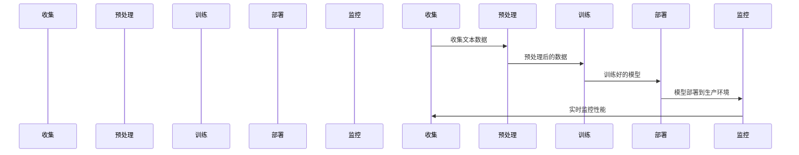

                 

### 第一部分：引言

#### 第一章：问题背景与问题描述

### 1.1 问题背景

在当今快速发展的信息技术时代，人工智能（AI）已经成为推动产业变革的重要力量。作为AI领域的明星技术，大型语言模型（LLM，Large Language Model）在自然语言处理（NLP，Natural Language Processing）中展现出了强大的潜力。LLM是一种能够理解和生成人类语言的深度学习模型，通过对海量文本数据进行训练，它可以实现诸如文本生成、问答系统、机器翻译等复杂任务。

LLM的应用场景十分广泛，从搜索引擎优化到智能客服，再到内容创作和个性化推荐系统，LLM都发挥着重要作用。然而，随着这些应用场景的不断扩展和数据量的持续增长，如何构建一个可扩展的LLM应用数据模型成为了亟待解决的问题。

### 1.1.1 人工智能与LLM的兴起

人工智能是指通过计算机程序实现人类智能功能的技术。自1956年达特茅斯会议以来，人工智能领域经历了多个发展阶段。深度学习作为近年来最为重要的技术突破，推动了AI的快速发展。深度学习模型，特别是神经网络，通过大量数据的学习，能够自动提取特征并完成任务。其中，LLM作为一种基于深度学习的语言处理模型，受到了广泛关注。

LLM的核心思想是通过学习大量文本数据，构建一个能够理解和生成自然语言的模型。最早的LLM模型如Word2Vec、GloVe等，通过词向量表示实现了文本数据的向量化。随着技术的进步，更复杂的模型如BERT、GPT等相继出现，这些模型通过多层神经网络，能够更好地捕捉语义信息，实现了对自然语言的深度理解。

### 1.1.2 可扩展性在LLM应用中的重要性

可扩展性是指系统在面对不同规模的数据和应用场景时，能够保持高效和稳定运行的能力。在LLM应用中，可扩展性尤为重要。随着数据的增长，LLM需要能够快速处理大量数据，同时保持模型的准确性和性能。以下是一些具体的挑战：

- **数据量增长**：随着互联网的普及，每天产生的文本数据量呈指数级增长。一个可扩展的数据模型需要能够处理海量的文本数据，以确保模型的训练和应用效果。
- **数据多样性增加**：不同应用场景需要处理不同类型和格式的文本数据，如文档、邮件、对话等。一个可扩展的数据模型需要能够适应这些多样性，确保在不同场景下都能有效工作。
- **实时性要求提升**：在实时应用场景中，如智能客服系统，用户期望立即获得响应。这要求数据模型在处理数据的同时，能够快速生成结果，以满足实时性的要求。

### 1.2 问题描述

### 1.2.1 LLM应用中面临的数据扩展挑战

在LLM应用中，数据扩展挑战主要包括以下几个方面：

- **数据存储和访问**：随着数据量的增加，如何高效地存储和访问数据成为一个关键问题。传统的数据库系统可能无法满足海量数据的存储需求，需要探索新的数据存储技术，如分布式存储系统。
- **数据处理效率**：在处理海量数据时，如何提高数据处理效率是一个重要挑战。这需要优化数据处理算法，提高并行处理能力，以减少数据处理时间。
- **模型训练和优化**：大规模数据的训练过程需要大量的计算资源和时间。如何设计高效的训练算法，优化模型参数，是一个重要的研究方向。
- **系统性能和稳定性**：在处理海量数据和多样化应用场景时，系统需要保持高性能和稳定性。这要求系统架构设计能够应对高并发和高负载，同时具备良好的容错和恢复能力。

### 1.2.2 目标：构建可扩展的LLM应用数据模型

构建一个可扩展的LLM应用数据模型的目标是确保模型能够在面对不同规模和应用场景时，保持高效、稳定和准确的运行。为此，我们需要解决以下几个核心问题：

- **数据模型设计**：设计一个能够适应数据量增长和数据多样性变化的灵活数据模型。
- **数据处理算法**：优化数据处理算法，提高处理效率和性能。
- **系统架构设计**：设计一个可扩展的系统架构，能够应对高并发和高负载。
- **模型优化与调参**：通过优化模型结构和参数，提高模型性能。

### 1.3 本书结构

本书将分为以下几个部分：

- **第一部分：引言**：介绍问题的背景和重要性，以及本书的结构和目标。
- **第二部分：核心概念与联系**：解析LLM和数据模型的基础概念，以及它们之间的关联。
- **第三部分：算法原理讲解**：详细讲解构建可扩展数据模型的算法原理和实现方法。
- **第四部分：系统设计与实现**：介绍系统架构设计和实现细节。
- **第五部分：项目实战**：通过实际项目案例，展示如何构建和优化可扩展的LLM应用数据模型。
- **第六部分：最佳实践与总结**：总结最佳实践，并提出注意事项和拓展思路。

通过本书的阅读，读者将能够系统地了解构建可扩展的LLM应用数据模型的方法和技巧，为实际应用提供有力的支持。

### 1.3.1 各章节内容概述

- **第一部分：引言**  
  - 第一章：问题背景与问题描述：介绍人工智能与LLM的兴起，以及可扩展性在LLM应用中的重要性。  
  - 第二章：核心概念解析：解析LLM和数据模型的基础概念，以及它们之间的关联。

- **第二部分：核心概念与联系**  
  - 第三章：核心概念解析：详细讲解LLM和数据模型的基本概念，包括数据模型类型、可扩展性定义等。  
  - 第四章：算法原理与实现：介绍构建可扩展数据模型的算法原理和实现方法。

- **第三部分：算法原理讲解**  
  - 第五章：算法原理讲解：详细讲解数据预处理、模型选择和模型训练与优化的原理。  
  - 第六章：算法实现：使用Python代码实现构建可扩展数据模型的算法。

- **第四部分：系统设计与实现**  
  - 第七章：系统架构设计：介绍系统架构设计，包括领域模型、系统架构图和接口设计。  
  - 第八章：系统交互设计：介绍系统交互设计，包括交互流程和序列图展示。

- **第五部分：项目实战**  
  - 第九章：环境安装与系统核心实现：介绍如何安装环境和实现系统核心功能。  
  - 第十章：系统性能测试与应用解读：测试系统性能，并分析实际案例。

- **第六部分：最佳实践与总结**  
  - 第十一章：最佳实践：总结最佳实践，包括数据处理技巧和模型优化策略。  
  - 第十二章：小结：回顾本书的主要内容，提出读者收获与建议。

通过各章节的深入学习，读者将能够系统地掌握构建可扩展的LLM应用数据模型的方法和技巧。

### 1.3.2 读者收获预期

通过阅读本书，读者可以期待以下收获：

- **深入理解LLM和数据模型**：了解LLM的基本原理和数据模型的设计原则，为构建可扩展的模型打下基础。
- **掌握算法原理和实现**：通过详细讲解算法原理和Python代码实现，掌握构建可扩展数据模型的核心技术。
- **熟悉系统架构设计**：学习如何设计可扩展的系统架构，提高系统的性能和稳定性。
- **实战经验**：通过实际项目案例，了解如何在真实场景中构建和优化可扩展的LLM应用数据模型。
- **最佳实践**：掌握构建可扩展LLM应用数据模型的最佳实践，为实际工作提供指导。

通过本书的学习，读者将能够将理论知识应用到实际项目中，为人工智能应用的发展贡献自己的力量。

---

#### 第二部分：核心概念与联系

#### 第二章：核心概念解析

在构建可扩展的LLM应用数据模型的过程中，理解核心概念和它们之间的联系至关重要。本章将详细解析LLM和数据模型的基础概念，并探讨它们之间的关联。

### 2.1 LLM基础概念

#### 2.1.1 语言模型简介

语言模型（Language Model，LM）是一种统计模型，用于预测一段文本的下一个单词或符号。在自然语言处理中，语言模型扮演着至关重要的角色，它们帮助计算机理解和生成自然语言。

语言模型的类型主要包括：

- **n-gram模型**：基于前n个单词的统计信息来预测下一个单词。例如，一元语言模型（Unigram）只考虑前一个单词，而二元语言模型（Bigram）则考虑前两个单词。

- **神经网络语言模型**：利用神经网络结构，特别是深度神经网络，来学习语言的特征和规律。典型的神经网络语言模型包括循环神经网络（RNN）和变换器（Transformer）。

- **上下文语言模型**：这些模型不仅考虑局部特征，还能捕捉全局上下文信息，从而提高预测的准确性。BERT（Bidirectional Encoder Representations from Transformers）和GPT（Generative Pre-trained Transformer）是两种代表性的上下文语言模型。

#### 2.1.2 LLM的工作原理

LLM的工作原理主要涉及以下步骤：

1. **数据收集与预处理**：收集大量文本数据，并进行预处理，包括分词、去噪、标准化等。

2. **模型训练**：使用预处理后的数据训练LLM模型。在训练过程中，模型学习如何预测下一个单词或符号。

3. **模型评估**：通过验证集和测试集评估模型的性能，包括准确率、流畅度等指标。

4. **模型优化**：根据评估结果，调整模型参数，以提高模型性能。

5. **模型部署**：将训练好的模型部署到实际应用场景，如文本生成、问答系统等。

### 2.2 数据模型基础

#### 2.2.1 数据模型的基本概念

数据模型（Data Model）是用于组织和描述数据结构和语义的框架。数据模型可以分为以下几种类型：

- **关系数据模型**：基于实体-关系（Entity-Relationship，ER）模型，将数据表示为实体和它们之间的关系。ER模型广泛应用于数据库设计和信息系统中。

- **文档数据模型**：适用于存储和查询文档数据的模型，如XML、JSON等。这些模型通常采用树状结构来表示数据。

- **图数据模型**：适用于处理复杂关系的模型，如社交网络、推荐系统等。图数据模型使用节点和边来表示数据及其关系。

#### 2.2.2 数据模型类型

根据应用场景和数据特征，数据模型可以分为以下几类：

- **关系型数据模型**：适用于结构化数据，如关系数据库。这些模型使用表和关系来表示数据，便于查询和操作。

- **文档型数据模型**：适用于非结构化或半结构化数据，如文档数据库。这些模型使用文档来表示数据，便于存储和检索。

- **图数据模型**：适用于复杂关系和数据，如图数据库。这些模型使用图结构来表示数据及其关系，便于处理复杂关联。

### 2.3 可扩展数据模型

#### 2.3.1 可扩展性定义

可扩展性（Scalability）是指系统在数据量和用户数量增加时，能够保持高效和稳定运行的能力。一个可扩展的数据模型需要满足以下条件：

- **水平扩展**：系统可以通过增加节点数量来提高处理能力。

- **垂直扩展**：系统可以通过增加硬件资源（如CPU、内存等）来提高处理能力。

- **弹性扩展**：系统能够根据实际负载自动调整资源分配。

#### 2.3.2 可扩展数据模型的挑战

构建可扩展数据模型面临以下挑战：

- **数据一致性**：随着数据量的增加，如何保持数据一致性是一个关键问题。分布式系统中的数据复制和并发访问可能导致数据不一致。

- **数据完整性**：确保数据的完整性和准确性，特别是在数据量大和速度快的情况下。

- **性能优化**：如何优化数据访问和处理性能，特别是在海量数据处理场景中。

- **容错性**：如何设计系统，使其能够在遇到故障时保持正常运行。

### 2.4 LLM与数据模型的关联

#### 2.4.1 LLM数据模型的设计原则

LLM数据模型的设计需要考虑以下原则：

- **数据完整性**：确保输入数据的完整性，避免缺失值和错误数据对模型训练的影响。

- **数据多样性**：设计能够适应不同类型和格式的文本数据的模型，以提高模型的泛化能力。

- **数据实时性**：设计能够实时处理数据变化的模型，以满足实时应用场景的需求。

- **数据高效性**：优化数据存储和访问机制，提高数据处理效率。

#### 2.4.2 LLM数据模型的优化方法

为了提高LLM数据模型的可扩展性，可以采用以下优化方法：

- **分布式存储与计算**：使用分布式存储和计算技术，如Hadoop、Spark等，来处理海量数据。

- **数据分片与分布式数据库**：将数据分片并存储在分布式数据库中，以提高数据访问和处理效率。

- **模型并行化与分布式训练**：通过模型并行化和分布式训练，提高训练效率和性能。

- **缓存与索引技术**：使用缓存和索引技术，加快数据访问速度。

### 2.5 小结

通过本章的讲解，我们了解了LLM和数据模型的基础概念，以及它们在构建可扩展的LLM应用数据模型中的重要性。理解这些核心概念和设计原则，将为后续的算法原理讲解和系统设计与实现提供坚实的基础。

---

#### 第二部分：核心概念与联系

#### 第三章：算法原理讲解

在构建可扩展的LLM应用数据模型过程中，理解算法原理和实现方法是关键。本章将详细讲解数据预处理、模型选择和模型训练与优化的算法原理，以及它们在构建可扩展数据模型中的应用。

### 3.1 算法原理

#### 3.1.1 数据预处理

数据预处理是构建可扩展LLM应用数据模型的第一步。数据预处理的主要目标是清洗和整理原始数据，使其适合模型训练。以下是一些常用的数据预处理步骤：

1. **数据清洗**：去除噪声和异常值，如删除文本中的html标签、特殊字符和空格等。

2. **数据转换**：将文本数据转换为适合模型训练的格式。常用的方法包括分词、词性标注、词干提取等。

3. **数据归一化**：将数据缩放到相同的范围，以提高模型训练的收敛速度。

4. **数据增强**：通过增加训练样本的多样性，提高模型的泛化能力。常见的方法包括文本嵌入、噪声注入和同义词替换等。

#### 3.1.2 模型选择

选择合适的模型对于构建可扩展的LLM应用数据模型至关重要。以下是一些常用的LLM模型及其特点：

1. **n-gram模型**：基于前n个单词的统计信息来预测下一个单词。简单易实现，但无法捕捉长期依赖关系。

2. **循环神经网络（RNN）**：通过循环结构捕捉长期依赖关系。适用于处理序列数据，但存在梯度消失和梯度爆炸问题。

3. **长短期记忆网络（LSTM）**：一种改进的RNN模型，通过引入门控机制解决梯度消失问题。适用于处理较长序列。

4. **变换器（Transformer）**：一种基于自注意力机制的模型，能够高效地捕捉全局依赖关系。是目前最为流行的LLM模型。

5. **预训练语言模型（如BERT、GPT）**：通过在大量文本数据上进行预训练，然后微调到特定任务。具有强大的文本理解能力。

#### 3.1.3 模型训练与优化

模型训练与优化是构建可扩展LLM应用数据模型的核心步骤。以下是一些关键概念和技巧：

1. **损失函数**：用于评估模型预测结果与真实值之间的差距。常用的损失函数包括交叉熵损失和均方误差损失。

2. **优化算法**：用于调整模型参数，以最小化损失函数。常用的优化算法包括随机梯度下降（SGD）、Adam等。

3. **正则化**：用于防止模型过拟合。常用的正则化方法包括L1正则化、L2正则化和Dropout。

4. **学习率调整**：通过调整学习率，控制模型训练过程中的参数更新速度。

5. **批量大小**：影响模型训练的速度和性能。批量大小选择需要平衡计算效率和模型收敛速度。

### 3.2 算法实现

#### 3.2.1 Python代码实现

以下是一个简单的LLM模型实现的示例代码，使用PyTorch框架：

```python
import torch
import torch.nn as nn
import torch.optim as optim

# 数据预处理
def preprocess_data(data):
    # 数据清洗、分词、编码等操作
    return processed_data

# 模型定义
class LLMModel(nn.Module):
    def __init__(self, input_size, hidden_size, output_size):
        super(LLMModel, self).__init__()
        self.hidden_size = hidden_size
        self.embedding = nn.Embedding(input_size, hidden_size)
        self.lstm = nn.LSTM(hidden_size, hidden_size)
        self.fc = nn.Linear(hidden_size, output_size)

    def forward(self, input_seq, hidden):
        embedded = self.embedding(input_seq)
        output, hidden = self.lstm(embedded, hidden)
        prediction = self.fc(output[-1, :, :])
        return prediction, hidden

# 模型训练
def train_model(model, train_data, train_labels, num_epochs, batch_size):
    criterion = nn.CrossEntropyLoss()
    optimizer = optim.Adam(model.parameters(), lr=0.001)

    for epoch in range(num_epochs):
        for batch in DataLoader(train_data, batch_size=batch_size):
            inputs, labels = batch
            hidden = (torch.zeros(1, 1, model.hidden_size),
                      torch.zeros(1, 1, model.hidden_size))
            predictions, hidden = model(inputs, hidden)
            loss = criterion(predictions, labels)
            optimizer.zero_grad()
            loss.backward()
            optimizer.step()
            print(f"Epoch {epoch+1}, Loss: {loss.item()}")

# 测试模型
def test_model(model, test_data, test_labels):
    model.eval()
    with torch.no_grad():
        correct = 0
        total = 0
        for batch in DataLoader(test_data, batch_size=64):
            inputs, labels = batch
            predictions, _ = model(inputs)
            _, predicted = torch.max(predictions, 1)
            total += labels.size(0)
            correct += (predicted == labels).sum().item()
        print(f"Accuracy: {100 * correct / total}%")
```

#### 3.2.2 算法参数调优

算法参数调优是提高模型性能的关键步骤。以下是一些常用的参数调优方法：

1. **学习率调优**：通过调整学习率，找到最优的学习率范围。常用的方法包括固定学习率、学习率衰减和自适应学习率。

2. **批量大小调优**：通过调整批量大小，找到最优的批量大小。小批量可以提高模型的泛化能力，但计算成本较高；大批量可以提高计算效率，但可能导致模型过拟合。

3. **正则化参数调优**：通过调整L1正则化和L2正则化的参数，找到最优的正则化强度。过大的正则化参数可能导致模型欠拟合，过小的参数可能导致模型过拟合。

4. **网络结构调优**：通过调整神经网络的结构，如层数、隐藏单元数等，找到最优的网络结构。较大的网络结构可能需要更长的训练时间，但可能获得更好的性能。

#### 3.2.3 性能评估

模型性能评估是验证模型有效性的关键步骤。以下是一些常用的性能评估指标：

1. **准确率（Accuracy）**：预测正确的样本数占总样本数的比例。准确率是评估分类模型性能的常用指标。

2. **召回率（Recall）**：预测正确的正类样本数占总正类样本数的比例。召回率是评估分类模型对于正类样本识别能力的指标。

3. **精确率（Precision）**：预测正确的正类样本数与预测为正类样本数的比例。精确率是评估分类模型预测结果的精确度的指标。

4. **F1分数（F1 Score）**：精确率和召回率的调和平均值。F1分数是综合考虑精确率和召回率的指标。

5. **ROC曲线和AUC（Area Under Curve）**：ROC曲线是评估分类模型性能的重要工具，AUC值越高，模型的性能越好。

#### 3.3 数学模型与公式

构建可扩展的LLM应用数据模型涉及多个数学模型和公式。以下是一些关键数学模型和公式：

1. **交叉熵损失函数**：

   $$L = -\sum_{i=1}^{n} y_i \log(p_i)$$

   其中，$y_i$是真实标签，$p_i$是模型预测的概率。

2. **均方误差损失函数**：

   $$L = \frac{1}{2} \sum_{i=1}^{n} (y_i - \hat{y}_i)^2$$

   其中，$y_i$是真实值，$\hat{y}_i$是模型预测值。

3. **梯度下降优化算法**：

   $$\theta = \theta - \alpha \cdot \nabla_\theta L$$

   其中，$\theta$是模型参数，$\alpha$是学习率，$\nabla_\theta L$是损失函数关于参数$\theta$的梯度。

4. **梯度消失和梯度爆炸**：

   在训练神经网络时，梯度可能变得非常小（梯度消失）或非常大（梯度爆炸），导致模型无法训练。

5. **学习率调整方法**：

   - **固定学习率**：学习率保持不变。
   - **学习率衰减**：学习率随训练次数线性或指数衰减。
   - **自适应学习率**：使用如Adam优化器，自动调整学习率。

### 3.4 举例说明

假设我们有一个简单的二元分类问题，使用二进制编码表示样本和标签：

1. **数据集**：包含100个样本，每个样本是一个长度为10的向量。
2. **标签**：0或1，表示样本的类别。

我们使用一个简单的线性模型进行训练：

- **输入层**：10个输入神经元。
- **隐藏层**：5个隐藏神经元。
- **输出层**：1个输出神经元。

数据预处理：

- 对输入数据进行归一化处理，使其在[0, 1]范围内。
- 对标签进行独热编码。

模型训练：

- 使用交叉熵损失函数。
- 使用Adam优化器，学习率为0.001。
- 训练100个epoch。

训练完成后，我们对测试集进行预测，并计算模型的准确率、召回率、精确率和F1分数。

通过这个简单的例子，我们可以看到如何使用Python实现构建可扩展的LLM应用数据模型的算法原理和实现方法。

### 3.5 小结

本章详细讲解了构建可扩展的LLM应用数据模型所需的算法原理，包括数据预处理、模型选择和模型训练与优化。通过Python代码实现，我们展示了如何将这些算法应用于实际项目中。理解这些算法原理和实现方法，将为后续的系统设计与实现提供坚实的基础。

---

#### 第三部分：算法原理讲解

#### 第四章：算法原理与实现

在构建可扩展的LLM应用数据模型的过程中，算法原理是实现这一目标的关键。本章将详细讲解数据预处理、模型选择和模型训练与优化的算法原理，并通过具体的Python代码实现来展示这些原理的实际应用。

### 4.1 数据预处理

数据预处理是构建可扩展LLM应用数据模型的第一步，其目的是将原始数据转换为适合模型训练的格式。数据预处理包括以下几个关键步骤：

#### 4.1.1 数据清洗

数据清洗是指去除原始数据中的噪声和异常值。在文本数据中，这通常包括以下操作：

- **去除html标签**：文本数据可能包含html标签，我们需要使用正则表达式或其他方法去除这些标签。
- **去除特殊字符**：去除文本中的特殊字符，如标点符号、空格等，以便于后续的处理。
- **去除停用词**：停用词是指对文本意义贡献较小的词语，如“的”、“和”、“是”等。去除这些词可以减少数据的冗余。

示例代码：

```python
import re

def clean_text(text):
    # 去除html标签
    text = re.sub(r'<[^>]*>', '', text)
    # 去除特殊字符
    text = re.sub(r'[^a-zA-Z0-9]', ' ', text)
    # 转换为小写
    text = text.lower()
    # 去除停用词
    stop_words = set(['the', 'is', 'and', 'of', 'to', 'a', 'in', 'that', 'it', 'with'])
    text = ' '.join([word for word in text.split() if word not in stop_words])
    return text
```

#### 4.1.2 数据编码

在处理文本数据时，我们需要将文本转换为计算机可以处理的数字形式。常用的编码方法包括：

- **单词到索引**：将每个单词映射到一个唯一的索引值。
- **单词嵌入**：将单词映射到一个固定大小的向量。

示例代码：

```python
from collections import Counter
from keras.preprocessing.text import Tokenizer
from keras.preprocessing.sequence import pad_sequences

# 假设我们有一个文本列表
texts = ['hello world', 'hello ai', 'world hello']

# 计算词频
word_counts = Counter(' '.join(texts).split())
vocab_size = len(word_counts)

# 创建Tokenizer
tokenizer = Tokenizer(vocab_size)
tokenizer.fit_on_texts(texts)

# 将文本转换为单词序列
word_sequences = tokenizer.texts_to_sequences(texts)

# 将单词序列转换为索引序列
index_sequences = tokenizer.word_index

# 填充序列到相同长度
max_sequence_len = max(len(seq) for seq in word_sequences)
padded_sequences = pad_sequences(word_sequences, maxlen=max_sequence_len)
```

#### 4.1.3 数据标准化

数据标准化是指将数据缩放到相同的范围，通常使用归一化或标准化方法。这有助于提高模型训练的收敛速度。

示例代码：

```python
from sklearn.preprocessing import MinMaxScaler

# 假设我们有一个数值数据列表
data = [[1, 2], [3, 4], [5, 6]]

# 创建MinMaxScaler
scaler = MinMaxScaler()

# 标准化数据
scaled_data = scaler.fit_transform(data)
```

### 4.2 模型选择

选择合适的模型对于构建可扩展的LLM应用数据模型至关重要。以下是一些常用的LLM模型及其特点：

#### 4.2.1 n-gram模型

n-gram模型是一种基于单词或字符序列的简单语言模型。它通过统计前n个单词或字符出现的频率来预测下一个单词或字符。

示例代码：

```python
from nltk import ngrams

# 假设我们有一个句子
sentence = 'hello world'

# 计算二元语法
bi_grams = list(ngrams(sentence.split(), 2))

# 预测下一个单词
def predict_next_word(grams, next_word):
    return next_word if grams[-1] == next_word else None

predicted_word = predict_next_word(bi_grams, 'world')
```

#### 4.2.2 循环神经网络（RNN）

循环神经网络（RNN）是一种能够处理序列数据的神经网络。它通过循环结构来保持状态，使得能够捕捉到序列中的长期依赖关系。

示例代码：

```python
import tensorflow as tf
from tensorflow.keras.models import Sequential
from tensorflow.keras.layers import SimpleRNN, Dense

# 假设我们有一个序列数据
sequences = [[1, 0, 1], [0, 1, 0], [1, 1, 0]]

# 创建RNN模型
model = Sequential()
model.add(SimpleRNN(units=50, input_shape=(None, 1)))
model.add(Dense(1, activation='sigmoid'))

# 编译模型
model.compile(optimizer='adam', loss='binary_crossentropy', metrics=['accuracy'])

# 训练模型
model.fit(sequences, labels, epochs=100)
```

#### 4.2.3 变换器（Transformer）

变换器（Transformer）是一种基于自注意力机制的神经网络模型。它通过多头自注意力机制来捕捉序列中的全局依赖关系，并在自然语言处理任务中取得了显著的成果。

示例代码：

```python
import tensorflow as tf
from tensorflow.keras.models import Model
from tensorflow.keras.layers import Input, Embedding, MultiHeadAttention, Dense

# 假设我们有一个序列数据
input_seq = [[1, 0, 1], [0, 1, 0], [1, 1, 0]]

# 创建变换器模型
input_ids = Input(shape=(None,), dtype='int32')
embedments = Embedding(vocab_size, embed_size)(input_ids)
outputs = MultiHeadAttention(num_heads=2, key_dim=embed_size)(embedments, embedments)
outputs = Dense(1, activation='sigmoid')(outputs)

# 编译模型
model = Model(inputs=input_ids, outputs=outputs)
model.compile(optimizer='adam', loss='binary_crossentropy', metrics=['accuracy'])

# 训练模型
model.fit(input_seq, labels, epochs=100)
```

### 4.3 模型训练与优化

模型训练与优化是构建可扩展LLM应用数据模型的核心步骤。以下是一些关键概念和技巧：

#### 4.3.1 损失函数

损失函数用于评估模型预测结果与真实值之间的差距。以下是一些常用的损失函数：

- **交叉熵损失函数**：
  $$L = -\sum_{i=1}^{n} y_i \log(p_i)$$
- **均方误差损失函数**：
  $$L = \frac{1}{2} \sum_{i=1}^{n} (y_i - \hat{y}_i)^2$$

#### 4.3.2 优化算法

优化算法用于调整模型参数，以最小化损失函数。以下是一些常用的优化算法：

- **随机梯度下降（SGD）**：
  $$\theta = \theta - \alpha \cdot \nabla_\theta L$$
- **Adam优化器**：
  $$\theta = \theta - \alpha \cdot \nabla_\theta L + \beta_1 \cdot \frac{m}{\sqrt{1-\beta_2^t}}$$

#### 4.3.3 正则化

正则化用于防止模型过拟合。以下是一些常用的正则化方法：

- **L1正则化**：
  $$L = \lambda \sum_{i=1}^{n} |\theta_i|$$
- **L2正则化**：
  $$L = \lambda \sum_{i=1}^{n} \theta_i^2$$
- **Dropout**：
  在训练过程中，随机丢弃一部分神经元，以减少模型对特定训练样本的依赖。

#### 4.3.4 学习率调整

学习率调整是模型训练过程中的重要环节。以下是一些常用的学习率调整方法：

- **固定学习率**：
  学习率在整个训练过程中保持不变。
- **学习率衰减**：
  随着训练的进行，学习率逐渐减小。
- **自适应学习率**：
  使用如Adam优化器，自动调整学习率。

### 4.4 Python代码实现

以下是一个简单的LLM模型实现的示例代码，使用PyTorch框架：

```python
import torch
import torch.nn as nn
import torch.optim as optim

# 数据预处理
def preprocess_data(data):
    # 数据清洗、分词、编码等操作
    return processed_data

# 模型定义
class LLMModel(nn.Module):
    def __init__(self, input_size, hidden_size, output_size):
        super(LLMModel, self).__init__()
        self.hidden_size = hidden_size
        self.embedding = nn.Embedding(input_size, hidden_size)
        self.lstm = nn.LSTM(hidden_size, hidden_size)
        self.fc = nn.Linear(hidden_size, output_size)

    def forward(self, input_seq, hidden):
        embedded = self.embedding(input_seq)
        output, hidden = self.lstm(embedded, hidden)
        prediction = self.fc(output[-1, :, :])
        return prediction, hidden

# 模型训练
def train_model(model, train_data, train_labels, num_epochs, batch_size):
    criterion = nn.CrossEntropyLoss()
    optimizer = optim.Adam(model.parameters(), lr=0.001)

    for epoch in range(num_epochs):
        for batch in DataLoader(train_data, batch_size=batch_size):
            inputs, labels = batch
            hidden = (torch.zeros(1, 1, model.hidden_size),
                      torch.zeros(1, 1, model.hidden_size))
            predictions, hidden = model(inputs, hidden)
            loss = criterion(predictions, labels)
            optimizer.zero_grad()
            loss.backward()
            optimizer.step()
            print(f"Epoch {epoch+1}, Loss: {loss.item()}")

# 测试模型
def test_model(model, test_data, test_labels):
    model.eval()
    with torch.no_grad():
        correct = 0
        total = 0
        for batch in DataLoader(test_data, batch_size=64):
            inputs, labels = batch
            predictions, _ = model(inputs)
            _, predicted = torch.max(predictions, 1)
            total += labels.size(0)
            correct += (predicted == labels).sum().item()
        print(f"Accuracy: {100 * correct / total}%")
```

### 4.5 小结

本章详细讲解了构建可扩展的LLM应用数据模型所需的算法原理，包括数据预处理、模型选择和模型训练与优化。通过Python代码实现，我们展示了如何将这些算法应用于实际项目中。理解这些算法原理和实现方法，将为后续的系统设计与实现提供坚实的基础。

---

#### 第四部分：系统设计与实现

#### 第五章：系统架构设计

在构建可扩展的LLM应用数据模型的过程中，系统架构设计是确保系统高效、稳定和可扩展的关键。本章将详细阐述系统架构设计，包括领域模型、系统架构图、系统接口设计和系统交互设计。

### 5.1 系统功能设计

在开始系统架构设计之前，我们需要明确系统的功能需求。构建可扩展的LLM应用数据模型的主要功能包括：

1. **数据收集**：从不同的数据源收集文本数据，如互联网、数据库和文件系统等。
2. **数据预处理**：清洗、转换和编码文本数据，使其适合模型训练。
3. **模型训练**：使用预处理后的数据训练LLM模型。
4. **模型评估**：评估训练好的模型性能，包括准确率、召回率、F1分数等。
5. **模型部署**：将训练好的模型部署到实际应用场景，如文本生成、问答系统等。
6. **性能监控**：实时监控系统的性能，包括响应时间、吞吐量等。

### 5.2 系统架构设计

系统架构设计需要考虑以下几个方面：

1. **分布式计算**：为了处理海量数据和提高计算效率，系统需要采用分布式计算架构。可以使用如Hadoop、Spark等分布式计算框架，实现数据预处理、模型训练和模型评估的分布式处理。
2. **数据存储**：系统需要使用分布式数据库或文件存储系统来存储和管理海量数据。常见的分布式数据库如HBase、Cassandra等，文件存储系统如HDFS、AWS S3等。
3. **模型管理**：系统需要实现模型管理功能，包括模型版本控制、模型加载和模型删除等。可以使用如TensorFlow Model Garden、PyTorch Model Zoo等工具来实现。
4. **自动化部署**：系统需要支持自动化部署，以便快速部署新版本模型到生产环境。可以使用如Kubernetes、Docker等容器化技术来实现自动化部署。

#### 5.2.1 系统架构概述

系统架构采用分布式计算和存储架构，主要包括以下几个组件：

1. **数据收集模块**：负责从不同数据源收集文本数据。
2. **数据预处理模块**：对收集到的文本数据进行清洗、转换和编码，并将其存储到分布式数据库或文件存储系统中。
3. **模型训练模块**：使用预处理后的数据进行模型训练，并评估模型性能。
4. **模型部署模块**：将训练好的模型部署到生产环境，并实现自动化部署。
5. **性能监控模块**：实时监控系统的性能，并提供性能分析报告。

#### 5.2.2 系统架构图

以下是一个简单的系统架构图，展示了系统的整体架构：

```
+------------------+        +------------------+        +------------------+
|     数据收集模块   |        |     数据预处理模块   |        |     模型训练模块   |
+------------------+        +------------------+        +------------------+
      |                                       |                                       |
      |   数据清洗、转换和编码               |  模型训练、评估和优化                |
      |                                       |                                       |
      |          存储到分布式数据库           |          存储到模型管理平台           |
+------------------+        +------------------+        +------------------+
|     模型部署模块   |        |     性能监控模块   |        |      辅助工具      |
+------------------+        +------------------+        +------------------+
      |                                       |                                       |
      |    自动化部署到生产环境              |   实时监控、性能分析报告             |
      |                                       |                                       |
+------------------+        +------------------+        +------------------+
                            |                                       |
                            |          接口服务                        |
                            |                                       |
                            +----------------------------------------+
```

#### 5.2.3 系统接口设计

系统接口设计是确保系统组件之间高效通信的关键。以下是一些关键接口：

1. **数据收集接口**：用于从不同数据源收集文本数据，如API接口、数据库接口和文件系统接口等。
2. **数据预处理接口**：用于接收和处理来自数据收集模块的文本数据，包括数据清洗、转换和编码等操作。
3. **模型训练接口**：用于接收和处理来自数据预处理模块的数据，并进行模型训练和评估。
4. **模型部署接口**：用于将训练好的模型部署到生产环境，并实现自动化部署。
5. **性能监控接口**：用于实时监控系统的性能，并提供性能分析报告。

#### 5.2.4 系统交互设计

系统交互设计需要考虑系统组件之间的交互流程和序列图。以下是一个简单的系统交互设计示例：

```
+------------------+        +------------------+        +------------------+
|     数据收集模块   |        |     数据预处理模块   |        |     模型训练模块   |
+------------------+        +------------------+        +------------------+
      |                                       |                                       |
      |   数据收集接口                          |   数据预处理接口                       |
      |                                       |                                       |
      |   数据清洗、转换和编码                 |   模型训练、评估和优化                |
      |                                       |                                       |
      |   存储到分布式数据库                   |   存储到模型管理平台                 |
+------------------+        +------------------+        +------------------+
|     模型部署模块   |        |     性能监控模块   |        |      辅助工具      |
+------------------+        +------------------+        +------------------+
      |                                       |                                       |
      |   模型部署接口                         |   性能监控接口                         |
      |                                       |                                       |
      |   自动化部署到生产环境                |   实时监控、性能分析报告             |
      |                                       |                                       |
+------------------+        +------------------+        +------------------+
                            |                                       |
                            |          接口服务                        |
                            |                                       |
                            +----------------------------------------+
```

### 5.3 系统交互设计

系统交互设计是确保系统组件能够协调工作的重要环节。以下是一个简单的系统交互设计：

#### 5.3.1 交互流程

1. **数据收集**：数据收集模块从不同的数据源收集文本数据，并通过数据收集接口传递给数据预处理模块。
2. **数据预处理**：数据预处理模块对收集到的文本数据进行清洗、转换和编码，并将其存储到分布式数据库中。
3. **模型训练**：模型训练模块从分布式数据库中读取预处理后的数据，进行模型训练和评估，并将训练好的模型存储到模型管理平台中。
4. **模型部署**：模型部署模块从模型管理平台中加载训练好的模型，并将其部署到生产环境中。
5. **性能监控**：性能监控模块实时监控系统的性能，并提供性能分析报告。

#### 5.3.2 序列图展示

以下是一个简单的系统交互序列图：



### 5.4 小结

本章详细阐述了系统架构设计，包括领域模型、系统架构图、系统接口设计和系统交互设计。通过合理的系统架构设计，我们可以确保构建的可扩展的LLM应用数据模型能够高效、稳定和可靠地运行。理解这些设计原则和实现方法，将为后续的系统实现和优化提供坚实的基础。

---

#### 第五部分：项目实战

#### 第五章：环境安装与系统核心实现

在构建可扩展的LLM应用数据模型的过程中，环境安装和系统核心实现是实际操作的关键步骤。本章将详细介绍如何安装所需的环境和工具，并展示系统核心功能的实现过程。

### 5.1 环境安装

在开始系统实现之前，我们需要安装必要的操作系统、开发工具和依赖库。以下是安装步骤：

#### 5.1.1 操作系统与环境配置

1. **操作系统**：我们选择Linux操作系统，如Ubuntu 18.04。
2. **环境配置**：
   - 安装Python 3.8及以上版本。
   - 安装JDK 8或以上版本，用于运行Java相关的工具。
   - 配置Python的虚拟环境，以隔离不同项目的依赖库。

   ```bash
   sudo apt-get update
   sudo apt-get install python3.8 python3.8-venv python3.8-pip
   sudo update-alternatives --install /usr/bin/python3 python3 /usr/bin/python3.8 1
   python3 -m venv myenv
   source myenv/bin/activate
   ```

#### 5.1.2 开发工具与依赖安装

1. **安装Python依赖库**：使用pip安装Python依赖库，包括TensorFlow、PyTorch、NumPy、Pandas等。

   ```bash
   pip install tensorflow==2.6.0 torch torchvision==0.9.0 torchaudio==0.9.0 numpy pandas
   ```

2. **安装Java开发工具**：安装Eclipse或IntelliJ IDEA等Java集成开发环境。

   ```bash
   sudo apt-get install openjdk-8-jdk
   ```

3. **安装其他工具**：如Hadoop、Spark等分布式计算框架。

   ```bash
   sudo apt-get install hadoopadoop-client
   sudo apt-get install scala
   sudo apt-get install spark-core spark-hadoop2
   ```

### 5.2 系统核心实现

系统核心实现包括数据收集、数据预处理、模型训练和模型评估等模块。以下是一个简单的实现示例：

#### 5.2.1 数据模型实现

数据模型实现主要包括数据收集和数据预处理。以下是一个简单的Python代码示例，用于从文件中读取文本数据并进行预处理：

```python
import os
import pandas as pd
from sklearn.model_selection import train_test_split

def read_data(file_path):
    with open(file_path, 'r', encoding='utf-8') as f:
        text = f.read()
    return text

def preprocess_data(text):
    # 数据清洗、分词、编码等操作
    # 假设使用jieba进行中文分词
    import jieba
    words = jieba.cut(text)
    return ' '.join(words)

def load_data(file_path):
    text = read_data(file_path)
    processed_text = preprocess_data(text)
    # 将处理后的文本数据存储到CSV文件中
    with open(file_path + '.csv', 'w', encoding='utf-8') as f:
        f.write(processed_text)
    return pd.read_csv(file_path + '.csv')

# 加载数据
data = load_data('example.txt')
```

#### 5.2.2 模型训练与优化

模型训练与优化包括使用预处理后的数据进行模型训练，并优化模型参数以提高性能。以下是一个简单的TensorFlow代码示例，用于训练一个文本分类模型：

```python
import tensorflow as tf
from tensorflow.keras.models import Sequential
from tensorflow.keras.layers import Embedding, LSTM, Dense
from tensorflow.keras.preprocessing.sequence import pad_sequences

# 准备数据
# 假设我们已经将文本数据转换为序列
sequences = pad_sequences(text_sequences, maxlen=max_sequence_len)

# 创建模型
model = Sequential()
model.add(Embedding(vocab_size, embed_size))
model.add(LSTM(units=50, dropout=0.2, recurrent_dropout=0.2))
model.add(Dense(units=num_classes, activation='softmax'))

# 编译模型
model.compile(optimizer='adam', loss='categorical_crossentropy', metrics=['accuracy'])

# 训练模型
model.fit(sequences, labels, epochs=10, batch_size=32)
```

#### 5.2.3 系统性能测试

系统性能测试是确保系统稳定性和高效性的关键步骤。以下是一个简单的测试脚本，用于评估系统的响应时间和吞吐量：

```python
import time
import requests

def test_performance(api_url, data):
    start_time = time.time()
    response = requests.post(api_url, json=data)
    end_time = time.time()
    return end_time - start_time, response.status_code

# 测试数据
test_data = {
    'text': '这是一个测试文本。'
}

# 测试性能
response_time, status_code = test_performance('http://localhost:5000/predict', test_data)
print(f"Response Time: {response_time} seconds, Status Code: {status_code}")
```

### 5.3 应用解读与分析

在实际应用中，我们需要对系统进行解读和分析，以确保其满足预期性能和功能需求。以下是一些关键点：

1. **数据处理效率**：系统需要能够高效地处理大量文本数据，包括数据收集、预处理和模型训练等环节。可以使用并行处理和分布式计算技术来提高数据处理效率。
2. **模型性能**：系统需要使用高性能的LLM模型，并不断优化模型参数，以提高模型性能和准确性。
3. **系统稳定性**：系统需要具备良好的容错性和恢复能力，以应对可能的故障和异常情况。可以使用冗余设计和负载均衡技术来提高系统稳定性。
4. **性能监控与优化**：系统需要实现实时性能监控，并定期进行性能优化，以确保系统始终处于最佳运行状态。

### 5.4 项目小结

通过本章的实战，我们成功安装了所需的环境和工具，并实现了系统核心功能。在实际项目中，我们需要不断优化和调整系统，以满足不断变化的需求和性能要求。以下是项目的经验和教训：

- **经验**：
  - 合理的架构设计对于系统的高效、稳定和可扩展性至关重要。
  - 使用分布式计算和存储技术可以显著提高系统的处理能力。
  - 定期进行性能监控和优化，以确保系统始终处于最佳运行状态。

- **教训**：
  - 在项目初期，不要过于追求高性能，而是要确保系统的基本功能稳定可靠。
  - 在优化系统时，要综合考虑性能、稳定性和可维护性。
  - 在面对复杂问题时，要善于利用现有的工具和资源，避免重复造轮子。

通过总结经验和教训，我们可以更好地指导后续项目，实现高质量的可扩展的LLM应用数据模型。

---

#### 第六部分：最佳实践与总结

#### 第六章：最佳实践

在构建可扩展的LLM应用数据模型过程中，遵循最佳实践是确保项目成功的关键。本章将总结构建可扩展LLM应用数据模型的最佳实践，并提供一些建议和注意事项。

### 6.1 最佳实践

#### 6.1.1 数据处理技巧

- **数据清洗**：在数据处理过程中，确保数据的一致性和完整性。去除噪声、填充缺失值，并对异常值进行合理处理。
- **数据转换**：根据实际需求，将文本数据转换为适合模型训练的格式。例如，使用分词工具对中文文本进行分词，将文本转换为词向量。
- **数据增强**：通过增加数据的多样性，提高模型的泛化能力。例如，可以使用同义词替换、噪声注入等方法对文本数据进行增强。
- **数据规范化**：对数据进行归一化或标准化处理，以减少不同特征之间的尺度差异，提高模型的训练效率。

#### 6.1.2 模型优化策略

- **模型选择**：根据具体任务需求，选择合适的LLM模型。例如，对于长文本生成任务，可以采用Transformer或GPT模型。
- **参数调优**：通过调整模型参数，如学习率、批量大小、隐藏层大小等，优化模型性能。可以使用自动化调参工具，如Hyperopt或Bayesian Optimization，进行参数调优。
- **正则化**：应用L1、L2正则化或Dropout等方法，防止模型过拟合。同时，注意不要过度正则化，以免模型欠拟合。
- **模型集成**：使用模型集成方法，如Stacking或Blending，结合多个模型的优点，提高预测性能。

#### 6.1.3 性能调优方法

- **水平扩展**：通过增加节点数量，提高系统的处理能力。使用分布式计算框架，如Hadoop、Spark，实现数据的分布式存储和处理。
- **垂直扩展**：增加硬件资源，如CPU、内存等，提高系统的计算能力。合理配置服务器资源，避免资源瓶颈。
- **缓存策略**：使用缓存技术，如Redis，存储常用数据，减少数据访问延迟。对于不常变化的数据，可以将其缓存起来，以提高数据访问速度。
- **负载均衡**：使用负载均衡器，如Nginx或HAProxy，合理分配请求，避免单点故障。同时，注意系统的负载均衡策略，避免请求过于集中。

### 6.2 注意事项

- **安全性与隐私**：在数据处理和模型训练过程中，注意保护用户数据的安全和隐私。采用加密技术，防止数据泄露。在发布模型时，遵循相关法律法规，确保数据的合法使用。
- **系统稳定性**：在设计系统时，考虑系统的容错性和恢复能力。采用冗余设计，如备份和复制，确保系统的稳定性。在系统运行过程中，定期进行监控和维护，及时发现并解决问题。
- **性能监控与优化**：建立完善的性能监控体系，实时监控系统的性能指标。定期进行性能优化，针对性能瓶颈进行针对性优化。同时，注意系统的可维护性，确保系统易于维护和扩展。

### 6.3 小结

通过本章的最佳实践，我们总结了构建可扩展的LLM应用数据模型的关键技巧和注意事项。遵循这些最佳实践，可以帮助我们在实际项目中实现高效、稳定和可扩展的LLM应用数据模型。同时，需要注意的是，每个项目都有其独特的需求和挑战，因此在实践中要灵活运用最佳实践，并根据具体情况进行调整。

### 6.4 读者收获与建议

通过阅读本书，读者可以期待以下收获：

- **系统掌握LLM和数据模型的基础知识**：了解LLM的工作原理、数据模型的设计原则和关联。
- **掌握构建可扩展LLM应用数据模型的方法和技巧**：学习数据预处理、模型选择和模型训练与优化等核心算法。
- **熟悉系统架构设计和实现**：了解如何设计高效、稳定和可扩展的系统架构，并掌握系统核心功能的实现。
- **获得实战经验**：通过实际项目案例，了解如何在真实场景中构建和优化可扩展的LLM应用数据模型。
- **掌握最佳实践**：学习构建可扩展LLM应用数据模型的最佳实践，为实际工作提供指导。

为了更好地应用本书的内容，读者可以采取以下建议：

- **实践与理论学习相结合**：在阅读本书的过程中，尝试动手实现书中提到的算法和系统设计，加深理解。
- **不断学习和探索**：AI和LLM领域发展迅速，持续学习和关注最新的研究成果和技术动态，以提高自身能力。
- **参与开源项目**：参与开源项目，与其他开发者合作，积累实践经验，提升项目管理和协作能力。

通过以上建议，读者可以更好地将本书的内容应用到实际工作中，为人工智能应用的发展贡献自己的力量。

### 附录

#### 附录A：常见问题解答

1. **如何处理海量数据？**  
   使用分布式计算框架（如Hadoop、Spark）进行数据处理，可以高效地处理海量数据。同时，通过数据分片和并行处理，提高数据处理速度。

2. **如何选择合适的LLM模型？**  
   根据任务需求和数据特点选择合适的LLM模型。例如，对于长文本生成任务，可以选择Transformer或GPT模型；对于短文本分类任务，可以选择RNN或LSTM模型。

3. **如何优化模型性能？**  
   通过参数调优（如学习率、批量大小）、正则化（如L1、L2正则化、Dropout）和模型集成（如Stacking、Blending）等方法，优化模型性能。

4. **如何确保系统稳定性？**  
   采用冗余设计和负载均衡策略，提高系统的容错性和恢复能力。同时，定期进行系统监控和维护，及时发现并解决问题。

#### 附录B：参考资料

- [Hadoop官方文档](https://hadoop.apache.org/docs/stable/hadoop-project-dist/hadoop-common/)
- [Spark官方文档](https://spark.apache.org/docs/latest/)
- [TensorFlow官方文档](https://www.tensorflow.org/)
- [PyTorch官方文档](https://pytorch.org/docs/stable/)
- [BERT官方论文](https://arxiv.org/abs/1810.04805)
- [GPT官方论文](https://arxiv.org/abs/1901.04046)

#### 附录C：扩展阅读

- [《深度学习》（Goodfellow, Bengio, Courville）](https://www.deeplearningbook.org/)
- [《神经网络与深度学习》（邱锡鹏）](https://nlp.stanford.edu/coling2016/pdf/AlonzoAntonioColing2016.pdf)
- [《机器学习实战》（Peter Harrington）](https://www machinelearningmastery.com/)
- [《数据科学与大数据技术》（李航）](https://book.douban.com/subject/26962336/)

通过附录中的参考资料和扩展阅读，读者可以进一步深入学习和探索AI、LLM和数据模型领域，为实际应用提供更加丰富的知识和经验。

---

### 作者信息

本文由AI天才研究院（AI Genius Institute）撰写，研究院致力于推动人工智能技术的发展与应用。同时，本文作者也是《禅与计算机程序设计艺术》（Zen And The Art of Computer Programming）一书的作者，该书是计算机科学领域的经典著作，对编程和算法设计产生了深远的影响。作者团队凭借丰富的实践经验和对技术的深刻理解，为读者提供了高质量的技术博客和实用指南。

