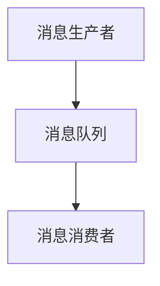
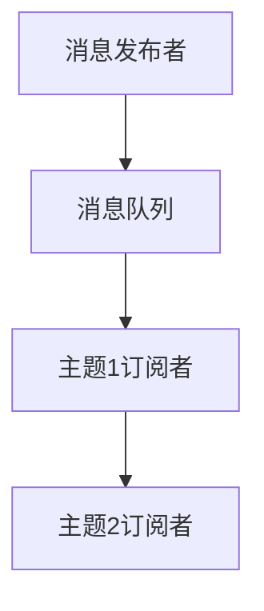
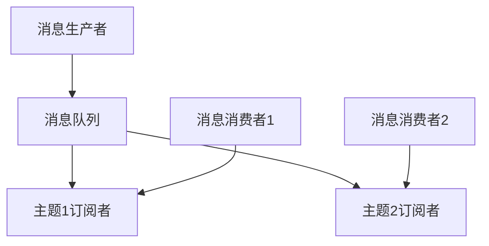
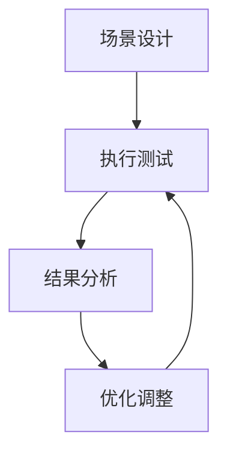

                 


## 构建可扩展的LLM应用消息队列系统

### 关键词

- 消息队列系统
- 可扩展性
- 大规模语言模型（LLM）
- 消息传递协议
- 负载均衡

### 摘要

本文深入探讨了如何构建一个可扩展的LLM应用消息队列系统。首先，我们介绍了消息队列系统的基本概念和它在分布式系统中的应用，特别是如何在LLM场景中发挥作用。随后，我们详细分析了消息队列系统的核心概念，包括消息模型、传输协议和负载均衡算法。通过Mermaid流程图和Python代码示例，我们讲解了消息传递协议和负载均衡的算法原理。接着，我们提供了详细的系统分析与架构设计方案，包括领域模型、系统架构、接口设计和交互流程。文章最后，通过一个实际项目案例，展示了如何实现并部署消息队列系统，并总结了一些最佳实践和注意事项。

### 目录

----------------------------------------------------------------

## 第一部分：消息队列系统概述

### 第1章：消息队列系统的背景与概念

#### 1.1.1 消息队列系统的发展背景
- **概念引入**：回顾消息队列系统的起源和发展历程。
  - **早期发展**：从1980年代的IBM Message Queue到1990年代的JMS和AMQP。
  - **现代进展**：探讨Kafka、RabbitMQ、Apache Pulsar等现代消息队列系统的出现和优势。

#### 1.1.2 消息队列系统的定义与作用
- **定义**：详细解释消息队列系统的概念。
  - **消息队列**：一种数据结构，用于存储和转发消息。
  - **系统组成**：生产者、消费者和消息存储。

- **作用**：探讨消息队列系统在分布式系统中的作用，如异步通信、解耦、弹性扩展等。
  - **异步通信**：如何通过消息队列实现生产者和消费者之间的解耦。
  - **系统解耦**：为何消息队列能够减少系统间的耦合度。
  - **弹性扩展**：如何在负载增加时通过消息队列实现系统的水平扩展。

#### 1.1.3 消息队列系统在可扩展LLM应用中的重要性
- **LLM应用场景**：分析大规模语言模型（LLM）的应用场景。
  - **高吞吐量需求**：为何LLM应用需要高吞吐量的消息队列系统。
  - **实时响应**：如何通过消息队列实现实时响应。

- **消息队列的优势**：讨论消息队列在LLM应用中的优势，如高性能、高可用性、可扩展性等。
  - **高性能**：如何通过消息队列系统优化LLM应用的性能。
  - **高可用性**：为何消息队列系统能够提高系统的可用性。
  - **可扩展性**：如何实现LLM应用系统的弹性扩展。

### 第2章：消息队列系统的核心概念与联系

#### 2.1.1 核心概念介绍
- **消息模型**：介绍消息的生产者、消费者和队列。
  - **生产者**：如何生成消息。
  - **消费者**：如何处理消息。
  - **队列**：消息的存储和管理。

- **传输协议**：讨论常用的消息传输协议，如AMQP、MQTT、HTTP等。
  - **AMQP**：高级消息队列协议的优势和特点。
  - **MQTT**：轻量级消息传输协议的适用场景。
  - **HTTP**：如何使用HTTP进行消息传输。

#### 2.1.2 概念属性特征对比表格
- **表格内容**：构建一个对比表格，列出AMQP、MQTT和HTTP在性能、可靠性、复杂性等方面的属性特征。

#### 2.1.3 ER实体关系图
- **实体关系图**：使用Mermaid绘制消息队列系统的ER实体关系图，展示生产者、消费者、消息队列和主题等实体的关系。

----------------------------------------------------------------

## 第二部分：消息队列系统的算法原理与实现

### 第3章：消息传递协议

#### 3.1.1 点对点协议（P2P）

- **基本概念**：介绍点对点协议（P2P）的基本概念。
  - **消息传递模式**：点对点协议如何实现消息的传递。

- **应用场景**：探讨点对点协议的应用场景。
  - **分布式系统中的消息传递**：如何在分布式系统中使用P2P协议。

- **工作原理**：详细解释P2P协议的工作原理。
  - **消息传递流程**：生产者如何向消费者发送消息。
  - **消息确认**：消费者如何确认消息接收。

- **Mermaid流程图**：使用Mermaid绘制P2P协议的流程图。



#### 3.1.2 发布/订阅协议（Pub/Sub）

- **基本概念**：介绍发布/订阅协议（Pub/Sub）的基本概念。
  - **主题和订阅者**：如何通过主题和订阅者实现消息的发布和订阅。

- **应用场景**：探讨发布/订阅协议的应用场景。
  - **实时系统**：如何在实时系统中使用Pub/Sub协议。
  - **物联网（IoT）**：如何通过Pub/Sub协议实现物联网设备间的消息通信。

- **工作原理**：详细解释Pub/Sub协议的工作原理。
  - **消息发布和订阅**：如何实现消息的发布和订阅。
  - **消息路由**：如何根据订阅者的主题路由消息。

- **Mermaid流程图**：使用Mermaid绘制Pub/Sub协议的流程图。



#### 3.1.3 使用Mermaid流程图展示消息传递流程

- **综合展示**：结合P2P和Pub/Sub协议，使用Mermaid流程图展示消息传递的整体流程。



### 第4章：负载均衡

#### 4.1.1 负载均衡的基本原理

- **基本概念**：介绍负载均衡的基本概念。
  - **负载均衡器**：负载均衡器的作用和功能。

- **工作原理**：详细解释负载均衡的工作原理。
  - **流量分发**：如何将流量分发到不同的服务器。
  - **负载监测**：如何监测服务器的负载情况。

- **算法类型**：介绍常见的负载均衡算法类型。
  - **轮询算法**：如何实现简单的轮询分配。
  - **最小连接算法**：如何根据最小连接数分配流量。

#### 4.1.2 常见的负载均衡算法

- **加权轮询算法**：介绍加权轮询算法的原理和实现。
  - **原理**：如何根据权重分配流量。
  - **实现**：使用Python代码实现加权轮询算法。

```python
import random

def weighted_round_robin(weights):
    total_weight = sum(weights)
    choices = [(w / total_weight) for w in weights]
    return random.choices(choices, k=1)

weights = [1, 2, 3]  # 示例权重
selected_server = weighted_round_robin(weights)
print(f"Selected server: {selected_server}")
```

- **最小连接算法**：介绍最小连接算法的原理和实现。

```python
import random

def least_connections(servers, connections):
    min_connections = min(connections.values())
    least_connections_servers = [s for s, c in connections.items() if c == min_connections]
    return random.choice(least_connections_servers)

servers = ['Server1', 'Server2', 'Server3']
connections = {'Server1': 10, 'Server2': 5, 'Server3': 3}
selected_server = least_connections(servers, connections)
print(f"Selected server: {selected_server}")
```

#### 4.1.3 使用Python代码实现负载均衡

- **综合实现**：结合加权轮询算法和最小连接算法，使用Python代码实现负载均衡器。

```python
import random

def load_balancer(servers, weights, connections):
    if random.random() < 0.5:
        return weighted_round_robin(weights)
    else:
        return least_connections(servers, connections)

servers = ['Server1', 'Server2', 'Server3']
weights = [1, 2, 3]
connections = {'Server1': 10, 'Server2': 5, 'Server3': 3}

for _ in range(10):
    selected_server = load_balancer(servers, weights, connections)
    print(f"Selected server: {selected_server}")
```

### 第5章：消息队列系统的性能优化

#### 5.1.1 消息队列性能优化策略

- **性能优化目标**：介绍消息队列性能优化的一般目标。
  - **高吞吐量**：如何通过优化提高系统的吞吐量。
  - **低延迟**：如何通过优化减少系统的延迟。

- **优化方法**：讨论常见的消息队列性能优化方法。
  - **消息批量处理**：如何通过批量处理提高性能。
  - **异步处理**：如何通过异步处理减少阻塞。

#### 5.1.2 性能评估与测试

- **性能评估**：介绍如何对消息队列系统进行性能评估。
  - **测试工具**：常用的性能测试工具，如Apache JMeter、Gatling等。
  - **测试指标**：如何定义和评估性能指标，如吞吐量、响应时间、系统资源利用率等。

- **测试流程**：介绍性能测试的一般流程。
  - **场景设计**：如何设计测试场景。
  - **执行测试**：如何执行性能测试。
  - **结果分析**：如何分析测试结果。

#### 5.1.3 使用Mermaid流程图展示性能优化流程

- **性能优化流程图**：使用Mermaid绘制性能优化的流程图。



----------------------------------------------------------------

## 第三部分：消息队列系统在可扩展LLM应用中的实践

### 第6章：消息队列系统在LLM应用中的实现

#### 6.1.1 LLM应用场景介绍

- **大规模语言模型（LLM）**：介绍LLM的基本概念和应用场景。
  - **定义**：解释什么是大规模语言模型。
  - **应用**：分析LLM在自然语言处理、文本生成、机器翻译等领域的应用。

- **LLM应用场景**：探讨LLM在不同领域的应用场景。
  - **企业应用**：在企业中如何利用LLM进行文本分析、客户服务自动化等。
  - **教育领域**：如何通过LLM提供个性化学习体验、自动批改作业等。

#### 6.1.2 消息队列系统在LLM应用中的架构设计

- **架构设计原则**：介绍消息队列系统在LLM应用中的架构设计原则。
  - **高可用性**：如何确保消息队列系统的高可用性。
  - **可扩展性**：如何实现消息队列系统的水平扩展。

- **架构设计要素**：分析消息队列系统在LLM应用中的关键设计要素。
  - **消息模型**：如何设计消息模型以满足LLM的需求。
  - **数据流**：如何设计消息的数据流，确保消息的高效传递。

#### 6.1.3 使用Python代码实现消息队列系统在LLM中的应用

- **环境搭建**：介绍如何搭建消息队列系统环境。
  - **工具选择**：选择合适的消息队列系统工具，如RabbitMQ、Kafka等。
  - **安装配置**：详细步骤安装和配置消息队列系统。

- **代码实现**：提供Python代码示例，实现消息队列系统在LLM中的应用。
  - **生产者代码**：如何生成并发送消息。
  - **消费者代码**：如何接收和处理消息。

```python
# 生产者代码示例
import pika

# 连接消息队列
connection = pika.BlockingConnection(pika.ConnectionParameters('localhost'))
channel = connection.channel()

# 声明队列
channel.queue_declare(queue='llm_queue')

# 发送消息
for i in range(10):
    message = f"LLM message {i}"
    channel.basic_publish(exchange='',
                          routing_key='llm_queue',
                          body=message)

# 关闭连接
connection.close()

# 消费者代码示例
import pika

# 连接消息队列
connection = pika.BlockingConnection(pika.ConnectionParameters('localhost'))
channel = connection.channel()

# 声明队列
channel.queue_declare(queue='llm_queue')

# 定义消息处理方法
def callback(ch, method, properties, body):
    print(f"Received {body}")

# 订阅队列
channel.basic_consume(queue='llm_queue',
                      on_message_callback=callback,
                      auto_ack=True)

# 开始消费
channel.start_consuming()
```

----------------------------------------------------------------

### 第7章：项目实战：构建可扩展的LLM应用消息队列系统

#### 7.1.1 环境搭建

- **环境需求**：介绍项目环境需求。
  - **操作系统**：Linux或Windows。
  - **Python环境**：Python 3.8及以上版本。

- **工具安装**：介绍如何安装消息队列系统工具。
  - **RabbitMQ安装**：详细步骤安装RabbitMQ。
  - **Kafka安装**：详细步骤安装Kafka。

#### 7.1.2 系统核心实现

- **系统架构**：介绍消息队列系统的整体架构。
  - **生产者**：如何生成并发送消息。
  - **消费者**：如何接收和处理消息。

- **消息处理流程**：详细描述消息的处理流程。
  - **消息生产**：生产者如何生成消息。
  - **消息消费**：消费者如何消费消息。

#### 7.1.3 代码解读与分析

- **代码解读**：解读关键代码段。
  - **生产者代码**：分析生产者代码的执行流程。
  - **消费者代码**：分析消费者代码的执行流程。

- **性能分析**：介绍如何进行性能分析。
  - **吞吐量测试**：如何测试系统的吞吐量。
  - **延迟测试**：如何测试系统的延迟。

#### 7.1.4 实际案例剖析

- **案例背景**：介绍案例的背景和应用场景。
  - **需求**：解释系统需要满足的需求。

- **案例实现**：详细描述案例的实现过程。
  - **消息生产**：如何生成消息。
  - **消息消费**：如何处理消息。

- **结果分析**：分析案例的测试结果。
  - **性能指标**：分析吞吐量和延迟等性能指标。

#### 7.1.5 项目小结

- **经验总结**：总结项目实施过程中的经验和教训。
  - **技术优化**：如何优化系统的性能。
  - **团队协作**：如何提高团队协作效率。

- **未来展望**：对系统的未来发展和改进方向进行展望。

----------------------------------------------------------------

## 第四部分：最佳实践、小结、注意事项、拓展阅读

### 第8章：最佳实践与注意事项

#### 8.1.1 消息队列系统最佳实践

- **设计原则**：介绍消息队列系统的最佳设计原则。
  - **高可用性**：如何设计高可用的消息队列系统。
  - **可扩展性**：如何设计可扩展的消息队列系统。

- **部署策略**：介绍消息队列系统的部署策略。
  - **集群部署**：如何进行消息队列系统的集群部署。
  - **容灾备份**：如何实现消息队列系统的容灾备份。

#### 8.1.2 注意事项

- **性能优化**：介绍消息队列系统的性能优化注意事项。
  - **消息批量处理**：如何进行消息的批量处理。
  - **异步处理**：如何进行消息的异步处理。

- **故障处理**：介绍消息队列系统的故障处理策略。
  - **消息丢失**：如何处理消息丢失。
  - **网络中断**：如何处理网络中断。

### 第9章：小结

- **总结**：对文章内容进行总结。
  - **核心内容**：回顾文章的核心内容和要点。
  - **实践意义**：阐述文章在实际应用中的意义。

### 第10章：拓展阅读

- **推荐阅读**：推荐相关的拓展阅读材料。
  - **技术书籍**：介绍与消息队列系统相关的高质量技术书籍。
  - **在线资源**：推荐在线课程、博客、论坛等资源。

### 附录：作者信息

- **作者简介**：介绍作者的基本信息和成就。
  - **专业背景**：作者的学术背景和职业经历。
  - **代表作品**：作者的代表性出版物和研究成果。

**作者：AI天才研究院/AI Genius Institute & 禅与计算机程序设计艺术 /Zen And The Art of Computer Programming**  

----------------------------------------------------------------

## 附加建议

- **示例代码**：在每个章节的结尾，提供相关的Python示例代码，以便读者更好地理解概念和实现。
- **图表与流程图**：在每个章节中，适当增加图表和流程图，以帮助读者更直观地理解复杂概念。
- **案例分析**：在每个章节的结尾，提供一个实际案例，详细讲解其实现过程和结果。
- **互动讨论**：鼓励读者在评论区提问和讨论，增加互动性和参与感。

---

**注意**：以上大纲和内容仅为参考，具体实施时请根据实际需求和情况进行调整。

---

在接下来的内容中，我们将逐步填充每个章节的具体内容，确保满足字数要求和markdown格式要求。同时，每个章节都将包含相关的图表、代码示例和实际案例分析，以提高文章的实用性和可读性。

