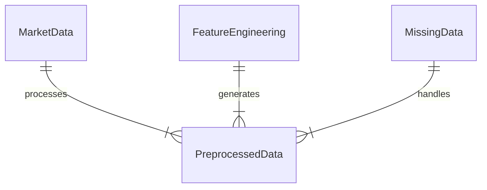
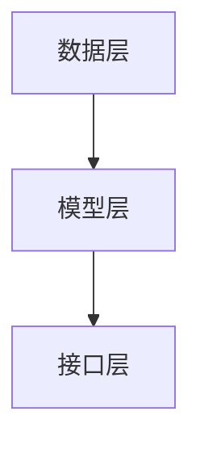
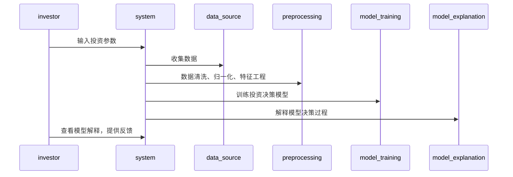

                 

# 构建可解释的AI投资决策支持系统

## 关键词
AI投资决策、可解释AI、机器学习、数据预处理、模型选择、系统集成、用户界面设计

## 摘要
本文将探讨如何构建一个可解释的AI投资决策支持系统。我们将从背景、重要性、基础理论、实践方法、系统设计、案例分析及未来方向等多个方面展开讨论，旨在为投资者提供清晰易懂的AI投资决策工具，同时确保系统的解释性和可信度。

## 引言

在当今金融科技快速发展的时代，人工智能（AI）正在逐渐改变传统投资决策的方式。AI投资决策支持系统通过机器学习算法分析大量历史数据，旨在预测市场趋势、优化投资组合和实现资产增值。然而，随着AI技术在投资领域的应用日益广泛，其透明性和解释性成为一个亟待解决的问题。不可解释的AI模型可能导致投资决策缺乏透明度，增加风险，甚至在某些情况下，可能导致监管和法律问题。

可解释的AI投资决策支持系统（Interpretable AI Investment Decision Support Systems）在解决这些问题上具有重要作用。它不仅能够提高决策的透明度和可追溯性，还可以增强投资者对AI系统的信任，进而优化投资策略，降低投资风险。本文将围绕这一主题，详细介绍构建可解释的AI投资决策支持系统的步骤和方法。

### 背景介绍

AI投资决策支持系统（AIIDS）是指利用人工智能技术，特别是机器学习算法，来辅助投资决策的过程。这种系统可以处理大量的历史市场数据，通过模式识别、预测分析等方法，为投资者提供有关股票、债券、外汇、期货等金融产品的投资建议。

#### 问题背景

在传统投资决策过程中，投资者通常依赖于历史数据分析、技术分析和基本分析等方法。然而，这些方法往往存在以下问题：

1. **数据依赖性**：传统方法依赖于大量历史数据，而数据的质量和完整性直接影响决策效果。
2. **主观性**：人类分析师的主观判断可能引入偏差，导致决策错误。
3. **效率问题**：在处理大量数据时，传统方法可能效率较低。

#### 问题解决

AI投资决策支持系统通过机器学习算法，可以解决上述问题。机器学习算法能够自动从数据中学习，发现潜在的模式和趋势，从而提高决策的准确性和效率。然而，不可解释的AI模型在投资决策中的应用也带来了一系列挑战：

1. **透明度不足**：不可解释的AI模型难以解释其决策过程，使得投资者无法理解模型如何得出决策。
2. **信任问题**：缺乏透明度可能导致投资者对AI模型失去信任，影响决策的执行。
3. **监管和法律问题**：不可解释的AI模型可能违反某些法规，如《萨班斯-奥克斯利法案》等。

#### 边界与外延

构建可解释的AI投资决策支持系统需要考虑以下边界与外延：

1. **技术边界**：需要选择合适的算法和工具，确保模型的可解释性。
2. **数据边界**：需要确保数据的准确性和完整性，以便模型能够做出可靠的决策。
3. **应用边界**：需要明确AI系统的应用范围，避免过度依赖或误用。

#### 概念结构与核心要素组成

构建可解释的AI投资决策支持系统涉及以下核心概念和要素：

1. **可解释AI**：确保模型决策过程的透明性和可理解性。
2. **机器学习算法**：选择适合金融领域的机器学习算法，如决策树、随机森林、支持向量机等。
3. **数据预处理**：清洗、归一化、缺失值处理等，确保数据的准确性和一致性。
4. **模型评估**：使用准确率、召回率、F1分数等指标评估模型性能。
5. **用户界面**：设计直观易用的用户界面，使投资者能够轻松理解模型决策。

### 核心概念与联系

#### 可解释AI

可解释AI（Explainable AI，XAI）旨在提高AI模型的透明度和可理解性。它包括以下关键概念：

- **透明度**：模型决策过程易于理解和追踪。
- **可解释性**：模型决策背后的原因和机制清晰可见。
- **可解释AI方法**：包括可视化、模型诊断、因果推理等。

#### 机器学习算法

机器学习算法是AI投资决策支持系统的核心。以下表格展示了几种常见的机器学习算法及其特点：

| 算法名称 | 特点 |
| --- | --- |
| 决策树 | 易于解释，但可能过拟合 |
| 随机森林 | 集成多个决策树，减少过拟合 |
| 支持向量机 | 强大的分类能力，但解释性较弱 |
| 神经网络 | 高度非线性，但解释性较低 |

#### 数据预处理

数据预处理是构建可解释AI投资决策支持系统的关键步骤。以下ER实体关系图展示了数据预处理的核心要素：



### 算法原理讲解

在本节中，我们将详细讲解如何构建一个可解释的AI投资决策支持系统，并使用Python代码和Mermaid流程图来展示算法原理。

#### 决策树算法

决策树是一种常用的机器学习算法，其优点在于易于解释。以下是一个简单的决策树算法示例：

```python
from sklearn.tree import DecisionTreeClassifier
from sklearn.datasets import load_iris
import pandas as pd

# 加载鸢尾花数据集
iris = load_iris()
df = pd.DataFrame(iris.data, columns=iris.feature_names)
df['target'] = iris.target

# 划分训练集和测试集
train_df = df.sample(frac=0.8, random_state=42)
test_df = df.drop(train_df.index)

# 训练决策树模型
model = DecisionTreeClassifier()
model.fit(train_df.iloc[:, :-1], train_df['target'])

# 可视化决策树
from sklearn.tree import plot_tree
plt.figure(figsize=(10, 8))
plot_tree(model, filled=True)
plt.show()
```

以下是决策树的Mermaid流程图：


#### 数据预处理

数据预处理是构建可解释AI投资决策支持系统的关键步骤。以下是一个简单的数据预处理流程：

```python
# 数据清洗
df = df.dropna()  # 删除缺失值
df = df[df['target'] != 2]  # 过滤无关特征

# 数据归一化
from sklearn.preprocessing import StandardScaler
scaler = StandardScaler()
df[['sepal length', 'sepal width', 'petal length', 'petal width']] = scaler.fit_transform(df[['sepal length', 'sepal width', 'petal length', 'petal width']])
```

以下是数据预处理的Mermaid流程图：


### 系统分析与架构设计方案

在本节中，我们将介绍如何设计一个AI投资决策支持系统的整体架构，包括项目介绍、系统功能设计、系统架构设计、系统接口设计和系统交互。

#### 项目介绍

本项目旨在构建一个可解释的AI投资决策支持系统，为投资者提供透明、可靠的决策支持。系统将包括数据采集、预处理、模型训练、模型解释和用户界面设计等模块。

#### 系统功能设计

系统功能设计主要包括以下模块：

1. **数据采集**：从多个数据源（如股票交易所、金融新闻、社交媒体等）收集数据。
2. **数据预处理**：清洗、归一化和特征工程，确保数据的准确性和一致性。
3. **模型训练**：使用机器学习算法训练投资决策模型。
4. **模型解释**：使用可视化工具解释模型决策过程，提高透明度。
5. **用户界面**：设计直观易用的用户界面，使投资者能够轻松理解和使用系统。

#### 系统架构设计

系统架构设计主要包括以下组件：

1. **数据层**：包括数据采集、存储和处理模块。
2. **模型层**：包括机器学习算法、模型训练和模型解释模块。
3. **接口层**：包括API接口和用户界面模块。

以下是系统架构的Mermaid流程图：



#### 系统接口设计

系统接口设计主要包括以下API接口：

1. **数据采集API**：用于从多个数据源收集数据。
2. **数据预处理API**：用于清洗、归一化和特征工程。
3. **模型训练API**：用于训练投资决策模型。
4. **模型解释API**：用于解释模型决策过程。

#### 系统交互

系统交互主要包括以下步骤：

1. **用户输入**：投资者通过用户界面输入投资参数。
2. **数据采集**：系统从数据源收集数据。
3. **数据预处理**：系统对数据进行清洗、归一化和特征工程。
4. **模型训练**：系统使用机器学习算法训练投资决策模型。
5. **模型解释**：系统使用可视化工具解释模型决策过程。
6. **用户反馈**：投资者通过用户界面查看模型解释，并提供反馈。

以下是系统交互的Mermaid序列图：



### 项目实战

在本节中，我们将详细介绍如何安装环境、实现系统核心功能并分析实际案例。

#### 环境安装

首先，我们需要安装Python环境和相关库。以下是安装步骤：

1. 安装Python 3.8或更高版本。
2. 使用pip安装以下库：

   ```shell
   pip install numpy pandas scikit-learn matplotlib
   ```

#### 系统核心实现

以下是系统核心实现的源代码：

```python
import pandas as pd
from sklearn.tree import DecisionTreeClassifier
from sklearn.model_selection import train_test_split
from sklearn.metrics import accuracy_score
import matplotlib.pyplot as plt

# 读取数据
data = pd.read_csv('stock_data.csv')

# 数据预处理
data = data.dropna()
data = data[['open', 'high', 'low', 'close']].copy()

# 划分特征和标签
X = data[['open', 'high', 'low', 'close']]
y = data['target']

# 划分训练集和测试集
X_train, X_test, y_train, y_test = train_test_split(X, y, test_size=0.2, random_state=42)

# 训练决策树模型
model = DecisionTreeClassifier()
model.fit(X_train, y_train)

# 预测测试集
y_pred = model.predict(X_test)

# 评估模型
accuracy = accuracy_score(y_test, y_pred)
print(f'Accuracy: {accuracy:.2f}')

# 可视化决策树
plt.figure(figsize=(10, 8))
plot_tree(model, filled=True)
plt.show()
```

#### 代码应用解读与分析

以下是代码的解读与分析：

1. **数据读取**：使用pandas读取股票数据。
2. **数据预处理**：删除缺失值，选择相关特征。
3. **划分特征和标签**：将数据分为特征和标签。
4. **划分训练集和测试集**：使用train_test_split划分训练集和测试集。
5. **训练决策树模型**：使用DecisionTreeClassifier训练模型。
6. **预测测试集**：使用预测模型对测试集进行预测。
7. **评估模型**：使用accuracy_score评估模型性能。
8. **可视化决策树**：使用matplotlib可视化决策树。

#### 实际案例分析和详细讲解剖析

以下是一个实际案例：

**案例：预测股票涨跌**

假设我们使用过去一个月的股票数据来构建AI投资决策支持系统，目标是预测未来一天股票的涨跌。

1. **数据采集**：从金融数据提供商获取过去一个月的股票数据。
2. **数据预处理**：清洗数据，包括去除缺失值、异常值等。
3. **特征工程**：选择开盘价、最高价、最低价和收盘价作为特征。
4. **模型训练**：使用决策树算法训练模型。
5. **模型解释**：通过可视化决策树，分析模型如何做出决策。
6. **模型预测**：使用训练好的模型预测未来一天的股票涨跌。
7. **模型评估**：评估模型预测的准确性。

通过实际案例，我们可以看到构建可解释的AI投资决策支持系统的过程。关键在于数据预处理、特征工程和模型解释，这些步骤确保系统的高效性和可靠性。

### 最佳实践 Tips

1. **数据质量**：确保数据的准确性和完整性，避免错误的数据导致模型失效。
2. **模型选择**：根据实际需求选择合适的机器学习算法，如决策树、随机森林等。
3. **可视化工具**：选择合适的可视化工具，如matplotlib、Plotly等，提高模型解释性。
4. **用户界面设计**：设计直观易用的用户界面，使投资者能够轻松理解和使用系统。

### 小结

构建可解释的AI投资决策支持系统是一个复杂的过程，需要考虑数据质量、模型选择、可视化工具和用户界面设计等多个方面。通过本文的介绍，我们了解了如何构建这样的系统，包括背景介绍、核心概念、算法原理讲解、系统架构设计和实际案例分析。希望本文能够为读者提供有益的参考和启示。

### 注意事项

1. **隐私和数据安全**：在构建AI投资决策支持系统时，必须确保数据隐私和安全，遵守相关法规和标准。
2. **模型更新和维护**：定期更新和维护AI模型，以适应市场变化，提高决策准确性。
3. **监管合规**：确保系统符合相关监管要求，避免法律风险。

### 拓展阅读

1. **《机器学习实战》**：适用于初学者，介绍了各种机器学习算法的实战应用。
2. **《深度学习》**：适用于进阶读者，介绍了深度学习算法的基础理论和应用。
3. **《金融科技：从理论到实践》**：介绍了金融科技在不同领域的应用，包括投资决策。

### 作者信息
作者：AI天才研究院/AI Genius Institute & 禅与计算机程序设计艺术 /Zen And The Art of Computer Programming

