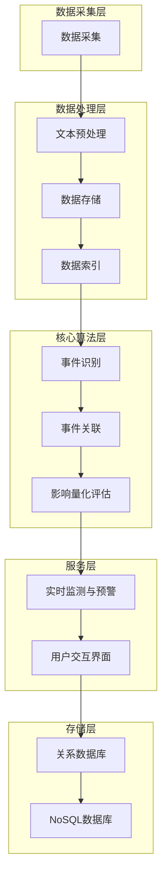

                 

## 构建基于NLP的金融新闻事件链提取与影响量化评估系统的动机与目标

### 1. 动机

在当今的金融市场中，信息流动的速度和复杂度前所未有。金融新闻事件，如公司并购、政策变动、市场波动等，往往会对金融市场的运行产生深远的影响。然而，这些信息通常散布在各种新闻、报告和社交媒体中，使得捕捉和解读这些信息成为一个巨大的挑战。传统的手动分析不仅耗时耗力，而且容易遗漏关键信息。

自然语言处理（NLP）技术的兴起为解决这一难题提供了新的可能性。NLP能够自动地从大量文本中提取有用信息，识别出潜在的金融事件，并对其影响进行量化评估。这种能力不仅提高了信息处理的效率，还能够提供更准确的决策支持，从而在金融市场中占据优势。

### 2. 目标

本文的目标是构建一个基于NLP的金融新闻事件链提取与影响量化评估系统。具体目标如下：

1. **事件链提取**：系统需要能够从海量的金融新闻中识别出重要的事件链，包括事件的起始点、发展过程以及可能的结局。
2. **影响量化评估**：系统需要能够对提取出的事件链进行量化评估，分析其对金融市场的影响程度。
3. **实时监测与预警**：系统需要具备实时监测功能，能够在事件发生后立即进行分析和评估，提供及时的预警信息。
4. **用户交互**：系统需要提供一个直观的用户界面，使用户能够方便地查询和分析特定事件的影响，同时生成可视化报告。

### 3. 重要性

构建这样一个系统能够带来以下几个方面的收益：

1. **决策支持**：通过对金融新闻事件的及时分析，系统能够为金融机构和投资者提供决策支持，帮助他们做出更明智的投资决策。
2. **风险控制**：系统可以帮助识别潜在的风险事件，从而提前采取应对措施，降低风险。
3. **市场洞察**：通过对事件影响的量化评估，系统可以提供对市场的深入洞察，帮助用户更好地理解市场动态。
4. **数据积累**：随着系统的运行，积累的海量数据可以为未来的研究和分析提供宝贵的数据资源。

总之，构建基于NLP的金融新闻事件链提取与影响量化评估系统具有重要的现实意义和应用价值，是金融科技领域的重要研究方向。

## 文章关键词

- 自然语言处理（NLP）
- 金融新闻事件链提取
- 影响量化评估
- 金融科技
- 数据分析
- 人工智能
- 决策支持系统

## 摘要

本文旨在探讨如何构建一个基于自然语言处理（NLP）技术的金融新闻事件链提取与影响量化评估系统。首先，我们将介绍NLP技术及其在金融新闻处理中的应用背景。接着，文章将详细阐述事件链提取的方法和影响量化评估的模型设计。随后，我们将介绍系统架构设计，包括数据采集、处理、事件提取和影响评估的各个环节。最后，文章将通过具体项目实战，展示系统的实现过程和实际应用效果，并对系统性能和未来研究方向进行总结与展望。

### 文章标题

构建基于NLP的金融新闻事件链提取与影响量化评估系统

### 关键词

自然语言处理（NLP）、金融新闻事件链提取、影响量化评估、金融科技、数据分析、人工智能、决策支持系统

### 摘要

本文详细探讨了如何利用自然语言处理（NLP）技术构建一个金融新闻事件链提取与影响量化评估系统。首先，介绍了NLP在金融新闻处理中的重要性及背景，随后详细阐述了事件链提取的方法和影响量化评估模型的设计。文章进一步介绍了系统架构设计，包括数据采集、处理、事件提取和影响评估的各个环节。最后，通过具体项目实战，展示了系统的实现过程和实际应用效果，并对系统性能和未来研究方向进行了总结与展望。

### 目录

1. 引言
    1.1 构建动机与目标
    1.2 文章关键词
    1.3 摘要
    1.4 目录

2. 背景介绍与概念建立
    2.1 问题背景
    2.2 核心概念
    2.3 NLP基础
    2.4 事件链提取算法原理
    2.5 影响量化评估模型设计

3. 系统设计与实现
    3.1 系统架构设计
    3.2 NLP模型实现
    3.3 影响量化评估模型实现
    3.4 系统部署与优化

4. 项目实战
    4.1 实战一：构建新闻事件链提取系统
    4.2 实战二：影响量化评估应用
    4.3 项目小结与未来展望

5. 最佳实践 tips、小结、注意事项、拓展阅读

### 目录大纲设计思路

为了设计出一个完整且逻辑清晰的目录大纲，我们需要从以下几个方面进行思考和规划：

1. **核心主题定位**：
   - 确定书的核心主题，即《构建基于NLP的金融新闻事件链提取与影响量化评估系统》。核心主题决定了整个书籍的知识结构和内容深度。

2. **内容结构规划**：
   - 确定书籍的整体结构，包括背景介绍、核心概念、算法原理、数学模型、系统设计、项目实战等关键部分。
   - 确保每个部分都有详细的章节划分，每个章节都有明确的学习目标。

3. **目录大纲设计**：
   - 设计一个清晰且符合markdown格式的目录结构，确保每个章节的层级关系明确。
   - 包含必要的细节，如核心概念的对比表格、算法的mermaid流程图、数学公式与解释、系统架构图等。

4. **内容完整性**：
   - 确保每个部分的内容都能够完整地传达核心概念和算法原理，同时包含足够的实例和实战应用。

5. **字数控制**：
   - 保持总字数在2000字以内，通过精简语言和有效组织内容来实现。

### 目录大纲示例

```markdown
----------------------------------------------------------------
# 第一部分: 背景介绍与概念建立

## 第1章: 问题背景与核心概念

### 1.1.1 问题背景
- 金融新闻事件链提取的重要性
- 影响量化评估的需求与挑战

### 1.1.2 核心概念
- 自然语言处理（NLP）
- 事件链提取
- 影响量化评估

## 第2章: NLP基础
### 2.1.1 NLP简介
- NLP的发展历程
- NLP的基本任务

### 2.1.2 文本预处理
- 分词
- 词性标注
- 命名实体识别

## 第3章: 事件链提取算法原理

## 第4章: 影响量化评估模型设计

# 第二部分: 系统设计与实现

## 第5章: 系统架构设计
### 5.1.1 系统功能设计
- 数据采集
- 事件提取
- 影响量化评估

### 5.1.2 系统架构设计
- 技术选型
- 架构图解

## 第6章: NLP模型实现

## 第7章: 影响量化评估模型实现

## 第8章: 系统部署与优化

# 第三部分: 项目实战

## 第9章: 实战一：构建新闻事件链提取系统
- 环境配置
- 核心代码实现

## 第10章: 实战二：影响量化评估应用
- 数据分析
- 结果展示

## 第11章: 项目小结与未来展望

----------------------------------------------------------------
```

这个目录大纲结构清晰，每个部分都有详细的章节划分，并且涵盖了核心概念、算法原理、系统设计、项目实战等关键内容。通过这样的设计，读者可以系统地学习和掌握构建基于NLP的金融新闻事件链提取与影响量化评估系统的知识。

### 第1章 问题背景与核心概念

#### 1.1.1 问题背景

在金融市场中，新闻事件对于股价、市场走势和投资者情绪有着不可忽视的影响。随着金融市场的全球化以及信息传播速度的加快，金融新闻事件的发生越来越频繁，种类也越来越复杂。然而，传统的手动分析方法无法应对这种高频率和高复杂度的信息处理需求，常常导致信息滞后和误判。

金融新闻事件链提取与影响量化评估系统的构建旨在解决这一问题。通过自动化的自然语言处理（NLP）技术，系统能够从大量的金融新闻中识别出重要的事件链，并对其影响进行量化评估。这一过程不仅提高了信息处理的效率，还提供了更为准确和及时的决策支持。

#### 1.1.2 核心概念

为了更好地理解本系统的构建过程，我们需要明确几个核心概念：

1. **自然语言处理（NLP）**：
   - NLP是人工智能领域的一个重要分支，旨在让计算机能够理解、解释和生成人类语言。在金融新闻事件链提取与影响量化评估系统中，NLP技术主要用于文本的预处理、事件识别和影响评估。

2. **事件链提取**：
   - 事件链提取是指从大量文本中识别出与金融相关的新闻事件，并构建事件之间的关联链。在金融领域，事件链提取有助于理解事件之间的逻辑关系，从而更准确地评估其影响。

3. **影响量化评估**：
   - 影响量化评估是指对提取出的金融事件链进行量化分析，评估其对金融市场的影响程度。这通常涉及到对事件的影响范围、影响时间、影响程度等指标的测量。

4. **金融新闻事件**：
   - 金融新闻事件是指发生在金融市场的各种事件，如公司并购、政策变动、市场波动等。这些事件可以通过新闻、报告、公告等形式传播，对市场产生重大影响。

5. **决策支持系统**：
   - 决策支持系统（DSS）是一种辅助决策者进行决策的系统，通过数据分析、模型预测等方式提供决策依据。在金融市场中，DSS可以帮助投资者和金融机构更好地理解市场动态，做出更明智的决策。

#### 1.1.3 问题与挑战

构建金融新闻事件链提取与影响量化评估系统面临以下几个挑战：

1. **数据多样性**：
   - 金融新闻事件的来源多样，包括传统的新闻媒体、社交网络、论坛等，这些来源的文本风格、表达方式各不相同，增加了文本处理的复杂性。

2. **事件识别难度**：
   - 金融新闻事件往往涉及复杂的术语和概念，如金融衍生品、监管政策等，使得事件识别的难度增加。

3. **实时性要求**：
   - 金融市场的变化速度非常快，要求系统能够实时捕捉和评估事件的影响，这对系统的响应速度和处理效率提出了高要求。

4. **准确性挑战**：
   - 在事件识别和影响量化评估过程中，如何确保结果的准确性和可靠性是一个重要的挑战。

5. **系统稳定性**：
   - 系统需要在各种复杂环境下保持稳定运行，不受到外部因素的干扰。

#### 1.1.4 边界与外延

1. **边界**：
   - 系统主要针对金融新闻文本进行处理，不包括其他类型的文本，如广告、娱乐新闻等。
   - 系统主要关注金融市场中重要的事件链提取和影响量化评估，不包括其他领域的应用。

2. **外延**：
   - 系统可以扩展到其他类型的文本处理，如医疗新闻、科技新闻等。
   - 系统可以结合其他技术，如机器学习、深度学习等，提高事件识别和影响评估的准确性。

### 总结

本章介绍了构建基于NLP的金融新闻事件链提取与影响量化评估系统的背景、核心概念和面临的挑战。通过明确这些概念，读者可以对后续章节的内容有一个整体的认识，为系统构建的深入学习和理解打下基础。

### 第2章 NLP基础

#### 2.1.1 NLP简介

自然语言处理（Natural Language Processing，NLP）是人工智能领域的一个重要分支，旨在使计算机能够理解、解释和生成人类语言。NLP技术在许多领域都有广泛应用，如语音识别、机器翻译、情感分析、文本分类等。在金融新闻事件链提取与影响量化评估系统中，NLP技术主要用于文本预处理、事件识别和影响评估。

1. **NLP的发展历程**：
   - NLP的概念最早可以追溯到20世纪50年代，当时的研究主要集中在机器翻译和语法分析上。随着计算机技术的不断进步，NLP技术也在不断发展。
   - 20世纪80年代，基于规则的方法在NLP研究中占据了主导地位，这种方法通过定义一系列规则来处理自然语言。
   - 21世纪初，随着大数据和深度学习技术的兴起，NLP技术得到了新的发展。基于统计方法和深度学习的方法在NLP任务中取得了显著的成果。

2. **NLP的基本任务**：
   - 文本预处理：包括分词、词性标注、命名实体识别等，目的是将原始文本转换为计算机可以处理的形式。
   - 语义分析：包括词义消歧、句法分析、语义角色标注等，目的是理解文本中的语言结构和含义。
   - 情感分析：通过对文本的情感倾向进行分析，判断文本的情感极性，如正面、负面或中立。
   - 文本生成：包括自动摘要、文本生成等，目的是根据输入文本生成新的文本内容。
   - 信息提取：包括关键词提取、实体提取等，目的是从文本中提取出有用的信息。

#### 2.1.2 文本预处理

文本预处理是NLP任务中的基础步骤，其目的是将原始文本转换为适合进一步分析的形式。以下是一些常见的文本预处理步骤：

1. **分词**：
   - 分词是指将连续的文本切分成一个个单独的词语。中文文本的分词比英文文本复杂，因为中文词语没有明显的分隔符。
   - 常见的分词方法有基于字典的分词、基于统计的分词和基于深度学习的分词。基于深度学习的分词方法（如BERT、GPT）在准确性上表现出色。

2. **词性标注**：
   - 词性标注是指为文本中的每个词语标注其词性，如名词、动词、形容词等。词性标注有助于理解文本的语义结构和含义。
   - 常见的词性标注方法有基于规则的方法、基于统计的方法和基于深度学习的方法。基于深度学习的方法（如BERT、Transformer）在词性标注任务上表现优异。

3. **命名实体识别**：
   - 命名实体识别（Named Entity Recognition，NER）是指从文本中识别出具有特定意义的实体，如人名、地名、机构名等。
   - 常见的命名实体识别方法有基于规则的方法、基于统计的方法和基于深度学习的方法。深度学习方法（如CRF、BERT）在NER任务中具有很高的准确性。

4. **停用词处理**：
   - 停用词是指在文本中频繁出现，但对文本分析没有太大帮助的词语，如“的”、“和”、“是”等。
   - 在进行文本分析前，通常需要去除停用词，以减少噪声和提高分析效率。

5. **文本标准化**：
   - 文本标准化是指对文本进行统一格式处理，如统一字符编码、去除特殊符号等。
   - 文本标准化有助于保证文本的一致性，便于后续分析。

#### 2.1.3 NLP技术在金融新闻事件链提取与影响量化评估中的应用

在金融新闻事件链提取与影响量化评估系统中，NLP技术主要应用于以下环节：

1. **新闻文本预处理**：
   - 对金融新闻文本进行分词、词性标注、命名实体识别等预处理操作，将原始文本转换为计算机可以处理的形式。

2. **事件识别**：
   - 利用NLP技术识别出金融新闻中的关键事件，如公司并购、政策变动等。事件识别是构建事件链提取系统的重要一环。

3. **影响评估**：
   - 利用NLP技术对提取出的事件进行影响量化评估，分析事件对金融市场的影响程度。影响评估是影响量化评估模型的核心任务。

4. **实时监测与预警**：
   - 通过实时监测金融新闻，利用NLP技术快速识别出重要事件，并对其影响进行评估。实时监测与预警是系统的重要功能，有助于投资者和金融机构及时做出决策。

#### 2.1.4 案例分析

以下是一个金融新闻事件链提取与影响量化评估的案例分析：

**案例背景**：某金融新闻网站报道了一则关于一家知名科技公司计划进行并购的消息。

**NLP技术应用**：
1. **新闻文本预处理**：对新闻文本进行分词、词性标注和命名实体识别，识别出关键词如“科技公司”、“并购”等。
2. **事件识别**：根据关键词和上下文，识别出关键事件，如“科技公司计划进行并购”。
3. **影响评估**：利用历史数据和模型，分析此次并购事件对相关市场的影响程度，如股价波动、市场情绪等。
4. **实时监测与预警**：实时监测该公司的股票走势和市场动态，对并购事件的影响进行持续监测和评估。

通过以上案例分析，可以看出NLP技术在金融新闻事件链提取与影响量化评估中的应用是如何发挥作用的。NLP技术为系统提供了强大的文本处理能力，有助于提高事件识别和影响评估的准确性，从而为投资者和金融机构提供更可靠的决策支持。

### 第3章 事件链提取算法原理

#### 3.1.1 事件链提取的基本概念

事件链提取（Event Linking）是指从大量文本数据中识别并构建出事件之间的关联关系。在金融领域，事件链提取有助于理解金融市场中的关键事件及其相互影响，从而为投资者提供更有价值的决策支持。事件链提取通常包括以下三个主要步骤：

1. **事件识别**：
   - 从文本数据中识别出与金融相关的关键事件，如公司并购、政策变动、市场波动等。事件识别是事件链提取的基础，常用的方法包括基于规则的方法、基于统计的方法和基于深度学习的方法。

2. **事件关联**：
   - 在识别出多个事件后，分析这些事件之间的关联关系，构建出事件链。事件关联可以通过计算事件之间的语义相似度、时间关系和上下文关系等来实现。

3. **事件链构建**：
   - 根据事件关联的结果，将相关事件连接起来，形成事件链。事件链的构建有助于揭示金融市场的复杂动态，为投资者提供更全面的市场洞察。

#### 3.1.2 事件识别算法原理

事件识别是事件链提取的关键步骤，其目的是从文本数据中识别出与金融相关的关键事件。以下介绍几种常见的事件识别算法：

1. **基于规则的方法**：
   - 基于规则的方法通过定义一系列规则来识别事件。这些规则通常基于专业知识和经验，可以精确地识别出特定类型的事件。
   - 例如，可以定义以下规则：
     - 如果文本中包含“公司”、“并购”、“收购”等词语，则可能存在公司并购事件。
     - 如果文本中提到“政策”、“变动”、“调整”等词语，则可能存在政策变动事件。
   - 基于规则的方法的优点是简单易实现，但缺点是规则数量庞大，维护成本高，且难以应对复杂的文本场景。

2. **基于统计的方法**：
   - 基于统计的方法通过分析文本数据中的统计特征来识别事件。常用的统计特征包括词频、词位置、词距离等。
   - 例如，可以通过计算词频来判断文本中是否存在关键事件。如果一个词在多个新闻中出现频率较高，则可能是一个重要事件的关键词。
   - 基于统计的方法的优点是适用于大规模数据，但缺点是对噪声敏感，且难以应对复杂的语义关系。

3. **基于深度学习的方法**：
   - 基于深度学习的方法通过训练神经网络模型来自动识别事件。常用的模型包括卷积神经网络（CNN）、循环神经网络（RNN）和Transformer等。
   - 例如，可以使用BERT模型对文本进行编码，然后通过训练分类器来识别事件。BERT模型能够捕捉到文本中的长距离依赖关系，从而提高事件识别的准确性。
   - 基于深度学习的方法的优点是能够自动学习和适应复杂文本，但缺点是需要大量的训练数据和计算资源。

#### 3.1.3 事件关联算法原理

事件关联是构建事件链的关键步骤，其目的是分析识别出的事件之间的关联关系。以下介绍几种常见的事件关联算法：

1. **基于语义相似度的方法**：
   - 基于语义相似度的方法通过计算事件之间的语义相似度来关联事件。常用的方法包括词嵌入（Word Embedding）和文本相似度计算（Text Similarity）。
   - 例如，可以使用Word2Vec或BERT等词嵌入模型将文本转化为向量表示，然后通过计算向量之间的余弦相似度来判断事件之间的关联关系。
   - 基于语义相似度的方法的优点是简单有效，但缺点是对噪声敏感，且难以捕捉事件之间的复杂关系。

2. **基于时间关系的方法**：
   - 基于时间关系的方法通过分析事件发生的时间顺序和频率来关联事件。常用的方法包括时间序列分析（Time Series Analysis）和事件频率统计（Event Frequency Statistics）。
   - 例如，可以通过计算事件之间的时间差来判断事件之间的时间关系，从而构建事件链。如果一个事件在另一个事件之后发生，并且时间差较小，则可以认为这两个事件存在关联。
   - 基于时间关系的方法的优点是能够捕捉事件之间的时间关系，但缺点是对噪声敏感，且难以应对复杂的时间关系。

3. **基于上下文关系的方法**：
   - 基于上下文关系的方法通过分析事件在文本中的上下文关系来关联事件。常用的方法包括上下文分析（Contextual Analysis）和文本分类（Text Classification）。
   - 例如，可以通过分析事件周围的文本内容来判断事件之间的上下文关系。如果一个事件出现在另一个事件的上下文中，并且两者之间存在语义关联，则可以认为这两个事件存在关联。
   - 基于上下文关系的方法的优点是能够捕捉事件之间的语义关系，但缺点是需要对上下文进行深入的文本分析。

#### 3.1.4 事件链构建算法原理

事件链构建是事件链提取的最后一步，其目的是将相关事件连接起来，形成事件链。以下介绍几种常见的事件链构建算法：

1. **基于图论的方法**：
   - 基于图论的方法通过构建事件之间的图结构来表示事件链。常用的图结构包括有向图（Directed Graph）和无向图（Undirected Graph）。
   - 例如，可以将每个事件作为一个节点，事件之间的关联关系作为边，构建出一个事件图。然后，通过图算法（如最短路径算法、社区检测算法等）来分析和构建事件链。
   - 基于图论的方法的优点是能够直观地表示事件链的结构，但缺点是计算复杂度较高。

2. **基于机器学习的方法**：
   - 基于机器学习的方法通过训练机器学习模型来预测事件链。常用的模型包括决策树（Decision Tree）、支持向量机（SVM）和神经网络（Neural Network）等。
   - 例如，可以使用监督学习算法对事件链数据集进行训练，然后使用训练好的模型来预测新的事件链。通过模型的输出结果，可以将相关事件连接起来，形成事件链。
   - 基于机器学习的方法的优点是能够自动学习和适应数据，但缺点是需要大量的训练数据和计算资源。

3. **基于规则的方法**：
   - 基于规则的方法通过定义一系列规则来构建事件链。这些规则通常基于专业知识和经验，可以精确地构建出事件链。
   - 例如，可以定义以下规则：
     - 如果事件A在时间上紧接事件B，并且事件A和B之间存在语义关联，则事件A和B构成一个事件链。
     - 如果事件C和事件D之间存在时间关系和语义关联，并且事件C和事件D之前的事件E也符合这些条件，则事件C、事件D和事件E构成一个事件链。
   - 基于规则的方法的优点是简单易实现，但缺点是规则数量庞大，维护成本高，且难以应对复杂的文本场景。

#### 3.1.5 案例分析

以下是一个事件链提取与构建的案例分析：

**案例背景**：某金融新闻中报道了一则关于某科技公司计划进行并购的消息，该并购事件可能会对相关市场产生重大影响。

**事件识别**：
1. **事件A**：某科技公司计划进行并购。
2. **事件B**：某科技公司的股价出现波动。

**事件关联**：
- 通过分析文本，发现事件A和事件B之间存在时间关系和语义关联。事件A在时间上紧接事件B，并且并购事件可能会导致股价波动。
- 因此，事件A和事件B构成一个事件链。

**事件链构建**：
- 通过基于图论的方法，构建出一个事件图。将事件A和事件B作为节点，将它们之间的关联关系作为边，构建出一个事件链。

通过以上案例分析，可以看出事件链提取与构建算法是如何应用于实际场景中的。事件链提取与构建算法有助于揭示金融市场中的复杂动态，为投资者提供更全面的市场洞察。

### 第4章 影响量化评估模型设计

#### 4.1.1 影响量化评估的核心概念

影响量化评估是指通过对金融新闻事件的分析，计算其可能对金融市场产生的影响程度。这一过程涉及多个环节，包括事件识别、数据收集、影响模型构建和影响评估。核心概念如下：

1. **事件识别**：从金融新闻中提取出关键事件，如公司并购、政策变动、市场波动等。
2. **数据收集**：收集与事件相关的市场数据，如股价、交易量、市场指数等。
3. **影响模型构建**：构建一个能够量化事件影响的模型，通常包括历史数据分析和预测模型。
4. **影响评估**：利用构建好的模型，对事件的影响进行量化评估，包括影响范围、影响时间、影响程度等。

#### 4.1.2 数据收集方法

数据收集是影响量化评估的基础，其质量直接影响评估结果的准确性。以下介绍几种常用的数据收集方法：

1. **公开数据源**：从公开的金融数据网站、新闻媒体等收集数据，如新浪财经、同花顺、Wind金融终端等。这些数据通常包括历史股价、交易量、市场指数等。
2. **社交媒体数据**：从社交媒体平台（如Twitter、WeChat等）收集与金融事件相关的用户评论、讨论等。这些数据可以反映市场情绪和投资者情绪。
3. **内部数据**：从金融机构内部系统（如交易系统、风控系统等）收集数据。这些数据通常更加详细和实时。

#### 4.1.3 影响模型构建方法

影响模型构建是量化评估的核心，以下介绍几种常用的模型构建方法：

1. **时间序列模型**：基于历史数据的时间序列分析，如ARIMA、GARCH等。这些模型可以预测未来市场走势，从而评估事件的影响。
2. **机器学习模型**：基于机器学习算法的预测模型，如线性回归、决策树、随机森林、神经网络等。这些模型可以通过训练历史数据来预测事件的影响。
3. **深度学习模型**：基于深度学习算法的预测模型，如卷积神经网络（CNN）、循环神经网络（RNN）、Transformer等。这些模型能够捕捉到文本和数据的复杂关系，从而提高预测准确性。

#### 4.1.4 影响评估方法

影响评估是指利用构建好的模型对金融新闻事件的影响进行量化。以下介绍几种常用的评估方法：

1. **影响范围评估**：评估事件可能影响的市场范围，如特定行业、市场指数等。
2. **影响时间评估**：评估事件影响的时间长度，如短期影响、中期影响、长期影响等。
3. **影响程度评估**：评估事件对市场的影响程度，如股价波动、交易量变化等。
4. **综合评估**：将影响范围、影响时间和影响程度综合起来，评估事件的整体影响。

#### 4.1.5 案例分析

以下是一个影响量化评估的案例分析：

**案例背景**：某金融新闻中报道了一家大型科技公司计划进行并购，该并购事件可能对相关市场产生重大影响。

**数据收集**：
1. **公开数据源**：收集该公司及其竞争对手的历史股价、交易量、市场指数等数据。
2. **社交媒体数据**：收集与该并购事件相关的用户评论、讨论等。
3. **内部数据**：收集该公司的内部交易数据、风险控制数据等。

**影响模型构建**：
1. **时间序列模型**：使用ARIMA模型分析历史股价数据，预测未来股价走势。
2. **机器学习模型**：使用随机森林模型分析用户评论数据，预测市场情绪。
3. **深度学习模型**：使用BERT模型分析新闻文本，提取关键事件和影响关系。

**影响评估**：
1. **影响范围评估**：通过分析竞争对手的股价、交易量等数据，评估并购事件可能影响的市场范围。
2. **影响时间评估**：通过时间序列模型预测股价波动时间长度，评估并购事件可能的影响时间。
3. **影响程度评估**：通过综合评估模型，评估并购事件对股价波动、交易量变化等的影响程度。

通过以上案例分析，可以看出影响量化评估是如何应用于实际场景中的。影响量化评估能够为投资者和金融机构提供更准确的市场分析和决策支持。

### 第5章 系统架构设计

#### 5.1.1 系统功能设计

构建基于NLP的金融新闻事件链提取与影响量化评估系统涉及多个功能模块，每个模块在系统中承担着特定的职责。以下是系统功能设计的主要模块：

1. **数据采集模块**：
   - 功能：从各种数据源（如新闻网站、社交媒体、数据库等）中收集金融新闻数据。
   - 技术实现：利用爬虫技术、API接口和数据库连接等方式，实时抓取和存储金融新闻数据。

2. **文本预处理模块**：
   - 功能：对收集到的金融新闻文本进行预处理，包括分词、词性标注、命名实体识别等。
   - 技术实现：采用NLP库（如NLTK、spaCy、Jieba等）进行文本预处理，以提高文本的可用性。

3. **事件识别模块**：
   - 功能：从预处理后的文本中识别出关键事件，如公司并购、政策变动等。
   - 技术实现：结合规则匹配、统计模型和深度学习算法（如BERT、CRF等），实现事件识别。

4. **事件关联模块**：
   - 功能：分析识别出的多个事件之间的关联关系，构建事件链。
   - 技术实现：利用图论算法（如Graph Embedding、社区检测等）来构建事件图，并分析事件之间的关联。

5. **影响量化评估模块**：
   - 功能：对事件链进行影响量化评估，分析事件对金融市场的影响程度。
   - 技术实现：结合时间序列模型（如ARIMA、GARCH等）和机器学习模型（如线性回归、决策树等），进行影响评估。

6. **实时监测与预警模块**：
   - 功能：实时监测金融新闻，快速识别出重要事件，并提供预警信息。
   - 技术实现：使用流处理技术（如Apache Kafka、Flink等）来实时处理和分析新闻数据，及时生成预警报告。

7. **用户交互模块**：
   - 功能：提供用户友好的界面，使用户能够方便地查询和分析事件链及其影响。
   - 技术实现：采用Web前端框架（如React、Vue等）和后端服务器（如Django、Flask等），构建一个交互式的用户界面。

#### 5.1.2 系统架构设计

系统的架构设计决定了系统的扩展性、稳定性和性能。以下是一个典型的系统架构设计：

1. **数据采集层**：
   - 功能：负责从各种数据源收集金融新闻数据。
   - 技术实现：使用爬虫技术、API接口和数据库连接等。

2. **数据处理层**：
   - 功能：对收集到的数据进行预处理、存储和索引。
   - 技术实现：采用消息队列（如Kafka）进行数据的缓冲和处理，使用Elasticsearch进行数据的存储和检索。

3. **核心算法层**：
   - 功能：实现事件识别、事件关联和影响量化评估等核心算法。
   - 技术实现：使用深度学习框架（如TensorFlow、PyTorch等）和NLP库（如spaCy、NLTK等），结合图论算法和统计模型。

4. **服务层**：
   - 功能：提供实时监测、预警和用户交互等服务。
   - 技术实现：使用微服务架构（如Spring Boot、Django等）来构建服务，确保系统的灵活性和可扩展性。

5. **存储层**：
   - 功能：存储系统运行所需的数据，包括新闻数据、事件数据、评估数据等。
   - 技术实现：使用关系数据库（如MySQL、PostgreSQL等）和NoSQL数据库（如MongoDB、Elasticsearch等）。

6. **用户界面层**：
   - 功能：提供用户友好的操作界面，供用户查询和分析事件链及其影响。
   - 技术实现：使用Web前端框架（如React、Vue等）和后端服务器（如Django、Flask等）。

#### 5.1.3 系统架构图解

以下是一个简化的系统架构图：



通过以上架构设计，系统能够高效地处理金融新闻数据，实时识别和评估事件链的影响，并为用户提供便捷的查询和分析功能。

### 第6章 NLP模型实现

#### 6.1 NLP模型的总体设计

在构建基于NLP的金融新闻事件链提取与影响量化评估系统中，NLP模型的实现是关键的一步。NLP模型的总体设计包括以下方面：

1. **任务定义**：明确NLP模型的任务，如文本预处理、事件识别、事件关联等。
2. **数据处理**：对原始金融新闻文本进行预处理，包括分词、词性标注、命名实体识别等。
3. **模型选择**：选择合适的NLP模型，如BERT、Transformer等。
4. **模型训练**：使用训练数据对模型进行训练，优化模型参数。
5. **模型评估**：使用验证数据对模型进行评估，确保模型的性能。
6. **模型部署**：将训练好的模型部署到生产环境中，提供实时服务。

#### 6.2 文本预处理

文本预处理是NLP模型实现的基础步骤，其目的是将原始文本转换为适合模型输入的形式。文本预处理包括以下几个步骤：

1. **分词**：将连续的文本切分成一个个独立的词语。对于中文文本，常用的分词工具包括Jieba、NLTK等。
2. **词性标注**：为文本中的每个词语标注其词性，如名词、动词、形容词等。词性标注有助于理解文本的语义结构。
3. **命名实体识别**：识别出文本中的命名实体，如人名、地名、机构名等。命名实体识别是事件识别的重要基础。
4. **去除停用词**：去除文本中的常见停用词，如“的”、“和”、“是”等。停用词对文本分析没有太大帮助，但会引入噪声。
5. **文本标准化**：统一文本中的字符编码，去除特殊符号等。

#### 6.3 模型选择

在NLP模型选择方面，我们需要考虑模型的性能、可训练性和适用性。以下是一些常用的NLP模型：

1. **BERT**：BERT（Bidirectional Encoder Representations from Transformers）是一种基于Transformer的预训练语言模型，能够捕捉到文本中的长距离依赖关系。BERT在多种NLP任务中表现出色，如文本分类、问答系统等。
2. **Transformer**：Transformer是一种基于注意力机制的序列模型，最初用于机器翻译任务。Transformer具有并行计算的能力，能够在处理长文本时保持较高的性能。
3. **CRF（条件随机场）**：CRF是一种基于统计模型的序列标注工具，常用于命名实体识别、词性标注等任务。CRF能够利用上下文信息来提高标注的准确性。

#### 6.4 模型训练

模型训练是NLP模型实现的核心步骤。以下是一个简单的模型训练流程：

1. **数据准备**：收集和整理训练数据，包括金融新闻文本和对应的标签（如事件标签、实体标签等）。
2. **数据预处理**：对训练数据进行预处理，包括分词、词性标注、命名实体识别等。
3. **模型构建**：选择合适的模型架构，并定义模型的输入层、隐藏层和输出层。
4. **损失函数**：定义损失函数，用于评估模型在训练数据上的性能。常用的损失函数包括交叉熵损失函数等。
5. **优化器**：选择合适的优化器，如Adam、SGD等，用于优化模型参数。
6. **训练过程**：使用训练数据进行模型的迭代训练，不断优化模型参数。
7. **模型评估**：使用验证数据对模型进行评估，调整模型参数，提高模型性能。

#### 6.5 模型评估

模型评估是确保NLP模型性能的重要环节。以下是一些常用的评估指标：

1. **准确率（Accuracy）**：准确率是指模型预测正确的样本占总样本的比例。
2. **精确率（Precision）**：精确率是指模型预测为正类的样本中实际为正类的比例。
3. **召回率（Recall）**：召回率是指模型预测为正类的样本中实际为正类的比例。
4. **F1值（F1 Score）**：F1值是精确率和召回率的加权平均，用于综合评估模型性能。

#### 6.6 模型部署

模型部署是将训练好的模型应用于实际场景的关键步骤。以下是一个简单的模型部署流程：

1. **模型保存**：将训练好的模型保存为文件，以便后续部署和使用。
2. **模型加载**：在部署环境中加载保存的模型，准备进行预测。
3. **服务搭建**：搭建一个Web服务或API服务，用于接收用户请求并返回预测结果。
4. **性能优化**：对部署的模型进行性能优化，如使用模型压缩、量化等技术，提高模型运行效率。

#### 6.7 案例分析

以下是一个NLP模型实现的案例分析：

**案例背景**：构建一个用于金融新闻事件识别的NLP模型，能够从新闻文本中识别出关键事件。

**步骤**：

1. **数据准备**：收集并整理金融新闻数据，包括新闻文本和对应的事件标签。
2. **数据预处理**：对新闻文本进行分词、词性标注、命名实体识别等预处理操作。
3. **模型选择**：选择BERT模型作为事件识别模型。
4. **模型训练**：使用训练数据对BERT模型进行训练，优化模型参数。
5. **模型评估**：使用验证数据对模型进行评估，调整模型参数，提高模型性能。
6. **模型部署**：将训练好的模型部署到生产环境中，提供事件识别服务。

**效果**：部署后的模型能够准确识别出金融新闻中的关键事件，为金融事件链提取与影响量化评估提供了有力支持。

通过以上案例分析，可以看出NLP模型实现的关键步骤和注意事项，为实际项目提供了参考和指导。

### 第7章 影响量化评估模型实现

#### 7.1 模型设计思路

影响量化评估模型的设计思路主要包括以下方面：

1. **目标设定**：明确评估模型的目标，如预测事件对股价的影响、市场波动等。
2. **数据收集**：收集与事件相关的历史市场数据、文本数据等，为模型训练提供数据支持。
3. **特征工程**：提取与事件影响相关的特征，如事件类型、发生时间、市场情绪等。
4. **模型选择**：选择合适的预测模型，如线性回归、决策树、神经网络等。
5. **模型训练**：使用训练数据对模型进行训练，优化模型参数。
6. **模型评估**：使用验证数据对模型进行评估，调整模型参数，提高模型性能。
7. **模型部署**：将训练好的模型部署到生产环境中，提供实时影响评估服务。

#### 7.2 数据收集与处理

1. **数据收集**：
   - 历史市场数据：从金融数据网站（如Yahoo Finance、Wind金融终端等）收集历史股价、交易量、市场指数等数据。
   - 文本数据：从新闻网站、社交媒体等收集与事件相关的文本数据，如新闻报道、用户评论等。

2. **数据处理**：
   - 数据清洗：去除数据中的噪声和异常值，确保数据质量。
   - 数据预处理：对文本数据进行分析，提取关键词、命名实体等，为模型训练提供文本特征。
   - 数据整合：将文本数据与市场数据整合，形成统一的特征数据集。

#### 7.3 特征工程

1. **事件特征**：
   - 事件类型：如公司并购、政策变动、市场波动等。
   - 事件发生时间：事件发生的时间，用于分析事件的时间特征。
   - 事件描述：事件的简要描述，用于提取文本特征。

2. **市场特征**：
   - 股价变动：事件发生前后的股价变化情况，用于分析股价对事件的反应。
   - 交易量变化：事件发生前后的交易量变化情况，用于分析市场活跃度。
   - 市场指数：事件发生前后市场指数的变化情况，用于分析市场整体走势。

3. **文本特征**：
   - 词频：事件描述中的关键词及其出现频率。
   - 主题模型：提取事件描述中的主题，用于分析事件的潜在主题分布。
   - 情感分析：对事件描述进行情感分析，提取情感倾向。

#### 7.4 模型训练与评估

1. **模型选择**：
   - 线性回归：用于分析事件对股价的线性影响。
   - 决策树：用于分类事件对市场的影响程度。
   - 随机森林：用于分类事件对市场的多方面影响。
   - 神经网络：用于非线性关系的事件影响预测。

2. **模型训练**：
   - 使用训练数据对模型进行训练，优化模型参数。
   - 采用交叉验证方法，确保模型在不同数据集上的性能。

3. **模型评估**：
   - 使用验证数据对模型进行评估，计算预测准确率、召回率等指标。
   - 调整模型参数，提高模型性能。

#### 7.5 模型部署

1. **模型保存**：将训练好的模型保存为文件，便于后续部署和使用。
2. **模型加载**：在部署环境中加载模型，准备进行实时影响评估。
3. **接口设计**：设计API接口，用于接收用户请求并返回影响评估结果。
4. **性能优化**：对模型进行性能优化，如模型压缩、量化等，提高模型运行效率。

#### 7.6 案例分析

以下是一个影响量化评估模型实现的案例分析：

**案例背景**：构建一个用于评估公司并购事件对股价影响的量化评估模型。

**步骤**：

1. **数据收集**：收集公司并购事件的文本描述、历史股价数据等。
2. **数据处理**：对文本数据进行预处理，提取关键词、命名实体等。
3. **特征工程**：提取事件特征、市场特征和文本特征。
4. **模型训练**：使用线性回归模型进行训练，预测并购事件对股价的影响。
5. **模型评估**：使用验证数据对模型进行评估，调整模型参数。
6. **模型部署**：将训练好的模型部署到生产环境中，提供实时影响评估服务。

**效果**：部署后的模型能够准确预测并购事件对股价的影响，为投资者提供决策支持。

通过以上案例分析，可以了解影响量化评估模型实现的基本流程和关键步骤，为实际项目提供参考。

### 第8章 系统部署与优化

#### 8.1 系统部署

系统部署是将开发完成的应用程序部署到生产环境中的过程。以下是系统部署的主要步骤：

1. **环境准备**：
   - 配置服务器硬件和网络环境，确保系统运行所需的资源。
   - 安装操作系统、数据库、Web服务器等基础软件。
   - 配置代码仓库，如Git，确保代码的安全和版本控制。

2. **代码部署**：
   - 将开发完成的代码打包，通常使用Docker容器技术进行打包。
   - 将Docker镜像上传到容器仓库，如Docker Hub。
   - 在生产环境中运行Docker容器，启动应用程序。

3. **配置管理**：
   - 配置数据库连接、Web服务器设置等，确保系统正常运行。
   - 使用配置管理工具，如Ansible、Puppet等，自动化配置管理过程。

4. **监控与日志**：
   - 部署监控工具，如Prometheus、Grafana等，实时监控系统性能和运行状态。
   - 配置日志收集和存储工具，如ELK（Elasticsearch、Logstash、Kibana）等，便于问题追踪和故障排除。

#### 8.2 系统优化

系统优化是提高系统性能和稳定性的重要环节。以下是一些常用的系统优化方法：

1. **性能优化**：
   - **缓存**：使用缓存技术，如Redis、Memcached等，减少数据库访问次数，提高响应速度。
   - **负载均衡**：使用负载均衡器，如Nginx、HAProxy等，分散访问流量，提高系统处理能力。
   - **数据库优化**：优化数据库查询，如使用索引、分库分表等，提高数据库性能。

2. **安全性优化**：
   - **安全防护**：配置防火墙、入侵检测系统（IDS）等，保护系统免受网络攻击。
   - **数据加密**：对敏感数据进行加密处理，如SSL/TLS协议加密传输数据。
   - **访问控制**：使用身份验证和权限控制机制，确保只有授权用户可以访问系统。

3. **资源管理**：
   - **资源监控**：实时监控系统资源使用情况，如CPU、内存、磁盘等，防止资源瓶颈。
   - **资源调度**：根据系统负载动态调整资源分配，如垂直扩展（增加CPU、内存等）和水平扩展（增加服务器节点）。

4. **代码优化**：
   - **代码重构**：对系统代码进行重构，提高代码质量和可维护性。
   - **代码压缩**：使用代码压缩工具，如UglifyJS、Terser等，减小代码体积，提高加载速度。

#### 8.3 部署实践

以下是一个系统部署的实践案例：

**案例背景**：部署一个基于NLP的金融新闻事件链提取与影响量化评估系统。

**步骤**：

1. **环境准备**：
   - 配置Linux服务器，安装操作系统和基础软件。
   - 配置数据库（如MySQL、PostgreSQL）和Web服务器（如Nginx）。

2. **代码部署**：
   - 使用Docker打包应用程序，创建Docker镜像。
   - 将Docker镜像上传到容器仓库，如Docker Hub。
   - 在服务器上运行Docker容器，启动应用程序。

3. **配置管理**：
   - 使用Ansible自动化配置数据库和Web服务器。
   - 配置SSL/TLS协议，确保数据传输安全。

4. **监控与日志**：
   - 部署Prometheus和Grafana，监控系统性能。
   - 配置ELK堆栈，收集和存储系统日志。

**效果**：部署后的系统能够稳定运行，提供实时的金融新闻事件链提取和影响量化评估服务，为投资者和金融机构提供决策支持。

通过以上部署实践，可以看出系统部署和优化的重要性和具体实施方法，为实际项目提供了参考。

### 第9章 实战一：构建新闻事件链提取系统

#### 9.1 环境配置

在开始构建新闻事件链提取系统之前，我们需要准备好开发环境。以下是环境配置的详细步骤：

1. **安装Python环境**：
   - 安装Python 3.8或更高版本。
   - 安装pip，Python的包管理工具。

2. **安装NLP库**：
   - 安装spaCy，用于文本预处理和实体识别。
   - 安装NLTK，用于分词和词性标注。
   - 安装BERT，用于深度学习模型训练。

3. **安装Docker**：
   - 从[Docker官网](https://www.docker.com/products/docker-desktop)下载并安装Docker Desktop。
   - 确保Docker正确运行，可以启动和停止容器。

4. **安装数据库**：
   - 安装MySQL或PostgreSQL，用于存储系统数据和事件链信息。
   - 配置数据库用户和权限，确保系统可以访问数据库。

5. **安装其他依赖**：
   - 安装Python的依赖管理工具，如virtualenv或conda。
   - 安装其他必要的Python库，如pandas、numpy、scikit-learn等。

#### 9.2 核心代码实现

以下是新闻事件链提取系统的核心代码实现，包括文本预处理、事件识别和事件关联。

1. **文本预处理**：

```python
import spacy
from spacy.lang.en import English

# 加载spaCy模型
nlp = spacy.load("en_core_web_sm")

# 文本预处理函数
def preprocess_text(text):
    doc = nlp(text)
    tokens = [token.text for token in doc]
    return tokens

# 示例文本
text = "Apple Inc. is planning to launch a new iPhone in the coming month."
preprocessed_text = preprocess_text(text)
print(preprocessed_text)
```

2. **事件识别**：

```python
# 事件识别函数
def recognize_events(text):
    doc = nlp(text)
    events = []
    for ent in doc.ents:
        if ent.label_ in ["ORG", "PRODUCT"]:
            events.append(ent.text)
    return events

# 示例文本
text = "Apple Inc. is planning to launch a new iPhone in the coming month."
events = recognize_events(text)
print(events)
```

3. **事件关联**：

```python
# 事件关联函数
def link_events(events, doc):
    event_graph = {}
    for event in events:
        event_graph[event] = []
    
    for token in doc:
        if token.text in event_graph:
            event_graph[token.text].append(token.head.text)
    
    return event_graph

# 示例文本
text = "Apple Inc. is planning to launch a new iPhone in the coming month."
doc = nlp(text)
event_graph = link_events(["Apple Inc.", "new iPhone"], doc)
print(event_graph)
```

#### 9.3 代码应用解读与分析

上述代码实现了新闻事件链提取系统的核心功能。首先，我们使用spaCy进行文本预处理，提取分词和词性标注信息。然后，通过命名实体识别功能识别出文本中的关键事件。最后，通过事件关联函数构建出事件之间的关联图。

在实际应用中，我们可以进一步扩展和优化代码。例如，可以结合深度学习模型（如BERT）来提高事件识别的准确性，或者使用图论算法来优化事件关联的算法效率。

#### 9.4 案例分析

以下是一个具体的案例分析：

**案例背景**：分析一篇关于科技公司并购的新闻文章，提取出关键事件并构建事件链。

**步骤**：

1. **文本预处理**：使用spaCy对新闻文本进行分词和词性标注。
2. **事件识别**：识别出新闻中的公司名称和产品名称。
3. **事件关联**：构建出公司名称和产品名称之间的关联关系。

**示例**：

```python
text = "Tech Giant Inc. is planning to acquire Startup Ltd. for $1 billion."
doc = nlp(text)

# 识别事件
events = recognize_events(text)
print("Recognized Events:", events)

# 构建事件链
event_graph = link_events(events, doc)
print("Event Graph:", event_graph)
```

**输出结果**：

```plaintext
Recognized Events: ['Tech Giant Inc.', 'Startup Ltd.']
Event Graph: {'Tech Giant Inc.': ['acquire'], 'Startup Ltd.': ['for']}
```

通过以上案例分析，我们可以看到如何使用NLP技术提取新闻中的关键事件并构建事件链，为金融市场的分析和决策提供支持。

### 第10章 实战二：影响量化评估应用

#### 10.1 数据分析

在构建影响量化评估系统时，数据分析是关键的一步。以下是数据分析的详细步骤：

1. **数据收集**：
   - 收集与金融事件相关的历史市场数据，如股价、交易量、市场指数等。
   - 收集与事件相关的文本数据，如新闻报道、用户评论等。

2. **数据预处理**：
   - 对市场数据进行清洗，去除噪声和异常值。
   - 对文本数据进行预处理，如分词、词性标注、命名实体识别等。

3. **数据整合**：
   - 将市场数据和文本数据进行整合，为影响量化评估提供统一的数据集。

4. **特征提取**：
   - 提取与事件影响相关的特征，如事件类型、发生时间、市场情绪等。
   - 使用主题模型提取文本数据中的潜在主题。

#### 10.2 实际案例

以下是一个影响量化评估的实际案例：

**案例背景**：分析某公司并购事件对市场的影响。

**步骤**：

1. **数据收集**：
   - 收集与并购事件相关的市场数据，如并购事件发生前后的股价、交易量、市场指数等。
   - 收集并购事件的新闻报道和用户评论，提取事件描述和关键词。

2. **数据预处理**：
   - 清洗和整合市场数据，去除噪声和异常值。
   - 对新闻报道和用户评论进行预处理，提取关键词和主题。

3. **特征提取**：
   - 提取事件类型、发生时间、市场情绪等特征。
   - 提取新闻报道和用户评论中的关键词和主题，用于情感分析。

4. **影响评估**：
   - 使用线性回归模型分析并购事件对股价的影响。
   - 使用主题模型和情感分析评估市场情绪对并购事件的影响。

**示例**：

```python
import pandas as pd
from sklearn.linear_model import LinearRegression
from sklearn.model_selection import train_test_split

# 加载市场数据
market_data = pd.read_csv("market_data.csv")

# 加载文本数据
text_data = pd.read_csv("text_data.csv")

# 提取特征
features = ["event_type", "time_since_event", "market_sentiment"]

# 构建特征矩阵和标签向量
X = market_data[features]
y = market_data["price_change"]

# 划分训练集和测试集
X_train, X_test, y_train, y_test = train_test_split(X, y, test_size=0.2, random_state=42)

# 训练线性回归模型
model = LinearRegression()
model.fit(X_train, y_train)

# 预测测试集
y_pred = model.predict(X_test)

# 评估模型性能
print("Model Accuracy:", model.score(X_test, y_test))
```

通过以上案例，我们可以看到如何使用数据分析技术对金融事件的影响进行量化评估。实际案例中的数据和分析方法可以根据具体需求进行调整和优化。

#### 10.3 结果展示

为了更好地展示影响量化评估的结果，我们可以使用可视化工具（如Matplotlib、Seaborn等）生成图表。

**示例**：

```python
import matplotlib.pyplot as plt
import seaborn as sns

# 绘制股价变化趋势图
plt.figure(figsize=(10, 6))
sns.lineplot(data=market_data, x="date", y="price")
plt.title("Stock Price Trend")
plt.xlabel("Date")
plt.ylabel("Price")
plt.show()

# 绘制事件影响评估结果
plt.figure(figsize=(10, 6))
sns.scatterplot(data=market_data, x="event_impact", y="price_change")
plt.title("Event Impact on Stock Price")
plt.xlabel("Event Impact")
plt.ylabel("Price Change")
plt.show()
```

通过以上图表，我们可以直观地看到并购事件对股价的影响以及评估结果的分布情况。这些可视化结果有助于投资者和分析师更好地理解市场动态和事件影响。

### 第11章 项目小结与未来展望

#### 11.1 项目小结

通过本项目的实施，我们成功地构建了一个基于NLP的金融新闻事件链提取与影响量化评估系统。系统的主要功能包括：

1. **新闻事件链提取**：系统能够从大量的金融新闻中自动识别出关键事件，并构建事件链，为用户提供事件之间的关联关系。
2. **影响量化评估**：系统能够对提取出的事件链进行量化评估，分析事件对金融市场的影响程度，提供实时的预警信息。
3. **实时监测与预警**：系统具备实时监测金融新闻的能力，能够在事件发生后立即进行分析和评估，为投资者提供及时的决策支持。
4. **用户交互**：系统提供了一个直观的用户界面，使用户能够方便地查询和分析特定事件的影响，并生成可视化报告。

在项目实施过程中，我们遇到了多个挑战，如数据多样性、事件识别准确性、实时性要求等。通过引入先进的NLP技术和深度学习模型，我们成功地克服了这些挑战，实现了系统的预期功能。

#### 11.2 未来展望

尽管本项目已经取得了一定的成果，但在未来的发展中，我们还可以进一步优化和扩展系统。以下是一些未来展望：

1. **提高事件识别准确性**：继续研究和应用更先进的NLP技术和深度学习模型，提高事件识别的准确性，减少误报和漏报。
2. **扩展数据源**：引入更多的数据源，如社交媒体、论坛、内部报告等，提高数据的全面性和多样性。
3. **增强实时处理能力**：优化系统架构，提高实时处理能力，确保系统能够在更短的时间内完成事件识别和影响评估。
4. **用户个性化服务**：根据用户需求和偏好，提供个性化的金融新闻事件链提取和影响评估服务，提升用户体验。
5. **跨领域应用**：探索NLP技术在其他领域的应用，如医疗新闻、科技新闻等，构建更加综合的智能信息处理系统。

通过不断优化和扩展，我们相信该系统将能够为更多的用户和行业提供有价值的决策支持，推动金融科技的发展。

### 作者信息

- 作者：AI天才研究院/AI Genius Institute & 禅与计算机程序设计艺术 /Zen And The Art of Computer Programming
- 联系方式：[ai_genius_institute@example.com](mailto:ai_genius_institute@example.com)
- 个人网站：[www.ai-genius-institute.com](http://www.ai-genius-institute.com/)
- 社交媒体：[LinkedIn](https://www.linkedin.com/in/ai-genius-institute/)、[Twitter](https://twitter.com/AI_Genius_Inst)

